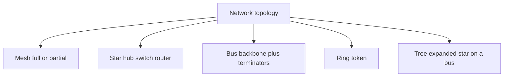
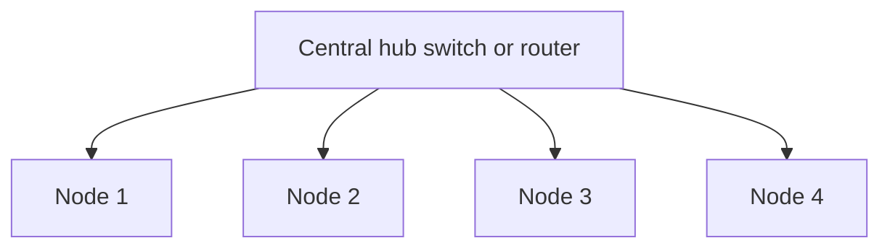
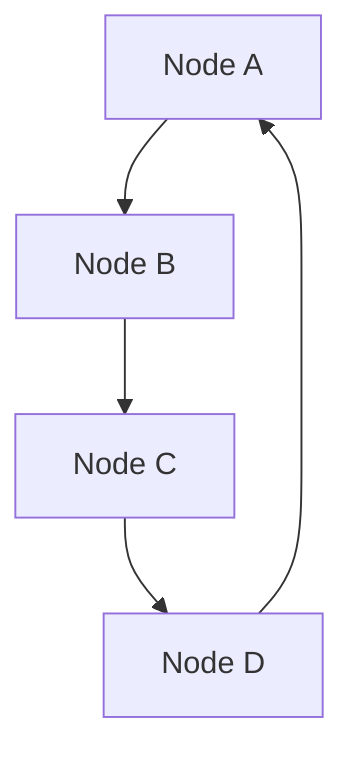

# M15: Network Topologies

**Source:** https://www.youtube.com/watch?v=wwabRIG7MvU
**Instructor / expert:** Dr Navdeep Singh, Department of Computer Engineering, Punjabi University, Patiala

### Learning objectives

- Define a network (nodes, links, distributed processing) and the five criteria: performance, consistency, reliability, recovery, security.
- Distinguish point-to-point from multipoint (spatially vs time-shared) connections.
- Separate physical topology from logical topology.
- Identify mesh (full and partial), star (passive/active/intelligent hub), bus, ring (token), and tree (expanded star), with the advantages and disadvantages taught for each.
- Use those trade-offs to match a topology to a network plan.

### Core concepts

The lecture covers **network types and topologies**: how to **identify basic topologies and variations** and how to **choose an appropriate topology** for a given plan.

A **network** is a set of devices (**nodes**) connected by **communication links**. A node can be a **computer, printer, or any other device** that can **send and receive** data generated by other nodes. Most networks use **distributed processing**: a task is **split among multiple computers** instead of one large machine doing every aspect; **PCs or workstations** handle a subset.

#### Criteria a network must meet

**1. Performance** — rate of transferring **error-free** data, measured as **transit time** and **response time**.

- **Transit time:** time for a **message** to travel from one device to another.
- **Response time:** elapsed time between an **inquiry and a response**.

Depends on **number of users**, **transmission medium**, **hardware capabilities**, and **software efficiency**. Evaluated with two metrics:

- **Throughput:** messages **successfully delivered per unit time**. Controlled by **bandwidth**, **signal-to-noise ratio**, and **hardware limits**. Calculated by **dividing file size by time**, in **Mbps, kbps, or bps**.
- **Delay:** how long a **bit** takes to travel from one node/endpoint to another, in **multiples or fractions of seconds**. Parts: **processing delay** (routers processing the **packet header**); **queuing delay** (time in **routing queues**); **transmission delay** (time to **push the packet’s bits onto the link**); **propagation delay** (time for the **signal to reach** the destination).

We often want **more throughput and less delay**, but they **contradict**: sending **more data** may **raise throughput** and also **raise delay** via **congestion**.

**2. Consistency** — **predictability of response time** and **accuracy of data**. Users like **consistent** response times and develop a feel for **normal** conditions (example: **3 seconds** to print vs **over 30 seconds** signals a **problem**). **Accuracy** decides whether the network is **reliable**; **lost data** destroys **confidence** and users **stop using** the system.

**3. Reliability** — measured by **frequency of failure** (how often the network fails), **recovery time** (time for a device or network to recover), and protection from **catastrophe** (**fire**, **earthquake**).

**4. Recovery** — ability to return to a **prescribed level of operation** after failure, with **lost data nonexistent or minimum**. Based on **backup files**.

**5. Security** — called the **most important aspect for improving network performance**. Threats: **viruses** and **unauthorized access**. Taught practices: **do not open unknown email attachments**; **antivirus** software; **firewalls** to **detect and prevent unauthorized access**; **backup tools** onto **removable media** (CD or zip disk); **turn off the system and unplug the network cable** when unused to avoid **unauthorized interference**.

#### Type of connection

Physical structure = **type of connection** + **topology**.

A **link** is a communications pathway that transfers data from one device to another (visualized as a **line between two points**). For communication, two devices must be connected to the **same link at the same time**. Two connection types:

**Point-to-point** — **dedicated** link between two devices; **entire capacity reserved** for those two. Usually **wire or cable**; also **microwave or satellite**. Changing TV channels with an **infrared remote** is a point-to-point link between remote and TV. Pure examples: **two computers via modems**; **mainframe terminal to front-end processor**; **workstation on a parallel cable to a printer**.

**Multipoint** (also **multi-drop**) — **more than two** devices share **one link**. Capacity is shared **spatially** or **temporally**: **spatially shared** if several devices can use the link **simultaneously**; **time-shared** if users **take turns**.

#### Physical vs logical topology

**Network topology** is the arrangement of **links, nodes, etc.** — the topological structure, depicted **physically or logically**.

- **Physical topology:** placement of components, **device location**, **cable installation**, cabling layout, node locations, interconnections. Determined by **network-access devices and media**, desired **control or fault tolerance**, and **cabling / circuit cost**.
- **Logical topology:** **how data flows** regardless of physical design. Two networks may differ in **distances, physical interconnections, rates, or signal types** yet share a **logical topology**.

**Four basic topologies:** **mesh, star, bus, ring** (tree is taught afterward as a hybrid).

#### Mesh

Every node is interconnected; a node **sends its own signals** and **relays** others. A **true mesh** connects **every node to every other node**. **Very expensive** because of **redundant connections**; **not mostly used** in computer networks; **common in wireless**. **Flooding or routing** is used.

**Fully connected mesh.** Every device has a **dedicated point-to-point** link to every other device (**dedicated** = that link carries traffic **only between those two**). For **n** nodes, each must connect to **n−1** others → **n(n−1)** physical links. If each link is **bidirectional**, divide by two: **n(n−1)/2 duplex-mode links**. Each device needs **n−1 I/O ports**. **Full mesh is used only for backbone networks**.

**Partial mesh.** More practical: some systems are meshed as above; the rest connect to **only one or two** devices — workstations **indirectly** connected. **Less costly**, **less redundancy**.

**Advantages:** data from **different devices simultaneously**; withstands **high traffic**; if one component fails an **alternative** remains so transfer **continues**; **expansion/modification** without disrupting other nodes.

**Disadvantages:** **redundancy** in many connections; **overall cost** much higher than other topologies; **setup, maintenance, and administration** are **difficult**.

#### Star

All components connect to a **central device** called a **hub**, which may be a **hub, router, or switch**. Unlike bus (nodes on a **central cable**), here every workstation has a **point-to-point** link to the center, so every computer is **indirectly** connected to every other via the hub. **All data passes through the center** before the destination. The hub is a **junction**, and it **manages and controls** the whole network. Depending on the device, it can act as a **repeater / signal booster**. The center can also talk to **hubs of other networks**. **UTP Ethernet cable** connects workstations to the central node.

**Hub subtypes:**

| Type | Behavior |
|------|----------|
| **Passive hub** | Simple **signal splitter**; connects the arms while keeping **electrical characteristics**. **Routes all traffic to all nodes** → **heavy load** when many talk; every computer must **read each address** and **discard** frames not for it |
| **Active hub** | Same function **plus electronics that regenerate and retransmit**; can **extend** network size |
| **Intelligent hub** | Passive/active functions plus **informed path selection** and some **network management**. Routes traffic **only to the branch** where the receiver sits; if **redundant paths** exist, can **route around** cable problems. **Routers, bridges, and switches** are examples of hub devices that route **intelligently**. May include **diagnostics** for troubleshooting |

**Advantages vs bus:** **better performance**; signals need not go to **all** workstations; a sent signal reaches the destination after **no more than three or four devices and two or three links**. Performance depends on **central-hub capacity**. **Easy to add/remove** nodes without affecting the rest. **Centralized management** helps monitoring. **Failure of one node or link** does not take down the rest; **easy to detect and troubleshoot**.

**Disadvantages:** **too much dependency** on the center — if it fails, **the whole network goes down**. Hub/router/switch **raises cost**. **Performance and how many nodes can be added** depend on **central capacity**.

#### Bus (linear bus)

**Simplest** topology. All nodes (**computers and servers**) connect to a **single cable** — the **bus** — with **interface connectors**. That cable is the **backbone**. Every workstation talks through this bus. A signal from the source is **broadcast** and travels to **all** workstations; **only the intended recipient** whose **MAC or IP matches** accepts it; others **discard**. A **terminator** at each end of the central cable **prevents bouncing**. A **barrel connector** can **extend** it.

**Advantages:** easy to **set up and extend**; **least cable** compared with other networks; **costs very little**; mostly used in **small networks / LANs**.

**Disadvantages:** **limit** on central-cable length and node count; **dependency on the main cable** — if it fails, **the whole network breaks**; **proper termination is required** to damp signals; **hard to detect and troubleshoot** a fault at an individual station; **maintenance cost can rise** over time; **efficiency falls** as device count rises; **unsuitable for heavy traffic**; **security is very low** because **all computers receive** the sent signal.

#### Ring

Nodes form a **closed loop**. Each workstation connects to **two neighbors** and communicates with those adjacent nodes. Data travels **in one direction**. Send/receive uses a **token**.

**Token:** a piece of information sent **with data** by the source. The next node checks whether the signal is **for it**. If yes, it **receives** and puts an **empty token** back; otherwise it **passes token plus data** onward until the destination. **Only the node holding the token may send**; others **wait for an empty token**. Found in **offices, schools, and small buildings**.

**Advantages:** **organized**; a node sends when it has an **empty token** → **fewer collisions**; traffic in **one direction at very high speed**; under **increasing load**, **better than bus**; **no network server required** to control workstation connectivity; **additional components do not affect performance**; **equal access** to resources.

**Disadvantages:** each packet must pass **all computers between source and destination** → **slower than star**; if **one workstation or port goes down**, the **entire network** is affected; highly dependent on the **wire** connecting components; **MAUs and network cards** are **expensive** compared with **Ethernet cards and hubs**.

#### Tree (expanded star)

**Integrates star and bus.** Star: computers through a **central hub**. Bus: devices on a **common cable**. In **tree**, **several star networks are connected using a bus**. The main cable is like a **tree stem**, stars like **branches**. Also called **expanded star topology**. **Ethernet** is commonly used. Each segment has **dedicated point-to-point wiring** to a central hub.

**Advantages:** used where **star or bus alone cannot scale**; **expansion is possible and easy**; the network can be **divided into segments** that are **easy to manage**; **error detection and correction is easy**; if **one segment is damaged**, **other segments are not affected**.

**Disadvantages:** **relies heavily on the main bus cable** — if it **breaks**, the **whole network is crippled**; more nodes/segments make **maintenance difficult**; **scalability depends on the type of cable used**.

Next lecture (previewed): **types of transmission media**.

### Key terms

| Term | Meaning in this lecture |
|------|-------------------------|
| Node | Computer, printer, or other send/receive device |
| Distributed processing | Split a task across multiple machines |
| Transit vs response time | Message travel time vs inquiry-to-answer delay |
| Throughput | Successful messages per unit time (file size / time) |
| Four delay components | Processing, queuing, transmission, propagation |
| Point-to-point / multipoint | Dedicated pair vs shared link (spatial or time-shared) |
| Physical vs logical topology | Cable/device layout vs how data actually flows |
| Full mesh | \(n(n-1)/2\) duplex links; backbone use |
| Passive / active / intelligent hub | Splitter vs regenerator vs path-selecting (router/bridge/switch) |
| Terminator / barrel connector | Stop bus reflections; extend the bus |
| Token | Permission to send on a ring |
| Tree / expanded star | Stars joined by a bus backbone |

### Lecture takeaways

- Networks are linked nodes doing distributed work; they are judged on performance (throughput vs delay), consistent response, reliability, recovery from backups, and security (antivirus, firewalls, backups, unplug when idle).
- Links are point-to-point (dedicated, including IR remote or satellite) or multipoint (spatial or turn-taking share).
- Physical layout can differ from logical data flow; the taught shapes are mesh, star, bus, ring, and tree.
- Full mesh is \(n(n-1)/2\) duplex links and is for backbones; partial mesh cuts cost; wireless often meshes with flooding or routing.
- Star is easy to grow and troubleshoot but dies with the hub; bus is cheap for small LANs but broadcasts to everyone and dies with the backbone; ring is ordered and collision-light via tokens but one break stops the ring; tree scales star+bus until the stem cable fails.
