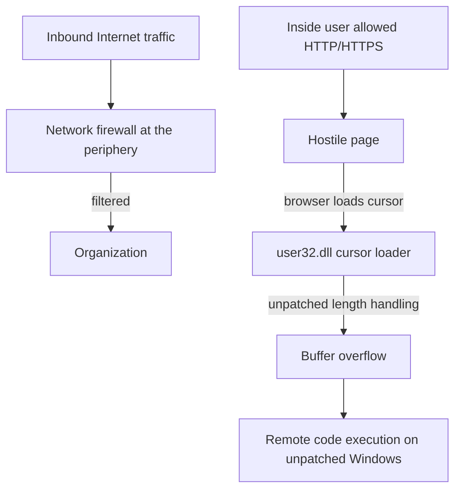

# M16: Animated Cursor Vulnerability — Proof of Concept I

**Source:** https://www.youtube.com/watch?v=I82Pgkv7Awc
**Instructor / expert:** Dr. Maninder Singh, Professor and Dean of Academic Affairs, Thapar University, Patiala (also course coordinator)

### Learning objectives

- Restate **CVE** (Common Vulnerabilities and Exposures) and why a **2007 Windows animated-cursor** flaw is still taught.
- Distinguish a **client-side attack** from traffic a **perimeter firewall** can filter.
- Define **remote code execution (RCE)** as unauthorized code running on someone else's machine.
- Explain at a concept level that Windows loads variable-size **`.ANI`** cursors via **`user32.dll`**, and that a malformed cursor can cause a **buffer overflow**.
- Name the lecture's defensive close: **patch** legacy systems; study **client-side attacks** and **buffer overflow**.

### Core concepts

The previous lecture introduced **CVE** — **Common Vulnerabilities and Exposures**. This module applies that idea to a real Windows flaw: the **animated cursor vulnerability**.

#### What an animated cursor is

Windows ships many mouse pointers. Examples given:

| Cursor | Character in this lecture |
|--------|---------------------------|
| I-beam (“I”) | Text caret in Notepad; small, not an animation |
| Hourglass | Animated sand falling from one bulb to the other |
| Horse-riding pointer | Larger animated cursor |

Animated pointers **differ in file size**. Loading them was implemented in **`user32.dll`**.

#### Public description of the flaw

A public write-up states that the issue can be triggered from a **malicious web page** and can result in **remote code execution**:

- **Malicious web page** — a site the *user* chooses to visit that hosts hostile content.
- **Remote code execution** — running code on another person's machine **without proper authorization**. The lecture treats RCE as an attacker's “ultimate goal”: steal information or otherwise act as the victim.

#### Client-side attack versus the network firewall

Organizational security is often implemented at the **periphery**. A **network firewall** filters traffic *entering* the organization.

That model fails when someone **inside** browses a hostile site. Most organizations **allow outbound HTTP and HTTPS**. If the destination page hosts a malicious cursor, the visitor can be compromised. That pattern is a **client-side attack**: the client approaches the attacker.

#### Why a 2007 bug is still taught

The vulnerability was **discovered in 2007**. **Legacy systems** still run old, unpatched operating systems. Affected families named: **Windows XP**, **Windows 2000**, and **Windows Vista**.

The demonstration is framed as an **isolated lab** (hypervisor host, a Linux web role, a Windows XP browser role) so students can *see* that a page which merely **assigns a CSS cursor** can make Internet Explorer **load a `.ANI` file**. The file format is **RIFF** (`52 49 46 46`). A **buffer overflow** in the loader can overwrite the **instruction pointer (EIP)** — the diagnostic that attacker-controlled data became the next-instruction address.

The lecture stresses two constraints that matter for *defenders* as well as for understanding the bug class:

- The file must remain a **recognized cursor** (the **RIFF** header must stay intact or the loader rejects it).
- Control of EIP is the classic **buffer-overflow** observation: if the next-instruction address is attacker-controlled, **arbitrary / remote code execution** becomes possible.

#### Closing assignment

Study **client-side attacks** and **buffer overflow**. The avoidance taught here is **patching** the OS so the cursor loader no longer overflows.

### Key terms

| Term | Meaning in this lecture |
|------|-------------------------|
| CVE | Common Vulnerabilities and Exposures — catalog of named flaws |
| Animated cursor / `.ANI` | Variable-size Windows pointer animation, loaded through `user32.dll` |
| RIFF | File header that identifies an animated cursor |
| Network firewall | Perimeter filter for *inbound* traffic; does not stop a user who *goes out* to the web |
| Client-side attack | Compromise that starts because the insider visits a hostile page |
| Remote code execution | Running code on another machine without authorization |
| EIP | Instruction pointer; overflow target in the demonstration |
| Patch | The stated way to avoid the flaw on systems that still run the old loader |

### Lecture takeaways

- Perimeter firewalls do not stop **client-side** browsing of a page that hosts a malicious cursor.
- The 2007 animated-cursor bug is a **buffer overflow in the Windows cursor loader** (`user32.dll`) that can yield **RCE** on **unpatched XP / 2000 / Vista**.
- A page need only **assign a CSS cursor URL** to a crafted **RIFF `.ANI`**.
- Overflow that **overwrites EIP** is the diagnostic that attacker-controlled data became the next-instruction address.
- **Patch** legacy systems; study client-side attacks and buffer overflow.
