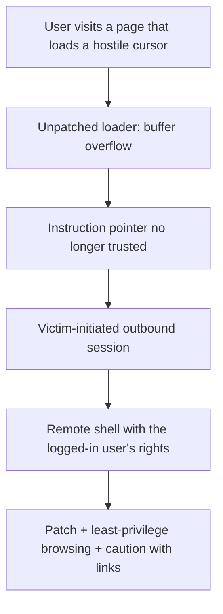

# M17: Animated Cursor Vulnerability — Proof of Concept II

**Source:** https://www.youtube.com/watch?v=DhcLjc4adPk
**Instructor / expert:** Dr. Maninder Singh, Professor and Dean of Academic Affairs, Thapar University, Patiala (also course coordinator)

### Learning objectives

- Continue the animated-cursor demonstration conceptually: after EIP is attacker-controlled, execution can be redirected using instructions **already mapped** in system DLLs.
- Contrast **bind** vs **reverse** remote-shell *models* as firewall-relevant ideas (inbound listen vs victim-initiated outbound).
- Recite the **defensive lessons actually taught**: browse with **least privilege**, treat unexpected email links as client-side lures, **patch / hotfix** from **cve.mitre.org**, and see **malware / ransomware** as the next threat category.

### Core concepts

Lecture I stopped after showing that a malformed `.ANI` can overwrite **EIP**. This session extends the same **Internet Explorer + crafted cursor** demonstration on **Windows XP** to show how **buffer overflow** plus a **malicious web page** can yield **remote access** — and then how to **think about stopping it**.

#### Reusing mapped library code

Memory holds the browser process **and many DLLs** (`user32.dll`, `shell32.dll`, `kernel32.dll`, `ntdll`, …). The lecture's *idea* (not a recipe) is that once EIP is attacker-controlled, it can be pointed at an instruction **already present** in a loaded module so the CPU **enters the overflowed buffer**. Registers are inspected in a debugger because there is **no fixed map** of where a variable-size cursor lives; a large animation may sit on a **heap** reached by a **pointer-to-pointer**. **Byte order** (little-endian / host vs network) is mentioned because multi-byte addresses in a file are stored reversed from how humans write them.

#### Shell models and the firewall you already allow

**Shellcode** is defined as instructions that, if they run, give a **command interpreter** on the remote machine. Two delivery *ideas* are distinguished as **firewall-relevant models**:

| Model | Idea as taught | Why it matters to a defender |
|-------|----------------|------------------------------|
| **Bind** | Victim listens; outsider connects *in* | Needs an inbound path the perimeter often blocks |
| **Reverse** | Victim connects **out** to the other party, carrying the shell | Uses a connection the victim **initiates** — the same class of outbound HTTP/HTTPS organizations already allow |

The demonstration's lesson is that a **user-initiated outbound** session can carry a remote shell, and that **killing the browser does not necessarily drop** that session. **`netstat`** on the victim would show an **ESTABLISHED** outbound TCP connection after the URL was opened.

#### Privilege of the logged-in user

If the captured shell is **Administrator**, it is because the user **surfed as Administrator**. Explicit **security rule**: browse the Internet with **minimal privilege**. If a cursor (or any other) bug runs, the attacker inherits **the logged-in user's rights**. Administrative browsing turns one client-side bug into **full machine control**.

#### Email and the firewall you cannot use

A second **attack vector** is **social**: a lottery / prize email whose **link** is a page like the lab's. The user **clicks on purpose**. **No firewall in the world** can treat that as hostile in the same way as unsolicited inbound packets: it is **legitimate outbound HTTP/HTTPS**.

#### Where to look up flaws; what unpatched bugs cost

**cve.mitre.org** lists vulnerabilities for **Windows, Linux, Mac, and custom OS**. If a flaw is **not patched** / no **hotfix** is applied, outcomes named here are:

- Remote code execution (as demonstrated)
- Data theft
- Compromise of **critical infrastructure** if the OS sits on a **SCADA**-class system

The advisory language cited: this **CVE-2007** animated-cursor issue exposes **Windows XP, Windows 2000, and Windows Vista**.

#### Software, hardware, firmware — and malware

Beyond the old triad **software / hardware / firmware**, the lecture adds **malware**: software that **damages** the system. Related coinages: **malvertising** (malware delivered via advertisement). A then-current example: **CryptoWall** — encrypt the victim's data and demand money to unlock it: **ransomware**. Later course topics promised (not taught in this hour): ransomware, CryptoWall, **viruses, worms, Trojans**.

### Key terms

| Term | Meaning in this lecture |
|------|-------------------------|
| Mapped DLL | Code already in the process (`user32` and others) that overflow control can be aimed at |
| Bind vs reverse shell | Inbound listen vs victim-initiated outbound — the latter matches allowed web traffic |
| Least privilege | Do not browse as Administrator; the attacker inherits the logged-in token |
| cve.mitre.org | Public CVE catalog; patch/hotfix against listed issues |
| Malware / ransomware / CryptoWall | Harmful software; CryptoWall encrypts files and extorts payment |
| Malvertising | Advertisement channel used to push malware |

### Lecture takeaways

- After EIP is untrusted, execution can be steered using **code already in system DLLs**; the defender's answer is still **patch the loader**.
- **Reverse** connections piggyback on **user-initiated outbound** paths that firewalls already allow for the web.
- **Administrator browsing** makes a client-side bug a full compromise; **least privilege** is the taught countermeasure on the endpoint.
- **Lottery-style email links** are the same client-side pattern: the user **asks** to fetch the page.
- Track flaws on **cve.mitre.org** and **patch / hotfix**; unpatched loaders on XP/2000/Vista (CVE-2007 animated cursor) were the worked example.
- The course next frames **malware** (including **ransomware / CryptoWall**) as a fourth companion to software, hardware, and firmware.
