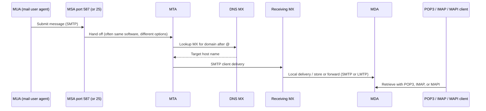

# M18: Electronic Mail

**Source:** https://www.youtube.com/watch?v=DXGMUDoZZaA
**Instructor / expert:** Prof. Yogesh Chaba, Department of Computer Science and Engineering, Guru Jambheshwar University of Science and Technology, Hisar (course coordinator: Dr. Maninder Singh, Thapar University, Patiala)

### Learning objectives

- Define **email** as store-and-forward digital messaging and list its **five basic functions**.
- Split an email system into **user agents (UA)** and **message transfer agents (MTA)** and match them to **RFC 822 / MIME** versus **SMTP**.
- Describe **RFC 5322** headers (To, Cc, Bcc, From, Sender, Received, Return-Path, and UA fields) and **MIME** headers and body hierarchy.
- Trace **SMTP** submission, **MX** lookup, and the **MAIL / RCPT / DATA** transaction.
- Contrast **POP3**, **IMAP**, and **MAPI** as message-*reading* protocols.

### Core concepts

The lecture's outline: introduction → **message format** → **SMTP** → reading protocols **POP3, IMAP, MAPI**.

#### Email as a system

**Email** (electronic mail) is **digital messages** sent and received over the **Internet** (or other networks), from **one sender to one or more recipients**.

Early systems required **author and recipient online at the same time**. Today's systems use **store-and-forward**: servers **accept, forward, deliver, and store** messages. Neither users nor their computers need to be online together.

##### Five basic functions

| Function | Role |
|----------|------|
| **Composition** | Creating messages and replies. Any text editor can write the body; the system helps with **addressing** and **header fields**. |
| **Transfer** | Moving the message from originator to recipient. |
| **Reporting** | Telling the originator what happened: **delivered, rejected, or lost**. |
| **Displaying** | Presenting incoming mail so people can read it. |
| **Disposition** | What the recipient does next: discard unread, discard after reading, **save**, and similar. |

##### Two subsystems

| Subsystem | What it is | Protocols named here |
|-----------|------------|----------------------|
| **User agent (UA)** | Local program to **compose and read**; command-line, menu, or GUI | Formatting: **RFC 822** and **MIME** (first proposed in **RFC 1341**). Reading: **POP3, IMAP, MAPI** |
| **Message transfer agent (MTA)** | Background **daemons** that move mail through the network | **SMTP** (Simple Mail Transfer Protocol) |

#### Message format: RFC 5322 and MIME

Internet mail format is **RFC 5322**, with multimedia attachments in **RFC 2045–2049**, collectively **MIME** (Multipurpose Internet Mail Extensions).

Lineage as taught:

- **RFC 822** was the Internet email standard for nearly 20 years.
- **RFC 2822** (2001) replaced RFC 822.
- **RFC 5322** (2008) replaced RFC 2822.

A message has two major sections, separated by a **blank line**:

- **Header** — structured fields: From, To, Cc, Subject, Date, and other envelope-ish metadata.
- **Body** — unstructured text, sometimes ending in a **signature block**.

RFC 822-era messages sit in a primitive **envelope** (described with **RFC 821**) plus header fields, blank line, then body. Each header field is logically **one line of ASCII**: **field name, colon, value**. RFC 822 **did not cleanly separate envelope fields from header fields**.

##### Transport-related header fields

| Field | Meaning in this lecture |
|-------|-------------------------|
| **To** | DNS address of the **primary** recipient(s); multiple allowed |
| **Cc** | **Secondary** recipients. For **delivery**, primary and secondary are **not distinguished** |
| **Bcc** (blind carbon copy) | Like Cc, but this line is **deleted** from copies sent to primary and secondary recipients |
| **From** | Who **wrote** the message |
| **Sender** | Who **sent** it — need not be the same person as From |
| **Received** | Added by **each MTA**; agent identity, date/time received, extra data for **routing debugging** |
| **Return-Path** | Added by the **final MTA**; how to get back to the sender |

##### User-agent / human header fields

| Field | Meaning |
|-------|---------|
| **Date** | Date and time the message was sent |
| **Reply-To** | Address that replies should use |
| **Message-ID** | Unique id for later reference |
| **In-Reply-To** | Message-ID of the message this replies to |
| **References** | Other relevant Message-IDs |
| **Keywords** | User-chosen keywords |
| **Subject** | One-line summary |

##### Why MIME exists

Early mail was **English ASCII text**. RFC 822 specified **headers** and left **body content** to users. That is not enough when senders attach **audio, image, text, video**. The fix was **RFC 1341**, updated as **RFC 2045–2049** (**MIME**), now widely used.

##### Five MIME header fields

| Header | Role |
|--------|------|
| **MIME-Version** | Tells the receiving UA this is MIME, and **which version** |
| **Content-Description** | ASCII string saying **what is in** the message |
| **Content-ID** | Identifies the content |
| **Content-Transfer-Encoding** | How the body is **wrapped** for networks that object to characters beyond letters, digits, and punctuation |
| **Content-Type** | **Type/subtype** separated by a slash (example: **`video/mpeg`**) |

**Content-Type** types listed: **text, image, audio, video, application, message, multipart**.

##### MIME body as a hierarchy

A MIME body is **parts in a tree**. At the top is the **root** body part (labeled **R** in the slide). Parts that contain other parts are **descendants**.

Example from the figure:

- Direct descendants **A1** and **A2**.
- **A1.1** and **A1.2** contain no further parts → **content body parts** (actual payload: plain text, an attachment, an HTML page, …).
- **A1** and **A2** as containers → **multipart body parts**.

#### SMTP: transferring messages

The message transfer system **relays** from originator to recipient. The simplest picture: a **transport connection** from source machine to destination, then send the message.

**SMTP** is the Internet standard for email transmission:

- First defined by **RFC 821** (1982) (ASR: “RFC a21”).
- Updated in **2008** as **extended SMTP (ESMTP)** in **RFC 5321** — the protocol used worldwide in this lecture.

SMTP is **connection-oriented** and **text-based**: the sender issues **commands** and supplies data over a **reliable, ordered** stream, typically **TCP**.

##### Mail processing model

Details as taught:

- The **MUA** submits to an **MSA** (mail submission agent) with SMTP on TCP **port 587**. Many mailbox providers still allow submission on traditional **port 25**.
- The MSA delivers to an **MTA**. MSA and MTA are often **two instances of the same software** with different launch options on one machine.
- The **boundary MTA** finds the target via **DNS MX** (mail exchanger) for the recipient **domain** (right of **`@`**). The MX record names the target host.
- The MTA connects to that MX as an **SMTP client**. The MX hands the message to an **MDA** (mail delivery agent) for **local delivery** into the mailbox format.
- Reception can use **many computers or one**. An MDA may store locally or **forward** with SMTP or **LMTP** (Local Mail Transfer Protocol) — an SMTP **derivative** for this hop.
- End-user **email clients** retrieve with **IMAP, POP3, or MAPI** (next section).

##### SMTP session and transaction

A **session**: commands from the SMTP **client** (sender) and responses from the SMTP **server** (receiver). The session opens, **parameters are exchanged**, and it may contain **zero or more transactions**.

A **transaction** is **three command/reply sequences**:

| Command | Role |
|---------|------|
| **MAIL** | Establish **return address / return path / bounce address / envelope sender** — where **bounce** messages go |
| **RCPT** | One recipient; **may be issued multiple times**; these addresses are also **envelope** data |
| **DATA** | **Header + body** separated by an **empty line** |

#### Protocols for reading mail

Interaction between servers and clients is governed by **email protocols**. The three most common **reading** protocols: **POP3**, **IMAP**, **MAPI**. Most client software uses one of these.

##### POP3 (Post Office Protocol version 3)

Basic procedure: **retrieve all inbound messages to the client, delete them on the server, disconnect**. The user pulls mail from the **ISP's MTA**.

Specifications:

- Described in **RFC 1939** (current); originated in **RFC 1081**.
- Extension mechanism **RFC 2449** (ASR: “RFC 249”).
- Authentication mechanism **RFC 1734**.

POP3 starts when the mail reader opens a **TCP** connection to the MTA on **port 110**. Then **three states in order**:

| State | What happens |
|-------|----------------|
| **Authorization** | User **logs in** |
| **Transaction** | User **collects** messages and **marks** them for deletion |
| **Update** | Marked messages are **actually deleted** |

This can be observed with **Telnet** to `mail.isp.com` **port 110** (DNS name of the ISP mail server). After the TCP accept, the server sends an **ASCII banner**. The client sends **username and password**. After login:

- **LIST** — one line per message with **length**; list ends with a **period**.
- **RETR** (ASR: “RR”) — retrieve a message.
- **DELE** — mark for deletion.
- **QUIT** — leave Transaction, enter **Update**; server deletes, replies, **breaks TCP**.

##### IMAP (Internet Message Access Protocol)

POP3 is **simple and robust** when mail is always read from **one PC**. It fails when the user needs mail from **other computers**. That gap produced **IMAP**.

- Defined in **RFC 2060**.
- Current **IMAP version 4**: **RFC 3501**.

IMAP is newer and **connection-oriented**. The standard procedure is to **leave messages on the server** rather than treating the client copy as primary. Mail is typically available **only when online**. Client copies are allowed, but in an **inversion of POP3** the **server copies are the real ones**. **Security benefit:** you do not **lose mail** if the client disk fails.

An IMAP server listens on well-known **port 143**.

Further IMAP facilities taught:

- Read **messages or parts** of messages (important with large **audio/video** attachments).
- Assumption: messages are **not** transferred to the PC for permanent storage.
- **Create, destroy, and manipulate multiple mailboxes** on the server (e.g. one mailbox per correspondent; move from Inbox after reading).

##### MAPI (Messaging Application Programming Interface)

**MAPI** is a **proprietary Microsoft** protocol used by **Outlook** to talk to **Microsoft Exchange**. It offers **somewhat more functionality than IMAP**, but **only** for Outlook ↔ Exchange.

#### Recap order in the lecture

Introduction of email → message format (RFC 5322 / MIME) → SMTP → POP3, IMAP, MAPI.

### Key terms

| Term | Meaning in this lecture |
|------|-------------------------|
| Store-and-forward | Servers accept, forward, deliver, and store; parties need not be online together |
| User agent (MUA/UA) | Local compose/read program |
| MTA / MSA / MDA | Transfer, submission, and delivery agents in the SMTP path |
| MIME | RFC 2045–2049: types, encodings, multipart body tree |
| RFC 5322 | Current Internet message format (via RFC 822 → 2822 → 5322) |
| SMTP / ESMTP | RFC 821 then RFC 5321 (2008); MAIL, RCPT, DATA on TCP |
| MX record | DNS mail exchanger for the domain after `@` |
| LMTP | Local Mail Transfer Protocol — SMTP derivative for MDA hop |
| POP3 | Port 110; download-and-delete; AUTH / Transaction / Update |
| IMAP4 | Port 143; server-resident mail; multiple mailboxes |
| MAPI | Microsoft Outlook–Exchange proprietary protocol |

### Lecture takeaways

- Modern email is **store-and-forward** with five functions: compose, transfer, report, display, dispose.
- **UAs** format with **RFC 822/5322 + MIME**; **MTAs** move mail with **SMTP**.
- MIME added **typed, hierarchical bodies** so mail is more than ASCII English.
- SMTP submission is **587** (still often **25**); routing uses **DNS MX**; a transaction is **MAIL, RCPT, DATA**.
- **POP3** pulls and typically **deletes** on the server; **IMAP** keeps the **server copy as truth** and supports folders and partial fetch; **MAPI** is Outlook/Exchange only.
