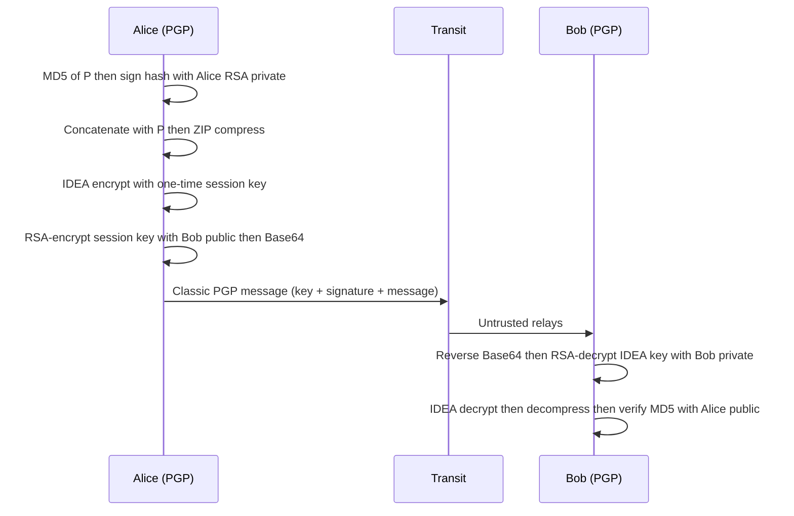

# M19: Email Security Protocols

**Source:** https://www.youtube.com/watch?v=0PUVjKXOiV8
**Instructor / expert:** Prof. Yogesh Chaba, Department of Computer Engineering and IT, Guru Jambheshwar University of Science and Technology, Hisar (course coordinator: Dr. Maninder Singh, Thapar University, Patiala)

### Learning objectives

- Explain why ordinary email is compared to a **postcard**, not a sealed letter, including **transit and at-rest** inspection and **cross-border** legal complexity.
- Describe **PGP** (and **OpenPGP**) as hybrid encryption plus signatures, compression, and the taught **RSA key-length** choices.
- Outline **PEM** (RFC 1421–1424): canonicalization, hash, DES, one-time keys, **X.509** hierarchy — and **why it was never deployed**.
- State **S/MIME** services and its **multiple trust anchors** versus PEM's single root.
- Compare **S/MIME v3** and **OpenPGP** as the two systems the lecture treats as currently used.

### Core concepts

Outline: email-security introduction → **PGP**, **PEM**, **S/MIME** → comparison.

#### Why email privacy is hard

Since about **1993**, “email” is the common name for exchanging digital messages over the Internet or other networks.

**Email privacy** covers **unauthorized access and inspection**:

- while the message is **in transit**, and
- while it is **stored** on a server or user computer.

Mail crosses **potentially untrusted intermediate servers**. There is **no inherent way to tell** if an unauthorized party read it. Unlike a **sealed letter** (where the envelope might show tampering), email is like a **postcard**: contents are visible to everyone who handles it.

Cryptography can make unauthorized access **difficult if not impossible**, but messages often **cross national borders** with **different rules**, so privacy is **legally as well as technically** complicated. That problem drove **PGP**, **PEM**, and **S/MIME**.

#### PGP — Pretty Good Privacy

**PGP** is a **public-key encryption program** originally written by **Phil Zimmermann** in **1991**. It became a **de facto standard** for encrypting Internet email: a complete package for **privacy, authentication, digital signatures, and compression**, easy to use, with **source code free** on the Internet, on **Unix, Linux, Windows, and Mac**.

##### Confidentiality (hybrid encryption)

The message is encrypted with a **symmetric** algorithm under a **one-time session key**. The session key travels with the message, itself encrypted under the **receiver's public key**. Only the receiver's **private key** unwraps the session key.

##### Authentication and integrity

- **Integrity:** detect whether the message changed after it was finished.
- **Authentication:** determine whether it came from the claimed sender.

Because content is encrypted, **changes cause decryption to fail** with the proper key.

For a **digital signature**, PGP hashes the plaintext (**message digest**) and signs that hash with the **sender's private key**, using **RSA or DSA**.

##### Worked Alice → Bob flow (as taught)

Both have **RSA** private/public keys **d** and **e**; each knows the other's public key. Alice wants to send signed plaintext **P** to Bob securely:

1. Hash **P** with **MD5**; encrypt that hash with Alice's **RSA private key** → signed hash.
2. Concatenate signed hash with **P** → **P1**; **ZIP**-compress → **P1.Z**.
3. On receipt, Bob uses **IDEA** (International Data Encryption Algorithm) to decrypt; decompresses; separates plaintext from encrypted hash; decrypts the hash with **Alice's public key**.
4. If Bob's own **MD5** of the plaintext **matches**, **P** is correct and from Alice.
5. Bob also reverses **Base64** encoding and decrypts the **IDEA** key with **his RSA private key**.

**RSA is used only twice:** to protect the **128-bit MD5 hash** and the **128-bit IDEA key** (256 bits total). RSA is slow, so limiting it to those small blocks is how PGP stays **efficient** while providing **security, compression, and signatures**.

##### RSA key lengths (user's choice)

| Label | Bits | Lecture claim |
|-------|------|----------------|
| Casual | 384 | Can be broken easily today |
| Commercial | 512 | Breakable by a “three-letter organization” |
| Military | 1024 | Not breakable by anyone on Earth |
| Alien | 2048 | Not breakable by anyone on other planets either |

Because RSA only wraps two small values, the instructor says **everyone should use Alien-strength keys all the time**.

##### Classic PGP message layout

Three parts (other formats exist):

| Part | Contents taught |
|------|-----------------|
| **Key** | Key **identifier** and the **IDEA key** itself |
| **Signature** | Signature header, **timestamp**, identifier of the **sender's public key** that decrypts the signed hash, **algorithm type** fields, **encrypted MD5 hash** |
| **Message** | Header, **default filename** if the receiver writes to disk, **creation timestamp**, then the message |

#### OpenPGP

**OpenPGP** is described as the **most widely used email-encryption standard** at the time of the lecture. It is defined by the **IETF OpenPGP Working Group** in **RFC 4880** (ASR: “RFC 480”). The **OpenPGP Alliance** is implementers working on **interoperability and marketing synergy**. RFC 4880 is said to contain what is needed to **read, check, generate, and write** conforming encrypted messages, keys, and signatures.

History taught:

- **July 1997:** PGP Inc. proposed an IETF standard named **OpenPGP**; IETF accepted and started the working group. OpenPGP is on the **Internet standards track**.
- Original PGP spec: **RFC 1991**.
- Current OpenPGP spec: **RFC 4880** (2007 successor of **RFC 2440**, ASR “RFC 24”).
- **RFC 5581** (2009): **Camellia** cipher (ASR: “RFC 581”, “Chamelia”).
- **RFC 6637** (2012): **elliptic-curve cryptography** (ASR: “RFC 637”).

OpenPGP encryption can **secure delivery of files and messages** and **verify who created or sent** them (**digital signing**). **Both sender and recipient must participate**. It can also protect **files at rest** on **mobile devices or in the cloud**.

#### PEM — Privacy-Enhanced Mail

Unlike PGP's “one-man show,” **PEM** is an **official Internet standard**: **RFC 1421 through RFC 1424**. A **1993 IETF** proposal for securing email with **public-key cryptography**. It covers roughly the same ground as PGP — **privacy and authentication for RFC 822 mail** — with different **approach and technology**. It grew from the **Privacy and Security Research Group (PSRG)** of the **IRTF**.

Processing taught:

1. Convert to a **canonical form** (same whitespace conventions: tabs, spaces).
2. Hash with **MD2 or MD5**.
3. Concatenate hash and message; encrypt with **DES**. The lecture flags a **56-bit key** as **suspect** given known weakness.
4. Optionally **Base64**-encode for transmission.
5. Like PGP, each message uses a **one-time key** carried with the message, protected with **RSA** or **Triple DES in EDE** mode.

**Key management** is more structured than PGP: keys certified by **X.509 certificates** from a **CA**, in a **rigid hierarchy** under a **single root**. Advantage: **revocation** via root-issued **CRLs**. 

**Nobody used it** — “gone to that big bit-bin in the sky.” It became a **proposed standard** but was **never widely deployed**. The lecture's reasons:

- **Political:** who operates the **root**, and on what terms? Many candidates; little trust in **any one company** for the whole system.
- **RSA Security, Inc.** wanted to **charge per certificate**. The **US government** may use US patents **free**; companies **outside the US** were used to RSA **for free** (not patented outside the US). Nobody wanted to start paying. **No root could be agreed**, and PEM collapsed.
- Commentators also rejected a **single-rooted hierarchy** as **central authority**. That led Zimmermann to propose the **web of trust** as PGP's **PKI**.
- Deployment was abandoned when the protocol needed **MIME**; that led to **MOSS** (MIME Object Security Services) and **S/MIME**, which **share de facto standard status with PGP**.

PEM's **basic idea** (IETF, long working group): privacy via **hierarchical authentication**. A receiver trusts a sender's message when it carries a certificate from a **trusted authority**. Certificates are distributed via **IPRA** (Internet Policy Registration Authority) and **PCA** (Policy Certification Authority), which **certify senders' public keys**.

#### S/MIME — Secure MIME

IETF's next email-security venture: **S/MIME**, **RFC 2632 through RFC 2643**.

Reminder: messages have **RFC 822** headers (field/value pairs for transmission) and a body that is unstructured unless **MIME**. MIME structures the body for **enhanced text, graphics, audio**, etc. **MIME itself provides no security.** S/MIME **defines those services**.

Like PEM, S/MIME provides **authentication, data integrity, secrecy, and non-repudiation** (ASR: “known reputation”). It is **flexible** across cryptographic algorithms. New **MIME headers** hold, for example, **digital signatures**. S/MIME **adds signatures and encryption** to Internet MIME messages.

Lesson from PEM: S/MIME does **not** use a **rigid single-root** certificate tree. Users may have **multiple trust anchors**; a certificate is valid if it **chains to some anchor the user believes**. It uses **standard algorithms and protocols**.

(Application-layer email security is also mentioned as **PGP** and **S/MIME** in the WWW-security lecture; here they are fully specified.)

#### Comparison (as presented)

PEM **collapsed**. **PGP** and **S/MIME** — adopted as Internet-related standards; the lecture also calls them **NIST-specified** — are the two **official / currently used** secure-mail techniques. There has been **confusion in public and even in the IETF** about the status of S/MIME versus PGP.

The slide compares **S/MIME version 3** and **OpenPGP**: similar **user-facing services**, different **formats** (like **GIF versus JPEG**): users of one **cannot communicate** with users of the other or **share authentication certificates**.

| Topic | S/MIME v3 (lecture table) | OpenPGP (lecture table) |
|-------|---------------------------|-------------------------|
| Message / CMS packaging | Binary; **CMS** MIME encapsulation of signed data | Contrasted packaging (including PKCS #7 / MIME / ASCII-oriented forms as on the slide) |
| Certificates | **Binary X.509v3** | Classic **PGP** certificates |
| Key agreement / signatures | **Diffie–Hellman** with **DSS or RSA** | **ElGamal** with **DSS** |
| Hash | **SHA-1** | **SHA-1** |

### Key terms

| Term | Meaning in this lecture |
|------|-------------------------|
| Postcard model | Email visible to every relay; unlike a sealed envelope |
| PGP | Zimmermann 1991; IDEA + RSA + MD5 + ZIP + signatures; free, multi-OS |
| Session key | One-time symmetric key; RSA wraps it for the recipient |
| Alien-strength RSA | 2048-bit; recommended for all PGP use here |
| OpenPGP | IETF RFC 4880 (from RFC 1991 / 2440); Camellia RFC 5581; ECC RFC 6637 |
| PEM | RFC 1421–1424; DES; X.509 single-root CA; CRLs; unused |
| Web of trust | PGP's PKI answer to PEM's central root |
| IPRA / PCA | Policy authorities in the PEM certificate story |
| MOSS | MIME Object Security Services — post-PEM MIME security effort |
| S/MIME | RFC 2632–2643; MIME + crypto; multiple trust anchors |
| Non-repudiation | S/MIME service listed with authentication, integrity, secrecy |

### Lecture takeaways

- Unprotected email is a **postcard** on untrusted servers; cryptography is necessary but **jurisdiction** makes privacy messy.
- **PGP** hybridizes **IDEA** (bulk) and **RSA** (tiny hash and session-key blobs), with **ZIP**, **MD5** signatures, and a strong push to **2048-bit** RSA.
- **OpenPGP** (RFC 4880) is the interoperable IETF form; both parties must run it; it also protects **stored** files.
- **PEM** matched PGP's goals with a **single X.509 root** and **DES**, and **died** on root politics, patent fees, and MIME.
- **S/MIME** keeps PEM-like services but allows **many trust anchors** and lives **inside MIME**.
- **S/MIME v3** and **OpenPGP** both secure mail; **certificates and encodings differ**, so they do not interoperate.
