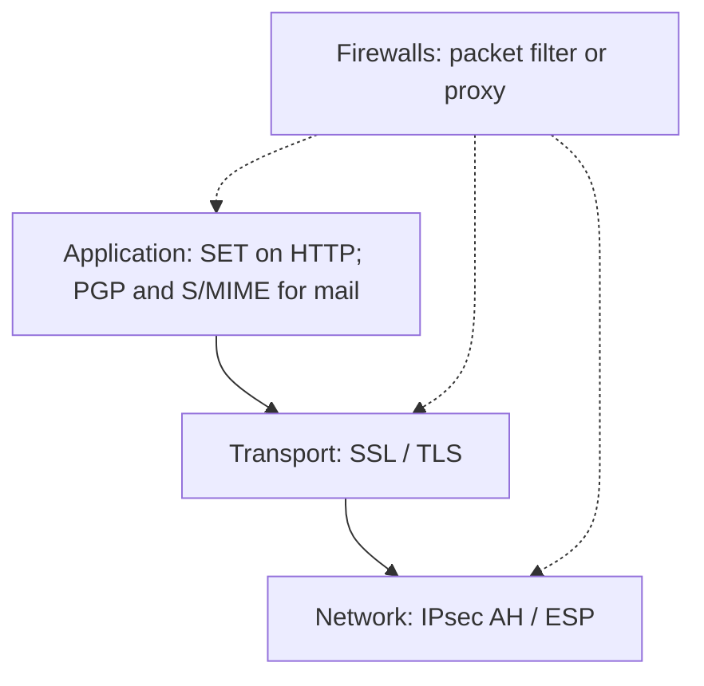

# M20: WWW Security

**Source:** https://www.youtube.com/watch?v=4t3ot0oUah0
**Instructor / expert:** Dr. Gursimran Singh, Doaba College, Jalandhar (course coordinator: Dr. Maninder Singh, Thapar University, Patiala)

### Learning objectives

- Explain why the **WWW** as a **client–server TCP/IP** application creates security problems that traditional publishing did not.
- Group Web threats as **passive vs active** and as **integrity, confidentiality, authentication, and DoS**, with the lecture's consequences and countermeasures.
- Place Web security in the stack: **IPsec** (network), **SSL/TLS** (transport), **SET / PGP / S/MIME** (application), plus **firewalls**.
- Distinguish IPsec **transport vs tunnel** mode and **AH vs ESP**.
- Outline **SSL/TLS**'s four protocols and **SET**'s card-payment properties.
- Classify **packet-filter** (static/stateful) and **proxy / application-gateway** firewalls, including the lecture's filter-table examples.

### Core concepts

**Gursimran Singh** frames **World Wide Web security**. The WWW is called one of the biggest inventions and the world's largest information resource: information **anywhere, anytime, in any format**. It contributes to **globalization of production and capital markets** by cutting information and communication cost, and it is a breeding ground (ASR: “producing ground”) for **e-business** that sells and serves over the Internet.

Technically the Web is a **client–server application** on **Internet / TCP/IP**. Information is stored as **web pages**; a **web browser** retrieves them. **Online banking and transactions** need special attention. The Web poses challenges **not always appreciated** in ordinary computer and network security.

#### Why the Web is a hard target

- The Internet is **two-way**, unlike traditional publishing, teletext, voice response, or fax-back.
- Sites are **vulnerable to attacks on web servers over the Internet**.
- The Web is a **highly visible** outlet for **corporate and product information** and a **platform for business transactions**. **Reputation and money** are at stake if servers are attacked.
- Servers are **easy to use, configure, and manage**, and content is easy to develop, but **underlying software is extraordinarily complex** and can **hide flaws**. History is full of **new or upgraded systems**, “properly” installed, that were still **attackable**.
- A subverted server can be a **launching pad** into the rest of a corporation or agency: the attacker reaches **data and systems not part of the Web itself** but **connected on the local site**.
- **Casual, untrained** users of Web services often **do not know the risks** and lack tools for **countermeasures**.

#### Threat taxonomy

Threats are grouped as **passive** and **active**:

- **Passive:** eavesdropping on browser–server traffic; gaining **restricted** site information.
- **Active:** impersonating another user; **altering messages** in transit; **altering information on a website**.

The “main WWW security threats” are then briefed as **integrity, confidentiality, authentication, and denial of service**.

| Threat | Main examples taught | Consequences | Countermeasures taught |
|--------|----------------------|--------------|------------------------|
| **Integrity** (keep data intact) | Modification of user data; **Trojan-horse browser**; modification of **memory**; modification of **message traffic in transit** | Loss of information; **compromised machine**; exposure to **all other threats** | **Cryptographic checksums / SSL** (ASR: “cryptograph traffic check SS”) |
| **Confidentiality** | Eavesdropping; theft from **server** or **client**; leakage of **network configuration** and of **who talks to whom** | Loss of information; **loss of privacy** | **Encryption** and **web proxies** |
| **Authentication** | Impersonating legal users; **data forgery** | Misrepresentation; users **believe false information is valid** | **Cryptographic techniques** |
| **Denial of service** | Killing user **threads**; flooding with **bogus requests**; filling **disk or memory**; isolating a machine via **DNS attacks** | Disruptive, annoying; users **cannot get work done** | **Very difficult to prevent** |

#### Where to put Web security in the stack

Approaches are **similar in service and somewhat in mechanism**, but they differ in **scope, application, and location in the TCP/IP stack**. The lecture places controls at **network, transport, and application** layers, **and with firewalls**.

#### Network layer: IPsec

**IPsec** is a **collection of IETF protocols** that secure **packets at the network layer**. Advantages taught:

- **Transparent** to end users and applications — a **general-purpose** solution.
- **Filtering** so **only selected traffic** pays the IPsec processing cost.

IPsec creates **authenticated and confidential** packets for IP. Two modes (the lecture also says “transparent mode” for the first — **transport mode**):

| Mode | What is protected | Header handling | Typical use |
|------|-------------------|-----------------|-------------|
| **Transport** | Payload coming **from the transport layer** into IP — **not** the whole original IP header | IPsec header/trailer wrap that payload; **IP header added later** | **Host-to-host**: sender authenticates/encrypts transport payload; receiver checks/decrypts and passes up to transport |
| **Tunnel** | **Entire** original IP packet (including its header) | Apply IPsec, then add a **new IP header** (different from the original) | **Router–router**, **host–router**, or **router–host** — original packet as if through an **imaginary tunnel** |

Relative placement:

- **Transport:** IPsec sits **between transport and network**.
- **Tunnel:** flow is **network → IPsec → network again**.

Two IPsec protocols:

**AH (Authentication Header)** — authenticate the **source** and ensure **integrity** of the IP payload. Uses a **hash and a symmetric key** to make a **message digest**, carried in the AH, placed according to **transport or tunnel** mode.

**ESP (Encapsulating Security Payload)** — AH does **not** provide **confidentiality**. ESP adds **source authentication, integrity, and confidentiality**. It adds a **header and trailer**; **ESP authentication data sit at the end of the packet**, which the lecture says makes calculation **easier**.

#### Transport layer: SSL and TLS

A relatively general-purpose option is security **just above TCP**: **SSL** (Secure Sockets Layer) and the follow-on IETF standard **TLS** (Transport Layer Security).

Two implementation choices:

1. SSL as part of the **underlying protocol suite** — **transparent to applications**.
2. SSL **embedded in specific packages** — e.g. **Netscape** and **Microsoft Internet Explorer** browsers, and **most servers**.

Goals: **server and client authentication**, **data confidentiality**, **data integrity**.

Application clients such as **HTTP** can encapsulate data in **SSL records** if both sides run SSL/TLS. The client then uses **`https://`** (**HTTP Secure**) instead of **`http://`**, so HTTP is carried in SSL. Example: **credit-card numbers** for online shoppers.

SSL is defined as **four protocols in two layers**:

| Protocol | Role |
|----------|------|
| **Record** | **Carrier**: messages from the other three protocols **and** application data; Record messages are payload to **TCP** |
| **Handshake** | Security parameters for Record: **cipher suite**, **keys**, authenticates **server to client** and **client to server if required** |
| **Change Cipher Spec** | Signals that **cryptographic secrets are ready** |
| **Alert** | Reports **abnormal conditions** |

#### Application layer

Application-specific security is **embedded in particular applications** — services **tailored** to that app.

For the Web, the important example is **SET** (Secure Electronic Transaction), shown **on top of HTTP** (a common implementation; some implementations use **TCP directly**).

Email at the application layer is secured by **PGP** (Phil Zimmermann: privacy, integrity, authentication) and **S/MIME** (enhancement of MIME). Both are only **named** here; Module 19 covers them in depth.

##### SET

SET is an **open encryption and security specification** to **protect credit-card transactions on the Internet**. **SET 1** came from a **Mastercard and Visa** call for standards in **February 1996**. Companies involved in the initial spec included **IBM** (“Big Blue”), **Microsoft**, **Netscape**, **RSA**. Tests of concept from 1996; **first wave of SET-compliant products around 1998**.

SET is **not itself a payment system**. It is **protocols and formats** that let users employ the **existing credit-card infrastructure** on an **open network** securely.

Three services:

1. **Secure communication channel** among all parties.
2. **Trust** via **X.509v3 digital certificates**.
3. **Privacy**: information only to parties **when and where necessary**.

Main features:

| Feature | Mechanism taught |
|---------|------------------|
| **Confidentiality** | Cardholder **account and payment** data protected in transit. **Merchant does not learn the credit-card number** — only the **issuing bank** does. Conventional encryption with **DES**. |
| **Integrity** | Order information, personal data, payment instructions unchanged. **RSA digital signatures** with **SHA-1** hashes; some messages also **HMAC-SHA-1**. |
| **Cardholder account authentication** | Merchant verifies the holder is a **legal user of a valid account**. **X.509v3** with **RSA** signatures. |
| **Merchant authentication** | Cardholder verifies the merchant has a relationship with a **financial institution** that allows it to accept cards. **X.509v3** with **RSA** signatures. |

Unlike IPsec and SSL/TLS, **SET provides only one choice per cryptographic algorithm** — appropriate because SET is **one application with one requirement set**, whereas IPsec and SSL/TLS support a **range of applications**.

#### Firewalls

Previous measures **cannot stop a sender from emitting harmful messages**. To **control access to a system**, use a **firewall**: usually a **router or dedicated machine** between the **internal network** and the **rest of the Internet**, that **forwards some packets and filters others**. It may filter by **host** or **service** (e.g. HTTP), or **deny** a specific internal host or service.

Classification: **packet-filter** vs **proxy-based**.

##### Packet-filter firewalls

Forward or block using **network- and transport-layer headers**: **source/destination IP**, **source/destination ports**, **protocol (TCP or UDP)**. Often a **router** with a **filtering table**.

Example table from the lecture:

| Rule idea | Effect |
|-----------|--------|
| Incoming from network **131.34.0.0** | Block the **entire** 131.34.0.0 network |
| Incoming to internal **Telnet** (port **23**) | Block |
| Incoming to internal host **194.78.20.8** | Block — host **internal use only** |
| Outgoing to **HTTP** port **80** | Block — organization **does not want employees to browse** |

Packet filters split into:

- **Static** — can be **routers**, as above.
- **Stateful** — effectively **standalone firewall devices**.

##### Proxy firewalls / application gateways

Packet filters cannot see **application** content. Example policy: only Internet users who **already have a business relationship** may see the company web page; others blocked. Everything arrives at **port 80**, so the filter cannot distinguish; the check must use **URLs** at the application layer.

Solution: a **proxy computer** (**application gateway**) between internal and external hosts. It is **server to the client and client to the server**.

HTTP application-gateway flow:

1. Client sends a message; the gateway runs a **server** process to receive it.
2. The gateway **opens the packet at the application layer** and tests whether the request is **legal**.
3. If legal, it acts as a **client** toward the **real server**.
4. If not, the message is **dropped** and an **error** is sent to the external user.

External requests are thus filtered on **application content**.

#### Closing

As dependence on the WWW grows and **crucial information** moves over it, **need for security increases**. Controls exist at **network, transport, and application** layers and as **firewalls**, but the user must still be **diligent**. **User awareness** protects against many threats. Close: stay protected and browse happily.

### Key terms

| Term | Meaning in this lecture |
|------|-------------------------|
| Passive vs active Web attack | Eavesdrop / read restricted data vs impersonate, alter transit, deface |
| IPsec transport / tunnel | Protect transport payload vs wrap the entire original IP packet |
| AH vs ESP | Integrity + source auth vs those plus confidentiality |
| SSL / TLS | Security just above TCP; Record, Handshake, Change Cipher Spec, Alert |
| HTTPS | HTTP carried in SSL/TLS |
| SET | Mastercard/Visa card-payment security; DES + RSA + SHA-1; merchant never sees PAN |
| Packet filter | IP/port/protocol table; static router or stateful appliance |
| Application gateway | Proxy that inspects URLs/content, e.g. HTTP |

### Lecture takeaways

- The Web is a **two-way, highly visible, complex** client–server system; a hacked server can **pivot** into the rest of the site.
- Threats are **integrity, confidentiality, authentication, and DoS**; DoS is called out as **hard to stop**.
- Put crypto at **IP (IPsec)**, **above TCP (SSL/TLS / HTTPS)**, or **in the app (SET, PGP, S/MIME)**.
- SET is **not a payment network**; it **hides the card number from the merchant** and **pins algorithms**.
- Firewalls **filter or proxy**; application policy that depends on **who** is on port 80 needs a **proxy**, not just a packet table.
- Technical controls still require **user awareness**.
