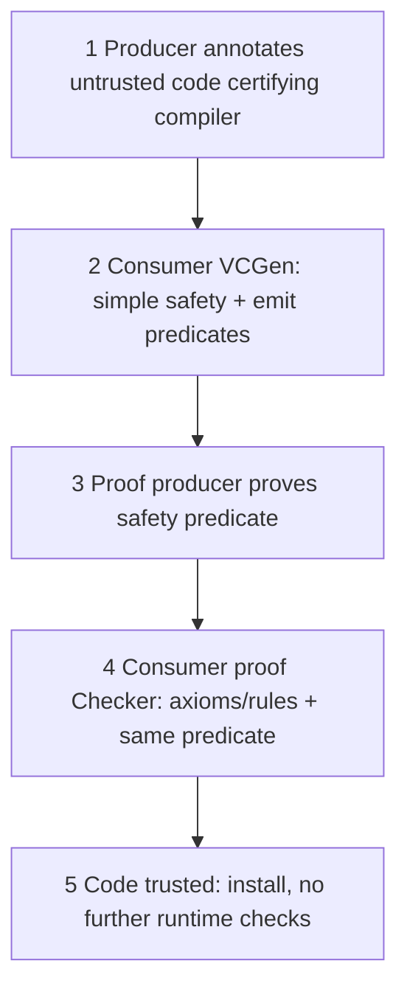

# M21: Mobile Code Security

**Source:** https://www.youtube.com/watch?v=ccqp2LU6E7Q
**Instructor / expert:** Dr. Navdeep Singh, Department of Computer Engineering, Punjabi University, Patiala (course coordinator: Dr. Maninder Singh, Thapar University, Patiala)

### Learning objectives

- Define the **mobile-code** paradigm (applets through agents), its flexibility/bandwidth benefits, and its **two threat directions** (code vs host, host vs code).
- List host-protection requirements: **authenticate origin, verify integrity, access control, semantic checks**.
- Explain host defenses taught: **sandboxing, digital shrink-wrap / Authenticode, proof-carrying code (PCC), code signing, access control / JAAS, program checking**.
- Outline **data and code protection** for agents: signatures, **hash chaining / forward integrity**, **sliding encryption**, replication, **holographic proofs + PIR**, tamper-proof hardware, **function hiding**.
- Repeat the close: host protection is **achievable**; protecting code from a **malicious host** is still **research**; **non-cryptographic** methods are generally **not enough** for the code.

### Core concepts

(The spoken intro mentions a previous lecture on **Information Security Management**; this hour is **mobile-code security** and associated issues.)

#### Mobile-code paradigm

Mobile code is programs that **execute on one or several hosts other than the origin**. Mobility implies a **built-in ability to travel** host to host. At least two parties: **producer** and **consumer** (the host that **runs** the code).

Range: simple **applets** to **intelligent software agents**. Advantages over traditional distributed computing (two named): **flexibility in software design** beyond well-established **OOP**, and **bandwidth optimization**. Cost of flexibility: **increased vulnerability** to Internet-style intrusion.

Vulnerabilities fall in **two categories**:

1. **Classical:** a mobile program attacks the **remote host** (malicious **applets** or **ActiveX**).
2. **Less classical:** the **remote execution environment subverts** the mobile code **and its data**.

#### Threats in both directions

**Malicious code vs host** resembles **Trojan horses**, but mobile code aims at **transparency, automation, and wider-scale execution**. Environment vulnerabilities are **not the only** targets.

**Malicious host vs code:** the host may try to **subvert the mobile program**.

When **protecting a host** from potentially malicious code, mobility imposes:

1. Host and code have **separate identities** → **authenticate the code's origin**.
2. Code is **exposed on the network** → host must **verify integrity** of what it just received.
3. Another party **generated** the code → **limit actions** with **access control** and **semantic verification**.

When **protecting code** from a potentially malicious host, the program runs under the host's **total control**. Threats: **spoofing** (impersonating the code owner), **theft / secrecy violation** (unauthorized disclosure), **integrity violation** (subverting **code semantics**). **Data segments and code semantics** must both be protected.

#### Protecting the host

Early answer: **limit functionality** of the execution environment to shrink the attack surface. Techniques then evolve along two directions:

1. Mobile-code **infrastructure** gradually enhanced with **authentication, integrity, and access control**.
2. **Verification of mobile-code semantics**.

##### 1. Sandboxing

Run the code in a **restricted environment** (the **sandbox**) so otherwise untrusted code can execute “without worrying.” Two mechanisms:

- **Confine** code (via **type checking**, language properties, or **protection domains**) so it cannot subvert trusted code.
- Enforce a **fixed execution policy**.

Illustrated by **early Java JDK 1.0**, enabling **Internet applets** inside a browser. **Major drawback:** applications in such a tight box are **seldom useful**.

##### 2. Digital shrink-wrap

**Authenticate** code **before** execution: the **producer signs**; the **consumer verifies** the signature. One cannot decide from the bits alone whether code is malicious, but one can tell whether it **authentically came from the claimed source**. **Microsoft Authenticode** (ASR: “authentic code”) is the named proposal. **Sandboxing + shrink-wrap** can be combined; **Sun Java 1.2** combines both.

##### 3. Proof-carrying code (PCC)

**Necula and Lee, Carnegie Mellon University** (ASR: “neula and Lee from K melon”): **PCC** lets a host determine **automatically and with certainty** that code from another system is **safe to install and execute**. The **producer** must supply an encoding of a **proof** that the code **adheres to the consumer's security policy**. The proof is **digital**; the consumer **validates** it with a **simple, automatic, reliable proof checker**.

**Five steps of a typical PCC session:**

1. Producer **annotates** the code (manually or with a **certifying compiler**). Annotations help the consumer see **safety-relevant** properties. Annotated code is sent to the consumer.
2. Consumer runs **VCGen** (verification-condition generator), part of the **consumer-defined safety policy**. VCGen (a) checks **simple safety** (e.g. immediate jumps stay in the **code segment**); (b) on instructions that **might violate policy**, emits a **predicate** of the conditions under which that instruction is safe. Those conditions plus **control-flow** information form the **safety predicate**, copied to the **proof producer**.
3. Proof producer **proves** the predicate and, on success, returns a **formal proof**. The consumer **need not trust** the proof producer; **any system** can play that role.
4. **Proof Checker** verifies each inference is a valid instance of an **axiom / rule** in the safety policy, and that the proof is of the **same** predicate VCGen emitted.
5. After VCGen **and** proof check, the executable is **trusted** not to violate policy and may be **installed without further runtime checking**.

##### 4. Code signing

The producer **digitally signs** so the consumer gets **strong authentication and integrity**. First in **Microsoft ActiveX**; **Java JDK 1.1** follows for **applets**. With a **valid signature**, the **JVM** runs the applet as **trusted** with **all Java features**. **Unsigned** applets run in a **JDK 1.0-style sandbox**.

Caveats taught:

- A correct Internet signature **does not** mean the signer should be **trusted unrestrictedly**.
- The assumption that **users can decide** from a signature **has questionable validity**.
- Access control is **rudimentary**: signed code gets **full resource access** or is **not run**. That choice is left to the **end user**, who even **without administrator privileges** can put **entire security at risk**.

##### 5. Access control

Limit impact with **finer, application-specific policies** — a **monolithic sandbox** refined. The **signer's identity** (e.g. via **PKI**) further refines policy. **Java JDK 1.2** follows this scheme (**finer-grained** policies suited to untrusted mobile code). Later, Sun's **JAAS** (Java Authentication and Authorization Service; ASR: “Jazz”) integrates the **identity of the user running the code** into access control.

Versus sandboxing and signing: access control has **the best of both** — restrict which **resources** the code may touch, yet still write **useful** software. Cost: enforcement is **dynamic at runtime**.

##### 6. Program checking

Verify **structure or run-time behavior** and change status (e.g. trusted → untrusted) against a **security policy**. Sandboxes already do rudimentary checking: **static** (operand types) or **dynamic** (access to a protected resource).

A newer approach: **statically type-check** the mobile code, then run **without expensive runtime checks** — as in **PCC** and, to some extent, the **JVM** safety checks.

PCC again as **static checking**: policy in a **logic**; host demands a **proof** before running; producer sends program + proof using **shared sound axioms and rewriting rules**; host checks the program **guided by the proof** (a form of **type checking** derived from the program). **Checking a proof is much cheaper than proving the program.** PCC can express **complex safety** (and looks promising for **security**) properties. **Automating proof generation is still hard**; proofs are **generally by hand**.

#### Protecting mobile code from a malicious host

Studied only **recently**; **intrinsically harder** because the environment has **total control** (otherwise **host** protection would be impossible). Classify along:

1. **Data vs code** protection  
2. **Integrity vs confidentiality**

**Data protection** targets **roaming agents** (e.g. e-commerce). An agent may meet a host that tries to **“brainwash”** it. **Code protection** addresses **systematic** malice: the environment **cannot be trusted**.

##### Data protection for agents

Agents act **on behalf of the user** (collect product data, perform a transaction). Example: **comparison shopping** — lowest-priced book among retailers. Need to know:

- whether **collected data** were **changed**;
- whether a **fixed itinerary** was **followed**;
- in an **auction**, that a host cannot **exploit previous bidders' offers**.

**Integrity of collected data:**

- **Digitally sign** each result — but **agent size grows linearly** with results.
- More efficient: **hash chaining** for **forward integrity** (integrity against deletion/modification of parts of collected data **up to the first malicious host**). A **PRAC** (partial result authentication code) — a **small value** — ensures integrity of **all offers**. Extended so a host can **update previous data without growing space**. Add **signatures** if **non-repudiation** is required.

**Confidentiality of carried data:** at each hop, **encrypt on the current host** before the agent moves. **RSA** can be secure but, if data are **tiny**, **padding** is **excessive**. **Sliding encryption** keeps **equivalent security with a large key** while respecting **limited agent storage** — **space over time**, for agents that collect **small amounts on many hosts**.

##### Integrity of computation

- **Fault tolerance:** do the work **several times**. Same agent code on **replica hosts**; **vote** on the result. Or **replicate agents** and **slightly alter behavior** to **spot** a malicious host.
- **Cryptographic integrity proof / hint:** show computation followed the mobile code's instructions. A **trace** of the computation is a proof of how the result was obtained. To check faster, convert to a **holographic proof**: probabilistically validate by examining **only a few bits**, in **polylogarithmic** time. Transforming into a holographic proof is **heavy** — done by the **executing host**, not the verifier.

Problem: holographic-proof validity holds only if the **bits the verifier will look at stay unknown** to the proving host. Sending the whole holographic proof is worse because it is **even bigger than the original proof**. Fix: **cryptographic private information retrieval (PIR)** — the proof **stays on the proving host** and is **queried without that host knowing which bits were queried**. Hidden-query results plus the computation result are **smaller than the original proof**.

##### Privacy of computation

- Rely on **tamper-proof hardware** (e.g. a **smart card**) as a **secure kernel** for **secret functions and secret data** → **integrity and partial confidentiality**.
- **Function hiding:** encrypt function **f** into **E(f)**; run **E(f)(x)** on the untrusted site; decrypt the output to get **f(x)**. **Standalone**, no extra hardware, **confidentiality of the computation**. **Matrix** computations can be hidden, and thus any function representable as a matrix (e.g. **combinatorial Boolean circuits**).

#### Close

Mobile code is advocated for **flexibility and extensibility**, at a **security price**. A **good level of host protection is achievable**. Trend: **finer-grained access control**, so mobile code becomes **more useful**. **Semantic analysis** may secure hosts **without sacrificing performance**. **Protecting code from a malicious host remains an open research topic**. **Non-cryptographic techniques are generally not sufficient** to protect mobile code.

### Key terms

| Term | Meaning in this lecture |
|------|-------------------------|
| Mobile code | Code that runs on hosts other than its origin (applets to agents) |
| Sandbox | Restricted environment; JDK 1.0 applets; often too limited to be useful |
| Authenticode / digital shrink-wrap | Producer signs; consumer verifies origin before run |
| PCC / VCGen | Proof-carrying code; consumer generates safety predicate, checks producer's proof |
| Code signing (JDK 1.1 / ActiveX) | Valid signature → full trust; else sandbox; coarse access control |
| JAAS | Ties **user identity** into Java access control (JDK 1.2+ model) |
| Forward integrity / PRAC | Hash-chain / small authenticator over agent-collected offers |
| Sliding encryption | Compact encryption for small data on many hops |
| Holographic proof + PIR | Probabilistic, tiny checks of a computation proof without revealing query bits |
| Function hiding | Run an encrypted function on a malicious host; decrypt the result |

### Lecture takeaways

- Mobile code buys **flexibility and bandwidth** and opens **two-way** risk: **hostile applets/ActiveX** and **hostile hosts**.
- Hosts must **authenticate origin, check integrity, constrain rights, and check semantics**.
- Practical host tools: **sandbox, signing/Authenticode, PCC, JAAS-style policies**; signing alone is a **poor user decision** and an **all-or-nothing** ACL.
- Agents need **crypto** (hash chains, sliding encryption, holographic proofs, function hiding, smart cards); **replicas/voting** help integrity of results.
- Host protection is **in production reach**; **code vs malicious host** is **still research**; **crypto is required**.
