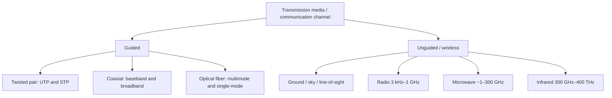

# M22: Transmission Media

**Source:** https://www.youtube.com/watch?v=Xw7oyDuqOwU
**Instructor / expert:** Dr. Navdeep Singh, Department of Computer Engineering, Punjabi University, Patiala (course coordinator: Dr. Maninder Singh, Thapar University, Patiala)

### Learning objectives

- Define **transmission media** as the physical-layer path for **electrical or electromagnetic** signals and list design factors: **bandwidth, impairment, interference, number of receivers**.
- Compare **guided** media: **UTP, STP, coaxial (baseband/broadband), fiber** (step/graded multimode, single-mode), with connectors, applications, and trade-offs as taught.
- Describe **unguided** propagation (**ground, sky, line-of-sight**), **antennas**, and **satellite uplink/downlink**.
- Distinguish **radio, microwave, and infrared** bands, properties, and applications (including **IrDA**).

### Core concepts

Transmission media is the **pathway that carries information from sender to receiver** — also called a **communication channel**. Data travel as **electrical signals** (current) or **electromagnetic signals** (pulses at various frequencies) through **copper, optical fiber, atmosphere, water, or vacuum**. Media differ in **bandwidth, delay, cost, and ease of installation/maintenance**. The lecture locates media at the **physical layer**.

#### Design factors for data-transmission systems

A key concern is **data rate and distance** — greater of both is better. Factors that set those limits:

| Factor | Teaching |
|--------|----------|
| **Bandwidth** | All else equal, **greater signal bandwidth → higher data rate** |
| **Transmission impairment** | **Attenuation** limits distance on guided media. **Twisted pair** generally suffers more than **coax**, which suffers more than **optical fiber** |
| **Interference** | Competing signals in **overlapping bands** can distort or wipe out a signal. Especially serious for **unguided** media; also a guided-media problem. **Shielding** of guided media **minimizes** it |
| **Number of receivers** | Guided media may be **point-to-point** or a **shared** link with **multiple attachments**. Each attachment adds **attenuation and distortion**, limiting distance and rate |

#### Guided media

Capacity (rate or bandwidth) depends **critically on distance** and on **point-to-point vs multipoint**. Three common guided media: **twisted pair, coaxial cable, optical fiber**.

##### Twisted pair

Two **copper** conductors, each with **plastic insulation**. One wire carries the **signal**; the other is a **ground reference**. The receiver uses the **difference** between them (plus the sent signal).

If the two wires were **parallel**, **noise and crosstalk** would **not** hit both equally (different locations relative to the source), leaving a **difference at the receiver**. **Twisting** balances this: in one twist wire A is nearer the noise, in the next wire B is — so both are **equally affected** and the difference **cancels** unwanted signals. **Twists per unit length** affect quality.

Types: **UTP** (unshielded twisted pair) and **STP** (shielded twisted pair).

**UTP** is the most common communications twisted pair. Once thought slower than other copper; the lecture says that is **no longer true** — UTP is the **fastest copper-based medium** in this presentation.

| UTP feature | Value taught |
|-------------|--------------|
| Speed / throughput | **10 to 1000 Mbps** |
| Average cost per node | Very low |
| Media and connector size | Very small |
| Common connector | **RJ-45** (Registered Jack) |

**STP** wraps each pair in **metallic foil**; four pairs then in an overall **braid or foil**. Typically **150 Ω**, specified for some **Ethernet** installs. Combines **shielding, cancellation, and twisting**. Reduces noise **inside the cable and from outside**. Often uses a dedicated **STP data connector**; can also use the same **RJ** connectors as UTP.

STP **prevents interference better than UTP** but is **more expensive and harder to install**. The shield **must be grounded at both ends**; **improper grounding** makes the shield an **antenna**. Because of **cost and termination difficulty**, STP is **rarely used in Ethernet**; it is **primarily used in Europe**.

| STP feature | Value taught |
|-------------|--------------|
| Speed / throughput | **10 to 100 Mbps** |
| Average cost per node | Moderately high |
| Media and connector size | Medium to large |

**Applications of twisted pair:** many **Ethernet** networks; **telephone** systems; the **workhorse** medium **inside buildings**. Residential phones connect to the local exchange (**end office**) by twisted pair — **subscriber loops**.

**Advantages:** easy to install, **flexible, cheap**, high speed capacity. **Disadvantages:** **lower bandwidth than coax**; **less protection from interference**.

##### Coaxial cable

Named because it has **two conductors parallel to each other**. Build-up taught:

- Center **copper** conductor (solid or stranded)
- **PVC** insulation / sheath
- **Outer conductor** of **metal foil** — **shield against noise** and the **return conductor** that completes the circuit
- Outer conductor in an **insulating sheet**
- Outermost **plastic cover**

Common coax standards:

| Impedance / type | Use |
|------------------|-----|
| **50 Ω RG-8 or RG-11** | **Thick Ethernet** |
| **50 Ω RG-58** | **Thin Ethernet** |
| **75 Ω RG-59** | **Cable television** |
| **93 Ω RG-62** | **ARCNET** |

**Connectors:** **BNC** to attach cable end to a device (e.g. TV); **BNC T** in Ethernet to **branch** to a computer; **BNC terminator** at the cable end to **prevent reflection**.

**Performance:** **attenuation is much higher than twisted pair**. Coax has **much higher bandwidth**, but the signal **weakens rapidly** and needs **frequent repeaters**.

**Applications:** analog telephone (one coax network could carry **10,000 voice** signals); digital telephone (up to **600 Mbps**) — in phones, coax is **largely replaced by fiber**; **cable TV**; early **Ethernet LANs** (high bandwidth / data rate).

**Baseband vs broadband:**

| | Baseband | Broadband |
|---|----------|-----------|
| Typical cable | **50 Ω**, digital, mostly **LANs** | Analog on **standard CATV** cabling |
| Signals | **One** signal at a time, very high speed | **Several simultaneous** signals on **different frequencies** |
| Reach | Needs amplification about every **1000 ft** | **Larger area** than baseband |

**Advantages listed:** high bandwidth; long-distance telephone; digital at **10 Mbps**; higher **noise immunity**; transmission **without distortion**; **longer distance at higher speed** than twisted pair because of **better shielding**.

**Disadvantages:** **single cable failure can take down the entire network**; **harder and more expensive** to install than twisted pair; **imperfect shield** can cause a **ground loop**.

##### Optical fiber

Glass or plastic; signals as **light**. Light goes straight in a **uniform** substance; at a density change it **bends**. Relative to the **critical angle** (a **property of the substance**):

- Incidence **less than** critical → ray **refracts** toward the surface (lecture: reflects/moves closer to the surface).
- Incidence **equal** to critical → light **bends along the interface**.
- Incidence **greater** than critical → **total internal reflection**; ray turns back into the **denser** substance.

Fibers **guide light by reflection**. Bandwidth taught: **more than 2 Gbps**.

**Propagation modes:**

| Mode | Structure | Behavior |
|------|-----------|----------|
| **Multimode step-index** | Core **density constant** center to edge | Beam goes **straight** until core/cladding; **abrupt** density drop **bends** the beam. “Step” = suddenness, which **distorts** the signal |
| **Multimode graded-index** | **Index of refraction** (related to density) **highest at center**, decreasing to the edge | **Reduces distortion** versus step-index |
| **Single-mode** | **Step-index** fiber plus a **highly focused** source | Beams limited to a **small range of angles** near the **horizontal** |

**Connectors:**

| Connector | Use / lock |
|-----------|------------|
| **SC** (subscriber channel / subscriber connector) | Cable TV; **push-pull** locking |
| **ST** (straight tip) | Cable to **network devices**; **bayonet** lock; called **more reliable than SC** |
| **MT-RJ** | Same size as **RJ-45** |

**Applications:** **backbone** networks (wide bandwidth is cost-effective); **hybrid fiber-coax** cable-TV (fiber backbone, coax to the premises); LANs such as **100BASE-FX** and **1000BASE-X**.

**Advantages:** high-quality, **very high speed**; **immune to EMI** so noise/distortion is very low; **analog and digital**. **Disadvantages:** **expensive**; **difficult to install**; **expensive/difficult maintenance**; do not allow **complete routing** of light signals.

#### Unguided (wireless) media

Unguided media carry **electromagnetic waves without a physical conductor** — **wireless**. Signals are **broadcast in free space** to anyone with a receiver.

Propagation methods: **ground**, **sky**, and **line-of-sight**.

The radio/microwave part of the spectrum is divided into **eight bands** (very low frequency through extremely high frequency), **regulated by government authorities**.

**Antenna:** electrical conductor(s) that **radiate** or **collect** electromagnetic energy. Transmit: electrical energy → EM → atmosphere/space/water. Receive: impinging EM → electrical energy into the receiver.

**Satellite:** **downlink** = satellite → ground station(s); **uplink** = ground → satellite. Companies sell uplink, downlink, or both to TV stations, corporations, and carriers.

Wireless transmission is grouped into **radio, microwave, and infrared**. **Two frequencies** are used so they **do not interfere** and **full duplex** is possible; also, **transmit power scales with frequency**, so higher frequency means **heavier** equipment.

##### Radio waves

**3 kHz to 1 GHz**, **omnidirectional**: sending and receiving antennas **need not be aligned**; any receiver antenna can pick up the waves. Disadvantage: **interference** from another antenna on the **same frequency/band**.

Sky-mode radio can travel **long distances** — good for **AM** long-distance broadcasting. **Low and medium frequencies penetrate walls**: an **AM radio works indoors** (advantage) but you **cannot isolate** a communication to inside vs outside (disadvantage). The radio band is **relatively narrow** (just under **1 GHz**) versus microwave.

**Applications (multicast, one sender many receivers):** **AM and FM radio, television, maritime radio, cordless phones, paging**.

##### Microwaves

**About 1–300 GHz** (spoken “1 and 3 GHz” then a band “almost 299 GHz” wide). **Unidirectional / narrowly focused**: antennas **must be aligned**. Advantage: one aligned pair **need not interfere** with another.

Characteristics:

1. **Line of sight.** Towers must **see** each other; far-apart towers must be **tall**. Earth's **curvature** and obstacles block short towers. **Repeaters** for long distance.
2. **Very high frequency microwaves cannot penetrate walls** — a problem if receivers are indoors.
3. Band is **wide** (~299 GHz) → **wider subbands** and **high data rate**.
4. **Some portions require permission** from authorities.

**Applications (unicast):** **cellular phones, satellite networks, wireless LANs**.

##### Infrared

**300 GHz to 400 THz**, **short range**. **Cannot penetrate walls** — **prevents interference** between a system in one room and the next (TV remotes do not bother the neighbors) but is **useless for long range**. **Cannot use outdoors** because **sunlight contains infrared** that interferes.

**Applications:** band ~**400 THz** has excellent potential for **very high-rate digital** transmission. **IrDA** (Infrared Data Association) standards for **keyboards, mice, PCs, printers**. Some PCs have an **IrDA port** for a wireless keyboard. Original standard: **75 kbps** up to **8 m**; later **4 Mbps**.

#### Close

The hour covered **media and their features** plus **advantages and disadvantages**. The speaker previews **wireless networking** for the **next** lecture (not part of this module's content).

### Key terms

| Term | Meaning in this lecture |
|------|-------------------------|
| Communication channel | Synonym for transmission media at the physical layer |
| UTP / STP | Unshielded vs foil/braid-shielded twisted pair; RJ-45 vs STP data connector |
| Subscriber loop | Twisted pair from home to telephone end office |
| Baseband / broadband coax | One high-speed digital signal vs many analog FDM signals on CATV plant |
| BNC / T / terminator | Coax connectors; terminator stops reflection |
| Critical angle | Governs refraction vs total internal reflection in fiber |
| Step-index / graded-index / single-mode | Fiber propagation families |
| Uplink / downlink | Ground→satellite / satellite→ground |
| Omnidirectional vs unidirectional | Radio vs microwave antenna behavior |
| IrDA | Infrared device-to-device standards (75 kbps then 4 Mbps) |

### Lecture takeaways

- Rate and reach are set by **bandwidth, impairment, interference, and how many receivers share the guided medium**.
- **Twisting** cancels crosstalk; **UTP** is cheap and, here, the **fastest copper**; **STP** shields better but is **costly, must be grounded, rare in Ethernet**.
- **Coax** outperforms pair on bandwidth/noise but **attenuates fast**, can **fail the whole net**, and lost the telephone backbone to **fiber**.
- Fiber uses **reflection**, **>2 Gbps**, EMI immunity; modes are **multimode step, multimode graded, single-mode**.
- Wireless is **radio (omni, multicast), microwave (LOS unicast), infrared (in-room, IrDA)**; antennas and **licensed bands** matter.
