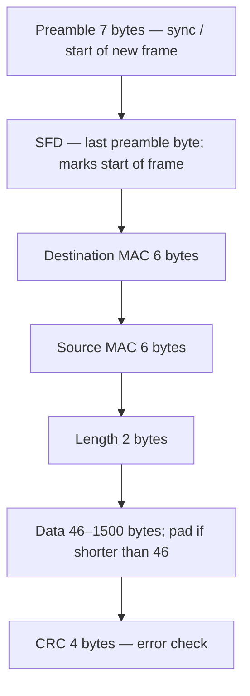
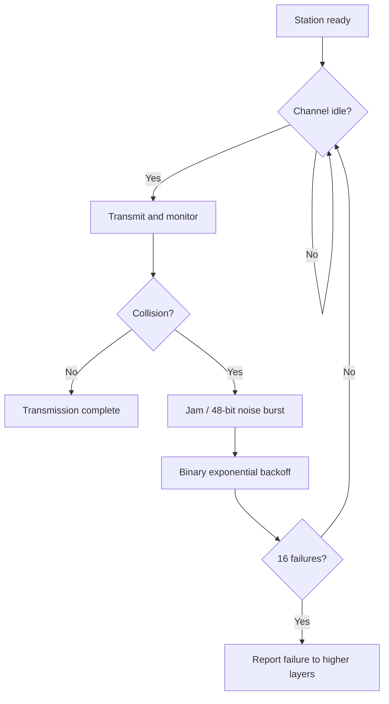

# M23: Ethernet and Fast Ethernet

**Source:** https://www.youtube.com/watch?v=AN-s1J2GrPk
**Instructor / expert:** Prof. Yogesh Chaba, Department of Computer Engineering and IT, Guru Jambheshwar University of Science and Technology, Hisar (course coordinator: Dr. Maninder Singh, Thapar University, Patiala)

### Learning objectives

- Place **Ethernet** historically (Xerox, commercial 1980, **IEEE 802.3** in 1983) and name the four **10 Mbps** cabling families.
- Map **LLC vs MAC**, list **IEEE 802.3 frame fields**, and walk **CSMA/CD** including **jam**, **binary exponential backoff**, and **why padding to 64 bytes** exists.
- Explain **Fast Ethernet (802.3u)** as the same rules with **bit time 100 ns → 10 ns**, and why **cable length** shrank instead of **minimum frame size**.
- List Fast Ethernet **PHY** types (T4, TX, FX, SX, BX, LX10) and the **MII / PCS / PMA / PMD** stack.

### Core concepts

Ethernet and Fast Ethernet are for **wired LAN** data at **10 Mbps** and **100 Mbps** respectively. Outline: Ethernet introduction → **protocol architecture and frame format** → **MAC operations** → Fast Ethernet and its architecture.

#### Ethernet history and role

Ethernet is a family of technologies for **LANs and MANs**. It began as an **experimental coaxial** network at **Xerox** in the **1970s**, initially **3 Mbps**, using **CSMA/CD** (Carrier Sense Multiple Access with Collision Detection). **Commercially introduced in 1980**; **standardized in 1983 as IEEE 802.3**. It was refined for **higher bit rates and longer links**. It largely **replaced** competing wired LAN technologies: **Token Ring, Token Bus, FDDI, ARCNET**.

Ethernet is currently the **most common** LAN architecture. Topologies are generally **bus** or **bus-star**. **IEEE 802.3** defines Ethernet for the OSI **MAC sublayer and physical layer**. The name refers to the cable **“ether.”**

#### Four 10 Mbps cabling types

Naming: first number = **speed in Mbps**; **BASE** = **baseband**. So **10BASE5** = **10 Mbps, baseband, 500 m** segments.

| Type | Medium / connector | Segment / nodes | Notes taught |
|------|--------------------|-----------------|--------------|
| **10BASE5** (“thick Ethernet”) | Thick coax; **vampire taps** (pin forced **halfway into the core**) | **500 m** | Historically first |
| **10BASE2** (“thin Ethernet”) | Thin coax; **BNC** T-junctions (not vampire taps) | **185 m**, **30** machines per segment | Cheaper and easier to install |
| **10BASE-T** | Each PC to a **central hub** on **twisted pair** | **100 m**, **1024** nodes | Cheapest; response to **hard-to-find cable breaks** on a **single shared coax** (one fault **takes down the whole net**) |
| **10BASE-F** | **Fiber** | **2000 m**, **1024** nodes | Expensive connectors/terminators; **excellent noise immunity**; choice for **buildings or distant hubs**; **better security** (fiber **harder to tap** than copper) |

#### Layered protocol architecture

Both **data-link** and **physical** layers create and transmit **frames**.

- **Physical layer:** LAN **cabling** and how **bits** are sent/received on the cable.
- **Data-link** split into:
  - **LLC** (Logical Link Control) — identify and pass data to the **network-layer** protocol.
  - **MAC** (Media Access Control) — access to the **shared** medium; **hardware addresses** of source and destination; which devices send/receive; lets **NICs** talk to the physical layer.

#### IEEE 802.3 frame format

| Field | Size | Role |
|-------|------|------|
| **Preamble** | 7 bytes | Start of a new frame; **synchronization** between devices |
| **SFD** (start-of-frame delimiter) | Last byte of that lead-in | Marks **start of frame** (lecture: repeating **10** pattern) |
| **Destination address** | 6 bytes | Receiver **MAC** |
| **Source address** | 6 bytes | Sender **MAC** |
| **Length** | 2 bytes | Frame length |
| **Data** | **46–1500** bytes | Payload; **pad** if shorter than 46 so the field is 46 bytes |
| **CRC** | 4 bytes | Frame received **error-free** |

#### MAC: CSMA/CD

Protocols in which stations **listen for a carrier and act accordingly** are **carrier-sense** protocols. Ethernet uses **CSMA/CD**.

When a station has data:

1. **Listen.** If the channel is **busy**, wait until **idle**.
2. On idle, **transmit**.
3. If a **collision** occurs, wait a **random** time and **start over**.

Flowchart as taught: ready → sense; if busy, **sense again**; if free, **transmit and watch for collision**; on collision, send a **jam** signal and wait per **backoff**; if no collision, **transmission completes**.

CSMA/CD is in one of three states: **contention, transmission, or idle**. After a station finishes a frame (time **t0**), any station with a frame may try. If **two or more** transmit together, a **collision** occurs. Collisions are detected by comparing **received power or pulse width** with the **transmitted** signal. After detecting a collision the station **aborts**, waits **random**, tries again if no one else has started. Model: alternating **contention** and **transmission**, with **idle** when all are quiet.

##### Binary exponential backoff

| After collision # | Random wait |
|-------------------|-------------|
| 1st | **0 or 1** slot |
| 2nd | **0, 1, 2, or 3** slots |
| 3rd | **0 … 2³−1 = 7** |
| *i*th (general) | Uniform in **0 … 2^i − 1** slots |
| After **10** collisions | Interval **frozen** at max **1023** slots |
| After **16** collisions | Controller **gives up** and **reports failure** to the computer; **higher layers** recover |

If two stations pick the **same** random number after the first collision, they **collide again**.

##### Why padding / 64-byte minimum

A station must not **finish sending a short frame** before the first bit reaches the **far end**, where it might **collide**. Let **T** be propagation time A→B.

- At time 0, **A** sends.
- At **T − ε**, distant **B** starts sending.
- **B** sees **more power than it puts out**, aborts, and sends a **48-bit noise burst (jam)** so the sender **cannot miss** the collision.
- At about **2T**, **A** hears the jam, aborts, waits random, retries.

If the frame were **very short**, A might **think success** before the jam returns. Therefore **all frames must take more than 2T to send** so transmission is **still ongoing** when the jam arrives. Frames under **64 bytes** are **padded to 64 bytes**.

#### Fast Ethernet

**Fast Ethernet** is **traditional CSMA/CD at 100 Mbps over twisted pair** (and fiber PHYs below). Proposed **1992**. Two groups' proposals were both approved under different IEEE committees:

- One passed full review in **June 1995** as **IEEE 802.3u** — **Fast Ethernet**, which **succeeded in enterprise LANs**.
- The other became **100VG-AnyLAN**, later under **IEEE 802.12** (ASR: “802.2”), using **demand priority** instead of CSMA/CD. It **did not catch on**.

Fast Ethernet exists because **10 Mbps Ethernet was slow**. It is a **simple speed-up** with the **same rules**. The **802.3** committee kept a sped-up Ethernet for three reasons:

1. **Backward compatibility** with existing Ethernet LANs.
2. **Fear** that a **new protocol** might have **unforeseen problems**.
3. Desire to **finish before the technology changed**.

They kept **old packet formats, interfaces, and procedures** and only reduced **bit time from 100 ns to 10 ns**, raising bandwidth to **100 Mbps**. Officially **802.3u**, commonly **Fast Ethernet**.

**Challenge:** more bits are on the wire during the same **propagation delay**, so the **collision window** contains more bits. Designers could **raise minimum frame size** or **shorten cable** (cut delay). Changing minimum frame size would **break backward compatibility**, so **maximum network size** was reduced; typical **max cable length 100 m**.

**Fast Ethernet frame format is the same as Ethernet.**

#### Fast Ethernet physical types

Three **basic** PHYs, then additional fiber variants:

| PHY | Medium | Distance / notes |
|-----|--------|------------------|
| **100BASE-T4** | **Category 3**, **four-pair** twisted pair | **100 m**, **RJ-45** |
| **100BASE-TX** | **Cat 5 UTP** or **Type 1 STP**, RJ-45 (Cat 5 dearer than Cat 3) | **Full duplex**: send **and** receive **100 Mbps** at once |
| **100BASE-FX** | Two strands **62.5/125 µm multimode** fiber, one each way | Full duplex 100 Mbps each way; station–hub up to **2000 m**; **SC, MIC, or ST** connectors |
| **100BASE-SX** | Two multimode strands; **short-wavelength** optics | Cheaper than FX's **long-wavelength** optics; up to **550 m** |
| **100BASE-BX** | **One strand single-mode** plus a multiplexer splitting **TX/RX wavelengths** | **1310 nm** and **1550 nm**; **10, 20, or 40 km** |
| **100BASE-LX10** | **Two single-mode** fibers | Nominal **10 km**, **1310 nm** |

#### Fast Ethernet layered PHY

| Piece | Role |
|-------|------|
| **MII** (Medium Independent Interface) | Between **MAC** and PHY; **any** PHY with the MAC. Two media-status signals: **carrier present**, **collision absent** |
| **Reconciliation** sublayer | Maps those signals to **physical signaling primitives** the existing MAC understands |
| **PCS** (Physical Coding Sublayer) | Uniform interface to Reconciliation for all media; generates **carrier sense** and **collision detect**; runs **autonegotiation** of **10 vs 100 Mbps** and **half vs full duplex** |
| **PMA** (Physical Medium Attachment) | Medium-independent serial support for PCS: **serialize** code groups for TX, **deserialize** received bits into code groups |
| **PMD** (Physical Medium Dependent) | Maps medium to PMA; defines **signaling** for each medium |

### Key terms

| Term | Meaning in this lecture |
|------|-------------------------|
| IEEE 802.3 / 802.3u | Ethernet (1983); Fast Ethernet (June 1995) |
| 10BASE5 / 2 / T / F | Thick coax 500 m; thin 185 m; TP hub 100 m; fiber 2 km |
| Vampire tap | 10BASE5 pin into the coax core |
| LLC / MAC | Network-protocol handoff vs shared-media access and MAC addresses |
| CSMA/CD | Sense, send, detect collision, jam, backoff |
| Binary exponential backoff | Wait 0…2^i−1 slots; cap 1023 after 10; fail after 16 |
| Slot time / 2T | Collision window; min frame **64 bytes** so sender still transmitting when jam returns |
| 100VG-AnyLAN | 802.12 demand-priority alternative that did not succeed |
| MII / PCS / PMA / PMD | Fast Ethernet MAC–PHY stack; autonegotiation in PCS |

### Lecture takeaways

- Ethernet grew from Xerox **3 Mbps** coax to **IEEE 802.3** and displaced Token Ring, FDDI, and ARCNET on wired LANs.
- Shared coax (**10BASE5/2**) dies on **one cable fault**; **10BASE-T** hubs and **10BASE-F** fiber (noise, distance, **harder tapping**) were the answers at 10 Mbps.
- MAC is **CSMA/CD** with **jam**, **binary exponential backoff**, and a **64-byte floor** so collisions are **heard in 2T**.
- Fast Ethernet is the **same frames and MAC** with **10 ns** bits and **~100 m** copper reach, standardized as **802.3u**; **100VG-AnyLAN** lost.
- Copper PHYs are **T4 (Cat 3)** and **TX (Cat 5, full duplex)**; fiber PHYs cover **short, long, bidirectional-single-fiber, and 10 km** plants, glued to MAC by **MII + PCS/PMA/PMD**.
