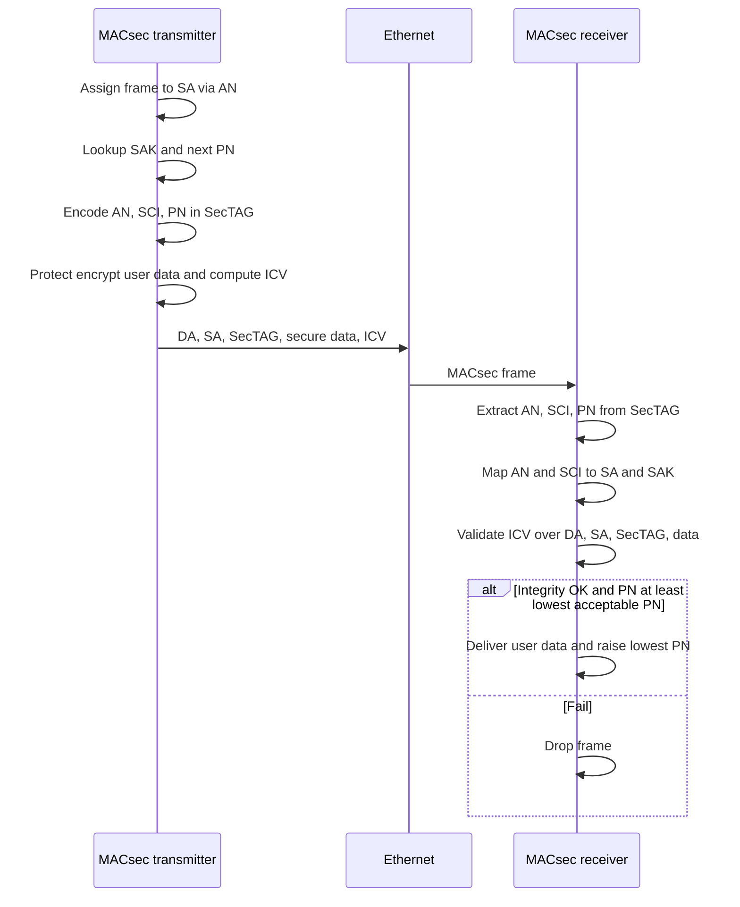

# M24: Ethernet Security

**Source:** https://www.youtube.com/watch?v=uaDXhq0k5sc
**Instructor / expert:** Prof. Yogesh Chaba, Department of Computer Engineering and IT, Guru Jambheshwar University of Science & Technology, Hisar. Course coordinator: Dr. Maninder Singh, Professor and Dean of Academic Affairs, Thapar University, Patiala.

### Learning objectives

- Trace Ethernet from ALOHAnet and Xerox CSMA/CD through the DIX 1.0 spec to IEEE 802.3, and name the frame as the on-wire unit.
- State why Ethernet was designed without security, and list the five attack classes the lecture uses (access, confidentiality, integrity, DoS, system security).
- Contrast router-based segmentation, access control (including IEEE 802.1Q / 802.1X), higher-layer crypto, and monitoring.
- Describe IEEE 802.1AE MACsec: SecTAG and ICV placement, SA/SAK/PN/SCI, Protect/Validate, and replay protection.

### Core concepts

Ethernet security is the lecture’s topic for **securing wired LANs and MANs**. The expert’s outline is: brief Ethernet background, **Ethernet threats**, **Ethernet security solutions**, then the **MACsec** protocol.

#### Roots, DIX, and IEEE 802.3

Ethernet’s roots are in the 1970s radio experiment **ALOHAnet**, developed under **Norman Abramson** at the **University of Hawaii**. Around the same time **Xerox** created a LAN at **3 Mbps** using **carrier-sense multiple access with collision detection (CSMA/CD)**.

In **1980**, the **10 Mbps Ethernet Version 1.0** specification was jointly released by **Digital Equipment Corporation**, **Intel**, and **Xerox** (the DIX spec). IEEE picked it up as **IEEE 802.3** in **1983**.

A chunk of data Ethernet sends on the wire is a **frame**. Only one node should transmit a frame at a time; simultaneous transmissions cause a **collision**, both signals can fail, and the stations must **retransmit**. Those properties are summarized as **CSMA/CD**.

Ethernet supports **optical fiber** and **copper**. In the lecture figure, yellow is fiber and blue is **twisted pair**; a server farm and PCs attach to a **Fast Ethernet (100 Mbps)** network through **switches**.

IEEE 802.3 comprises several **OSI physical-layer** wiring and signaling variants. Original **10BASE5** used **coaxial cable** as a shared medium; newer variants use **twisted pair** and **fiber** with **hubs or switches**.

| Name the lecture uses | Rate |
|-----------------------|------|
| Ethernet | 10 Mbps |
| Fast Ethernet | 100 Mbps |
| Gigabit Ethernet | 1,000 Mbps |
| 10 Gigabit Ethernet | 10,000 Mbps |
| 100 Gigabit Ethernet | 100,000 Mbps |
| 400 Gigabit Ethernet | expected by early 2017 |

Rates have risen from the original **10 Mbps** to **100 Gbps**, with **400 Gbps** expected by early 2017 in the lecture’s timeline. Ethernet is called the **only survivor of the wired LAN war**: it is hard to find an IP packet that has not crossed an Ethernet segment, largely because of **simplicity and ease of configuration**. It has nonetheless always been known as an **insecure** technology. Successful **malware** and the move toward **cloud computing** in data centers are why security of Ethernet now needs attention.

#### Why Ethernet is easy to attack

Security was **never a major design consideration**. The basis of an attack is **gaining access to the target Ethernet segment**. The attacker may be an **insider with full access rights**, or may have found a jack in a **public space**.

Before listing methods, the lecture lists how an attacker **uses** that access:

- Learn **private network topology** and **traffic** for later attacks
- Gain **control of switches, routers, or servers** in the LAN
- **Eavesdrop**
- **Manipulate** information
- **Disrupt availability**

The **most prominent** attack methods on Ethernet segments are:

1. **Network and system access**
2. **Traffic confidentiality**
3. **Traffic integrity**
4. **Denial of service**
5. **System security** (named as a class; the worked examples sit under the first four)

##### Network and system access

Access is a **prerequisite** for every other attack. It is achieved by **connecting equipment** or by **taking over existing resources**.

| Method | What the lecture describes |
|--------|----------------------------|
| Unauthorized join | Connect to an unused **switch port**: physical access to the switch, a **wall socket**, unplug a PC and plug in another, or insert a **switch between PC and wall jack** |
| Unauthorized expansion | Users install their own **switches** or **wireless access points**, so others can join |
| VLAN join | If a switch **listens for VLAN management protocols on host ports**, a host can **act as a switch** and join **all VLANs**. Some ports can be set **not to transmit** those protocols but **still listen**; an attacker can **probe for hidden features** |
| VLAN tagging and hopping | Craft Ethernet frames with a **VLAN tag** and **inject** into VLANs the attacker should not reach |
| Remote access to the LAN | Compromise a host via a **higher layer**, e.g. **social engineering** so a user opens a **remote administration** service that connects **out to the Internet**, giving the attacker an Ethernet-layer foothold |
| Switch control | Switches often ship with **default or no passwords**; passwords can often be **physically reset**. A controlled switch can **reroute traffic**, take **links down**, **claim the STP root** by raising **bridge priority**, or **DoS selected links** |

##### Traffic confidentiality

Captured traffic is useful in itself and for **finding targets**. The attacker obtains not only payload but **authentication data such as passwords** and **topology** for later use.

##### Traffic integrity

The attacker **modifies** traffic. Example: **imitate a bank web server to the user** and **imitate the user to the bank**, gaining **temporary control of the user’s bank account**.

| Technique | Mechanism |
|-----------|-----------|
| ARP poisoning | Send an **ARP** reply with the **victim’s IP** and the **attacker’s MAC**, so the sender delivers frames to the attacker |
| DHCP poisoning | Hear **broadcast DHCP** requests and **reply first**; on success assign **gateway**, **DNS**, and **IP**, then **control the host’s traffic** |
| Man-in-the-middle | If traffic is **steered through** the attacker and has **no integrity check**, the attacker can **modify** it |
| Session hijacking | Ethernet is **stateless**, but many higher-layer protocols create a **session** that is then **assumed trusted** with **no further verification**. If the attacker **eavesdrops** (or otherwise learns enough), they can **recreate the session** and act as one endpoint |

##### Denial of service

Motivation is **not data access** but **preventing use**: **total loss** or **degradation** of service.

- **Resource-exhaustion:** target a switch’s **control and management planes** with frames that need **extra processing**.
- **Protocol-based DoS:** **Spanning Tree Protocol (STP)** builds a **tree from a mesh** and is **self-configuring**. A node can send **STP messages** and **pretend to be a switch**. The switching network can be **halted** by flooding **STP topology-change notifications (TCNs)** or other STP control messages.

#### Solutions the lecture groups

Ethernet security has been improved by **standards bodies**, **vendors**, and **research**. The traditional answer was to treat **any Ethernet segment as untrusted** and put it **inside a protected domain**: **behind a firewall**, in a **secure building**, with **trusted staff**. Remaining issues were left to **higher-layer cryptography** such as **IPsec** and **TLS**. Cryptography has **its own cost** and is **not a universal solution**.

##### Router-based security

Replace a **central Ethernet switch** with an **IP router**. The router **partitions** Ethernet into **several segments**, each a **separate broadcast domain**. **ARP, STP, VLAN, and MAC-address-table** attacks then **cannot cross segments**. Inside a segment the same attacks remain unless **each switch** is replaced by a **multi-port router**. Cost: an IP router needs **configuration** (address allocation, default route); that can sometimes be **automated** (e.g. **residential broadband** where topology is clear to the access router). Routers also **hinder easy mobility**: on Ethernet a host can **move and keep IP and MAC**; **MAC tables update automatically**. Compared with a switch, a router still gives **considerable protection** against other users on the same box.

##### Access control

If untrusted parties never get on, they cannot attack.

- **Physical protection:** equipment in **locked cabinets and rooms**; wiring **inside walls**.
- **Segmentation and VLANs:** **IEEE 802.1Q** limits **broadcast and other traffic** to specific segments. VLANs are **logically separate** on the same physical plant and define **security domains**. Each host can be put in its **own VLAN**. **IEEE 802.1Q-in-Q (QinQ) double tagging** or vendor **private VLAN (PVLAN)** isolates hosts so traffic only reaches one **promiscuous port** (typically a **router to the Internet**). Each host sees **only itself and the promiscuous-port host**; only a **few VLAN IDs** are needed on trunks for PVLAN traffic.
- **Access control lists:** **not part of Ethernet** itself; **switch vendors** added them. A simple Ethernet-frame ACL can use **sender/receiver MAC** or **EtherType**. Access can be limited by **MAC**, and **service-specific ACLs** are common.
- **Authentication-based access:** **IEEE 802.1X** port authentication supports **username/password** or a **certificate and private key**. The **client** talks to the **authenticator switch**; the switch checks credentials against an **authentication-server database**. 802.1X uses **Extensible Authentication Protocol (EAP)** for many methods. It authenticates a host at **session start** and **binds the MAC address to a switch port**.

##### Secure protocols on the wire

- **Encryption and integrity:** **IEEE 802.1AE MACsec** builds **encrypted connections between hosts and switches**, protecting **confidentiality and integrity of frame contents**. Deployment needs **software** and **authentication configuration** for each participating entity. MACsec stops **intruders** from **reading or modifying** data frames (detail below).
- **Securing ARP:** ARP is a **major Ethernet vulnerability**. **DHCP snooping** can bind **MAC ↔ IP ↔ port** from DHCP messages and **block ARP spoofing**. Limitation: a **single switch cannot see** DHCP allocations whose path to the server **does not pass through that switch**.

##### Security monitoring

The previous techniques are mostly **proactive** and, once set, need little **external or human** involvement. **Active** monitoring adds:

- **Ethernet firewall and deep packet inspection (DPI):** firewalls sit between segments and are **more complex ACLs**, including **stateful** features; current products can operate on **all network layers**.
- **IDS / IPS:** use DPI against a **signature library** of known attacks. The lecture states such systems are **rarely useful for Ethernet-network protection**.
- **Planning, configuration, and administration:** good practice **strongly influences** Ethernet security; many of the technical controls need **configuration and ongoing adjustment** as topology changes.

#### IEEE 802.1AE MACsec

**MAC Security (MACsec)**, **IEEE 802.1AE**, lets **authorized systems** that attach to and interconnect LANs **keep transmitted data confidential** and **resist frames sent or modified by unauthorized devices**.

The lecture’s list of what MACsec facilitates:

- Maintain **correct network connectivity and services**
- **Isolate denial-of-service** attacks
- **Localize** any source of communication to the **LAN of origin**
- Build **public networks** that serve **unrelated or mutually suspicious customers** on **shared LAN infrastructure**
- **Secure communication between organizations** that use a LAN for transit
- **Incremental, non-disruptive** deployment, protecting the **most vulnerable** components first

**On the frame:** destination and source **MAC addresses stay as they are**. A **SecTAG** is inserted **before** the user data; an **integrity check value (ICV)** is inserted **after** the data. MACsec **modifies the MAC service data unit (MSDU)** carried in each frame.

The **MAC security tag (SecTAG)** carries parameters that **identify the protocol**, **identify the key** used to validate the frame, and support **replay protection**:

| SecTAG parameter | Role |
|------------------|------|
| Tag Control Information (TCI) | Tag/control bits |
| Association Number (AN) | Selects the Security Association |
| Packet Number (PN) | Per-SA packet counter (replay) |
| Secure Channel Identifier (SCI) | Identifies the secure channel |

The **secure data** field carries user data, **encrypted if confidentiality is provided**. The **ICV** covers **MAC DA, MAC SA, SecTAG, and user data**.

**Transmit path**

1. The frame is assigned to a **Security Association (SA)** identified locally by its **Association Number (AN)**.
2. The SA identifies the **Security Association Key (SAK)** and the **next Packet Number (PN)**.
3. **AN, SCI, and PN** are encoded in the SecTAG and given to the **Protect** function.
4. Protect emits the **ICV** and **secure user data**.

**Receive path**

1. **AN, SCI, and PN** are extracted from the SecTAG.
2. **AN** and **SCI** assign the frame to an SA and thus to the **SAK**.
3. The current **cipher suite’s validation** function is given **SAK, PN, SCI**, **DA**, **SA**, SecTAG octets, **secure data**, and **ICV**.
4. If integrity holds and user data can be decoded, a **valid** indication and the **user-data octets** are returned.
5. **Replay protection:** the received **PN must not be less than** the **lowest acceptable PN** for that SA.
6. On success, unchanged frame parameters are presented to the MACsec receiver and the **lowest acceptable PN is updated**.

### Key terms

| Term | Meaning in this lecture |
|------|-------------------------|
| Frame | Ethernet’s on-wire data unit; only one node should send one at a time |
| CSMA/CD | Carrier sense, multiple access, collision detection — Ethernet’s classic shared-medium rule |
| IEEE 802.3 | LAN/MAN standard grown from DIX Ethernet 1.0 (1980) and standardized in 1983 |
| VLAN hopping | Injecting VLAN-tagged frames (or abusing VLAN management) to reach VLANs the port should not join |
| STP TCN flood | DoS by flooding Spanning Tree topology-change notifications or other STP control |
| IEEE 802.1Q / QinQ / PVLAN | VLAN tagging, double tagging, and private-VLAN isolation (hosts only talk via a promiscuous router port) |
| IEEE 802.1X / EAP | Port authentication of a host to a switch that checks an authentication server |
| DHCP snooping | Bind MAC–IP–port from DHCP so ARP spoofing can be blocked, limited to what that switch can see |
| MACsec (IEEE 802.1AE) | Hop-by-hop encryption/integrity of Ethernet MSDUs using SecTAG, SAK, PN, SCI, and ICV |
| SecTAG / ICV / SAK / PN | MACsec tag, integrity check, association key, and packet number used for Protect, Validate, and replay checks |

### Lecture takeaways

- Ethernet won wired LANs by simplicity, not by security; design never treated security as a first-class goal.
- Almost every attack starts with **segment access** (physical jack, rogue AP/switch, VLAN tricks, stolen switch, or a remotely owned host).
- Confidentiality, integrity (ARP/DHCP poisoning, MITM, session hijack), and STP/resource DoS are the concrete Ethernet threats taught here.
- Classic mitigation was “treat the LAN as dirty” (building + firewall) plus **IPsec/TLS**; that is costly and incomplete.
- Routers cut broadcast-domain attacks; 802.1Q/PVLAN/ACLs/802.1X limit who is on the wire; DHCP snooping hardens ARP; firewalls/IDS are secondary.
- **IEEE 802.1AE MACsec** is the Ethernet-layer protocol the lecture spends its last section on: encrypt and integrity-protect frames between authorized devices, with replay protection via PN.
