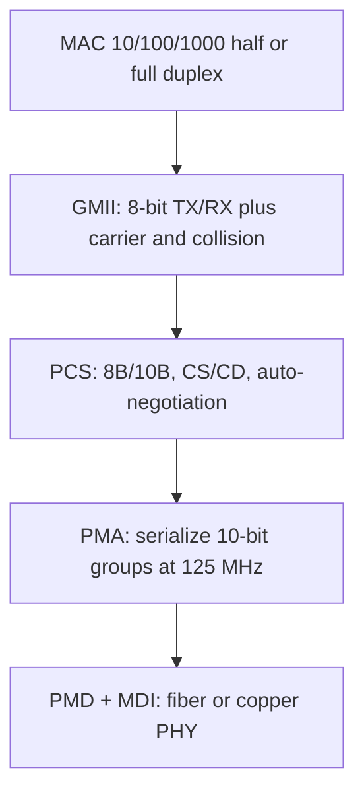

# M25: Gigabit Ethernet

**Source:** https://www.youtube.com/watch?v=4rAKMS0KbJU
**Instructor / expert:** Dr. Yogesh Chaba, Department of Computer Engineering and IT, Guru Jambheshwar University of Science & Technology, Hisar. Course coordinator: Dr. Maninder Singh, Professor and Dean of Academic Affairs, Thapar University, Patiala.

### Learning objectives

- Explain why Gigabit Ethernet (1 Gbps / 1000 Mbps) was specified as a 10× Fast Ethernet successor that keeps the IEEE 802.3 frame and MAC modes.
- Map the Gigabit stack: GMII, PCS (8B/10B), PMA, PMD/MDI, and auto-negotiation of 10/100/1000 Mbps and half/full duplex.
- List the IEEE 802.3z / 802.3ab / 802.3ah (and related) physical types with media, wavelengths, and distances the lecture gives.
- Recite the basic Gigabit MAC frame fields, CSMA/CD vs full duplex, packet bursting, and **carrier extension**.

### Core concepts

Gigabit Ethernet is presented as **wired-LAN transmission at 1000 Mbps (1 Gbps)** — **ten times Fast Ethernet**. The lecture order is: introduction, **layered protocol architecture**, **physical specifications**, then **frame format**.

#### Why 1 Gbps became necessary

A “basic law of network design” in the lecture: **demand for capacity is always underestimated**. Gigabit speeds once looked excessive; **data-intensive applications**, more users, and new delivery methods keep raising bandwidth need.

When **100 Mbps** technologies such as **FDDI** appeared, most **horizontal** networks still used **10 Mbps Ethernet**; the new protocols were mainly **backbones**. Once **Fast Ethernet** took the horizontal market, a **100 Mbps backbone** was often **too small** for **switch-to-switch** links that aggregate many Fast Ethernet networks. Gigabit Ethernet was developed as the **next generation** at **1 Gbps**.

#### IEEE standards the lecture names

| Standard | Year (lecture) | What it defined |
|----------|----------------|-----------------|
| **IEEE 802.3z** | June 1998 | Initial Gigabit Ethernet; **required optical fiber**. Commonly **1000BASE-X**, where X is **CX, SX, LX**, or non-standard **ZX** |
| **IEEE 802.3ab** | 1999 | Gigabit over **UTP Cat 5 / 5e / 6**, known as **1000BASE-T**. After ratification, Gigabit became a **desktop** technology on **existing copper** |
| **IEEE 802.3ah** | 2004 | Two more fiber PHYs: **1000BASE-LX10** and **1000BASE-BX10**, in the **Ethernet in the First Mile** group |

Like Fast Ethernet, Gigabit uses the **same frame format, frame size, and media-access method** as **10 Mbps Ethernet**. Fast Ethernet overtook FDDI because administrators did not need a **different backbone protocol**; likewise Gigabit avoids forcing **ATM** on backbones.

It is an **extension of base IEEE 802.3**. Task-force **design objectives**:

- Offer **10× the bandwidth of Fast Ethernet**
- Use the **IEEE 802.3 Ethernet frame format**
- Employ the same **half-duplex and full-duplex MAC** schemes as predecessors
- Be **backward compatible** with **10 Mbps and 100 Mbps** Ethernet
- Support **all existing network protocols** used with the Ethernet family

**Features emphasized**

- Same **802.3 frame size and format** → easy integration
- **Upgrade path** that reuses existing technology and operational knowledge
- **Full duplex** for **switch–switch** and **switch–end-station** links; **most products shipped are full duplex**, so **no shared-medium contention**
- **Half duplex** on shared media still uses **CSMA/CD**; a **packet-bursting** feature lets servers, switches, and other devices **send bursts of small packets** to use the bandwidth
- Media: **fiber**, or **Cat 5 / Cat 6**
- **Low cost** of install, maintenance, and management (local administrators can run it)
- **Faster switching** than routing: same frame format allows **seamless LAN / MAN / WAN** integration with **no fragmentation, reassembly, or address translation**, so **routers (slower than switches) are not required** for that stitching

#### Layered protocol architecture

Gigabit Ethernet supports **10, 100, and 1000 Mbps**. It provides separate **8-bit-wide receive and transmit data paths**, so both **full duplex and half duplex** are possible.

The **Gigabit Media Independent Interface (GMII)** sits between **MAC and PHY**. It is an extension of Fast Ethernet’s **Media Independent Interface (MII)** and **reuses MII’s management interface**. With GMII, **shielded/unshielded twisted pair** and **single-mode/multimode fiber** can share the **same MAC controller**. GMII also provides two media-status signals: **carrier present** and **collision absent**.

GMII sits above three sublayers:

| Sublayer | Role in this lecture |
|----------|----------------------|
| **PCS** (Physical Coding Sublayer) | Uniform interface to all media. **8B/10B** coding as in **Fibre Channel**: **10-bit code groups** represent **8-bit** groups. Generates **carrier sense** and **collision detect** for half duplex. Runs **auto-negotiation**: NIC learns **10 / 100 / 1000 Mbps** and **half vs full duplex** |
| **PMA** (Physical Medium Attachment) | Medium-independent serial attachment. Takes **10-bit groups at 125 MHz** from PCS, **serializes** them; on receive, **deserializes** bits back into code groups for PCS |
| **PMD** (Physical Medium Dependent) | Maps the medium; defines **signaling**. Includes the **Medium Dependent Interface (MDI)** — actual **connectors**. PMD is where **802.3z, 802.3ab**, and related PHYs are distinguished |

#### Physical specifications

The PHY describes **media**, **electrical/optical properties**, and **signal interpretation**.

##### IEEE 802.3z — collectively 1000BASE-X

**1000BASE-SX** (short wavelength fiber)

- Multimode fiber, **850 nm** near-infrared
- Maximum **220 m** on **62.5/125 μm** fiber with good terminators (the lecture also states it **usually works farther**)
- Modern **50/125 μm** fiber can reliably reach **500 m or more**
- Popular for **intra-building** links in large offices, **colocation** facilities, and **carrier-neutral Internet exchanges**

**1000BASE-LX** (long wavelength)

- Long-wavelength laser, **1270–1355 nm**; typically specified **1300 or 1310 nm**
- Specified to **5 km** over **10 μm single-mode fiber**; often works **much farther**; many vendors guarantee **10 or 20 km** if their equipment is at **both ends**
- For links **greater than 300 m**, a **launch-conditioning patch cord** may be required so the laser is launched at a **precise offset from the core center** and **spreads across the core diameter**

**1000BASE-CX**

- Early copper Gigabit, **maximum 25 m**, **balanced shielded twisted pair**, **pinout different from 1000BASE-T**
- Short reach because of the **very high signal rate**
- Still used in niches such as **blade server to switch-module** Ethernet; **1000BASE-T succeeded it** for general copper wiring

##### IEEE 802.3ab — 1000BASE-T (and the TIA’s 1000BASE-TX)

**1000BASE-T** is Gigabit on UTP. The **Telecommunications Industry Association (TIA)** promoted a simpler variant, **1000BASE-TX**, meant to cut electronics cost by using **only two pairs in each direction**. Many **1000BASE-T** products are **advertised as 1000BASE-TX** from ignorance that **TX is a different standard**.

##### Backplane and Ethernet in the First Mile PHYs

The lecture groups these in a table (it names **IEEE 802.3ap** in one breath with EFM; IEEE names: **802.3ap** is backplane, **802.3ah** is Ethernet in the First Mile):

**1000BASE-KX** — part of **IEEE 802.3ap**, Ethernet over **electrical backplanes**. Defines **one to four lanes** of backplane links: **one RX and one TX differential pair per lane**, at bandwidths from **megabit to 10 gigabit per second**.

**1000BASE-LX10** — standardized **six years after** the first Gigabit fiber PHYs in the **Ethernet in the First Mile** task group. Very similar to **1000BASE-LX** but **up to 10 km** over a **pair of 1310 nm single-mode fibers**, thanks to **higher-quality optics**.

**1000BASE-BX10** — **up to 10 km** on a **single strand of SMF**, **different wavelength each way**. Ends are **not interchangeable**: **downstream** (network center → outside) uses **1490 nm**; **upstream** uses **1310 nm**.

##### Non-standard but industry terms

**1000BASE-EX** — non-standard but accepted term; similar to LX10 with **up to 40 km** over a **pair of SMF**, **1310 nm**, higher-quality optics than LX10.

**1000BASE-ZX** — multi-vendor term: **1550 nm**, **at least 70 km** SMF. Some vendors specify **up to 120 km**, sometimes called **1000BASE-EZX**.

#### Hardware to upgrade 10/100 networks

Four hardware types:

1. Gigabit Ethernet **NICs**
2. **Aggregating switches** that connect many Fast Ethernet segments **into** Gigabit Ethernet
3. **Gigabit Ethernet switches**
4. **Gigabit Ethernet repeaters**

#### CSMA/CD, duplex, and the frame

The Gigabit **MAC** uses the same **CSMA/CD** protocol as Ethernet. **Maximum cable-segment length** is limited by CSMA/CD: if two stations see idle media and transmit, a **collision** occurs.

**IEEE 802.3z** MAC operation is **half or full duplex**.

- **Half duplex:** can send or receive, **not both at once**; uses classic **CSMA/CD**.
- **Full duplex:** send and receive **at the same time**. The Gigabit MAC then uses **IEEE 802.3x** full duplex, including **IEEE 802.3x flow control**. Full duplex raises point-to-point bandwidth from **1 to 2 Gbps**, **increases maximum distance** for a given medium, and **does not use CSMA/CD** because **collisions are eliminated**. Full duplex is **best for backbones** and **high-speed servers**.

An enhancement from **switched 100 Mbps Ethernet** is kept: in half duplex, **CSMA/CD** remains, with **packet bursting** of small frames.

##### Basic data frame (seven fields; optional formats exist)

The lecture’s **required** basic format:

| Field | Size | Meaning |
|-------|------|---------|
| **Preamble (PR)** | 7 bytes | Alternating 1s and 0s: “a frame is coming,” and **PHY receive synchronization** |
| **Start of Frame (SOF / SFD)** | 1 byte | Alternating 1s and 0s **ending in two consecutive 1s**; next bit is the **leftmost bit of the leftmost byte of DA** |
| **Destination Address (DA)** | 6 bytes | Who should receive. **Leftmost bit:** 0 = **individual**, 1 = **group**. **Second bit:** 0 = **globally administered**, 1 = **locally administered**. Remaining **46 bits** uniquely identify a station, a group, or all stations |
| **Source Address (SA)** | 6 bytes | Sender; **always individual**; **leftmost bit always 0** |
| **Length/Type** | 2 bytes | If value **≤ 1500**, it is the **count of LLC bytes** in Data. If **> 1500**, the frame is an **optional type** and the field is a **type ID** |
| **Data** | *n* ≤ 1500 bytes | If shorter than **46 bytes**, **pad** so Data is **46 bytes** |
| **Frame Check Sequence (FCS)** | 4 bytes | **32-bit CRC** computed by the sending MAC over **DA, SA, Length/Type, and Data**; receiver recalculates to detect damage |

##### Carrier extension

Gigabit Ethernet must stay **interoperable with existing 802.3** networks. **Carrier extension** keeps **IEEE 802.3 minimum and maximum frame sizes** while allowing **meaningful cable distances**. For a carrier-extended frame, **extension symbols are included in the collision window** — the **entire extended frame** is considered for collision and dropped if it collides — but **FCS is calculated only on the original frame**. The receiver **strips extension symbols before checking FCS**.

### Key terms

| Term | Meaning in this lecture |
|------|-------------------------|
| Gigabit Ethernet | 1000 Mbps / 1 Gbps IEEE 802.3 family, 10× Fast Ethernet |
| 1000BASE-X | IEEE 802.3z fiber/short-copper group (SX, LX, CX; ZX as vendor term) |
| 1000BASE-T | IEEE 802.3ab Gigabit on Cat 5/5e/6 UTP |
| GMII | Gigabit Media Independent Interface between MAC and PHY |
| 8B/10B | PCS coding: 8 data bits as 10-bit code groups (Fibre Channel style), 125 MHz toward PMA |
| Packet bursting | Half-duplex CSMA/CD enhancement: burst small packets to fill the pipe |
| IEEE 802.3x | Full-duplex operation and flow control used by Gigabit when not sharing the wire |
| Carrier extension | Extra symbols in the collision window so min/max 802.3 sizes still work at 1 Gbps distances; FCS ignores the extension |
| Length/Type | ≤1500 → LLC length; >1500 → optional Ethernet type |

### Lecture takeaways

- Gigabit exists because Fast Ethernet desktops overflowed 100 Mbps backbones; it keeps **802.3 frames** so shops need not move backbones to **ATM** or **FDDI**.
- Architecture is **MAC → GMII → PCS (8B/10B, auto-neg) → PMA (125 MHz serialize) → PMD**.
- Fiber PHYs (SX/LX/LX10/BX10/EX/ZX) and copper (CX then T) are chosen by **reach and cabling already in the wall**.
- **Full duplex** is the shipping default (up to **2 Gbps** both ways, no CSMA/CD); half duplex still exists with **CSMA/CD + burst + carrier extension**.
- Frame layout is classic Ethernet (preamble through 32-bit CRC); **carrier extension is the Gigabit-specific MAC trick** taught at the end.
