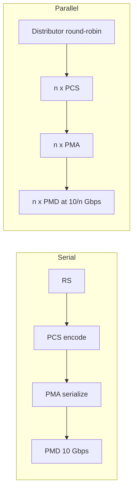

# M26: 10 Gigabit Ethernet

**Source:** https://www.youtube.com/watch?v=yu-UWXqj5wE
**Instructor / expert:** Dr. Yogesh Chaba, Department of Computer Engineering and IT, Guru Jambheshwar University of Science & Technology, Hisar. Course coordinator: Dr. Maninder Singh, Professor and Dean of Academic Affairs, Thapar University, Patiala.

### Learning objectives

- State that 10 Gigabit Ethernet (10 GbE / 10G / 10 GigE) sends Ethernet frames at **10 Gbps**, first in **IEEE 802.3ae-2002**, and that it is **full duplex only** (no hubs, no CSMA/CD).
- Walk the 10G stack: RS, PCS, PMA, PMD, XGMII, MDI, and the **WAN Interface Sublayer (WIS)** for SONET-friendly WAN PHYs.
- Contrast **serial 10 Gbps** vs **parallel n-lane** (including WDM) implementations.
- Recite the unchanged Ethernet MAC frame, why the minimum is **64 octets** without carrier extension, and the LAN-fiber / WAN-fiber / copper / backplane / EPON PHYs with rates, wavelengths, and reaches.

### Core concepts

**10 Gigabit Ethernet** is **wired-LAN (and WAN) transmission at 10 Gbps**. Outline: introduction, **layered architecture**, **PHY and MAC**, then **10G standards**.

#### Demand, HSSG, and what 10G is

As high-speed demand grew, a faster Ethernet was needed. In **March 1999** the **Higher Speed Study Group (HSSG)** formed to develop a **10 Gigabit Ethernet** standard. 10 GbE is described as a **telecommunication technology** offering up to **10 billion bits per second**.

**10 Gigabit Ethernet** (also **10G**, **10GbE**, **10 GigE**) is a group of technologies that transmit **Ethernet frames at 10 Gbps**. It was first defined by **IEEE 802.3ae-2002**.

Unlike earlier Ethernet, **10 GbE defines only full-duplex point-to-point links**, generally via **network switches**. **Shared-medium CSMA/CD was not carried forward**. **Half duplex and hubs do not exist** in 10GbE.

It can use **copper or fiber**, but bandwidth forces **higher-grade copper**: **Category 6, 6A, or 7** for links **up to 100 m**.

#### IEEE 802.3 documents listed in the lecture table

| IEEE document | Year | Lecture’s scope |
|---------------|------|-----------------|
| **802.3ae** | ratified 2002 | 10 Gbps over **fiber** for **LAN and WAN** |
| **802.3ak** | 2004 | 10 Gbps over **twinax** |
| **802.3-2005** | 2005 | Base-standard **revision** incorporating prior amendments |
| **802.3an** | 2006 | 10 Gbps over **copper twisted pair** |
| **802.3ap** | 2007 | **Backplane Ethernet**: **1 and 10 Gbps** over **printed circuit boards** |
| **802.3aq** | 2006 | 10 Gbps over **multimode fiber** with **enhanced equalization** |
| **802.3-2008** | 2008 | Another **base-standard revision** |
| **802.3av** | 2009 | 10 Gbps Ethernet PHY for **EPON** |
| **802.3-2012** | 2012 | Called the **latest version of the base standard** in this lecture |

#### Layered protocol architecture

Ethernet implements the **bottom two OSI layers**: **data link** and **physical**. Mapping in the lecture:

- OSI **physical** → **PMD, PMA, PCS**, and **Reconciliation Sublayer (RS)**
- Toward the **network** side → **MAC** and **LLC**

**Basic media families:**

- **10GBASE-R** — LAN fiber
- **10GBASE-W** — WAN fiber
- **10GBASE-X** — copper (coded family)

**PMD — Physical Medium Dependent.** Signaling on the wire/fiber: **amplify, modulate, wave-shape**. Different PMDs support different media.

**PCS — Physical Coding Sublayer.** Coding plus **serializer / multiplexing**. This structure **distinguishes LAN vs WAN PHYs**:

- **WAN PHY:** PCS operates **serialized**.
- **LAN PHY:** two modes:
  1. **Parallel:** a multiplexer puts data on **four 2.5 Gbps** lines.
  2. **Serial LAN:** serialize/deserialize a **single channel**.

**Serial LAN** uses **64B/66B** coding. For the **serial WAN PHY**, an extra **WAN Interface Sublayer (WIS)** sits between **serial PCS and serial PMA**. WIS **ensures operability with SONET** by including a **simplified SONET frame**.

**PMA — Physical Medium Attachment.** Serializes **code groups** into a bit stream for serial devices (and the reverse). Supports **multiple encodings** for PMDs whose encoding is **medium-specific**.

**Reconciliation Sublayer (RS).** **Command translator**: maps **MAC terminology and commands** into **electrical formats** for PHY entities.

**MAC.** Logical connection between MAC clients and the peer. **Initialize, control, and manage** the peer connection.

**XGMII — 10 Gigabit Media Independent Interface.** Standard **MAC ↔ PHY** interface; **isolates** the MAC so it can run over **various PHYs**.

**MDI — Medium Dependent Interface.** **Connector types** for each medium and PMD.

#### Serial vs parallel PHY implementations

Anyone used to Ethernet notices **two physical-layer options**.

**Serial:** one high-speed **10 Gbps PCS–PMA–PMD** block; **one physical channel at 10 Gbps**.

Transmit: RS passes the MAC data **word by word** to PCS → PCS **encodes** → PMA **serializes** → PMD sends the stream on fiber at **10 Gbps**. Receive is the reverse. **Advantage:** straightforward; **no complicated mux/demux**.

**Parallel:** **n subchannels** (parallel cables or **WDM**). A **distributor** multiplexes MAC data into **n streams in round-robin**; each stream goes to its own PCS → PMA → PMD at **(10 / n) Gbps**. Receive uses a **collector**. **Advantage:** lower PCS/PMA rate, so **cheaper CMOS or bipolar** parts. **Disadvantages:** distributor/collector **sensitive to timing jitter**; **multiple logic sets and lasers**.

#### MAC layer of 10 GbE

Very similar to earlier Ethernet MACs: **same addresses and frame formats**, but **no half duplex**. It can support **data rates less than 10 Gbps** using a **pacing mechanism** for **rate adaptation and flow control**. **Full duplex only**.

**Why drop half duplex.** Original Ethernet’s half duplex used **CSMA/CD** on a shared medium; simplicity helped Ethernet succeed, so many people **wrongly treat CSMA/CD as “standard Ethernet.”** Half duplex’s problems are **efficiency** and **distance**: link distance is limited by **minimum MAC frame size**, which **hurts high-rate** efficiency. At **10 Gbps**, half duplex is **not attractive**; **no realistic market** exists, because most 10 Gbps links are **point-to-point optical**. Full duplex has **no contention**: the MAC may send whenever the **peer is ready to receive**. So the 10G standard specifies **full duplex only**.

**Frame format.** The point of 10G was to **keep the same MAC frame** as earlier Ethernet for **seamless integration**. With full duplex, **link distance does not affect MAC frame size**. **Minimum MAC frame size is 64 octets**, as in previous standards. **Carrier extension is not required.**

| Field | Size | Meaning (same story as Gigabit Ethernet) |
|-------|------|------------------------------------------|
| Preamble | 7 bytes | Alternating 1/0; announces a frame; PHY receive sync |
| Start of Frame Delimiter (SFD) | 1 byte | Alternating 1/0 ending in **two 1s**; next bit is leftmost bit of DA |
| Destination Address | 6 bytes | Leftmost bit 0 = individual, 1 = group; second bit 0 = global, 1 = local admin; remaining 46 bits identify station/group/all |
| Source Address | 6 bytes | Sender; always individual; leftmost bit always 0 |
| Length/Type | 2 bytes | ≤ 1500 → LLC byte count in Data; optional formats use type ID |
| Data | *n* ≤ 1500 bytes | If < 46 bytes, **pad to 46** |
| FCS | 4 bytes | 32-bit CRC over DA, SA, Length/Type, Data |

(The lecture states Length/Type ≤ 1500 as LLC length; it does not repeat the “> 1500 means type” sentence in this module the way Module 25 did, but the field is still described as length **or** type ID for optional formats.)

#### Physical-layer standards, three categories

1. **LAN fiber:** 10GBASE-SR, 10GBASE-LRM, 10GBASE-LR, 10GBASE-ER, 10GBASE-LX4, 10GBASE-ZR  
2. **WAN fiber:** 10GBASE-SW, 10GBASE-LW, 10GBASE-EW  
3. **LAN copper / backplane:** 10GBASE-CX4, 10GBASE-T, 10GBASE-KX4, 10GBASE-KR  

Plus **10GBASE-PR** for PON, taught last.

##### LAN fiber (“R” PHY)

Most common optical variety: **LAN PHY**, used **directly between routers and switches**, letter **R** in the name. Despite the name **LAN**, fiber can run **up to 80 km**. LAN PHY **line rate 10.3 Gbps** with **66-bit** (64B/66B) encoding.

| PHY | Year | Medium / λ | Line rate | Reach | Standard |
|-----|------|------------|-----------|-------|----------|
| **10GBASE-SR** (short reach) | 2002 | Serial **MMF**, **850 nm** | **10.3125 Gbps** | **300–400 m** | 802.3ae |
| **10GBASE-LR** (long range) | 2002 | **1310 nm SMF**, 64B/66B PCS | **10.3125 Gbps** | **10 km** | 802.3ae |
| **10GBASE-ER** (extended range) | 2002 | **1550 nm SMF** | **10.3125 Gbps** | **40 km**; some vendors later **80 km** pluggables | 802.3ae |
| **10GBASE-LX4** | 2002 | **WDM**, **1310 nm**; **four lasers at 3.125 Gbps** on unique wavelengths | (4 × 3.125) | **300 m** on deployed MMF and **10 km** SMF | 802.3ae; lecture says it is being **replaced by 10GBASE-LRM** |
| **10GBASE-LRM** (long-reach multimode) | 2006 | **1310 nm** on **FDDI-grade 62.5 μm MMF** from early-1990s 100 Mbps plants | **10.3125 Gbps** | **220 m** (IEEE 802.3aq figure; ASR in the transcript says “22 m”) | **802.3aq** |

##### WAN fiber (“W” PHY)

**10GBASE-SW, 10GBASE-LW, 10GBASE-EW** use the **WAN PHY**. At the physical layer they **correspond to SR, LR, and ER** respectively, so they use the **same fiber types and distances**. They fall under **IEEE 802.3ae**.

##### Copper LAN and backplane

**10GBASE-CX4** — designed 2002; working group **IEEE 802.3ak**. **Four lanes each direction** over copper using **InfiniBand 4X twinax (8-pair)**. **15 m** maximum. **Lowest cost per port** among 10G interconnects, **at the expense of range**. Each copper lane carries **3.125 GHz** of signaling bandwidth.

**10GBASE-T** — **IEEE 802.3an**, 2006. 10 Gbps on conventional **UTP or STP Cat 6 / 6A / 7**. **Cat 6: 55 m**; **Cat 6A and 7: 100 m**.

**10GBASE-KX4** and **10GBASE-KR** — **backplane Ethernet**, task force **IEEE 802.3ap**, for **blade servers** and **modular routers/switches** with upgradable line cards. Implementations must work with **up to 1 m of copper PCB and two connectors**. Two 10 Gbps port types: **KX4** (four backplane lanes) and **KR** (single lane). **New backplane designs use KR** rather than KX4.

##### 10GBASE-PR (10G EPON / PON)

Originally **IEEE 802.3av**. 10G Ethernet PHY for **passive optical networks**. **1577 nm** lasers **downstream**, **1270 nm** **upstream** (transcript “157 nm” is the IEEE 802.3av downstream wavelength with a dropped digit). Downstream delivers serialized data at **10.3125 Gbps** in a **point-to-multipoint** configuration. Three **power budgets**: **10GBASE-PR10**, **10GBASE-PR20**, and **10GBASE-PR30** (lecture “PR1 / PR20 / PR30”).

### Key terms

| Term | Meaning in this lecture |
|------|-------------------------|
| 10 GbE / 10G / 10 GigE | Ethernet frames at 10 Gbps; full duplex only |
| IEEE 802.3ae-2002 | First 10G Ethernet standard (LAN/WAN fiber) |
| 10GBASE-R / W / X | LAN fiber, WAN fiber, and copper coding families |
| XGMII | 10 Gigabit Media Independent Interface (MAC–PHY) |
| WIS | WAN Interface Sublayer: simplified SONET framing between serial PCS and PMA |
| 64B/66B | Serial LAN PCS coding; LAN PHY line rate about 10.3 / 10.3125 Gbps |
| HSSG | Higher Speed Study Group (March 1999) that started 10G work |
| 10GBASE-T | IEEE 802.3an twisted-pair 10G (Cat 6 55 m; 6A/7 100 m) |
| 10GBASE-PR | IEEE 802.3av 10G EPON PHY with PR10/PR20/PR30 power budgets |

### Lecture takeaways

- 10 GbE is still Ethernet frames, but **only full-duplex switched point-to-point** — CSMA/CD and hubs are gone because half duplex at 10 Gbps is not a market.
- Stack is classic 802.3 PHY split (**PCS/PMA/PMD**) plus **XGMII** and, for WAN, **WIS/SONET**.
- Implementers choose **one 10G serial pipe** (simple) or **n slower lanes / WDM** (cheaper silicon, more jitter and optics).
- MAC frame is the familiar 64-octet-minimum Ethernet frame; **no carrier extension**.
- PHY letter soup is organized as **LAN-R, WAN-W, copper/backplane, and EPON-PR**, with **10.3125 Gbps** as the repeated serial line rate on optical LAN PHYs.
