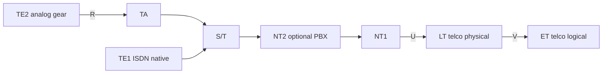

# M27: ISDN

**Source:** https://www.youtube.com/watch?v=xWRKLxEw-v4
**Instructor / expert:** Dr. Lal Chand, Department of Computer Engineering, Punjabi University, Patiala. Course coordinator: Dr. Maninder Singh, Professor and Dean of Academic Affairs, Thapar University, Patiala.

### Learning objectives

- Define ISDN as ITU/CCITT digital circuit- and packet-switched service over ordinary telephone-grade copper (and other media).
- Contrast BRI (2B+D = 144 kbps) with PRI (23B+D / 30B+D) and name B vs D channel rates.
- List bearer, teleservice, and supplementary services, plus TE1/TE2/TA/NT1/NT2 and R–V reference points.
- State ISDN vs ADSL differences, advantages/disadvantages, and the lecture’s security conclusion (logical attacks and HTTPS matter more than the physical medium).

### Core concepts

The lecture is titled **ISDN security**. **ISDN (Integrated Services Digital Network)** is a method to transfer **voice and data** with particular data-accessible services. It is a set of **CCITT / ITU-T** standards for **circuit-switched transmission** of data over various media using **ordinary telephone-grade copper wire**. ISDN provides **worldwide digital communication** in the shift toward electronic documents and business transactions. Its **digital nature facilitates adding security**, but it was **deployed with little thought to security**. It offers **digital circuit-switched voice and data** as well as **packet-switched data**.

#### History: POTS to ISDN

Before ISDN, analog **plain old telephone service (POTS)** was the worldwide default. “POTS” originally expanded as **Post Office Telephone Service**; the name stayed after post offices stopped offering telephony. POTS was mainly **copper from the subscriber to the central office**. Limits: **long-distance calls** had to be **routed through operators and switchboards** (unreliable, slow); **static / line noise** disturbed communication.

In the **1960s** the industry began converting analog systems to **digitized packets** and **digital switching**. The UN **CCITT**, now **ITU-T (International Telecommunication Union — Telecommunication Standardization Sector)**, pushed research toward ISDN and **international digitization**, initiated in **1984**.

Two major US networks, **Northern Telecom** and **AT&T**, took first implementation steps but **did not interoperate** with existing telecom equipment and software — a **worldwide setback by 1990**. Then **National ISDN 1 (NI-1)** was made **compatible with existing proprietary equipment**, so users did not have to switch brands or buy new software. NI-1 set procedures for future digital telephony “for everyone.”

ISDN improved **voice quality** and **Internet access** via its **packet-switched** connection. Voice and data ride a **Bearer (B) channel** at **64 kbps** (sometimes **56 kbps**), versus a telephone line the lecture quotes at **52 kbps**. A **Data (D) channel** is used for **controlling network services and signaling** to set up/tear down connections and to carry signaling related to the B channels, at **16 kbps or 64 kbps**.

**Future:** **Broadband ISDN (B-ISDN)** — voice, data, and video together on **fiber** at **155 Mbps to 622 Mbps and beyond**; called a major R&D topic.

#### Types: BRI and PRI

Two ISDN access types: **Basic Rate ISDN / Basic Rate Interface (BRI)** and **Primary Rate ISDN / Primary Rate Interface (PRI)**.

| Interface | Structure (lecture) | Total |
|-----------|---------------------|-------|
| **BRI** | **2 × 64 kbps B** + **1 × 16 kbps D** | **144 kbps** — enough for **individual users** |
| **PRI** (typical North American) | **23 × 64 kbps B** + **1 × 64 kbps D** | **1.536 Mbps** |
| **PRI** (alternate quoted) | **30 B + 1 D** | **1.984 Mbps** |

BRI is **2B+1D**. The D (Delta) channel is for **link management and signaling**.

PRI **depends on the country**. A typical PRI is **23 B channels at 64 kbps** plus **one 64 kbps D**. One PRI format was **24 DS0s**, looking like a **channelized T1**. Internationally the historical transport rate is **2.048 Mbps** (**E1**; transcript “2.48 Mbps”). On E1, **one of 32 DS0s** was already used for control, leaving **31 DS0s** for ISDN, hence **30B+D**.

A “garden variety” **T1** vs PRI: PRI normally uses **23 channels** as **Bearer (B)** for digital voice or data and the **24th** as **Data (D)** for control — **23B+D**. **One D channel can control more than 23 B channels**, so a **24B** ISDN circuit is possible if **control comes from another PRI**.

#### Features

The major feature vs classic telephony: **speech and information on the same line**. ISDN can deliver **voice, data, video, fax** over a **single line**, with **at least two simultaneous connections**. It gives **access to packet-switched networks**. As a **circuit-switched telephone network** it provides **better voice/data quality than analog**. Users can **attach several devices** instead of buying many analog lines. The **B channel** supplies the **greater data rate**.

#### Three service classes

**Bearer services**, **teleservices**, and **supplementary services**. Teleservices and supplementary services are **visible to end users**; bearer services are **hidden network parts**.

**Bearer services** — real-time **digital information** between users; **OSI layers 1–3**. Example: **64 kbps, 8 kHz-structured** speech: 64 kbps plus **8 kHz timing** that structures data into **octet intervals** for **PCM speech**. Because the network **knows the signal is speech**, it may apply **transforms that do not preserve bit integrity** but still yield **good audio**.

**Teleservices** — higher-level functions on top of bearer service; **OSI layers 4–7**. Examples:

- **Telephony:** speech on a **B channel**, control on **D**
- **Facsimile:** bitmap images on **B**, control on **D**
- **Teletex:** textual/formatted documents on **B**, control on **D**

**Supplementary services** enhance bearer and teleservices independently:

- **Centrex** — emulates a **private network** with specialized features for a subscriber set
- **Call transfer** — move an active call to a third party
- **Call waiting** — notify a busy user of another incoming call
- **Calling line ID** — calling-party address to the called party

These look like circuit-switched phone features but are **equally applicable to packet-switched data calls**.

#### How ISDN works on the pair

Analog/POTS offers **one transmission channel**, so only **one service at a time** (voice **or** data **or** video). ISDN **logically divides the same pair** into multiple channels:

- **B channel:** **64 kbps**. BRI typically has **two B channels** — one often for **voice**, one for **data** — on **one copper pair**.
- **D / Delta channel:** line and call **setup**, **16 kbps** on BRI.

#### Components, protocols, reference points

| Component | Role |
|-----------|------|
| **TE1** (Terminal Equipment type 1) | Native ISDN: ISDN phone, computer, ISDN fax on the ISDN line |
| **TE2** (Terminal Equipment type 2) | Legacy analog phone, old fax, modem, or other gear that needs a TA |
| **TA** (Terminal Adapter) | Lets TE2 (and e.g. **Ethernet** interfaces) talk to the ISDN network |
| **NT1** (Network Termination type 1) | End of the **telco local loop**; start of the **customer premises** network |
| **NT2** (Network Termination type 2) | Usually **absent in homes**; in a large company, the **PBX / private telephone system** |
| **LT** (Line Termination) | Telco **physical** connection |
| **ET** (Exchange Termination) | Telco **logical** connection from the phones into the phone network |

**Reference points** (letters everyone uses to talk about the parts):

- **R** — between old-style telephone and **TA**
- **S** and **T** — in most homes with **no NT2**, they coincide as **S/T bus**
- **U**, **V** — with **LT** and **ET**, on the **phone-company** side

Different segments have different **wiring, speeds, and encoding**. ISDN provides **digital transmission over ordinary telephone copper and other media**. It uses **circuit switching** to establish a **physical point-to-point** path from source to destination (the lecture says “permanent” in the sense of an established circuit). ISDN standards from the **ITU** cover **OSI physical, data-link, and network** layers (bottom three).

#### ISDN vs ADSL

| | ISDN | ADSL (as taught) |
|--|------|------------------|
| Service | Two **voice** channels **or** one **128 kbps** data channel | **Data-only** line |
| Power | Needs **local power**; **dies if local power fails** | Telco copper **stays up** even when **local power fails** |

#### Advantages

- **Multiple digital channels concurrently** on **one copper pair**
- High data rate from the digital scheme: lecture cites **56 kbps**; **BRI** with **channel aggregation** (**BONDING** or **Multilink PPP**) supports **uncompressed 128 kbps** plus overhead/signaling; **PRI** up to **1920 kbps**
- **Many devices share one line** (faxes, computers, cash registers, credit-card readers); information is **routed to the proper destination**
- **Call setup ~2 seconds** vs **30–60 seconds** for analog modems
- Ringing is not an **in-band ring-voltage** on the B channel: the network sends a **digital packet on a separate channel** (**out-of-band**). That **does not disturb** established connections, **takes no B-channel bandwidth**, and makes setup **fast**

#### Disadvantages

- **More costly** than ordinary telephony / landlines
- Providers and users need **special dedicated Digital Services** (extra cost)

#### Security issues (ISDN vs cable / DSL / T1)

On the **physical medium**, **eavesdropping a POTS landline with dial-up modems is physically easier** than spying on newer media: **lower data rate** suits **homemade electronics**, and some newer protocols include **encryption** that **hinders line tapping**.

The lecture’s view: **most attacks now are logical**, not crouching under service boxes at night. Attackers **hack ISP systems or customer machines** (cable/DSL modem or an **unpatched desktop**) by sending **IP packets from far away**. Those attacks are **mostly orthogonal to the medium**. Logical attacks let the attacker try **millions of targets from a basement**, instead of weather, cats, and the chance a neighbor calls the police.

**Physical spying still exists** but is for **specific targets** — the attacker is **after you personally**. Hardening a home network against a **dedicated** attacker is **hard**: think **TEMPEST**, or watching display/keyboard **through a window** with a **telescope** and **high-FPS camera** to record a typed password from about **200 m**.

**Advice for DSL, T1, cable, ISDN:** **choose the ISP** with a **good security reputation**, especially for the **modem they provide** — that matters **more than the physical medium**. **Never do sensitive work over the Internet** without **logical protection such as HTTPS**.

### Key terms

| Term | Meaning in this lecture |
|------|-------------------------|
| ISDN | ITU/CCITT integrated digital voice/data network on phone copper (and other media) |
| B channel | Bearer channel, typically 64 kbps (sometimes 56), carries user voice/data |
| D channel | Delta/data channel for signaling and control (16 kbps BRI, 64 kbps PRI) |
| BRI / 2B+D | Basic Rate Interface, 144 kbps, individual users |
| PRI / 23B+D / 30B+D | Primary Rate, T1-like 1.536 Mbps or E1-like 1.984 Mbps |
| B-ISDN | Broadband ISDN on fiber, 155–622 Mbps and beyond |
| Bearer / teleservice / supplementary | OSI 1–3 network functions; OSI 4–7 user services; add-ons such as Centrex and CLIP |
| TE1, TE2, TA, NT1, NT2 | Native ISDN terminal, legacy terminal, adapter, customer NT, optional PBX |
| Out-of-band signaling | Setup packets on D, not ring voltage on the user channel |
| HTTPS | Example of the logical protection the lecture says to use on any medium |

### Lecture takeaways

- ISDN digitized the local loop: **B channels for payload, D for signaling**, BRI for homes, PRI for sites that need T1/E1-scale bundles.
- Digital operation **could** have made security easier, but ISDN was **rolled out with little security design**.
- Operational wins: shared pair, ~2 s setup, out-of-band signaling, device sharing; costs and special telco service are the downsides.
- Versus ADSL: ISDN can carry voice; ADSL is data-only and often **survives local power loss**.
- Security punchline: **don’t fetishize the medium**. Pick a **reputable ISP/modem**, assume **logical IP attacks**, and protect sensitive use with **HTTPS** (and similar).
