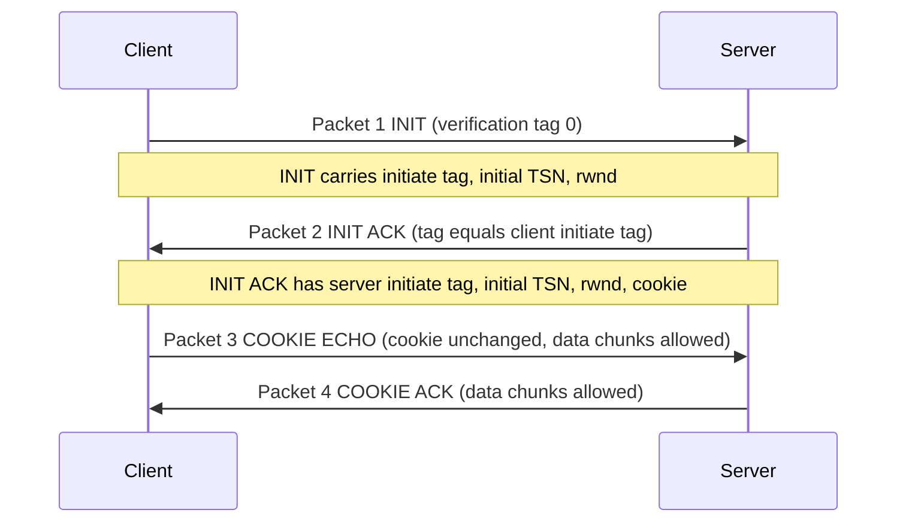

# M28: Stream Control Transmission Protocol (SCTP)

**Source:** https://www.youtube.com/watch?v=a277VGgcYi0
**Instructor / expert:** Dr. Sunil Kumar, Department of Electrical and Computer Engineering, Punjab Agricultural University, Ludhiana. Course coordinator: Dr. Maninder Singh, Professor and Dean of Academic Affairs, Thapar University, Patiala.

### Learning objectives

- Place SCTP as a **reliable, message-oriented** transport between UDP and TCP, aimed at telephony signaling over IP.
- Explain **multistreaming** (association vs TCP’s one stream) and **multihoming** (multiple IP addresses, failover not load-share in current implementations).
- Number data with **TSN**, **SI**, and **SSN**; contrast SCTP **packets/chunks** with TCP **segments**.
- Sketch the **12-byte general header**, chunk layout, and the **four-way handshake** (INIT, INIT ACK, COOKIE ECHO, COOKIE ACK).

### Core concepts

**Stream Control Transmission Protocol (SCTP)** is a **new reliable, message-oriented transport-layer protocol**. In the Internet suite it sits **between application and network**, like TCP and UDP.

It was designed for **recent Internet applications** that need **more sophisticated service than TCP**:

| Application (lecture) | Role |
|------------------------|------|
| **IUA** | ISDN over IP |
| **M2UA**, **M3UA** | Telephony signaling |
| **H.248** | Media Gateway Control |
| **H.323** | IP telephony |
| **SIP** | IP telephony |

SCTP is said to provide the **enhanced performance and reliability** those apps need.

#### UDP vs TCP vs SCTP

**UDP** is **message-oriented**: a process hands UDP a message, which is encapsulated in a **user datagram**. **Message boundaries are conserved**; messages are independent — desirable for **IP telephony** and **real-time data**. UDP is **unreliable**: the sender cannot know fate of messages; they can be **lost, duplicated, or reordered**. UDP also **lacks congestion control and flow control**.

**TCP** is **byte-oriented**: messages become a **byte stream** sent in **segments**; **no message boundaries**. TCP is **reliable**: duplicates detected, lost segments **resent**, bytes delivered **in order**, with **congestion and flow control**.

**SCTP combines the best of both:** **reliable and message-oriented**. It **preserves message boundaries** and still detects **lost, duplicate, and out-of-order** data, with **congestion and flow control**, plus **innovative features** neither UDP nor TCP has.

#### Services offered to applications

**Process-to-process communication.** SCTP uses **well-known ports in the TCP port space**. Extra ports listed:

| Protocol | Port(s) in the lecture |
|----------|-------------------------|
| IUA | **9901** (transcript “90”; IETF IUA well-known port) |
| M2UA | **2904** |
| M3UA | **2905** |
| H.248 | **2949** |
| H.323 | **1718, 1719, 1720** (transcript also garbles “11720”) |
| SIP | **5060** |

**Multiple streams.** A TCP connection is **one stream**; a **loss anywhere blocks the rest** — acceptable for text, bad for **real-time audio/video**. SCTP allows **multistream service** in each connection, called an **association**. If one stream blocks, **others still deliver**. Analogy: **highway lanes** (regular traffic vs carpool).

**Multihoming.** TCP uses **one source IP and one destination IP** even if a host is multihomed. An SCTP association lets each end **define multiple IP addresses**. If **one path fails**, another interface continues — **fault tolerance** for **real-time playback** such as Internet telephony. Example: client on two LANs, server on two networks → **four IP pairs**, but **current implementations** use **only one pair for normal communication**; the alternative is **failover only**. **SCTP does not currently allow load sharing** across paths. An association **allows multiple IPs per end**.

**Full-duplex communication.** Like TCP: data both ways at once; each end has **send and receive buffers**.

**Connection-oriented service.** Like TCP, but the connection is an **association**. Site A and site B: **establish association**, **exchange data both ways**, **terminate**.

**Reliable service.** Like TCP, **acknowledgements** check safe arrival (error control is pointed to, not fully worked in this lecture).

#### Features: TSN, SI, SSN, packets vs segments

**Transmission Sequence Number (TSN).** TCP’s data unit is a **byte**, numbered with a **sequence number**. SCTP’s data unit is a **data chunk**, which **may or may not** be 1:1 with an application message because of **fragmentation**. Transfer is controlled by numbering **chunks**. **TSN** plays TCP’s sequence-number role: **32 bits**, **randomly initialized in 0 … 2³²−1**. Every data chunk **must carry its TSN** in its header.

**Stream Identifier (SI).** TCP: one stream per connection. SCTP: **several streams per association**. Each stream needs a **16-bit SI starting from 0**. Every data chunk **carries SI** so it can be placed in the right stream.

**Stream Sequence Number (SSN).** Delivery is **to the proper stream, in order**. Besides SI, each data chunk in a stream has an **SSN** to order chunks **inside that stream**.

**Packets.** TCP **segments** mix data bytes with **six header flags**. SCTP is different: **data chunks** and **control chunks**; **several of each can share one packet**. An SCTP **packet plays the role of a TCP segment**.

Differences the lecture lists:

| TCP segment | SCTP packet |
|-------------|-------------|
| Control is **in the header** | Control is **control chunks** of several types |
| Data is **one entity** | Several **data chunks**, possibly **different streams** |
| Optional **options** field | **No options field**; new features = **new chunk types** |
| Mandatory header **20 bytes** | General header **12 bytes** |
| Sequence number in header | **TSN lives in each data-chunk header** |
| ACK and window in header | ACK and window in **control chunks** |
| Header length (HL) needed because options vary | **Fixed 12-byte** header, no HL |
| Urgent pointer | **None** in SCTP |
| Checksum **16 bits** | Checksum **32 bits** |
| Connection ID = **IP + ports** | **Multihoming** ⇒ **verification tag** identifies the association |
| One sequence number = first data byte | Several chunks ⇒ **TSN / SI / SSN** per data chunk |
| Some **control segments consume a sequence number** | **Control chunks never use TSN, SI, or SSN** — those three belong **only to data chunks**, not the whole packet |

Control and data travel in **separate chunks**. An association sends **many packets**; a packet may hold **several chunks**; chunks may belong to **different streams**.

**Worked packing example.** Process A sends **11 messages** to B on **three streams**: first **four** in stream 0, next **three** in stream 1, last **four** in stream 2. Assume each message fits **one data chunk** (no fragmentation) and the process delivers **stream 0, then 1, then 2**. Network allows **only three data chunks per packet** → **four packets**:

- Stream 0 chunks: packet 1 and part of packet 2
- Stream 1: rest of packet 2 and packet 3
- Stream 2: rest of packet 3 and packet 4

Each data chunk needs **three identifiers**: **TSN** (cumulative, for **flow and error control**), **SI** (which stream), **SSN** (order **in that stream**, starting at **0 per stream**).

**Acknowledgements.** TCP ACKs are **byte-oriented** (sequence numbers). SCTP ACKs are **chunk-oriented** (they refer to **TSN**). TCP control-only segments still use seq/ACK (e.g. **SYN** needs **ACK**). SCTP **control chunks have no TSN**; they are **acked by another control chunk of the right type** — **INIT** by **INIT ACK**. **No sequence/ACK number is needed** for that. **SCTP acknowledgement numbers ack only data chunks**; control chunks ack **other control chunks** if needed.

#### Packet format

Mandatory **12-byte general header** plus a **variable-length set of chunks**. **Control chunks** maintain the association; **data chunks** carry user data. In a packet, **control chunks come before data chunks**.

**General header** — four fields; defines endpoints, binds the packet to an association, and protects integrity **including the header**:

| Field | Size | Role |
|-------|------|------|
| Source port | 16 bits | Sending process |
| Destination port | 16 bits | Receiving process |
| Verification tag | (association ID) | Matches packet to **this** association; stops a packet from a **previous** association being accepted; **repeated in every packet**; **separate tag each direction** |
| Checksum | 32 bits | **CRC-32** (increased from TCP’s 16 bits to allow CRC-32) |

**Chunks** share a layout: first **three fields common**, then type-specific information. Information must be a **multiple of 4 bytes**; else **padding**. Chunks end on a **32-bit boundary**.

| Common field | Size | Role |
|--------------|------|------|
| Type | 8 bits | Up to **256** chunk types; few defined, rest reserved |
| Flags | 8 bits | Meaning **depends on type** |
| Length | 16 bits | **Total chunk size in bytes**, including type, flags, and length |

#### Association: four-way handshake

SCTP is connection-oriented; the connection is an **association** to emphasize **multihoming**. Establishment is a **four-way handshake**. Normally a **client** initiates toward a **server** that is **prepared to receive** associations (like TCP listen).

**Normal steps**

1. **Client → server: INIT chunk.** General-header **verification tag is 0** (none defined yet client→server). INIT includes an **initiate tag** for packets **server→client**, the **initial TSN** this direction, and advertises **rwnd** (receive window). rwnd is normally in a **SACK** chunk; it is sent here because SCTP allows **data chunks in packets 3 and 4**, so the server must know **client buffer size**. **No other chunks** with the first packet.
2. **Server → client: INIT ACK.** Verification tag = **initiate tag from INIT**. Chunk sets the tag for the **other direction**, **initial TSN** server→client, and **server rwnd** so the client may send a **data chunk in packet 3**. INIT ACK also carries a **cookie** defining the **server’s state at that moment**.
3. **Client → server: COOKIE ECHO.** Simple chunk that **echoes the cookie unchanged**. **Data chunks are allowed** in this packet.
4. **Server → client: COOKIE ACK**, acknowledging COOKIE ECHO. **Data chunks allowed** here too.

(The lecture says cookie use would be discussed “shortly” and then ends after describing the echo; the taught fact is that the cookie **captures server state** and is **returned unmodified**.)

### Key terms

| Term | Meaning in this lecture |
|------|-------------------------|
| SCTP | Reliable, message-oriented transport combining UDP’s boundaries with TCP’s reliability, plus streams and multihoming |
| Association | SCTP’s name for a connection (multihoming-aware) |
| TSN | 32-bit transmission sequence number on **data chunks** |
| SI / SSN | Stream identifier and per-stream sequence number on data chunks |
| Chunk | Control or data block; several per packet; control before data |
| Verification tag | Per-direction association identifier (needed because of multihoming) |
| CRC-32 | 32-bit packet checksum in the 12-byte general header |
| INIT / INIT ACK / COOKIE ECHO / COOKIE ACK | Four-way handshake chunks |
| rwnd | Advertised receive window (in INIT/INIT ACK so data can ride packets 3–4) |

### Lecture takeaways

- SCTP exists because **SS7-style signaling and IP telephony** need **message boundaries and reliability together**, which neither UDP nor TCP fully gives.
- An **association** can carry **many streams** (head-of-line blocking on one stream does not freeze the others) and **many IPs** (failover; **not** load-sharing in “current” implementations).
- Numbering is **chunk-based**: **TSN** globally, **SI+SSN** per stream; **control never consumes TSN**.
- The on-wire unit is a **packet**: 12-byte header (ports, verification tag, CRC-32) plus padded chunks.
- Setup is **four-way** with a **cookie**, and **user data may already appear** in the third and fourth packets.
