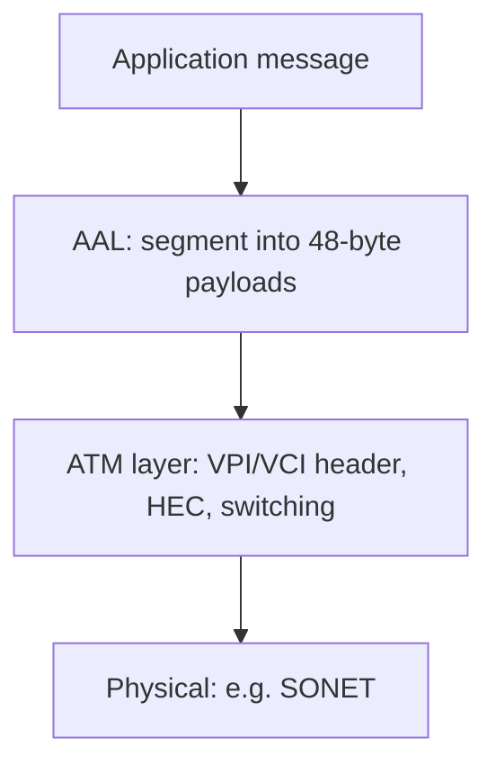

# M29: ATM Network Security Protocol

**Source:** https://www.youtube.com/watch?v=JdRurgWuHvQ
**Instructor / expert:** Dr. Lal Chand, Department of Computer Engineering, Punjabi University, Patiala. Course coordinator: Dr. Maninder Singh, Professor and Dean of Academic Affairs, Thapar University, Patiala.

### Learning objectives

- Define ATM as **asynchronous time-division multiplexing** of **fixed 53-byte cells** (5-byte header + 48-byte payload) on a **SONET/ISDN-style** backbone, with a VC set up **before** data.
- Decode **UNI vs NNI** headers (GFC, VPI, VCI, PT/EFCI/AUU, CLP, HEC) and name ABR/CBR/UBR/VBR.
- List ATM Forum–style security goals (confidentiality, AAL integrity, signaling signatures, availability functions) and ATM-specific threats (**VC stealing**, traffic analysis).
- Recite QoS/traffic parameters (PCR, SCR, CLR, CTD, CDV, BT/MBS, MCR), CAC, and the lecture’s ATM **disadvantages**.

### Core concepts

**Asynchronous Transfer Mode (ATM)** is a **switching technique** for telecommunication networks that uses **asynchronous time-division multiplexing** to encode data into **small fixed-size cells**. That differs from **Ethernet or the Internet**, which use **variable-size packets/frames**. ATM is called the **core protocol over the SONET backbone of ISDN**.

#### Why cells, not variable packets

ATM was designed with **cells** because **voice** is packetized and must **share a network with bursty data**. However small the voice packets, they would otherwise meet **full-size data packets** and suffer **maximum queueing delay**. So **all data units should be the same size**.

Fixed cells can be **switched in hardware** without delays of **routed frames and software switching** — why some people thought ATM was the key to the **Internet bandwidth problem**.

ATM **creates fixed routes between two points before transfer**, unlike **TCP/IP**, where packets may take **different routes**. That makes **usage accounting** easier, but an ATM network is **less adaptable to a sudden traffic surge**.

ATM provides **data-link services** on **OSI layer-1 physical links**. It behaves like a mix of **small packet switching and circuit switching**, suited to **real-time low-latency** traffic (**VoIP and video**) and **high-throughput** transfers (files). A **virtual circuit (connection)** must exist before endpoints exchange data.

#### Bit-rate service classes

| Class | Lecture meaning |
|-------|-----------------|
| **Available bit rate (ABR)** | **Guaranteed minimum** capacity; may **burst higher** when the network is idle |
| **Constant bit rate (CBR)** | **Fixed** rate, **steady stream** — analogous to a **leased line** |
| **Unspecified bit rate (UBR)** | **No throughput guarantee**; for **delay-tolerant** apps such as file transfer |
| **Variable bit rate (VBR)** | **Specified throughput** but **not sent evenly** — popular for **voice and video conferencing** |

(The transcript’s first class is unnamed “bit rate provides a guaranteed minimum”; that is the **ABR** definition in this list.)

#### ATM cell structure

An ATM cell is a **5-byte header** plus a **48-byte payload**. Two formats: **UNI (User–Network Interface)** and **NNI (Network–Network Interface)**. **Most links use UNI**.

| Field | Size | Notes |
|-------|------|--------|
| **GFC** (Generic Flow Control) | 4 bits (UNI) | Default **0**. Intended for **local flow control / sub-multiplexing** so several terminals can share one network connection, like **two ISDN phones on one BRI**. **All four GFC bits must be zero by default** |
| **VPI** (Virtual Path Identifier) | **8 bits UNI** / **12 bits NNI** | Path identifier |
| **VCI** (Virtual Channel Identifier) | **16 bits** | Channel identifier |
| **PT** (Payload Type) | **3 bits** | Special cell kinds |
| **CLP** (Cell Loss Priority) | **1 bit** | Which cells to drop first in congestion |
| **HEC** (Header Error Control) | **8 bits** | CRC polynomial **x⁸ + x² + 1** |

**PT field (user vs management)**

- **PT bit 3 (MSB):** **1** = **network management** cell; **0** = **user data** cell, then:
  - **PT bit 2:** **Explicit Forward Congestion Indication (EFCI)** — **1** = congestion experienced
  - **PT bit 1:** **AUU** (ATM user-to-user) bit, used by **AAL5** to mark **packet boundaries**
- If MSB of PT is **1** (management), the other two bits distinguish: **network-management segment**, **network-management end-to-end**, **resource management**, and **reserved**.

ATM uses PT for **OAM** (Operations, Administration, and Management) cells and to **delineate packets** in some **ATM Adaptation Layers (AAL)**.

Several link protocols use **HEC** to drive a **CRC-based framing** algorithm that **finds cell boundaries with no extra overhead** beyond header protection. The 8-bit CRC **corrects single-bit header errors** and **detects multi-bit header errors**. On multi-bit errors, the **current and subsequent cells are dropped** until a cell with a **good header** is found.

**NNI** matches UNI except **GFC is reallocated to VPI**, extending VPI to **12 bits**. The lecture then claims a single NNI interconnection can address almost **2¹⁶ VPs** of almost **2¹⁶ VCs** each (field sizes taught are **12-bit VPI** and **16-bit VCI**); **some VP/VC numbers are reserved**.

#### ATM network interfaces

- **User-to-network interface** — public and private
- **Network-to-network / network-to-node interface** — **private NNI**, **public NNI**
- **Data Exchange Interface (DXI)** between **packet routers** and **ATM DSUs** (Digital Service Units)

**ATM Adaptation Layer (AAL):** how to **break application messages into cells**.

**ATM layer:** transmission, switching, reception, **congestion control**, **buffer management**, **cell-header generation/removal** at source/destination, **reset connection identifiers for the next hop** at a switch, **cell address translation**, **sequential delivery**.

#### ATM Forum security services

**Data confidentiality** — protect business data from unauthorized persons; data available **only to intended, authorized** parties.

**Data integrity and authentication** — accuracy and consistency; data **not changed by unauthorized persons**. **AAL frames** are protected by appending a **cryptographic checksum**. **Reordering protection** is possible by putting a **sequence number into AAL frames before** that checksum.

**Signaling protection** — signaling may be **authenticated and integrity-protected** by a **digital signature** in an **information element (IE)**, especially if an **SME (security message exchange)** protocol is used. **SETUP and CONNECT** are protected by signing **IE fields specified by SME**. Protection is still offered for other messages (**RELEASE, STATUS, RESTART**) and for SETUP/CONNECT **if SME is not used**, by signing **part of the IE**.

**Availability** — the lecture restates integrity language here, then lists what an **ATM security system should provide**:

| Function | Meaning |
|----------|---------|
| Verification of identities | Establish and verify claimed identity of any **actor** |
| Controlled access and authorization | No access to information/resources if **not authorized** |
| Protection of confidentiality | Stored and communicated data stay confidential |
| Protection of data integrity | Integrity of stored and communicated data |
| Strong accountability | An entity **cannot deny** its actions and their effects |
| Activities logging | Retrieve security-activity info in network elements, **traceable to individuals/entities** |
| Alarm reporting | Alarms for **adjustable, selective** security-related events |
| Audit | After violations, analyze **security-relevant logs** |
| Security recovery | Recover from **successful or attempted** breaches |
| Security management | Manage the services derived from the above; **foundations of the security system**. If the system **cannot recover** and **stops providing** security services, it is **no longer secure**. Security services and security information must themselves be **managed securely** |

#### Threats to ATM

Typical threats: **eavesdropping, spoofing, service denial, VC stealing, traffic analysis**. **VC stealing and traffic analysis happen only in ATM networks** (as taught).

**Eavesdropping** — tap the media and read data. Common. Because many ATM nets use **fiber**, people may **wrongly think** tapping is hard.

**Spoofing** — impersonate a user to a third party to use or destroy the victim’s resources. May need **PDU-manipulation tools** and sometimes **special access** (e.g. **superuser on Unix**). Because networks interconnect via the **Internet**, it is **impossible to prevent** a hacker getting that access or even **tracing** who has it. ATM in the **public domain** is subject to this.

**Service denial** — ATM is **connection-oriented**; a **VC** is managed by **signals**. Setup uses **SETUP**; teardown uses **RELEASE** or **DROP PARTY**. If an attacker sends **RELEASE or DROP PARTY** to **any intermediate switch** on the VC, the VC **disconnects**. Doing that **frequently** disturbs communication and **disables QoS**. Combined with eavesdropping, the attacker can **block one user from another entirely**.

**Stealing of VCs** — if **two switches compromise**, they can steal a VC. Example: **VC1** (user U1) and **VC2** (user U2) both traverse switches **A** and **B**. **A** switches U1’s cells A→B onto **VC2**; **B** switches them back to **VC1**. Switches forward on **VCI/VPI**; A and B **alter those fields back and forth**. Intermediate switches **will not notice** and treat cells as authentic VC2. In a public packet network U1 might gain little; in ATM with **guaranteed QoS**, U1 can steal a **higher-quality channel** they are **not entitled to**, and can gain more if **users pay for communication**. **U2 is hurt**. Switch compromise looks unlikely if **one organization** owns the net; in **ATM internetworking**, cells traverse **different ATM networks**, so two switches **compromising is much easier**.

**Traffic analysis** — infer information from **volume, timing, and parties** of a VC. Volume and timing remain even if **data is encrypted**; **source and destination** often come from the **cell header in the clear** plus **routing-table knowledge**. Related: **covert channels** — encode information in **timing, volume, VCI, or even session keys** to leak data without being monitored. These two “won’t normally happen,” but may in **stringent-security** environments.

#### Traffic management and QoS parameters

To deliver **guaranteed QoS on demand** while **maximizing utilization**, ATM needs **traffic management** almost everywhere: **signaling, routing, resource allocation, policing**.

Users can specify, at connection setup:

| Parameter | Meaning |
|-----------|---------|
| **PCR** (Peak Cell Rate) | Maximum instantaneous rate; inverse of **minimum inter-cell interval** (bursty traffic varies) |
| **SCR** (Sustained Cell Rate) | Average rate over a **long interval** |
| **CLR** (Cell Loss Ratio) | Percent of cells **lost to error or congestion** and not delivered. **CLP=1** cells are discarded first in congestion; loss of **CLP=0** is more harmful. CLR can be specified **separately** for CLP=1 and CLP=0 |
| **CTD** (Cell Transfer Delay) | Delay from network **entry to exit**: propagation, queueing at switches, service times |
| **CDV** (Cell Delay Variation) | Variance of CTD; high variation ⇒ **larger buffers** for delay-sensitive **voice/video** |
| **BT** (Burst Tolerance) | Maximum burst that can be sent at **peak rate**; **bucket size** of the **leaky-bucket** algorithm that **controls traffic entering the network**. Arriving cells go in a bucket **drained at SCR**; **MBS (Maximum Burst Size)** is the max **back-to-back cells at PCR** |
| **MCR** (Minimum Cell Rate) | Minimum rate **desired by a user** |

The **first six** were originally in **UNI version 3**.

**Traffic contract.** For guaranteed QoS, a contract at setup contains a **connection traffic descriptor** and a **conformance definition**. **Not every VC needs specified QoS**: if only specified-QoS connections were supported, a **large fraction of resources would be wasted** when connections **do not use their full contract**. **Unspecified QoS** can be supported **best-effort**, which is **enough for most existing data applications**.

**Congestion control.** Congestion is when **ingress to a link exceeds egress capacity**. Goal: **good throughput and delay** with **fair allocation**. One avoidance method: accept a new connection at setup **only if resources suffice** for acceptable QoS — **Connection Admission Control (CAC)**, required where QoS **must be guaranteed**.

#### Disadvantages of ATM (as taught)

ATM was **not widely accepted**, though **some phone companies still use it in backbone networks**. **Expense, complexity, and lack of interoperability** blocked prevalence.

| Drawback | Lecture detail |
|----------|----------------|
| **Expense** | Even a **moderate ATM switch** costs far more than **inexpensive LAN hardware**; ATM **NICs** cost much more than Ethernet NICs |
| **Connection-setup latency** | Connection-oriented paradigm: **setup and teardown** of a distant VC can take **longer than using it** |
| **Cell tax** | Headers impose a **10% tax** on all data; Ethernet’s comparable tax is **1%** |
| **No efficient broadcast** | Connection-oriented nets are sometimes **NBMA (Non-Broadcast Multiple Access)**; hardware **lacks broadcast/multicast**. Broadcast is **simulated** by an application **copying data to each computer** — **inefficient** |
| **Complexity of QoS** | Spec is **cumbersome**; many implementations **do not support the full standard** |
| **Assumption of homogeneity** | Designed as a **single universal** system; **minimal provision** to interoperate with other technologies |

### Key terms

| Term | Meaning in this lecture |
|------|-------------------------|
| ATM cell | 5-byte header + 48-byte payload, hardware-switched |
| UNI / NNI | User–network vs network–network cell formats (GFC vs extra VPI bits) |
| VPI / VCI | Virtual path and channel IDs used for forwarding (and for VC-stealing attacks) |
| HEC | 8-bit header CRC; framing plus single-bit correct / multi-bit drop |
| AAL / AAL5 | Adaptation layer; AAL5 uses the AUU PT bit for packet boundaries |
| ABR / CBR / UBR / VBR | ATM bit-rate service classes |
| VC stealing | Compromised switches swap VPI/VCI to ride another user’s QoS |
| CAC | Connection admission control at setup for guaranteed QoS |
| Cell tax | 10% header overhead vs ~1% on Ethernet |
| NBMA | Non-broadcast multiple access — ATM has no native broadcast |

### Lecture takeaways

- ATM’s security and performance story starts from **fixed cells and pre-established VCs** on a **SONET-class** fabric — good for **voice/video latency**, awkward for **surges** and **broadcast**.
- Header fields (**VPI/VCI, PT, CLP, HEC**) are both the switching mechanism and the **attack surface** (clear-text parties, CLP drops, false RELEASE).
- Forum-style security is **confidentiality, AAL checksums/sequence numbers, signed signaling, and a full management lifecycle** (log, alarm, audit, recover).
- Unique ATM threats taught here: **VC stealing** between colluding switches and **traffic/covert-channel analysis** despite encryption.
- QoS is a **traffic contract** (PCR/SCR/CLR/CTD/CDV/BT/MCR) plus **CAC**; unspecified QoS exists so the network is not wasted.
- The closer is practical: ATM **lost the LAN** to cheaper, simpler, more interoperable Ethernet despite remaining in some **telco backbones**.
