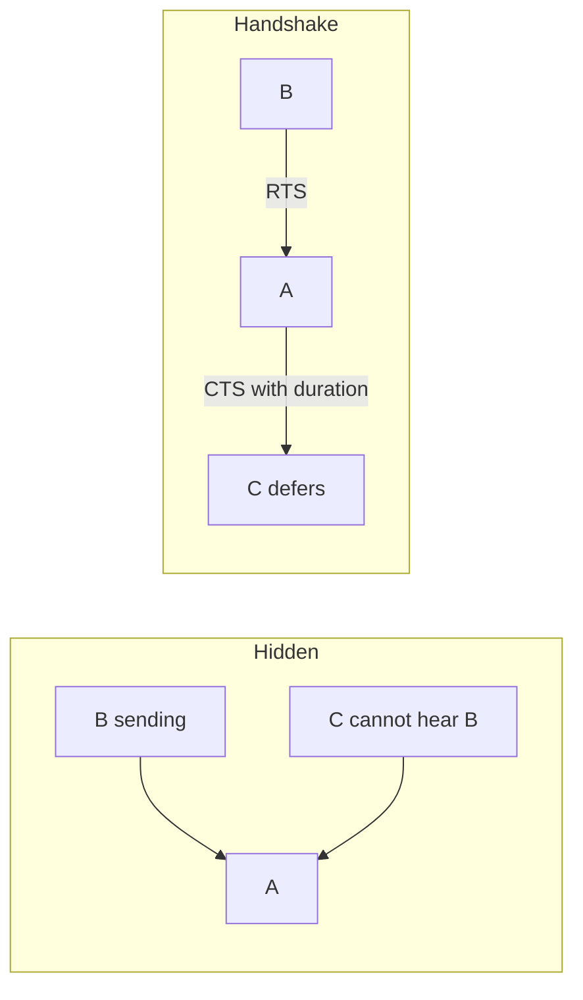

# M30: Wireless Networks

**Source:** https://www.youtube.com/watch?v=MdLxztyDzck
**Instructor / expert:** Dr. Navdeep Singh, Department of Computer Engineering, Punjabi University, Patiala. Course coordinator: Dr. Maninder Singh, Professor and Dean of Academic Affairs, Thapar University, Patiala.

### Learning objectives

- Define a wireless network as radio (OSI physical layer) used to avoid cabling, and classify **WPAN, WLAN, WMAN, WWAN**.
- Describe Bluetooth **IEEE 802.15**: piconet/scatternet, 2.4 GHz ISM FHSS/GFSK, baseband/LMP/L2CAP, and the 72/54-bit frame.
- Explain IEEE 802.11 BSS/ESS, station mobility, **DCF (CSMA/CA)** vs **PCF**, why CSMA/CD fails, 802.11 MAC frame/types, and **hidden vs exposed station** (RTS/CTS).
- Outline WiMAX (IEEE 802.16), WWAN microwave/cellular (cells, BSC/MSC), and satellite networks as taught.

### Core concepts

The stated aims are to **identify basic topologies and their variations** and to **choose an appropriate topology** for a network plan. A **wireless network** is any computer network that uses **wireless data connections** between nodes. Homes, telecom networks, and enterprises use it to **avoid the cost of cabling** a building or linking equipment rooms. Wireless telecom is generally **radio**, implemented at the **OSI physical layer**.

Four categories: **Wireless PAN, Wireless LAN, Wireless MAN, Wireless WAN**.

#### Wireless PAN (Personal Area Network)

WPANs interconnect devices in a **relatively small area**, generally **within a person’s reach**. Examples: **Bluetooth radio** and **infrared light** linking a **headset to a laptop**.

##### Bluetooth

Bluetooth transfers data between electronic devices over a **short distance** compared with other wireless modes. It **removes cords, cables, and adapters**. A Bluetooth LAN is an **ad hoc** network formed **spontaneously**: gadgets find each other and form a **piconet**. It can connect to the **Internet** if one gadget has that capability.

The name comes from **Harald Bluetooth (Harald Blåtand)**, king of Denmark who united **Denmark and Norway**; *Blåtand* translates as Bluetooth. Today Bluetooth implements **IEEE 802.15**. Protocols let devices **find and connect (pairing)** and **securely transfer data**.

**Two network types: piconet and scatternet.**

A **piconet** is a small net of **up to eight stations**: **one primary (master)** and the rest **secondaries (slaves)**. All secondaries **synchronize clocks and hopping sequence** with the primary. **Only one primary**. Communication is **one-to-one or one-to-many**. A piconet can have a **maximum of seven active secondaries**; **additional secondaries** (the lecture says **eight**) can be in the **parked state**: **synchronized with the primary but not communicating** until moved out of park. Because only **eight stations can be active**, activating a parked station means an **active station must park**.

A **scatternet** combines piconets: a **secondary in one piconet can be primary in another**, receiving from the first primary and forwarding to secondaries in the second piconet. A station can be a **member of two piconets**.

**Radio:** **2.4 GHz ISM** band, **79 channels of 1 MHz**. Physical layer: **frequency-hopping spread spectrum (FHSS)** to avoid interference. Bluetooth **hops 1600 times per second** (modulation frequency changes 1600/s). Bits map with **GFSK** (FSK with **Gaussian bandwidth filtering**): bit **1** = deviation **above** the carrier, bit **0** = deviation **below**. Carrier frequencies: **Fc = 2402 + n MHz** for **n = 0 … 78**. Channel 0 uses **2402 MHz**, channel 1 **2403 MHz** (transcript “242/243 MHz” drops a zero).

**Stack (as taught)**

- **Link control / baseband** — analogous to a MAC sublayer but with physical-layer elements: how the **master controls time slots** and how slots **group into frames**.
- **Link Manager (LMP)** — logical channels, **power management, pairing, encryption, QoS**; sits **below the Host Controller Interface (HCI)**. Typically protocols **below HCI run on the Bluetooth chip**, **above HCI on the host device**.
- **L2CAP** (Logical Link Control and Adaptation Protocol) — **variable-length messages** and **reliability if needed**. Users include **SDP (Service Discovery Protocol)** to locate services, and **RFCOMM** which **emulates a PC serial port** (keyboard, mouse, modem).
- **Applications / profiles** — vertical slices of the stack for a purpose (e.g. **headset profile**). Profiles may include L2CAP if they send packets, or **skip L2CAP** for a **steady flow of audio samples**.

**Bluetooth frame**

| Field | Size | Content |
|-------|------|---------|
| **Access code** | 72 bits | Sync bits and **primary identifier**, to distinguish one piconet’s frames from another |
| **Header** | 54 bits | A repeated pattern; **six subfields** (see below). Implemented as **three identical 18-bit sections** |
| **Payload** | 0–2740 bits | Upper-layer data or control |

Header subfields:

| Subfield | Bits | Role |
|----------|------|------|
| Address | 3 | Up to **7 secondaries**; **0 = broadcast** from primary to all secondaries |
| Type | 4 | Type of upper-layer data |
| F (flow) | 1 | Set ⇒ device **cannot receive more** (buffer full) |
| A (ACK) | 1 | **Stop-and-wait ARQ**; one bit suffices |
| S (seq) | 1 | Stop-and-wait **sequence**; one bit suffices |
| HEC | 8 | Checksum over each **18-bit header section** |

The header’s **three identical 18-bit copies** are compared **bit by bit**; if bits differ, **majority vote**. That is **forward error correction**. **Double error control** is needed because radio is **very noisy**. **No retransmission in this sublayer**.

**Applications listed:** wireless **phone headset** (phone in a bag; reduces **radiation to the head**); **PDA/PC/laptop sync**; send email from a laptop **via the phone after a flight**; **wireless mouse and keyboard**; phone **alert when the laptop gets mail**; **find a printer** from a laptop.

**Key Bluetooth features:** less complication, **less power**, **cheaper**, **robustness**.

#### Wireless LAN

WLANs are the **most important access-network technologies** on the Internet. The most popular is **IEEE 802.11**, also known as **Wi-Fi**.

IEEE 802.11 defines two service sets:

**Basic Service Set (BSS)** — building block: stationary or mobile wireless stations plus an **optional central base station**, the **access point (AP)**.

- BSS **without AP**: **standalone**, cannot send data to another BSS — **ad hoc**. Stations **locate one another** and agree to form a BSS.
- BSS **with AP**: **infrastructure** network.

When **multiple BSSs** connect: stations in range can talk **without an AP**, but communication **between stations in different BSSs usually goes via two APs** — like **cellular**, if each BSS is a **cell** and each AP a **base station**. A mobile station can **belong to more than one BSS at once**.

**Extended Service Set (ESS)** — interconnection of BSSs (implied by the three mobility types).

**Station types by mobility (IEEE 802.11)**

| Type | Movement |
|------|----------|
| **No-transition** | Stationary, or moving **only inside one BSS** |
| **BSS-transition** | From one BSS to another, still **inside one ESS** |
| **ESS-transition** | From one ESS to another; **IEEE 802.11 does not guarantee continuous communication** during the move |

**MAC: DCF and PCF**

IEEE 802.11 defines two MAC sublayers: **Distributed Coordination Function (DCF)** and **Point Coordination Function (PCF)**.

**DCF** uses **CSMA/CA** (carrier-sense multiple access with **collision avoidance**). WLANs **cannot implement CSMA/CD** for three reasons:

1. Collision detection would require **sending and receiving collision signals at once** → **costly stations** and **more bandwidth**.
2. Collisions may be **missed** because of the **hidden-station problem**.
3. **Distance and fading** can hide a collision at the far end.

**PCF** is **optional**, **infrastructure only** (not ad hoc), implemented **on top of DCF**, mostly for **time-sensitive** traffic. It is **centralized, contention-free polling**: the **AP polls** capable stations one after another; they send data **to the AP**. To **prefer PCF over DCF**, extra interframe spaces **PIFS** and **SIFS** are defined. **SIFS** is the same as in DCF; **PIFS is shorter than DIFS**, so if a DCF station and an AP both want the medium, the **AP wins**.

**IEEE 802.11 MAC frame (nine field groups as taught)**

| Field | Size | Role |
|-------|------|------|
| Frame Control (FC) | 2 bytes | Frame type and control |
| Duration / ID | (in FC discussion) | In almost all types: **duration of transmission** used to set **NAV**; in one control frame: **frame ID** |
| Address (×4) | 6 bytes each | Meaning depends on **To DS** and **From DS** bits |
| Sequence control | | Sequence number for **flow control** |
| Frame body | 0–2312 bytes | Depends on FC type/subtype |
| FCS | 4 bytes | **CRC-32** |

**Three frame categories:** **management** (initial communication between stations and APs), **control** (channel access and acknowledgements), **data** (data and control information).

##### Hidden station problem

Station **B**’s range is one oval, **C**’s another. **C is outside B’s range and vice versa**. **A** hears **both**. If **B is sending to A**, **C** cannot hear B, thinks the medium **idle**, sends to A → **collision at A**. B and C are **hidden from each other with respect to A**. Hidden stations **reduce capacity**.

**Solution: handshake frames (RTS/CTS).** **RTS** from B reaches A **not C**. **CTS** from A (with **duration** of B→A data) reaches **both B and C** because both are in **A’s range**. **C** then **refrains** until that duration ends.

##### Exposed station problem

Inverse: **A transmits to B**. **C** has data for **D** that would **not interfere**, but **C hears A** and **refrains** — **too conservative**, wasting capacity. **RTS/CTS does not fully fix this.** C hears **RTS from A** but **not CTS from B**. C can wait for B’s CTS to reach A, then send **RTS to D**. A (sending, not receiving) may ignore it; **B might CTS**. If **A has already started data**, **C cannot hear D’s CTS** because of collision, so **C stays exposed until A finishes**.

#### Wireless MAN

A **WMAN** connects several WLANs. **WiMAX** is a WMAN described by **IEEE 802.16**. It enables **wireless transmission of packets at broadband rates**, giving computers/mobiles **mobility and high-speed Internet** without cable or a **Wi-Fi hotspot**.

Implementation needs **telecom-scale infrastructure** like **GSM/CDMA**: **base stations, sectorized antennas, control centers**, and other critical parts.

Media claims of **over 30 miles** from **one base station** hold only in **ideal conditions**. Practically, **satisfactory broadband** is about **4–5 miles**; with **line of sight** up to **10 miles**. Coverage and QoS otherwise depend on **terrain and population**.

#### Wireless WAN

WWANs cover **large areas** (neighboring towns/cities): **branch offices** or **public Internet access**. Links between access points are usually **point-to-point microwave** using **parabolic dishes** on the **2.4 GHz** band, not only the directional antennas of smaller nets. A typical system has **base-station gateways, access points, and wireless bridging relays**. Other configurations are **meshes** where each AP **relays**.

Wireless is also used in **cellular telephony and satellite networks**.

**Cellular:** communication between **two mobile stations** or between a mobile and a **stationary land unit**. The provider must **locate and track** a caller, **assign a channel**, and **hand the channel from base station to base station** as the caller leaves range. Each service area is split into **cells**. Each cell has an **antenna** and a **solar- or AC-powered base station**. Base stations are controlled by a **Mobile Switching Center (MSC)** that coordinates them with the **telephone central office**: **connects calls, records call information, bills**.

**Cell size is not fixed**: high-density areas need **more, geographically smaller cells**. Once set, size is optimized to **limit adjacent-cell interference**. **Transmit power is kept low** so a cell does not interfere with others.

**Satellite network:** nodes including **satellites** providing Earth-to-Earth communication. A node may be a **satellite, earth station, or end-user terminal/telephone**. A **natural satellite (the Moon)** could relay, but **artificial satellites** are preferred so we can install electronics that **regenerate** a weakened signal. Natural satellites are also **too far**, causing **long delay**. Like cellular, satellite nets **divide the planet into cells**. They can reach **any location**, however remote — **high-quality communication for undeveloped regions without huge ground infrastructure**.

The lecture closes: topologies and variations, wireless standards and features, and advantages; **security management is deferred to the next lecture**.

### Key terms

| Term | Meaning in this lecture |
|------|-------------------------|
| WPAN / WLAN / WMAN / WWAN | Personal, local, metro, and wide-area wireless scopes |
| Piconet / scatternet | Bluetooth 1-master small net vs overlapping piconets |
| Parked state | Bluetooth secondary synced but not in the active seven |
| GFSK / FHSS 1600 hop/s | Bluetooth 2.4 GHz ISM modulation and hopping |
| BSS / ESS / AP | 802.11 building block, extended set, optional access point |
| DCF / PCF | CSMA/CA distributed access vs AP polling (PIFS < DIFS) |
| Hidden / exposed station | Collision because sender cannot hear a peer vs false deferral |
| RTS/CTS | Handshake that advertises duration so hidden nodes defer |
| WiMAX / IEEE 802.16 | Broadband WMAN |
| MSC | Mobile Switching Center in cellular |

### Lecture takeaways

- Wireless is classified by **reach**: PAN (Bluetooth 802.15), LAN (Wi-Fi 802.11), MAN (WiMAX 802.16), WAN (microwave, cellular, satellite).
- Bluetooth is a **master-driven hopped piconet** (79×1 MHz, 1600 hop/s, GFSK) with a noisy-radio frame that **votes on a triple header** instead of retransmitting at baseband.
- 802.11 infrastructure is **BSS+AP**; ad hoc is BSS without AP. MAC is **CSMA/CA**, not CD, because of cost, **hidden nodes**, and fading.
- **RTS/CTS** mitigates hidden stations; the **exposed-station** problem is left as a capacity waste the handshake does not fully solve.
- Cellular **low-power cells + MSC** and satellites **cell-ize the planet** so coverage does not require cabling every site.
