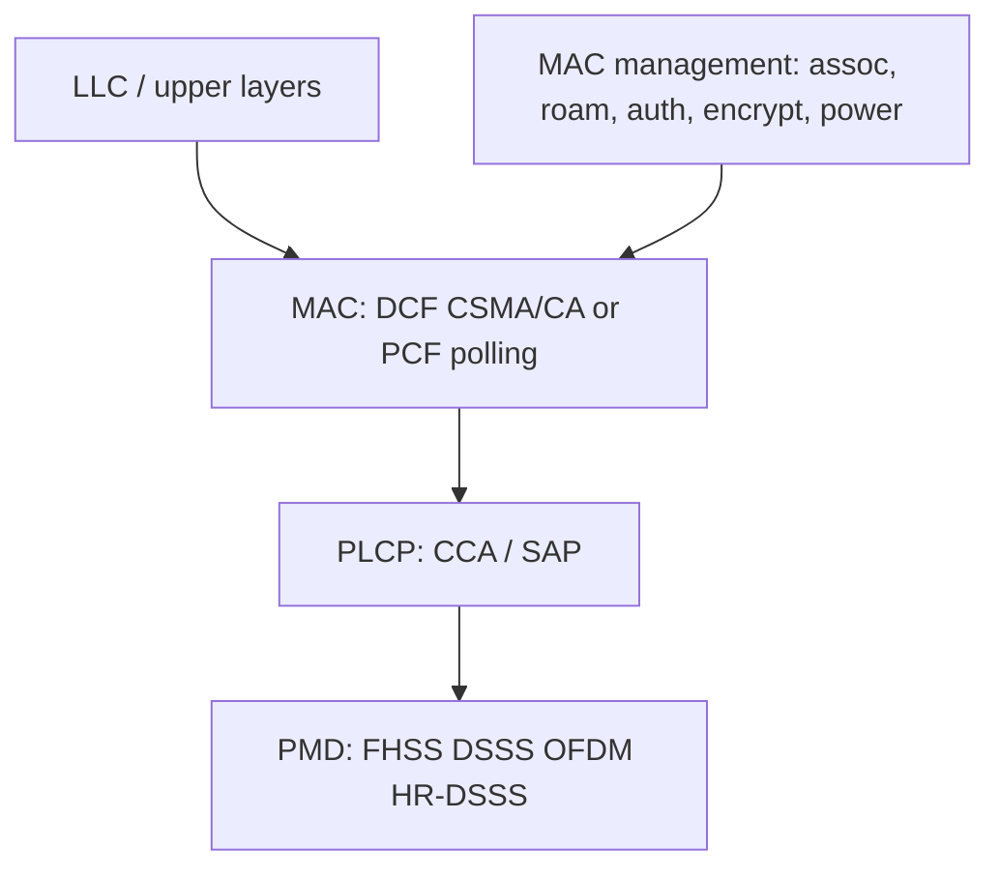

# M31: Wi-Fi Security Protocol

**Source:** https://www.youtube.com/watch?v=Ml3_13Hn9-I
**Instructor / expert:** Prof. Yogesh Chaba, Department of Computer Engineering and IT, Guru Jambheshwar University of Science & Technology, Hisar. Course coordinator: Dr. Maninder Singh, Professor and Dean of Academic Affairs, Thapar University, Patiala.

### Learning objectives

- Distinguish **IEEE 802.11** (PHY/MAC specs) from the **Wi-Fi Alliance** brand, interoperability testing, and required **WPA/WPA2** plus **EAP**.
- Describe **FHSS vs DSSS** (chips), the 802.11 split into **PLCP/PMD**, MAC management, and **DCF (CSMA/CA)** vs **PCF**.
- Tabulate 802.11 / a / b / g / n / ac (and d, e, f, h, i, j, ad, af) with bands, modulation, rates, and ranges the lecture gives.
- Decode the 802.11 **MAC frame** and **Frame Control** bits, including the **WEP** body-encryption flag.

### Core concepts

Despite the playlist title **Wi-Fi Security Protocol**, this lecture is an introduction to **Wi-Fi technology**: architecture, **IEEE 802.11 standards**, and **frame format**. Security appears as **Alliance certification (WPA/WPA2, EAP)**, **802.11i**, and the **WEP bit** in Frame Control. Outline: Wi-Fi intro, **layered protocol architecture**, **standards**, **frame format**.

#### WLAN vs Wi-Fi vs IEEE vs Alliance

A **wireless LAN (WLAN)** is a data communication system used as an **extension or alternative to a wired LAN**. **Wi-Fi** is WLAN technology based on the **IEEE 802.11** series, issued by the **Institute of Electrical and Electronics Engineers (IEEE)**.

**IEEE does not test equipment for compliance.** The nonprofit **Wi-Fi Alliance** formed in **1999** to **establish and enforce interoperability and backward compatibility** and to **promote WLAN technology**. It restricts the **Wi-Fi brand** to 802.11-based technologies. Member manufacturers whose products follow 802.11 may mark them with the **Wi-Fi logo**.

Certification requires compliance with:

- **IEEE 802.11 radio** standards
- **WPA and WPA2** security standards
- **EAP** authentication standards

Any manufacturer building to the standard may put a **Wi-Fi logo** on the product (as stated).

#### Spread spectrum on WLANs

Most WLANs use **spread spectrum**: a **wideband RF** technique that **spreads the signal over the available bandwidth**. Two types:

**Frequency-hopping spread spectrum (FHSS)** — a **narrowband carrier** that **changes frequency in a pattern known only to transmitter and receiver**.

**Direct-sequence spread spectrum (DSSS)** — generates a **redundant bit pattern for each bit**, needing **more bandwidth**. That pattern is a **chip / chipping code**. The receiver recovers the original even if **one or more chip bits are damaged**; **statistical techniques in the radio** recover data **without retransmission**.

#### Layered protocol architecture of IEEE 802.11

IEEE 802.11 covers only the **physical layer** and **medium-access layer** of OSI.

**PHY split**

- **PLCP (Physical Layer Convergence Protocol)** — provides **Clear Channel Assessment (CCA)** (carrier sense) and a **common PHY SAP independent of transmission technology**.
- **PMD (Physical Medium Dependent)** — **modulation and encoding/decoding**.

**MAC management** supports **medium access control**, **association and reassociation** of a station to an AP, **roaming** between APs, **authentication**, **encryption**, **synchronization** with an AP, and **power management** to save battery.

**PHY modulations named**

| Technique | Lecture facts |
|-----------|----------------|
| **FHSS** | **79 channels of 1 MHz**; a **PRNG** produces the hop sequence; a **fair way to allocate the unregulated ISM band** |
| **DSSS** | **1 or 2 Mbps**; technique similar to **CDMA** |
| **OFDM** | **54 Mbps and above** in the wider **5 GHz ISM** band |
| **HR-DSSS** (high-rate DSSS) | **11 and 22 Mbps** in **2.4 GHz** |

**MAC modes**

**DCF (Distributed Coordination Function)** — **no central control**. Protocol: **CSMA/CA**. Both **physical** and **virtual** channel sensing.

- **Physical sensing:** station wants to send → senses. If **idle**, it **transmits** (does **not** sense while sending) and sends the **full frame**, which may be **destroyed at the receiver by interference**. On collision, wait a **random time** using Ethernet **binary exponential backoff**, then retry.
- **Virtual sensing:** **MACA** (Multiple Access with Collision Avoidance).

**PCF (Point Coordination Function)** — a **base station controls all activity in its cell**.

#### IEEE 802.11 standards

IEEE 802.11 is a set of **MAC and PHY** specifications for WLANs in the **2.4 GHz and 5 GHz** bands (transcript “2.5 4 and 5”). Created and maintained by the **IEEE LAN standards committee**. **Base version 1997**, then many amendments. They are the basis for products using the **Wi-Fi brand**. Each standard suits a particular environment.

| Standard | Released | Rate | Indoor / outdoor range | Spread / modulation | Band |
|----------|----------|------|------------------------|---------------------|------|
| **802.11** (legacy) | 1997 | **1–2 Mbps** | **20 m / 100 m** | FHSS and DSSS | **2.4 GHz ISM** |
| **802.11a** | 1999 | **54 Mbps** (transcript “54 and 8”) | **35 m / 120 m** | **OFDM** | **5 GHz ISM** |
| **802.11b** | 1999 | **11 and 22 Mbps** | **35 m / 120 m** | **HR-DSSS** | **2.4 GHz ISM** |
| **802.11g** | 2003 | **54 Mbps** | **38 m / 140 m** | **OFDM** and DSSS | **2.4 GHz ISM** |
| **802.11n** | 2009 | **54–600 Mbps** | **70 m / 250 m** | **OFDM**; adds **MIMO** antennas | **2.4 GHz and 5 GHz** (5 GHz **optional**) |
| **802.11ac** | 2013 | about **1300 Mbps** | (not separately ranged) | built on **n** | **5 GHz ISM** |

**802.11a note:** 2.4 GHz is **heavily used**, so the **relatively unused 5 GHz** band is a **theoretical advantage**. **802.11a signals are absorbed more by walls** (smaller wavelength) and **penetrate poorly**.

**Other 802.11 amendments**

| Amendment | Focus in this lecture |
|-----------|------------------------|
| **802.11d** | Spread of the technology to **countries not addressed** by the base IEEE rules |
| **802.11e** | **QoS** for wireless **multimedia** |
| **802.11f** | **Roaming between APs** and **interoperability between vendor groups** |
| **802.11h** | **Frequency selection and power** on **5 GHz in European countries** |
| **802.11i** | Enhancing WLAN **security and authentication**, including **RADIUS**, **Kerberos**, and **IEEE 802.1X** |
| **802.11j** | **Japanese equivalent of 802.11h** |
| **802.11ad** | New PHY in the **60 GHz** spectrum; products under the **WiGig** brand. Certification later moved to the **Wi-Fi Alliance** (from the WiGig Alliance). Peak rate **7 Gbps** |
| **802.11af** | Also **White-Fi** or **Super Wi-Fi**; approved **February 2014**. WLAN in **TV white space**, **VHF/UHF 54–790 MHz**, using **cognitive radio** on **unused TV channels** |

#### Radio carriers, bands, and 2.4 GHz channels

WLANs use **electromagnetic waves** without wires. Radio waves are **radio carriers**: they **deliver energy to a remote receiver**. Data are **superimposed** on the carrier so they can be extracted — **carrier modulation**.

Band use recap: **802.11b and 802.11g → 2.4 GHz**; **802.11a → more heavily regulated 5 GHz**; **802.11n → both**.

Each spectrum is subdivided into **channels** with a **center frequency and bandwidth**, like radio/TV. The **2.4 GHz band has 14 channels spaced 5 MHz apart**. **Channel 1** is centered on **2412 MHz** (transcript “2412 GHz”). Some channels have **extra restrictions or are unavailable** in some regulatory domains. The lecture shows a figure of all **14 channel frequencies**.

#### IEEE 802.11 frame format

Nine fields from **Frame Control** through **checksum**. **Frame Control is 2 bytes** with **11 subfields** (detailed after the main fields).

| Field | Role |
|-------|------|
| **Frame Control** | 2 bytes, control (11 subfields) |
| **Duration** | How long **this frame and its acknowledgement** will **occupy the channel** |
| **Four addresses** | **Source and destination** plus **source and destination base stations** for **intercell traffic** |
| **Sequence** | Fragment numbering: of **16 bits**, **12 identify the frame**, **4 identify the fragment** |
| **Data (payload)** | Up to **2312 bytes** |
| **Checksum / FCS** | **4 bytes**, usual CRC |

**Frame Control subfields**

| Subfield | Meaning |
|----------|---------|
| **Protocol version** | Two protocol versions can run **in the same cell** |
| **Type** | **Data, control, or management** |
| **Subtype** | Further type detail |
| **To DS / From DS** | Frame going to or coming from the **intercell distribution system** (e.g. **Ethernet**) |
| **MF** | **More fragments** follow |
| **Retry** | Retransmission of a frame sent earlier |
| **Pwr (power management)** | Used by the **base station** to put the receiver **to sleep or wake it** |
| **More** | Sender has **additional frames** for the receiver |
| **W (WEP)** | Frame body **encrypted with WEP (Wired Equivalent Privacy)** |
| **O (order)** | Receiver must process a sequence of frames with this bit set **strictly in order** |

### Key terms

| Term | Meaning in this lecture |
|------|-------------------------|
| Wi-Fi Alliance | 1999 nonprofit that certifies 802.11 interoperability; requires WPA/WPA2 and EAP |
| FHSS / DSSS / OFDM / HR-DSSS | 802.11 PHY families (hops, chips, 54 Mbps+ OFDM, 11/22 Mbps HR-DSSS) |
| PLCP / PMD | PHY convergence (CCA) vs medium-dependent modulation |
| CSMA/CA | DCF access: sense idle, send full frame, binary exponential backoff on collision; virtual sensing via MACA |
| MIMO | Multiple antennas added in 802.11n (54–600 Mbps) |
| IEEE 802.11i | Security/authentication amendment: RADIUS, Kerberos, 802.1X |
| WEP | Wired Equivalent Privacy; Frame Control W bit means the body is WEP-encrypted |
| 802.11ad / WiGig | 60 GHz PHY, peak 7 Gbps |
| 802.11af / White-Fi | TV white-space WLAN, 54–790 MHz cognitive radio |

### Lecture takeaways

- **IEEE writes 802.11; the Wi-Fi Alliance owns the logo** and, for certification, insists on **WPA/WPA2 and EAP** — that is this lecture’s primary “security protocol” statement.
- 802.11 is **PHY + MAC only**: PLCP/PMD below, DCF/PCF above, with MAC management for **associate, roam, authenticate, encrypt, sleep**.
- Rate/range progression taught: **1–2 Mbps (1997) → a/b (1999) → g (2003) → n MIMO (2009) → ac ~1.3 Gbps (2013)**, plus **ad (60 GHz)** and **af (TV white space)**.
- **802.11i** is the amendment that names **RADIUS, Kerberos, and 802.1X**.
- The MAC header’s four addresses and Duration field support **distribution-system forwarding and channel reservation**; the **W bit** flags **WEP** on the body.
