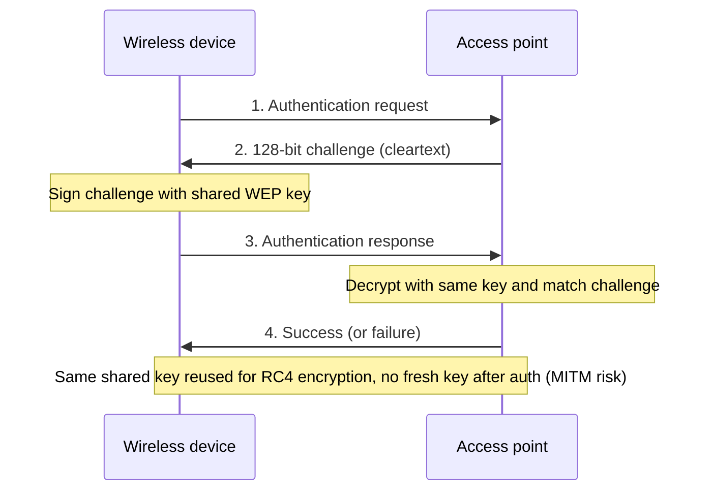
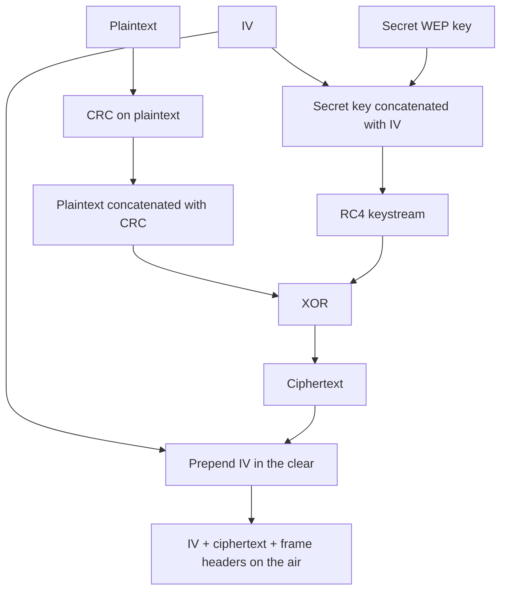

# M32: Wi-Fi Security Protocol

**Source:** https://www.youtube.com/watch?v=vCdk5ufJpPo
**Instructor / expert:** Dr. Yogesh Chaba, Department of Computer Engineering and IT, Guru Jambheshwar University of Science & Technology, Hisar

### Learning objectives

- State why IEEE 802.11 needed a confidentiality protocol and why WEP failed that role.
- Describe WEP’s two authentication methods and the RC4/CRC/IV encryption pipeline.
- List the design flaws, IV weakness, and the mitigations that still left WEP crackable in minutes.
- Explain WPA as draft IEEE 802.11i (TKIP + Michael) and WPA2 as the full 2004 standard (AES).
- Compare WPA and WPA2 on 802.1X/EAP, PSK, mix-mode, cryptography, and processing cost.

### Core concepts

Wireless networking is popular for home and business use, so many products and protocols exist. Radio is available to authorized users **and** to unauthorized users (hackers). IEEE **802.11** therefore offered a protection mechanism: **Wired Equivalent Privacy (WEP)** — a set of instructions and rules so that wireless data can travel over the air with some security.

#### Three protocols in this lecture

The instructor covers three basic Wi-Fi security protocols, then compares the last two:

| Protocol | Role in the lecture |
|----------|---------------------|
| **WEP** | Original 802.11 confidentiality algorithm (1997); soon replaced |
| **WPA** | Wi-Fi Protected Access — interim fix for known WEP issues |
| **WPA2** | Full IEEE 802.11i (2004); AES instead of TKIP |

WEP was meant to provide **confidentiality** by encrypting traffic on the wireless network. It was **replaced by WPA** because of a flaw: WEP can be **cracked in a few minutes** with automated tools. WPA and WPA2 were designed to **address and fix** those known WEP issues.

#### WEP as originally specified (1997)

WEP is a security algorithm for IEEE 802.11 WLANs, introduced with the original **802.11 standard ratified in 1997**. The intention was data confidentiality **comparable to a traditional wired network** — hence the name.

IEEE 802.11 design objectives for WEP:

| Objective | Meaning as taught |
|-----------|-------------------|
| **Reasonably strong** | Security should rest on the difficulty of discovering the secret key by brute force; that difficulty depends on **key length** and **how often keys change** |
| **Self-synchronizing** | WEP should resynchronize **per message**. That is critical for a **data-link** encryption algorithm that assumes **best-effort delivery** |
| **Efficient** | Implementable in **hardware or software** |
| **Exportable** | Designed to maximize chances of **U.S. government export approval** |
| **Optional** | Implementation and use in 802.11 should be **optional** |

Those objectives show WEP was **not military-grade**. The intention was to make break-in **hard, not impossible**.

#### WEP authentication

WEP security has two parts: **authentication** and **encryption**.

Authentication happens when a device **first joins the LAN**. The goal is to stop stations joining unless they know the **WEP key**. Two methods:

**Open System Authentication**

- The WLAN client **need not provide credentials** to the access point during authentication.
- Any client can authenticate with the AP and then attempt to associate.
- **In fact no authentication occurs.**
- Afterward, WEP keys **can** be used to encrypt data frames; the client must then have the **correct keys**.

**Shared Key Authentication** — a four-step challenge–response handshake:

1. The wireless device sends an **authentication request** to the AP.
2. The AP sends a **128-bit random authentication challenge in cleartext**.
3. The device uses the **shared secret key** to sign the challenge and returns an **authentication response**.
4. The AP decrypts the signed message with the same shared key and **verifies the challenge**. If it matches, authentication succeeds and the AP sends an **authentication success** message; otherwise it fails.

**After authentication, no new secret key is exchanged.** The **same shared key** is used for both authentication and encryption. There is therefore **no way to tell** whether a later message comes from the trusted device or from an **imposter**. This authentication is **prone to man-in-the-middle attack**.

#### WEP encryption (RC4 + CRC + IV)

WEP uses the **RC4 stream cipher** between AP and device. As taught: WEP uses **8-bit RC4** and operates on 8-bit values by creating an array of **256 eight-bit values** as a lookup table (RC4’s S-box).

Pipeline:

1. WEP uses **CRC** for integrity: a CRC is computed on the **plaintext** and **concatenated** to that plaintext.
2. The **secret key is concatenated with the initialization vector (IV)** and fed into RC4.
3. RC4 emits a **keystream** from that key and IV.
4. Keystream is **XORed** with (plaintext + CRC) to produce **ciphertext**.
5. The **same IV is prepended in cleartext** to the ciphertext.
6. **IV + ciphertext**, plus frame headers, go over the air.

Attack implications taught here:

- **Part of the secret is used with different exposed values.** An attacker can recover the secret by analyzing a portion of bits in the **first few bytes of the keystream**, with relatively little work.
- Concatenating the shared key with a **visible IV** is the **IV weakness**.

#### Why WEP was believed strong, then collapsed

Early on, WEP was believed to offer **impenetrable resistance** to eavesdroppers and hackers. As WLANs grew, cryptanalysts found **flaws in the original design**. Many believe there was **little peer review**; those flaws would have been caught in design if specifications had been reviewed thoroughly.

For most users — especially **home users** — WEP was the **only choice** until new 802.11 mechanisms arrived. The instructor’s line: **something is better than nothing**. Even with known weakness, WEP was more effective than **no security**, at least against unauthorized use and **eating up the bandwidth**.

#### Suggested improvements that were still not enough

Proposed ways to paper over WEP:

- Choose a **bigger IV**.
- Prepend or append a **hash of the IV** to the ciphertext **instead of the IV in the clear**.
- Replace CRC with a stronger integrity check — **hash functions**.
- **Change the secret key regularly and dynamically** using secure symmetric-key distribution.
- **Better key management** using security handshake protocols.
- **New authentication** using **Extensible Authentication Protocol (EAP)**.

Even with those improvements, WEP still **cracked in a few minutes** with automated tools. Additional measures beyond WEP alone are required.

#### From WEP to WPA to WPA2 (IEEE 802.11i)

| Year | Event |
|------|--------|
| **2003** | Wi-Fi Alliance announced WEP **superseded by WPA** |
| **2004** | Full **IEEE 802.11i** ratified as **WPA2**; IEEE declared WEP **obsolete** |

The Alliance implemented 802.11i in **two steps**: **WPA**, then **WPA2**.

- **WPA** was an **intermediate** measure pending full 802.11i. It could be added by **firmware upgrades** on NICs designed for WEP — hardware that **could not support WPA2**. The interim software path **delayed buying new hardware**. Some old APs still needed **replacement or firmware upgrade**.
- WPA is sometimes called **draft IEEE 802.11i** (available **2003**).
- WPA2 became available in **2004**, commonly known as **full IEEE 802.11i** or **IEEE 802.11i-2004**.

#### WPA: TKIP and Michael

WPA is designed to fix known WEP issues and give higher assurance that data stay protected, using **Temporal Key Integrity Protocol (TKIP)** for encryption.

| | WEP | WPA (TKIP) |
|--|-----|------------|
| Key | **40-bit or 104-bit** key, **manually entered** on APs and devices, **does not change** | **Per-packet key**: dynamically generates a new **128-bit** key **for each packet** |
| Integrity | **CRC** | **Message integrity check** — algorithm **Michael** |

Per-packet keys are meant to stop the attacks that compromised WEP. The MIC is meant to stop an attacker **altering and resending** packets. CRC’s main WEP flaw was that it did **not** provide a sufficiently strong integrity guarantee. Stronger **message authentication codes** existed but **required too much computation for old network cards**.

**Michael is much stronger than CRC**, but researchers still found a WPA flaw from Michael’s limitations: retrieving the **keystream from short packets** for **reinjection and spoofing**.

#### WPA2: AES and 802.11i features

To solve those WPA problems and **fully implement IEEE 802.11i**, **WPA2** is used. Only authorized users should access the wireless device. Features taught: **stronger cryptography**, **stronger authentication**, **control**, **key management**, **replay-attack protection**, and **data integrity**.

Encryption is **AES**, not TKIP. As taught:

- Fixed **block size 128 bits**.
- Three key sizes, described as three iterations of the algorithm:
  - **128-bit** key → **9 rounds**
  - **192-bit** key → **11 rounds**
  - **256-bit** key → **13 rounds** (caption “133” is this figure)
- AES is a **substitution cipher**: within each round, bits are **substituted and rearranged**, then a **special multiplication** is performed on the new arrangement.
- Effectiveness: time to break AES-128 by brute force is given as around **2,200 years**.

#### WPA versus WPA2

**Similarities**

- Both use **802.1X**, i.e. the **EAP framework**, for **central mutual authentication** and **dynamic key management**.
- Both offer a **pre-shared key (PSK)** for **home and small-office** environments.
- Both are designed to secure all versions of 802.11 devices taught here: **802.11b, 802.11a, and 802.11g**.

**Differences**

- **WPA2 mix-mode** supports **both WPA- and WPA2-enabled devices on the same WLAN**; WPA supports **only one**.
- Most significant: **WPA2 uses AES instead of TKIP**.
- **WPA2 is theoretically not hackable; WPA is.**
- **WPA2 requires more processing power than WPA.**

### Diagrams

### Key terms

| Term | Meaning in this lecture |
|------|-------------------------|
| WEP | Wired Equivalent Privacy — original 802.11 confidentiality algorithm (1997) |
| WPA | Wi-Fi Protected Access — 2003 interim / draft 802.11i using TKIP |
| WPA2 | Full IEEE 802.11i-2004 using AES |
| IEEE 802.11i | WLAN security standard implemented in two steps as WPA then WPA2 |
| Open System Authentication | Join path that does not actually authenticate; encryption keys applied later |
| Shared Key Authentication | Four-step WEP challenge–response using the same key later used to encrypt |
| RC4 | Stream cipher WEP uses with a 256-entry 8-bit lookup table |
| IV | Initialization vector concatenated with the WEP key; sent in the clear — the IV weakness |
| CRC | WEP integrity check on plaintext; too weak to stop alteration |
| TKIP | Temporal Key Integrity Protocol — per-packet 128-bit keys in WPA |
| Michael | WPA message integrity check; stronger than CRC, still flawed on short packets |
| AES | WPA2 block cipher: 128-bit blocks; 128/192/256-bit keys; 9/11/13 rounds as taught |
| 802.1X / EAP | Framework both WPA and WPA2 use for mutual authentication and dynamic keys |
| PSK | Pre-shared key mode for home / small office |
| Mix-mode | WPA2 ability to host WPA and WPA2 stations on one network |

### Lecture takeaways

- Air is shared with hackers; 802.11’s first answer was WEP, designed to be **hard** to break and **optional**, not military-grade.
- WEP’s shared-key handshake reuses one key for auth and encryption and is **MITM-prone**; RC4 with a **clear IV** and **CRC** leaked keystream.
- Firmware-friendly **WPA/TKIP/Michael** was only a bridge to **802.11i**; Michael still allowed short-packet reinjection.
- **WPA2/AES** is the full 2004 standard: stronger crypto, authentication, key management, replay protection, and integrity — at higher CPU cost.
- Prefer WPA2; WPA is described as hackable, WPA2 as theoretically not. Both still share 802.1X/EAP, PSK, and 802.11a/b/g coverage.
