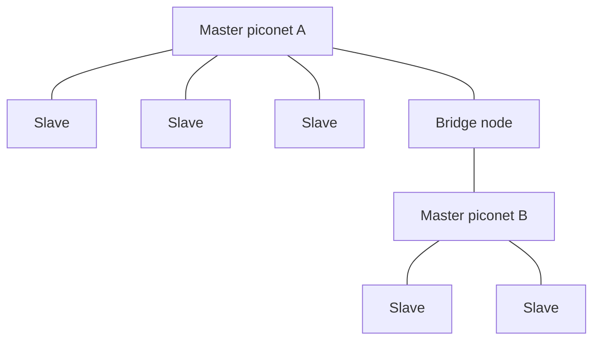
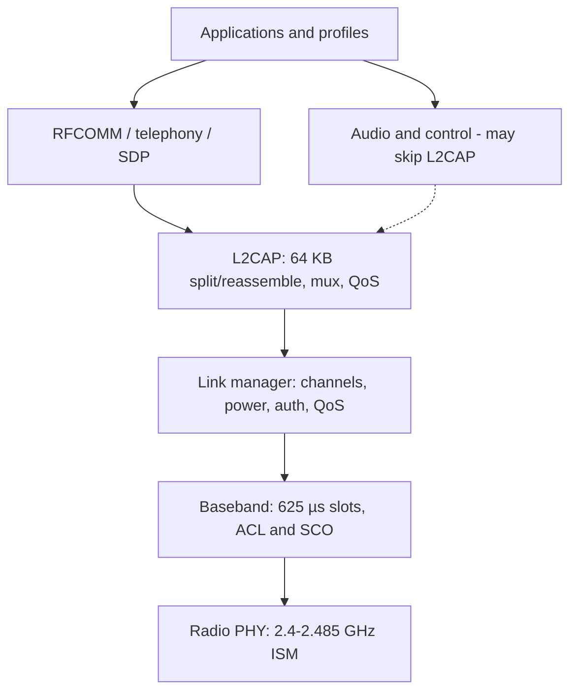
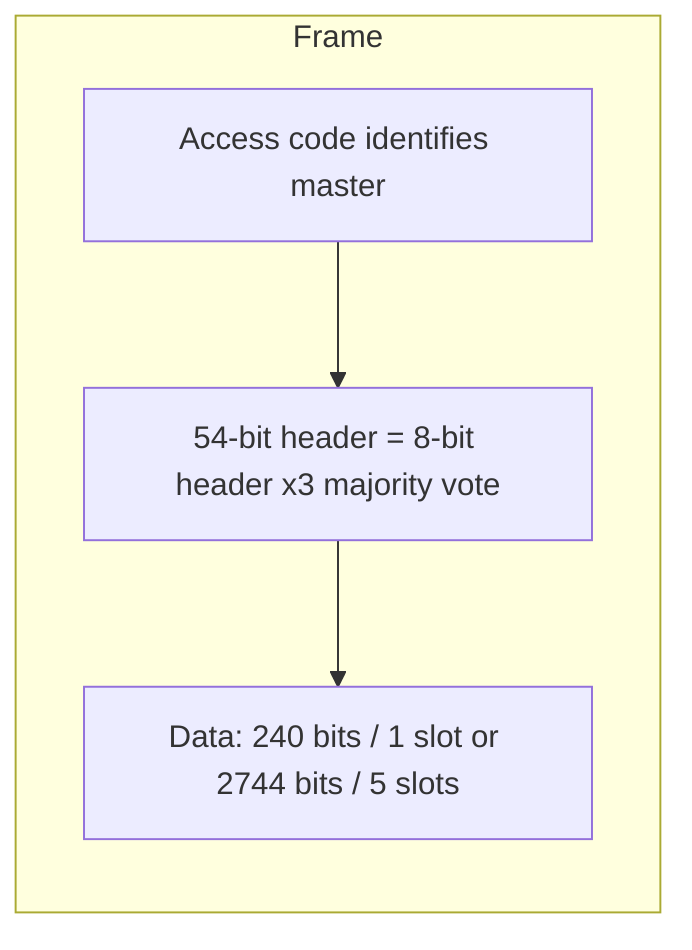

# M33: Bluetooth Networks and Security Protocols

**Source:** https://www.youtube.com/watch?v=wzD1F-Knr_E
**Instructor / expert:** Prof. Yogesh Chaba, Department of Computer Engineering and IT, Guru Jambheshwar University of Science & Technology, Hisar

### Learning objectives

- Place Bluetooth as a short-range UHF ISM WPAN technology and recount SIG / IEEE 802.15 origins.
- Draw a piconet and scatternet and state the master/slave communication rule.
- Walk the Bluetooth protocol stack, ACL vs SCO links, L2CAP roles, and the 54-bit header frame.
- Recite SIG versions from 1.0 through 4.2 and the IEEE 802.15.x WPAN family.
- Name Bluetooth’s three native security services and the four BR/EDR/HS security modes, including NIST’s warning on mode 1.

### Core concepts

Bluetooth is a wireless standard for exchanging data over **short distances** using **short-wavelength UHF** radio. It operates in the **ISM band from 2.4 to 2.485 GHz**, for mobile devices and **personal area networks (PANs / WPANs)**.

#### Origins and naming

In **1994**, **Ericsson** wanted to connect mobile devices to other devices **without cables**. With **IBM, Intel, Nokia, and Toshiba** it formed a **Special Interest Group (SIG)**. They developed a short-range, **low-power, inexpensive** radio standard for computing and communication devices and accessories.

The name **Bluetooth** is after the 10th-century king **Harald Bluetooth**, who united distant Danish tribes into one kingdom. The name was proposed in **1997** by **Jim Kardach**, who had developed a system allowing mobile phones to talk to computers.

The Bluetooth SIG defines manufacturing standards. In **July 1999** it issued a **1,500-page specification of version 1.0**. Shortly after, the IEEE WPAN working group **802.15** adopted that document as a basis.

- **Bluetooth SIG specification:** a **complete system**, physical layer through application layer.
- **IEEE 802.15:** only **physical and data-link** layers.

#### Piconet and scatternet

The basic unit is a **piconet**: a **master** node and up to **seven active slave** nodes within about **10 m**. Multiple piconets can exist in the same large room and can be connected via a **bridge** node. An interconnected collection of piconets is a **scatternet**.

**All communication is master–slave.** Direct **slave-to-slave communication is not possible**.

#### Layered protocol architecture

Protocols are grouped loosely into layers.

| Layer / protocol | Role as taught |
|------------------|----------------|
| **Radio (physical)** | Matches OSI / 802 physical layer: radio transmission and modulation in ISM **2.4–2.485 GHz** |
| **Baseband** | Analogous to the **MAC sublayer**, with some physical-layer elements. Master controls **time slots** and grouping into **frames**. Turns the raw bit stream into frames and defines key formats |
| **Link Manager** | Establishes logical channels: **power management, authentication, QoS** |
| **L2CAP** | Logical Link Control and Adaptation Protocol — shields upper layers from transmission details |
| **Audio and control** | Applications may reach them **directly**, without L2CAP |
| **RFCOMM** | Emulates a PC **serial port** (keyboard, mouse, modem, …) |
| **Telephony protocol** | Real-time protocol for the **three speech-oriented protocols**; manages **call setup and termination** |
| **Service Discovery Protocol (SDP)** | Locate services in the network |
| **Applications and profiles** | Top layer; use lower protocols |

**TDD slots.** In the simplest form the master defines **625 µs** slots. Master transmissions start in **even** slots, slave transmissions in **odd** slots — classical **TDM**, with the master getting **half** the slots and slaves sharing the other half.

Each frame rides a logical **link** between master and slave. Two link types:

| Link | Name | Use |
|------|------|-----|
| **ACL** | Asynchronous Connection-Less | Packet-switched data at **irregular** intervals |
| **SCO** | Synchronous Connection-Oriented | Real-time data (e.g. telephone). **Fixed slot in each direction**. Frames are **never retransmitted**; **forward error correction (FEC)** provides reliability |

**L2CAP’s three functions**

1. Accept packets of up to **64 KB** from upper layers, **fragment** to frames, **reassemble** at the far end.
2. **Multiplex / demultiplex** multiple packet sources.
3. Handle **QoS** requirements.

#### Frame format

A Bluetooth frame begins with an **access code** that usually **identifies the master**, so slaves in radio range of **two masters** can tell which traffic is theirs. Next is a **54-bit header** (typical MAC-sublayer fields), then a data field of up to **2,744 bits** for a **five-slot** transmission. For a **single time slot** the layout is the same except the data field is **240 bits**.

Header fields:

| Field | Role |
|-------|------|
| **Address** | Which of the **eight active devices** the frame is for |
| **Type** | Frame type: **ACL, SCO, POLL, or NULL**; also **error-correction type** in the data field and **how many slots** the frame occupies |
| **Flow** | Slave asserts when its **buffer is full** |
| **Acknowledgement** | Piggybacks an **ACK** |
| **Sequence** | Numbers frames to detect retransmissions. Protocol is **stop-and-wait**, so **one bit** is enough |
| **Header checksum** | **8-bit** check |

The entire 8-bit header is **repeated three times** to make the 54-bit header. The receiver examines all three copies of each bit: if they agree, accept it; if not, **majority vote** wins.

#### SIG versions (all downward compatible)

The SIG was formally announced on **20 May 1998**. Membership is given as **over 20,000 companies**. Founders: Ericsson, IBM, Intel, Toshiba, Nokia; many others joined later. **All versions support backward compatibility.**

| Version | What the lecture stated |
|---------|-------------------------|
| **v1.0 and v1.0b** | Basic Bluetooth; **many problems**; manufacturers struggled to make products **interoperable** |
| **v1.1** | Ratified as **IEEE 802.15.1-2002**. Fixed many 1.0b errors. Added **non-encrypted channels** and **RSSI** |
| **v1.2** | Faster **connection and discovery**. **Adaptive Frequency Hopping (AFH)** spread spectrum — skip crowded hop frequencies to resist RF interference. Practical speed up to **721 kbps** (higher than v1.1). Ratified as **IEEE 802.15.1-2005** |
| **v2.0 + EDR** | Core spec **2004**. **Enhanced Data Rate**: nominal about **3 Mbps**, practical **2.1 Mbps**. Modulation: **GFSK combined with PSK** |
| **v2.1 + EDR** | Adopted **26 July 2007**. Headline feature: **Secure Simple Pairing (SSP)** — better pairing experience and stronger security |
| **v3.0 + HS** | Adopted **21 April 2009**. Theoretical transfer up to **24 Mbps**, **not over the Bluetooth link itself**: Bluetooth is used for **negotiation and establishment**; high-rate traffic rides an **802.11** link |
| **v4.0** | “**Bluetooth Smart**,” adopted **30 June 2010**. Includes **Classic**, **Bluetooth High Speed**, and **Bluetooth Low Energy (LE)**. LE, previously **Wibree**, is a subset of v4.0 with an **entirely new protocol stack** for rapid simple links |
| **v4.1** | Adopted **4 December 2013**. **Software** (not hardware) update to v4.0. **Increased coexistence with LTE**, bulk data-transfer rates, and devices in **multiple roles simultaneously** |
| **v4.2** | Released **2 December 2014**. **Data length extension** needs a **hardware** update; some older hardware can get features such as **privacy updates via firmware** |

#### IEEE 802.15 WPAN standards

IEEE **802.15** is the working group that specifies WPAN standards.

| Standard | Topic as taught |
|----------|-----------------|
| **802.15.1** | WPAN Bluetooth — PHY and MAC for wireless connectivity with fixed, portable, and moving devices in **personal operating space**. Issued **2002** and **2005** |
| **802.15.2** | **Coexistence** of WPANs with other unlicensed devices (e.g. WLANs). **802.15.2-2003** published **2003**; Task Group 2 then went into **hibernation** |
| **802.15.3** | **High-rate WPAN**, MAC and PHY, **11–55 Mbps** (2003). Amendments: **802.15.3a**, **802.15.3b-2006**, **802.15.3c-2009** |
| **802.15.4** | **Low-rate WPAN** (2003): low data rate, **very long battery life**, **very low complexity**. Defines OSI **physical and data-link** layers. Alternative PHY **802.15.4a-2007**; revision **802.15.4-2006** (4b) |
| **802.15.5** | **Mesh networking** framework — interoperable, stable, scalable. Two parts: **low-rate** mesh on **802.15.4-2006 MAC**; **high-rate** mesh on **802.15.3b MAC** |
| **802.15.6** | **Body Area Network (BAN)**. December **2011** draft. Devices **in or around the human body**: medical, consumer electronics, personal entertainment |
| **802.15.7** | **Visible light communication** |
| **P802.15.8** | **Peer-aware communications** |
| **P802.15.9** | **Key management protocol** |
| **P802.15.10** | **Layer-2 routing** |

#### Security architecture

Three **basic security services** in the Bluetooth standard:

| Service | Meaning |
|---------|---------|
| **Authentication** | Verify identity of communicating devices from the **Bluetooth device address**. Bluetooth does **not** provide **native user authentication** |
| **Confidentiality** | Stop eavesdropping: only authorized devices access/view transmitted data |
| **Authorization** | A device must be authorized to use a **service** before it may do so |

Bluetooth does **not** address **audit, integrity, or non-repudiation**. If needed, those come from **additional means**.

The **BR (Basic Rate) / EDR / HS** family defines **four security modes**. Each device must operate in one of them.

**Security mode 1 — non-secure**

- Authentication and encryption are **never initiated**.
- Devices are **indiscriminate**; nothing stops other Bluetooth devices from connecting.
- If a **remote** device **initiates** pairing, authentication, or encryption, a mode-1 device **will participate**.
- All **v2.0 and earlier** devices can support mode 1; **v2.1 and later** may use it only for **backward compatibility**.
- **NIST recommends never using security mode 1.**

**Security mode 2 — service-level (after link, before logical channel)**

- Security may start **after link establishment** but **before logical-channel establishment**.
- A local **security manager** (Bluetooth architecture) controls access to specific services.
- Centralized security manager holds **access-control policies** and interfaces to other protocols and users.

**Security mode 3 — link-level enforced**

- Security starts **before the physical link is fully established**.
- **Authentication and encryption are mandatory** for all connections to and from the device.
- All **v2.0 and earlier** can support mode 3; **v2.1 and later** only for **backward compatibility**.

**Security mode 4 — service-level with SSP (v2.1 + EDR)**

- Similar timing to mode 2: after **physical and logical link** setup.
- Uses **Secure Simple Pairing (SSP)**.
- **Elliptic-curve Diffie–Hellman (ECDH)** replaces **legacy key agreement** for **link-key generation**.
- Device **authentication and encryption algorithms remain those of v2.0 + EDR and earlier**.

### Diagrams

### Key terms

| Term | Meaning in this lecture |
|------|-------------------------|
| WPAN | Wireless personal area network; Bluetooth’s setting |
| SIG | Bluetooth Special Interest Group (1998; 1,500-page v1.0 in 1999) |
| Piconet | Master + up to 7 active slaves within ~10 m |
| Scatternet | Piconets joined by a bridge node |
| ACL / SCO | Async connectionless data vs synchronous connection-oriented real-time (no retransmission, FEC) |
| L2CAP | Segmentation, multiplexing, QoS |
| RFCOMM | Serial-port emulation |
| Access code | Identifies the master so overlapping piconets can be distinguished |
| EDR | Enhanced Data Rate (v2.x): ~3 Mbps nominal, 2.1 Mbps practical, GFSK+PSK |
| HS | High Speed (v3.0): 24 Mbps over 802.11 after Bluetooth setup |
| LE / Wibree | Bluetooth Low Energy new stack inside v4.0 “Bluetooth Smart” |
| SSP | Secure Simple Pairing (v2.1); ECDH link keys in security mode 4 |
| 802.15.1–.10 | IEEE WPAN family: Bluetooth, coexistence, high/low rate, mesh, BAN, VLC, PAC, KMP, L2 routing |
| Security modes 1–4 | Non-secure; service-level; link-level mandatory crypto; SSP service-level |

### Lecture takeaways

- Bluetooth is a complete SIG stack on cheap short-range ISM radios; IEEE 802.15 only standardizes PHY/MAC.
- A piconet is strictly **star-shaped**: no slave-to-slave path except through the master (or a scatternet bridge).
- Baseband TDD (625 µs), ACL vs SCO, and L2CAP fragmentation/mux/QoS are the operational core; audio/control can bypass L2CAP.
- Versions add hopping hygiene, EDR, SSP, 802.11 offload, LE, LTE coexistence, and longer PDUs — always backward compatible.
- Native security is **device** auth, confidentiality, and service authorization only. **Never use mode 1** (NIST). Mode 4 modernizes **key agreement** (ECDH) without changing the old auth/encryption algorithms.
