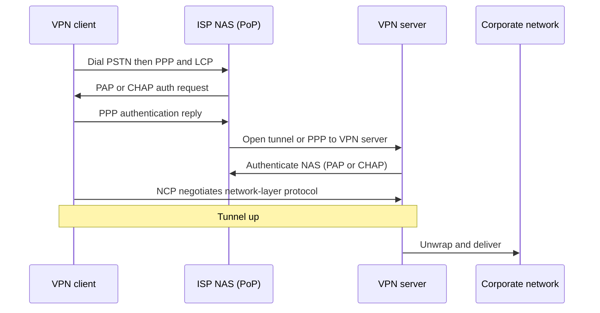
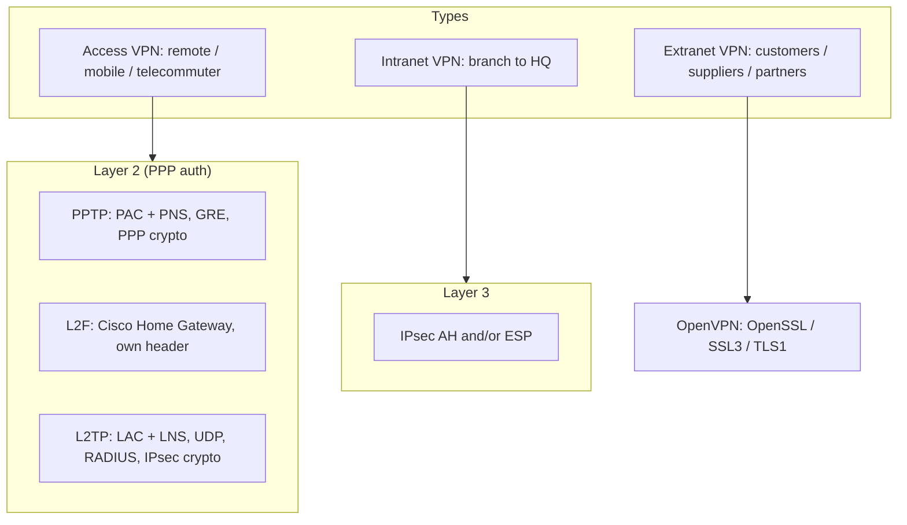

# M34: Virtual Private Network

**Source:** https://www.youtube.com/watch?v=14DVrUgf2k8
**Instructor / expert:** Prof. Yogesh Chaba, Department of Computer Engineering and IT, Guru Jambheshwar University of Science & Technology, Hisar

### Learning objectives

- Contrast a leased-line private network with a VPN overlay on a public network.
- Name Access, Intranet, and Extranet VPNs and the four architectural components (client, NAS, VPN server, protocol).
- Reconstruct Layer-2 tunnel setup (PPP, LCP, PAP/CHAP, NCP) and the PPTP, L2F, and L2TP packet stories.
- Distinguish IPsec AH vs ESP and Layer-2 vs Layer-3 tunneling.
- State OpenVPN’s SSL/TLS properties and the lecture’s protocol preference; explain why firewalls and VPNs are used together.

### Core concepts

Almost all companies have offices and plants scattered over cities — sometimes countries. In the olden days it was common to **lease telephone lines** between locations. Some still do. A network built from **company computers and leased telephone lines** is a **private network**.

Private networks **work and are very secure**: traffic does not leak from company locations, and intruders must **physically wiretap** the lines. The problem is **cost**. When public data networks and then the **Internet** appeared, companies wanted to move data and voice onto the public network **without giving up private-network security**. That demand produced the **VPN**: an **overlay** on public networks with **most properties of private networks**.

A VPN provides a **secure connection** between sender and receiver over a **public, non-secure** network such as the Internet. They are **virtual** in the same sense as virtual circuits and virtual memory: an **illusion**, not a physical private plant.

A VPN is created by a **virtual point-to-point** path using **dedicated connections, virtual tunnels, and traffic encryption**. A VPN across the Internet is similar to a **WAN link** between sites. From the user’s view, extended resources are used **the same way** as resources inside the private network.

Uses taught:

- Employees **securely access the company intranet** while traveling.
- Geographically separated offices join into **one cohesive network**.
- Individuals secure **wireless transactions**, **circumvent geo-restrictions and censorship**, and connect to **proxy servers** to protect **personal identity and location**.

#### Three types of VPN

All three use the Internet as a private enterprise backbone, but they serve different groups:

| Type | Who it serves |
|------|----------------|
| **Access VPN** | Remote / mobile users, telecommuters, or a branch office needing **reliable access** to the corporate network |
| **Intranet VPN** | Branch offices **linked to corporate headquarters** securely |
| **Extranet VPN** | Customers, suppliers, and partners accessing the **corporate intranet** securely |

#### Architecture (four components)

1. **VPN client**
2. **Network Access Server (NAS)**
3. **Tunnel-terminating device — VPN server**
4. **VPN protocol**

In a typical **Access VPN**:

- The client connects to the NAS over the **PSTN**.
- The remote user initiates a **PPP** connection with the ISP’s NAS via PSTN.
- The NAS is owned by the ISP and usually sits in the ISP’s **point of presence (PoP)**.
- After authentication, the NAS directs the packet into the **IP tunnel** between NAS and VPN server.
- The VPN server may sit in the **ISP PoP** or at the **corporate site**, depending on the model.
- The VPN server **recovers** the packet from the tunnel, **unwraps** it, and delivers it to the corporate network.

#### Two categories of tunneling protocols

| Category | Protocols |
|----------|-----------|
| **Layer 2** | **PPTP**, **L2F**, **L2TP** |
| **Layer 3** | **IPsec** |

When **PPTP and L2F** were both submitted to the **IETF**, the features were **combined** into **L2TP**.

#### How Layer-2 tunneling works

Layer-2 protocols operate at the **data-link layer**. They use security from **PPP**:

- Authentication: existing PPP methods **PAP** (Password Authentication Protocol) and **CHAP** (Challenge Handshake Authentication Protocol).
- **No specific provision for data encryption**; the user may encrypt **before** requesting VPN service.

General tunnel-creation process:

1. Client **dials** the NAS (typically in the ISP PoP) and starts PPP.
2. The NAS answers and performs **LCP** negotiation to establish an authenticated PPP connection.
3. Once PPP is up, the NAS uses **PAP or CHAP**: **PPP authentication request** → client **PPP authentication reply**.
4. If that succeeds, the NAS attempts to **open a PPP connection to the VPN server** (lecture: “open VPN request”).
5. The VPN server authenticates the NAS with **PAP or CHAP** (“open VPN reply”).
6. Client and VPN server then use **NCP** to negotiate the **network-layer** protocol.
7. Tunneling is complete: a VPN exists between client and corporate server.

#### PPTP (Point-to-Point Tunneling Protocol)

Developed by **Microsoft** and equipment vendors including **Ascend Communications** and **3Com**, as an **extension of PPP**.

- Handles **only point-to-point** connections; **not** point-to-multipoint.
- NAS that lets the remote user start a VPN call is the **PPTP Access Concentrator (PAC)**.
- VPN server is the **PPTP Network Server (PNS)**.
- **No packet-by-packet encryption**; relies on **PPP’s native encryption** (taught in connection with PAP/CHAP).

**PPTP packet (as drawn):** PPP payload = data plus original **IP and TCP** headers. A PPTP packet (PPP payload + PPP header) is encapsulated in **GRE**, then an **IP header** is placed on top of GRE.

#### L2F (Layer 2 Forwarding)

**Proprietary Cisco** protocol.

- **Protocol-independent**; can run over **X.25, Frame Relay, and ATM**.
- Supports **private IP, IPX, and AppleTalk**; uses **UDP** for Internet tunneling.
- **Many connections inside one tunnel**.
- VPN server is called the **Home Gateway**; other pieces match the general Layer-2 picture.
- Uses **PPP for dial-up user authentication**.
- Unlike PPTP, L2F defines **its own encapsulation header**, **not dependent on IP and GRE**, so it can work on different network types.
- Packet: **SLIP or PPP payload** in an L2F packet with **L2F header** and optional **L2F checksum trailer**.

#### L2TP (Layer 2 Tunneling Protocol)

Combines PPTP and L2F.

- Runs over **UDP**, **not GRE** — many **firewalls do not support GRE**, so L2TP is **more firewall-friendly** than PPTP.
- NAS = **L2TP Access Concentrator (LAC)**; VPN server = **L2TP Network Server (LNS)**.
- Uses PPP dial-up and **PAP and CHAP**; also allows **RADIUS**.
- Permits **multiple tunnels** between the **same pair of endpoints**, each with a different **QoS**.
- Packet (as taught): **PPP header**, then **UDP**, then **IP**.
- Supported by many vendors; expected to be the **predominant** protocol once standardized.
- Relies on **IPsec** for data encryption. If the remote end **does not support IPsec**, it falls back to **less secure PPP encryption**.

#### Layer 3: IPsec

IPsec was designed to **add security to TCP/IP**. It provides **packet-level authentication, integrity, and confidentiality** via two headers:

| Header | Provides | Notes |
|--------|----------|--------|
| **AH** (Authentication Header) | Header **integrity and authentication**, **without confidentiality** | No data encryption. Useful when **only authentication** is required. Authentication is **not export-regulated**, so AH is the **preferred VPN method** in those environments. **Lower processing overhead** than ESP |
| **ESP** (Encapsulating Security Payload) | **Integrity, authentication, and confidentiality** of the payload | **Packet-by-packet encryption** and a **standards-based key-management** protocol. Used **when data encryption is desired** |

An IPsec VPN can be created with **AH, ESP, or both**.

#### Layer 2 versus Layer 3

| | Layer 2 (PPTP, L2F, L2TP) | Layer 3 (IPsec) |
|--|---------------------------|-----------------|
| Traffic | Can carry **non-IP** (IPX, AppleTalk) | **IP only** |
| Dial-up | **Individual dial-up access** via **PPP user authentication** — seamless through ISPs | Designed for security **between routers and firewalls**; **does not provide user authentication** |

#### OpenVPN (neither IPsec nor L2TP)

A relatively new **open-source** product using the **OpenSSL** library and **SSL v3 or TLS v1**, plus an amalgam of other technologies.

- Supports **neither** Layer-2 nor Layer-3 tunneling protocols in the IPsec/L2TP/PPTP sense.
- **Not compatible** with IPsec, L2TP, or PPTP.
- **Highly configurable**. Runs best on **UDP**, but can use **any port**, including **TCP 443**.
- OpenSSL ciphers taught: **AES, Blowfish, 3DES, CAST-128, Camellia**, and more.

Capabilities listed:

- Tunnel any **IP subnet** or **virtual Ethernet adapter** over a **single UDP or TCP port**.
- Configure a **scalable, load-balanced** VPN server on one or more machines for **thousands of dynamic** client connections.
- Use all OpenSSL **encryption, authentication, and certification** features to protect private traffic on the Internet.
- Any cipher, key size, or **HMAC digest** OpenSSL supports for datagram integrity.
- **Static-key** conventional encryption **or certificate-based public-key** encryption.
- Static **pre-shared keys** or **TLS-based dynamic key exchange**.
- **Real-time adaptive link compression** and **traffic shaping**.
- Tunnel networks whose public endpoints are **dynamic** (DHCP or dial-in clients).
- Tunnel through **connection-oriented stateful firewalls** without explicit extra rules; tunnel over **NAT**.
- **Secure Ethernet bridges** using virtual **TAP** devices.
- Control via a **GUI on Windows or Mac**.

Compared with PPTP and L2TP/IPsec, generic OpenVPN can be **fiddly to set up**: install the client **and** extra configuration files. Many VPN providers ship **customized clients** to avoid that.

#### Which protocol to choose (instructor’s ranking)

| Protocol | Verdict in this lecture |
|----------|-------------------------|
| **PPTP** | **Very insecure — avoid**, despite easy setup and cross-platform reach |
| **L2TP/IPsec** | Same convenience, **much more secure**. Good for **non-critical** use and a **quick setup without extra software**, especially **mobile devices** where OpenVPN support is “somewhat patchy” |
| **OpenVPN** | **Best all-round**: reliable, fast, and **most importantly secure**, despite third-party software and more settings |

**Wherever possible, always choose OpenVPN.** For a quick shield (phone vs casual criminals, public Wi-Fi), L2TP/IPsec will “probably do,” but given OpenVPN apps — **especially Android** — still **prefer OpenVPN**.

#### Firewalls and VPNs together

Firewalls and VPNs **go hand in hand**.

- VPNs open **secure tunnels**.
- Firewalls sit at **strategic locations** and **block certain traffic**. Many firewall products provide **encrypted firewall-to-firewall tunnels**.
- Firewalls **control access** to corporate resources and **establish trust** between user and network.

Two sites each with a firewall still send data **vulnerable on the Internet**. A VPN supplies **privacy** between sites when there is **usually no trust** between the two sides. **Firewall + VPN** establishes **trust and privacy** and is **more secure than either alone**.

Older firewalls offered only firewall service; **many new firewall products support VPN functionality**. Both are needed for **effective security control**.

### Diagrams

### Key terms

| Term | Meaning in this lecture |
|------|-------------------------|
| Private network | Company hosts plus leased telephone lines |
| VPN | Overlay tunnels + encryption on a public non-secure network |
| NAS | Network Access Server at the ISP PoP |
| PAC / PNS | PPTP Access Concentrator / PPTP Network Server |
| LAC / LNS | L2TP Access Concentrator / L2TP Network Server |
| Home Gateway | L2F name for the VPN server |
| PAP / CHAP | PPP authentication used by Layer-2 VPNs |
| LCP / NCP | PPP link control / network control (IPCP etc.) |
| GRE | PPTP encapsulation; many firewalls lack it |
| AH / ESP | IPsec authentication-only vs encrypting payload |
| OpenVPN | SSL/TLS VPN via OpenSSL; not interoperable with IPsec/L2TP/PPTP |
| TAP | Virtual Ethernet device for OpenVPN bridging |

### Lecture takeaways

- VPNs buy private-network **properties** without leased-line **cost**, via tunnels and encryption on the Internet.
- Layer 2 (PPTP/L2F/L2TP) is the dial-up/PPP world and can carry non-IP; IPsec is IP-only, router/firewall oriented, and has **no user authentication**.
- IETF folded PPTP+L2F into **L2TP**; encrypt L2TP with **IPsec** when possible.
- **Avoid PPTP.** Prefer **OpenVPN**; use **L2TP/IPsec** only for quick, non-critical, especially mobile, setups.
- A firewall pair without a tunnel still leaks on the Internet; **firewall + VPN** is stronger than either mechanism alone.
