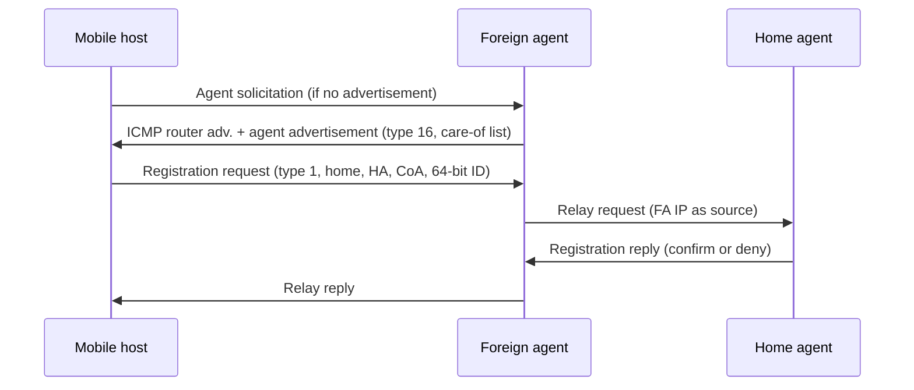
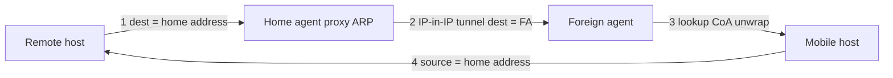

# M36: Introduction to Mobile IP and Addressing

**Source:** https://www.youtube.com/watch?v=I2IzxqoP7M8
**Instructor / expert:** Dr. Sunil Kumar, Department of Electrical and Computer Engineering, Punjab Agricultural University, Ludhiana

### Learning objectives

- Explain why classic IP prefixes break when a host moves, and why DHCP-only renumbering is not enough.
- Define home address vs care-of address and the roles of home agent, foreign agent, and collocated care-of address.
- Describe agent discovery (advertisement vs solicitation) and the agent-advertisement extension fields.
- Walk registration request/reply and the four-path data-transfer process (proxy ARP + tunneling).
- Distinguish double crossing (2X) from triangle (dog-leg) routing and the binding-cache fix plus its stale-cache problem.

### Core concepts

Mobile communication drew a lot of attention in the last decade. Using mobiles on the Internet means the **IP protocol**, originally designed for **stationary** devices, must be enhanced for computers that **move from network to network**. The main problem is **addressing**.

#### Stationary hosts and why prefixes matter

Original IP addressing assumed a host is **stationary**, attached to **one specific network**. A router uses an IP address to **route** a datagram. An IP address has two parts: a **prefix** and a **suffix**. The prefix **associates the host with a network**.

Example as taught: address **10.3.4.24/8** is a host on network **10.0.0.0/8**. A host therefore does **not** have an address it can **carry from place to place**. The address is valid **only while attached to that network**. If the network changes, the address is **no longer valid**.

Routers use the prefix to deliver the packet to the network the host is attached to. That scheme **works perfectly for stationary hosts**, because part of the address **defines the attached network**.

#### Changing the address (DHCP) — and why it fails

When a host moves, the addressing structure must change. One simple proposal: let the mobile host **change its address** on the new network, using **DHCP** to obtain a new address associated with that network.

Drawbacks taught:

1. **Configuration files** would need to change.
2. Each move would require a **reboot**.
3. **DNS tables** would need revision so every other Internet host learns the change.
4. If the host **roams during a transmission**, the exchange is **interrupted**, because **ports and IP addresses of client and server must remain constant** for the duration of the connection.

#### Two addresses: home and care-of

The feasible approach is **two addresses**:

| Address | Properties |
|---------|------------|
| **Home address** | **Permanent**. Associates the host with its **home network** (permanent home) |
| **Care-of address** | **Temporary**. Changes as the host moves; associated with the **foreign network** |

Mobile IP therefore gives a mobile host **one home address and one care-of address**. The home address stays; the care-of address changes from network to network.

#### Agents

Making the address change **transparent to the rest of the Internet** requires a **home agent** and a **foreign agent**. In figures they look like **routers**, but the **agent functions are performed in the application layer** — they are **both routers and hosts**.

**Home agent**

- Usually a **router attached to the home network**.
- **Acts on behalf of the mobile host**.
- When a remote host sends a packet to the mobile host, the home agent **receives it and sends it to the foreign agent**.

**Foreign agent**

- Usually a **router attached to the foreign network**.
- **Receives and delivers** packets sent by the home agent to the mobile host.

**Mobile host as its own foreign agent**

The mobile host **can act as a foreign agent** (same node). To do that it must:

- Obtain a care-of address **by itself**, e.g. via **DHCP**.
- Run software to talk to the home agent and to hold **two addresses** (home and care-of) in a way that is **transparent to application programs**.

When the mobile host **is** the foreign agent, the care-of address is a **collocated care-of address**. Advantage: the host can move to **any network without needing a foreign agent to be present**.

#### Three phases of mobile communication

To talk to a remote host, a mobile host goes through:

1. **Agent discovery** — mobile host, foreign agent, and home agent.
2. **Registration** — mobile host and the two agents.
3. **Data transfer** — the **remote host** is involved as well.

#### Phase 1: Agent discovery

Two services:

- Discover a **home agent before leaving** the home network.
- Discover a **foreign agent after moving**, including learning the **care-of address** and the **foreign-agent address**.

Two message types: **advertisement** and **solicitation**.

**Agent advertisement**

When a router advertises presence with an **ICMP router advertisement**, it can **append an agent advertisement** if it acts as an agent (piggybacked on the ICMP packet).

Fields taught:

| Field | Meaning |
|-------|---------|
| **Type** | 8 bits, set to **16** |
| **Length** | 8 bits: total length of the **extension**, not of the ICMP advertisement |
| **Sequence number** | 16 bits; recipient can detect **loss** |
| **Lifetime** | Seconds the agent will accept requests. **All ones** = **infinite** |
| **Code** | 8-bit flags (each bit set or unset) |
| **Care-of addresses** | List of addresses usable as care-of addresses; the mobile host **chooses one** and announces it in the **registration request**. Used **only by a foreign agent** |

**Agent solicitation**

If the mobile host has moved and **has not received advertisements**, it can send an **ICMP solicitation** to tell an agent it needs assistance.

#### Phase 2: Registration

After moving and discovering the foreign agent, the host must register. Four aspects:

1. Register with the **foreign agent**.
2. Register with the **home agent** — normally done **by the foreign agent on behalf of** the mobile host.
3. **Renew** registration if it has **expired**.
4. **Cancel** registration when **returning home**.

**Registration request** goes mobile host → foreign agent (to register care-of address and announce home address and home-agent address). The foreign agent **relays** it to the home agent. The home agent now knows the foreign agent’s address because the **relaying IP packet’s source** is the foreign agent.

Request fields:

| Field | Meaning |
|-------|---------|
| **Type** | 8 bits; **1** for a request |
| **Flag** | 8 bits of **forwarding** information |
| **Lifetime** | Seconds the registration is valid. **All zeros** = **deregistration**. **All ones** = **infinite** |
| **Home address** | Permanent address of the mobile host |
| **Home agent address** | Address of the home agent |
| **Care-of address** | Temporary address of the mobile host |
| **Identification** | **64-bit** number inserted by the mobile host and **repeated in the reply** to match request with reply |
| **Extensions** | Variable; used for **authentication** so the home agent can authenticate the mobile host |

**Registration reply** goes home agent → foreign agent → mobile host, and **confirms or denies** the request.

#### Phase 3: Data transfer (four paths)

**Path 1 — remote host → home agent**

The remote host uses **its own address as source** and the mobile host’s **home address as destination**, as if the mobile host were at home. The home agent **intercepts** the packet and **pretends it is the mobile host**, using **proxy ARP**.

**Path 2 — home agent → foreign agent**

The home agent **tunnels**: it **encapsulates the whole IP packet** inside another IP packet, with **home-agent address as source** and **foreign-agent address as destination**.

**Path 3 — foreign agent → mobile host**

The foreign agent **removes** the outer packet. The inner destination is still the **home address**, so it **consults a registry table** for the **care-of address** (otherwise the packet would be sent **back to the home network**). Then it sends the packet to the care-of address.

**Path 4 — mobile host → remote host**

The mobile host sends **normally**: **home address as source**, remote host as destination. Even though the packet **leaves the foreign network**, it still carries the **home address** as source.

**Transparency:** the remote host is **unaware of movement**. It always sends to the home address and always receives packets sourced from the home address. **The rest of the Internet is not aware of mobility.**

#### Inefficiency: double crossing and triangle routing

Communication involving Mobile IP can be inefficient — **severe or moderate**.

| Case | Name | When | What goes wrong |
|------|------|------|-----------------|
| Severe | **Double crossing (2X)** | Remote host and mobile host are on the **same network** | Mobile→remote is **local** (fine). Remote→mobile **crosses the Internet twice**. Because hosts usually talk to **local** computers, 2X waste is **significant** |
| Moderate | **Triangle routing** (also **dog-leg routing**) | Remote host is **not** at the same site as the mobile host | Mobile→remote is efficient. Remote→mobile goes **remote → home agent → mobile**: **two sides of a triangle** instead of one |

**One solution:** the remote host **binds** the care-of address to the home address. When the home agent forwards the **first** packet, it can also send an **update binding** packet to the remote host so later packets go **directly to the care-of address**. The remote host keeps this in a **cache**.

**Problem:** the cache entry **goes stale** when the mobile host moves again. The home agent must then send a **warning packet** to the remote host.

### Diagrams

### Key terms

| Term | Meaning in this lecture |
|------|-------------------------|
| Home address | Permanent address tying the host to its home network |
| Care-of address | Temporary address on the foreign network |
| Collocated care-of address | Care-of address when the mobile host is its own foreign agent (often via DHCP) |
| Home agent | Application-layer agent, usually a home-network router, that intercepts and tunnels |
| Foreign agent | Application-layer agent on the visited network that delivers tunneled packets |
| Agent advertisement | ICMP router advertisement plus type-16 extension (care-of list on FA) |
| Agent solicitation | ICMP request for an agent when advertisements are missing |
| Proxy ARP | How the home agent impersonates the mobile host on the home LAN |
| Tunneling | Home agent encapsulates the original IP packet to the foreign agent |
| Double crossing (2X) | Remote and mobile on the same net; reply path still detours via home |
| Triangle / dog-leg routing | Remote → home agent → mobile instead of a direct path |
| Binding / warning | Cache CoA at the correspondent; invalidate it after a move |

### Lecture takeaways

- IP prefixes assume a **fixed** attachment point; DHCP renumbering breaks configs, DNS, and **in-flight connections**.
- Mobile IP keeps a **permanent home address** plus a **changing care-of address**, with HA/FA (or a collocated CoA) hiding the move.
- Discovery (ICMP advertisement type **16** / solicitation) then registration (type **1**, lifetime zeros = deregister) then four-path transfer with **proxy ARP** and **IP-in-IP**.
- Transparency is complete for the correspondent — and that is why **2X** and **triangle routing** waste path length.
- Binding caches can shortcut the triangle until the host moves; then the home agent must **warn**.
