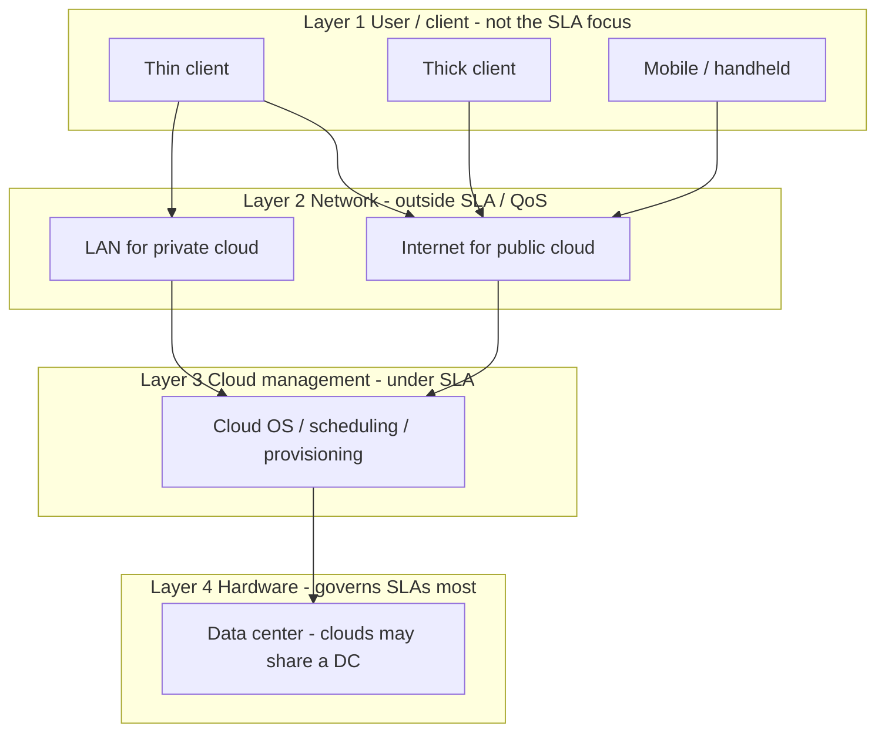
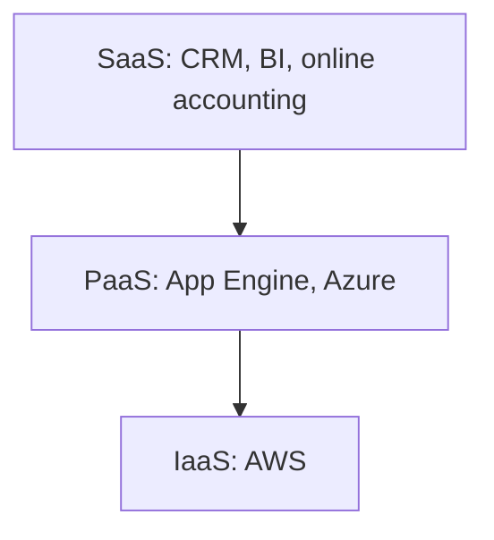

# M37: Cloud Computing Architecture

**Source:** https://www.youtube.com/watch?v=-Ig-ll_3kAk
**Instructor / expert:** Dr. Sunil Kumar, Department of Electrical and Computer Engineering, Punjab Agricultural University, Ludhiana

### Learning objectives

- Define cloud computing versus local storage and versus a “simple remote machine.”
- Recite the essential characteristics without which, the lecture says, a service is not a cloud.
- Contrast private, public, community, and hybrid deployment, including cloud bursting.
- Distinguish SaaS, PaaS, and IaaS (SPI) with the examples given (CRM, App Engine, Azure, AWS).
- Draw the four-layer architecture and state which layers fall under SLAs.

### Core concepts

In simple terms, cloud computing means **storing and accessing data and programs over the Internet from a remote location or computer**, instead of the local hard drive. That remote location has properties such as **scalability and elasticity** that make it **significantly different from a simple remote machine**. The **cloud is a metaphor for the Internet**.

Storing or running a program on the **local hard drive** is **local storage and computing**. To count as cloud computing, data or programs must be accessed **over the Internet**. The end result can look the same, but with an online connection it can be done **anywhere, anytime, and by any device**.

IT and business resources — **servers, storage, network, applications, and processes** — can be **dynamically provisioned** to user needs and workload. A cloud can provision and support a **grid**, and also **non-grid** environments such as a **three-tier web architecture** running traditional or **Web 2.0** applications.

Cloud computing is a mechanism of **hiring computing power or infrastructure** at organizational or individual level **to the extent required**, **paying only for consumed services**. Security can be added while accessing those remote resources. Figures show several applications: the cloud is **Internet-based computing resources**, reached through **secure connectivity**.

It is growing especially among **individuals and SMEs**. It comes into focus when one asks what computing resources and IT solutions are required: a way to **increase capacity or add capabilities on the fly** without investing in new infrastructure, training new personnel, or licensing new software.

#### Essential characteristics

The instructor stresses the word **essential**: if **any** of these is missing, **it is not cloud computing**. The spoken list overlaps NIST-style wording; all of the named properties are below.

**On-demand self-service.** Flexibility to **self-provision** resources according to customer demand **without being aided by any human**.

**Network / broad network access.** Heterogeneous network access for **mobile clients** and other computer models. Resources are reachable **from anywhere**: a **browser**, a **desktop application** designed for them, or a **mobile device**. A popular application model cited: **iPhone apps** that communicate with a cloud-based backend.

**Resource pooling (elastic / location-independent).** Provider resources are **pooled** to serve multiple consumers in a **multi-tenant** model. Physical and virtual resources are **dynamically assigned and reassigned** by demand. The customer generally has **no control or knowledge of the exact location**, but may specify location at a **higher abstraction** (countries, regions). Examples of pooled resources: **storage, processing, memory, network bandwidth**. To the consumer, capacity often appears **unlimited** and purchasable in **any quantity at any time**. Resources are aggregated irrespective of consumer geolocation.

**Rapid elasticity.** Manage pools **on demand**: take what is needed and **free resources** when the situation changes.

**Measured service.** Metering **controls, monitors, and reports** resource use. Audited reports for provider and consumer show **how much disk was used**, which services were accessed, and **for how many hours**. Companies **pay only for what they use** — cost-efficient. Use can be monitored, controlled, and reported with **transparency** for both sides.

#### Deployment models

Deployment models describe **how** cloud services are made available, depending on organizational structure and **where** data and services are provisioned. Four forms:

| Model | Also called / shape | As taught |
|-------|---------------------|-----------|
| **Private** | Internal cloud | Platform on a **cloud-based secure environment** behind a **firewall**, under the **corporate IT department**. Only **authorized users**; the organization has **direct control over data**. Physical computers may be hosted **internally or externally**, but resources come from a **distinct pool**. Suited to **dynamic, mission-critical** needs, security, management, and **uptime**. Can **evade some public-cloud security obstacles**, but remains prone to **natural disaster** and **internal data theft**. What “counts” as private is **hard to define** because service mixes vary |
| **Public** | “True” cloud hosting | Services over a network **open for public usage**. Customers have **no distinguished control** over infrastructure location. Technically, structure may differ **little** from private cloud except **security level**. Suited to **load management**, **SaaS-style** hosted apps, and apps **many users consume**. Lower capital and operating cost; dealer may be **free** or **pay-per-user license**; cost **shared**, **economies of scale**. Example of a free public cloud: **Google** |
| **Community** | Shared by a community | Mutually shared among organizations in a particular community — example: **banks and trading firms**. Members share similar **privacy, performance, and security** concerns and business objectives. Managed **internally or by a third party**; hosted **externally or internally**. Cost shared inside the community → **cost saving** |
| **Hybrid** | Bound combination | Arrangement of **two or more** clouds (private, public, or community) **bound together** but remaining **individual entities**. Crosses isolation/boundaries so it cannot be simply labeled public, private, or community. Lets users increase capacity by **aggregation, assimilation, or customization** with another package. Resources in-house **or** external. Workload **exchanges** between private and public as needed |

**Hybrid examples and features**

- **Non-critical** work (development and test) in a **third-party public** cloud; **critical/sensitive** work **internal**.
- **E-commerce site** on a **private** cloud for **security and scalability**; a **brochure site** (security not prime) on a cheaper **public** cloud.
- Demand spikes: extra resources from the public cloud = **cloud bursting**.
- **Big data** retained/processed with sales and business data on private cloud; **analytical queries** on the public cloud because public cloud handles spikes well.
- Hybrid hosting: **scalability, flexibility, and security**, if one overlooks challenges such as **API incompatibility**, **network connectivity issues**, and **capital expenditures**.

Selecting the right hosting type after analyzing business demand lets an organization channel effort into strategy. Cloud hosting has “a lot of potential,” but **selection matters**.

#### Three service-offering models (SPI)

Cloud resources reach customers as:

| Model | Lecture gloss |
|-------|----------------|
| **SaaS** | Software as a Service — applications hosted by a vendor/provider and offered over a network |
| **PaaS** | Platform as a Service — OS and associated services (e.g. **CASE** tools, **IDEs**) for developing solutions **over the Internet without download or install** |
| **IaaS** | Infrastructure as a Service — outsourcing equipment that supports operations: **storage, hardware, servers, networking** |

Also called the **SPI** (Software / Platform / Infrastructure) model.

**Cloud SaaS.** Consumer uses the provider’s applications running on cloud infrastructure (network, servers, OS, storage, even individual application capabilities), with possible **limited user-specific configuration**. Access from various clients via a **thin-client interface** (web browser) or a program interface. Consumer **does not manage or control** the underlying infrastructure. Typical apps: **CRM**, **business intelligence / analytics**, **online accounting**.

**Cloud PaaS.** Consumer **deploys** consumer-created or acquired applications built with languages, libraries, services, and tools the **provider supports**. No control of underlying infrastructure; control of **deployed applications** and possibly **hosting-environment configuration**. A **packaged, ready-to-run** development or operating framework. The PaaS side provides networks, servers, storage, and manages **scalability and maintenance**; client typically **pays for services used**. Examples: **Google App Engine** and **Microsoft Azure**.

**Cloud IaaS.** Consumer **provisions processing, storage, networks, and other fundamental resources** on a **pay-per-use** basis and deploys software including **OS and applications**. No control of the underlying cloud; control of **OS, storage, deployed apps**, and possibly **limited networking components**. Provider **owns** the equipment and handles **housing, cooling, operation, and maintenance**. Example: **Amazon Web Services (AWS)**.

**PaaS vs IaaS:** the difference is **how much control users have**. PaaS lets **vendors manage everything**; IaaS **requires more management from the customer**. If an organization **already has a software package** and wants to **install and run it on the cloud**, it should choose **IaaS instead of PaaS**.

#### Four-layer cloud architecture

The cloud has a **hierarchical** architecture of dependencies and components. It is **completely dependent on the Internet**. Four layers based on **how the user accesses** the cloud:

**Layer 1 — user / client (lowest).** Where the client **initiates connections**. Device may be a **thin client**, **thick client**, **mobile**, or handheld that can access a web application.

- **Thin client:** completely dependent on another system; **very low processing**.
- **Thick client:** ordinary computer with **adequate independent processing**.

A cloud application is often accessed like a web application, but **internal properties differ**. This layer is the **client devices**.

**Layer 2 — network.** Lets users connect; the whole infrastructure **depends on this connection**. For a **public** cloud this is primarily the **Internet**. The public cloud exists in a specific location the user **does not know** (abstract) and can be worldwide. For a **private** cloud, connectivity may be a **LAN**, but the cloud still **depends on that network**. Users typically need a **minimum bandwidth**, sometimes defined by the provider.

This layer does **not** come under **SLA** purview. SLAs **do not** take the Internet connection between user and cloud into account for **QoS**.

**Layer 3 — cloud management.** Software that manages the cloud: a **cloud OS** as interface between **data center and user**, and management software for resources — **scheduling, provisioning, optimization, server consolidation, storage, workload consolidation, internal cloud governance**.

This layer **does** fall under SLAs: delays or discrepancies in provisioning can **violate the SLA** and trigger a **penalty** from the provider. SLAs apply to **private and public** clouds. Popular providers: **AWS** and **Microsoft Azure** (public); **OpenStack** for **private** cloud creation, deployment, and management.

**Layer 4 — hardware resource.** Actual hardware. Public cloud: a **data center** in the back end. Private: a data center (huge interconnected hardware in a location) or a **high-configuration system**. This layer is under SLAs and is the **most important layer governing SLAs**. When a user accesses the cloud it should be available **as quickly as possible** within SLA time; discrepancy means **penalty**. Data centers therefore need **high-speed network connections** and **highly efficient algorithms** to move data from the data center to the manager. A cloud may have **many data centers**; **several clouds can share a data center**.

There can be **loose isolation between layers 3 and 4** depending on how the cloud is deployed.

### Diagrams

### Key terms

| Term | Meaning in this lecture |
|------|-------------------------|
| Cloud | Metaphor for Internet-based, elastic, metered remote compute — not a simple remote PC |
| On-demand self-service | Customer provisions without a human intermediary |
| Broad network access | Browser, desktop app, or mobile (e.g. iPhone apps) from anywhere |
| Resource pooling | Multi-tenant dynamic assignment; location opaque except region/country |
| Rapid elasticity | Expand and release pools as demand changes |
| Measured service | Metering and audited pay-per-use reports |
| Private / public / community / hybrid | Four deployment models |
| Cloud bursting | Hybrid spike handling by drawing public-cloud capacity |
| SaaS / PaaS / IaaS (SPI) | App / platform / infrastructure service models |
| Thin vs thick client | Dependent low-power vs adequate local processing |
| SLA | Contract whose QoS penalties apply to management and hardware layers, not the user’s Internet path |
| OpenStack | Example stack for private-cloud create/deploy/manage |

### Lecture takeaways

- Cloud is Internet access to pooled, elastic, metered resources — **hire and pay for consumption**, not a new local box.
- **All** listed essential characteristics are required, or it is **not** cloud computing.
- Choose deployment by control and community: private for mission-critical (still disaster/insider-prone), public for scale/cost (Google example), community for shared concerns (banks/traders), hybrid for bursting and mixed sensitivity.
- **SPI:** SaaS uses apps; PaaS deploys onto a vendor-managed stack (App Engine, Azure); IaaS rents raw resources (AWS). Bring-your-own package → **IaaS not PaaS**.
- Four layers from client device to data center; **network is outside SLAs**, **management and hardware are inside**, with hardware affecting penalties most.
