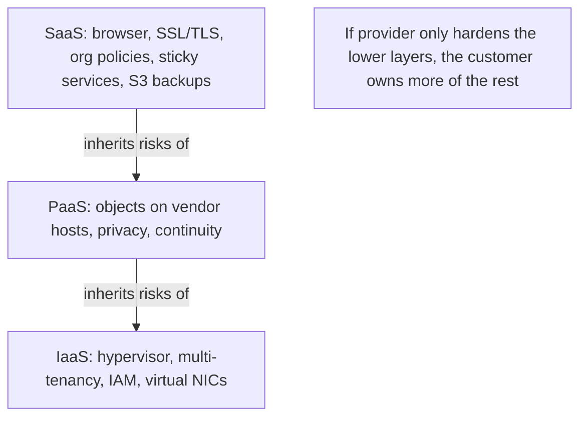
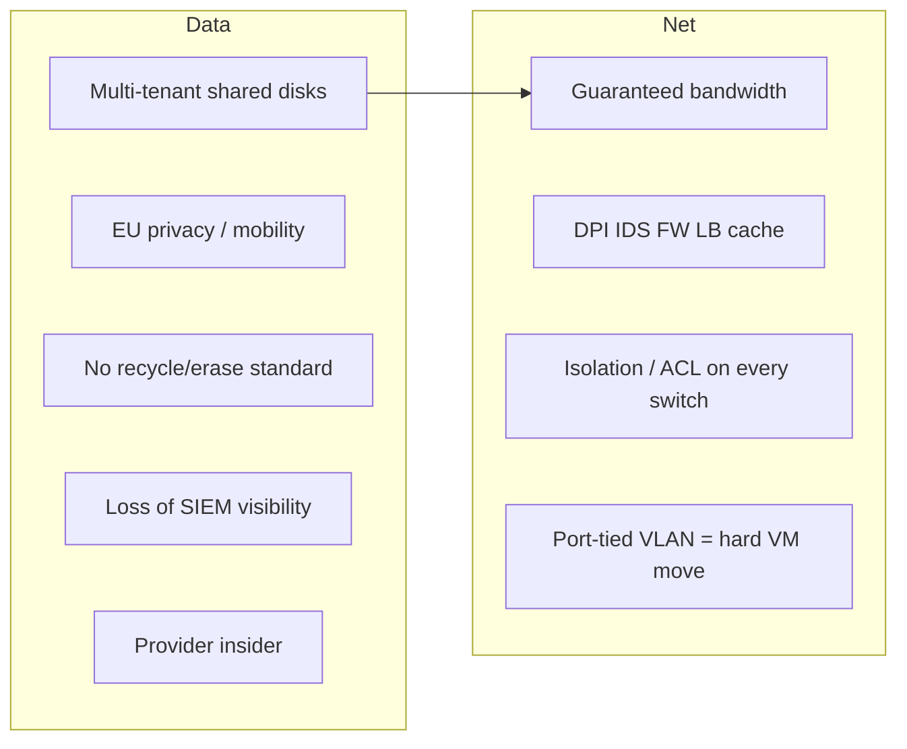

# M38: Security in Cloud Computing

**Source:** https://www.youtube.com/watch?v=5-6WRtoGJcQ
**Instructor / expert:** Dr. Sunil Kumar, Department of Electrical and Computer Engineering, Punjab Agricultural University, Ludhiana

### Learning objectives

- Define cloud computing security as procedures, processes, and standards spanning physical and logical issues in SaaS/PaaS/IaaS and public/private/hybrid delivery.
- List data-security and virtual-data-center challenges (multi-tenancy, EU privacy, disk wipe standards, loss of visibility, provider insiders, hypervisor I/O).
- Enumerate cloud **network** challenges from guaranteed bandwidth through location-dependent VLANs.
- Explain how security responsibility shifts as capabilities (and risks) are inherited up the SPI stack.
- Detail SaaS, PaaS, and IaaS (especially private-cloud) security issues named in the lecture.

### Core concepts

Security is an important aspect of the cloud environment. **Cloud computing security** is the **set of procedures, processes, and standards** designed to provide **information-security assurance** in a cloud.

It addresses both **physical and logical** security across **software, platform, and infrastructure** service models, and how those services are delivered — **public, private, or hybrid**.

Cloud security is a broad set of constraints from **end-user and provider** perspectives. The end user is primarily concerned with the **provider’s security policy**: **how and when data are stored** and **who has access**. Subsequent sections cover **data security**, **virtualization security**, and issues in **SaaS, IaaS, and PaaS**.

#### Security aspects and research context

Cloud computing places business data in the hands of an **outside provider** and makes **regulatory compliance inherently riskier and more complex** than in-house systems. **Loss of direct oversight** means the client must **verify** that the provider is working to keep data security and integrity **ensured**.

Current security-related research areas taught:

- **Reliable distributed Internet applications** (e.g. **e-commerce**) that rely heavily on a **trust path** among parties.
- Skyrocketing demand for cloud consumer and business apps driving **next-generation data centers** that must be **massively scalable, efficient, agile, reliable, and secure**, so cloud services can scale to **millions of developers** and **billions of end users**.
- Future network-based providers will **leverage virtualization** to allocate the **right levels** of virtualized **compute, network, and storage** to each application from **real-time business demand**, with full SLA assurance of **availability, performance, and security** at reasonable cost — an evolution likened to **scalable telecommunication networks**.

#### Data security

Because of **huge infrastructure cost**, organizations are switching to cloud. Data sit in the **provider’s infrastructure**, **not in the organization’s territory**, which raises complex challenges:

- **Service models with multiple tenants sharing the same infrastructure.**
- **Data mobility** and legal issues relative to rules such as the **European Union data privacy directive**.
- **Lack of standards** on how providers **securely recycle disk space and erase existing data**.
- **Loss of visibility** into key security and operational intelligence that no longer feeds **enterprise IT security intelligence and risk management**.
- A **new type of insider** who **does not even work for your company** but may have **control and visibility into your data**.

#### Data-center / virtualization security

Data are stored **outside the user’s territory** in a **data center whose location is unknown** — a **virtual data center**. Its backbone is **virtual infrastructure / VMs**. Virtual platforms still depend on **often forgotten** physical and virtual data-center components.

There are typically **seven areas of concern** with any major virtual-platform implementation or migration. Issues often **do not appear in staging/testing** and show up only when VMs take on the **same load as physical machines**. Two **cornerstones** of the data center are **network and storage**. Named problems:

**Lack of performance and availability.** Virtualization moves many **I/O tasks tuned for hardware** into software via the **hypervisor**. The virtualization translation layer translates optimized code for the software view to the **physical CPU**.

**Lack of application awareness.** A limitation of **hypervisor- and kernel-based** virtualization: they only virtualize the **OS**. Virtualization is **not aware of applications** on that OS; even the applications **do not realize** they are on virtual hardware above a hypervisor.

**Overflowing storage.** Converting physical machines to VMs helps dynamic data centers, but hard drives become **extremely large flat-file virtual disk images**, and file storage becomes **unmanageable**.

**Congested storage network.** Because OS virtualization is **portable**, data traversing the storage network can **increase dramatically**. Once images are portable it is **trivial** to move VM images across the network from host to host or array to array — the same reason disk files can **overrun physical storage**.

#### Network security in the cloud

The cloud is a network of many things; the network is the **backbone**, and it has challenges:

**Application performance.** A tenant should specify **bandwidth** so hosted apps perform like **on-premises** deployments. Many **tiered** applications need **guaranteed bandwidth** between server instances to finish user transactions in acceptable time and meet **SLAs**. Insufficient bandwidth imposes **significant latency**.

**Flexible deployment of appliances.** Enterprises deploy security appliances — **deep packet inspection**, **intrusion detection systems**, **firewalls** — plus **load balancing, caching, and application acceleration**. In the cloud, the application should still **flexibly exploit** those appliances.

**Policy-enforcement complexity.** **Traffic isolation** and **access control** to end users are among forwarding policies that must be enforced; they **directly impact configuration of each router and switch**.

**Changing requirements.** Different protocols — **OSPF**, **LAG** (link aggregation), **VRRP**, and flavors of **L2 spanning-tree**, plus **vendor-specific** protocols — make it extremely hard to **build, operate, and interconnect** a cloud network **at scale**.

**Application rewriting.** Apps should run **out of the box** as much as possible. For **IP addresses** and **network-dependent failover**, they may need **rewrite or reconfiguration**. Two key issues: (1) **lack of a broadcast-domain abstraction** in the cloud network; (2) **cloud-assigned IP addresses** for virtual servers.

**Location dependency.** Appliances and servers are typically tied to a **statically configured physical network**. A server’s IP is typically determined by the **VLAN or subnet** it belongs to; VLANs/subnets rest on **physical switch-port configuration**. A VM therefore **cannot be easily and smoothly migrated**. Constrained migration **decreases utilization and flexibility**. Mapping VLAN/subnet space to physical ports also **fragments the IP address pool**.

#### Platform-related security and inherited risk

Providers offer **SaaS, PaaS, and IaaS** with varied services and challenges: **secured network**, **locality of resources**, **accessing secure data**, **data privacy**, and **backup policy**.

Cloud computing uses three delivery models to provide **infrastructure resources, application platform, and software**. They play **different levels of security requirements**.

**IaaS is the basis of all cloud services**, with **PaaS built upon it** and **SaaS built upon PaaS**. **Capabilities are inherited — so are information-security issues and risks.** There are trade-offs in **integrated features, complexity versus extensibility, and security**. If the provider secures only the **lower part** of the architecture, **consumers become more responsible** for implementing and managing their own security.

**SaaS** (again): software deployed remotely by the application/service provider, available **on demand over the Internet**. Benefits: **improved operational efficiency** and **reduced costs**. Rapidly emerging as the **dominant delivery model** for enterprise IT services.

**PaaS** sits **one layer above IaaS** and **abstracts everything up to OS, middleware, etc.** It offers developers a **complete SDLC**: planning, design, building, deployment, testing, maintenance — everything else abstracted from the developer’s view.

#### SaaS security issues

In traditional **on-premises** deployment, sensitive data stay **inside the enterprise boundary**, under its **physical, logical, and personnel** security and access-control policies.

SaaS apps are accessed through the **web**, so **web-browser security is very important**. Information-security officers must consider methods of securing SaaS: **web-services security**, **XML encryption**, **SSL**, and other options for **data protection in transit**. That means **strong encryption** and **fine-grained authorization**.

SaaS pain points:

| Issue | Teaching |
|-------|----------|
| **Network security** | Sensitive data in flight must be secured against leakage via strong traffic encryption: **SSL and TLS** |
| **Resource locality** | Users consume services **without knowing exactly where resources are**. **Compliance and data-privacy rules in various countries** make **locality of data** utmost importance in much enterprise architecture |
| **Cloud standards** | Needed across organizations for **interoperability, stability, and security**. Example: one provider’s **storage services may be incompatible** with another’s. Providers may introduce **sticky services** that make **migration** difficult |
| **Data access** | Driven by the **organization’s security policies** (which employees may see which data). The cloud must **adhere** to those policies to avoid unauthorized intrusion. SaaS must be **flexible** enough to incorporate org-specific policies and provide an **organizational boundary** inside a cloud that **hosts many organizations’ processes** |
| **Data breaches** | Data from many users and businesses **lie together**; a breach **attacks all of them**. The cloud is a **high-value target** |
| **Backup** | Vendor must **regularly back up** sensitive enterprise data for **quick disaster recovery**, with **strong encryption** of backups. On **Amazon S3**, **data at rest are not encrypted by default**; users must **separately encrypt** data and backups so unauthorized parties cannot access or tamper with them |

#### PaaS security issues

PaaS is a **ready-to-use platform including OS** on **vendor-provided infrastructure**. Challenges come mainly from **spread of user objects over cloud hosts**. **Stringently allowing object access to resources** and **defending objects against malicious or corrupt providers** reasonably reduce risk.

**Network access and service measurement** raise **secure communications** and **access control**. Well-known practices: **object-scale enforcement of authorization** and **undeniable traceability**.

Additionally: **user privacy** must be protected in a **public shared cloud**, so proposed solutions must be **privacy-aware**. **Service continuity** concerns enterprises considering cloud adoption, so **fault-tolerant, reliable** systems are required.

#### IaaS security issues (especially private cloud)

Cloud promises **flexibility, agility, potential cost savings**, and a competitive edge so developers can **stand up infrastructure quickly**. Private cloud solves **many** problems but is **not that good at solving security problems**. Traditional problems that remain in a **private cloud**:

**Hypervisor security.** Most or all services run virtualized; the hypervisor’s security model **cannot be taken for granted**. **Evaluate security models and hypervisor development**.

**Multi-tenancy.** Even if all tenants are from the **same company**, not all may be **comfortable sharing infrastructure** with other internal users.

**Identity management and access control.** Traditional data centers were comfortable with a small set of authentication repositories (**Active Directory** being one of the most popular). Private cloud must handle **authentication and authorization** for the cloud infrastructure, **tenants**, and **delegation of administration** of the cloud fabric.

**Network security.** Many service components communicate only over **virtual network channels**. Accessing that traffic, employing **powerful access controls** (as for physical networks), and controlling **QoS** — a key **availability** issue in the **CIA** model — are major concerns.

#### Combined picture

Combining the **three clouds** (public, private, hybrid) with the **three service-delivery models** gives a complete environment, **interlinked by connectivity devices** and **information-security components**. **Virtualized physical resources, virtualized infrastructure, virtualized middleware platforms, and business applications** are provided as computing services.

**Providers and consumers must maintain and establish computing security at all levels of interfaces** in the cloud architecture.

### Diagrams

### Key terms

| Term | Meaning in this lecture |
|------|-------------------------|
| Cloud computing security | Procedures, processes, and standards for assurance in cloud environments |
| Trust path | Dependency among parties in Internet applications such as e-commerce |
| New insider | Provider staff who can see/control customer data without being company employees |
| Sticky services | Provider lock-in that makes leaving (e.g. incompatible storage APIs) hard |
| Hypervisor | Translation layer whose I/O and security model must not be assumed safe |
| Broadcast-domain abstraction | Missing cloud-network feature that forces application rewrites |
| XML encryption / WS-Security / SSL / TLS | In-transit protections listed for SaaS |
| Amazon S3 | Example where **data at rest are unencrypted by default** |
| CIA | Confidentiality, integrity, availability — QoS on virtual networks hits **availability** |
| Active Directory | Example traditional authentication repository that private cloud outgrows |

### Lecture takeaways

- Cloud security is **physical and logical**, across **SPI** and **public/private/hybrid**, and must answer **where data live and who can see them**.
- Putting data off-premises raises **multi-tenancy, EU privacy, wipe standards, lost SIEM feeds, and provider insiders**.
- Virtual data centers hide load-time failures: hypervisor I/O, **app-unaware** VMs, huge disk images, and **portable images flooding storage networks**.
- Cloud networks struggle with **SLA bandwidth**, **appliance insertion**, **per-switch policy**, **protocol zoo**, **no broadcast domain**, **cloud IPs**, and **VLAN/port location binding**.
- **Risks inherit up the stack**; the lower the provider’s security cutoff, the more the customer must implement. SaaS adds browser/transit/locality/sticky/backup issues (encrypt S3 yourself); PaaS adds object isolation and privacy; IaaS/private cloud still has **hypervisor, awkward internal multi-tenancy, IAM, and virtual-network CIA**.
- Security is required at **every interface** among virtualized hardware, infrastructure, platforms, and business apps.
