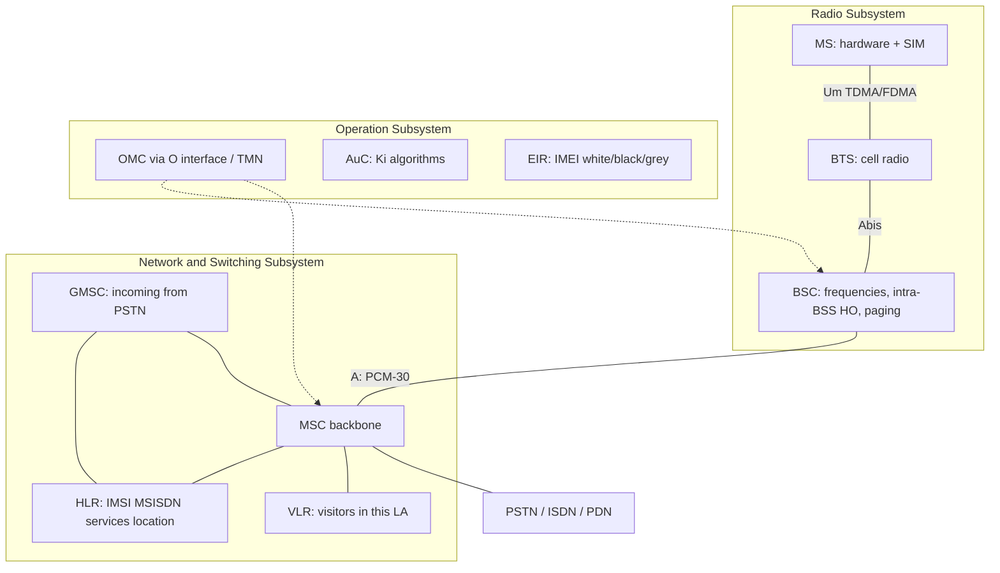
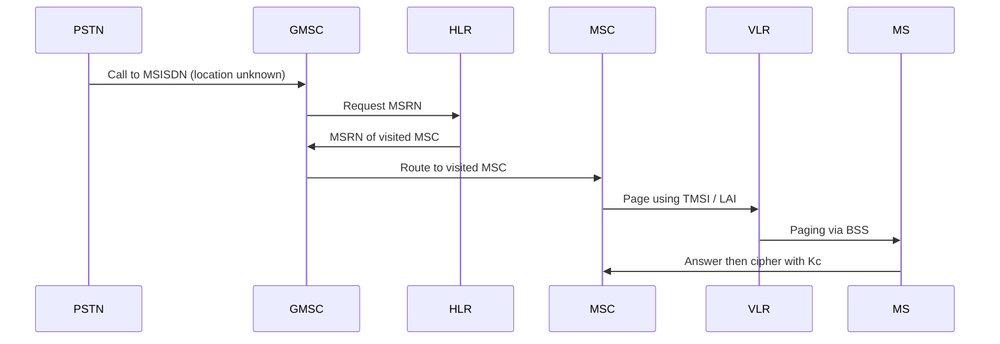

# M39: GSM Architecture

**Source:** https://www.youtube.com/watch?v=OdtB17eovb4
**Instructor / expert:** Dr. Sunil Kumar, Department of Electrical and Computer Engineering, Punjab Agricultural University, Ludhiana

### Learning objectives

- Place GSM as the dominant 2G digital cellular standard (CEPT GSM → ETSI → 3GPP) and list GSM900 / DCS1800 / PCS1900 bands.
- Partition the network into RSS, NSS, and OSS and name the A, Abis, Um, and O interfaces.
- Identify MS hardware vs SIM identifiers (IMEI, IMSI, PIN/PUK, Ki, Kc, TMSI, LAI).
- Explain MSC, HLR, VLR, EIR, AuC, GMSC, and SMS gateways, including HLR/VLR hierarchy.
- Classify GSM teleservices, bearer services (9.6 kbps, HSCSD, GPRS), and supplementary services (CLIP/CLIR, AoC, CUG, …).

### Core concepts

**GSM (Global System for Mobile Communications)** is a globally accepted standard for **digital cellular** communication. Digital cellular networks are a growing market for mobile and wireless devices. They are **wireless extensions of traditional PSTN or ISDN** and allow **seamless roaming** with the same mobile phone nationally or worldwide. Today they are used mainly for **voice**, but **data traffic is continuously growing**, with several technologies for wireless data on cellular systems.

GSM is the most popular digital system, with about **70% market share**, used by **over 800 million people in more than 190 countries**.

#### History and bands

In the early **1980s** Europe had many **coexisting analog** mobile systems, often similar standards on **slightly different carrier frequencies**. To avoid that for a **fully digital second generation**, **Groupe Spécial Mobile (GSM)** was founded in **1982**. The system was soon named **Global System for Mobile Communications**, with specification in the hands of **ETSI** (European Telecommunications Standards Institute).

In the context of **UMTS** and **3GPP** (Third Generation Partnership Project), GSM development was **transferred to 3GPP** and combined with 3G development. 3GPP **assigned new numbers** to all GSM standards.

Primary goal: a mobile phone system allowing users to **roam throughout Europe**, with **voice services compatible with ISDN and other PSTN systems**. GSM is a typical **2G** system: it **replaced 1G analog** but does **not** offer the high worldwide data rates of **3G (e.g. UMTS)**.

| Name | Band as taught |
|------|----------------|
| **GSM900** | Initially Europe: **890–915 MHz uplink**, **935–960 MHz downlink** |
| **DCS 1800** | GSM at **1800 MHz** — Digital Cellular System 1800 |
| **PCS 1900** | GSM mainly used in the **US at 1900 MHz** — Personal Communications Service 1900 |

#### Three subsystems

GSM has a **hierarchical, complex** architecture of many entities and interfaces. Three subsystems:

| Subsystem | Full name | What the subscriber notices |
|-----------|-----------|-----------------------------|
| **RSS** | Radio Subsystem | **Mobile stations (MS)** and some **BTS antennas** |
| **NSS** | Network and Switching Subsystem | (internal) |
| **OSS** | Operation Subsystem | (internal) |

**Interfaces (as drawn):** RSS connects to NSS via the **A interface** (solid lines) and to OSS via the **O interface** (dashed lines).

- **A interface:** typically **circuit-switched PCM-30**, carrying up to **30 × 64 kbps** connections.
- **O interface:** **Signalling System No. 7 (SS7)** based on **X.25**, carrying **management data** to and from the radio subsystem.

#### Radio subsystem (RSS)

RSS comprises all **radio-specific** entities: **mobile stations** and the **base station subsystem (BSS)**.

A GSM network comprises **many BSS**, each controlled by a **Base Station Controller (BSC)**. The BSS maintains **radio connections to an MS**, **coding/decoding of voice**, and **rate adaptation** to and from the wireless part. A BSS contains several **Base Transceiver Stations (BTS)**.

**BTS.** All radio equipment: **antennas, signal processing, amplifiers**. A BTS can form a **radio cell**, or with **sectorized antennas**, several cells. Connected to the MS via the **Um** interface and to the BSC via the **Abis** interface.

**Um** contains the wireless mechanisms: **TDMA, FDMA, etc.** A GSM cell can measure between some **100 m and 35 km**, depending on the environment.

**BSC.** Manages the BTS: **reserves radio frequencies**, handles **handover from one BTS to another within the BSS**, **pages** the MS, and **multiplexes radio channels onto the fixed network** at the **A interface**.

**Mobile station (MS).** The cell/mobile phone the user sees. Size has fallen while functionality has risen; time between charges has increased. Two main elements: **main hardware** and the **SIM**.

Hardware includes display, case, battery, and electronics for generating/processing the received and transmitted signal. It also contains the **International Mobile Equipment Identity (IMEI)**, installed at **manufacture** and **cannot be changed**. The network accesses it during **registration** to check whether the equipment was **reported stolen**.

The **SIM (Subscriber Identity Module)** identifies the **user** to the network. It holds identifiers and tables: **card type, serial number, list of subscribed services, PIN, PIN Unblocking Key (PUK), authentication key Ki**, and **IMSI (International Mobile Subscriber Identity)**.

- **PIN** unlocks the MS. **Wrong PIN three times locks the SIM**; then **PUK** is needed.
- While logged on, the MS stores **dynamic** information: cipher key **Kc**, and location information — **TMSI** (Temporary Mobile Subscriber Identity) and **LAI** (Location Area Identification).

Typical transmit power: up to **2 W** for **GSM900**; **1 W** is enough for **GSM1800** because of **smaller cell size**.

Besides the telephone interface, an MS can offer display, loudspeaker, microphone, programmable soft keys, computer/modems, or **Bluetooth**. Vendor-specific extras: cameras, fingerprint sensors, calendars, address books, games, Internet browsers. **PDAs** with mobile-phone functions exist. An MS can also be **integrated into a car** or used for **location tracking of a container**.

#### Network and Switching Subsystem (NSS)

The **heart** of GSM. NSS **connects the wireless network with standard public networks**, performs **handovers between different BSS**, **worldwide localization**, and supports **charging, accounting, and roaming** between providers in different countries. It consists of switches and databases:

**MSC (Mobile Switching Center).** Main element of the core network. Acts like a normal **PSTN/ISDN switching node** plus mobility functions. Sets up connections to other MSCs and to BSCs via the **A interface**; forms the **fixed backbone**. An MSC manages **several BSCs** in a geographical region: **registration, authentication, call location, inter-MSC handovers, call routing** to a mobile subscriber. Interface to **PSTN** (landline), to other MSCs (other networks), and to **public data networks (PDN)** such as **X.25**. Handles signaling for **connection setup, release, and handover to other MSCs**.

**HLR (Home Location Register).** **Most important database.** Stores all user-relevant information:

- **Static:** **MSISDN** (Mobile Subscriber ISDN number), subscribed services (e.g. **call forwarding, roaming restrictions, GPRS**), **IMSI**.
- **Dynamic:** current **location area** of the MS, **MSRN** (Mobile Station Roaming Number), current **VLR and MSC**.

When the MS **leaves its current LA**, HLR is **updated**. At switch-on the phone **registers**, so the network knows which **BTS** it uses and can **route incoming calls**. Even when not in a call but **switched on**, it **re-registers periodically** so the HLR has the latest position — necessary to **localize a user anywhere** in GSM. Each user’s data exist **once**, in a **single HLR**, which also supports **charging and accounting**. HLRs can manage **several million** customers and are **highly specialized real-time databases**. **One HLR per network**, though it may be **distributed across subcenters**.

**VLR (Visitor Location Register).** Associated with each MSC; a **dynamic** database of users currently in that MSC’s location area (e.g. **IMSI, MSISDN, HLR address**). When a new MS enters an LA, the VLR **copies relevant information from the HLR**. This **HLR/VLR hierarchy avoids frequent HLR updates and long-distance signaling**. The VLR can be separate but is **commonly integral to the MSC** for faster access.

**EIR (Equipment Identity Register).** Decides whether given **mobile equipment** may enter the network, using **IMEI**, checked at registration. (Also described under OSS.)

**AuC (Authentication Center).** **Protected database** containing the **secret key also in the user’s SIM**; used for **authentication and ciphering on the radio channel**. (Also under OSS.)

**GMSC (Gateway MSC).** Point to which a **mobile-terminating call is initially routed without knowledge of MS location**. Obtains the **MSRN from the HLR** based on **MSISDN** (directory number) and routes the call to the **correct visited MSC**. The “MSC” in GMSC is **misleading**: gateway operation does **not** require linking to an MSC.

**SMS gateway (SMSG).** Collective name for two short-message gateways:

| Gateway | Direction |
|---------|-----------|
| **SMS-GMSC** | Short messages **to** a mobile (role similar to GMSC) |
| **SMS-IWMSC** (interworking MSC) | Short messages **originated by** a mobile on that network; fixed access point to the **SMS Center** |

#### Operation Subsystem (OSS)

Necessary functions for **network operation and maintenance**. OSS has its own entities and accesses others via **SS7**. Connected to components of **NSS and the BSC**. Used to **control and monitor** the overall GSM network and the **traffic load of the BSS**. As BTS count scales with subscribers, some maintenance tasks move to the **BTS** to save cost of ownership.

**OMC (Operation and Maintenance Center).** Monitors and controls all other entities via the **O interface**. Typical functions: **traffic monitoring, status reports, subscriber and security management, accounting and billing**. Uses the **Telecommunications Management Network (TMN)** concept standardized by the **ITU**.

**AuC (again, OSS view).** Because the radio interface and MSs are particularly vulnerable, a separate AuC protects **user identity and data transmission**. It contains **authentication algorithms** and **encryption keys**, and **generates values needed for user authentication in the HLR**. It may sit in a **special protected part of the HLR**.

**EIR (again, OSS view).** Database of all **IMEIs** registered for the network. Mobiles can be **easily stolen**; with a **valid SIM**, anyone could use a stolen MS. EIR has a **blacklist** of stolen or locked devices. **Blacklists of different providers are not usually synchronized**, so **illegal use in another operator’s network is possible**. EIR also has a **whitelist** of valid IMEIs and a **grey list** of **malfunctioning** devices.

#### GSM services

GSM offers more than voice telephony; ask the local operator which services are available. Three basic types:

**Teleservices (T services).** Use bearer-service abilities to transport data.

- **Voice calls:** most basic T service — **telephony**, including **full-rate speech at 13 kbps** and **emergency calls** (nearest emergency provider via **three digits**).
- **Videotex and facsimile:** videotext access, **teletex**, fax, alternate speech and automatic faxing.
- **Short text messages (SMS):** send/receive text on the GSM phone; also news, sports, financial, language, and **location-based** data.

**Bearer services (data services).** Used through a GSM phone to send/receive data — the building block toward **mobile Internet** and mobile data transfer. GSM currently **9.6 kbps**. Newer developments: **HSCSD** (High-Speed Circuit-Switched Data) and **GPRS** (General Packet Radio Service), now available.

**Supplementary services.** Additional to T and bearer services: **caller identification, call forwarding, call waiting, multi-party conversations, barring of international outgoing calls**, among others.

| Supplementary service | Meaning as taught |
|----------------------|-------------------|
| **Conferencing** | Multi-party conversation (**three or more**); only for normal telephony |
| **Call waiting** | Notify of an incoming call during a conversation; answer, reject, or ignore |
| **Call hold** | Put an incoming call on hold and resume; normal telephony |
| **Call forwarding** | Divert from original recipient to another number; usually set by the subscriber, e.g. when not available |
| **Call barring** | Restrict certain **outgoing** calls (e.g. ISD) or stop incoming from undesired numbers; flexible **conditional** barring |
| **CLIP** | Calling Line Identification Presentation — show caller’s number |
| **CLIR** | Calling Line Identification Restriction — caller hides number |
| **COLP** | Connected Line Identification Presentation — calling party sees the **number actually connected** (useful when **forwarded**) |
| **COLR** | Connected Line Identification Restriction — called party hides number; **normally overrides** presentation |
| **Malicious call identification** | Combat obscene or annoying calls; subscriber causes unknown malicious calls to be **identified in the GSM network** with a simple command |
| **AoC (Advice of Charge)** | Indicate cost of services used; rental/providers without the user’s own SIM can use a slightly different form; **AoC for data calls is time-based** |
| **CUG (Closed User Group)** | Groups who wish to **call only each other and no one else** |

### Diagrams

### Key terms

| Term | Meaning in this lecture |
|------|-------------------------|
| GSM | 2G digital cellular; ~70% share; 800+ million users in 190+ countries |
| RSS / NSS / OSS | Radio, switching, and operation subsystems |
| Um / Abis / A / O | MS–BTS radio; BTS–BSC; BSS–MSC (PCM-30); management (SS7/X.25) |
| IMEI / IMSI | Equipment identity (in hardware) vs subscriber identity (on SIM) |
| PIN / PUK / Ki / Kc | Unlock SIM; unblock after 3 PIN fails; auth key; cipher key |
| TMSI / LAI | Temporary subscriber ID and location-area ID stored while camped |
| HLR / VLR | Permanent user DB vs per-MSC visitor copy (cuts long-distance signaling) |
| AuC / EIR | Auth/cipher secrets; IMEI white/black/grey lists (blacklists not shared across operators) |
| GMSC / SMS-GMSC / SMS-IWMSC | Incoming voice routing; SMS toward MS; SMS from MS |
| Teleservice / bearer / supplementary | Speech/SMS/fax; 9.6 kbps data path (HSCSD, GPRS); extras like CLIP and CUG |
| MSISDN / MSRN | Directory number vs routing number obtained from HLR |

### Lecture takeaways

- GSM is Europe’s answer to fragmented analog 1G: **one digital 2G** under ETSI then **3GPP**, built to **roam** with **ISDN-like voice**, later band-extended as GSM900 / DCS1800 / PCS1900.
- Users only see **MS + BTS antennas**; the real machine is **RSS (Um/Abis) + NSS (A, HLR/VLR/MSC) + OSS (O, TMN)**.
- Identity splits: **IMEI** (stolen phone) vs **IMSI/SIM** (stolen credentials); **VLR copies HLR** so the home database is not hit on every local event.
- Incoming calls go **GMSC → HLR (MSRN) → visited MSC**; SMS has analogous **GMSC/IWMSC** pair.
- Services stack as **teleservices (13 kbps speech, SMS, fax)**, **bearers (9.6 kbps, then HSCSD/GPRS)**, and a long list of **supplementary** controls (CLIP/CLIR, barring, CUGs, AoC).
- EIR blacklists **do not sync between operators**, so a stolen handset may still work on another network.
