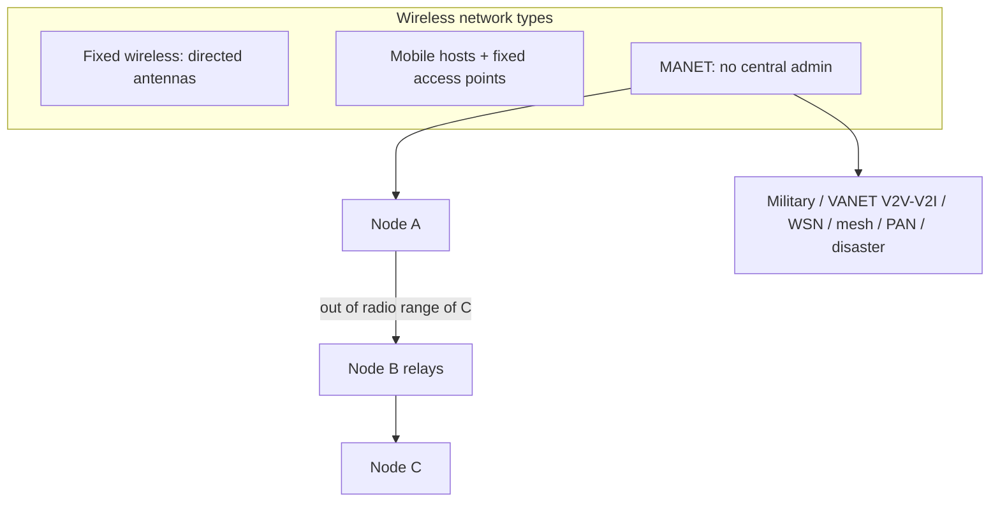

# M40: MANET - I

**Source:** https://www.youtube.com/watch?v=7CR1_FBxJ6o
**Instructor / expert:** Dr Sunil Kumar, Department of Electrical and Computer Engineering, Punjab Agricultural University, Ludhiana
**Course coordinator:** Dr Maninder Singh, Professor and Dean of Academic Affairs, Thapar University, Patiala

### Learning objectives

- Contrast wired networks with wireless networks and name the three wireless types the lecture uses: fixed wireless, wireless with fixed access points, and MANET.
- Define a mobile ad hoc network as an infrastructure-less, IP-based radio network in which nodes act as both hosts and routers.
- List MANET characteristics (autonomous terminals, distributed operation, multi-hop routing, dynamic topology, limited resources and security, scalability, low bandwidth).
- State the open challenges the instructor listed: scalability, routing, QoS, the client–server model shift, security, energy conservation, node cooperation, and interoperation.
- Recall the application families taught: military, home/office/education, VANET, wireless sensor networks, wireless mesh networks, disaster relief, and personal area networks.

### Core concepts

Like traditional **wired** networks, wireless networks are formed by **routers** and **hosts**. Routers forward packets; hosts are sources or **sinks** of data flows. The fundamental difference is how components communicate. A wired network relies on physical cables. In a wireless network, communication between components can be either wired or wireless. Because wireless communication is not constrained by cables, hosts and routers have **freedom to move** — one of the advantages of wireless networking.

#### Three types of wireless network

According to the mobility of hosts and routers, the lecture distinguishes three types:

| Type | How it is formed | Example given |
|------|------------------|---------------|
| **Fixed wireless network** | Fixed hosts and routers use wireless channels to communicate | Fixed devices using **directed antennas**; two computers exchanging data via antenna signals |
| **Wireless network with fixed access points** | Mobile hosts use wireless channels to talk to **fixed access points**, which may act as routers | Laptop users in a building accessing fixed APs |
| **Mobile ad hoc network (MANET)** | Formed by **mobile hosts**, some of which forward packets for neighbours | **Vehicle-to-vehicle** and **ship-to-ship** networks using peer-to-peer routing |

In the ship example, all ships create a network **without any centralized administration**; a node can establish a link with any other node in range.

#### What a MANET is

A MANET is an **infrastructure-less, IP-based** network of mobile wireless machines connected by **radio**. Nodes have **no centralized administration**. It is a **routable** network: **each node acts as a router** and forwards traffic toward a specific destination. Mobiles and laptops can form such a network among themselves.

In the simplest case, nodes communicate **directly** when they are within wireless transmission range. Ad hoc networks must also support communication between nodes that are only **indirectly** connected by a series of wireless **hops** through other nodes. In the lecture’s figure, nodes **A** and **C** are not in each other’s radio circles, so the network must enlist **node B** to relay packets. The circles are the **nominal range of each node’s radio transceiver**.

#### Characteristics of MANETs

Compared with wired or infrastructure-based wireless networks, MANETs have the following characteristics (preview list plus the expanded treatment):

**Autonomous terminal.** Each mobile terminal is an autonomous node that may function as a **host or a router**. Besides host processing, nodes perform switching. Endpoints and switches are usually **indistinguishable**.

**Distributed operation.** There is no background network for central control. Control and management are **distributed among the terminals**. Nodes must **collaborate**; each acts as a **relay** as needed to implement functions such as **security and routing**.

**Multi-hop routing.** Ad hoc routing can be **single-hop or multi-hop**, based on link-layer attributes and routing protocols. Single-hop MANETs are simpler in structure and implementation. When the destination is **outside direct wireless range**, intermediate nodes must forward packets.

**Lightweight terminals.** Nodes are typically mobile devices with **less CPU**, **small memory**, and **low power storage**. They need **optimized algorithms** for computing and communicating.

**Dynamic topology.** All nodes are free to move, so topology changes **rapidly at unpredictable times**. Links break **much more frequently** than in wired or infrastructure wireless networks.

**Self-organization.** With no infrastructure or central administration, nodes must **form themselves into a network**.

**Multi-hopping.** The wireless channel and limited neighbourhood mean **intermediate nodes relay** packets.

**Resource conservation.** Nodes are limited in **energy supply and processing power**. Power conservation is a major design factor; operations should be optimized to **minimize energy consumption**.

**Limited capacity / limited security.** Mobile ad hoc networks are **more prone to security threats** than wired or infrastructure wireless networks. Each node can function as a router or packet forwarder. **Both legitimate users and malicious attackers** can access the wireless channel, and there is **no well-placed location at which access-control mechanisms can be deployed**.

**Scalability.** Some applications may grow to **several thousand nodes**. MANETs suffer scalability problems in **channel capacity**: capacities are limited, and the maximum is reached faster because of **multi-hopping**. Scalability is **related to the routing protocols** employed.

**Low bandwidth.** These networks have **lower capacity and shorter transmission range** than fixed-infrastructure networks. Wireless throughput is less than wired throughput because of **multipath fading, noise, and interference**.

#### Challenges of MANETs

The instructor listed topics that still need to be resolved: **scalability, routing, quality of service, client–server model shift, security, energy conservation, node cooperation, and interoperation**. The lecture then developed several of these.

**Scalability.** Visionaries often take large-scale “universal computing” as granted, but it is **unclear how such large networks can actually grow**. Ad hoc networks suffer **by nature** from capacity scalability problems.

**Routing.** Routing is non-trivial because of a **highly dynamic** environment. An ad hoc network is a collection of wireless mobile nodes **dynamically forming a temporary network** without pre-existing infrastructure or centralized administration. Nodes come together for a period to exchange information **while continuing to move**, so the network must **continually adapt** and **establish routes among themselves without outside support**.

**Quality of service (QoS).** Heterogeneous Internet applications challenged designers who built networks for **best-effort** service only. **Voice, live video, and file transfer** have vast and diverse requirements. **QoS-aware** solutions are being developed. QoS means the network **guarantees certain performance** for a flow or collection of flows in parameters such as **delay, jitter, bandwidth, and packet-loss probability**. Despite research, QoS in ad hoc networks is still described as an **unexplored area**.

**Client–server model shift.** On the Internet a client is typically configured to use a **server** (found automatically or by static configuration). In ad hoc networks the structure **cannot be defined by collecting IP addresses into subnets**. There may be **no servers**, yet demand remains for basic services: **address allocation, name resolution, authentication, and service location**. Their location is **unknown and changes dynamically**. A **different addressing approach** may be required, and it is still not clear **who manages** various network services. Shifting away from the traditional client–server model **remains to be appropriately addressed**.

**Security.** Applications such as **military** and **confidential meetings** need a high degree of security against enemies and **active and passive attackers**. Ad hoc networks are **particularly prone to malicious behaviour**. Lack of centralized network management or a **certification authority** in these dynamically changing wireless structures is framed as a **major roadblock to commercial application**.

**Interoperation.** When two autonomous ad hoc networks move into the **same area**, interference is unavoidable and the networks would need to **recognize the situation and merge**. Joining two networks is **not trivial**: they may use different **synchronization**, or even different **MAC or routing protocols**. Security is a major concern. Example: a **military unit** moving into an area covered by a **sensor network** — the unit might use a routing protocol with **location information**, while the sensor network uses a **simple static routing protocol**.

**Energy conservation** and **node cooperation** were named on the challenge list alongside the topics above.

#### Applications

MANETs are best where infrastructure is **unavailable** or **not cost-effective**.

**Military.** Satisfies needs such as **battlefield survivability**. Setting up infrastructure among soldiers may be impossible. Wireless devices carried by **soldiers, tanks, helicopters, and other vehicles** form a MANET for message passing.

**Home, office, and education.** The simplest application is networking **laptops, PDAs, and other WLAN-enabled devices** in the **absence of a wireless base station**. A **personal area network (PAN)** class example is **wire replacement**: in **Bluetooth**, peripheral devices connect to a computer over wireless Bluetooth links. Ad hoc networks can **stream video and audio** among wireless nodes without a base station — e.g. students obtaining class material from a professor’s laptop as class progresses. Other educational uses: **universities and campus settings, virtual classrooms, ad hoc communications during meetings or lectures**.

**Vehicular ad hoc networks (VANETs).** Responsible for communication between moving vehicles. A vehicle may talk to another vehicle directly (**vehicle-to-vehicle, V2V**) or to infrastructure such as a **roadside unit (RSU)** (**vehicle-to-infrastructure, V2I**).

**Wireless sensor networks (WSNs).** Treated as a **special case of MANET with reduced or no mobility**. Initially motivated by **military** applications; civilian domains include **environmental and space monitoring, disaster management, smart home, production, and healthcare**. WSNs may consist of **heterogeneous and mobile** sensor nodes. Topology may be as simple as a **star**. Scale and density vary by application. Figured applications: disaster management, network management, home networks, healthcare informatics, and military.

A sensor network is many **tiny, disposable, low-power devices (nodes)** spatially distributed to perform an **application-oriented global task**. Nodes communicate directly or through other nodes. One or more nodes serve as a **sink**, able to communicate with the user directly or through existing **wired** networks. The primary component is the **sensor**, monitoring real-world conditions such as **sound, temperature, humidity, vibration, pressure, motion, pollutants**, and so on at different locations. Nodes **sense, process, and communicate** in a **self-organizing**, battery-powered network.

**Wireless mesh networks (WMNs).** Can connect entire cities using inexpensive existing technology. Traditional networks rely on a small number of **wired access points or wireless hotspots**. In a mesh, the connection is spread among **dozens or hundreds of mesh nodes** that talk to each other to share connectivity across a large area. Mesh nodes are small radio transmitters that function like **wireless routers**. They use common **Wi-Fi** standards **IEEE 802.11a, 802.11b, and 802.11g**, on **2.4 GHz and 5 GHz** depending on the physical layer. If **IEEE 802.11a** is used, speed can be up to **54 Mbps**. Nodes are programmed with software that tells them how to interact with the large network. Information hops from node to node; nodes automatically choose the **quickest and safest path** using **dynamic routing**. The lecture figure: an **Internet cloud** as backbone of mesh routers, connected with access points, base stations, and other devices that provide Internet access to users.

**Disaster relief.** Earthquakes and floods destroy lives; loss of Internet connectivity is an increasingly noticeable effect. It is important to **keep networks operating when infrastructure elements are disabled**.

**Personal area networks (PANs).** A computer network for data among **computers, telephones, and PDAs**, consisting of nodes associated with a **single person** (clothes, belt, handbags). Flexibility examples: send a document to a printer upstairs while sitting on a couch with a laptop; upload a photo from a cell phone to a desktop.

The instructor closed by pointing to the **next lecture on MANET routing protocols**.

### Key terms

| Term | Meaning in this lecture |
|------|-------------------------|
| MANET | Infrastructure-less, IP-based radio network of mobile nodes that route for one another |
| Access point | Fixed infrastructure node that mobile hosts associate with in the non-ad-hoc wireless type |
| Multi-hop | Relaying through intermediate nodes when source and destination are not in direct range |
| Dynamic topology | Unpredictable, rapid link change because nodes move freely |
| QoS | Guaranteed performance for a flow: delay, jitter, bandwidth, packet-loss probability |
| VANET | Vehicular ad hoc network; V2V between vehicles, V2I via roadside units |
| WSN | Sensor-node network treated as a low-mobility special case of MANET, with sink nodes |
| Wireless mesh | Many 802.11a/b/g mesh routers sharing an Internet connection by dynamic hop-by-hop routing |
| PAN | Person-centred short-range network, including Bluetooth wire-replacement |

### Lecture takeaways

- Wireless freedom of movement yields three classes; MANET is the infrastructure-less extreme.
- Every MANET node is potentially a host **and** a router; A–C communication may require B.
- Design is dominated by dynamics, scarce energy/CPU/bandwidth, and the absence of a place to hang access control.
- Routing, QoS, naming/addressing without servers, security without a CA, and merging dissimilar networks are still open.
- The same idea covers battlefields, classrooms, vehicles, sensors, city-scale meshes, disasters, and PANs.
