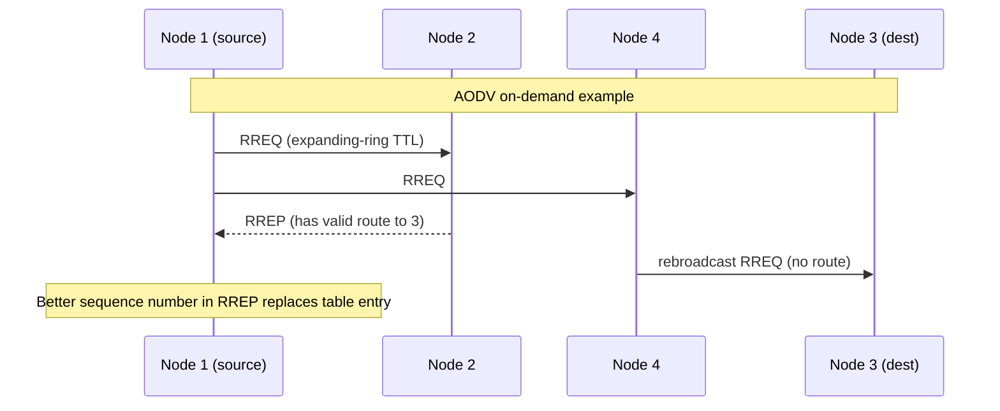
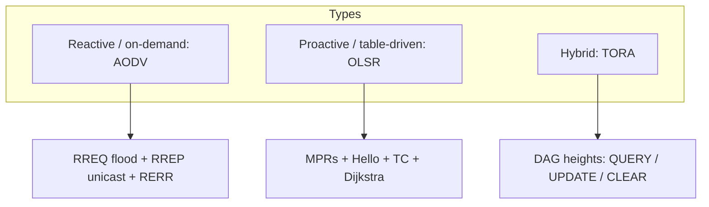

# M41: MANET – Routing Protocols

**Source:** https://www.youtube.com/watch?v=9eNSUh66Zag
**Instructor / expert:** Dr Sunil Kumar, School of Electrical Engineering and Information Technology, Punjab Agricultural University, Ludhiana
**Course coordinator:** Dr Maninder Singh, Professor and Dean of Academic Affairs, Thapar University, Patiala

### Learning objectives

- Define what a routing protocol does in a MANET and why metrics and information exchange matter under changing conditions.
- Distinguish **reactive (on-demand)**, **proactive (table-driven)**, and **hybrid** routing, including the bandwidth and latency trade-offs the lecture stated.
- Explain **AODV** (RFC 3561): RREQ / RREP / RERR, expanding-ring TTL, sequence numbers, precursor lists, and the three RERR circumstances.
- Explain **OLSR** as a proactive protocol that uses **multipoint relays (MPRs)**, Hello-based neighbour sensing, MPR flooding, topology-control (TC) messages, and Dijkstra shortest paths.
- Explain **TORA** as a hybrid protocol that builds a **DAG** of **heights** using QUERY, UPDATE, and CLEAR, with route creation, five maintenance cases, and route deletion.

### Core concepts

A **routing protocol** is the relationship or formula routers use to find a suitable path for forwarding data. It also supports **exchange of information between routers** and helps the network **adjust to variable conditions**. In other words, it is the **implementation of a routing algorithm in software or hardware**. Protocols use **different metrics** to choose the path that transfers a packet across the network.

#### Three types of MANET routing protocol

**Reactive routing protocols** are **on-demand**. They are invoked when needed, and routes are built then. Routes can be acquired by sending a **route request** through the network. The stated disadvantage is **high latency** in searching the network.

**Proactive routing protocols** **build and maintain routing information about all nodes**, **independent of whether a route is currently needed**. **Control messages are transmitted periodically** even if there is **no data flow**, so they are **not bandwidth-efficient**. Advantage: nodes can **easily get routing information and start a session**. Disadvantages: nodes keep **too much data for route maintenance**, and **recovery after a particular link failure is too slow**.

**Hybrid routing protocols** combine benefits of both. Routing **initiates using proactive pre-planned routes**; extra demand is then handled by **reactive flooding**. This methodology is suitable only in situations where **traffic demand and the number of nodes can be determined beforehand**.

The lecture then developed three named protocols: **AODV** (reactive), **OLSR** (proactive), and **TORA** (hybrid).

#### AODV — Ad hoc On-Demand Distance Vector

AODV is a **reactive** protocol that **sets up routes on demand**. If a node wants to communicate with a node for which it has **no route**, the protocol tries to establish one. It is described in **RFC 3561**.

As with all reactive protocols, **topology information is transmitted by nodes only on demand**. When a node wishes to send traffic to a host with no route, it generates a **route request (RREQ)** that is **flooded in a limited way**. Control-traffic overhead is therefore **dynamic**, and there is an **initial delay** when starting communication.

A route is considered **found** when the RREQ reaches **either the destination itself** or an **intermediate node with a valid route entry** for the destination. For as long as a route exists between two endpoints it is used; if the node remains passive when the route becomes **invalid or lost**, AODV **issues a request again**.

AODV defines **three control messages** for route maintenance:

**RREQ (route request).** Transmitted by a node that needs a route. As an optimization, AODV uses an **expanding-ring** technique when flooding. Every RREQ carries a **time-to-live (TTL)** stating **how many hops** the message should be forwarded. TTL starts at a **predefined value** on first transmission and is **increased on retransmissions**. Retransmissions occur if **no replies** are received.

RREQ frame fields taught: **source address, source sequence, broadcast ID, destination address, destination sequence, hop count**.

**RREP (route reply).** **Unicast** back to the originator of the RREQ if the receiver **is the requested address** or **has a valid route** to it. Unicast is possible because **every node forwarding an RREQ caches a route back to the originator**.

RREP fields taught: **source address, destination address, destination sequence, hop count, lifetime** (how long a path can be used).

**RERR (route error).** Nodes monitor the **link status of next hops in active routes**. When **link breakage** on an active route is detected, a RERR notifies other nodes of the loss. To enable this, each node keeps a **precursor list**: IP addresses of neighbours **likely to use it as next hop** toward each destination.

**Worked example (four nodes).** Circles are communication range; each node can talk only to neighbours. Node **1** wishes to send to node **3**. Neighbours of 1 are **2 and 4**. Node 1 **cannot** reach 3 directly, so it sends an RREQ, heard by 4 and 2. A node that receives RREQ either (a) **knows a route to the destination or is the destination** and sends an RREP, or (b) **rebroadcasts** RREQ to its neighbours. Rebroadcast continues until the **lifespan** is up. If node 1 gets **no reply in a set time**, it rebroadcasts with a **longer lifespan** and a **new ID**. **Sequence numbers** in the RREQ ensure nodes **do not rebroadcast the same request**. In the example, **node 2 has a route to 3 and replies**; **node 4 does not**, so it rebroadcasts. When a node sees an RREP whose route has a **better sequence number** than its routing list, it **replaces** its current route with the one in the RREP.

**When RERR is broadcast (three circumstances):**

1. The node receives a **data packet it is supposed to forward** but has **no route** to the destination — the real problem is that **some other node thinks the correct route is through this node**.
2. The node receives a RERR that **invalidates at least one of its routes**; it then sends a RERR naming the **newly unreachable** destinations.
3. The node **detects it cannot communicate with a neighbour**; it marks routing-table entries that use that neighbour as next hop **invalid**, then sends a RERR with the neighbour and the invalid routes.

Whenever a node receives a RERR it **looks at the routing table and removes all routes that contain the bad nodes**.

#### OLSR — Optimized Link State Routing

OLSR is a **proactive**, **table-driven** protocol: it **permanently stores and updates** its routing table so a route can be provided if needed. It can be implemented in **any ad hoc network**. Nodes collaborate by **periodically exchanging topology information**.

OLSR uses **multipoint relays (MPRs)** to **avoid unnecessary broadcast retransmissions**. A node periodically broadcasts a message to neighbours to **compute the MPR set** and exchange neighbourhood information. From neighbourhood information it calculates the **minimum set of one-hop relays needed to reach all two-hop neighbours** — that set is the **MPR set**.

OLSR differs from classical **link-state** protocols in two dissemination factors:

1. **Only the MPR nodes of a node A** need to forward link-state updates issued by A.
2. The **size of A’s link-state update is reduced** because it consists only of neighbours that **selected A as their MPR**.

Thus OLSR **reduces** link-state protocol overhead. It is used where nodes are **densely deployed**. It calculates the **shortest path** to an arbitrary destination.

**Functions of OLSR:**

**Neighbour sensing.** Each node must certify the **nature of its link** with neighbours because of radio transmission. OLSR specifies two link types: **symmetric** and **asymmetric**. Each node sends **Hello** messages at a Hello interval to one-hop neighbours for neighbour sensing; Hellos **are not forwarded**. A Hello contains the **neighbour list and link status**, which allows reduction of the **two-hop neighbour** set and their status. **MPR selection** is then made and the list is added into Hello messages. Using this MPR list, an **MPR selector list** is constructed: neighbours that **selected this node as MPR**. Messages received from **MPR selectors will be forwarded**.

**MPR flooding.** The aim is to **control traffic flooding**. MPRs are selected so that a flooding message transmitted by the MPR set **reaches all two-hop neighbours**. The MPR set of node *n* is the **smaller subset of symmetric one-hop neighbours of *n*** that have **symmetric links with *n*’s two-hop neighbours**. MPR flooding **eliminates transmission duplication** and **minimizes reception duplication**.

**Topology diffusion.** The objective is to **create routing tables** using periodic **topology control (TC) messages**. TC messages are circulated by each node with a **non-empty MPR selector set** to all network nodes, advertising at least the **links between itself and nodes in its MPR selector set**. TC messages contain enough information for nodes to **construct a topology table** and then **derive a routing table**. Routes use a **shortest-path algorithm such as Dijkstra**, providing the **best possible hop count**. Routing tables must be **recalculated** whenever neighbour-link or topology information changes.

#### TORA — Temporally-Ordered Routing Algorithm

TORA is a **hybrid** routing protocol, presented as effective against MANET limitations caused by **high node mobility**. **Congestion** is a major MANET problem. Traditional **shortest-path**, **adaptive shortest-path**, and **link-state** routing **cannot work properly** with mobile stations; it is difficult to update every dynamic node’s routing tables.

Each node **broadcasts a query packet**; recipients broadcast an **update** packet. TORA supports **loop-free multiple routes** using a **flat, non-hierarchical** algorithm and provides **better scalability**. To discover a route it uses a **DAG (directed acyclic graph)** and a set of **totally ordered heights**. Information may flow in **only one direction** (unidirectional), so there is **no chance of an infinite loop**.

Three basic operations: **route creation, route maintenance, route deletion**. Three control packets: **QUERY, UPDATE, and CLEAR**.

**Route creation.** QUERY and UPDATE create a new route. A QUERY carries a **destination ID**. An UPDATE holds **destination ID and height** of the node. Each node maintains a **route-required flag** (initially unset) and the **time of broadcast of the last UPDATE**.

When a node has **no directed link** and an **unset** route-required flag, it **broadcasts QUERY** to neighbours and **sets** the flag. On receiving QUERY:

- If there is **no downstream link** and the flag is **unset**: **rebroadcast QUERY** and set the flag.
- If there is **no downstream link** and the flag is **already set**: **discard** the QUERY.
- If there is at least one downstream link with **null height**: **set its height** and **broadcast UPDATE**.
- If there is at least one downstream link with **non-null height**: compare the time of last UPDATE broadcast with the time the link over which QUERY arrived became active; when the link becomes active, **broadcast UPDATE** and **discard QUERY**. If the route-required flag is set, **broadcast QUERY**.

When a node receives UPDATE it updates height-array entries:

- If the route-required flag is **set**: set height, update all link-state-array entries, **unset** the flag, **broadcast UPDATE** with the new height.
- If the flag is **not set**: just update the link-state array and apply **route-maintenance** techniques.

**Route maintenance.** TORA maintains routes after **topological change** and **re-establishes routes within a finite time**. Maintenance is needed when a node’s height is **non-null**. A neighbour with **null** height is **not considered**. Five cases:

| Case | Name | Taught meaning |
|------|------|----------------|
| 1 | Generate new reference level | Link failure: node lost its **last downstream** link. If it has an **upstream** neighbour it **updates its reference value**; otherwise it **sets height to null**. |
| 2 | Propagate the highest neighbour’s reference level | If the node has **no downstream link**, it **propagates the reference level to upstream neighbours**. |
| 3 | Reflect back a higher sub-level | After **link reversal**, if downstream links fail, the node **reflects back the reference height** with the **reflection bit** set. |
| 4 | Partition detection | If the set reference value **equals** neighbours’ reference height, the node has **detected a partition**, **raises the route**, and **sets height to null**. |
| 5 | Generate new reference level | New reference value when the node experienced a **link failure between propagation of a reference level and reflection of a sub-level**. |

**Route deletion.** In case 4 of maintenance, a node sets height from the **direction of edges toward the destination**, updates the link-state array, and **broadcasts a control packet** (CLEAR). On receiving it:

- If the **reference level matches**, the node sets its height and **sets height for each neighbour to null**, updates link-state arrays, and **broadcasts** the control packet.
- If the reference level **does not match**, it sets height for each neighbour and updates corresponding link-state entries.

At the end, height of each node in the **partitioned** portion is set to **null** and **invalid routes are erased**.

### Key terms

| Term | Meaning in this lecture |
|------|-------------------------|
| Reactive / on-demand | Build a route only when needed; higher search latency |
| Proactive / table-driven | Continuously maintain routes to all nodes via periodic control traffic |
| Hybrid | Proactive backbone plus reactive flooding for extra demand |
| AODV | Ad hoc On-Demand Distance Vector (RFC 3561); RREQ, RREP, RERR |
| Expanding ring | Increase RREQ TTL on retransmission if no reply |
| Precursor list | Neighbours that likely use this node as next hop; used to send RERR |
| OLSR | Optimized Link State Routing; proactive, MPR-optimized link state |
| MPR | Multipoint relay: selected one-hop neighbour that forwards floods to two-hop neighbours |
| TC message | Topology-control advertisement from nodes with a non-empty MPR selector set |
| TORA | Temporally-Ordered Routing Algorithm; DAG of ordered heights, loop-free multiple paths |
| QUERY / UPDATE / CLEAR | TORA control packets for create, maintain, and delete routes |

### Lecture takeaways

- MANET routing is the algorithm-as-protocol that tracks a moving graph with chosen metrics.
- Reactive protocols save bandwidth but pay **initial delay**; proactive protocols start sessions quickly but **waste bandwidth** and recover slowly from failures; hybrid needs **foreknowledge** of size and demand.
- AODV finds a path when RREQ hits the destination or a node with a valid cache, replies along reverse routes, and uses RERR plus precursor lists when links die.
- OLSR shrinks classical link state by letting only MPRs rebroadcast and by advertising only MPR-selector links; Dijkstra then yields hop-shortest routes.
- TORA orients a DAG with heights so traffic is loop-free; QUERY/UPDATE build routes, five cases repair them, and CLEAR erases a partition.
