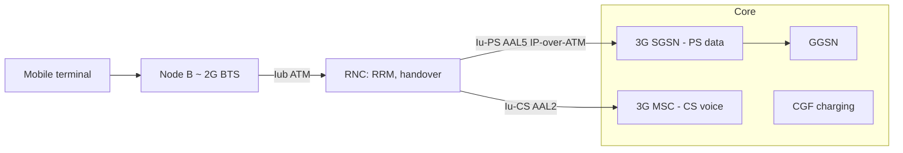

# M42: 3G Network and Security

**Source:** https://www.youtube.com/watch?v=wdT6MOpPhcs
**Instructor / expert:** Dr Lal Chand, Department of Computer Engineering, Punjabi University, Patiala
**Course coordinator:** Dr Maninder Singh, Professor and Dean of Academic Affairs, Thapar University, Patiala

### Learning objectives

- Place 3G in the ITU **IMT-2000** story (spectrum, pre-commercial and commercial launches, India’s MTNL/BSNL path, and the GPRS → EDGE transition).
- State what 3G is: third-generation mobile telecommunications meeting **IMT-2000**, with at least **200 kbps** and later 3.5G / 3.75G broadband rates.
- List 3G capabilities, applications, and services (mobile Internet, HTML vs plain-text email, SMS/MMS/IM plus presence).
- Sketch 3G architecture: **RAN** (Node B, RNC) and **core** (packet domain SGSN/GGSN, circuit domain MSC, CGF) over **ATM** **Iu/Iub/Iur** with AAL2 voice and AAL5 data.
- Recall 3G security: CIA, KASUMI vs A5/1, IMSI/TMSI and false-base-station issues, and the **ETSI TS 121 133** threat classes.

### Core concepts

#### History of 3G

3G is the result of ITU research and development from the **early 1980s**. Specifications and standards were developed over **15 years** and published as **IMT-2000**. Spectrum between **400 MHz and 3 GHz** was allocated for 3G.

Launches taught:

| Event | Who / where | Notes |
|-------|-------------|--------|
| First pre-commercial 3G | **NTT DoCoMo**, Japan, **1998** | Branded **FOMA** |
| First European pre-commercial UMTS | **Manx Telecom**, **Isle of Man** | UMTS |
| First commercial network “live” | **SK Telecom**, South Korea | **CDMA2000 1x EV-DO** |
| First commercial United States 3G | **Monet Mobile Networks** | CDMA2000 1x EV-DO |
| First southern-hemisphere pre-commercial demo | **m.Net Corporation**, **Adelaide**, South Australia, February 2002 | UMTS on **2100 MHz** |
| First 3G in Africa | **MTN**, 11 December 2008 | As named in the lecture |
| India | Government-owned **MTNL** in **Delhi**, later **Mumbai** | First 3G mobile provider in India |
| India (state operator) | **BSNL**, **22 February 2009**, **Chennai**, later nationwide | After MTNL |

Before 3G, a transition was made from **GPRS** to **EDGE / EGPRS (enhanced GPRS)** — described as GPRS “on steroids.” **MMS boomed** and mobile Internet took off. 3G is technically a **direct upgrade to EDGE** but runs on a **wholly different set of frequencies**; **entirely new infrastructure** must be deployed.

#### What 3G is

3G is the **third generation** of wireless mobile telecommunications technology: a set of standards for mobile devices, user services, and networks that comply with **International Mobile Telecommunications-2000 (IMT-2000)** from the **ITU**.

In user terms it means **faster Internet from a mobile device**: video calls while travelling, sending images, videos, and email as fast as from a desktop. Third-generation devices and services transform wireless communications into **online, real-time connectivity** and **immediate access to location-specified, on-demand information**. Mobile phones were becoming the preferred personal-communication device, creating the world’s largest consumer-electronics industry.

**Applications named:** wireless voice telephony, mobile Internet access, **fixed wireless** Internet access, **video calls**, and **mobile TV**.

3G is framed as an evolution of **GSM** standards. 3G networks support an information transfer rate of **at least 200 kbps**. Later releases, often denoted **3.5G** and **3.75G**, provide mobile broadband of **several Mbit/s** to smartphones and laptop modems.

Beyond 3G, the lecture predicted a landscape of technologies offering **seamless mobility** with cellular networks. **4G** would enable broadband wireless at home, office, and on the move, making web, Internet, multimedia, and entertainment services available to mobile users.

#### Capabilities, applications, and services

**Capabilities:** high-speed data; **symmetrical and asymmetrical** data; improved voice quality; greater capacity; **multiple simultaneous services**; **global roaming**; improved security; service flexibility.

**Applications listed:** wireless Internet; **audio on demand**; electronic postcards; video conferencing; **secure mobile-commerce** transactions; traffic and travelling information; **location-specified 3G services**.

**Services in general:** wide-bandwidth services such as enhanced communication (messaging, email, video, web browsing) and **location-specific information** (stores, restaurants, gas stations, free parking nearby). Business users get **direct access to company networks** while travelling. From a marketing view, **identifying, designing, and pricing** these services is the core 3G marketing task.

**Mobile Internet.** The aim is to **merge cellular networks and the Internet** so handhelds (phones, PDAs) reach all Internet services. 2G was mainly **voice-centric with low data capacity**; **2.5G and 3G** raise speeds. In 3G, data speed **depends on how many users access the network at the same time**.

**Email.** Rated the **number-one preferred mobile service in Sweden in 2001**, followed by banking and encyclopedia use. Categories: **web-style HTML email** (more flexibility of format and appearance) vs **plain-text** letter-style messages. Email is cheap, easy, and asynchronous, but **spam / unsolicited messages** may slow mobile adoption. The lecture also cited **BBC News 2003** on the **first mobile virus**, as a reason users might avoid mobile email.

**Messaging.** **SMS** and **MMS** were expected to be the most utilized future mobile service, with users stepping from simple text to pictures and video. 3G makes bandwidth-hungry video possible, but **cultural differences** matter: Europe had not adopted MMS widely (pricing, complexity); **Asians** had, on average **20–30 MMS/month** vs **1–2** for a typical European user. **Instant messaging (IM)** is popular especially among youngsters: near-real-time text, HTML, pictures, songs, video, or other files, **combined with a presence service** so users see who is available and reachable.

#### 3G architecture

A 3G wireless network consists of a **radio access network (RAN)** and a **core network**.

**Core network:**

- **Packet-switched domain:** **3G SGSN** and **GGSN**, providing the **same functionality as in GPRS**.
- **Circuit-switched domain:** **3G MSC** for switching voice calls.
- **Charging** for services and access through the **Charging Gateway Function (CGF)**, also part of the core.

RAN functionality is **independent** of the core. The access network gives **core-technology-independent** access for mobile terminals to different core networks and services. **Either** core domain can access any appropriate RAN service — e.g. a **speech radio access bearer from the packet-switched domain**.

**RAN elements:**

- **Node B** — comparable to the **base transceiver station (BTS)** in 2G.
- **Radio Network Controller (RNC)** — replaces the **base station controller (BSC)**; provides **radio resource management**, **handover control**, and support for connections to **both CS and PS domains**.

Interconnection inside the RAN and between RAN and core uses **Iu, Iub, and Iur** interfaces based on **ATM** as layer-2 switching. Data services run from the terminal **over IP**, which uses ATM as a reliable transport with **QoS**. **Voice is embedded into ATM** from the edge (**Node B**) and transported over ATM out of the RNC.

The **Iu** interface is split into **circuit-switched and packet-switched** parts. Iu is ATM-based: voice on virtual circuits using **AAL2**; IP over ATM for data using **AAL5**. These traffic types are switched independently to **3G SGSN** (data) or **3G MSC** (voice).

#### Effect of 4G on 3G (India-focused)

In the Indian market, 4G (especially the launch of **Reliance Jio**, called the largest investment in Indian history) was the hot topic. Operators had invested significantly in **3G network and spectrum from 2010–2015**. **Slow 3G uptake** meant much of that investment was **not yet recovered**. Some operators consider **shutting 3G** to simplify architecture — happening in countries where 3G had run for **almost 15 years**. Developing countries such as **Indonesia and Thailand** still focused on 3G even after launching 4G, looking at **slow migration**. India was in a similar stage until 2015: **five years after launch, 3G penetration was less than 10%**. A key reason: **smartphones and 3G data pricing were both expensive**. Figures given: **300 million** Internet users, **180 million** with smartphones, but only **90 million** bought 3G plans.

#### Network security (general, then 3G)

Network security is the **policies and practices** to prevent and monitor **unauthorized access, misuse, modification, or denial** of a computer network and network-accessible resources. Access is authorized and controlled by a **network administrator**. Users choose or are assigned an **ID and password** (or other authenticators) within their authority. It covers public and private networks used by business, government, and individuals. The most common simple protection is a **unique name and corresponding password**.

**Three elements (CIA):**

| Element | Meaning taught |
|---------|----------------|
| **Confidentiality** | Prevent unauthorized **disclosure** of information (including information about resources) to third parties |
| **Integrity** | Prevent unauthorized **modification** of resources and maintain the status quo (system resources, information, personnel); alteration may be for personal gain or revenge |
| **Availability** | Prevent unauthorized **withholding** of resources from those who need them when they need them |

Communication infrastructure is vital and can be targeted to steal sensitive information. The lecture listed contemporary exposures: vulnerabilities exploited in **government surveillance of mobile devices**, **flaws in authentication protocols** that make it easy to pierce **Wi-Fi** networks, and **malware** used to control VIP communications from a PC.

**3G-specific security claims.** 3G offers **greater security**, allowing **mutual authentication between terminals and networks**. As 3G grows, the mobile plays a role similar to a computer: attackers can penetrate mobiles as they do PCs, and can **spy on movements, listen to calls, read messages, and access private data**. The generation is described as bringing a **vast number of vulnerabilities** — a “heaven for hackers and crackers.” Few consumers were aware of 3G threats. Each operator would need to spend **5 to 10% of its gain** securing 3G. New security solutions are needed at **service-provider and handset-manufacturer** levels. 3G makes the mobile network and bandwidth **equivalent to a computer network**, opening chances for attacks through mobile networks.

**Cryptography taught:** 3G uses the **KASUMI block cipher** instead of the older **A5/1 stream cipher**, but **several serious weaknesses** have also been identified in KASUMI. Increasing connectivity **grows security exposure** that is harder to manage.

**Main 3G problems listed:**

- **IMSI is sent in clear text** when allocating **TMSI**.
- Transmission of IMSI is **not protected**; **IMSI is not a security feature**.
- A user can be **enticed to camp on a false base station (BS)**; once on the false BS radio channels, the user is **out of reach of the paging signals of the serving network (SN)**.
- **Hijacking outgoing/incoming calls** is possible in networks with **encryption disabled**: the intruder poses as a **man-in-the-middle** and **drops the user once the call is set up**.

#### ETSI TS 121 133 threat classification

**Unauthorized access to sensitive data (violation of confidentiality):**

- **Eavesdropping** — intercept messages without detection.
- **Masquerading** — fool an authorized user into believing the intruder is the legitimate system (to obtain confidential information), or fool a legitimate system into believing the intruder is an authorized user (to obtain service or confidential information).
- **Traffic analysis** — observe **time, rate, length, source, and destination** of messages to determine a user’s **location** or whether an important **business transaction** is taking place.
- **Browsing** — search data storage for sensitive information.
- **Leakage** — obtain sensitive information by exploiting processes that have **legitimate access** to the data.
- **Inference** — observe a system’s **reaction** to a query or signal; e.g. actively start sessions and then learn from observation of associated radio-interface messages.

**Unauthorized manipulation of sensitive data (violation of integrity):**

- **Manipulation of messages** — messages may be deliberately **modified, inserted, replayed, or deleted**.

**Disturbing or misusing network services (denial of service or reduced availability):**

- **Intervention** — prevent an authorized user from using a service by **jamming** the user’s traffic, signalling, or control data.
- **Resource exhaustion** — prevent use by **overloading** the service.
- **Misuse of privileges** — a user or serving network exploits privileges to obtain unauthorized services or information.
- **Abuse of services** — abuse a special service or facility to gain advantage or **disrupt** the network.

**Repudiation** — a user or network **denies actions** that have taken place.

**Unauthorized access to services** — intruders access services by **masquerading** as users or network entities; users or network entities get unauthorized access by **misusing their access rights**.

### Key terms

| Term | Meaning in this lecture |
|------|-------------------------|
| IMT-2000 | ITU name for 3G technical specifications |
| EDGE / EGPRS | Enhanced GPRS step before 3G; new 3G frequencies still need new infrastructure |
| RAN / Node B / RNC | Radio access network; Node B ≈ 2G BTS; RNC ≈ BSC (RRM, handover) |
| SGSN / GGSN / MSC / CGF | Packet core (as in GPRS), circuit MSC for voice, charging gateway |
| Iu / Iub / Iur | ATM RAN interfaces; Iu split CS (AAL2 voice) and PS (AAL5 data) |
| KASUMI | 3G block cipher replacing A5/1; still taught as having serious weaknesses |
| IMSI / TMSI | Subscriber identity; IMSI sent in clear when assigning TMSI |
| False BS | Rogue base station that camps the user away from legitimate paging |
| ETSI TS 121 133 | Specification used to classify 3G confidentiality, integrity, DoS, repudiation, and service-access threats |

### Lecture takeaways

- 3G is IMT-2000: ≥200 kbps (later several Mbit/s), new spectrum and infrastructure, not just a software bump from EDGE.
- The architecture splits RAN (Node B + RNC) from a dual CS/PS core, with ATM AAL2/AAL5 on Iu.
- User-facing 3G is mobile Internet, email (spam/virus fears), SMS/MMS/IM+presence, and location services — with sharp regional MMS uptake differences.
- Mutual authentication is an improvement over earlier generations, but IMSI exposure, false base stations, optional encryption, and KASUMI weaknesses remain.
- ETSI TS 121 133 organises 3G threats around CIA plus repudiation and unauthorized service access.
