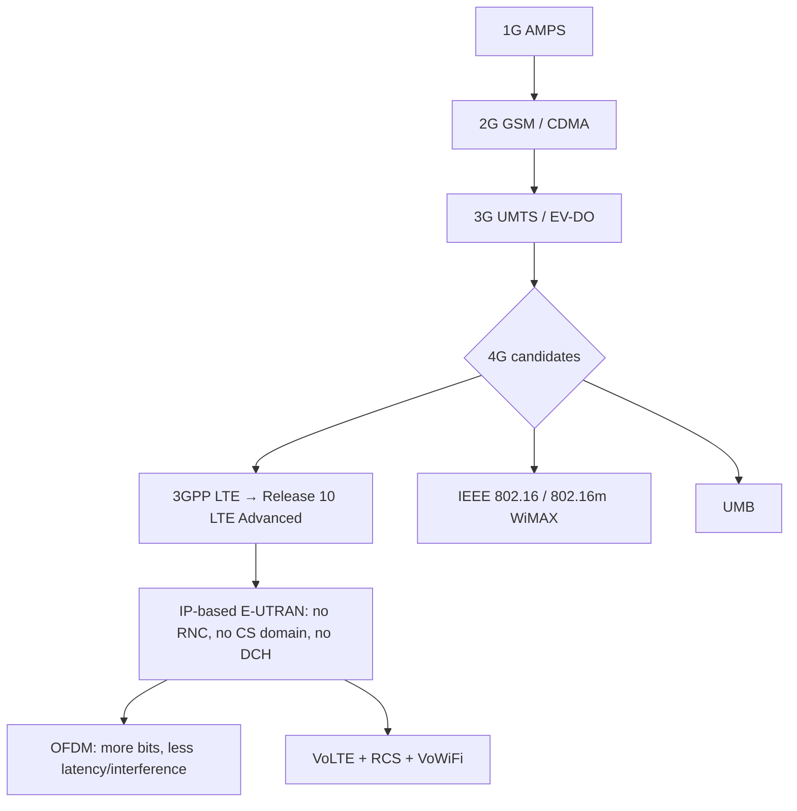

# M43: 4G LTE

**Source:** https://www.youtube.com/watch?v=UGQrMVqHCMQ
**Instructor / expert:** Dr Lal Chand, Department of Computer Engineering, Punjabi University, Patiala
**Course coordinator:** Dr Maninder Singh, Professor and Dean of Academic Affairs, Thapar University, Patiala

### Learning objectives

- Define **LTE (Long Term Evolution)** as the 3GPP 4G standard on the GSM → UMTS path, aimed at ~10× 3G speeds via new DSP and modulation, and an **IP-based** architecture with lower latency.
- Place LTE among competing 4G candidates (**UMB**, **IEEE 802.16 / WiMAX**, **802.16m / WiMAX Advanced**) and **LTE Advanced (Release 10)**.
- Separate marketing “4G” (**HSPA**) from **4G LTE**, and state OFDM, peak-rate, and VoLTE/RCS benefits as taught.
- List LTE technical objectives (throughput, latency, simplified **E-UTRAN**, mobility) and the two resources required: a capable **network** and a capable **device**.
- Recall the lecture’s LTE security framing: confidentiality and integrity, plus research goals for comparing LTE cryptographic algorithms.

### Core concepts

**LTE** stands for **Long Term Evolution**. It applies to **improving wireless broadband speeds** to meet increasing demand. LTE is a **4G wireless communications standard** developed by the **3rd Generation Partnership Project (3GPP)**. Engineers named it Long Term Evolution because it is the next step from **GSM (2G)** to **UMTS (Universal Mobile Telecommunications Service)** — the **3G technologies based on GSM**.

The goal of LTE was to **increase capacity and speed** of wireless data networks using new **DSP (digital signal processing)** techniques and **modulations**. It is designed to provide up to **10× the speeds of 3G** for smartphones, tablets, notebooks, and wireless hotspots.

A further goal was **redesign and simplification of the network architecture** to an **IP-based system** with **significantly reduced transfer latency** compared with 3G.

#### Evolution toward 4G LTE

| Year / step | What the lecture placed there |
|-------------|-------------------------------|
| 1973 | First call by engineer **Martin Cooper** from a Motorola mobile phone |
| 1987 | Cultural image: Michael Douglas in *Wall Street* on a mobile from the beach |
| 1992 | First smartphone **Simon** — functions beyond voice, ahead of the network’s ability to handle it |
| 1G | **AMPS — Advanced Mobile Phone System** |
| 2G | **GSM** and **CDMA** |
| 3G | **UMTS** and **EV-DO** |
| 4G | **LTE** from 3GPP, and **IEEE 802.16m** |

**IEEE 802.16m** is the 4G candidate also known as **WirelessMAN-Advanced** or **WiMAX 2**.

LTE progresses through **releases**. The latest release that **qualifies as 4G** in the lecture is **Release 10**, often called **LTE Advanced**.

4G LTE is said to enable advanced technologies in **transportation, healthcare, small business, enterprise, and education**. Example: **Intuit GoPayment** — street vendors, farmer markets, and food trucks attach a **small card reader** to a smartphone or tablet so payments are quick. With large-scale **VoLTE** and **LTE Advanced** on the horizon, the instructor asked what the next forty years might hold.

#### LTE technical objectives

Taught targets:

- **User throughput** (downlink and uplink, in MHz as labelled on the slide)
- **Downlink capacity** and **uplink capacity**
- **Latency:** user-plane transition time **less than 5 ms** in ideal conditions; **100 ms** control-plane; **fast connection setup**
- **Simplified architecture:** simpler **E-UTRAN**; **no RNC**; **no CS (circuit-switched) domain**; **no DCH**
- **Mobility:** optimized for **low speed** but supporting **120 km/h**

#### 4G vs LTE vs “4G without LTE”

4G has **several competing standards**, including **Ultra Mobile Broadband (UMB)** and **WiMAX (IEEE 802.16)**. 4G technologies are designed to provide **IP-based voice, data, and multimedia streaming** at speeds of **at least megabits per second** and up to **1 Gbit/s**.

US operators named: **Verizon** and **AT&T** launching **4G LTE**; **Sprint** utilizing a **4G WiMAX** network. Most newer **Android** smartphones were 4G LTE capable; **iPhone 5** and **iPad 3** were expected to have built-in 4G LTE in the **second half of 2012**.

**Speed:** the difference versus “slow 3G” is **faster**. Most 4G and “true 4G” networks have **upload and download speeds that are almost identical**; **LTE is described as the fastest connection available** for wireless networks.

**Two resources required for 4G LTE:**

1. A **network** that can support the necessary speeds.
2. A **device** able to connect to that network and download at high enough speed.

A phone with 4G LTE inside does **not** guarantee those speeds — compared to buying a car that can do 200 mph but driving on a **55 mph** freeway.

**Is LTE the same as 4G?** **No.** There is 4G, and there is **4G LTE**. 4G is the fourth generation after 3G — faster, greater capacity. **4G LTE** is called the **purest form of 4G**. If a cellular provider describes a “4G” network **without mentioning LTE**, they are probably talking about a **High Speed Packet Access (HSPA)** network: a **faster version of 3G GSM**, still faster than 3G but **not as fast as LTE**.

#### Advantages of LTE; devices; generations

**Advantages:** low latency; high network throughput; increased data-transfer speed; more **cost-effectiveness**; improvements over 3G.

**Devices covered:** mobile phones, laptops, cameras, camcorders. LTE is said to assure **interoperability with older wireless technologies**: **GSM, WCDMA, HSPA, CDMA, TD-SCDMA**. LTE is expected to **ensure the success of mobile Internet**.

**Why 4G is faster than 3G:** **orthogonal frequency-division multiplexing (OFDM)** — a technique for **squeezing more data onto the same amount of radio frequency**, also **reducing latency and interference**. 4G uses **different frequencies** than 3G, so the handset needs a **modem that supports those frequencies**. 4G is described as **10 times faster than then-current 3G**, so many tasks could be done through smartphones without separate broadband.

**LTE peak rates taught:** potential for **100 Mbit/s downstream** and **30 Mbit/s upstream**, plus reduced latency, **scalable bandwidth capacity**, and **backwards compatibility with existing GSM and UMTS**.

**VoLTE (Voice over LTE):** enables wireless carriers to use **IP-based 4G LTE data networks for voice calls** — WhatsApp-like call, video call, conferencing, etc.

**5G (brief forward look in this lecture):** fifth generation, aimed at requirements **beyond 2020**; much faster than 4G, **20 GB per second** in the wording used, fast enough to download HD movies in seconds; expected to drive **Internet of Things**, **smart cities**, **Digital India**, and a 2020 vision associated with **A.P.J. Abdul Kalam**.

#### Disadvantages of 4G LTE

- Advanced data rates require customers to **purchase new equipment**.
- 4G was **only presently accessible in certain cities**.
- Needs **complex hardware**.

#### High-definition voice, RCS, and VoLTE consumer benefits

The most noticeable VoLTE benefit is **improved voice quality**. Traditional voice networks transmit calls using an **8 kbps codec**. **Verizon** is described as using a **13 kbps codec** with more modern compression.

**Rich Communication Services (RCS),** enabled by VoLTE, is a **standards-based** set: **video calling, file transfer, real-time language translation, video voicemail, and instant messaging**. Many of these already exist as **over-the-top (OTT)** apps (**FaceTime**, **Skype**, **Google Translate**). VoLTE’s benefit is launching them **from the phone’s native dialer**.

**Faster call setup** than older **circuit-switched 2G**.

**Improved battery life versus other VoIP apps.** A **Signals Research Group** report is cited: VoLTE offers much improved battery life compared with OTT VoIP such as Skype; **consistently higher call quality** than circuit-switched voice and OTT apps; and **far lower network consumption than a Skype voice call**, hence longer smartphone battery life.

**Integration of VoLTE with Voice over Wi-Fi.** Better integration between cellular voice and Wi-Fi calling matters as operators use Wi-Fi for some voice and data. Improving the transition between a cellular call on **licensed** spectrum and a Wi-Fi call on **unlicensed** spectrum helps **indoor coverage** where licensed spectrum is limited. Call setup for Voice over Wi-Fi is the **same as for VoLTE**, so once VoLTE is fully deployed it is easier to offer VoWiFi where licensed spectrum is **weak or unavailable**.

**True device interoperability.** Once VoLTE is interoperable among carrier networks, the **CDMA/GSM divide** among the four major US operators would **no longer be an issue**. A consumer might buy **one device** that operates on any wireless network if it supports **enough LTE bands** — voice and data all on the same 4G LTE technology.

#### Security of 4G LTE

“LTE security” is presented as a **defence mechanism versus Internet threats** from multiple attack types.

- **Confidentiality:** the **right people** can get the **right data**.
- **Integrity:** the message from party A to party B **did not change**.

These are the essential points for Next-Generation mobile security. More powerful security is to be achieved by:

- Discovering the **main factors used to compare LTE cryptographic algorithms**
- Finding **trends and weaknesses of each** LTE cryptographic algorithm
- **Evaluating which algorithm provides higher security**
- **Proposing an algorithm from the existing LTE set** that may enhance security of existing LTE cryptography

### Key terms

| Term | Meaning in this lecture |
|------|-------------------------|
| LTE | Long Term Evolution; 3GPP 4G on the GSM/UMTS path |
| LTE Advanced | 3GPP **Release 10**, the release taught as qualifying as 4G |
| E-UTRAN | Simplified LTE radio architecture: no RNC, no CS domain, no DCH |
| HSPA | High Speed Packet Access — “4G” branding without LTE; faster 3G GSM, slower than LTE |
| OFDM | Orthogonal frequency-division multiplexing; why 4G is faster |
| VoLTE | Voice over LTE: IP voice on the LTE data network |
| RCS | Rich Communication Services launched from the native dialer |
| WiMAX / 802.16m | Competing 4G path (WirelessMAN-Advanced / WiMAX 2) |
| UMB | Ultra Mobile Broadband, another competing 4G standard |

### Lecture takeaways

- LTE is 3GPP’s IP redesign of the GSM/UMTS family: DSP/OFDM speed, simpler E-UTRAN, sub-5 ms user-plane latency in the ideal case.
- Marketing “4G” may be HSPA; **4G LTE** is taught as the pure 4G form, still needing both network and device — and the right spectrum.
- VoLTE is not only HD codecs (8 vs 13 kbps) but RCS, faster setup, better battery than Skype-class OTT, and a path to VoWiFi and cross-carrier handset interoperability.
- Security is framed as CIA plus a research programme over LTE cryptographic algorithms, not a finished protocol walkthrough in this lecture.
