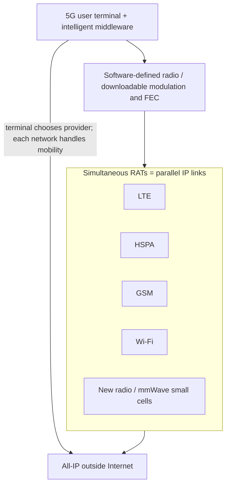

# M44: 5G

**Source:** https://www.youtube.com/watch?v=vtgDWzFM8Uo
**Instructor / expert:** Dr Lal Chand, Department of Computer Engineering, Punjabi University, Patiala
**Course coordinator:** Dr Maninder Singh, Professor and Dean of Academic Affairs, Thapar University, Patiala

### Learning objectives

- Define **5G** as fifth-generation mobile/wireless broadband as the lecture presented it, including the **IEEE 802.11ac** claim and the generation path from 1G through 4G LTE.
- State **NGMN Alliance** rate, connection-count, spectral-efficiency, coverage, signalling, and **~1 ms latency** requirements.
- Describe the taught **all-IP 5G architecture**: user terminal plus multiple simultaneous **radio access technologies (RATs)**, software-defined radios, and terminal-side choice via middleware.
- Contrast 5G with 4G on speed, capacity (~1000×), latency, millimetre-wave vs existing bands, MIMO, and small cells.
- List benefits, device/network requirements, applications (IPv6, global coverage), disadvantages, and the “nanocore / 6G” closing remarks — all as taught.

### Core concepts

**5G** is **fifth-generation mobile networks** or **fifth-generation wireless systems**. The lecture describes it as upcoming fifth-generation mobile-network technology and as coming **wireless broadband based on the IEEE 802.11ac standard**. It is called a new mobile revolution: worldwide cellular phones, PDA-like devices, “the whole office on your fingertips.” 5G is credited with **extraordinary data capabilities**, tying together **unrestricted call volumes** and **infinite data broadcast** within the latest mobile operating systems. A dashboard-style figure compared **3G, 4G, and 5G** speeds.

#### Generations as told in this lecture

The **G** stands for **Generation**.

- **1G** — early **1990s**, voice.
- **2G** — people could **send text messages** between cellular devices (industry-driven).
- **3G** — calls, texts, and **Internet browsing**.
- **4G** — enhanced 3G capabilities: browse, text, call, and **download/upload large video files**.
- After 4G, companies added **LTE (Long Term Evolution)**. With 4G connectivity, **LTE became the fastest and most consistent variety of 4G** compared with competing technologies like **WiMAX**. WiMAX and LTE achieved **similar outcomes**, but a **single standard** was important; **LTE makes 4G faster**.

**5G vs 4G (speed/coverage).** 5G will provide **better speeds and coverage** than 4G. The lecture states 5G **works with a 5 GHz signal** and is set to offer speeds of up to **1 Gbit/s for tens of connections**, or **tens of Mbit/s for tens of thousands of connections**. 5G **builds on 4G LTE**: still texts, calls, and web, but with speed that makes **Ultra HD and 3D video** download/upload easy.

#### NGMN Alliance requirements

The **Next Generation Mobile Networks Alliance** defines requirements a 5G standard should fulfil:

- Data rates of **tens of Mbit/s for tens of thousands of users**
- **100 Mbit/s** for **metropolitan areas**
- **1 Gbit/s simultaneously** to many workers on the **same office floor**
- **Several hundreds of thousands of simultaneous connections** for a **massive wireless sensor network**
- **Spectral efficiency** significantly enhanced compared with 4G
- **Coverage** improved
- **Signalling efficiency** enhanced
- **1 millisecond latency** (or less — “virtually zero latency”); **smart communication**; latency reduced significantly compared with LTE

#### Design of 5G mobile network architecture

The proposed model is an **all-IP** architecture for **wireless and mobile-network interoperability**.

The system consists of:

- A **user terminal** with a **crucial role**
- A number of **independent, autonomous radio access technologies (RATs)**

Within each terminal, **each RAT is seen as an IP link** to the outside Internet. There must be a **different radio interface for each RAT**. Example: access to **four different RATs** requires **four different access-specific interfaces**, **all active at the same time**, for the architecture to be functional.

#### Is 5G really faster than 4G?

Yes, “much faster.” **4G LTE transfer speeds top out at about 1 Gbit/s** — about an **hour** to download a short HD movie in **perfect conditions**. People rarely see 4G’s maximum because the signal is disrupted by **buildings, microwaves, other Wi-Fi signals**, and more.

**5G** is said to increase download speeds up to **10 Gbit/s** — a **full HD movie in seconds** — and to **reduce latency significantly**. It is described as a path to **thousands of connected devices** in homes and offices.

#### Concepts for 5G mobile networks

- 5G terminals will have **software-defined radios** and **modulation schemes**, plus **new error-control schemes that can be downloaded from the Internet**.
- Development is seen as **toward the user terminal** as the focus of 5G.
- Terminals access **different wireless technologies at the same time** and should **combine different flows from different technologies**.
- **Vertical handovers should be avoided** — not feasible when there are many technologies, operators, and service providers.
- **Each network is responsible for handling user mobility**; the **terminal makes the final choice** among wireless/mobile access-network providers for a given service, based on **open intelligent middleware** in the mobile phone.
- Again: main user terminal plus independent autonomous RATs, each an **IP link** to the Internet.

#### How cellular radio works (baseline) and 5G spectrum

A large group of global telecoms is working on **worldwide 5G standards**. Experts expect **compatibility with 3G and 4G**, but **most standards are not yet solidified**.

In the most basic form, cell phones are **two-way radios**. On a call, the phone converts voice to an **electrical signal** and transmits it to the nearest **cell site** using **radio waves**. The cell site bounces the wave through a **network of cells** to the friend’s phone. The same happens for photos and video.

When a new mobile technology comes along, it is assigned a **higher radio frequency**. **4G occupied frequency bands up to 20 MHz**; **5G will likely use the frequency band up to 6 GHz**. New technologies occupy higher frequencies because those bands typically **are not in use** and **move information faster**. The problem: **higher-frequency signals do not travel as far**. **MIMO (multiple-input multiple-output)** will probably be used to **boost signals** wherever 5G is offered.

#### Industry / investment framing

5G is an opportunity for a **more sustainable operator investment model**. Each generation unlocks value in unanticipated ways: **SMS** was expected to have negligible impact and became huge; **video calling** was expected to be the next big thing and was **slow to gain traction**. 5G is a **paradigm shift** for all mobile-ecosystem stakeholders. **Regulators** can create healthier environments that stimulate investment. Some **3G/4G business cases may not be the right ones for 5G**.

#### 5G vs 4G (timeline and speed claims)

4G is widely deployed and still evolving; focus switches to 5G, still **several years from deployment** at lecture time, but the “buzz word.” 5G follows global adoption of **4G LTE**. Since **2012**, a new telecommunication standard is introduced **approximately every 10 years**:

| Generation | Year given |
|------------|------------|
| 2G | 1991 |
| 3G | 2001 |
| 4G | 2012 |
| 5G | expected **2020 or 2022** |

5G **does not have a defined, universally agreed-upon standard**, though likely technologies are emerging. **4G connections** offer average speeds of **25–40 Mbps at home**; **5G** is likely **in excess of 500 Mbps**. Many entities believe 5G will offer **1 Gbit/s mobile to 10 simultaneous connections**. Chinese vendor **Huawei** expects 5G to be at least **100 times faster** than the fastest 4G LTE then available (a 4G+ speed test vs 5G “up to 100 times faster”).

#### 5G technologies and frequencies

**4G in the UK** currently uses the LTE standard on **800 MHz, 1800 MHz, and 2.6 GHz**. The **1800 MHz** band was **repurposed by EE and Three** for LTE; other frequencies were made available to all networks in the **2012 4G spectrum auction**.

**Huawei** is said to believe 5G will combine **new radio access technologies (RAT)** with **existing** wireless technologies: **LTE, HSPA, GSM, and Wi-Fi**.

**Samsung** and researchers at **New York University** discussed **millimetre-wave** frequencies. Millimetre-wave frequencies are taught as lying between **3 and 300 GHz** (ASR “MHz” corrected: the lecture says they are **much higher** than existing network standards). Benefit: they are **scarcely used** by other broadcast technologies such as **AM/FM radio and TV**, so they have potential for **greater speeds and more data**. Downside: millimetre waves **do not pass through solid objects well** and are **difficult to sustain over long distances**. An mmWave approach would use **lots of smaller base stations**, whereas current networks combine **large base stations** and smaller antennas in dense areas. **All 5G standards** are expected to use this small-cell approach for **maximum capacity and minimal latency**.

There is **no universal 5G standard**; launch might see a **variety of standards under the 5G banner**, similar to how both **LTE** and **WiMAX** (and an “American LTE” used by **CDMA** networks) operated under **4G**.

#### Benefits of 5G

For **businesses**: additional **capacity and speed** for greater mobile working; employees can **video-conference from any location**.

For **consumers**: e.g. **download a film to a smartphone in under a second**.

**Capacity:** current 4G contracts promise speeds up to **150 Mbit/s** on the go but often leave users with **inclusive data allowances of less than 5 GB** (higher allowances cost extra because of limited capacity). 5G is expected to offer **upwards of 1,000 times the capacity of 4G**, so networks could offer **greater data allowances**.

**Latency:** defined as time for data transfer (buffering a video, loading a page). As 4G user counts rose, so did latency (example **4G speed test: 49 ms**). **Huawei** is targeting latency of **less than 1 ms**, versus **in excess of 50 ms on 4G** — video starts when you hit play. Reduced latency also benefits **video games, automated equipment, IoT, and augmented reality** (Oculus Rift, Gear VR, Microsoft HoloLens) by removing delays.

**Coverage:** depending on the standard, 5G may expand into **hard-to-reach areas**. 4G rollout in the UK still left weak spots. 5G networks could reach further by deploying **multiple smaller antennas** that emit in **multiple directions** and even **bounce off solid surfaces**.

#### Requirements of 5G (as listed)

- Better **coverage area** and **high data rate at the cell edge**
- **Low battery consumption** / longer battery life
- Availability of **multiple data-transfer paths**
- Around **1 Gbit/s** data rate easily possible
- **Security is more**
- Good **energy efficiency** and **spectral efficiency**
- **Worldwide coverage**
- About **90% reduction in network energy usage**

Because of these advantages, fifth-generation wireless is called **very much essential**.

#### Applications

- Network availability **everywhere**; use computers and mobiles **anywhere, anytime**
- Makes the world a **real Wi-Fi zone**
- **Mobile IP address** assigned depending on the **connected network and geographical position**, using **IPv6**
- **Unified global standards**
- Receive **radio signals even at higher altitude**

#### Disadvantages (as taught)

- Research is **still going on** / under process
- **Speed claims seem difficult to achieve** because of other devices and “incompetent technology” in other parts of the world
- **Many old devices must be replaced** (not 5G-capable), increasing cost
- **Developing infrastructure** also increases cost
- **Security and privacy issues yet to be solved**

#### Future span

Future enhancement of **“nanocore”** will be incredible as it combines with **artificial intelligence**: control an intelligent robot from a mobile; a mobile that **automatically types what the brain thinks**. **Google Hot Trends** rated the term **6G** as the **17th most searched** word. The lecture also mentioned an **“iPod 6G”** in seven colours with an aluminium body (as spoken). Close: “that’s all for 5G technology.”

### Key terms

| Term | Meaning in this lecture |
|------|-------------------------|
| 5G | Fifth-generation mobile/wireless; lecture also ties it to IEEE 802.11ac and a 5 GHz signal |
| NGMN Alliance | Source of 5G rate, massive-IoT connection, spectral, coverage, and ~1 ms latency requirements |
| RAT | Radio access technology; each appears as an IP link; multiple active interfaces at once |
| MIMO | Multiple-input multiple-output, to boost shorter-range higher-frequency 5G signals |
| Millimetre wave | Very high frequencies (taught as 3–300 GHz): fast, little broadcast coexistence, poor through walls — hence small cells |
| LTE vs WiMAX | Competing 4G; LTE became the consistent standard 5G builds on |
| IPv6 | Addressing for mobile IP tied to network and geography in the 5G application vision |
| Nanocore | Speculative future 5G enhancement combined with AI |

### Lecture takeaways

- 5G is taught as all-IP, multi-RAT, terminal-centric: the phone keeps several radios up and chooses a provider; networks handle mobility; vertical handovers are to be avoided.
- NGMN targets tens of thousands of users, massive sensor connections, better spectral/signalling efficiency, and about **1 ms** latency.
- Speed/capacity claims in the lecture range from 500+ Mbps typical, 1–10 Gbit/s peaks, ~1000× 4G capacity, and Huawei’s “100× fastest LTE” / sub-1 ms latency — with the caveat that **no universal standard existed yet**.
- Higher bands (up to 6 GHz and mmWave) buy rate but lose range, so MIMO and dense small cells (including bounce-off-surfaces coverage) are part of the story.
- Benefits (IoT, AR, film-in-a-second, bigger data plans) sit beside unsolved security/privacy, device replacement cost, and unfinished research.
