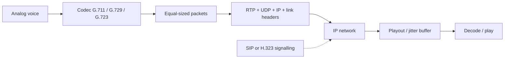
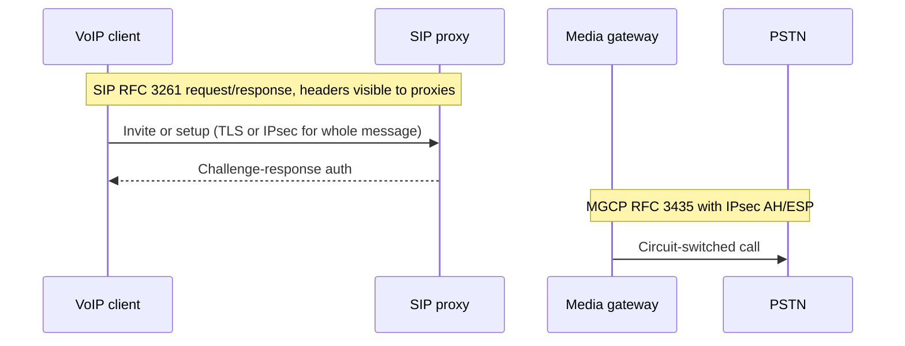

# M45: VoIP Protocols

**Source:** https://www.youtube.com/watch?v=-ArpkvGMndk
**Instructor / expert:** Dr Lal Chand, Department of Computer Engineering, Punjabi University, Patiala
**Course coordinator:** Dr Maninder Singh, Professor and Dean of Academic Affairs, Thapar University, Patiala

### Learning objectives

- Define **VoIP** as packetized digital voice/multimedia over IP instead of circuit-switched TDM, and explain why IP alone is a poor realtime transport.
- Place VoIP against the **OSI** layered model and name the three signalling/control protocols taught: **ITU-T H.323**, **IETF SIP**, and **MGCP**.
- Trace sender-to-receiver processing: codecs **G.711, G.729, G.723**, RTP/UDP/IP headers, playout buffer, and SIP/H.323 for call setup/teardown.
- List **QoS** factors: delay (source, receiver, network), jitter, packet loss, echo, and throughput.
- Recall VoIP **threat classes** (DoS, sniffing, eavesdropping, spoofing, toll fraud, SPIT) and the **defences and deployment options** the instructor listed — not attack recipes.

### Core concepts

**VoIP (Voice over Internet Protocol)** takes **analog audio** (as on a telephone) and turns it into **digital data** transmitted over the Internet. It is the methodology and group of technologies for **voice communications and multimedia sessions over IP networks**. Voice travels in **packets** using the Internet as the medium; **IP is used rather than traditional circuit transmission**.

Voice can be digitized; digitized voice can be sent in packets. In the past, communication through a **fixed circuit-switched network** dominated; recent years emphasize **data networks**, especially VoIP. The lecture says VoIP is defined in **ITU-T H.32x** recommendations and (as spoken) **RFC 2543** (ASR “2443”; original SIP). SIP is later given as **RFC 3261**.

#### Why VoIP, despite IP’s weaknesses

IP delivers packets carrying digitized voice, but **IP was not designed for realtime traffic** such as voice and video. IP is **connectionless**: no virtual connection is established before transmission. IP makes **no guarantees** of **reliability, flow control, error detection, or error correction**. Potential errors include **out-of-sequence packets** or **loss**. Voice needs a **guaranteed connection** and **reasonable delay**.

VoIP still succeeds **partly due to the high cost of traditional circuit-switched TDM**. VoIP uses a **packet-switched** network and makes the network **transparent to upper layers** involved in voice. Existing IP networks also allow **integration of voice and data**. To leverage connectionless IP, vendors developed **higher-layer protocols** to address guaranteed connection and transmission.

#### VoIP and the OSI model

VoIP follows a **layered model comparable to OSI**. Layering provides a framework and standard, making the system **manageable and flexible**. Each layer is relatively independent; changes in one layer should have **no or minimal impact** on others.

#### Signalling protocols

The two most generally used VoIP protocols are **ITU-T H.323** and **IETF SIP**. Both are **signalling protocols** that **discover, maintain, and terminate** a VoIP call. Additionally, **MGCP (Media Gateway Control Protocol)** provides signalling and management between **VoIP gateways** and traditional **PSTN (Public Switched Telephone Network)** gateways.

##### ITU-T H.323

A **comprehensive** ITU-T specification for **voice, video, and data** across a network. Sub-protocols taught:

| Sub-protocol | Role in this lecture |
|--------------|----------------------|
| **H.225** | Call control — **call setup and teardown** |
| **H.235** | **Protection framework** for H.323 and call setup; security measures: **authentication, integrity, privacy, some non-repudiation**; designed to work with H.245 and H.225 |
| **H.245** | **Media methods and parameter negotiation** (terminal capabilities) |
| **H.450** | **Supplementary services** (e.g. call hold, telephony features) |

Call setup is secured through **TLS**. Once established, call management starts so **encryption and media-channel data** can be negotiated.

H.323 uses **RTP (Real-time Transport Protocol)** or **RTCP (RTP Control Protocol)** as transport, riding on **UDP**. Encryption is performed **within the RTP packet** by third-party hardware or at the **network layer**.

Authentication under H.323 can be **symmetric encryption-based** or **subscription-based**. For symmetric encryption-based authentication, **previous contact is not required** because the protocol uses **Diffie–Hellman** to get a shared secret. Per **H.235**, subscription-based authentication **requires a previous shared secret**, in three variations:

1. **Password-based with symmetric encryption**
2. **Password-based with hashing**
3. **Certificate-based with signatures**

##### SIP — Session Initiation Protocol

A **text-based application-layer** protocol for **signalling and session management** in the packet telephone network. Defined in **RFC 3261**. SIP uses a **request–response** model. **Authentication and authorization** are handled either by a **lower-layer scheme** or **on a request-by-request basis** with a **challenge–response** mechanism.

SIP is **lightweight**; its **own security capabilities are very limited**. Requests and responses **cannot be end-to-end encrypted** because fields such as **request and routing** must be **visible to proxy servers** present in many architectures, so requests are **routed properly**. **Voice data is transmitted in clear text over UDP** (and related IP). Although SIP supports **S/MIME-based encryption** using digital certificates, **certain header fields** in requests and responses **cannot be encrypted**. SIP therefore **depends on transport-layer security mechanisms such as TLS or IPsec** for security of the **entire message**.

##### MGCP — Media Gateway Control Protocol

Published as **RFC 3435**. It expects MGCP messages to be carried over **secure IP connections** as in the **IPsec architecture (RFC 2401)**, using either the **IPsec Authentication Header (RFC 2402)** or **IPsec Encapsulating Security Payload (RFC 2406)**. This allows **connectionless integrity, origin authentication, and optional anti-replay protection** of messages between:

- the **media gateway** that converts **circuit-switched traffic to packet-based traffic**, and
- the **media gateway controller (MGC)** that **dictates service logic**.

#### Processing in a VoIP system

**Sender side**

1. Analog voice is converted to digital, **compressed**, and formatted using a voice **codec** such as **G.711, G.729, G.723**, etc.
2. Encoded voice is split into **equal-sized packets**.
3. Headers from different layers are attached: **RTP, UDP, and IP**, plus a **link-layer** header.
4. Packets are sent over the IP network to the destination.

**Receiver side:** depacketization and decoding. Throughout transmission, **time variation of packet delivery** (jitter) may occur. A **playout buffer** smooths playout; it introduces delay. Packets are queued for a stipulated time; packets that arrive **later than the playout deadline are discarded**.

**Signalling** uses **SIP** and **H.323** to set up new IP calls and to **close media streams** between clients.

#### Quality of service (QoS)

QoS measures the **degree of user satisfaction** — the network’s ability to provide services that satisfy customers. Higher satisfaction means higher QoS.

| Factor | Meaning taught |
|--------|----------------|
| **Delay** | Time from when one person speaks until the other hears the words. Three categories: **delay at the source**, **at the receiver**, and **network delay** |
| **Jitter** | **Variation in transmission delay**. IP does not guarantee delivery time; jitter harms voice quality |
| **Packet loss** | Packets lost, corrupted, or late. Late packets are discarded at the **jitter/playout buffer** or on **overflow** of playout or router buffers. Loss includes congestion loss plus late arrival. Retransmitting lost packets causes **more delay** and hurts QoS |
| **Echo** | Caller hears a **reflection of their own voice**. The far end may not notice. **Electrical echo** exists in **PSTN**; **acoustic echo** is the difficulty in **VoIP** |
| **Throughput** | Maximum number of bits received out of bits sent during an interval |

#### VoIP security — attack classes (as classified, not as recipes)

VoIP, like other applications, has weaknesses that protocol designers should address before universal deployment.

**Denial of service (DoS).** Flooding that reduces available IP addresses, DHCP, and other **router functions**, or **blocks a server**. A VoIP-based DoS **overloads a call-processing application with so many simultaneous requests that it cannot process them**, slowing the application and **denying service to authorized users**. DoS can be directed at **any network component**.

**Network sniffing.** Observing network **traffic patterns**. On a **shared medium**, a user or attacker can look at others’ traffic.

**Eavesdropping.** Collecting sensitive information to prepare a cyber attack or gain intelligence. In VoIP, monitoring **signalling or media contents** exchanged between users, or listening in order to plan further attacks. A vendor call-manager issue was cited (Internet Security Systems): ability to **listen in or forward calls** and gain unauthorized network access.

**Spoofing / caller-ID spoofing.** The offender **masquerades as a licensed VoIP user** and places a call; the display looks authentic. The user may be tricked into giving sensitive information — the **VoIP version of traditional phishing**.

**Toll fraud.** **Unauthorized access to VoIP services**, typically for **financial gain**; among the most critical attacks for providers. Recognized via **manipulated signalling messages** or **misconfiguration of VoIP parts including charging systems**. Simple **dial-plan / open test and remote-access lines** can be abused; after compromise, services can be **resold** with little cost to the attacker. Large-organization theft of service may go unnoticed while bills accumulate.

**SPIT — Spam over Internet Telephony.** Lower communication cost makes VoIP attractive to spammers versus PSTN. VoIP spam is **recorded, self-dialed** calls over IP. SPIT is **more severe than email spam** because of its **assaultive nature**, which requires a **real-time defence**. An offender may **inject a fake ID** into a call so the receiver trusts a known source and reveals **account numbers, SSN, or security-question answers**.

#### Security measures taught (defensive)

**Against DoS**

- **Monitoring and filtering** — maintain a list of **suspicious users** and deny them connections/sessions
- **Authentication** — attest user identity before forwarding messages
- **Stateless proxy** — lower risk of **memory-exhaustion DoS**; can also do authentication, third-party registration, and **filtering spam sources**
- **Server design** — hardware, memory, and network affiliation as the **first line of defence**

**Against eavesdropping**

- Use **proper hardware**; only **authorized** access to **wiring closets** / vulnerable network points
- **Port-based MAC-address security** (e.g. on a reception/courtesy phone)
- Regularly **scan** for devices running in **unauthorized mode**
- **Encryption** of VoIP traffic

**Against spoofing / masquerading**

- An **effective authentication module combined with encryption**

**Against toll fraud**

- Providers configure **powerful firewalls** and **protect ports**

**Against SPIT**

- **Blacklisting** of known source IP addresses
- Vendor tools to **flag suspicious callers**
- Receivers should **not disclose important information** to unknown callers

#### Configuration / deployment options

**USB VoIP phone adapters.** Use any **standard analog telephone** to place VoIP calls. They typically look like USB adapters with a **standard telephone port**. Once attached, the phone operates as if on the public utility.

**Softphones.** Software-controlled VoIP from a **PC with Internet**, using a **headset and sound card**. Providers often offer softphones **free** in exchange for using their service; users can reach dedicated VoIP phones at no extra cost.

**Dedicated VoIP phones.** Look like a regular telephone but connect to an **electronic network** instead of a telephone line. May be a phone plus a **base station** on the Internet, possibly on a **local wireless network**. Need a **provider and service setup**.

**Dedicated routers.** Connect **standard phones** to the Internet (router on **ADSL/cable modem**) and still act as an **IP router** for a PC. Providers configure them for a charge; they can work **independent of any PC or software**.

**Wireless compatibility.** Mobiles and smartphones can use VoIP if a wireless LAN is installed; **applicable security such as a firewall or encryption** is needed.

**Issues of wireless VoIP** (mainly corporate LANs, not homes): **scalability** problems for enterprises; **QoS poorer** than wired networks; **higher setup and maintenance cost** because of many access points in a limited area; **higher security threat**.

#### Limitations of VoIP

Popularity depends on key issues — some because **IP was designed for data packets**, some because vendors do not meet standards:

**Quality of service.** IP design does not guarantee **realtime** voice. IP was designed for data that gets **error-free, ordered delivery**. Acceptability depends on delay **not exceeding a threshold**. **Prioritizing voice packets** can guarantee good voice quality.

**Interoperability.** PSTN signalling must be **interchanged** with VoIP signalling for VoIP to be common. Acceptable mechanisms named: **H.323, SIP, and MGCP**, each integrating **data, voice, and video over the same wire**.

**Security.** The backbone is the **Internet**, not a very secure medium: **interception of calls**, DoS, fraud. Security can use **tunnelling protocols such as Layer 2 Tunneling Protocol (L2TP)** and **encryption in SSL**, but **encryption is not widely available for VoIP**.

**Integration with PSTN.** VoIP works **in union with PSTN** so they appear as **one network**. A VoIP telephone number has an **IP address**; when a VoIP phone engages in a call, the **IP address is translated into the telephone number** and handed to the PSTN. Both are needed because **not everyone has switched to VoIP**.

**Scalability.** Lower cost and improving quality drive a high rate of VoIP users; the main obstacle is **scalability**.

The instructor noted that VoIP protocols would be discussed **in more detail in forthcoming lectures**.

### Key terms

| Term | Meaning in this lecture |
|------|-------------------------|
| VoIP | Packet voice/multimedia over IP instead of circuit TDM |
| H.323 | ITU-T umbrella (H.225, H.235, H.245, H.450) with RTP/RTCP over UDP and TLS setup |
| SIP | IETF RFC 3261 text request/response signalling; needs TLS/IPsec because proxies must see headers |
| MGCP | RFC 3435 gateway control; IPsec AH/ESP between media gateway and MGC |
| G.711 / G.729 / G.723 | Example voice codecs on the send path |
| Playout buffer | Receiver jitter buffer; late packets discarded |
| SPIT | Spam over Internet Telephony — real-time voice spam |
| Toll fraud | Unauthorized use of paid voice service, often via signalling or configuration abuse |
| PSTN | Public Switched Telephone Network; still required for number translation and non-VoIP users |

### Lecture takeaways

- VoIP wins on TDM cost and voice–data integration, but IP is connectionless and offers no realtime guarantees — hence codecs, RTP, jitter buffers, and signalling (H.323, SIP, MGCP).
- H.323 is a full ITU stack with H.235 authentication variants and Diffie–Hellman; SIP is lightweight and **cannot hide routing headers from proxies**, so TLS/IPsec carry the security burden; MGCP assumes IPsec to the PSTN gateway.
- QoS is delay, jitter, loss, echo (electrical vs acoustic), and throughput — not a single number.
- Threats taught are DoS, sniffing, eavesdropping, caller-ID spoofing/phishing, toll fraud, and SPIT; responses are authentication, encryption, filtering/blacklists, firewalls, physical/port security, and user caution — not protocol exploits.
- Deployment spans USB adapters, softphones, dedicated phones/routers, and wireless LAN, with scalability, PSTN interworking, and incomplete encryption as the practical limits.
