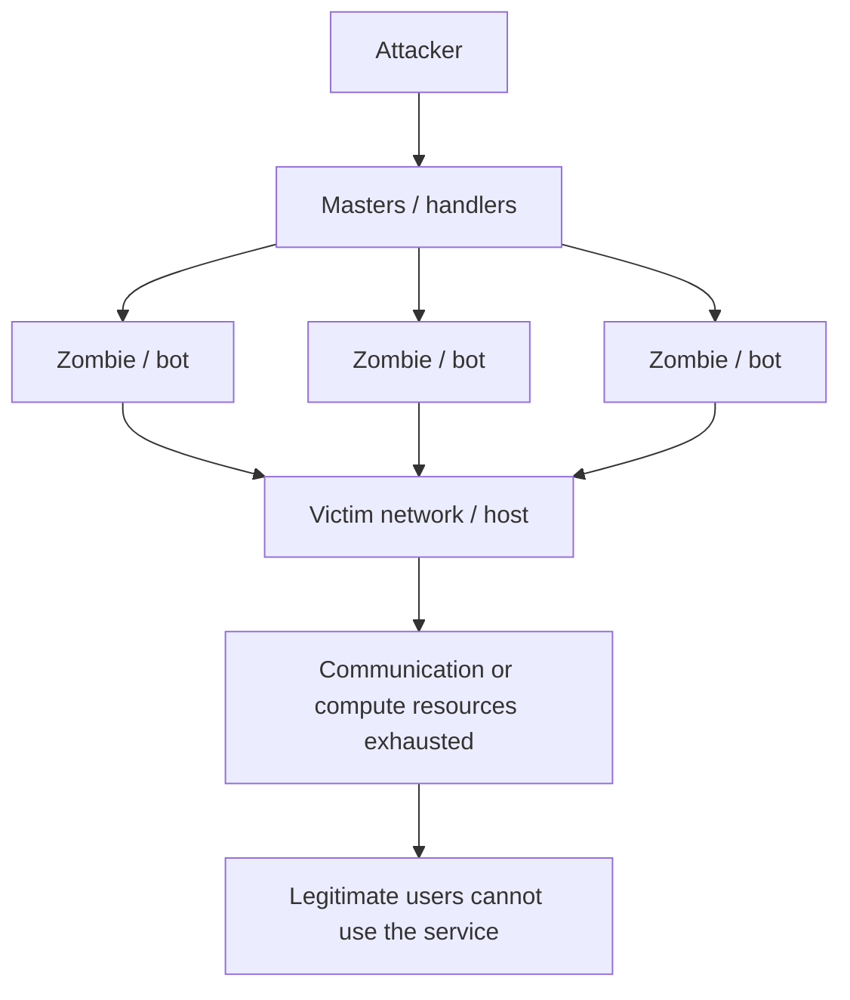
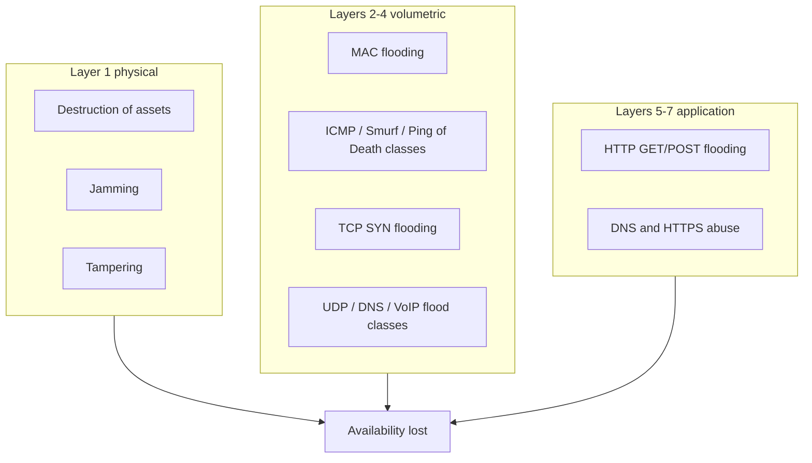

# M46: Introduction to DDoS

**Source:** https://www.youtube.com/watch?v=jEYv9HSp8lU
**Instructor / expert:** Dr Abhinav Bhandari, Department of Computer Engineering, Punjabi University, Patiala
**Course coordinator:** Dr Maninder Singh, Professor and Dean of Academic Affairs, Thapar University, Patiala

### Learning objectives

- Distinguish **DoS** from **DDoS** and place both as attacks on **availability** in the CIA triad.
- Explain why Internet growth and a security-light original design made flooding and related availability attacks severe.
- State attacker **motives** and organisational **consequences** as listed in the lecture.
- Name the **protocol/architecture weaknesses** the instructor blamed (stateless forwarding, lack of authentication / IP spoofing, predictable TCP handshake, mimicry of legitimate users).
- Classify DDoS **as taught**: physical (layer 1), volumetric (layers 2–4), and application-layer (layers 5–7) — class names only, not operational recipes.

### Core concepts

Internet usage grew tremendously in the last decade; lives became dependent on it for information, business, commerce, communication, education, entertainment, and research. The Internet’s original goal was **unobstructed flow of data and scalability**, **without keeping security in mind** — now a precarious situation. A simple architectural design eased usage but **fascinated attackers** who exploit vulnerabilities for many reasons.

Those threats can target the **CIA model**: **confidentiality**, **integrity**, and **availability**. **Availability** is primarily targeted by **denial-of-service (DoS)** attacks: an **explicit attempt to prevent legitimate users from using a service**.

DoS has overtaken other concerns as arguably the **most severe form of attack in the last decade**. The major goal is to **disrupt or deny services**. Example: a reputed online shopping site suddenly unavailable because a **flood of packets** is surging in — one of hundreds or thousands of victims of a **pervasive, growing** Internet threat.

Traditionally the security community focused on **unauthorized disclosure or modification of information** and perhaps **theft of services**. DoS was largely **ignored as unlikely** because “the characters would not gain anything.” That is **not the case today**. DoS can put merchants out of business, cause **major visible disruption**, be used against companies from **grudge or paid attack**, or be used by **terrorists** against critical infrastructure.

A DoS aims to **deny legitimate users access to shared services or resources**. It may include attempts to **flood a network**, **disrupt connections between two machines**, or **disrupt service to a specific system or person**, preventing legitimate traffic from reaching a server, service, or website. Such an attack can be configured in many ways, targeting **operating systems** or **network services**.

The lecture contrasted **two high-level forms** (classification, not a playbook):

1. **Vulnerability / crafted-packet DoS** — crash a system by exploiting **software vulnerabilities** on the target (example class named: **Ping of Death**, using oversized **ICMP** ping traffic that some operating systems mishandled via **buffer overflow**, leading to crash, freeze, or reboot). The instructor said this form can be **prevented by patching**.
2. **Flooding DoS** — **massive volumes of useless traffic** occupy resources that would have served legitimate traffic. This form **cannot be easily prevented**; targets can be attacked **simply because they are connected to the public Internet**.

#### DoS versus DDoS

When attack traffic comes from **multiple sources**, it is a **distributed denial-of-service (DDoS)** attack. Multiple sources **amplify** power and make **defence much more complicated**.

Both are huge threats; DDoS is **more complex and harder to solve** because:

- It can use a **very large number of machines** — a powerful weapon; **any target, however well provisioned, can be taken offline**. Gathering a large “army” of machines has become simple because **automated tools** exist that **do not require sophistication**. Even if attacking machines could be identified, **action against a network of (e.g.) 1,000 hosts** is hard.
- Some DDoS uses **seemingly legitimate traffic**: resources are consumed by a large number of **legitimate-looking messages** with **no distinguishing feature**. Because the attack **misuses a legitimate activity**, response **without also disturbing legitimate activity** is extremely hard.

#### Botnet roles (architecture as taught)

Operating systems and network protocols were developed **without security engineering**, leaving many **insecure, unpatched machines**. Attackers implant programs on those machines. Depending on sophistication, compromised machines are called **masters, handlers, or zombies**, collectively **bots**; the attack network is a **botnet**.

Control instructions go to **masters**, which communicate them to **zombies**. Zombie machines then send attack packets that **converge at the victim or its network** to exhaust **communication or computational** resources.

Incidents are common against clients, businesses, ISPs, and well-known companies such as **Yahoo, Twitter, Facebook, eBay, Google**. A table of incidents from **2000 to 2014** was shown. Security reports after **2014** showed further strengthening versus pre-2005. **Attack size** taught: **less than 10 Gbps** before 2005; about **100 Gbps** in 2010; up to **400 Gbps** in 2014.

#### Motives

| Motive | As taught |
|--------|-----------|
| **Recognition** | Early DDoS as proofs of concept or pranks; taking a popular site offline brings underground recognition |
| **Ideological activism** | Political disagreement with an organisation, media site, corporation, or government |
| **Financial gain** | Monetary motive; after an attack they may **demand ransom** to prevent further attacks; these attackers are described as **most experienced** |
| **Vandalism** | Destroy available resources; “don’t believe in anything”; reports of increase |
| **Revenge / competitive spirit** | Business revenge; possibly dishonoured employees |

There is a **major lack of data** on perpetrators and motives; the **vast majority of attacks are not reported**.

#### Consequences

Severity depends on **kind of attack, organisation, and target**. **Long-duration** attacks are more rigorous and must be **mitigated quickly after detection**. Listed consequences:

- Huge **revenue losses**
- **Reputation** damage
- Loss of **shareholder confidence**
- **Customer dissatisfaction**
- Loss of important data due to **system crashes**
- Extra **operational cost**

These can imply **social, financial, and legal** effects.

#### Vulnerabilities in basic protocols and architecture

1. **Stateless nature of the Internet** — intermediate routers **do not maintain state** about forwarded packets, so **accountability / forensics** are difficult and theft can go unidentified.
2. **Lack of authenticity** — without authentication, users can **claim others’ identities**. The common example class is **IP spoofing** (forged source addresses).
3. **Deterministic / predictable Internet protocols** — not always a “design flaw”; often needed for proper operation. Example: **TCP connection establishment and control**. The **three-way handshake** is **predictable** and can be abused for flooding classed as **SYN flooding**.
4. **Mimicking legitimate user behaviour** — leads to **application-layer DoS**, which is hard to separate from real users.

#### Classification of DDoS (by OSI region)

DDoS may occur at **every OSI layer**. The lecture’s figure grouped three classes: **physical-layer**, **volumetric**, and **application-layer**.

##### Physical-layer (layer 1)

Concerned with **physical security**: destruction, obstruction, malfunction, or manipulation of **physical assets**. Communication relies on nodes, hosts, switches, hubs, routers, servers, and wired or wireless media. If devices that grant service go down, service is disrupted. Attackers may deny service by **compromising physical security** so signals never arrive.

Named subclasses:

- **Destruction of assets** — damage physical assets or cut **LAN backbone** wiring so assets become unresponsive. Prevention taught: **physical security of assets**.
- **Jamming** — primarily in **wireless sensor networks**: noise close to the network so **throughput falls**; packets corrupted by **interference**. (Class of radio disruption, not a construction guide.)
- **Tampering** — interfere with node function by erasing programs or modifying code; **cryptographic keys and other sensitive information** may be extracted from captured nodes. Prevention taught: keep packages **tamper-proof**.

##### Volumetric (layers 2–4)

**Congestion** by consuming **bandwidth** through flooding classes such as **MAC flooding, ICMP flooding, UDP flooding, SYN flooding**. High traffic; many DDoS variants sit here. The protocol idea of the class is to **congest the network or target with large amounts of packets** so resources are consumed, the machine may become **unresponsive** or **crash**. Traffic is described as coming through **distributed bots** remotely controlled by **bot masters**. A **key feature**: most IP packets used have **spoofed source addresses**, which **hinders traceback**.

Named volumetric classes (what they abuse, not how to run them):

| Class | Lecture’s characterisation |
|-------|----------------------------|
| **MAC flooding** | Forged / cloned MAC addresses and large frame volume toward **switches**; non-existent MACs used to **disturb ARP caches**. Switch memory is exhausted allocating resources for forged MACs, **denying legitimate requests**. May also disturb **router tables** so routing becomes unavailable |
| **ICMP flooding** | ICMP is the **error-control / diagnostic** protocol at the network layer. Query traffic encapsulated in IP is sent in volume with **spoofed sources**; the server’s replies **consume bandwidth**. **Fragmented ICMP** at high rate can overload reassembly. Named related examples: **Smurf** and **Ping of Death** (ICMP-based classes) |
| **TCP / SYN flooding** | Abuses the **TCP three-way handshake**. Incomplete connection requests leave the server holding **half-open** state until **timeout**, so a large number of such requests make the target unavailable. Related names: **SYN flooding**, **fragmented acknowledgement** packets as TCP-flood examples |
| **UDP flooding** | UDP is **connectionless**. Volume from distributed bots exhausts bandwidth. **Echo** and **chargen** services are named as commonly abused. Other UDP-related classes named: **DNS flood**, **UDP fragmentation**, **VoIP flood** |

##### Application-layer (layers 5–7)

In contrast to volumetric attacks, these generate **low traffic at the network** but **large request load on the web server**, which can **overwhelm server resources**. Named examples: **HTTP GET and POST request flooding**. Application protocols exploited: **HTTP, HTTPS, DNS**, and others.

#### Closing

DoS/DDoS is a **devastating** class of cyber attack. Many **commercial solutions** exist, but an **ideal solution is still elusive**. The next lecture covers **approaches to tackle the DDoS problem**.

### Key terms

| Term | Meaning in this lecture |
|------|-------------------------|
| DoS | Denial of service: prevent legitimate users from using a service (availability) |
| DDoS | DoS whose traffic comes from **many sources**, amplifying impact and complicating defence |
| Bot / botnet | Compromised machines (masters, handlers, zombies) used as a distributed attack network |
| IP spoofing | Forged source addresses; hides origin and defeats simple identity-by-IP defences |
| SYN flooding | Volumetric class that leaves TCP connections **half-open** until timeout |
| Volumetric attack | Layers 2–4 congestion/bandwidth exhaustion |
| Application-layer DDoS | Layers 5–7: low network volume, high application/request load |
| Ping of Death | Named vulnerability class: oversized ICMP mishandled by some OSes; patchable |
| CIA | Confidentiality, integrity, availability — DDoS targets availability |

### Lecture takeaways

- Availability was historically under-weighted; flooding proved it can bankrupt, embarrass, or politically coerce a victim.
- DDoS is harder than DoS because of **scale**, **legitimate-looking traffic**, and **spoofed identity**.
- The Internet’s **stateless forwarding**, **weak authentication**, **predictable TCP handshake**, and **easy mimicry of users** are the taught root causes — not a single bug.
- Classification is **physical vs volumetric vs application-layer**; named floods (MAC, ICMP, SYN, UDP, HTTP GET/POST) are **types**, not procedures.
- Patching stops some vulnerability DoS; **public-Internet flooding has no easy preventative**, and commercial tools have not closed the problem.
