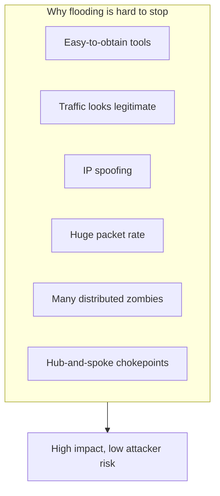
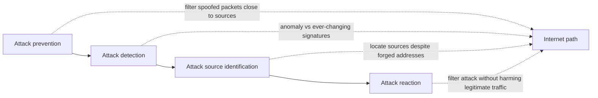

# M47: Defence to DDoS Attacks

**Source:** https://www.youtube.com/watch?v=w_XZu6Rc0jM
**Instructor / expert:** Dr Abhinav Bhandari, Department of Computer Engineering, Punjabi University, Patiala
**Course coordinator:** Dr Maninder Singh, Professor and Dean of Academic Affairs, Thapar University, Patiala

### Learning objectives

- Explain why **DDoS flooding** is hard to defend: easy launch, traffic similarity, IP spoofing, huge volume, many zombies, and Internet **hub-and-spoke** chokepoints.
- Separate **technical** vs **social** defence challenges (distributed response, missing incident data, no benchmarks, large-scale testing; deployment economics).
- List **goals of an ideal defence**: effectiveness, completeness, minimum collateral damage, low false positives, low cost.
- Name the four **defence modules**: prevention, detection, source identification, and reaction — as strategies, not attack methods.
- Recall the instructor’s **hardening tips** (filters, patches, unused services, quotas, baselines, physical security, integrity tools, redundancy, backups, passwords).

### Core concepts

The previous lecture covered DDoS basics, motives, and classification. This lecture covers **why defending is difficult**, **challenges and goals for an ideal defence**, and **tips to reduce exposure**.

#### Why the DDoS problem is hard to solve

Flooding-type DoS/DDoS is **very effective for attackers** and **extremely challenging for defence** because of these characteristics:

**Simplified procedures for launching.** Many DDoS tools can be obtained and set in motion. They make **agent recruitment and activation automatic** and can be used by **inexperienced users**. Some tools have existed for years and still generate effective attacks with little tweaking. (The lecture names the existence of tools as a defence challenge — it does not teach their use.)

**Traffic variation / similarity to legitimate traffic.** Unlike threats that need specially crafted packets (the lecture’s examples of other threats: **intrusions, worms, viruses**), flooding needs **high volume** and can **vary packet contents and header values**. Separation and filtering are therefore **extremely hard**.

**IP spoofing.** Attack traffic can **appear to come from numerous legitimate clients**. That **defeats resource-sharing approaches that identify a client by IP address**. If spoofing were eliminated, aggressive senders might be distinguished and filtered. With spoofing, the victim sees many **service-initiation requests from seemingly legitimate users**. Ongoing sessions with known users might be told apart, but the victim **cannot distinguish new legitimate requests from attack ones**, so **no new users can be served** during the attack. Long attacks obviously damage the victim’s business.

**Huge volume of traffic.** High volume **overwhelms the targeted resource** and makes **traffic profiling hard**. At high packet rates a defence can do only **simple per-packet processing**. The main challenge is to **discern legitimate from attack traffic at high packet speeds**.

**Many zombie machines.** Strength lies in **numerous agent machines distributed over the Internet**. The attacker can overwhelm even large networks, **vary** the attack by using **subsets of agents** or **few packets from each**, and thereby **defeat many traceback defences**. Even without variation, **knowing 10,000 attacking identities barely helps stop the attack**. The situation would be simpler if so many agents could not be recruited. Growth of Internet hosts and **novice users** suggests the **pool of potential agents will only increase**. **Distributed Internet management** makes wide deployment of any security mechanism unlikely; even a permanent host-hardening method would take **many years** to dent the DDoS threat.

**Weak spots in Internet topology.** Today’s **hub-and-spoke** Internet has a handful of **highly connected, well-provisioned hubs** that relay traffic for the rest. They are built for heavy traffic, but if those few spots were **taken down or heavily congested**, the Internet would **grind to a halt**. Heavy traffic through those hotspots would have a **devastating global effect**.

**In a nutshell:** flooding DDoS is framed as a **“perfect crime”** on the Internet: tools and agents are abundant; sufficient volume brings the strongest victim down; the right mixture plus spoofing **defeats filtering**; businesses that rely on online access suffer considerable damage; spoofing, numerous agents, and **lack of automated tracing** grant **little risk of the perpetrator being caught**.

#### Challenges of DDoS defence

Challenges fall into **technical** and **social** categories. Technical issues involve **current Internet protocols** and **threat characteristics**. Social issues concern how a technical solution is **introduced, accepted, and widely deployed**.

The main problem in **both** is that large-scale DDoS is a **distributed threat** needing a **merit of overlapping solutions** spread across the Internet, because attacking machines may be anywhere. Attack streams can be controlled only if there is a **point of defence between agents and victims**.

Two deployment sketches:

- **One defence close to the victim** monitoring all incoming traffic — deficient mainly because it must **efficiently handle huge volume**.
- **Distributed defence** dividing workload — must be **widespread** to cover any agent–victim pair. Because widespread deployment **cannot be granted**, the technical challenge is defences that still work if **sparsely deployed**. The social challenge is an **economic model that motivates large-scale deployment**.

##### Technical challenges (summarised list)

**Need for distributed response at many Internet points.** Very few DDoS types can be handled **only by the victim**. Response should be **distributed, possibly coordinated**, and deployed at **many points** to cover diverse agents and victims. The Internet is **administered in a distributed manner**, so wide (or even cooperative) deployment **cannot be enforced**. That **discourages researchers** from considering distributed solutions.

**Lack of detailed attack information.** Reporting attacks is believed to **damage the victim’s business reputation**, so limited information exists; incidents often go only to **government organisations under secrecy**. It is hard to design imaginative solutions without familiarity. **Attack information must not be confused with attack-tool information** (publicly available). Useful incident data would include **type, time and duration, number of agents (if known), attempted response and its effectiveness, and damage suffered**.

**Lack of defence-system benchmarks.** Vendors make bold claims of completely handling DDoS. There is **no standardized testing approach** for comparison. Two harmful effects: designers present only **advantageous tests**, and researchers **cannot compare actual performance** — only comment on design.

**Difficulty of large-scale testing.** Defences need a **realistic environment**. That is currently impossible due to lack of **large-scale testbeds**, **safe live distributed Internet experiments**, or **simulation tools supporting several thousand nodes**. Performance claims based on **small-scale** tests are **not credible**. Some testbeds in use: **PlanetLab** and **Emulab** (ASR “IMU lab”).

##### Social challenges (deployment patterns)

Many defences need specific patterns to work:

- **Complete deployment** — at each host, router, or network
- **Continuous / neighbour deployment** — at hosts or routers that are **directly connected**
- **Large-scale widespread deployment** — majority of Internet hosts
- **Complete deployment at specified points** — a carefully selected set; **all** must deploy to achieve the desired security
- **Modification of widely deployed Internet protocols** such as **TCP/IP or HTTP**

#### Goals of a strong DDoS defence

**Effectiveness.** A good defence should **actually defend**: either **effective prevention** that makes attacks impossible, or **effective reaction** so the DoS effect **goes away**. For reactive mechanisms, response should be **sufficiently quick and automated** that the target does not suffer seriously.

**Completeness.** Handle **all possible attacks**, or at least a **large number**. A mechanism that handles **TCP SYN flooding** but cannot help on a **ping flood** is less valuable than one that handles **both**. Example: **TCP SYN cookies** help but are **not sufficient unless coupled with other mechanisms**. Completeness is also required in **detection and reaction**: if detection misses a pattern, **no response is invoked** and the attack succeeds. Completeness is **extremely hard** because attackers develop **new types designed to bypass existing defence**. **Flash events** need **clear-cut distinction** from DoS.

**Minimum collateral damage.** The core goal is **not merely to stop attack packets** but to ensure **legitimate users can continue normal activity despite the attack**. Legitimate traffic may share **sources** with attack traffic, share the **victim’s network as destination**, share **some Internet path** with attack traffic, or share **application protocol or destination port**. **None of these legitimate categories should be disrupted**. In practice, defences cannot characterise attack traffic perfectly and **drop some legitimate traffic** — that dropping is **collateral damage**. Because attackers **conceal traffic in the legitimate stream**, resemblance is common; the problem is **real and serious**, especially with **flash events**. Protecting legitimate traffic is very important.

**Low false-positive rates.** Preventive mechanisms should not **hurt other forms of traffic**. Reactive mechanisms should activate **only when an attack is actually underway**. Detecting an attack when **none is happening** is a **false positive**; it causes collateral damage by triggering filtering and incurs **CPU, memory, and delay** cost on all packets.

**Low deployment and operational cost.** Cost must be **commensurate with benefits**. Commercial solutions have **hardware/software purchase** cost and **system-administration** cost. Some mechanisms need **ongoing administration** (e.g. **signature** systems needing updates as new attacks are characterised). Other overheads: **stateful inspection** may delay each packet; **throttling** suspicious sources may slow **legitimate** interactions with those sources. Unless costs are **extremely low or rare**, they must be balanced against the degree of protection.

#### Four defence modules

**1. Attack prevention** — stop attacks **before they reach the target**. For DDoS that uses **spoofed traffic**, a highlighted approach is **filtering spoofed packets close to or at the attack sources** — taught as one of the **most effective** approaches for that subclass.

**2. Attack detection** — detect DDoS **when it occurs**; an important procedure to **direct further action**, based on **traffic-feature distribution**. **Signature-based detection is not applied** for DDoS defence because signatures **change constantly**. **Anomaly-based detection** is suitable.

**3. Attack source identification** — locate sources **regardless of whether the packet source-address field contains erroneous information**. Crucial to **minimize damage** and **deter potential attackers**.

**4. Attack reaction** — **eliminate or curtail** attack effects. The **final step**, determining overall defence performance. The challenge is to **filter attack traffic without disturbing legitimate traffic**.

#### Practical tips to reduce exposure

Taught as administrative/hardening guidance:

1. **Implement router filters** — lessen exposure to certain DoS attacks and help prevent users **on your network** from effectively launching certain DoS attacks.
2. **Install patches** (when available) to guard against **TCP SYN flooding** — substantially reduces exposure but **may not eliminate risk entirely**.
3. **Disable unused or unneeded network services** — limits an intruder’s ability to use those services for DoS.
4. **Enable quota systems** if the OS supports them (e.g. **disk quotas** for all accounts, especially those running network services). If the OS supports **partitions/volumes**, **partition the file system** to separate critical functions from other activity.
5. **Observe system performance and establish baselines** for ordinary activity; use baselines to notice unusual **disk, CPU, or network** levels.
6. **Routinely examine physical security** relative to current needs: servers, routers, unattended terminals, network access points, wiring closets, environmental systems (air and power), and other components.
7. Use **Tripwire or a similar tool** to detect changes in **configuration or other files**.
8. Invest in **redundant and fault-tolerant** network configurations.
9. Establish and maintain **regular backup** schedules and policies, particularly for **important configuration information**.
10. Establish and maintain appropriate **password policies**, especially for highly privileged accounts (**Unix root** or **Microsoft Windows administrator**).

#### Closing

DDoS remains a **devastating** attack class; **defence is still elusive** despite many **academic and commercial** solutions. This lecture covered **why the problem is hard**, **challenges and goals** for an ideal defence, and **system-management tips**.

### Key terms

| Term | Meaning in this lecture |
|------|-------------------------|
| IP spoofing (defence view) | Makes new legitimate clients indistinguishable from attack initiators |
| Collateral damage | Legitimate traffic dropped or delayed by a defence |
| False positive | Defence treats a non-attack (e.g. flash crowd) as DDoS |
| Flash event | Sudden legitimate load that must be distinguished from DoS |
| SYN cookies | Example partial preventive for SYN floods; not complete by itself |
| Anomaly-based detection | Preferred DDoS detector; signatures change too often |
| Source identification | Finding origins even when addresses are forged |
| PlanetLab / Emulab | Named research testbeds; small-scale tests are not credible |
| Tripwire | Example integrity tool for detecting configuration-file changes |

### Lecture takeaways

- Flooding looks like a “perfect crime”: cheap volume, spoofed identity, too many bots to punish, and hubs that can congest the whole Internet.
- A box next to the victim cannot keep up; real defence must be **distributed**, but **economics and reputation-secrecy** block the data, benchmarks, and deployment that research needs.
- Ideal properties are **actually stopping attacks**, covering **many attack styles**, **not punishing legitimate users** (including flash crowds), **few false alarms**, and **cost in line with benefit**.
- The operational pipeline is **prevent (especially anti-spoof near sources) → anomaly-detect → identify sources → react without collateral damage**.
- Everyday hygiene — filters, SYN-flood patches, turning off spare services, quotas, baselines, physical security, Tripwire, redundancy, backups, strong admin passwords — **reduces exposure**; it is **not** a complete DDoS solution, which the instructor says the market has not yet delivered.
