# Volume 01 — Ethics, Network Models, and TCP/IP

**Course:** CEC / SWAYAM Information Security · **Coordinator:** Dr. Maninder Singh, Thapar Institute

Introductory video and modules M00–M11: information-security ethics, network security, OSI/TCP-IP models, protocol stack, TCP, data-link and MAC, IP addressing, and TCP connection management.

These notes are grounded in the official YouTube lecture transcripts. They are study material, not an official CEC publication.

---

# M00: Introductory Video — Information Security

**Source:** https://www.youtube.com/watch?v=g0jhMsXaL6Q
**Coordinator:** Dr. Maninder Singh, Professor and Dean of Academic Affairs, Thapar University, Patiala

### Learning objectives

- State why information security now spans individuals and enterprises.
- List the course's promised themes: web trust, DNS, HTTPS, client-side attacks, and secure coding.
- Explain the coordinator's claim that poor programming is the root cause of most information-security threats.
- Recall that this is a short, two-credit course on information and network security.

### Core concepts

Information security is no longer a specialist niche. The coordinator opens from **threat anatomy** to a **comprehensive picture of cyber hygiene**: loopholes in an organization give criminals a breakthrough they can exploit, whether the target is a single person or an enterprise.

The course promises a **big-picture tour** that starts with fundamentals of a **secure web surface**:

- **Recognizing fake websites** using **authoritative DNS replies** (not just a page that "looks" official).
- **Verifying digital signatures** when the site uses **HTTPS**.
- A **hands-on DNS poisoning** demonstration, so students see how name resolution can be subverted.
- An argument developed across later lectures: the **main root cause of information-security threats is poor programming**. Copy-paste ("Ctrl+C / Ctrl+V") coding across generations of software is called out as a habit to **discourage**.

**Client-side attacks** get a dedicated proof-of-concept because they are a **critical attack vector**. Securing one server or asset is comparatively easy; if the **client willingly visits a malicious site**, the defender has almost no remaining control. Through a **series of proofs of concept**, students should learn to **deploy countermeasures** and, more importantly, to **practice secure coding** — described as the **ultimate goal of the course**.

The offering is an **eight-week, two-credit** short-term course. Paradigms to be covered include:

- Information security and **network security**
- **Operating-system** and **database** security issues
- **DNS poisoning** in depth, including **authoritative answers**
- Competencies against **client-side attacks**

The closer: information security is needed to keep the **hygiene of the connected world**; the faster it is understood, the better.

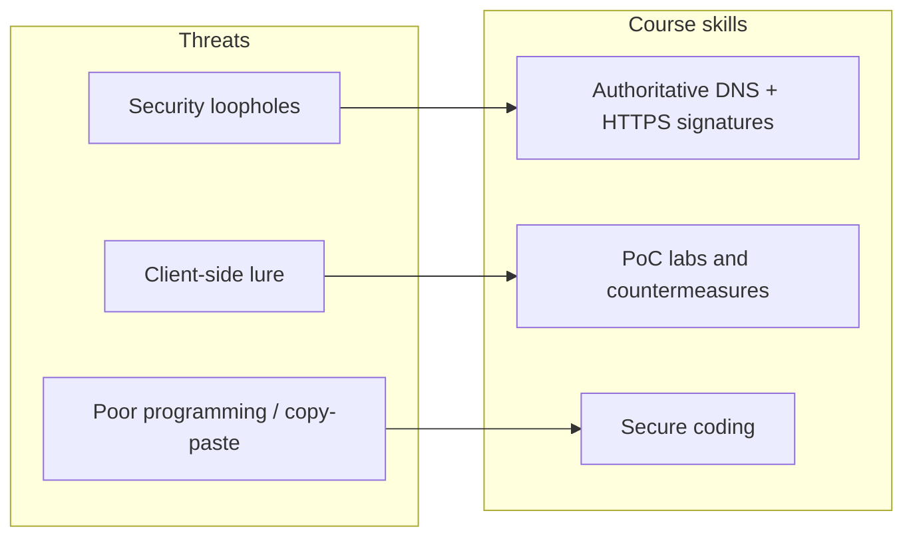

### Key terms

| Term | Meaning in this lecture |
|------|-------------------------|
| Security loophole | Organizational gap that lets an attacker break in and exploit a vulnerability |
| Authoritative DNS reply | Name-server answer that should be trusted when judging whether a site is genuine |
| HTTPS digital signature | Cryptographic check that the web server is the claimed site |
| DNS poisoning | Tampering with name resolution so users reach a fake host |
| Client-side attack | Compromise that succeeds because the user (browser) approaches a malicious site |
| Secure coding | The course's stated end-goal: stop shipping the vulnerabilities that attacks exploit |

### Lecture takeaways

- Security is ambient: individual and enterprise alike.
- Trust on the web is technical (DNS + HTTPS), not visual.
- Poor programming, especially copy-paste reuse, is framed as the root cause of threats.
- Client-side attacks are hard to stop once the user cooperates with the attacker.
- The two-credit course aims at network, OS, database, DNS, and secure-coding competence.


---

# M01: Information Security

**Source:** https://www.youtube.com/watch?v=q4BLwk2kOGs
**Instructor / expert:** Dr Navdeep Singh, Department of Computer Engineering, Punjabi University Patiala (course coordinator: Dr Maninder Singh, Thapar University, Patiala)

### Learning objectives

- Define ethics and contrast consequentialism with deontology as approaches to right and wrong.
- Distinguish system security from information (data) security and state the CIA triad.
- Relate computer-security breaches and overly protective measures to rights, harms, and interests.
- Contrast hacking vs cracking, cyber trespass vs cyber vandalism, and cyber terrorism vs hacktivism vs information warfare.
- Explain why codes of ethics are not enough for information-security professionals.
- State why privacy matters, how IT enables dataveillance, and what concerns arise from public-space tracking and biometrics.

### Core concepts

This lecture is on **social and ethical issues of information security**, not a catalogue of technical controls. The closer points ahead to the next lecture on **information security management**.

#### Ethics

**Ethics** is the field of study concerned with distinguishing **right from wrong** and **good from bad**. It analyzes the morality of human behaviours, policies, laws, and social structures. Ethicists try to justify moral judgments by referring to ethical principles or theories that capture intuitions about what is right and wrong.

The two theoretical approaches most common in ethics:

| Approach | Core assumption |
|----------|-----------------|
| **Consequentialism** | Actions are wrong to the extent that they have **bad consequences**. |
| **Deontology** | People have **moral duties** that exist **independently** of any good or bad consequences their actions may have. |

Ethical principles often **inform legislation**, but ethics recognizes that **legislation cannot substitute for morality**. Individuals and corporations must therefore consider **both the legality and the morality** of their actions.

#### Computer ethics

Ethical analysis of security and privacy in IT mainly happens in **computer ethics**, which emerged in the **1980s**. Computer ethics analyzes:

- Moral responsibilities of **computer professionals** and **computer users**.
- Ethical issues in **public policy** for IT development and use.

Sample questions the field asks:

- Is it wrong for corporations to **read employees' email**?
- Is it morally permissible for users to **copy copyrighted software**?
- Should people be free to put **controversial or pornographic** content online **without censorship**?

Such questions require **moral (ethical) analysis**: clarify the **moral dilemmas**, get clear on the **facts and values**, find a **balance** among values, rights, and interests, and **propose or evaluate** policies and courses of action.

#### Moral importance of computer security

**Computer security** (as a field of computer science) applies security features to computer systems to protect against:

- **Unauthorized disclosure, manipulation, or deletion** of information.
- **Denial of service**.

The resulting condition is also called computer security. Professionals aim to protect **valuable information** and **system resources**.

A distinction:

| Term | What is protected |
|------|-------------------|
| **System security** | Hardware and software against **malicious programs** that sabotage system resources |
| **Information security** (data security) | Data that **resides on disk drives** or is **transmitted between systems** |

Information security is customarily defined around three aspects of data — the **CIA triad**:

- **Confidentiality**
- **Integrity**
- **Availability**

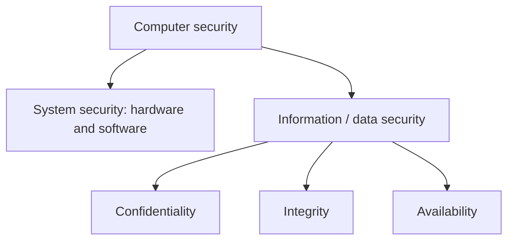

#### How computer security poses ethical issues

Ethics is mostly concerned with **rights, harms, and interests**. The lecture therefore asks:

- What **morally important benefits** can computer security bring?
- What **morally important harms** or **violations of moral rights** can result from a **lack** of computer security?
- Can computer security **itself** cause harms or violate rights instead of preventing them?

#### Harms from breaches

**Economic harm.** If system security is undermined, valuable hardware and software may be damaged or corrupted and service may become unavailable — losses of **time, money, and resources**. Breaches of **information** security may cost even more: data can be worth far more than the hardware that stores it.

**Non-economic value.** Stored data may have **personal, cultural, or social** value, not only economic value.

**Psychological / emotional harm.** Any loss of system or data security is more likely to cause some amount of psychological or emotional harm.

**Injury and death.** This can occur in **safety-critical systems**: computer systems with a component of **real-time control** that can have a **direct life-threatening impact**. Examples given:

- Nuclear-reactor control
- Aircraft and air-traffic control
- Missile systems
- Medical-treatment systems

Other systems can threaten life **indirectly** if corrupted: systems used for **design, monitoring, diagnosis, or decision making** (e.g. **bridge design** or **medical diagnosis**).

#### Confidentiality, property, and privacy

Third parties may compromise confidentiality by **accessing, copying, and disseminating** information.

- **Property rights**, including **intellectual property rights** — rights to own and use intellectual creations such as artistic or literary works and industrial designs. If information is exclusively owned, the owner may determine who can access and use it; unauthorized access violates that right.
- **Privacy rights** — when the accessed information is about persons and is considered **private**.
- **Other harms** from dissemination and use of confidential information: e.g. leaking **internal matters of a firm** damages its **reputation**; compromising **online credit-card transactions** undermines **trust** in online financial transactions and harms **e-banking** and **e-commerce**.

#### Availability, freedom of information, and free speech

Prolonged or **intentional** compromises of availability can violate **freedom rights**, specifically:

- **Freedom of information** — the right to access and use **public** information. Shutting down vital information services could violate this right.
- **Free speech** — computer networks are an important medium for speech (websites, email, bulletin boards, and other services). Blocking access (e.g. **denial-of-service attacks** or **hijackings of websites**) is classified as a **violation of free speech**.

#### When security measures themselves cause harm

Computer-security measures normally **prevent harms and protect rights**, but they can also **cause harm and violate rights**:

- Measures may be so protective that they **discourage or prevent** stakeholders from accessing information or using services.
- Measures may be **discriminatory**: they may wrongly **exclude** certain classes of users, or wrongly **privilege** some classes over others.

#### Ethical issue 1: hacking and computer crime

A large part of computer security is protection against **unauthorized intentional break-ins or disruptions**. Such action is often called **hacking**.

| Term as taught | Meaning |
|----------------|---------|
| **Hacking** (general) | Use of computer skills to gain **unauthorized access** to computer resources. Hackers are highly skilled users who often form communities to share knowledge and data. |
| **Hacking** (negative definition) | Unauthorized access for **malicious** purposes: steal information and software, corrupt data, or disrupt operations. |
| **Hacking vs cracking** (self-identified hackers) | **Hacking** = non-malicious break-ins; **cracking** = malicious and disruptive break-ins. |

Self-identified hackers often justify their activity by arguing they cause **no real harm** and instead have a **positive impact**: they **free data** for everyone's benefit and **improve systems** by exposing security holes. These claims are part of the **hacker ethic** (hacker **code of ethics**), including convictions that:

- **Information should be free**.
- **Access to computers should be unlimited and total**.
- Activities in cyberspace **cannot do harm in the real world**.

The lecture rejects the “information should be free” claim as running **counter to intellectual property**: creators would have no right to keep information or profit from it. It would also **undermine privacy** and the **integrity and accuracy** of information, because anyone who accessed it could modify it at will.

Not all computer crime compromises computer security. Two **major types that do**:

| Type | Definition |
|------|------------|
| **Cyber trespass** | Use of IT to gain **unauthorized access** to computer systems or password-protected websites |
| **Cyber vandalism** | Use of IT to unleash programs that **disrupt** computer-network operations or **corrupt data** |

#### Ethical issue 2: cyber terrorism and information warfare

**Cyber terrorism:** politically motivated hacking operations intended to cause **grave harm** — **loss of life** or **severe economic loss**, or both. A major concern since the **9/11 attacks** has been attacks on **information infrastructure** meant to debilitate or compromise it and harm the economic, industrial, or social structures that depend on it. Attacks could be **foreign or domestic**.

Controversy exists on **scope**: where to draw boundaries among cyber terrorism, cyber crime, and cyber vandalism. Examples the lecture poses:

- Should a teenager who releases a dangerous virus that causes major harm to **government computers** be **prosecuted** as a cyber terrorist?
- Are **politically motivated hijackings** of major organizations' homepages acts of cyber terrorism?

A usable distinction: cyber terrorism consists of **politically motivated** operations that **aim to cause (grave) harm**.

**Hacktivism** is distinguished from terrorism: hacking against an Internet site or server with intent to **disrupt normal operations** but **without intent to cause serious damage**. Activists may use **email bombs**, **low-grade viruses**, and **temporary homepage hijackings**. Politically motivated hackers engaged in **electronic political activism** should be distinguished from terrorists.

**Information warfare** is an extension of ordinary warfare in which combatants use information and **attacks on information and information systems** as tools of warfare. It may include:

- Using information media to spread **propaganda**.
- **Disruption, jamming, or hijacking** of communication infrastructure, or propaganda aimed at the enemy.
- Hacking into systems that control **vital infrastructure** (examples: **oil and gas pipelines**, **electric power grids**, **rail infrastructure**).

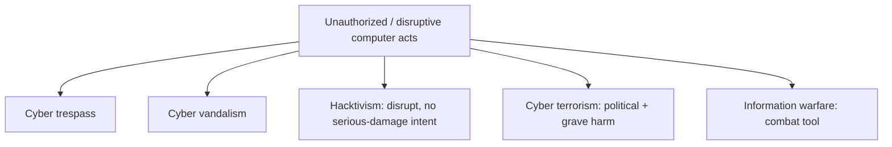

#### Moral responsibilities of information-security professionals

Information-security professionals maintain **system and information security**. By the standing of their profession they have a professional responsibility to assure the **correctness, reliability, availability, safety, and security** of all aspects of information and information systems.

That responsibility has a **moral dimension**: professional activity may protect people from morally important harms **or cause such harms**, and may **protect or violate** moral rights. In **safety-critical systems**, decisions may be a matter of **life or death**.

This is reflected in **codes of ethics** used by computer- and information-security organizations. Those codes **rarely go into detail** on responsibilities in specific situations. Example: the **Information Systems Security Association (ISSA)** — an international organization of information-security professionals and practitioners — states that members should perform all professional activities and duties in accordance with **all applicable laws** and the **highest ethical principles**, but **does not specify** what those principles are or how to **apply and balance** them in particular cases.

A code of ethics is therefore **not enough**. Professionals need **training in information-security ethics** so they can:

- Get clear about **interests, rights, and moral values** at stake.
- **Recognize** ethical questions and dilemmas in their work.
- **Balance** different moral principles when resolving them.

#### Ethical issue 3: information privacy and ethics

In Western societies there is broad recognition of a **right to personal privacy**. The right was first defended by American justices **Samuel Warren** and **Louis Brandeis**, who defined privacy as the **right to be let alone**.

Privacy is hard to define; more precise definitions have followed. Often it is defined as a right of individuals to **control access or interference** by others into their private affairs.

Why privacy is held to be valuable:

- It protects individuals from external threats: **defamation, ridicule, harassment, manipulation, blackmail, theft, subordination, and exclusion**.
- It is argued to be a **necessary condition for autonomy**: without privacy people could not experiment in life and develop their own personality and thoughts, because they would constantly be subjected to others' judgment.
- It has been claimed to protect **other rights** (examples given: **abortion rights** and the **right to sexual expression**).
- It has **social** as well as individual value; e.g. it has been held **essential for maintaining democracy**.

The right is **not normally absolute**. It must be balanced against other rights and interests such as **public order** and **national security**. Expectation of privacy also **varies by context**: there is a **lesser** expectation in the **workplace** or **public sphere** than **at home**.

An important principle in Western privacy protection is **informed consent**: citizens should be informed how organizations plan to **store, use, or exchange** their personal data and should be asked for **consent**. People can then **voluntarily give up** privacy if they choose.

#### Ethical issue 4: information technology and privacy

Privacy corresponds with the ideal of the **autonomous individual** free to act and decide their own destiny. Modern societies are also characterized by **surveillance**, which tends to undermine privacy.

**Surveillance** is the **systematic observation** of groups of people for specific purposes, usually aiming to **exert influence** over them. The **state** surveils to protect national security and fight crime; the **modern corporation** surveils the workplace to retain control over the workforce.

**Computerization from the 1960s onward** intensified surveillance by increasing its **scale, ease, and speed**. Surveillance is partly **delegated to computers** that collect, process, and exchange data.

Computers also made a new kind of surveillance possible: **dataveillance** — large-scale computerized collection and processing of personal data in order to **monitor people's actions and communications**. More and more IT records **actions and communication**, not only static facts. New detection technologies (**smart closed-circuit television**, **biometrics**, **intelligent user interfaces**) and processing techniques such as **data mining** further exaggerate this trend.

Surveillance has become a **generalized, routine** activity across settings and organizations. Corporations have extended it from the workplace to customers (**consumer surveillance**). The **9/11** terrorist attacks **drastically expanded** state surveillance.

Many privacy disputes are tensions between people's **right to privacy** and **state and corporate interest in surveillance**. In the information society, protection is realized through **information-privacy laws, policies, and directives** (data-protection policies) that regulate **harvesting, processing, usage, storage, and exchange** of personal data. These policies are often **overtaken by new technology**. Privacy protection has also become a concern in the **design and development** of IT itself.

#### Ethical issue 5: privacy in public

A common belief is that privacy is a right in **private places** (homes, private clubs, restrooms) but is **minimized or forfeited** once people enter **public space**. On this view, walking in public streets or driving, one may retain the right not to be **seized and searched without probable cause**, but appearance and behaviour may be **freely observed, surveilled, and registered**.

Many privacy scholars argue this is **not fully tenable**: people have privacy rights in public that are **incompatible** with certain registration and surveillance practices. The problem of **privacy in public** applies to tracking, recording, and surveillance of **public appearances, movements, and behaviours** of individuals and their vehicles. Techniques listed:

- Video surveillance, including **smart CCTV** for **facial recognition**
- **Infrared** cameras
- **Satellite** surveillance
- **GPS** tracking
- **RFID** tagging
- **Electronic checkpoints**
- **Mobile-phone** tracking
- **Audio bugging**
- **Metadata-intelligence** techniques

#### Ethical issue 6: biometric identification

**Biometrics** is the identification or verification of someone's identity on the basis of **physiological or behavioral** characteristics. It provides a reliable method of **access control** and personal identification for governments and organizations, but it has raised privacy concerns:

- Widespread use would tend to **eliminate anonymity and pseudonymity** in most daily transactions, because people would leave **unique traces** everywhere they go.
- Monitoring movements and actions gives the organization **insight into a person's behaviours**, which may be used **against that person's interests**.
- Many people find biometrics **distasteful** because it records **unique and intimate** aspects of a person, and because procedures are sometimes **invasive of bodily privacy**.

The challenge is to develop techniques and policies that are **optimally protective of personal privacy**.

### Key terms

| Term | Meaning in this lecture |
|------|-------------------------|
| Ethics | Study of right/wrong and good/bad; analyzes behaviours, policies, laws, and social structures |
| Consequentialism | Wrongness of actions judged by bad consequences |
| Deontology | Moral duties exist independently of consequences |
| Computer ethics | 1980s field on professional/user duties and IT public-policy ethics |
| System security | Protecting hardware/software against malicious sabotage |
| Information security | Protecting stored and transmitted data (CIA) |
| Safety-critical system | Real-time control system whose failure can threaten life |
| Hacking / cracking | Unauthorized access; crackers = malicious/disruptive break-ins (hacker self-description) |
| Hacker ethic | Information should be free; unlimited computer access; cyberspace cannot harm the real world |
| Cyber trespass | Unauthorized access to systems or password-protected sites |
| Cyber vandalism | Programs that disrupt networks or corrupt data |
| Cyber terrorism | Politically motivated hacking intended to cause grave harm (death and/or severe economic loss) |
| Hacktivism | Political site disruption without intent to cause serious damage |
| Information warfare | Using information and attacks on information systems as tools of war |
| ISSA | Information Systems Security Association; code requires law plus “highest ethical principles” without specifying them |
| Right to be let alone | Warren and Brandeis's definition of privacy |
| Informed consent | Tell people how personal data will be stored/used/exchanged and obtain consent |
| Dataveillance | Large-scale computerized collection/processing of personal data to monitor actions and communications |
| Biometrics | Identity verification from physiological or behavioral characteristics |

### Lecture takeaways

- Ethics is not the same as law: legality does not replace morality for individuals or corporations.
- Computer security has a moral structure: CIA plus system vs data, tied to rights, harms, and interests — including economic, cultural, psychological, and life-and-death stakes in safety-critical systems.
- Over-strong or discriminatory security can itself violate access, fairness, and freedom rights (including FOI and free speech when availability is blocked).
- The hacker ethic's “information should be free” claim collides with intellectual property, privacy, and data integrity.
- Cyber terrorism is marked by **political motive plus grave harm**; hacktivism and ordinary cyber crime are not the same thing; information warfare extends ordinary war onto information systems.
- Professional codes (e.g. ISSA) are too thin: security practitioners need ethics **training**, not only a code.
- Privacy is the right to be let alone / control access to private affairs; it is valuable for autonomy and democracy but not absolute.
- IT scaled surveillance into **dataveillance**; 9/11 and consumer tracking intensified the privacy–surveillance tension; public-space tracking and biometrics further squeeze anonymity.


---

# M02: Network Security

**Source:** https://www.youtube.com/watch?v=kibMPvGrLXw
**Instructor / expert:** Dr Pardeep Bhandari, Doaba College, Jalandhar (course coordinator: Dr Maninder Singh, Thapar University, Patiala)

### Learning objectives

- State why e-business networks need network security and list the CIA goals.
- Distinguish a **threat** from an **attack**, and **passive** from **active** attacks.
- Relate snooping, traffic analysis, replay, modification, and denial of service to confidentiality, integrity, and availability.
- Describe cryptography's three mechanisms: symmetric-key, asymmetric-key, and hashing (including MD5 and SHA).
- Place border routers, firewalls (static / stateful / proxy), IDS, and IPS in a network-boundary defense.
- List hallmarks of a good security policy and the non-technical side of defense in depth.

### Core concepts

Over recent years **Internet-enabled business (e-business)** has improved companies' efficiency and revenue. Applications such as **e-commerce**, **supply-chain management**, and **remote access** let firms streamline processes, lower operating costs, and increase customer satisfaction. Those applications need **mission-critical networks** that carry **voice, video, and data**, and that are **scalable** as user counts and capacity needs grow.

As networks enable more applications and more users, they become more **vulnerable** to a wider range of security threats. **Network security** exists so that e-business transactions are not compromised. It deals with securing information through **cryptography** and **network security devices**.

#### Goals of network security: CIA

**Confidentiality** is probably the most common aspect of information security. Organizations must guard against malicious actions that endanger confidentiality. It applies not only to **storage** but also to **transmission**: information sent to or retrieved from a remote computer must be **concealed in transit**.

**Integrity** means changes are made **only by authorized entities** and **through authorized mechanisms**. The bank example: when a customer deposits or withdraws money, the account balance must change — but only correctly. An integrity violation is **not necessarily malicious**: an **interruption** such as a **power failure** or **power surge** may also create unwanted changes.

**Availability** means information created and stored by an organization must be available to **authorized entities**. Information is useless if it is not available; it must be accessible because it needs to be **constantly changed**. Unavailability is as harmful as a lack of confidentiality or integrity. Imagine a bank whose customers **could not access their accounts** for transactions.

#### Security attacks: threat vs attack

Any action that **compromises the security of information owned by an organization** is a **security attack**. Two notions must be kept separate:

| Term | Meaning in this lecture |
|------|-------------------------|
| **Threat** | A **potential** for a security violation: a circumstance, capability, action, or event that could breach security and cause harm. A threat is a **possible danger** that might **exploit a vulnerability**. |
| **Attack** | An **assault** on system security that derives from an **intelligent threat** — a **deliberate** attempt to evade security services and **violate the security policy**. |

#### Passive attacks

**Passive attacks** are in the nature of **eavesdropping on or monitoring of** transmissions. The opponent's goal is to **obtain information** that is being transmitted. Two types:

**1. Release of message contents.** A telephone conversation, an electronic message, or a transferred file may contain sensitive or confidential information. The defender wants to prevent an opponent from **learning the contents**.

**2. Traffic analysis.** Even if contents are **masked** (the common technique is **encryption**) so that a captured message cannot be read, an opponent may still observe the **pattern** of messages: **location and identity** of communicating hosts, and **frequency and length** of exchanges. That information may be useful in **guessing the nature** of the communication.

#### Active-style attacks presented after the passive pair

The lecture then covers attacks that produce an **unauthorized effect** (classically treated as **active** attacks):

**Replay.** Passive capture of a data unit and its **subsequent retransmission** to produce an unauthorized effect.

**Modification of messages.** Some portion of a legitimate message is **altered**, or messages are **delayed or reordered**, to produce an unauthorized effect. Example: “allow **John Smith** to read confidential file **accounts**” is modified to “allow **Fred Brown** to read confidential file **accounts**.”

**Denial of service (DoS).** Prevents or inhibits the **normal use or management** of communication facilities. It may have a **specific target** (suppress all messages directed to a particular destination) or disrupt an **entire network** by disabling it or **overloading** it with messages so performance degrades.

#### Attacks grouped by CIA goal; snooping

The three CIA goals can be threatened by security attacks. Attacks can be divided into groups related to those goals. A concept introduced in this classification is **snooping**: **unauthorized access to or interception of data**. Example: a file transferred over the Internet contains confidential information; an unauthorized entity intercepts the transmission and uses the content. To prevent snooping, data can be made **meaningless to the interceptor** by **encryption**.

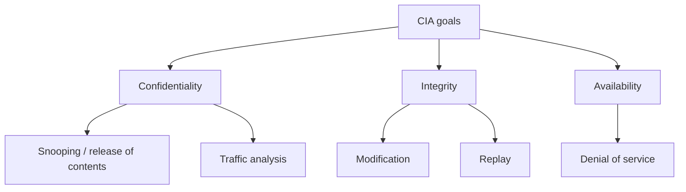

#### Two implementation techniques

Some **security services** are required to achieve the goals and prevent attacks. Actual implementation uses two techniques designed to protect against one or more attacks while maintaining the goals:

1. **Cryptography**
2. **Security through specific devices**

#### Cryptography

The word has **Greek origin** and means **secret writing**. Here it is the science and art of **transforming messages** to make them **secure and immune to attacks**. In the past it referred only to encryption and decryption with **secret keys**. Today it involves **three distinct mechanisms**:

- **Symmetric-key cryptography**
- **Asymmetric-key cryptography**
- **Hashing**

##### Symmetric-key cryptography

Also known as a **traditional cipher**. The **same key** is used for encryption and decryption, and the key can be used for **bidirectional** communication. Model:

- **Plaintext** is input.
- An **encryption algorithm** plus the key produce **ciphertext**.
- On the receiver side a **decryption algorithm** plus the (same) key recover plaintext.
- Sender and receiver **share the same secret key**.

##### Asymmetric-key cryptography

Asymmetric algorithms rely on **one key for encryption** and a **different but related** key for decryption. Important characteristic: it is **computationally infeasible** to determine the decryption key given only the algorithm and the encryption key. Some algorithms such as **RSA** also exhibit: **either** of the two related keys can be used for encryption, with the other used for decryption.

Main components:

| Component | Role |
|-----------|------|
| **Plaintext** | Readable message or data fed into the algorithm |
| **Encryption algorithm** | Performs transformations on the plaintext |
| **Public and private keys** | A pair selected so that if one encrypts, the other decrypts; the exact transformations depend on which key is input |
| **Ciphertext** | Scrambled output depending on plaintext **and** key; two different keys yield two different ciphertexts for a given message |
| **Decryption algorithm** | Accepts ciphertext and the matching key; produces original plaintext |

##### Hash functions

A **cryptographic hash function** takes a message of **arbitrary length** and creates a **message digest of fixed length**. Creating such a function is best done by **iteration**: instead of one function with variable-size input, a function with **fixed-size input** is used as many times as needed. That fixed-size function is a **compression function**: it compresses an **n-bit** string to an **m-bit** string where **n is normally greater than m**. The scheme is an **iterated cryptographic hash function**.

**Ron Rivest** designed several hash algorithms referred to as **MD2, MD4, MD5** (**MD** = **message digest**). **MD5** is a strengthened version of MD4 that divides the message into **512-bit** blocks and creates a **128-bit** digest. A 128-bit digest is **too small to resist attack**.

**SHA** (**Secure Hash Algorithm**) is a standard developed by **NIST** (National Institute of Standards and Technology). SHA has gone through **several versions**.

#### Network security through specific devices

Think about the **boundary** in which the network is established: protect against **external** attacks and watch **internal suspicious activities**. Devices typically deployed:

- **Border routers** as **static filtering** devices
- **Firewalls**
- **Intrusion detection systems (IDS)**
- **Intrusion prevention systems (IPS)**

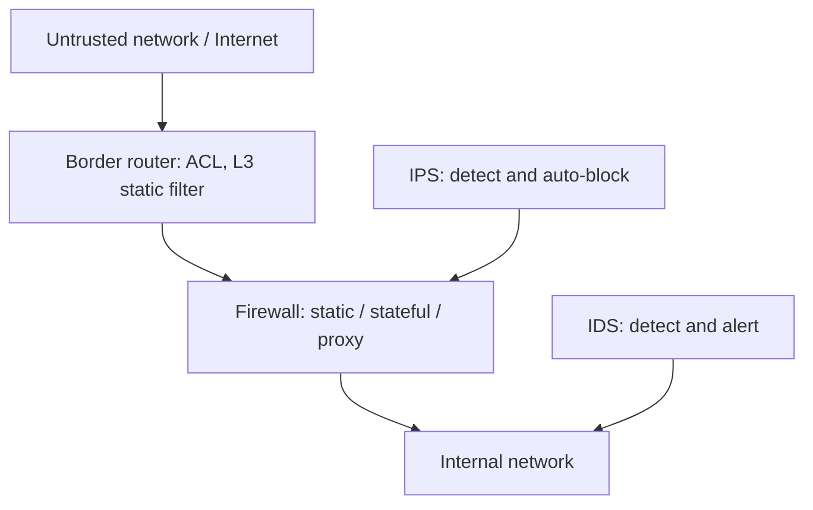

##### Border routers as static filtering devices

Routers are the **traffic cops** of the network: they direct traffic **into, out of, and within** networks. The **border router** is the last router you control before an **untrusted network** such as the Internet. Because all Internet traffic goes through it, it often functions as the network's **first and last line of defense** (initial and final filtering).

Configure it as a **static packet-filtering** device using **ACLs** (**access control lists**). It is called **static** because it can inspect packets only up to **layer 3 (network layer)**.

**Improperly destined traffic** — internal addresses hitting the **external** interface, or vice versa — can be addressed with **ingress and egress filtering**.

The border router can also block **high-risk** traffic:

- **ICMP** is a favorite of attackers for **DoS** and **reconnaissance**, so blocking it in whole or in part is a common border-router function.
- Consider blocking **source-routed packets** because they can **circumvent defenses**.
- Block **out-of-band** packets such as **SYN** packets (as taught).

**Smurf / DDoS example (9 February 2000).** Websites such as **Yahoo** and **CNN** were temporarily taken off the Internet, mostly by **distributed denial-of-service Smurf attacks**. A **Smurf** attack sends **spoofed ICMP echo requests (pings)** to **broadcast addresses**, resulting in a response from **every host**. Spoofing let attackers direct the large number of responses to a **victim network**. **Ingress and egress filtering** would have blocked the spoofed traffic and allowed the targets to weather the DDoS storm.

**Every network** should have ingress and egress filtering at the border router: permit only traffic **destined for the internal network** to enter, and traffic **destined for the external network** to exit.

##### Firewalls

A firewall is a **choke-point** device with a **set of rules** specifying what traffic it will **allow or deny**. It typically **picks up where the border router leaves off** and makes a **much more thorough** pass at filtering. Firewalls are not perfect; they **block what we tell them to block** and **allow what we tell them to allow**.

Three types: **static**, **stateful**, and **proxy**.

A **router** can be used as a **static packet filter** / static firewall. **Specialized firewalls** are needed for stateful and proxy operation.

**Stateful firewalls** keep track of connections in a **state table** and are the **most common** type. They **block traffic that is not in the table of established connections**. The **rule base** determines the source and destination **IP and port numbers** permitted to establish connections. By rejecting non-established, non-permitted connections, a stateful firewall helps block **reconnaissance** packets and those that may gain more extensive **unauthorized access**.

**Proxy firewalls** are the **most advanced** and **least common**. They are also stateful: they block non-established, non-permitted connections, with the same kind of IP/port rule base. They offer a **high level of security** because **internal and external hosts never communicate directly**; the firewall is an **intermediary**. They **examine the entire packet** to ensure **compliance with the protocol** indicated by the **destination port number**. Allowing only **protocol-compliant** traffic supports **defense in depth** by diminishing malicious traffic entering or exiting the network.

##### Intrusion detection systems (IDS)

An IDS is like a **security alarm** for the network: it **detects and alerts** on malicious events. It may comprise many **IDS sensors** at strategic points. In general, sensors watch for **predefined signatures** of malicious events and may perform **statistical and anomaly analysis**. When they detect suspicious events they can alert by **email**, **paging**, or simply **logging**.

A **network IDS** could identify and alert on:

- **DNS zone-transfer** requests from an **unauthorized host**
- **Unicode** attacks directed at a **web server**
- **Buffer-overflow** attacks
- **Virus** propagation
- and so on

##### Intrusion prevention systems (IPS)

An IPS **automatically detects and prevents** network and host attacks. Contrast: a traditional IDS **notifies the administrator** of anomalies; an IPS **strives to defend the target without the administrator's direct involvement**. Protection may use **signature-based or behavioral** techniques to identify an attack and then **block** the malicious traffic or system call **before it causes harm**. In this respect an IPS **combines firewall and IDS** functionality and automatically blocks offending actions as soon as it detects an attack.

#### Non-technical elements and security policy

Technical work — optimizing the firewall rule base, examining traffic for suspicious patterns, locking down system configuration — is important, but the **human** end is often forgotten: **policies and awareness** that go with the technical solutions.

**Policy** determines what security measures the organization should implement; it **guides decisions** when implementing network security. An effective **defense-in-depth** infrastructure requires a **comprehensive and realistic** security policy.

Hallmarks of a **good security policy**:

| Hallmark | Question it answers |
|----------|---------------------|
| **Authority** | Who is responsible? |
| **Scope** | Who it affects? |
| **Expiration** | When it ends? |
| **Specificity** | What is required? |
| **Clarity** | Can everyone understand it? |

### Key terms

| Term | Meaning in this lecture |
|------|-------------------------|
| Confidentiality | Protect stored and transmitted information from unauthorized disclosure |
| Integrity | Authorized entities change data only through authorized mechanisms (faults can also violate it) |
| Availability | Authorized entities can access information when needed |
| Threat | Possible danger that might exploit a vulnerability |
| Attack | Deliberate assault that tries to evade services and violate policy |
| Passive attack | Eavesdropping / monitoring to obtain transmitted information |
| Traffic analysis | Inferring communication nature from patterns despite encryption |
| Snooping | Unauthorized access to or interception of data |
| Replay | Capture a data unit and retransmit it for an unauthorized effect |
| Symmetric-key crypto | Same shared secret key for encrypt and decrypt |
| Asymmetric-key crypto | Related public/private pair; decryption key infeasible to derive from encryption key |
| RSA | Example algorithm where either related key may encrypt and the other decrypt |
| Compression function | Fixed-size hash step: n bits in, m bits out, n > m |
| MD5 | Rivest message digest: 512-bit blocks → 128-bit digest (too small) |
| SHA / NIST | Secure Hash Algorithm family standardized by NIST |
| ACL | Access control list on a border router (static L3 filter) |
| Ingress / egress filtering | Only properly destined traffic enters / leaves |
| Smurf attack | Spoofed ICMP echo to broadcast addresses; responses flood the victim |
| Stateful firewall | Tracks connections in a state table; most common type |
| Proxy firewall | Intermediary; full-packet protocol compliance; most advanced, least common |
| IDS | Detect and alert (signatures / anomaly); does not auto-block |
| IPS | Detect and automatically prevent/block |
| Defense in depth | Layered technical controls plus policy and awareness |

### Lecture takeaways

- E-business needs scalable voice/video/data networks; more applications and users mean more threats, so network security is central.
- CIA is the goal set: conceal in storage and transit; authorize changes (including against accidental corruption); keep authorized access working (a bank that cannot serve accounts fails availability).
- A threat is potential danger; an attack is a deliberate intelligent assault. Passive attacks steal or infer information; replay, modification, and DoS produce unauthorized effects; snooping is stopped by making data meaningless via encryption.
- Cryptography today is three mechanisms: shared-key ciphers, public/private-key (RSA-style) algorithms, and iterated hashes (MD2/4/5; SHA from NIST). MD5's 128-bit digest is too small.
- Boundary defense: border router ACLs (ICMP, source routing, SYN, Smurf-style spoofing via ingress/egress), then firewalls (static vs stateful vs proxy), then IDS alerts and IPS auto-blocks.
- Defense in depth also needs a clear, scoped, dated, specific, understandable policy with named authority — not only tuned rule bases.


---

# M03: Computer Network Reference Models

**Source:** https://www.youtube.com/watch?v=qpjjzb1yRiM
**Instructor / expert:** Dr Yogesh Chaba, Department of Computer Engineering and IT, Guru Jambheshwar University of Science & Technology, Hisar (course coordinator: Dr Maninder Singh, Thapar University, Patiala)

### Learning objectives

- Define a computer network and distinguish it from a distributed system (middleware / World Wide Web example).
- Classify networks by coverage: PAN, LAN, MAN, WAN, with named technologies and topologies.
- State the seven OSI-layer design principles and the PDU names from bit through APDU.
- Contrast **chained** layers (physical–network) with **end-to-end** layers (transport–application).
- List the function of each OSI layer (including MAC as a data-link sublayer).
- Describe the four-layer TCP/IP model, its ARPANET / DoD origins and design goals, key protocols, and how it differs from OSI.

### Core concepts

The lecture is divided into three parts: **basic concepts**, the **OSI reference model**, and the **TCP/IP reference model**.

#### What is a computer network?

A **computer network** is a collection of **autonomous computers interconnected by a single technology**. Two computers are **interconnected** if they can **exchange information**. The connection may be via **copper wire**, **fiber optics**, **microwaves**, **infrared**, or **communication satellite**.

#### Network vs distributed system

There is sometimes confusion between a computer network and a **distributed system**. The key distinction: in a distributed system, a collection of independent computers **appears to its users as a single coherent system**. Often a layer of software on top of the operating system called **middleware** implements this model. A well-known example is the **World Wide Web**, in which everything looks like a **document**. In a computer network, different computers are connected through a **single technology** but do **not** necessarily appear as one system.

#### Types of network by coverage area

Four types:

| Type | Expansion | Coverage / character as taught |
|------|-----------|--------------------------------|
| **PAN** | Personal Area Network | IT devices within about **10 m** |
| **LAN** | Local Area Network | Privately owned; single building or campus, up to a **few kilometers** |
| **MAN** | Metropolitan Area Network | Can cover a **city** |
| **WAN** | Wide Area Network | Large geography: a **state, country, or continent** |

##### PAN

Interconnection of IT devices within around **10 metres**. Connecting a computer to a **wireless keyboard, mouse, printer, or another computer** is a PAN. A PAN may also be interconnected, with or without wires, to the **Internet or other networks**. The most common PAN technology available is **Bluetooth**, which uses **short-range radio waves** over distances up to approximately **10 m**.

##### LAN

Generally called LANs. **Privately owned** networks within a single building or campus of up to a few kilometres. Widely used to connect **PCs and workstations** in company offices and factories to **share resources and exchange information**. Restricted size means the **worst-case transmission time is bounded and known in advance**.

Two topologies shown:

**Bus.** At any instant **at most one machine is the master** and is allowed to transmit. The **arbitration** mechanism may be **centralized or distributed**. **IEEE 802.3**, popularly called **Ethernet**, is a **bus-based broadcast** network with **decentralized control**, usually operating at **10 Mbps to 10 Gbps**.

**Ring.** Any computer that wants to communicate **captures a token** and starts transmission. **IEEE 802.5 (Token Ring)** is a ring-based LAN at **4 and 16 Mbps**. **FDDI** is another example of a ring network.

##### MAN

A network that can cover a **city**. Best-known example: **cable television** networks in many cities. **WiMAX** is coming up as **wireless MAN** technology. A typical picture: **television signals and Internet** are fed into a centralized **head-end** for subsequent distribution to people's homes.

##### WAN

Spans a large geographical area. Contains a collection of **hosts** intended for running **user programs**. Hosts are connected by a **communication subnet** (or just **subnet**). **Hosts are owned by the customers**; the subnet is typically owned and operated by a **telephone company or ISP**. The subnet's job is to carry messages from host to host, **just as the telephone system carries words from speaker to listener**.

In most WANs the subnet has two distinct components:

- **Transmission lines** — move bits between machines; **copper wire, optical fiber, or radio links**.
- **Switching elements** — specialized computers that connect **three or more** transmission lines.

Typical picture: each host is connected to a **LAN** on which a **router** is present. The collection of **communication lines and routers** forms the **subnet**; the collection of these LANs through a subnet spread across geography **is the WAN**.

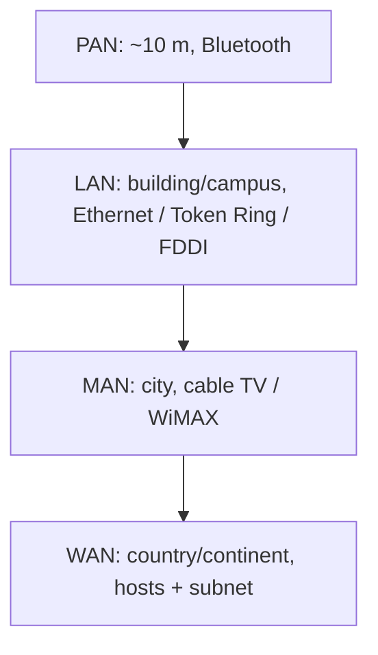

#### Network architecture: two reference models

Two important architectures: **OSI** and **TCP/IP**. Protocols associated with the OSI model are **rarely used anymore**, but the **model itself is still quite general and valid**; features discussed at each layer remain important. Protocols in the **TCP/IP** model are **very widely used**.

#### OSI reference model

ISO's OSI model is based on a proposal developed by the **International Organization for Standardization (ISO)** — a first step toward **international standardization** of communication protocols. **OSI** = **Open Systems Interconnection**. The model is for systems that are **open for interconnection**.

##### Principles that produced seven layers

1. A layer should be created where a **different abstraction** is needed.
2. Each layer should perform a **well-defined function**.
3. The function of each layer should be chosen with an eye toward defining **internationally standardized protocols**.
4. Layer boundaries should be chosen to **minimize information flow across the interfaces**.
5. The number of layers should be **large enough** that distinct functions need not be thrown together in the same layer.

##### Seven layers and data path

From top to bottom: **application, presentation, session, transport, network, data link, physical**. All seven exist at **both transmitter and receiver**.

- **Transmitter:** user data enters at the **application** layer, moves layer by layer down to the **physical** layer, then onto the **transmission medium**.
- **Receiver:** data is received at the **physical** layer and passed layer by layer up to **application**, where the user receives it.

##### PDU nomenclature

| Layer | Data unit name |
|-------|----------------|
| Physical | **Bit** |
| Data link | **Frame** |
| Network | **Packet** |
| Transport | **TPDU** (transport protocol data unit) |
| Session | **SPDU** |
| Presentation | **PPDU** |
| Application | **APDU** |

##### Chained layers vs end-to-end layers

**Two types of layers:**

**Chained layers** — the lower three: **network, data link, physical**. Their protocols are available at **intermediate network devices** as well. These protocols run **between each machine and its immediate neighbors**, not between the ultimate source and destination (which may be separated by many **routers**).

**End-to-end layers** — the upper four: **application, presentation, session, transport**. These protocols are available **only on the end computers**.

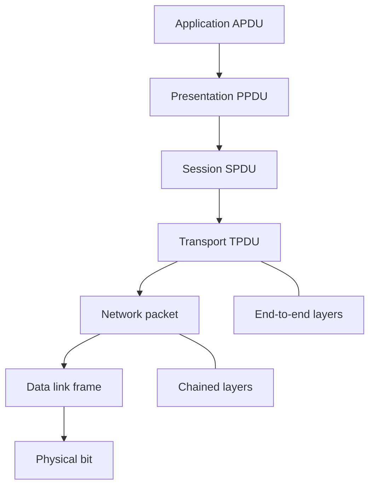

##### Physical layer

Concerned with transmitting **raw bits** over a communication channel. Design issue: when one side sends a **one bit**, the other must receive a **one**, not a **zero**. The layer decides **voltage levels** of bits, **timings** for each bit, **modulation** technique, and related matters. Design issues deal with **mechanical, electrical, bit-timing**, and the **physical transmission medium** below this layer.

##### Data link layer

Main task: turn the raw bit stream into a line that appears **free of undetected transmission errors** to the network layer. The sender **breaks input data into data frames** and transmits frames **sequentially**. If the service is **reliable**, the receiver confirms correct receipt of each frame by sending back an **acknowledgement frame**.

Another issue: keep a **fast transmitter from drowning a slow receiver**. A **traffic-regulation** mechanism is often needed so the transmitter knows how much **buffer space** the receiver has. **Flow control** is this layer's job.

**Broadcast networks** add the issue of **controlling access to the shared channel**. A special sublayer, **MAC (Medium Access Control)**, deals with this problem.

##### Network layer

Controls operation of the **subnet**. A key design issue is determining how packets are **routed** from source to destination. If too many packets are in the subnet at once they get in one another's way, forming **bottlenecks**; **congestion control** belongs to this layer. **Addressing** is also a network-layer job. More generally, **quality of service** is a network-layer issue.

##### Transport layer

Basic function: **accept data from the layer above**, **split it into smaller units** if need be, pass these to the network layer, and ensure that the pieces **all arrive correctly** at the other end. It also determines **what type of service** to provide to the session layer and ultimately to users.

The transport layer is a **true end-to-end layer** all the way from source to destination: a program on the source machine carries on a conversation with a similar program on the destination machine.

##### Session layer

Allows users on different machines to **establish sessions**. Sessions offer:

- **Dialog control**
- **Token management** — to prevent two parties from attempting the **same critical operation at the same time**
- **Synchronization**

##### Presentation layer

Unlike lower layers, which mostly move bits around, presentation is concerned with **syntax and semantics** of the information transmitted. It also takes care of **encoding and decoding** of data.

##### Application layer

Contains a variety of protocols commonly needed by users; it provides the **interface to the user**. One widely used application protocol is **HTTP (Hypertext Transfer Protocol)**, the basis for the **World Wide Web**. Other application protocols are for **file transfer**, **electronic mail**, and **network news**.

#### TCP/IP reference model

The TCP/IP reference model is the network model used in the **current Internet architecture**. Origin in the **1960s** with the grandfather of the Internet, the **ARPANET**, a research network sponsored by the **U.S. Department of Defense**.

**Major design goals:**

- Ability to connect **multiple networks together seamlessly**.
- Ability for connections to **remain intact** as long as the **source and destination machines were functioning**.
- To be built on a **flexible architecture**.

Named after two of its main protocols: **TCP (Transmission Control Protocol)** and **IP (Internet Protocol)**.

**Four layers** (compared with seven in OSI):

| TCP/IP layer | Correspondence as taught |
|--------------|--------------------------|
| **Host-to-network** | Jobs of OSI **data link + physical** |
| **Internet** | Same as OSI **network** |
| **Transport** | Covers OSI **session + transport** (one TCP/IP layer) |
| **Application** | Covers OSI **application + presentation** |

##### Initial protocols and networks (as shown)

**Host-to-network:** ARPANET, satellite, packet radio, and LAN.

**Network (internet) layer:** **IP** — routing, addressing, and congestion control.

**Transport:** **TCP** and **UDP**. TCP is **reliable, connection-oriented**; UDP is **unreliable, connectionless**. Their job is **end-to-end connectivity** and **flow control** between end users.

**Application** (on top of transport): all higher-level protocols. Early ones included **virtual terminal Telnet**, **FTP (File Transfer Protocol)**, and **SMTP** (electronic mail). Added over the years: **DNS** (mapping host names onto network addresses), **NNTP** (moving **Usenet** news articles around), **HTTP** (fetching pages on the World Wide Web), and many others.

#### OSI vs TCP/IP: similarities and differences

**In common:**

- Both are based on a **stack of independent protocols**.
- Layer functionality is **roughly similar**.
- In both, a layer provides an **end-to-end, network-independent transport service** to processes wishing to communicate.
- In both, the layers **above transport** are **application-oriented** users of the transport service.

**Differences:**

| Topic | OSI | TCP/IP |
|-------|-----|--------|
| Number of layers | **Seven** | **Four** |
| Service vs protocol | Clearly distinguishes **service, interface, and protocol** | Did **not originally** clearly distinguish service, interface, and protocol |
| Connection modes | Network layer: **both** connectionless and connection-oriented; transport: **only connection-oriented** | Network layer: **only connectionless**; transport: **both** modes, giving the **user a choice** |

### Key terms

| Term | Meaning in this lecture |
|------|-------------------------|
| Computer network | Autonomous computers interconnected by a single technology, able to exchange information |
| Distributed system | Independent computers appearing as one coherent system (often via middleware) |
| Middleware | Software above the OS that implements the distributed-system illusion |
| PAN / Bluetooth | ~10 m personal interconnection; short-range radio |
| IEEE 802.3 Ethernet | Bus-based broadcast LAN, decentralized control, 10 Mbps–10 Gbps |
| IEEE 802.5 Token Ring | Ring LAN at 4 and 16 Mbps; transmit after capturing a token |
| FDDI | Another ring-network example |
| WiMAX | Wireless MAN technology |
| Head-end | Central MAN point that feeds TV and Internet to homes |
| Subnet | WAN communication lines + switching elements/routers, typically telco/ISP owned |
| OSI | Open Systems Interconnection; ISO seven-layer model |
| Chained layers | Physical, data link, network — hop-by-hop, present on intermediate devices |
| End-to-end layers | Transport through application — only on end computers |
| TPDU / SPDU / PPDU / APDU | PDUs at transport, session, presentation, application |
| MAC | Medium Access Control sublayer: shared-channel access on broadcast networks |
| ARPANET | DoD-sponsored 1960s research network; grandfather of the Internet |
| TCP vs UDP | Reliable connection-oriented vs unreliable connectionless transport |

### Lecture takeaways

- A network interconnects autonomous computers; a distributed system (WWW via middleware) makes them look like one machine.
- Coverage taxonomy: PAN (~10 m, Bluetooth), LAN (Ethernet bus / Token Ring / FDDI), MAN (cable TV, WiMAX, head-end), WAN (customer hosts plus telco/ISP subnet of lines and routers).
- OSI's seven layers follow explicit design principles; PDUs run bit → frame → packet → TPDU → SPDU → PPDU → APDU; lower three layers are chained, upper four are end-to-end.
- Each OSI layer has a distinct job: bits and media; frames, ACK, flow control, MAC; routing, congestion, addressing, QoS; end-to-end TPDUs and service type; sessions (dialog, tokens, sync); syntax/semantics; user protocols (HTTP, mail, news, file transfer).
- TCP/IP is the living Internet model: four layers, ARPANET/DoD goals (internetworking, surviving as long as endpoints live, flexibility), IP plus TCP/UDP plus Telnet/FTP/SMTP/DNS/NNTP/HTTP.
- Shared idea of a protocol stack and transport-to-applications split; OSI has more layers and a cleaner service/interface/protocol split; TCP/IP puts connectionless IP below and lets the user choose TCP or UDP above.


---

# M04: Computer Network Reference Models — TCP/IP Layers Continuation

**Source:** https://www.youtube.com/watch?v=i7nPyb1c-d4
**Instructor / expert:** Dr Yogesh Chaba, Department of Computer Science and Engineering, Guru Jambheshwar University of Science & Technology, Hisar (course coordinator: Dr Maninder Singh, Thapar University, Patiala)

### Learning objectives

- Trace TCP/IP from ARPANET / DARPA (Kahn and Cerf, NCP) to the IETF-maintained Internet protocol suite.
- Map the four TCP/IP layers (and the five-layer hybrid that adds physical) onto OSI, including chained vs end-to-end layers.
- List link-layer tasks (MAC, LLC) and named link protocols: IEEE 802 family, ATM, ARP, NDP, LLTD, PPP.
- State IP's three functions and the internet-layer protocols IP, ICMP, IPsec/IKE, IGMP, and OSPF.
- Contrast TCP and UDP (RFCs, reliability, sockets/ports) and name DCCP, RSVP, TLS/SSL, and SCTP.
- Identify application-layer protocols with their RFCs: Telnet, FTP, SMTP, HTTP, RPC, DNS, SNMP, RTP.

### Core concepts

This second reference-models lecture is devoted to the **TCP/IP reference model**: a brief introduction, then **layered protocol architecture**, then **protocols at each layer**.

#### Introduction: the Internet protocol suite

The **Internet protocol suite**, commonly known as the **TCP/IP reference model**, is the computer-networking model and set of communication protocols used on the **Internet**. It is commonly called TCP/IP because its most important protocols — **TCP (Transmission Control Protocol)** and **IP (Internet Protocol)** — were the **first networking protocols defined in this standard**.

It is the model of the **current Internet architecture**. Origin in the **late 1960s** with the **ARPANET**, a research network sponsored by the **U.S. Department of Defense**; for that reason it was also called the **DoD model**.

**Major design goals** (same trio as the previous lecture):

- Connect **multiple networks together seamlessly**.
- Keep connections **intact as long as source and destination machines are functioning**.
- Build on a **flexible architecture**.

The TCP/IP model and related protocol models are maintained by the **IETF (Internet Engineering Task Force)**.

#### History: DARPA, Kahn, Cerf, NCP

The suite resulted from R&D by **DARPA (Defense Advanced Research Projects Agency)** in the late 1960s. After initiating the pioneering **ARPANET in 1969**, DARPA started work on other data-transmission technologies in **1972**.

**Robert E. Kahn** joined the DARPA **Information Processing Techniques Office**, worked on **satellite packet networks** and **ground-based radio packet networks**, and saw the value of communicating **across both**.

In **spring 1973**, **Vinton Cerf**, developer of the existing ARPANET **Network Control Program (NCP)** protocol, joined Kahn to work on **open-architecture interconnection models** with the goal of designing the **next protocol generation** for ARPANET.

By **summer 1973**, Kahn and Cerf had a fundamental reformulation:

- Differences between network protocols were **hidden** by using a **common internetwork protocol**.
- Instead of the **network** being responsible for reliability (as in ARPANET), the **host** became responsible.

The initial **four computers** on ARPANET grew to **several hundred** by linking universities, research institutes, and military installations over **leased telephone lines**. When technologically different networks (satellite, wireless) connected, the originally implemented protocols were soon **overburdened** by the data-traffic **translation** required from one network to another.

#### Four-layer model and five-layer hybrid

The actual TCP/IP reference model consists of **four layers**, numbered **layer 2 to 5** as shown in the lecture figure. Together with the addition of the **physical layer (layer 1)** they make up the **five-layer hybrid TCP/IP reference model**.

Bottom to top of the four-layer model:

1. **Link layer** (also **host-to-network layer**)
2. **Internet layer**
3. **Transport layer**
4. **Application layer**

| TCP/IP layer | OSI correspondence | Main responsibility as taught |
|--------------|--------------------|-------------------------------|
| Link / host-to-network | OSI **physical + data link** | Secure transmission of data packets of **bit sequences** |
| Internet | OSI **network** | Data communication of two end systems at a given location in a **heterogeneous** communication network |
| Transport | OSI **transport** (same name) | Two user programs on different computers exchange **reliable, connection-oriented** data |
| Application | OSI **session + presentation + application** (layers 5–7) | Interface for actual application programs that wish to communicate |

Unlike ISO OSI, TCP/IP was **not conceived and planned theoretically**; it was **derived from protocols already in practice** on the Internet. ISO OSI protocols were planned theoretically and **adopted before** protocols existed that implemented the layer functions. **Today ISO OSI protocols are no longer used**; TCP/IP protocols developed from practice **dominate the Internet**.

#### Chained vs end-to-end in TCP/IP

**Lower two layers (link and internet)** are **chained layers**. **Upper two layers (transport and application)** are **end-to-end layers**, where **process-to-process** communication takes place.

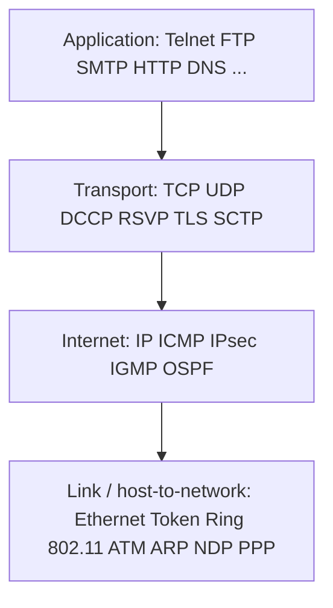

#### Link layer (host-to-network)

Lowest layer of the TCP/IP model. It defines networking methods within the **local network link** on which hosts communicate **without intervening routers**. Primary task: **secure transmission of individual data packets between two adjacent end systems**.

Normally subdivided into:

- **MAC (Medium Access Control) sublayer** — regulates access to **shared channels** with a mechanism of **fair and efficient access** for all participants, including methods for **discovery of collisions or their avoidance** when many participants wish to transmit at once.
- **LLC (Logical Link Control) sublayer** — forms the data-link layer of the LAN; provides **flow control** and **link management**. Data-transmission errors must be **recognized and if possible corrected**. Data is **subdivided into size-limited data packets** as required.

##### Link-layer protocols

Most important protocols of this layer in TCP/IP are based on the **IEEE 802 LAN standard**:

- **Ethernet — IEEE 802.3**
- **Token Ring — IEEE 802.5**
- Different **wireless LAN** technologies — **IEEE 802.11**
- and many more

Also named:

**ATM (Asynchronous Transfer Mode).** A **connection-oriented packet-switching** network protocol that breaks down and forwards data in **cells of a fixed size**. Design idea: carry **time-critical real-time data** (video or audio) **together with regular data** over a **standardized protocol**.

**ARP (Address Resolution Protocol), RFC 826.** Determines the **MAC address** of a host from the **IP address** of the layer above. Needed when an Internet data packet must be delivered on a local network: the receiver's **MAC address** must be determined from the stored **IP address** for forwarding on the LAN.

**NDP (Neighbor Discovery Protocol).** Functions very similar to ARP: explore and discover further hosts in the local network. **NDP was developed for IPv6**; **ARP works under IPv4**.

**LLTD (Link Layer Topology Discovery).** A **proprietary** protocol developed by **Microsoft** for **exploration of the present network topology** and **verification of guaranteed quality of service**.

**PPP (Point-to-Point Protocol).** A simple protocol for the connection between **two network nodes**. Used by the **majority of Internet providers** to offer customers a **dial-up connection over a standard telephone line**.

#### Internet layer

Responsibility: sending packets across **potentially multiple networks** — from the **source network** to the **destination network**.

The **Internet Protocol** performs **three basic functions**:

1. **Host addressing and identification** — a **hierarchical IP addressing** system.
2. **Packet routing** — sending packets from source to destination by forwarding them to the **next network router closer to the final destination**.
3. **Congestion control** — control of traffic congestion.

##### Internet-layer protocols

**IP** is the central protocol. It offers **unreliable, data-packet-oriented, end-to-end** information transmission. It is responsible for **fragmentation and defragmentation** into **IP datagrams**. Two versions exist today: **IPv4** and **IPv6**.

**ICMP (Internet Control Message Protocol)** is implemented in the internet layer. It notifies of **specific errors** during IP transmission and handles further **diagnostic** tasks such as sending **echo requests** to test a computer's **availability** and the necessary **transmission time**. ICMP **sits directly on IP**. Two variations exist: one for **IPv4** and another for **IPv6**.

**IPsec (Internet Protocol Security).** A protocol suite to ensure **secure execution of IP data traffic**. Within a data stream, **IP datagrams can be authenticated and encrypted**. Also included are protocols for handling, establishment, and exchange of **secure cryptographic keys** — **IKE (Internet Key Exchange)**.

**IGMP (Internet Group Management Protocol).** Administers **IP multicast groups** of end systems in a TCP/IP network. Special **multicast routers** administer address lists of end systems that can be addressed commonly via **one multicast address**.

**OSPF (Open Shortest Path First).** A **link-state routing protocol** that transmits IP datagrams within a **single routing domain or autonomous system**. OSPF is the **most widely used routing protocol on the Internet** (as stated).

#### Transport layer

Establishes a basic data channel that an application uses for **task-specific data exchange**. It establishes **process-to-process connectivity** by providing **end-to-end services independent** of the structure of user data and of the logistics of exchanging information for any particular purpose.

The transport protocol establishes a **direct virtual end-to-end communication connection**. To allow **multiple application programs on the same computer**, every application is assigned a **port number** for unique identification on the transport layer. Every unit of data sent must contain the **port number of sender and receiver**. Together with the **IP address**, the port number defines a **network socket** — a unique connection endpoint in the network.

End-to-end message transmission is categorized as:

- **Connection-oriented** — implemented in **TCP**
- **Connectionless** — implemented in **UDP**

##### TCP

**TCP** is a core element of the Internet protocol architecture and the **most popular** transport protocol in the TCP/IP model. Standardized as **RFC 793**. It carries out a **reliable, connection-oriented, bidirectional** data exchange between two end systems and enables establishment of **virtual** connections.

##### UDP

**UDP (User Datagram Protocol)** is the second most prominent transport protocol. Standardized as **RFC 768**. It transmits independent data units known as **datagrams** between application programs on different computers. Transmission is **unreliable**, possibly combined with **data loss**, **proliferation (duplication) of datagrams**, and **changes in sequence**. Datagrams recognized as **false are discarded** by UDP and **do not even reach the receiver**. Compared with TCP, UDP is **clearly less complex**, which shows up as **increased data throughput**, but UDP suffers a **dramatic loss of reliability and security**.

##### Other transport protocols

**DCCP (Datagram Congestion Control Protocol).** A **message-oriented** transport protocol. In addition to **reliably establishing and terminating connections**, it **distributes overload notifications**. It provides **overload / congestion control** and can be used for **negotiation of transmission parameters**.

**RSVP (Resource Reservation Protocol).** Used to **request and reserve network resources** using IP to transmit data streams. It is **not intended for the actual data transport** and bears a similarity to **ICMP** and **IGMP** at the internet layer. RSVP can be implemented by **end systems as well as routers** without having to reserve and maintain specified **service qualities**.

**TLS (Transport Layer Security)** / **SSL (Secure Sockets Layer).** Cryptographic protocols for **secure data transport** on the Internet. Individual **TCP segments are encrypted** by TLS and SSL. They provide protocols for **negotiation of transmission parameters**, **exchange of cryptographic keys**, **authentication**, **encryption**, and **digital signature**. (SSL is the historical predecessor; TLS is the successor used for the same role.)

**SCTP (Stream Control Transmission Protocol).** A proposal for a **highly scalable and performance** version of original TCP: **reliable, connection-oriented**, and specialized in transmitting **large amounts of data**.

#### Application layer

Functions map onto **OSI layers 5 to 7**. Primarily an **interface** for application programs wishing to communicate over the network.

| Protocol | RFC as taught | Role |
|----------|---------------|------|
| **Telnet** (Teletype Network) | **RFC 854** | Interactive **bidirectional** communication to a remote computer through a **command-line interface** |
| **FTP** (File Transfer Protocol) | **RFC 959** | Transmission and manipulation of data between two computers on a TCP/IP network; **client–server**: client initiates and requests; server accepts and answers |
| **SMTP** (Simple Mail Transfer Protocol) | **RFC 821** | Simple structured protocol for **electronic mail** on the Internet |
| **HTTP** (Hypertext Transfer Protocol) | **RFC 2616** | Data transmission on the **World Wide Web**; client–server; based on **reliable TCP** |
| **RPC** (Remote Procedure Call) | **RFC 1057** and **RFC 5531** | Interprocess communication: a program **calls an external subroutine** located in **another addressing area** |
| **DNS** (Domain Name System) | (named, no RFC number given) | Name and directory service: assignment of **readable system names to IP addresses** for participating Internet systems |
| **SNMP** (Simple Network Management Protocol) | **RFC 3411** (taught as “341 RFC”) | Helps network-management systems **monitor, administer, and control** individual systems on the network |
| **RTP** (Real-time Transport Protocol) | **RFC 1889** | Transmission of **real-time audio and video** over the Internet |

### Key terms

| Term | Meaning in this lecture |
|------|-------------------------|
| Internet protocol suite / TCP/IP | Model and protocols of the Internet; named for TCP and IP |
| DoD model | Alternate name because ARPANET was DoD-sponsored |
| IETF | Body that maintains TCP/IP and related models |
| DARPA | Agency whose late-1960s R&D produced the suite |
| NCP | ARPANET Network Control Program; Cerf was its developer |
| Five-layer hybrid | Four TCP/IP layers plus an explicit physical layer 1 |
| MAC / LLC | Shared-medium access vs flow control, link management, error handling, packet sizing |
| ATM | Fixed-size cells; mix real-time audio/video with regular data |
| ARP / NDP | IP→MAC mapping for IPv4 vs IPv6 neighbor discovery |
| LLTD | Microsoft proprietary topology / QoS discovery |
| PPP | ISP dial-up over a telephone line between two nodes |
| IP | Unreliable datagram forwarding; fragmentation; IPv4 and IPv6 |
| ICMP | Errors and diagnostics (echo) sitting on IP |
| IPsec / IKE | Authenticate/encrypt IP datagrams; key exchange |
| IGMP | IP multicast group administration |
| OSPF | Link-state IGP inside one AS; called the most widely used Internet routing protocol here |
| Socket | IP address + port = unique connection endpoint |
| RFC 793 / RFC 768 | TCP / UDP standards |
| DCCP / RSVP / SCTP | Congestion-aware datagrams; resource reservation; scalable stream TCP-like transport |
| TLS / SSL | Encrypt TCP segments; keys, auth, encryption, signatures |

### Lecture takeaways

- TCP/IP is a practice-first, IETF-maintained DoD/ARPANET descendant: Kahn and Cerf hid network differences behind a common internet protocol and moved reliability from the network to the **host** (replacing NCP).
- Four layers (or five if physical is drawn separately): link and internet are chained; transport and application are end-to-end process communication. OSI protocols were designed first and are unused; TCP/IP dominates.
- Link layer is local (no routers): IEEE 802 (Ethernet, Token Ring, 802.11), ATM cells, ARP (IPv4) vs NDP (IPv6), Microsoft LLTD, and ISP PPP dial-up.
- Internet layer: hierarchical addressing, hop-by-hop routing, congestion control — IP (unreliable, fragmenting, v4/v6), ICMP, IPsec+IKE, IGMP multicast, OSPF inside an AS.
- Transport: ports and sockets; TCP (RFC 793, reliable bidirectional) vs UDP (RFC 768, fast, lossy, unordered); also DCCP, RSVP, TLS/SSL, SCTP.
- Application is the OSI 5–7 interface: Telnet, FTP, SMTP, HTTP, RPC, DNS, SNMP, RTP, several explicitly tied to RFCs and to client–server over TCP.


---

# M05: Protocol Stack

**Source:** https://www.youtube.com/watch?v=KanyeVKL6cs
**Instructor / expert:** Dr Navdeep Singh, Department of Computer Engineering, Punjabi University Patiala (course coordinator: Dr Maninder Singh, Thapar University, Patiala)

### Learning objectives

- Distinguish a protocol **suite** (definition) from a protocol **stack** (software implementation) and state why layered modules exist.
- Recite the five OSI layering principles (including ISO 7498) and describe encapsulation/decapsulation (headers, Layer-2 trailer, physical signals).
- List services of each of the seven OSI layers, with named mechanisms (baud rate, line codes, CSMA/CD, IP/ICMP/IGMP/IPsec, TCP vs UDP, session beans, etc.).
- Describe the four TCP/IP layers and early applications Telnet, FTP, SMTP, and DNS (including the Yahoo name-to-address example).
- State the lecture's listed merits and demerits of TCP/IP.

### Core concepts

After this lesson students should understand the **need for protocols and standards** and be able to **identify various protocols at different layers** of the protocol stack.

#### Suite vs stack

The **protocol stack** is an **implementation** of a computer-networking **protocol suite**. The terms are often used interchangeably, but:

- The **suite** is the **definition** of the protocols.
- The **stack** is the **software implementation** of them.

A protocol stack is a **complete set of network protocol layers** that work together to provide networking capabilities. It is called a **stack** because it is typically designed as a **hierarchy of layers**, each **supporting the one above it** and **using those below it**.

Individual protocols within a suite are often designed with a **single purpose**. This **modularization** makes design and evaluation easier because each protocol module usually communicates with **two others**. They are commonly imagined as layers in a stack. The **lowest protocol always deals with low-level physical interaction of the hardware**. Every higher layer **adds more features**. User applications usually deal only with the **topmost layers**.

#### Practical three-section split and OS interfaces

In practical implementation, protocol stacks are often divided into three major sections: **media**, **transport**, and **applications**. A particular OS or platform will often have **two well-defined software interfaces**:

1. Between the **media and transport** layers.
2. Between the **transport layers and applications**.

The **media-to-transport** interface defines how transport-protocol software uses particular **media and hardware types** — e.g. how **TCP/IP transport software talks to Ethernet hardware**.

The **application-to-transport** interface defines how application programs use the transport layers — e.g. how a **web-browser program talks to TCP/IP transport software**.

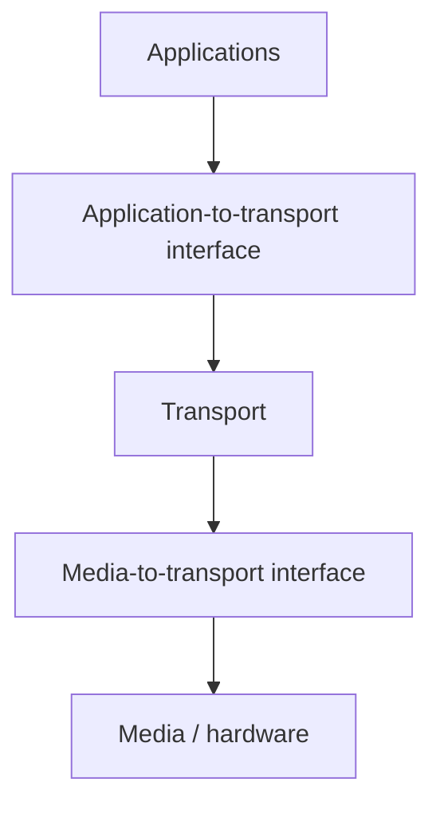

#### OSI model

**OSI** = **Open Systems Interconnection** model. It is a **conceptual model** that characterizes and standardizes the communication functions of a telecommunication or computing system **without regard to underlying internal structure and technology**. Goal: **interoperability** of diverse communication systems with **standard protocols**. The model partitions a communication system into **abstraction layers**. The original version defines **seven layers**.

It is a product of the Open Systems Interconnection project at the **International Organization for Standardization**, maintained as **ISO 7498**.

##### Principles used to arrive at seven layers

1. A layer should be created where a **different abstraction** is needed.
2. Each layer should perform a **well-defined function**.
3. The function of each layer should be chosen with an eye toward defining **internationally standardized protocols**.
4. Layer boundaries should be chosen to **minimize information flow across the interfaces**.
5. The number of layers should be **large enough** that distinct functions need not be thrown together in the same layer out of necessity, and **small enough** that the architecture does not become **unwieldy**.

##### Encapsulation and exchange of data

Data units are labeled **D7** at layer 7, **D6** at layer 6, and so on. The process starts at **layer 7 (application)** and moves **descending** through the layers. At each layer a **header**, or possibly a **trailer**, can be added. Commonly the **trailer is added only at layer 2**.

When the formatted data unit passes through the **physical layer**, it is changed into an **electromagnetic signal** and transported along a **physical link**.

At the destination the signal enters **layer 1** and is transformed back into **digital form**. Data units move **back up**. As each block reaches the next higher layer, the **headers and trailers** attached at the corresponding sending layer are **removed** and actions appropriate to that layer are taken. By the time it reaches **layer 7**, the message is again in a form appropriate to the application and is made available to the **recipient**.

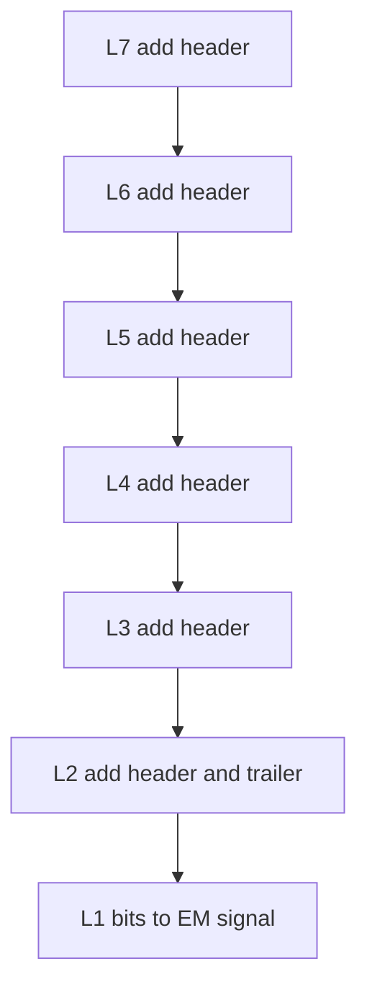

#### Physical layer (layer 1)

First and lowest layer. It **coordinates the functions required to carry a bitstream over a physical medium**. It deals with **mechanical and electrical specifications** of the interface and transmission medium, and defines **procedures and functions** that physical devices and interfaces must perform for transmission to occur.

**Services / topics taught:**

**Symbol rate (baud rate) and modulation rate.** Number of **symbol changes**, waveform changes, or signaling events across the medium per time unit, using a digitally modulated signal or a **line code**. Measured in **baud** or **symbols per second**. For a line code, the symbol rate is the **pulse rate** in **pulses per second**.

**Standardized interface to physical media**, including:

- Mechanical specifications of **electrical connectors and cables** (e.g. **maximum cable length**).
- Electrical specifications of the transmission line: **signal level** and **impedance**.
- **Radio interface**: electromagnetic spectrum, **frequency allocation**, **signal strength**, analog **bandwidth**, etc.
- Specifications for **IR over optical fiber** or a **wireless IR** communication link.

**Modulation.** Process of **varying one or more properties** of a periodic waveform (the **carrier signal**) with a **modulating signal** that typically contains the information. A **modulator** performs modulation; a **demodulator** performs the inverse; a **modem** can perform **both**.

**Line coding.** Representing the digital signal by a waveform **optimally tuned** for the physical channel and receiving equipment. The pattern of **voltage, current, or photons** used to represent digital data on the link is **line encoding**. Common types: **unipolar, polar, bipolar, and Manchester**. After line coding, the signal is put through a physical channel — a **transmission medium** or a **data-storage medium**.

**Bit synchronization.** Sender and receiver must use the **same bit rate** and be **synchronized at the bit level** (clocks synchronized).

**Line configuration.** How devices connect to the media:

- **Point-to-point** — two devices, **dedicated** link.
- **Multipoint** — a link **shared** among several devices.

**Physical topology.** How devices are connected to make a network.

**Transmission mode.** Direction of transmission between two devices: **simplex, half duplex, or full duplex**.

#### Data link layer (layer 2)

Transfers data between **adjacent network nodes** in a WAN or between nodes on the **same LAN segment**. Provides functional and procedural means to transfer data between network entities and **might detect and possibly correct errors** that occur in the physical layer.

**Services:**

**Framing.** A **frame** is the **PDU at the data link layer** — the result of the **final layer of encapsulation** before transmission over the physical layer. A frame is a unit of transmission in a link-layer protocol and consists of a **link-layer header followed by a packet**.

**Physical addressing.** If frames are distributed to different systems, the data-link layer adds a header defining **sender or receiver**. If the frame is intended for a system **outside the sender's network**, the receiver address is the address of the **device that connects this network to the next one**.

**Flow control.** Managing the rate of data transmission so a **fast sender does not overwhelm a slow receiver**. The receiver can control transmission speed.

**Error control.** Lets the receiver inform the sender if a frame is **lost or damaged** and coordinates **retransmission**. Error control here is based on **ARQ (automatic repeat request)**: whenever an error is detected, specified frames are retransmitted.

**Logical Link Control (LLC).** Functions required to **establish and control logical links** between local devices. Usually considered a **DLL sublayer**. It provides services to the **network layer above** and **hides the rest of the data-link details** so different technologies work seamlessly with higher layers. Most LAN technologies use the **IEEE 802.2 LLC** protocol.

**Media Access Control (MAC).** Procedures devices use to **control access to the network medium**. Many networks use a **shared medium** (a single cable, or cables electrically connected into one virtual medium), so rules are needed to **avoid conflicts**. Example: **Ethernet uses CSMA/CD**; **Token Ring uses token passing**.

#### Network layer (layer 3)

Responsible for **packet forwarding**, including **routing through intermediate routers**. It knows addresses of neighboring network nodes and also manages **quality of service**.

**Services:**

**Logical addressing.** Every communicating device has a **logical (layer-3) address**. On the Internet, **IP** is the network-layer protocol and every machine has an **IP address**.

**Routing.** Moving data across a series of interconnected networks is the defining function. Devices and software at this layer handle incoming packets from various sources and determine their **final destination**.

**Datagram encapsulation.** Messages from higher layers are placed into **datagrams (also called packets)** with a **network-layer header**.

**Fragmentation and reassembly.** Some data-link technologies **limit message length**. If a packet is too large, the network layer **splits** it, sends each piece to the data-link layer, and has pieces **reassembled** at the destination network layer.

**Error handling and diagnostics.** Special protocols let devices that are logically connected, or that are trying to route traffic, **exchange status** about hosts or about themselves.

**Network-layer protocols named:** **ICMP** (Internet Control Message Protocol), **IGMP** (Internet Group Management Protocol), **IPsec** (Internet Protocol Security), **IPv4** and **IPv6**.

#### Transport layer

Called the **host-to-host transport layer** in the TCP/IP model. Data is encapsulated in a **transport-layer PDU** and sent to the network layer. **Network-layer nodes transfer the transport PDU intact without decoding or modifying its content**, so only **peer transport entities** actually communicate using the transport protocol's PDUs.

Services: **connection-oriented data stream**, **reliability**, **flow control**, and **multiplexing**.

**Connection-oriented communication.** Often easier for an application to interpret a connection as a **data stream** than to deal with underlying **connectionless** models such as the **datagram model of UDP and of IP**.

**Same-order delivery.** The network layer generally does **not** guarantee packets arrive in the order sent. Order is usually restored by **segment numbering**, with the receiver passing data to the application **in order**.

**Reliability.** Packets may be lost due to **congestion and errors**. With an error-detection code such as a **checksum**, the transport protocol may check that data is not corrupted and verify **correct receipt** by sending an **ACK or NACK**. **ARQ** schemes may retransmit lost or corrupted data.

**Flow control.** Rate must sometimes be managed so a fast sender does not transmit more than the receiving buffer can support (**buffer overrun**). It can also improve efficiency by reducing **buffer underrun**.

**Congestion avoidance.** Congestion control limits traffic entering a telecommunications network to avoid **congestive collapse**, avoiding oversubscription of processing or link capabilities of intermediate nodes, including reducing the send rate. Example: **ARQ may keep the network in a congested state**; this is avoided by adding congestion avoidance to flow control, including **slow start**, which keeps bandwidth consumption **low at the beginning of a transmission or after packet retransmission**.

**Multiplexing.** **Ports** provide multiple endpoints on a single node. Analogy: the **name on a postal address** multiplexes different recipients at the same location. Applications listen on their own ports so more than one network service can run at once. Multiplexing via ports is part of the **transport layer in TCP/IP** but of the **session layer in OSI**.

##### TCP

**Transmission Control Protocol** is **connection-oriented**: a connection is established and maintained until the application programs at each end have **finished exchanging messages**. It determines how to **break application data into packets** that networks can deliver, **sends packets to and accepts packets from** the network layer, **manages flow control**, and because it is meant to provide **error-free** transmission it handles **retransmission of dropped or garbled packets** as well as **acknowledgement of all packets that arrive**.

##### UDP

**User Datagram Protocol** is a transport protocol defined for use with the **IP** network-layer protocol. It provides a **best-effort datagram** service to an end system: **unreliable**, **no guarantees for delivery**, **no protection from duplication**. Simplicity **reduces overhead**; the service may be adequate in many cases.

UDP provides **minimal, unreliable, best-effort message-passing** to applications and upper-layer protocols. Compared with other transport protocols, **UDP and its UDP-Lite variant** are unique in that they **do not establish end-to-end connections**. Consequently they do not incur **connection establishment and tear-down overheads**, and there is **minimal associated end-system state**. That can be a **very efficient** transport for some applications, but UDP has **no inherent congestion control or reliability**.

On many platforms applications can send UDP datagrams at the **line rate of the link interface**, often much greater than available **path capacity**, which would **contribute to congestion**. Applications therefore need to be **designed responsibly**.

#### Session layer

Provides mechanisms for **opening, closing, and managing a session** between end-user application processes — a **semi-permanent dialogue**. Communication sessions consist of **requests and responses** between applications. Session-layer services are commonly used in environments that make use of **remote procedure calls (RPC)**.

**Services named:** (1) **authentication**, (2) **authorization**, (3) **session restoration**.

The OSI session layer is responsible for **session checkpointing and recovery**. It allows information of different streams, perhaps from different sources, to be properly **combined or synchronized**.

**Examples:**

- **Session beans** — active only as long as the session is active and **deleted when the session is disconnected**. Developers can use them to **store information about the user during a web session**.
- **Web conferencing** — audio and video streams must be synchronous to avoid **lip-sync problems**; flow control ensures the person displayed is the **current speaker**.
- **Live TV** — audio and video streams need to be **seamlessly merged and transitioned** to avoid **silent air time** or **excessive overlap**.

#### Presentation layer

Primary goal: **syntax and semantics** of information exchanged. It ensures data is sent so the receiver will **understand and use** it. If the two systems' **language syntax** differs, presentation plays the role of **translator**.

**Functions:**

**Translation.** Before transmission, characters and numbers should be changed to **bit frames**. The layer is responsible for **interoperability between encoding methods** because different computers use different encodings: it translates between the format the **network** requires and the format the **computer** uses.

**Encryption.** Encryption at the transmitter and **decryption** at the receiver.

**Compression.** Data compression to **reduce the bandwidth** of data to be transmitted — reduce the **number of bits**. Important when transmitting **multimedia** (audio, video, text, etc.).

#### Application layer

Topmost OSI layer. **Manipulation of data** in various ways so that **users or software get access to the network**. Services include **email**, **transferring files**, **distributing results to the user**, **directory services**, and **network resources**.

**Functions:**

**Mail services.** Basis for **email forwarding and storage**.

**Network virtual terminal.** Allows a user to **log on to a remote host**. The application creates a **software emulation of a terminal** at the remote host; the user's computer talks to that software terminal, which talks to the host, and vice versa. The remote host believes it is communicating with **one of its own terminals** and allows the logon.

**Directory services.** Access for **global information about various services**.

**File transfer, access, and management.** Standard mechanism to **access and manage files**. Users can access files on a remote computer, manage them, and **retrieve** files from a remote computer.

#### TCP/IP reference model (in this lecture)

The model used in the current Internet architecture, named after **TCP** and **IP**. Developers chose to build a **packet-switched network** based on a **connectionless internetwork layer**.

**Host-to-network (physical) layer.** TCP/IP does **not specify in any great detail** the operation of this layer except that the host has to **connect to the network using some protocol** so it can send **IP packets** over it.

**Network (internet) layer.** Inject packets into any network and have them **travel independently** to the destination. Defines **IP** as official packet format and protocol. **Packet routing** is a major job.

**Transport layer.** Interface between the application layer and the complex hardware of the network. Designed so **peer entities** of source and destination hosts can carry on conversations. Data may be **user data or control data**. Two modes: **full duplex** (both sides transmit and receive **simultaneously**) and **half duplex** (a side can only send **or** receive at one time). Any application-layer program can send using **TCP or UDP**; both communicate with **IP** in the internet layer. Communication is **two-way**: applications can **read and write** to the transport layer.

**Application layer.** The original TCP/IP specification described several applications at the top of the stack: **Telnet, FTP, SMTP, and DNS**.

- **Telnet** supports the Telnet protocol over **TCP**: a general **two-way** communication protocol to connect to another host and **run applications on that host remotely**.
- **FTP** was originally designed to **promote sharing of files** among users. It **shields the user from variations of file storage on different architectures** and allows **reliable and efficient** transfer.
- **SMTP (Simple Mail Transfer Protocol)** transports electronic mail from one computer to another **through a series of other computers along the road**.
- **DNS** resolves the **numerical address** of a network node into its **textual name or vice versa**. Example: it would translate **www.yahoo.com** to **204.71.177.71** to allow routing protocols to find the host the packet is destined for.

#### Merits of TCP/IP (as listed)

1. It **operates independently**.
2. It is **scalable**.
3. **Client–server architecture**.
4. **Supports a number of routing protocols**.
5. Can be used to **establish a connection between two computers**.

#### Demerits of TCP/IP (as listed)

1. The transport layer does **not guarantee delivery of packets**.
2. The model **cannot be used in any other application**.
3. **Replacing protocols is not easy**.
4. It has **not clearly separated its services, interfaces, and protocols**.

### Key terms

| Term | Meaning in this lecture |
|------|-------------------------|
| Protocol suite | Definition of the protocols |
| Protocol stack | Software implementation of the suite; hierarchy of layers |
| ISO 7498 | Identifier of the OSI model standard |
| D7…D1 | Data units at OSI layers 7 down to 1 |
| Baud / symbol rate | Symbol (or pulse) changes per second on the medium |
| Modem | Device that both modulates and demodulates |
| Line encoding | Unipolar, polar, bipolar, Manchester patterns of voltage/current/photons |
| Simplex / half / full duplex | One-way; either direction but not both at once; both at once |
| Frame | DLL PDU: link header + packet; trailer typically only here |
| ARQ | Retransmit specified frames when errors are detected |
| IEEE 802.2 LLC | Common LAN logical-link protocol |
| CSMA/CD vs token passing | Ethernet MAC vs Token Ring MAC |
| Slow start | Congestion avoidance that starts (or restarts after loss) at low rate |
| UDP-Lite | Lightweight UDP variant; still connectionless, no inherent congestion control |
| Session beans | Session-scoped objects deleted when the web session disconnects |
| Network virtual terminal | Emulated terminal so a remote host accepts a logon |
| www.yahoo.com → 204.71.177.71 | DNS example given in the lecture |

### Lecture takeaways

- A suite is the specification; a stack is the running layered software, often split into media / transport / applications with two OS interfaces (e.g. TCP/IP ↔ Ethernet, browser ↔ TCP/IP).
- OSI (ISO 7498) uses seven abstraction layers with explicit design rules; data grows headers (and a layer-2 trailer) going down, becomes an EM signal, and is unwrapped going up.
- Physical: bits, baud, connectors, radio/IR, modulation/modems, line codes, bit sync, point-to-point vs multipoint, topology, duplex modes.
- Data link: frames, hardware addresses, flow control, ARQ, LLC (802.2), MAC (CSMA/CD vs token passing).
- Network: logical IP addresses, routing, datagrams, fragmentation, ICMP/IGMP/IPsec/IPv4/IPv6.
- Transport PDUs traverse the network unmodified; TCP is a reliable connection; UDP/UDP-Lite are cheap and connectionless — applications must not blast at line rate. Ports multiplex (OSI would put that in session).
- Session (auth, authorization, restoration, checkpointing; session beans, lip-sync, live TV), presentation (translate, encrypt, compress), application (mail, virtual terminal, directories, FTAM).
- TCP/IP: underspecified host-to-network, connectionless IP, TCP or UDP (full or half duplex), Telnet/FTP/SMTP/DNS on top. Merits: independence, scale, client–server, many routing protocols, can connect two computers. Demerits: transport does not always guarantee delivery, poor reuse in other applications, hard protocol replacement, fuzzy service/interface/protocol split.


---

# M06: Transmission Control Protocol

**Source:** https://www.youtube.com/watch?v=9bKXrX4lz6g
**Instructor / expert:** Dr Yogesh Chaba, Department of Computer Science and Engineering, Guru Jambheshwar University of Science & Technology, Hisar (course coordinator: Dr Maninder Singh, Thapar University, Patiala)

### Learning objectives

- Place TCP in the Cerf–Kahn 1974 internetworking paper and in RFC 793 / 1122 / 1323.
- Explain reliable stream delivery: segments, acknowledgements, timers, retransmission, and nesting TPDU ⊂ packet ⊂ frame.
- Define sockets, TSAPs/ports (including well-known ports below 1024 and IANA), and TCP's full-duplex, point-to-point, byte-stream service.
- Walk the 20-byte TCP header field by field (ports, seq/ack, data offset, flags, window, checksum, urgent pointer, options).
- Use socket primitives and the three-way handshake (plus simultaneous-open collision and FIN release / two-army timers).
- Apply variable-size sliding-window flow control, including a zero window and the one-byte probe that prevents deadlock.

### Core concepts

TCP is used for **connection-oriented transmission at the transport layer** for **end-to-end connectivity** of computers. Contents: brief introduction, **TCP header**, then **connection management and flow control**.

#### Foundation (1974) and split into TCP + IP

The foundation of TCP was laid in **May 1974** when the **IEEE (Institute of Electrical and Electronics Engineers)** published a paper entitled **"A Protocol for Packet Network Intercommunication."** Authors **Cerf and Kahn** described an internetworking protocol for sharing resources using **packet switching** among nodes. A central control component of that model was the **transmission control program (TCP)** that incorporated both **connection-oriented links** and **datagram services** between hosts.

That transmission control program was later divided into a modular architecture:

- **Transmission Control Protocol** at the **connection-oriented** layer
- **Internet Protocol** at the **internet** layer

The model became known informally as **TCP/IP**, and formally as the **Internet protocol suite**.

#### Reliable stream delivery

TCP is a **reliable stream delivery service** that **guarantees that all bytes received will be identical with bytes sent and in the correct order**. The fundamental technique: the receiver **responds with an acknowledgement** as it receives data. The sender **keeps a record of each packet it sends** and **maintains a timer** from when the packet was sent; it **retransmits** if the timer expires before the message is acknowledged. The timer is needed in case a packet gets **lost or corrupted**.

TCP was formally defined in **RFC 793**. Over time various errors and inconsistencies were detected and requirements changed; clarifications and bug fixes are detailed in **RFC 1122**. Extensions are given in **RFC 1323**.

While **IP handles actual delivery** of the data, **TCP keeps track of the individual units of data transmission called segments**. The internet layer **encapsulates each TCP segment into an IP packet** by adding an IP header that includes the **destination IP address**. When they arrive, the destination TCP layer **reassembles** the individual segments and ensures they are **correctly ordered and error-free**.

For messages sent from the transport layer the lecture uses the acronym **TPDU (transport protocol data unit)**. TPDUs exchanged by the transport layer are contained in **packets** at the network layer; packets are contained in **frames** at the data-link layer.

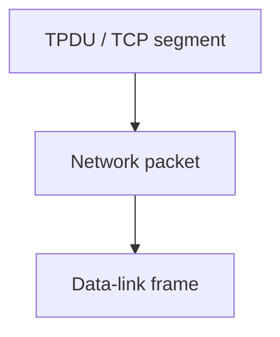

#### Sockets, ports, TSAPs

TCP service is obtained by sender and receiver creating endpoints called **sockets**. Each socket has a **socket number** consisting of the **IP address of the host** and a **16-bit number local to that host** called a **port**. A port is the TCP name for a **transport service access point (TSAP)**.

A socket may be used for **multiple connections at the same time**: two or more connections may terminate at the same socket. Connections are identified by the **socket identifiers at both ends** (socket 1, socket 2). **No virtual-circuit numbers or other identifiers** are used.

**Port numbers below 1024** are **well-known ports**, reserved for **standard services**. The **IANA (Internet Assigned Numbers Authority)** maintains official assignments of port numbers for specific uses.

Well-known / listed ports from the lecture table (ASR “Port 0 for HTTP” corrected to **80**):

| Port | Protocols mentioned | Service |
|------|---------------------|---------|
| **20** | TCP and UDP | **FTP** data transfer |
| **23** | TCP and UDP | **Telnet** |
| **25** | TCP and UDP | **SMTP** (email) |
| **53** | TCP and UDP | **DNS** |
| **69** | (as listed) | **TFTP** (Trivial File Transfer Protocol) |
| **80** | TCP, SCTP, and UDP | **HTTP** |
| **107** | TCP and UDP | Remote Telnet service protocol |
| **109** | TCP and UDP | **POP2** (Post Office Protocol v2) |
| **110** | TCP and UDP | **POP3** |
| **115** | TCP | Simple File Transfer Protocol |
| **119** | TCP | **NNTP** (Network News Transfer Protocol) |
| **143** | TCP | **IMAP** |
| **220** | TCP and UDP | **IMAP** |
| **500** | TCP and UDP | **ISAKMP** (Internet Security Association and Key Management Protocol) |
| **530** | TCP and UDP | **RPC** |
| **554** | TCP and UDP | **RTSP** (Real Time Streaming Protocol) |
| **587** | TCP | Email message submission (**SMTP**) |
| **698** | UDP | **OLSR** (Optimized Link State Routing) |
| **953** | TCP and UDP | DNS **RNDC** service |
| **995** | TCP | **POP3** (as listed for this port) |

#### Service properties

Connections are **full duplex** and **point-to-point**:

- **Full duplex** — traffic can go in **both directions at the same time**.
- **Point-to-point** — each connection has **exactly two endpoints**. TCP does **not support multicasting or broadcasting**.

A TCP connection is a **byte stream, not a message stream**. **Message boundaries are not preserved end to end.** Example: if the sending process does **four 512-byte writes** to a TCP stream, the data may be delivered as four 512-byte chunks, **two 1024-byte** chunks, **one 2048-byte** chunk, or some other way. The receiver **cannot detect the unit in which the data were written**.

Figure A: four 512-byte segments sent as **separate IP datagrams**. Figure B: **2048 bytes** of data delivered to the application in a **single read** call.

#### TCP segment header

Every segment begins with a **fixed-format 20-byte header**. The fixed header may be followed by **header options**. After the options, if any, up to

**65535 − 20 − 20 = 65495** data bytes

may follow, where the first 20 is the **IP header** and the second 20 is the **TCP header**. **Segments without any data are legal** and commonly used for **acknowledgements and control messages**.

##### Header fields

**Source port and destination port** identify the local endpoints of the connection. A port plus its host IP address forms a **48-bit unique endpoint**. The source and destination endpoints together identify the connection.

**Sequence number** and **acknowledgement number** perform their usual functions for delivery confirmation. The acknowledgement number specifies the **next byte expected**, **not** the last byte correctly received. Both fields are **32 bits** long because **every byte of data is numbered** in a TCP stream.

**TCP header length (data offset)** tells how many **32-bit words** are in the TCP header. Needed because the **options field is of variable length**. Technically it indicates the **start of the data** within the segment, measured in 32-bit words — which is just the header length in words.

Next comes a **six-bit field that is not used**, then **six 1-bit flags**:

| Flag | Meaning as taught |
|------|-------------------|
| **URG** | Set to 1 if the **urgent pointer** is in use. The urgent pointer is a **byte offset from the current sequence number** at which urgent data are found. |
| **ACK** | Set to 1 to indicate the **acknowledgement number is valid**. If ACK is 0, the segment does not contain an acknowledgement, so the ACK-number field is **ignored**. |
| **PSH** | **Pushed** data: the receiver is requested to **deliver data to the application upon arrival** and **not buffer** it until a full buffer has been received. |
| **RST** | **Reset** a connection that has become confused due to a **host crash** or some other reason. |
| **SYN** | Used to **establish connections**. Connection **request**: SYN=1, ACK=0 (piggyback acknowledgement field not in use). Connection **reply**: SYN=1, ACK=1. SYN denotes request vs accepted; **ACK distinguishes** the two possibilities. |
| **FIN** | Used to **release** a connection: the sender has **no more data to transmit**. |

**Window size.** Flow control in TCP uses a **variable-sized sliding window**. This field tells how many bytes may be sent **starting at the byte acknowledged**.

**Checksum.** Provided for extra reliability. It checksums the **header**, the **data**, and the conceptual **pseudo-header**.

#### Socket primitives

Socket primitives are widely used for **Internet programming**.

**Server side:**

1. **socket** — creates a new communication endpoint. Newly created sockets do **not** have network addresses.
2. **bind** — attach a **local address** to a socket.
3. **listen** — announce willingness to accept connections and **allocate space to queue incoming calls** in case several clients try to connect at once.
4. **accept** — **block** waiting for an incoming connection.

**Client side:** a socket must first be created with **socket**, but **bind is not required** because the address used **does not matter to the server**. **connect** **blocks** the caller and **actively starts** the connection process. When the appropriate TPDU is received from the server, the client is unblocked and the connection is established.

Both sides then use **send** or **receive** over the full-duplex connection.

**Connection release** with sockets is **symmetric**: when **both sides** have executed a **close** primitive, the connection is released.

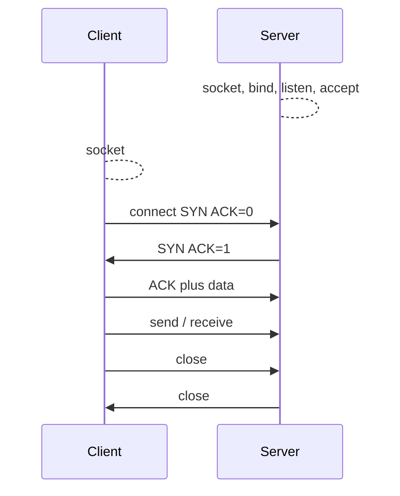

#### Connection establishment: three-way handshake

Connections are established by a **three-way handshake**. One side (the **server**) **passively** waits by executing **listen** and **accept**. The other side (the **client**) executes **connect**.

**connect** sends a TCP segment with **SYN on and ACK off**, then waits. When this segment arrives, the TCP entity checks whether a process has done a **listen** on the **destination port**. If **not**, it sends a reply with the **RST** bit on to **reject** the connection. If some process is listening, that process is given the incoming segment and can **accept or reject**. If it accepts, an **acknowledgement segment** is sent back.

**Normal case (as numbered in the lecture):**

- Host 2 receives **SYN with seq = X**.
- Host 2 returns **SYN with seq = Y** and **ACK = X+1**.
- Host 1 sends data with **seq = X+1** and **ACK = Y+1**.

**Simultaneous open.** If two hosts **simultaneously** attempt to establish a connection between the **same two sockets**, a **collision** occurs (illustrated in the lecture's Figure B).

#### Connection release

Either party can send a TCP segment with **FIN** set, meaning it has no more data to transmit. When the FIN is **acknowledged**, **that direction is shut down for new data**. Data may continue to flow **indefinitely in the other direction**. When **both directions** have been shut down, the connection is released.

Normally **four TCP segments** are needed: one FIN and one ACK **for each direction**. It is possible for the **first ACK and the second FIN** to be contained in the **same segment**, reducing the total to **three**.

To avoid the **two-army problem**, **timers** are used. If a response to a FIN is not forthcoming within **two maximum packet lifetimes**, the **sender of the FIN releases the connection**. The other side will eventually notice that nobody seems to be listening anymore and will **time out as well**.

#### Window management / flow control (worked example)

Window management in TCP is **not directly tied to acknowledgements** as it is in most data-link protocols.

**Step 1.** Receiver has a **4096-byte** buffer. Sender transmits a **2048-byte** segment with **sequence = 0**. It is received correctly.

**Step 2.** Receiver acknowledges. With only **2048 bytes** of buffer space left, it advertises a window of **2048** starting at the next byte expected, with **ACK = 2048**.

**Step 3.** Sender transmits another **2048 bytes** with **sequence = 2048**. Receiver buffer is now **full**.

**Step 4.** Acknowledged with **ACK = 4096** and **WIN = 0**. The sender **must stop** until the application on the receiving host has **removed some data from the buffer**, at which point TCP can advertise a larger window.

**When the window is zero**, the sender may not normally send segments, with **two exceptions**:

1. **Urgent data** may be sent — e.g. to allow the user to **kill the process** running on the remote machine.
2. The sender may send a **one-byte segment** to make the receiver **re-announce the next byte expected and window size**. The TCP standard **explicitly provides this option to prevent deadlock** if a window announcement ever gets **lost**.

When the receiver application then reads **2K**, it has a **2K** window again and replies with **ACK = 4096** and **WIN = 2048**. Next, the transmitter sends **1K** with **sequence = 4096**. Communication continues with **end-to-end flow control through TCP**.

### Key terms

| Term | Meaning in this lecture |
|------|-------------------------|
| Transmission control program (1974) | Cerf–Kahn component later split into TCP + IP |
| RFC 793 / 1122 / 1323 | TCP definition; clarifications and bug fixes; extensions |
| Segment | TCP unit of transmission; IP encapsulates it for delivery |
| TPDU | Transport protocol data unit nested in packets then frames |
| Socket / TSAP | IP + 16-bit port; port is TCP's transport service access point |
| Well-known ports | Numbers below 1024 reserved for standard services; IANA assigns |
| Byte stream | Message boundaries not preserved; writes may coalesce or split |
| 20-byte header | Fixed TCP header; options extra; max data 65495 with 20-byte IP |
| ACK number | Next byte expected, not last byte received |
| SYN/ACK/FIN/RST/PSH/URG | Connection setup, valid ACK, close, reset, push, urgent offset |
| Sliding window | Variable-size; WIN says how many bytes may be sent from ACK point |
| Pseudo-header | Included in the TCP checksum along with header and data |
| Three-way handshake | SYN; SYN+ACK; ACK (seq X / Y, ACK X+1 / Y+1) |
| Two-army problem | Connection-release uncertainty; solved with 2× MPL timers |
| Zero window | Sender stops except urgent data or a 1-byte window probe |

### Lecture takeaways

- TCP grew out of the 1974 Cerf–Kahn transmission control program, then split from IP; it is specified in RFC 793 with later fixes (RFC 1122) and extensions (RFC 1323).
- It is a reliable, ordered **byte stream** with ACKs, retransmission timers, and segments carried inside IP packets inside frames — not a message stream, and not multicast/broadcast.
- Endpoints are sockets (IP + port/TSAP); well-known ports below 1024 (FTP 20, Telnet 23, SMTP 25/587, DNS 53, HTTP 80, POP/IMAP, ISAKMP 500, RTSP 554, etc.) are IANA-assigned.
- The 20-byte header numbers every byte, advertises a window, checksums a pseudo-header, and uses six flags for urgent data, valid ACKs, push, reset, setup (SYN), and teardown (FIN).
- Servers socket/bind/listen/accept; clients socket/connect; close is symmetric. Setup is a three-way handshake (RST if nobody listens); simultaneous open can collide. Teardown is two FINs (often four segments, sometimes three) plus timers against the two-army problem.
- Flow control is a variable window independent of data-link-style ACK coupling: a full 4K buffer can advertise WIN=0; urgent data and a one-byte probe still get through so a lost window update cannot deadlock.


---

# M07: Data Link Layer

**Source:** https://www.youtube.com/watch?v=u9QZrz8pG6A
**Instructor / expert:** Dr Maninder Singh, Department of Computer Science, Punjabi University Patiala (course coordinator: Dr Maninder Singh, Thapar University, Patiala)

### Learning objectives

- Place the data link layer (DLL / Layer 2) above the physical layer and split it into LLC and MAC.
- List DLL functions: framing, hardware addressing, error control, flow control, and multi-access (CSMA/CD).
- Describe four framing methods: byte count, flag bytes with byte stuffing, flag bits with bit stuffing (01111110), and physical-layer coding violations (Manchester / IEEE 802).
- Contrast stop-and-wait with sliding-window flow control, including utilization U = 1/(1+2a).
- Explain ARQ error control: stop-and-wait ARQ, Go-Back-N ARQ, and selective-repeat ARQ.

### Core concepts

This lecture explains the working of the **second layer of the OSI reference model**: the **data link layer (DLL)**, also called **Layer 2**. It is one of the **most complex** layers, with difficult functionalities and responsibilities. It **hides the particulars of underlying hardware** and depicts itself to upper layers as **the channel to communicate**.

The DLL works between two communicating hosts that are connected **directly in some sense**. That direct connection may be **broadcast or point-to-point**. Systems on a **broadcast network** are supposed to be on the **same link**. Work becomes **more difficult** when dealing with **several hosts on a single collision domain**.

As taught, the DLL converts the incoming data stream into **signals bit by bit** to send over the underlying hardware. At the receiving end it collects data from the hardware (electrical signals), builds them into an **identifiable frame format**, and passes them to the upper layer.

#### Two sublayers

| Sublayer | Role as taught |
|----------|----------------|
| **LLC (Logical Link Control)** | Needed in the case of **point-to-point links only**. Deals with **protocols, flow control, and error control**. |
| **MAC (Media Access Control)** | Decides **which user gets to use the broadcast medium** at any particular time. |

DLL protocols can be implemented in **hardware or software**, in a computer's **main CPU** or in special-purpose hardware known as a **network adapter** or **network interface card (NIC)**. A common example of the latter is an **Ethernet NIC**.

#### Functions on behalf of the upper layer

**Framing.** The DLL receives **packets from the network layer** and **encapsulates them into frames**.

**Addressing.** It provides a **Layer 2 hardware addressing** system. The hardware address is supposed to be **unique** and is **encoded into hardware at manufacturing time**.

**Error control.** During transmission, signals may encounter problems and **bits get flipped**. **Detection of errors and recovery of original data** is done by this layer.

**Flow control.** Stations on the same link may have **different speeds**. The DLL allows sender and receiver to **exchange data at the same speed**.

**Multi-access.** When hosts on a **shared link** try to transfer data there is a **high probability of collision**. The DLL provides mechanisms such as **CSMA/CD** so multiple systems can access shared media.

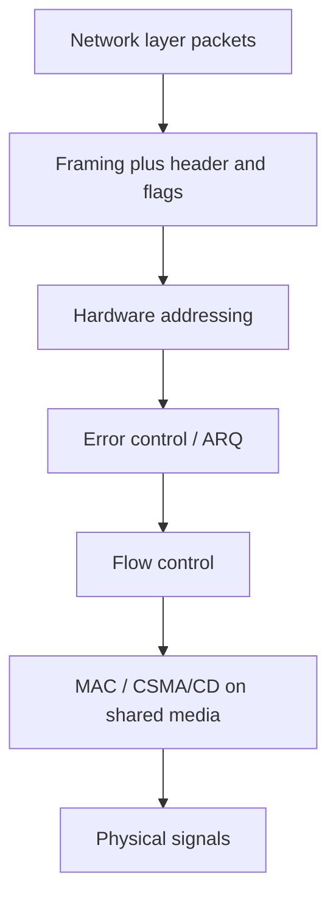

#### Framing in detail

A major responsibility is to make the **physical link reliable**. To do so the DLL **breaks the network-layer data stream into small blocks** (**segmentation**) and, to form a frame, **adds a header and frame flag** to each block (**encapsulation**).

The **frame header** generally contains three fields:

| Field | Contents |
|-------|----------|
| **Address** | Address of **sender and receiver** |
| **Error-detecting code** | A **checksum** of the frame for error detection |
| **Control** | Additional information to implement **protocol functions** |

The receiving DLL must know the **start and end** of a frame according to the **frame flag**. A good design makes it easy for a receiver to find the start of a new frame while using **little of the channel bandwidth**.

Four framing methods:

##### 1. Byte count

Uses a field in the header to describe the **number of bytes** present in the frame. When the receiver's DLL sees this count, it knows **how many bytes follow**.

##### 2. Flag bytes with byte stuffing

Each frame **starts and ends** with a special byte sequence. Generally the **same byte** (a **flag byte**) is used as starting and ending **delimiter**. If the flag byte appears **in the data**, the sender's DLL inserts a special **ESC (escape) byte** immediately before each accidental flag byte. This technique is **byte stuffing**.

##### 3. Flag bits with bit stuffing

The frame flag is a special **bit pattern** that should not appear anywhere else inside the frame. A special flag of **0, six 1s, 0** (**01111110**) is used at start and end. Whenever the sender's DLL sees **five consecutive ones** in the data, it automatically **adds a 0 after those five ones**. The receiver **deletes this 0 bit** that follows five consecutive 1 bits. This process is **bit stuffing**.

##### 4. Physical-layer coding violations

Used on networks whose encoding on the physical medium contains **some redundancy**. Some LANs encode each bit using **two physical bits**. **Manchester coding** is normally used: a **1** is encoded as **10** and a **0** as **01**. An **invalid physical code** (a coding violation) is used as a frame delimiter. This type of invalid physical code is used in **IEEE 802 LAN standards**.

#### Flow control

Modern networks aim to support a wide variety of hosts and media. Two motivating mismatches:

- A **200 MHz Pentium** host transmitting to a **25 MHz 80386** host: the faster Pentium will **drown** the slower 80386 with data.
- Two hosts both on **Ethernet LANs**, but the Ethernets connected by a **28.8 kbps modem** link: if one host transmits at Ethernet speed, the modem link is quickly **overburdened**.

In both cases flow control is required to keep transfer at a **suitable rate**.

**Flow control** informs the sender **how much data it can transfer before it should wait for an acknowledgement**. Data from sender to receiver must not **overburden** the receiver. The receiver must be able to **report to the transmitter before its limits are reached**, and the sender should then send **fewer frames**. The limit may be **memory used to store incoming frames** or the **processing power** of the receiver.

Two methods: **stop-and-wait** and **sliding window**.

##### Stop-and-wait

Simplest form: the sender transmits a **data frame**; after receiving it the receiver indicates willingness to accept another by sending an **acknowledgement frame**. The sender **must wait** until the ACK is received before transmitting the next frame. Also called a **request-reply** mechanism: easy to understand and implement but **not very efficient**.

On LANs with **fast links** this is not a major concern, but **WAN links spend most of their time idle**, especially if a **large number of hops** are required.

The protocol depends on **two-way transmission** (half or full duplex) so the receiver can return ACKs. A small **processing delay** sits between reception of the last data frame and generation of the ACK.

**Major drawback:** only **one frame can be in transit at a time**, which is inefficient if **propagation delay is longer than transmission delay**.

**Link utilization.** Let **transmission time** be normalized to **1**, and let **propagation delay** be **a** (time for a bit to travel from sender to receiver).

- If **a < 1**, the frame is long enough that the **first bit arrives before the source has finished transmitting**.
- If **a > 1**, the sender **completes the entire frame** before the leading bits arrive at the receiver.

Utilization:

**U = 1 / (1 + 2a)** where **a = propagation time / transmission time**.

Utilization depends strongly on that ratio. When propagation time is very small (**LANs**), utilization is **good**. When delays are very long (**satellite communication**), utilization can become **very poor**. Sliding window is used instead of stop-and-wait to **improve utilization**.

##### Sliding window

Stop-and-wait does not work well if **multiple data frames** are used for a single message — only one frame can be in transmission at a time. If **a > 1**, **severe inefficiencies** result. Efficiency improves if **multiple frames are transmitted at the same time** and the line is **full duplex**.

The sender tracks frames by transmitting **sequentially numbered** frames. The sequence number occupies a field of **limited size**. If there are **K bits** in that header field, sequence numbers range from **0 to 2^K − 1**.

- The sender keeps a list of sequence numbers it is authorized to send: the **sender window**. Maximum sender-window size is **2^K − 1**. The sender is allocated buffer space equal to the window size.
- The receiver also keeps a **receiver window** of size **2^K − 1** (as first stated). The receiver acknowledges every frame with an ACK that includes the **sequence number of the expected next frame**, which also announces that the receiver is ready to receive the **next n frames** starting at that number. This scheme can **acknowledge multiple frames**.

**TCP** uses a sliding-window protocol. A **buffer** is placed between the application and the network data flow (for TCP, normally in the **OS kernel**). Data received from the network is stored in the buffer; the application reads at **its own speed**. As data is read, buffer space empties and can accept more from the network.

**Sender sliding window (at a given time):** the sender may transmit frames whose sequence numbers lie in a particular range.

**Receiver sliding window (later description):** the receiver keeps a window of **size one** if frames should arrive in a particular order. Frames received **out of order are discarded** and need to be **resent**. The receiver window **increases by one** if a particular frame is received. The ACK includes the next sequence number and can announce readiness for the next n frames; this can also **ACK multiple frames**.

Sliding window is beneficial if the local application processes data at the **same rate** it is transferred. If **packet size is smaller than the window size**, **multiple packets can be in the network** because the sender knows space exists at the receiver. Ideally a **steady state** is attained: data packets in the forward direction and **window announcements** in the reverse direction are constantly in flight. When the sender gets a new window announcement it transmits more; when the application reads the buffer, more window announcements are generated. Maintaining sequence during transfer **guarantees effective use of network resources**.

#### Error control and ARQ

When the receiver detects an error in a message or packet, it informs the sender to **retransmit** that message or packet. The most popular retransmission scheme is **ARQ (automatic repeat request)**. Three well-known ARQ techniques:

1. **Stop-and-wait ARQ**
2. **Go-Back-N ARQ**
3. **Selective-repeat ARQ**

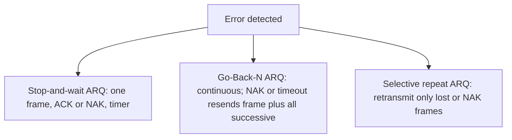

##### Stop-and-wait ARQ

Simplest protocol: the sender sends a frame and **waits** for a **positive acknowledgement (ACK)** or **negative acknowledgement (NAK)** from the receiver. The receiver sends a positive ACK only if the frame is received **correctly**; otherwise a NAK. The sender sends a **new** frame only after a positive ACK; otherwise it **retransmits the old frame**.

To deal with a **lost or damaged** frame the sender has a **timer**. If the ACK is lost, the sender transmits the old frame. Example in the lecture: the **second data PDU is lost**. The sender does not know about the loss but starts a timer after each PDU. Normally a positive ACK arrives before the timer expires; here none arrives, the timer counts to zero, and the **same PDU is retransmitted**. The second transmission receives an ACK before timeout. The receiver **discards the duplicate**, identified by the **label (sequence) of the frame**.

For frames **corrupted by noise**, the receiver sends a **NAK**. If the transmitter receives a NAK **before timeout**, it transmits the old frame again.

**Advantage:** **simplicity**; requires **minimum buffer size**. **Disadvantage:** **highly inefficient** use of the link, particularly when **propagation delay is large**.

##### Go-Back-N ARQ

One of the **most popular** ARQ schemes. The sender transmits frames **continuously without waiting for acknowledgement** — hence **continuous ARQ**. The receiver continues to send ACKs or NAKs. If a NAK is received, the sender **retransmits that frame including all successive frames** — hence **Go-Back-N**.

If a frame is **lost**, the receiver sends a NAK. If there is a long delay before the NAK, the sender **retransmits the lost frame after its timer times out**. If the **ACK frame is lost**, the sender also **resends after timeout**.

**Piggybacked acknowledgement** (full duplex): the receiver puts some number in the **acknowledgement field of its data frame**. Example: a **3-bit sequence number**; a station sends frame **0**, gets **RR1** (Receive Ready 1), then sends frames **1, 2, 3, 4, 5, 6, 7, and 0** and gets **another RR1**. That might mean RR1 is a **cumulative ACK**, **or** that **all eight frames were damaged**. The uncertainty is removed if the **maximum window size is limited to 7** — for a **K-bit** sequence-number field, limited to **2^K − 1**. The number **n = 2^K − 1** is how many frames can be sent **without receiving acknowledgement**. If no ACK arrives after sending n frames, the sender uses a timer and after timeout **resumes retransmission**.

Go-Back-N also handles **damaged frames and damaged acknowledgements**. It is a little more complex than stop-and-wait ARQ but gives **much higher throughput**.

##### Selective-repeat ARQ

Retransmits **only those frames for which NAKs are received** or for which the **timer has expired**. This is the **most efficient** ARQ method, but the sender must be **more complex** so it can send **out-of-order frames**. The receiver must have **storage** for the subsequent frames and **processing power to reinsert frames in proper sequence**.

### Key terms

| Term | Meaning in this lecture |
|------|-------------------------|
| DLL / Layer 2 | OSI layer above physical; hides hardware; frames for upper layers |
| Collision domain | Shared-link setting that makes DLL work harder |
| LLC | Point-to-point sublayer: protocols, flow control, error control |
| MAC | Who uses the broadcast medium; CSMA/CD for shared access |
| NIC | Network interface card / adapter (e.g. Ethernet) implementing DLL in hardware |
| Segmentation / encapsulation | Split network-layer stream; add header and frame flags |
| Byte stuffing | Insert ESC before accidental flag bytes in the data |
| Bit stuffing | After five 1s in data, insert 0; flag is 01111110 |
| Manchester / coding violation | 1→10, 0→01; illegal physical codes delimit IEEE 802 frames |
| Stop-and-wait | One data frame, then wait for ACK; U = 1/(1+2a) |
| a | Propagation time / transmission time |
| Sliding window | Numbered frames; window up to 2^K−1; used by TCP (kernel buffer) |
| ARQ | Automatic repeat request after error detection |
| Stop-and-wait ARQ | ACK/NAK plus timer; duplicates discarded; small buffers, poor on long delay |
| Go-Back-N | Continuous send; on NAK/timeout resend that frame and all later ones; max window 2^K−1 |
| RR | Receive Ready piggyback (e.g. RR1) |
| Selective repeat | Retransmit only lost/NAK frames; receiver resequences from storage |

### Lecture takeaways

- Layer 2 sits on the physical bit pipe, hides the hardware, and is hardest on a shared collision domain; LLC (point-to-point protocols, flow, errors) and MAC (who speaks on the broadcast medium) split the work, often in an Ethernet NIC.
- Packets become frames with address, checksum, and control fields; four ways to mark frame edges are count, byte-stuffed flags, bit-stuffed 01111110, and Manchester coding violations (IEEE 802).
- Speed mismatches (Pentium vs 80386, Ethernet vs a 28.8 kbps modem) require flow control: stop-and-wait is simple but idle on long-delay paths (U = 1/(1+2a), bad for satellite); sliding windows of size at most 2^K−1 (and TCP's kernel buffer) keep multiple frames in flight and can cumulative-ACK.
- Errors are recovered by ARQ: stop-and-wait ARQ (ACK/NAK, timer, drop duplicates) is simplest and least efficient; Go-Back-N is continuous and rewinds to the bad frame (window capped at 2^K−1 so piggybacked RR cannot be ambiguous); selective repeat is most efficient and most complex because only lost frames are resent and the receiver must reorder.


---

# M08: Medium Access Control Protocols

**Source:** https://www.youtube.com/watch?v=Yw1HsIBvLLM
**Instructor / expert:** Dr. Maninder Singh, Department of Computer Science, Punjabi University, Patiala

### Learning objectives

- Place the MAC sublayer in the OSI data-link layer and list its basic functions.
- Contrast static channel allocation (FDM) with dynamic allocation and state the LAN assumptions that dynamic methods need.
- Distinguish random-access (ALOHA, CSMA, CSMA/CD) from controlled-access (polling, token passing, slotted ring) methods.
- Compute Pure ALOHA and slotted ALOHA throughput and explain the vulnerable period in each.
- Describe nonpersistent, 1-persistent, and *p*-persistent CSMA, and the CSMA/CD collision procedure used on early Ethernet.

### Core concepts

The **medium-access sublayer** is the **bottom part of the data-link layer**. It is also called **MAC** (Media Access Control). When many stations share one medium, MAC is required: simultaneous transmissions would otherwise produce **garbled** messages.

MAC mechanisms **standardized by IEEE** sit in this sublayer. MAC **provides service to LLC** (Logical Link Control) above it and **receives service from the physical layer** below.

**Basic MAC functions:** media access control, **error detection**, and **station addressing**. Access procedures try to give every station a **fair chance** to transmit and to **avoid collisions**. Several LAN methods exist, each tied to a **specific LAN topology**. Besides basic access, MAC also handles **frame delimiting**, **address recognition**, and **error checking**.

**Multiple-access communication** is the case where many user stations share one transmission medium. The medium is **broadcast**: every attached station can receive a given station’s transmission. A LAN’s physical medium is shared by the stations on that LAN.

#### Static vs dynamic channel allocation

Two basic approaches:

| Approach | Also called | Idea |
|----------|-------------|------|
| Static access control | Static channel allocation | Fixed share of the channel |
| Dynamic access control | Dynamic channel allocation | Share adapts to traffic; further split into **random access** and **scheduling** |

**Static FDM.** The first way to share one channel among contending users is **frequency-division multiplexing (FDM)**. With *n* users, bandwidth is split into *n* equal partitions and each user gets one. Fixed bands avoid interference, but the scheme fits only when **users are few** and each has **constant traffic**. If the LAN is large with **varying** traffic and the band is still cut into *n* partitions: fewer than *n* users **wastes spectrum**; more than *n* users leaves some **without a channel**. The channel is then **inefficient**. If *n* users wait in one queue, average delay *T* is **n times the mean delay**. Static FDM therefore shows **poor channel performance**.

**Dynamic channel allocation** appears in **LANs and WANs**. It can handle mixed traffic by building an order so each station gets a proper chance to send frames. The lecture’s requirements:

1. Workstations/terminals are **independent**; work is generated at a **constant rate**.
2. A **single channel** is used for all communication; all stations transmit and receive on it.
3. A station may start at **any time** or in a **slotted time** assigned to it.
4. Two simultaneous transmissions **collide** and the result is **garbled**; all stations can **detect** the collision; the signal may be **retransmitted**.
5. Stations may or may not have **carrier sensing** — an electrical sense of whether the channel is **busy or free**.

#### Multiple-access protocols

A LAN backbone is a **shared channel**. Two or more stations sending at once **interfere** and **garble** data. Medium-access protocols exist to resolve that, especially for **bursty** LAN traffic: data in **irregular bursts**, not a continuous stream.

**Asynchronous TDM** is the mechanism named here. It splits into:

| Family | Also called | Examples from the lecture |
|--------|-------------|---------------------------|
| Contention | Random access | **ALOHA**, **CSMA**, **CSMA/CD**; **register insertion** (unpopular, **obsolete**) |
| Deterministic | Controlled access | **Centralized:** a master decides who may send (e.g. **polling**). **Distributed:** each station gets a turn (e.g. **token passing**, **slotted ring**) |

Typical multiple-access sharing is used on **wired and wireless** networks.

- **Wired multi-drop cables** connect stations to a **host**. The host **broadcasts on an outbound line**; stations send on an **inbound line**. A MAC protocol has the host issue **polling messages** that grant permission to transmit inbound.
- **Radio:** several stations share **two frequency bands** (transmit and receive).
- **Satellite:** each station gets a channel in an **uplink** band to the satellite; the satellite returns signals on a **downlink** band.

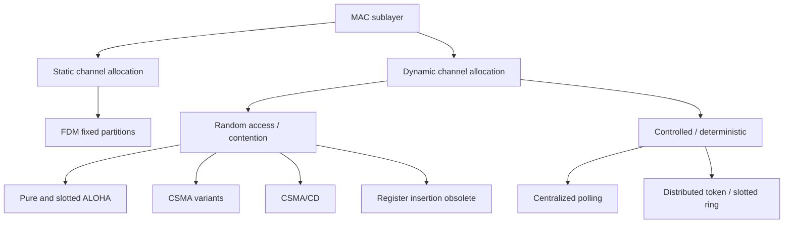

#### ALOHA

**ALOHA** is a **contention** protocol from the **University of Hawaii** in the **early 1970s**, originally for **packet radio**, but usable on any shared medium. When many users send on one broadcast channel, **random access** is used: **no exact scheduled time** to transmit. The scheme is **simple and asynchronous** — no tight coordination.

If two stations send together, data may **collide and scramble**. Each then waits a **random time** and tries again. Two variants:

| Variant | Synchronization |
|---------|-----------------|
| **Pure ALOHA** | No global time sync |
| **Slotted ALOHA** | Requires time synchronization |

**Pure ALOHA.** A station sends a frame **whenever it has one**. With one shared channel, frames can collide. The protocol **depends on an acknowledgement**. After sending, the user expects an ACK; if none arrives by a **timeout**, the frame is assumed destroyed and is resent.

If the **first bit** of a new frame overlaps even the **last bit** of a finishing frame, **both frames are completely destroyed** and both must retransmit after timeout. If every station retries at the same timeout, they collide again. Pure ALOHA therefore waits a **random backoff time \(T_B\)** after timeout. Randomness reduces repeated collisions.

**Timeout** equals the **maximum round-trip propagation delay**: twice the time to send a frame between the two most widely separated stations, written **\(2 \times T_P\)**.

Assume equal-length packets and one time unit \(T_P\) to transmit. Station A sends packet A at \(t_0\):

- If B generated a packet between \(t_0\) and \(t_0 + T_P\), the **end of B** hits the **start of A**.
- Pure ALOHA **does not listen** before transmitting, so A cannot know a frame was already underway.
- If C transmits between \(t + T_P\) and \(t + 2T_P\), the **start of C** hits the **end of A**.

If two packets overlap by even the smallest amount in this **vulnerable period**, both are corrupted and must be retransmitted. The vulnerable period is **two packet times**.

**Throughput of Pure ALOHA.** Throughput \(S\) is **average successful traffic per unit time**. The time unit is **slot time** (time to transmit one equal-size frame). At most one packet per slot can succeed, so the **maximum \(S\) is 1**. Collisions waste channel time, so realized \(S < 1\).

Assume \(P_k\), the probability that \(k\) packets are generated in a slot, follows a **Poisson** distribution with mean **\(G\)** per packet time. Then \(S = G \cdot P\), where \(P\) is the probability a packet suffers **no collision**. No other traffic in the whole vulnerable period gives \(P = e^{-2G}\), so:

\[
S = G e^{-2G}
\]

Maximum throughput is at **\(G = 0.5\)**. Best **channel utilization is around 18%**. Advantage: **no synchronization**; a station may send whenever it has a packet. Disadvantage: **inefficient** — only about **18%** of capacity.

**Slotted ALOHA.** Channel time is cut into **discrete** slots equal to **packet transmission time**. Stations may transmit only at those instants and must **sync to the next slot**. Wasted collision time drops to **one packet time**; the **vulnerable period is halved**.

Assumptions: all frames the same size; equal slots (one frame each); nodes start **only at slot beginnings** and are synchronized; if two or more transmit in a slot, **all detect the collision before the slot ends**.

Packets arrive synchronized. Probability of a single transmission in a slot is \(P_0 = e^{-G}\), so:

\[
S = G e^{-G}
\]

Maximum at **\(G = 1\)**, **twice Pure ALOHA**. Best utilization about **36.8%**.

#### CSMA

**Carrier Sense Multiple Access (CSMA)** is a **probabilistic** MAC protocol: a station **confirms the absence of other traffic** before sending on a shared medium.

- **Carrier sense:** listen for another station’s **carrier** before starting. If a carrier is present, **wait until that transmission finishes**. Principle: **sense before transmit** / **listen before talk**.
- **Multiple access:** more than one station may send and receive on the shared medium.

**Vulnerable time** is the **propagation time \(T_P\)** — time for a packet to go from one end of the medium to the other. Example: station A sends at \(T_1\); the frame reaches rightmost station D at \(T_1 + T_P\).

When the medium is sensed idle, a station sends using one of three approaches:

**Nonpersistent CSMA** (non-aggressive). Sense first. If **idle**, send immediately. If **busy**, wait a **random time without sensing**, then repeat the whole sense cycle. This **reduces collisions** and raises **medium throughput**.

**1-persistent CSMA** (aggressive). Sense. If **idle**, send immediately. If **busy**, **keep sensing** until idle, then send **unconditionally** (probability **1**). After a collision, wait a random time and try again with probability 1. **Used in CSMA/CD systems including Ethernet**.

***p*-persistent CSMA** (between the two). Sense. If **idle**, send immediately. If **busy**, keep sensing until idle, then send with probability **\(p\)**. With probability **\(1-p\)** it waits until the **next time slot**. **Used in CSMA/CA systems including Wi-Fi and other packet radio**.

#### CSMA/CD

**Carrier Sense Multiple Access with Collision Detection** is used mostly on LANs with **early Ethernet**. While sending, a station **detects other signals**, **stops** that frame, sends a **jamming signal** on collision, then waits a **random time** before retry. It **modifies pure CSMA** by **terminating transmission as soon as a collision is detected**, which **improves CSMA performance**.

Base protocol: a station with a message **monitors** the channel. If another station is sending, it **defers** until that station finishes, then may send. If nobody was sending when it first listened, it may send **immediately**. **Carrier sensing** is this listen-before-transmit behavior.

If two or more stations, **separated by a significant distance on a bus**, start at roughly the same time without hearing each other, signals **superimpose** and become **garbled** beyond decoding — a **collision**.

**Collision-resolution procedure** (done when retransmission starts, or is aborted after too many collisions):

1. Continue transmitting a **jam signal** (instead of header/data/CRC) until **minimum packet time**, so **all receivers detect** the collision.
2. **Increment** the retransmission counter.
3. If the **maximum number of attempts** is reached, **abort**.
4. Otherwise **calculate and wait** a **random backoff** based on the number of collisions.
5. **Re-enter** the main procedure at stage one.

Because transmission is cut short, **time and bandwidth are saved**. The lecture’s conclusion: **CSMA/CD is more efficient than ALOHA, slotted ALOHA, and CSMA**.

CSMA/CD works best on a **bus / multipoint** topology with **bursty asynchronous** transmission. All stations attach to **one path** and monitor the channel through a **transceiver** on the cable. Control is **fully decentralized** and **contention-based**. It supports **baseband and broadband**. Four named options of **bit rate, signaling method, and maximum electrical cable segment length**:

| Name | How the lecture unpacks the name |
|------|----------------------------------|
| **10BASE5** | Leading number = bit rate in **Mbps**; middle = **baseband** or **broadband**; trailing number = segment length in **multiples of 100 m** |
| **10BASE2** | Same naming rule |
| **10BROAD36** | Broadband option |
| **1BASE5** | Same naming rule |

**Manchester** line code is used at the **baseband** transmission level. In **broadband**, **phase-shift keying** converts the Manchester-encoded signal to analog form.

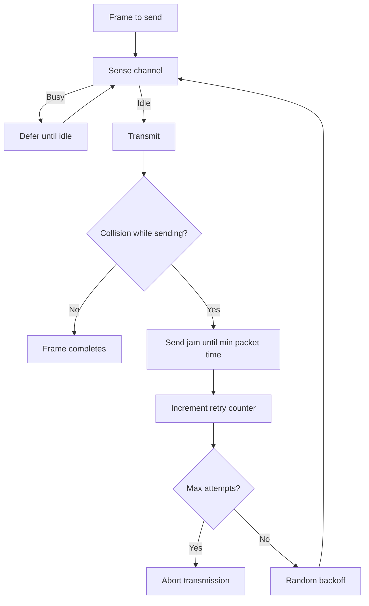

### Key terms

| Term | Meaning in this lecture |
|------|-------------------------|
| MAC sublayer | Bottom of the data-link layer; IEEE media-access, error detection, station addressing; serves LLC, uses the physical layer |
| LLC | Logical Link Control; MAC’s user above |
| Multiple access | Many stations share one broadcast medium |
| FDM | Static split of bandwidth into fixed frequency partitions |
| Collision | Overlapping transmissions that garble the signal |
| Carrier sensing | Electrical sense that the channel is busy or free |
| ALOHA | Random-access protocol from the University of Hawaii (early 1970s) |
| Vulnerable period | Time window in which another packet can overlap and destroy a transmission |
| \(G\), \(S\) | Offered load per packet time; successful throughput per slot |
| CSMA | Sense-before-transmit multiple access |
| 1-persistent CSMA | Keep sensing a busy medium, then send with probability 1 (Ethernet CSMA/CD) |
| *p*-persistent CSMA | After idle, send with probability \(p\) (CSMA/CA, Wi-Fi) |
| CSMA/CD | CSMA plus collision detection, jam, and backoff (early Ethernet) |
| 10BASE5 / 10BASE2 / 10BROAD36 / 1BASE5 | CSMA/CD cabling options named by Mbps, baseband/broadband, and segment length × 100 m |

### Lecture takeaways

- Shared-medium LANs need MAC so simultaneous sends do not garble frames; MAC sits under LLC and above the physical layer.
- Static FDM wastes spectrum or starves users when traffic is not small and constant; dynamic methods are what LANs and WANs actually use.
- Random access (ALOHA, CSMA, CSMA/CD) versus controlled access (polling vs token/slotted ring) is the main protocol split; register insertion is obsolete.
- Pure ALOHA needs no sync but tops out near 18% (\(S = Ge^{-2G}\) at \(G=0.5\)); slotted ALOHA halves the vulnerable period and reaches about 36.8% (\(S = Ge^{-G}\) at \(G=1\)).
- CSMA listens first; 1-persistent is Ethernet/CSMA/CD, *p*-persistent is Wi-Fi/CSMA/CA.
- CSMA/CD aborts into a jam and backoff, and is taught as more efficient than ALOHA and plain CSMA on a bus with bursty traffic.


---

# M09: TCP/IP Model-IP Addressing – I

**Source:** https://www.youtube.com/watch?v=Q40gn2Eu1zw
**Instructor / expert:** Prof Maninder Singh, Department of Computer Engineering, Thapar University, Patiala

### Learning objectives

- Trace a payload vertically down the TCP/IP stack from application to physical layer.
- State what a protocol is and when TCP versus UDP is used at the transport layer.
- Bind well-known applications to port numbers and describe a TCP segment’s source and destination ports.
- Explain IPv4 dotted-decimal addressing, classful classes A–E, default masks, and network versus host bits.
- Compute network, broadcast, and gateway addresses, and state why CIDR/subnetting is introduced to cut classful waste.

### Core concepts

The lecture is an **introductory session on computer networks** as the foundation for **cyber security**: to secure a system, first understand how the network works. Data from one machine to another travels from the **application** that talks to the user down to the **physical layer**.

#### Seven-layer mnemonic and the practical TCP/IP stack

The instructor presents **seven layers** from application downward, memorized as **“All People Seem To Need Data Processing.”** Client and server each have the same seven layers.

In the **practical model**, the first three layers — **application, presentation, and session** — are **combined** into a single **application layer**. On that layer the user talks to a server with a **browser**, the **interface between user and machine**.

Example: the user types **`www.google.com`** in the address bar.

**Conversation between layers is vertical, not horizontal.** Data travels:

**application → transport → network → data-link → physical.**

**Data-link and physical** depend on **network type** (Wi-Fi versus wired).

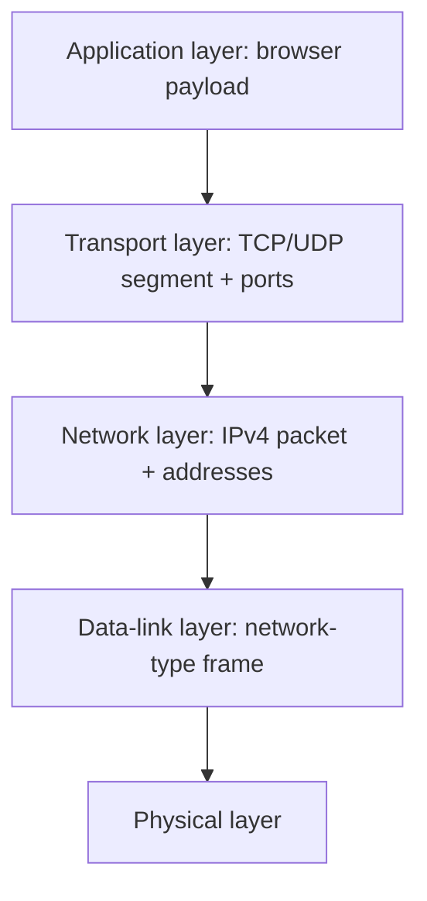

#### Payload and protocols

From the application, the data is a **payload** — here the payload is `www.google.com`.

At the **transport layer**, behavior is governed by **TCP** and **UDP**. A **protocol** is a **set of instructions / rules** that must be followed for a line of action. The stack **chooses TCP or UDP**.

**Most real-time applications** — **WWW/HTTP** and **mail** — follow **TCP**. The lecture calls **TCP the default protocol for all real-time applications**. TCP internals are deferred; this introduction focuses on two fields: **source port** and **destination port**.

#### Ports and the segment

Ports **identify a particular application running on the server**. They are the identifiers for applications at that layer.

| Application | Port(s) taught |
|-------------|----------------|
| HTTP | **80** (browser / WWW) |
| FTP | **20 and 21** |
| SMTP | **25** |
| SSH | **22** |
| Telnet | **23** |

These are **standard applications** used worldwide.

When the payload reaches transport, the PDU is a **segment**. The segment holds:

1. The **payload**
2. **Source port number**
3. **Destination port number**

For HTTP, **destination port is 80 by default**. The **source port** is a **random number above 1024**. Standard / well-known ports are **not** used as sources: **source cannot be less than 1024**.

A port is a **16-bit** entity: \(2^{16} = 65{,}536\) ports, so that many applications can theoretically run on one machine. Applications are **bound** to ports (HTTP→80, and so on).

Worked example: source **4444**, destination **80**, payload from the application in between. That segment then goes to the **network layer**.

#### IPv4 addresses and classful classes

The **network layer** gives addresses to **client and server** computers. Addresses are written in **dotted-decimal notation** and called **IP addresses**.

This lecture is **IPv4**: **32-bit** addresses, so \(2^{32}\) unique addresses. Some are **reserved** as **Class D and Class E**. Computers use **Class A, B, and C**.

Form: **`X.Y.Z.A`**, each octet **0–255**, each octet **8 bits**, totaling 32 bits.

An IP address has two parts: **network address** and **host address**. Which bits are which depends on the **subnet mask**.

| Class | Default subnet mask | First-octet cue taught | Network bits | Host bits | Implication taught |
|-------|---------------------|------------------------|--------------|-----------|--------------------|
| **A** | `255.0.0.0` | **0–126** | 8 | 24 | \(2^{8}\) networks, \(2^{24}\) hosts each — **millions of machines**, “bigger networks” |
| **B** | `255.255.0.0` | (default mask 16/16) | 16 | 16 | \(2^{16}\) networks, \(2^{16}\) hosts each — about **65,536 hosts** per network |
| **C** | `255.255.255.0` | (default mask 24/8) | 24 | 8 | \(2^{8} = 256\) addresses/hosts per network — **smallest** classful size taught |
| **D** | — | reserved | — | — | **Multicasting** (later lectures) |
| **E** | — | reserved | — | — | **Not used**; reserved |

Example: **`10.10.10.10`** — first octet between 0 and 126 → **Class A**, default mask `255.0.0.0`.

#### 20-host example, unicast, network and broadcast

Need **20 machines**. Class A would **waste huge numbers** of addresses (\(2^{24}\) hosts per network). **Class C** is the fit among classful choices: **256** addresses, wasting **236** if only 20 are needed — still described as **pretty huge waste**.

Worked Class C net: **`192.168.1.0`**. Assign **`192.168.1.1` … `192.168.1.20`**. All those machines share the **same network**.

For machines to talk (including to **another** network), two ideas matter: they must be on the **same network** (for on-net talk), and there is a **broadcast address**.

**Unicast:** `192.168.1.2` talking to **one** other machine — a **single** machine to another.

**Talk to all machines on the same network** needs the network identity of `192.168.1.2`.

**Network address** = IP **logically ANDed** with the subnet mask.

`192.168.1.2` AND `255.255.255.0`: AND with **zero** yields **zero** in that octet; other octets stay. Result: **`192.168.1.0`**.

**Broadcast address:** **all host bits set to 1** → last octet `11111111` = **255** → **`192.168.1.255`**.

So for `192.168.1.2`:

| Role | Address |
|------|---------|
| Network | `192.168.1.0` |
| Broadcast | `192.168.1.255` |

Each network that must talk to another network needs **three special addresses**:

1. **Network address**
2. **Broadcast address**
3. **Gateway address**

**Gateway** = a **router** that talks to the other network. **Standard** taught: give the gateway the **last IP of the network** → **`192.168.1.254`**.

**Hosts per network formula:** \(2^n - 2\). For Class C, \(n = 8\): \(2^8 - 2 = 254\) hosts. One of those 254 is the gateway, leaving **253 live hosts** on a full Class C. For only **20** needed addresses, **233** still wasted (after the lecture’s accounting).

#### Classful waste and CIDR / subnetting preview

**Classful** addressing uses A, B, or C (D multicast, E unused). Those three **waste** IPv4 space, so another mechanism is adopted: **CIDR** — **classless inter-domain routing** — to **cut down wastage**. That practice is **subnetting**.

For **20** addresses, **five host bits** suffice. Binary weights: **1, 2, 4, 8, 16, 32**. Five bits address **31** machines (\(16+8+4+2+1\)). Only five of the last octet’s eight host bits are consumed; **three bits go to the network**. Wastage drops to about **11** addresses instead of hundreds.

In binary for this case: **three network bits + five host bits** in the last octet. The default Class C mask `255.255.255.0` is **replaced**; the exact new last-octet value is **deferred to the next lecture**.

**Supernetting** is also previewed: the next class will find **subnets** and discuss **supernetting**. The instructor’s framing: **play with host bits and network bits** to cut IPv4 waste. Subnetting here means using **fewer host bits** so **fewer IPs are wasted**.

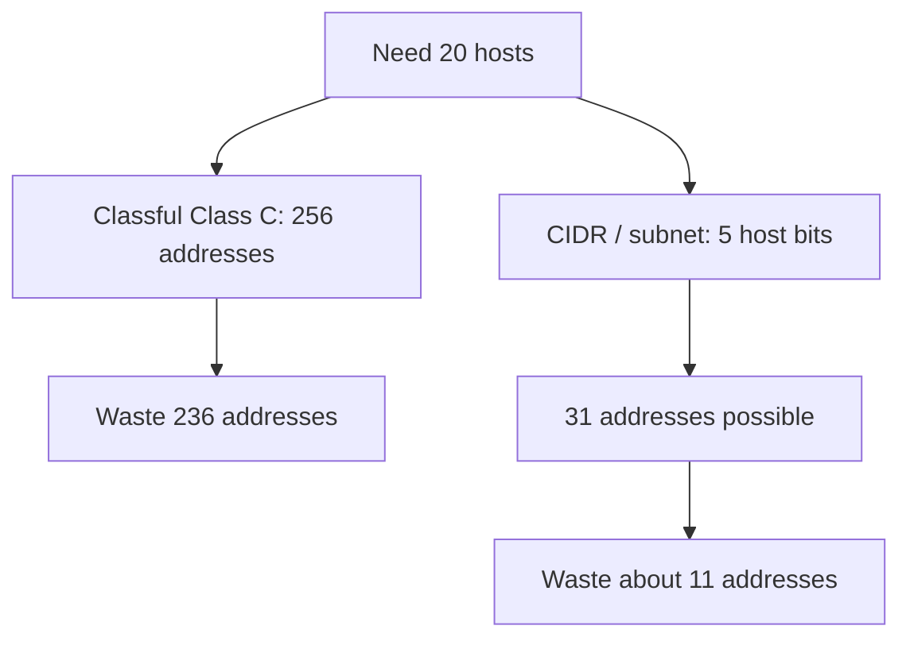

#### Recap chain taught at the close

1. **Application** produces a **payload**.
2. Payload goes **vertically** to **transport**.
3. Transport adds **source and destination ports**; PDU = **segment**.
4. **Destination port is fixed by the application** (browser → **80**).
5. Standard ports address standard applications.
6. Segment goes to the **network layer**, which adds **source and destination IP addresses**.
7. Hosts are numbered with **classful** or **classless** IPv4; classful **wastes** space (the `192.168.1.0` / 20-host example).
8. **CIDR** is the tool to cut that waste; **worked CIDR examples** come next, along with **MAC / data-link addresses**.

### Key terms

| Term | Meaning in this lecture |
|------|-------------------------|
| All People Seem To Need Data Processing | Mnemonic for the seven layers from application down |
| Payload | Application data handed down (e.g. `www.google.com`) |
| Protocol | Set of rules for a line of action (TCP or UDP at transport) |
| Segment | Transport PDU: payload plus source and destination ports |
| Port | 16-bit application identifier; 65,536 possible values |
| Well-known ports | Below 1024; not used as random source ports |
| Dotted-decimal | IPv4 written as four octets 0–255 |
| Subnet mask | Marks which IP bits are network vs host |
| Unicast | One machine talking to one other machine |
| Network address | IP AND mask; host bits zero |
| Broadcast address | All host bits one |
| Gateway | Router address used to reach another network |
| CIDR | Classless inter-domain routing; subnetting to reduce classful waste |

### Lecture takeaways

- Layers talk only **down the stack**; the browser payload becomes a TCP segment (ports) then an IPv4 packet (addresses).
- TCP is taught as the default for HTTP and mail; UDP is the other transport choice.
- HTTP listens on **80**; sources pick a port **above 1024**; FTP 20/21, SMTP 25, SSH 22, Telnet 23.
- IPv4 is 32-bit dotted decimal; classful A/B/C (with D multicast, E reserved) waste space when a site needs only 20 hosts.
- Network = IP AND mask; broadcast = host bits all 1; a gateway (often last host address) is required to leave the network; usable hosts are \(2^n-2\).
- CIDR/subnetting uses only as many host bits as needed (five bits for 20–31 hosts); mask arithmetic and MAC addresses are the next lecture.


---

# M10: TCP/IP Model-IP Addressing – II

**Source:** https://www.youtube.com/watch?v=FQzPOhnEkjg
**Instructor / expert:** Dr Maninder Singh, Professor and Dean, Academic Affairs, Thapar University, Patiala

### Learning objectives

- Finish the 20-host CIDR example: mask `255.255.255.224`, block size, network and broadcast.
- Repeat the method for 10 hosts (`/28`) and list network, broadcast, first/last host, and wasted addresses.
- Write the same prefix in subnet-mask form and in CIDR slash notation.
- Distinguish IPv4 **logical** addresses from 48-bit **MAC** **physical** addresses (OUI + serial).
- Use ARP (broadcast request, unicast reply) to fill a frame when two hosts are on the same network; note that off-net frames use the **gateway’s** MAC.

### Core concepts

Previous lecture: payload (application) → **segment** (transport) → **packet** (network). A packet is built from **source IP** and **destination IP**. Classes A, B, and C were introduced, plus a **20-machine** network on **`192.168.1.0`** with as little waste as possible via **CIDR** (**classless inter-domain routing**).

#### Powers-of-two table for the last octet

Memorize \(2^0 \ldots 2^7\) because hosts use **binary**: **1, 2, 4, 8, 16, 32, 64, 128**. Those are the **eight bits of the last octet**.

**Rule:** bits with weight **1** are **network**; bits with weight **0** are **host**.

#### Example 1 — 20 machines on `192.168.1.0`

Five bits are enough for 20 hosts. In the last octet, **five bits address hosts**, **three bits address the network**.

Network-bit weights **128 + 64 + 32 = 224**. Subnet mask:

**`255.255.255.224`**

That last **224** leaves **five host bits**. Network address **`192.168.1.0`**. Hosts **`192.168.1.1` … `192.168.1.20`**.

**Broadcast:** always work on the **incomplete octet**. Incomplete value is **224**. Subtract from **256**:

**\(256 - 224 = 32\)** → **block size 32** (32 addresses per block).

Last address in the block = broadcast = **32 − 1 = 31** → **`192.168.1.31`**.

Network **`192.168.1.0`**. Addresses **21–30** are **waste** if only 20 machines are required.

#### Example 2 — 10 machines on `192.168.1.0`

Same network address; need **10** machines. Eight last-octet bits would cover **256** machines. **Four bits** cover 10 hosts.

Split of the last octet: **four network bits + four host bits**.

Usable hosts: **\(2^4 - 2 = 14\)**.

Mask last octet: **`11110000`**. Sum the 1-weights: **128+64+32+16 = 240**.

**Mask: `255.255.255.240`**

IPv4 is 32 bits: **four host bits**, **28 network bits**. Slash form:

**`192.168.1.0/28`**

**CIDR notation** (`/28`) and **subnet-mask notation** (`255.255.255.240`) are **the same thing**.

Incomplete octet = 240. Block size **\(256 - 240 = 16\)**.

| Item | Value taught |
|------|----------------|
| Network (first in block) | `192.168.1.0` |
| Broadcast (last in block) | `192.168.1.15` |
| First host | `192.168.1.1` |
| Last assigned of the 10 | `192.168.1.10` |
| Unused in the block | `.11`, `.12`, `.13`, `.14` (four addresses wasted) |

These addresses are used at the **network layer**. That layer forms a **packet**: **source IP** (client), **destination IP** (server), plus data from transport and application. The network layer is the **host-to-host** communication layer.

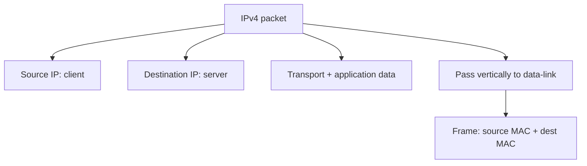

#### Data-link layer: frames and MAC addresses

Communication continues **vertically down**. The packet goes to the **data-link layer**. Data-link PDU = **frame**. This layer is **hardware dependent**: **Wi-Fi frame format ≠ wired frame format**. Common to both: **source MAC** and **destination MAC**.

| Address | Layer | Role |
|---------|-------|------|
| **IP** | Network | **Logical** address |
| **MAC** | Data-link | **Physical** address |

**Analogy:** a mobile **phone number** is **logical** (the same number can move to another handset). The set has a **physical** identity — compared to an **IMEI** — like a MAC on a NIC.

MAC addresses are **48-bit**, written in **hexadecimal**, e.g. `00:A0:C0:AB:CD:01`. Two parts:

| Part | Size | Meaning |
|------|------|---------|
| First **three bytes** (24 bits) | OUI / **OEM** | Original equipment manufacturer (Cisco, Intel, D-Link, …) |
| Last **three bytes** (24 bits) | Serial / sequence | Serial number of that network card |

Hierarchy when surfing: **name in the address bar** → **IP** → **MAC**. Humans remember **names**; machines use **numbers**. `www.google.com` is converted to a **logical IP** at the network layer, then to a **48-bit MAC** on the host.

**Experiment:** Command Prompt → **`ipconfig /all`**. Shows **IP**, **subnet mask**, and **physical (MAC)** address for the interface (demo values: an address in `192.168.1.x` with a mask, and a MAC beginning `00-50-56-…`).

To learn Google’s IP: **`ping www.google.com`**. The lecture’s reply at that moment: **`173.194.126.80`**. That destination IP is what goes into the **network packet**.

Packet then: **source = this machine’s IP**, **destination = Google’s IP**. Data-link **translates the packet into a frame**.

#### Same-net vs gateway MAC (student mistake)

**Common mistake:** frame destination MAC is the **server’s** MAC. **Not so** when leaving the LAN: **destination MAC is the gateway’s MAC**.

**Same network:** `192.168.1.1` talking to `192.168.1.3`. The computer **computes both network addresses**. If they **match**, it **requests the physical address by broadcast**.

Both IPs are already known → the hosts are talking at the **network layer**. A frame still needs MACs. **Source MAC** comes from **`ipconfig /all`**. **Destination MAC** on the same net is learned by **broadcast**.

That broadcast is **ARP** — **Address Resolution Protocol**. Machine **1.1** sends an **ARP request (broadcast)**; **1.3** returns an **ARP reply (unicast)** with its **48-bit** MAC (illustrated as a value such as `00:00:00:0C` plus the rest of the 48 bits). With that MAC, **1.1** can **form the frame**.

**Different network:** destination MAC is the **router/gateway** MAC. **What a router is** is deferred; **IP spoofing** is also named as a **next-lecture** security topic.

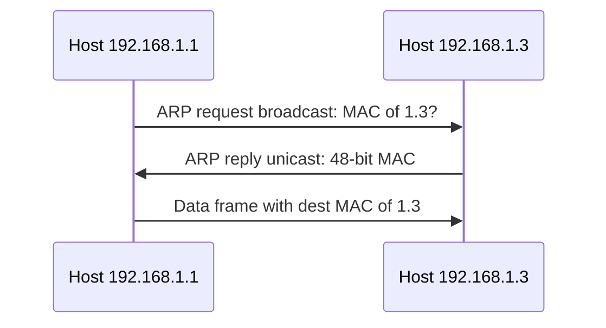

#### Recap of layer roles

| Layer | Addresses | Communication name |
|-------|-----------|--------------------|
| Transport | **Port** (process) addresses | **Process-to-process** |
| Network | **IP** (logical) | **Host-to-host** |
| Data-link | **MAC** (physical, 48-bit) | **Node-to-node** |

Classful addressing **wastes IPs**; **CIDR** lets you take **only as many host bits as the machine count needs**, then compute **network, broadcast, first host, last host**. Frames need MACs from **ARP**. First **24** MAC bits = **OEM**, next **24** = card **sequence number**. Application still starts from a **string**; the stack turns it into ports, IPs, and MACs.

### Key terms

| Term | Meaning in this lecture |
|------|-------------------------|
| CIDR | Classless inter-domain routing; slash prefix equivalent to a mask |
| Incomplete octet | The mask octet that is not 0 or 255; used to get block size as \(256 -\) that value |
| Block size | Number of addresses in the CIDR block (e.g. 32 for mask 224, 16 for 240) |
| `/28` | 28 network bits = mask `255.255.255.240` |
| Frame | Data-link PDU with source and destination MAC |
| Logical vs physical | IP vs MAC (phone number vs IMEI analogy) |
| OEM / OUI | First three MAC bytes: manufacturer |
| `ipconfig /all` | Shows IP, mask, and MAC |
| `ping` | Reveals the current IP of a name such as `www.google.com` |
| ARP | Broadcast request / unicast reply to map IP → MAC on the same network |
| Gateway MAC | Destination MAC of an off-net frame (not the remote server’s MAC) |

### Lecture takeaways

- For 20 hosts, mask **`255.255.255.224`**, block **32**, network `.0`, broadcast `.31`; leftover `.21–.30` are waste.
- For 10 hosts, **`192.168.1.0/28`** = **`255.255.255.240`**, block **16**, broadcast `.15`, 14 usable, four leftover if only 10 are assigned.
- Network layer = host-to-host **packet**; data-link = hardware **frame** with 48-bit MACs (24-bit OEM + 24-bit serial).
- Names become IPs (`ping`); IPs become MACs (`ipconfig /all` plus ARP).
- Same-net destination MAC comes from ARP; **off-net destination MAC is the gateway**, not the server — the usual student error.
- Transport = process-to-process (ports), network = host-to-host (IP), data-link = node-to-node (MAC).


---

# M11: TCP Connection Management and Flow Control

**Source:** https://www.youtube.com/watch?v=TDYgEmXtWHc
**Instructor / expert:** Sunil Kumar, Department of Electrical and Computer Engineering, Punjab Agricultural University, Ludhiana

### Learning objectives

- Explain how TCP can be connection-oriented while using connectionless IP.
- Walk the three-way handshake (passive/active open, SYN, SYN+ACK, ACK) including sequence-number consumption.
- Describe SYN flooding as a denial-of-service attack and the mitigations taught (limits, filters, cookies).
- Account for bidirectional data transfer, piggybacked ACKs, PSH, and URG (including what urgent mode is not).
- Contrast three-way connection termination with four-way half-close.

### Core concepts

Contents: **TCP connection establishment**, **data transfer**, then **connection termination**.

**TCP** is a **connection-oriented transport protocol**. It builds a **virtual path** between source and destination. **All segments of a message** travel that **single virtual pathway**, which helps **acknowledgement** and **retransmission** of damaged or lost data.

TCP uses **IP**, which is **connectionless**, yet TCP itself is connection-oriented because the TCP connection is **virtual, not physical**. TCP runs **higher** than IP: IP **delivers individual segments**; **TCP controls the connection**. If a segment is **lost or corrupted**, TCP **retransmits** — **IP is unaware**. If a segment arrives **out of order**, TCP **holds it** until missing segments arrive — **IP is unaware of reordering**.

Connection-oriented TCP has **three phases:**

1. **Connection establishment**
2. **Data transfer**
3. **Connection termination**

#### Connection establishment

TCP transfers data in **full duplex**. When two TCPs are connected they can **send segments simultaneously**. Each party must **initialize** communication and **get approval** from the other **before any data**.

**Three-way handshake.** An application **client** wants to connect to an application **server** using TCP.

The process **starts with the server**. The server program tells its TCP it is **ready to accept a connection** — a **passive open**. Server TCP will accept from **any machine** but **cannot originate** the connection itself.

The client issues an **active open**: it tells its TCP to connect to a **particular server**. Three-way handshaking then proceeds.

Timelines show each segment’s headers; the lecture keeps **sequence number**, **acknowledgement number**, **control flags**, and **window size** when relevant.

**Step 1 — client SYN.** Only the **SYN** flag is set. Purpose: **synchronize sequence numbers**. The client picks a **random Initial Sequence Number (ISN)** and sends it. This segment has **no acknowledgement number** and **does not define window size** (a window makes sense only when a segment **includes an acknowledgement**). Options may appear (deferred). SYN is a **control segment with no data** but **consumes one sequence number**. When data starts, ISN is **incremented by one**. Think of SYN as carrying **one imaginary byte**. **A SYN cannot carry data** (in this account) **but consumes one sequence number**.

**Step 2 — server SYN+ACK.** Flags **SYN** and **ACK**. Dual purpose: it is a SYN for the **reverse direction** (server picks its own sequence numbers for bytes **server → client**) and it **ACKs** the client’s SYN by showing the **next sequence number expected** from the client. Because it contains an ACK, it **defines the receive window size (rwnd)** for flow control.

**Step 3 — client ACK.** An **ACK** segment acknowledging the second segment. The **sequence number is the same as in the SYN** (no new consumption). **ACK consumes no sequence numbers**. The client must also **define the server window size**. Some implementations let this third segment **carry the first chunk of client data**; then it **must have a new sequence number** equal to the **first data byte**. In general the third segment **usually carries no data** and **consumes no sequence numbers**.

```mermaid
sequenceDiagram
  participant C as Client TCP
  participant S as Server TCP
  Note over S: Passive open
  C->>S: SYN seq=ISN client
  S->>C: SYN+ACK seq=ISN server ack=ISN client+1 rwnd
  C->>S: ACK seq=ISN client+1 ack=ISN server+1 window
```

**Simultaneous open.** Rare: **both** processes issue an **active open**. Both TCPs send **SYN+ACK** to each other and **one single connection** is established.

#### SYN flooding

Connection establishment is open to **SYN flooding**. One or more attackers send a **large number of SYN segments**, **pretending** to be different clients by **faking source IP addresses**. The server treats them as **active opens**, allocates **resources** — **TCB** (**transmission control block**) **tables** and **timers** — and sends **SYN+ACK** to the **fake** clients (those replies are **lost**). While the server waits for the **third leg**, **resources stay allocated unused**. If SYNs are many in a short time, the server **runs out of resources** and **cannot accept valid clients**.

SYN flooding is a **denial-of-service (DoS)** attack: the attacker **monopolizes** the system with so many requests that it **overloads** and **denies service** to valid users.

Mitigations taught:

- **Limit** connection requests in a **specified period**.
- **Filter** datagrams from **unwanted source addresses**.
- **Postpone resource allocation** until the server verifies a **valid IP**, using a **cookie**.

#### Data transfer

After establishment, **bidirectional** data transfer: client and server send **data and acknowledgements in both directions**. Acknowledgements are **piggybacked** with data.

Example: after connect, client sends **2000 bytes in two segments**; server sends **2000 bytes in one segment**; client sends **one more** segment. The **first three** segments carry **data and ACK**; the **last** is **ACK only** (no more data). Note sequence and ACK numbers. Client data segments have **PSH** set so server TCP **delivers to the server process as soon as received**. The server’s segment **does not** set PSH. Implementations may **choose** whether to set it.

**Pushing data.** Sending TCP **buffers** the application stream and **selects segment size**. Receiving TCP also **buffers** and delivers when the application is ready or when convenient — flexibility that **raises efficiency**. Interactive applications (e.g. a **keystroke** that needs an **immediate response**) cannot accept **delayed send/delivery**. The sending application can request a **push**: sending TCP **must not wait for the window to fill**; it **creates and sends a segment immediately** and **sets PSH** so the receiver delivers **as soon as possible** and does not wait for more data. **Most current TCP implementations ignore** application push requests; TCP **may or may not** use the feature.

**Urgent data.** TCP is **stream-oriented**: the application presents a **byte stream**, each byte with a **position**. Sometimes the application must send **urgent bytes** for **special treatment** at the far end. Solution: a segment with **URG** set. Sending TCP puts **urgent data at the beginning** of the segment; the rest can be **normal buffered data**. The **urgent pointer** marks the **end of urgent data**. On URG, receiving TCP **informs the receiving application** (OS-dependent); **action is the receiving program’s discretion**.

TCP urgent data is **neither a priority service nor an expedited data service**. Urgent mode only **marks a portion of the byte stream** as needing **special treatment** and **signals its position**. For all other purposes urgent data is **identical** to the rest of the stream. The receiver **must read every byte in submission order** whether or not urgent mode is used. **Standard TCP never delivers data out of order**.

#### Connection termination

**Either** client or server may close; it is **usually** the client. Implementations allow **two options:** **three-way handshaking** and **four-way handshaking with half-close**.

**Three-way termination** (common case):

1. After a **close** from the client process, client TCP sends a **FIN** (FIN flag set). FIN **may carry the last data chunk** or be **control-only**. A control-only FIN **consumes one sequence number**. **FIN consumes one sequence number if it does not carry data.**
2. Server TCP **informs its process**, then sends **FIN+ACK**: confirms the client FIN and **announces close in the other direction**. May carry the server’s last data; if not, **consumes one sequence number**.
3. Client TCP sends a final **ACK**. ACK number is **1 plus the sequence number in the server’s FIN**. This segment **cannot carry data** and **consumes no sequence numbers**.

```mermaid
sequenceDiagram
  participant C as Client TCP
  participant S as Server TCP
  C->>S: FIN seq=x
  S->>C: FIN+ACK seq=y ack=x+1
  C->>S: ACK ack=y+1
```

**Half-close.** One end can **stop sending** while still **receiving**. Either side may request it. Typical when the **server needs all data before processing**, e.g. **sorting**: the client sends all data, then closes **client→server**, but **server→client must stay open** to return sorted data.

Sequence: client **half-closes** with **FIN**; server **accepts** with **ACK**; server may **still send data**; when done, server sends **FIN**, client **ACKs**. After half-close, **data server→client** and **ACKs client→server** continue; the **client cannot send more data**. The **ACK of the client FIN consumes no sequence number**. Server sequence numbering stays at the next expected value until the server’s own FIN. The **last ACK** still uses the client sequence number **x** because **no sequence numbers were consumed** in that direction during the remaining transfer.

```mermaid
sequenceDiagram
  participant C as Client TCP
  participant S as Server TCP
  C->>S: FIN half-close
  S->>C: ACK
  S->>C: Remaining data
  S->>C: FIN
  C->>S: ACK
```

### Key terms

| Term | Meaning in this lecture |
|------|-------------------------|
| Virtual path | TCP’s connection-oriented path over connectionless IP |
| Passive open | Server ready to accept; does not itself initiate |
| Active open | Client request to connect to a particular server |
| SYN | Control segment that syncs ISN; consumes one sequence number; no real data |
| SYN+ACK | Server’s reverse SYN plus ACK of client SYN; carries rwnd |
| ACK (handshake 3) | Usually no data; consumes no sequence number |
| ISN | Random initial sequence number |
| TCB | Transmission control block; state allocated per embryonic connection |
| SYN flooding | DoS via forged SYNs that exhaust server resources |
| Cookie | Postpone allocation until the client IP is shown valid |
| Piggybacking | ACK carried with data |
| PSH | Push: send/deliver without waiting to fill buffers |
| URG / urgent pointer | Mark a stream range for special treatment; not priority or out-of-order delivery |
| FIN | Close in one direction; consumes one sequence number if no data |
| Half-close | Stop sending but keep receiving (e.g. sort-then-reply) |

### Lecture takeaways

- TCP is virtually connection-oriented on top of unaware, connectionless IP (retransmission and reordering are TCP’s job).
- Full-duplex use needs a three-way handshake: SYN (ISN, one seq), SYN+ACK (reverse ISN + rwnd), ACK (usually no seq consumption).
- SYN flooding is DoS by fake source IPs filling TCB/timer resources; limits, filters, and cookies are the taught defenses.
- Data is bidirectional with piggybacked ACKs; PSH is for interactive immediacy (often ignored); URG only marks special bytes in order.
- Close is three-way FIN / FIN+ACK / ACK, or four-way half-close so one side can finish sending while the other still replies.


---
