# Volume 02 — Addressing, Applications, and Ethernet

**Course:** CEC / SWAYAM Information Security · **Coordinator:** Dr. Maninder Singh, Thapar Institute

Modules M12–M23: IPv4/IPv6, UDP, IPsec, topologies, animated-cursor vulnerability, email and WWW security, mobile code, transmission media, and Ethernet.

These notes are grounded in the official YouTube lecture transcripts. They are study material, not an official CEC publication.

---

# M12: IPV4 & IPV6

**Source:** https://www.youtube.com/watch?v=HXbCUPDXLG8
**Instructor / expert:** Prof Yogesh Chaba, Department of Computer Engineering and IT, Guru Jambheshwar University of Science & Technology, Hisar

### Learning objectives

- Place IPv4 as RFC 791’s connectionless 32-bit packet protocol and parse every IPv4 header field taught.
- Contrast classful IPv4 ranges and default masks with CIDR (RFC 1519) using the Cambridge / Oxford / Edinburgh example.
- Explain NAT and the RFC 1918 private ranges.
- List IPv6’s 128-bit notation, header fields, address compression, and six extension headers.
- State which IPv4 header fields disappear in IPv6 and why.

### Core concepts

Contents: **IPv4 introduction**, **IPv4 header**, **IPv4 addressing**, then **IPv6**.

#### IPv4 introduction

**Internet Protocol version 4** is the **fourth version** of IP and a **core Internet protocol**. It still **routes most Internet traffic** despite **IPv6**. Specified in **IETF RFC 791** (September **1981**), replacing **RFC 760** (January **1980**). IPv4 is **connectionless**, for **packet-switched** networks, with **32-bit** addresses.

#### IPv4 datagram header

A datagram has a **header** and a **text (data)** part. The header has a **20-byte fixed part** plus a **variable options** part. Format: **minimum five rows of 32 bits**; extra rows are optional.

| Field | Size | Meaning taught |
|-------|------|----------------|
| **Version** | 4 bits | IPv4 = **4**. Other versions named: **IPv5** (experimental **real-time stream** protocol, **never widely used**) and **IPv6** (expected to deploy) |
| **IHL** (Internet Header Length) | 4 bits | Number of **32-bit rows**. **Minimum 5** (no options). **Maximum 15** → header **≤ 60 bytes**, options **≤ 40 bytes** |
| **DSCP** (Differentiated Services Code Point) | 6 bits | For **differentiated services** / emerging **real-time** streams, e.g. **Voice over IP**. Originally **Type of Service**: **3-bit precedence** plus flags **D** (delay), **T** (throughput), **R** (reliability) |
| **ECN** (Explicit Congestion Notification) | 2 bits | **End-to-end congestion notification without dropping packets**. Previously unused |
| **Total length** | 16 bits | **Header + data**. Maximum **65,535** bytes |
| **Identification** | (ID field) | Uniquely identifies the **group of fragments** of one datagram so the destination can reassemble; **all fragments share the same ID** |
| **Flags** | 3 bits | One **unused**; **DF** = Don’t Fragment (order to routers **not to fragment** because the destination **cannot reassemble**); **MF** = More Fragments (**all fragments except the last**) |
| **Fragment offset** | 13 bits | Where this fragment belongs in the datagram. All fragments except the last must be a **multiple of 8 bytes** (elementary fragment unit). 13 bits → at most **8192** fragments → max datagram **65,536** bytes (**one more than** the total-length field) |
| **Time to live** | 8 bits | Limits packet lifetime; **supposed** to count **seconds**, max **255 seconds** |
| **Protocol** | 8 bits | Protocol in the **data** portion |
| **Header checksum** | 16 bits | Verifies the **header only**; useful against **bad memory words inside a router** |
| **Source address** | 32 bits | Sender IPv4; **may change in transit** via **NAT** |
| **Destination address** | 32 bits | Receiver IPv4; **may also change** via **NAT** |
| **Options** | variable | Escape hatch for later versions, experiments, and rare info. Originally **five** options (more added later): **security** (how secret the datagram is); **strict source routing** (complete path as IP addresses); **loose source routing** (list of routers **not to be missed**); **record route** (routers **append their IPs**); **timestamp** (record route **plus a 32-bit timestamp**) |

**Data** is **not** in the packet checksum. Contents are interpreted from the **protocol** field.

| Protocol value | Payload protocol |
|----------------|------------------|
| 1 | ICMP |
| 2 | IGMP |
| 6 | TCP |
| 17 | UDP |
| 41 | IPv6 encapsulation |
| 89 | OSPF |
| 132 | SCTP |

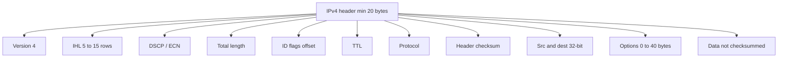

#### IPv4 addressing

32-bit addresses are written **dotted decimal**: four **1-byte** parts, each **0–255**. Example: binary `10101100 00010000 11111110 00000001` → **`172.16.254.1`**. Lowest **`0.0.0.0`**, highest **`255.255.255.255`**.

For decades addresses were in **five categories** — **classful addressing**. It is **no longer used**, but literature still refers to it. Replacement is discussed after the classful review.

**Classful leading bits and ranges:**

| Class | Starts with | Network / host bits | Range taught |
|-------|-------------|---------------------|--------------|
| **A** | `0` | 8 / 24 | `1.0.0.0` – `127.255.255.255` |
| **B** | `10` | 16 / 16 | `128.0.0.0` – `191.255.255.255` |
| **C** | `110` | 24 / 8 | `192.0.0.0` – `223.255.255.255` |
| **D** | `1110` | — | **Multicasting** |
| **E** | `1111` | — | **Reserved for future use** |

**Network address** = **first IP** of a network or subnet. Example host **`192.168.64.100/24`**: `/24` means **24 network bits**, **8 host bits**. Mask is **24 ones and 8 zeros** = **`255.255.255.0`**. Network = host IP **AND** mask → **`192.168.64.0`**.

Classful addressing allowed **only three** default masks:

| Class | Mask | Prefix |
|-------|------|--------|
| A | `255.0.0.0` | `/8` |
| B | `255.255.0.0` | `/16` |
| C | `255.255.255.0` | `/24` |

#### CIDR (RFC 1519)

**Classless inter-domain routing:** allocate remaining IPs in **variable-sized blocks without regard to classes**. A site needing **2000** addresses gets a block of **2048** on a **2048-byte boundary** (to ease forwarding).

Worked pool starting at **`194.24.0.0`**:

| Site | Need | Assignment | Mask |
|------|------|------------|------|
| **Cambridge University** | 2048 | `194.24.0.0` – `194.24.7.255` | `255.255.248.0` |
| **Oxford University** | 4096 | Cannot start at `194.24.8.0` (not on a **4096** boundary); gets `194.24.16.0` – `194.24.31.255` | `255.255.240.0` |
| **University of Edinburgh** | 1024 | `194.24.8.0` – `194.24.11.255` | `255.255.252.0` |

#### NAT

**Network Address Translation:** give a company **one IP for Internet traffic**. Inside, every computer has a **unique IP** for **internal routing**. When a packet **exits** to the **ISP**, **address translation** occurs.

Three **private** ranges (also **not used for websites**). **No packet containing these addresses may appear on the Internet itself.** Defined in **RFC 1918**:

| Class-style block | Range | Hosts taught |
|-------------------|-------|--------------|
| Class A | `10.0.0.0` – `10.255.255.255` | 16,777,216 per network |
| Class B | `172.16.0.0` – `172.31.255.255` | 1,048,576 per network |
| Class C | `192.168.0.0` – `192.168.255.255` | 65,536 per network |

Operation: inside, machines use **`10.x.y.z`**. On the way out, a **NAT box** maps e.g. **`10.0.0.1`** to the company’s **global** IP (**`198.60.42.12`** in the figure). The NAT box is **often combined with a firewall** that provides security by **careful control**.

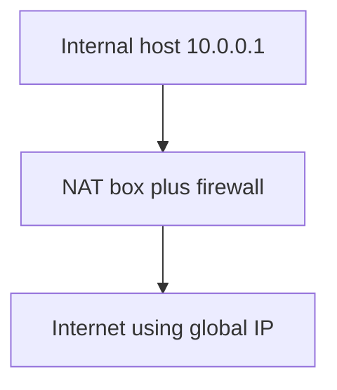

#### IPv6

**IPv6** was developed by the **IETF** to deal with **IPv4 address exhaustion** and is **intended to replace IPv4**. Addresses are **128 bits**, written as **eight groups of four hexadecimal digits** separated by **colons**.

**Main features:**

1. **Longer addresses:** 128 vs 32.
2. **Simpler header:** **seven fields** vs **13** in IPv4.
3. **Better support for options.**
4. **Security** is a big advance.
5. More attention to **quality of service**.

An IPv6 packet = **header + payload**. The **fixed header occupies the first 40 bytes**.

| Field | Size | Meaning taught |
|-------|------|----------------|
| **Version** | 4 bits | Always **6** |
| **Traffic class** | 8 bits | Distinguish packets with different **real-time delivery** requirements |
| **Flow label** | 20 bits | Source and destination set up a **pseudo-connection** with particular **flow-control** properties |
| **Payload length** | 16 bits | Bytes **after** the 40-byte header (name/meaning changed from IPv4 **total length**; **the 40 header bytes are not counted**) |
| **Next header** | 8 bits | How to interpret what follows: which of **six extension headers**, or which **transport protocol** if this is the last IP header |
| **Hop limit** | 8 bits | Keeps packets from living forever; **same practice as IPv4 TTL** — **decremented each hop**. IPv4 TTL was **in theory seconds** but **no router used it that way**, so the name changed |
| **Source address** | 16 bytes | |
| **Destination address** | 16 bytes | |

Example written form: `8000:0000:0000:0000:0123:4567:89AB:CDEF`.

**Compression:**

1. **Leading zeros** in a group may be omitted (`0123` → `123`).
2. **One or more groups of 16-bit zeros** may be replaced by **`::`**, giving e.g. **`8000::123:4567:89AB:CDEF`**.

**Extension headers** (optional, efficient encoding of missing IPv4 features). **Six** kinds:

| Extension | Role |
|-----------|------|
| **Hop-by-hop** | Miscellaneous information for **routers** |
| **Destination options** | Extra information for the **destination** |
| **Routing** | **Loose list** of routers to visit |
| **Fragmentation** | Management of datagram **fragments** |
| **Authentication** | Verify the **sender’s identity** |
| **Encapsulating Security Payload** | Information about **encrypted** contents |

**IPv4 vs IPv6 field comparison:**

- **IHL is gone** — IPv6 header **fixed length**.
- **Protocol is gone** — **next header** says what follows the last IP header.
- **All fragmentation fields removed** — IPv6 uses a **different fragmentation approach**.
- **TTL → hop limit**.
- **Checksum gone** because calculating it **greatly reduces performance**.

### Key terms

| Term | Meaning in this lecture |
|------|-------------------------|
| RFC 791 / RFC 760 | IPv4 spec (1981) replacing the 1980 definition |
| IHL | Header length in 32-bit words; 5–15 |
| DSCP / ECN | Diffserv class; congestion signal without drops |
| DF / MF | Don’t fragment; more fragments |
| Classful addressing | Historic A–E split; no longer used |
| CIDR (RFC 1519) | Variable blocks, class-free, aligned on block size |
| NAT | One public IP; rewrite internals at the border |
| RFC 1918 | Private ranges 10/8, 172.16/12, 192.168/16 |
| Flow label | IPv6 pseudo-connection / QoS-related marking |
| Hop limit | IPv6 TTL-as-actually-used |
| `::` | Compression of one or more zero 16-bit groups |

### Lecture takeaways

- IPv4 is connectionless, 32-bit, RFC 791; the header is 20 bytes plus up to 40 bytes of options, with DSCP/ECN, fragmentation (DF/MF/offset), TTL, protocol, and header-only checksum.
- Classful A–E is historical; CIDR hands out aligned variable blocks (Cambridge 2048, Oxford 4096 on a 4096 boundary, Edinburgh 1024).
- NAT plus RFC 1918 private space, often with a firewall, keeps internal 10.x addresses off the public Internet.
- IPv6 is 128-bit, 40-byte fixed header, seven fields, better options/security/QoS; addresses compress with dropped leading zeros and `::`.
- IPv6 drops IHL, protocol, fragmentation fields, and checksum; TTL is renamed hop limit; six extension headers (including AH and ESP) carry what IPv4 stuffed into options and flags.

---

# M13: UDP — User Datagram Protocol

**Source:** https://www.youtube.com/watch?v=g4p_kJxiRHk
**Instructor / expert:** Dr Sunil Kumar, Department of Electrical and Computer Engineering, Punjab Agricultural University, Ludhiana

### Learning objectives

- Place UDP between applications and IP as a connectionless, unreliable, low-overhead process-to-process protocol.
- Parse the 8-byte user-datagram header and the hexadecimal dump example (ports, length, data).
- List UDP services: well-known ports, no connection, no flow/window, checksum with pseudo-header, no congestion control.
- Trace encapsulation/decapsulation, queuing, and multiplexing/demultiplexing.
- Describe the five-component UDP “package” (control-block table, input queues, control-block / input / output modules).

### Core concepts

Contents: **UDP introduction**, **user-datagram characteristics**, **UDP services**, then **features** and **UDP packages**.

#### Introduction

UDP is a **simple transport protocol** that extends IP’s **host-to-host** packet delivery into **process-to-process** communication. Many processes run on a host, so UDP adds **demultiplexing** so they can **share the network**.

UDP sits **between the application layer and the IP layer** in the TCP/IP suite — intermediary between **application programs** and **network operations**.

Transport duties vs what UDP actually does:

- **Process-to-process communication** — UDP uses **port numbers**.
- **Control at transport** — UDP does this at a **minimal** level: **no flow control**, **no acknowledgement** of received packets.
- **Error control to some extent** — if UDP detects an error, it **silently drops** the packet.

UDP is **connectionless** and **unreliable**. It adds essentially **nothing** to IP except **process-to-process** instead of **host-to-host**. **Minimum overhead**. If a process wants a **small message** and **does not care about reliability**, UDP is appropriate: **much less interaction** than TCP.

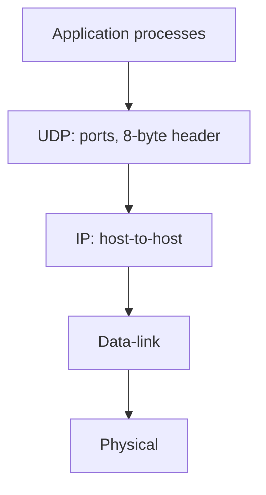

#### User datagram format

UDP packets are **user datagrams** with a **fixed 8-byte header**.

| Field | Size | Meaning |
|-------|------|---------|
| **Source port** | 16 bits | Process on the source host; range **0–65,535**. If the source is a **client**, usually an **ephemeral** port chosen by UDP software. If the source is a **server**, usually a **well-known** port |
| **Destination port** | 16 bits | Process on the destination. If destination is a **server**, usually **well-known**; if a **client**, usually **ephemeral**. The server **copies** the ephemeral port from the request |
| **Length** | 16 bits | **Header plus data**, theoretically **0–65,535** bytes. In practice much less because the user datagram sits in an IP datagram whose total length is **65,535**. Length is **not strictly necessary**: IP total length minus IP header length yields UDP length, but designers preferred the destination UDP to compute data length **from the UDP header** rather than ask IP. When IP delivers the user datagram, it has **already dropped the IP header**. Formula taught: **UDP length = IP length − IP header length** |
| **Checksum** | 16 bits | Errors over the **entire** user datagram (**header + data**) |

**Hex dump example:** `CB84 000D 001C 001C`

| Question | Answer taught |
|----------|----------------|
| Source port | First four hex digits **`CB84`** = **52100** |
| Destination port | Next four **`000D`** = **13** |
| Total length | Third four **`001C`** = **28 bytes** |
| Data length | 28 − 8 = **20 bytes** |
| Client→server or reverse? | Destination **13** → **client to server** |
| Client process | **Daytime** |

#### UDP services

**Process-to-process communication** uses **sockets** = **IP addresses + port numbers**. Well-known UDP ports:

| Port | Service |
|------|---------|
| 7 | Echo |
| 9 | Discard |
| 11 | Users |
| 13 | Daytime |
| 17 | Quote (QOTD) |
| 19 | Chargen |
| 53 | Domain (DNS) |
| 67 | BOOTP server |
| 68 | BOOTP client |
| 69 | TFTP |
| 111 | RPC |
| 123 | NTP |
| 161 | SNMP |
| 162 | SNMP trap |

**Connectionless service.** Each user datagram is **independent**. **No relationship** even if they share source process and destination program. Datagrams are **not numbered**. **No connection establishment or termination** (unlike TCP). Each datagram may take a **different path**. Processes **cannot** hand UDP a **byte stream** and expect it to **chop** it into related datagrams. **Each request must fit in one user datagram**. Only processes sending **short** messages (taught bound: less than **65,507** bytes) are appropriate.

**Flow control.** **None**, hence **no window**. The receiver **may overflow**. If flow control is needed, the **using process** must provide it.

**Error control.** **None except checksum**. Sender does **not** know if a message was **lost or duplicated**. On checksum error the datagram is **silently discarded**. If error control is needed, the **process** must provide it.

**Checksum.** Unlike IPv4’s header checksum, UDP checksum covers **three sections:** a **pseudo-header**, the **UDP header**, and **application data**. The pseudo-header is taken from the **IP header** of the encapsulating packet, some fields **zeroed**. Without the pseudo-header, a user datagram could arrive intact yet be delivered to the **wrong host** if the IP header were corrupted. The **protocol** field ensures the packet belongs to **UDP not TCP** (same destination port can be used by either). UDP protocol value = **17**; if it changes in transit, receiver checksum fails and UDP **drops** the packet rather than handing it to the wrong protocol. Pseudo-header fields match the **last 12 bytes** of the IP header in spirit.

**Congestion control.** **None.** UDP **assumes** packets are **small** and **cannot create congestion** — an assumption that **may not hold** when UDP carries **real-time audio and video**.

**Encapsulation.** Process sends the message to UDP with a **pair of socket addresses** and **data length**. UDP adds its header and passes the user datagram to IP with those sockets. IP adds its header with **protocol = 17**. The IP datagram goes to data-link (header added) then physical (**electrical or optical** signals).

**Decapsulation.** Physical **decodes** bits → data-link **checks** using its header; if OK, **header and trailer dropped**, datagram to IP. IP checks; if OK, **header dropped**, user datagram to UDP with **sender and receiver IP addresses**. UDP checksums the whole user datagram; if OK, **header dropped**, application data plus **sender socket address** go to the process (so it can **respond**).

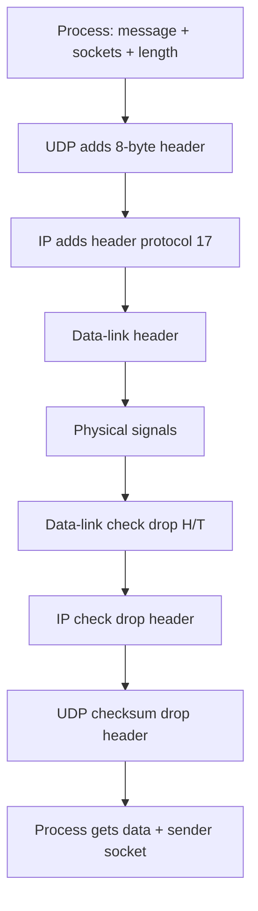

**Queuing.** Queues are **associated with ports**. On the **client**, a process **requests a port** from the OS. Some implementations create **incoming and outgoing** queues per process; others **only incoming**. Even if a process talks to **many** peers, it gets **one port** and eventually **one outgoing and one incoming queue**. Client queues are usually identified by **ephemeral** ports. Queues last **as long as the process runs**; they are **destroyed** on terminate. The client sends using the **source port** in the request; UDP **dequeues one by one**, adds the header, and hands to IP. An **outgoing queue can overflow**; the OS may then ask the client to **wait**.

**Multiplexing and demultiplexing.** One UDP on a host, **many** processes.

- **Multiplexing (sender):** many-to-one. UDP accepts messages distinguished by **port numbers**, adds a header, passes to IP.
- **Demultiplexing (receiver):** one-to-many. UDP takes datagrams from IP, error-checks, drops the header, delivers by **port number**.

**Comparison with a generic connectionless simple protocol.** The **only difference** is UDP’s **optional checksum** for corruption at the receiver. If present, the receiver can discard a bad packet; **no feedback** is sent to the sender. UDP **is** that simple protocol **plus optional checksum**.

#### Features (advantages and disadvantages)

**Connectionless service** can be an **advantage or disadvantage** by application. Advantage: **short request and short response** each in **one** datagram — connection setup/teardown overhead is **significant** otherwise. Connection-oriented would exchange **at least nine packets**; connectionless needs **two**. Connectionless → **less delay**; connection-oriented → **more delay**. If **delay** matters, connectionless is preferred.

**Lack of error control** = **unreliable service**. Most applications want reliability, but reliability has **side effects**: a lost/corrupt part must be **resent**, so the receiver **cannot deliver that part immediately** → **uneven delay** between parts of the message. Some applications **do not notice**; for others uneven delay is **crucial**.

**Lack of congestion control.** UDP does **not** create **extra** traffic on an **error-prone** network the way TCP may **resend several times** and **worsen congestion**. So **lack of error control can be an advantage** when **congestion** is the big issue.

#### UDP package (implementation sketch)

A simple UDP package has **five components:**

1. **Control-block table**
2. **Input queues**
3. **Control-block module**
4. **Input module**
5. **Output module**

**Control-block table** tracks **open ports**. Each entry has at least **four fields:** **state** (`free` or `in use`), **process ID**, **port number**, **corresponding queue number**.

**Input queues:** **one per process**. This design uses **no output queues**.

**Control-block module** manages the table. A starting process asks the OS for a port: **well-known** for servers, **ephemeral** for clients. It passes **PID and port** to create a table entry. Queue-number field starts at **zero**. The lecture **does not include a strategy for a full table**.

**Input module** receives a user datagram from IP, **searches** the table for the **same port**. If found, it **enqueues** the data using the entry. If **not found**, it generates an **ICMP** message.

**Output module** **creates and sends** user datagrams.

### Key terms

| Term | Meaning in this lecture |
|------|-------------------------|
| User datagram | UDP packet; 8-byte header plus data |
| Ephemeral port | Client port chosen by UDP/OS (vs well-known server ports) |
| Socket | IP address + port |
| Pseudo-header | IP-derived fields (including protocol 17) included in the UDP checksum |
| Silent drop | Checksum failure with no NAK to the sender |
| Protocol 17 | IP protocol number for UDP |
| Multiplexing | Many processes → one UDP at the sender |
| Demultiplexing | One UDP → many processes at the receiver |
| Control-block table | Open-port state, PID, port, queue number |
| ICMP on unknown port | Input module’s response when no table entry matches |

### Lecture takeaways

- UDP is a thin, connectionless, unreliable transport: ports for process-to-process delivery, almost no control, silent drop on error.
- Header is always 8 bytes (src, dest, length, checksum); example `CB84/000D/001C/001C` is client port 52100 to daytime (13) with 20 data bytes.
- No connections, numbering, flow window, or congestion control; checksum (with pseudo-header) is the only error tool and is optional versus a bare datagram protocol.
- Encapsulation sets IP protocol 17; decapsulation peels physical → link → IP → UDP and passes the sender socket up for a reply.
- Features that look like weaknesses (no setup, no retry) are taught as advantages for short exchanges and for not feeding congestion.
- The sketched package: control-block table, per-process input queues, modules for bind, receive (ICMP if no port), and send.

---

# M14: IPSec Security Protocol

**Source:** https://www.youtube.com/watch?v=wVX5KLPh_o8
**Instructor / expert:** Prof Yogesh Chaba, Department of Computer Engineering and IT, Guru Jambheshwar University of Science & Technology, Hisar

### Learning objectives

- Define IPsec as a network-layer framework (not a single protocol) for authenticating and encrypting IP packets.
- Name architecture pieces from RFC 2401: security associations, AH, ESP, transport vs tunnel mode, and IKE.
- Contrast transport mode (payload protected; IP header intact) with tunnel mode (whole packet wrapped; used for VPNs).
- Parse AH and ESP headers/trailers, ICV, SPI, and sequence numbers for anti-replay.
- State IKE’s role (RFC 2409): mutual authentication, SA setup, aggressive/main modes, and three authentication methods.

### Core concepts

Contents: **IPsec introduction**, **architecture**, **AH and ESP**, then **IKE** for key management.

#### Introduction

**IPsec** (Internet Protocol Security) is a **framework for a set of protocols** providing security at the **network / packet-processing** layer. Earlier approaches put security at the **application** layer. IPsec is especially useful for **virtual private networks** and for **remote user access through dial-up** to **private networks**. A **big advantage:** security can be arranged **without changing individual user computers**.

IPsec is a **protocol suite** that **authenticates and encrypts each IP packet** of a session. It can protect:

- **Host-to-host** (a pair of hosts)
- **Network-to-network** (a pair of **security gateways**)
- **Network-to-host** (gateway and host)

IPsec is **not a single protocol** but a **set of services and protocols** that together are a **complete security solution** for an IP network. Protections taught:

- **Confidentiality** by **encrypting** data
- **Integrity** by **checksum or hash**
- **Authentication** by **signatures and certificates**
- Protection against certain attacks such as **replay**
- **Session** handling together with **key management**

#### Architecture (RFC 2401)

**RFC 2401** defines the basic IPsec architecture. It covers **security associations (SA)**: a **bundle of algorithms and data** with the **parameters** needed by the two IPsec protocols **Authentication Header (AH)** and **Encapsulating Security Payload (ESP)**. Those protocols run in **transport mode** or **tunnel mode**. Key management uses **Internet Key Exchange (IKE)**.

#### Modes

IPsec can be implemented **host-to-host transport** or **network tunneling**.

| Mode | What is protected | Routing / header | Where it is used |
|------|-------------------|------------------|------------------|
| **Transport** | Usually only the **payload** is encrypted and authenticated | **IP header neither modified nor encrypted** so **routing is intact** | Only between **endpoints of the communication**; **cryptographic endpoints = communication endpoints** (hosts A and B) |
| **Tunnel** | The **entire IP packet** is encrypted or authenticated, then **encapsulated in a new IP packet with a new IP header** | New outer header | Between **arbitrary peers** when **at least one cryptographic endpoint is not** a communication endpoint of the secured packets (e.g. **A ↔ router RA**, **RA ↔ RB**, **RB ↔ B**). Outer source/destination can be **RA and RB**. Used to create **virtual private networks** for **network-to-network**, **host-to-network**, and **host-to-host** |

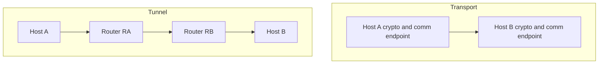

IPsec offers two security-service choices:

- **AH** — essentially **authentication of the sender**
- **ESP** — **authentication of the sender and encryption of data**

The associated information is inserted in a **header that follows the IP header**.

#### Authentication Header (AH)

AH is a member of the IPsec suite. It guarantees **connectionless integrity** and **data-origin authentication** of IP packets. Optionally it protects against **replay** with a **sliding window**, **discarding old packets**.

AH is one of **two core** IPsec security protocols. It authenticates **all or part** of a datagram by adding a header **calculated from datagram values**. AH works in **both transport and tunnel** modes.

**Packet layout:**

- **Transport:** AH is added **after** the payload that consists of **TCP header and data**.
- **Tunnel:** AH is added **after the original IP header and data** (data here also contains **TCP or UDP**).

AH uses a **hashing algorithm** and a **key known only to source and destination**. The **SA** between the two devices specifies those particulars so **only they** can compute. The source computes and puts the **Integrity Check Value (ICV)** in a special header with other fields. The destination **repeats the calculation with the shared key** and sees immediately whether **any fields in the original datagram were modified**.

**AH field format:**

| Field | Size | Meaning |
|-------|------|---------|
| **Next header** | 1 byte | Protocol number of the header **after AH**; used to **link headers** |
| **Payload length** | 1 byte | Length of the **AH itself** (including the ICV payload), in **2-octet units minus 2**. Example: value **4** = \(3+3-2\): first **three** 32-bit rows plus **three** 32-bit ICV rows → **24 octets** |
| **Reserved** | 16 bits | Unused; **set to zero** |
| **SPI** (Security Parameter Index) | 32 bits | Arbitrary value which, with the **destination IP**, **identifies the SA** of the receiving party |
| **Sequence number** | 32 bits | **Incremented by one** for every packet to **prevent replay**. When replay detection is on, sequence numbers are **never reused**; a **new SA must be renegotiated** before incrementing **beyond the maximum** |
| **ICV** | Multiple of 32 bits | May contain **padding** to align to an **8-octet** boundary for **IPv6** or a **4-octet** boundary for **IPv4** |

AH gives **integrity and authentication** so devices can verify messages arrived **intact** from the peer. For many applications that is **only one piece**: defenders also want to stop intermediates from **examining contents**. **AH is not enough for privacy**; **privacy is ESP**.

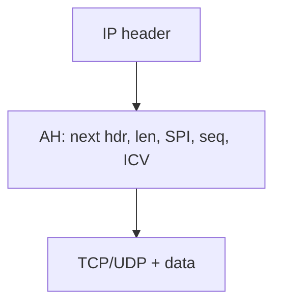

#### Encapsulating Security Payload (ESP)

ESP is the other core protocol. IPsec (via ESP) provides **origin authenticity, integrity, confidentiality, and protection of packets**. ESP **operates directly on top of IP**. Main job: **privacy** by **encrypting** datagrams — an encryption algorithm **combines data with a key**. ESP also works in **transport and tunnel** modes.

**Packet layout:**

- **Transport:** **ESP header** is added relative to the payload (TCP header + data); **ESP trailer** and **ESP authentication** are placed with that payload as taught (trailer/auth associated **with** the TCP/data region).
- **Tunnel:** the **entire original IP packet** is encapsulated under a **new outer header**. **ESP protects the whole inner IP packet**; the **outer header remains unprotected**. As in transport, **ESP trailer and ESP authentication** are added with the protected data.

ESP reuses some **AH-like fields** but **packages them differently**: not one header, but **three components**.

| Component | Contents | Placement |
|-----------|----------|-----------|
| **ESP header** | **SPI** and **sequence number** | **Before** the encrypted data; exact place depends on **transport vs tunnel** |
| **ESP trailer** | **Padding**, **pad length**, and (interestingly) **next header** | **After** the encrypted data |
| **ESP authentication data** | **ICV**, similar idea to AH | Used when ESP’s **optional authentication** is on |

Field-level:

| Field | Size | Meaning |
|-------|------|---------|
| **SPI** | 32 bits | With destination IP, identifies the receiver’s **SA** |
| **Sequence number** | 32 bits | **Monotonically increasing**, +1 per packet, **anti-replay**; **separate counter per SA** |
| **Payload data** | variable | Encrypted content |
| **Padding** | 0–255 octets | Aligns to the **cipher block size** and aligns the next field |
| **Pad length** | 8 bits | Padding size in octets |
| **Next header** | 8 bits | Next-header information |

**Why split like this:**

1. Some ciphers need a **block size**, so **padding must be after the data, not before** → padding lives in the **trailer**.
2. **ESP authentication data is separate** because it authenticates the **rest of the encrypted datagram after encryption** — it **cannot** sit in the ESP header or trailer.

#### Internet Key Exchange (IKE)

Like many secure protocol sets, IPsec uses a **shared secret**: two devices **encode and decode** with information **only they know**. An outsider may **intercept** but is prevented from **reading** or **tampering**. The primary support protocol for that in IPsec is **IKE**.

**IKE** is defined in **RFC 2409**. It is the **most complicated** IPsec protocol to understand; more than a **real simplification** needs **significant cryptography background**.

Purpose: let devices **exchange information required for secure communication**, including **cryptographic keys** for **encoding authentication information** and **payload encryption**. IKE lets IPsec-capable devices **exchange SAs**.

Features taught:

- IPsec component for **mutual authentication** and **establishing and maintaining security associations**
- Typically used to establish **IPsec sessions**
- **Key exchange** for **network-layer** security
- **Five variations** of an IKE negotiation with **two modes: aggressive and main**
- **Three authentication methods:** **pre-shared**, **public-key encryption**, and **public-key signature**

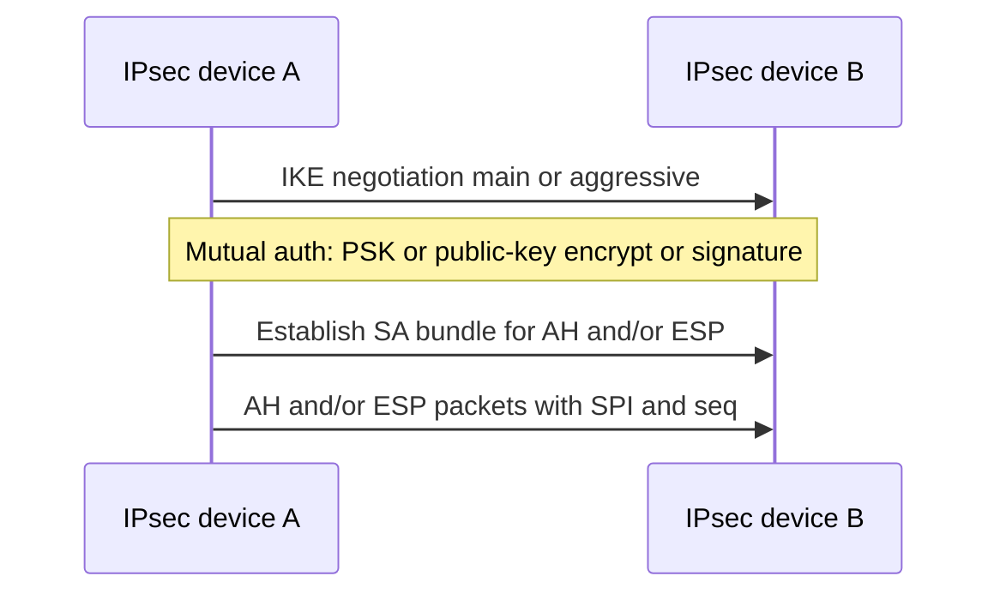

### Key terms

| Term | Meaning in this lecture |
|------|-------------------------|
| IPsec | Network-layer suite: authenticate and encrypt each IP packet; useful for VPNs and dial-up without host software changes |
| RFC 2401 | IPsec architecture (SA, AH, ESP, modes, IKE) |
| SA | Security association: algorithms and parameters for AH/ESP |
| Transport mode | Crypto endpoints = communication endpoints; payload protected, IP header intact |
| Tunnel mode | Whole packet wrapped in a new IP header; VPNs; at least one crypto endpoint is a gateway |
| AH | Integrity and origin authentication; optional anti-replay; no privacy |
| ESP | Encryption (privacy) plus optional authentication |
| SPI | 32-bit index which, with dest IP, selects the SA |
| ICV | Integrity check value from a keyed hash |
| IKE (RFC 2409) | Mutual auth and SA/key setup; main vs aggressive; PSK / public-key encrypt / public-key signature |

### Lecture takeaways

- IPsec secures IP itself (not the application), for host–host, gateway–gateway, or gateway–host, including VPNs, without reconfiguring every PC.
- Architecture is SAs plus AH and/or ESP in transport or tunnel mode, with IKE for keys.
- Transport keeps routing headers visible; tunnel hides the original packet behind gateway addresses and builds VPNs.
- AH authenticates (hash + SA key + ICV, SPI, anti-replay sequence); it does not give confidentiality — that is ESP.
- ESP splits header (SPI, seq), encrypted payload, trailer (pad, pad length, next header), and optional ICV after encryption for block ciphers and post-encrypt authentication.
- IKE (RFC 2409) negotiates SAs with main or aggressive mode and three auth methods; the lecture treats full crypto detail as out of scope.

---

# M15: Network Topologies

**Source:** https://www.youtube.com/watch?v=wwabRIG7MvU
**Instructor / expert:** Dr Navdeep Singh, Department of Computer Engineering, Punjabi University, Patiala

### Learning objectives

- Define a network (nodes, links, distributed processing) and the five criteria: performance, consistency, reliability, recovery, security.
- Distinguish point-to-point from multipoint (spatially vs time-shared) connections.
- Separate physical topology from logical topology.
- Identify mesh (full and partial), star (passive/active/intelligent hub), bus, ring (token), and tree (expanded star), with the advantages and disadvantages taught for each.
- Use those trade-offs to match a topology to a network plan.

### Core concepts

The lecture covers **network types and topologies**: how to **identify basic topologies and variations** and how to **choose an appropriate topology** for a given plan.

A **network** is a set of devices (**nodes**) connected by **communication links**. A node can be a **computer, printer, or any other device** that can **send and receive** data generated by other nodes. Most networks use **distributed processing**: a task is **split among multiple computers** instead of one large machine doing every aspect; **PCs or workstations** handle a subset.

#### Criteria a network must meet

**1. Performance** — rate of transferring **error-free** data, measured as **transit time** and **response time**.

- **Transit time:** time for a **message** to travel from one device to another.
- **Response time:** elapsed time between an **inquiry and a response**.

Depends on **number of users**, **transmission medium**, **hardware capabilities**, and **software efficiency**. Evaluated with two metrics:

- **Throughput:** messages **successfully delivered per unit time**. Controlled by **bandwidth**, **signal-to-noise ratio**, and **hardware limits**. Calculated by **dividing file size by time**, in **Mbps, kbps, or bps**.
- **Delay:** how long a **bit** takes to travel from one node/endpoint to another, in **multiples or fractions of seconds**. Parts: **processing delay** (routers processing the **packet header**); **queuing delay** (time in **routing queues**); **transmission delay** (time to **push the packet’s bits onto the link**); **propagation delay** (time for the **signal to reach** the destination).

We often want **more throughput and less delay**, but they **contradict**: sending **more data** may **raise throughput** and also **raise delay** via **congestion**.

**2. Consistency** — **predictability of response time** and **accuracy of data**. Users like **consistent** response times and develop a feel for **normal** conditions (example: **3 seconds** to print vs **over 30 seconds** signals a **problem**). **Accuracy** decides whether the network is **reliable**; **lost data** destroys **confidence** and users **stop using** the system.

**3. Reliability** — measured by **frequency of failure** (how often the network fails), **recovery time** (time for a device or network to recover), and protection from **catastrophe** (**fire**, **earthquake**).

**4. Recovery** — ability to return to a **prescribed level of operation** after failure, with **lost data nonexistent or minimum**. Based on **backup files**.

**5. Security** — called the **most important aspect for improving network performance**. Threats: **viruses** and **unauthorized access**. Taught practices: **do not open unknown email attachments**; **antivirus** software; **firewalls** to **detect and prevent unauthorized access**; **backup tools** onto **removable media** (CD or zip disk); **turn off the system and unplug the network cable** when unused to avoid **unauthorized interference**.

#### Type of connection

Physical structure = **type of connection** + **topology**.

A **link** is a communications pathway that transfers data from one device to another (visualized as a **line between two points**). For communication, two devices must be connected to the **same link at the same time**. Two connection types:

**Point-to-point** — **dedicated** link between two devices; **entire capacity reserved** for those two. Usually **wire or cable**; also **microwave or satellite**. Changing TV channels with an **infrared remote** is a point-to-point link between remote and TV. Pure examples: **two computers via modems**; **mainframe terminal to front-end processor**; **workstation on a parallel cable to a printer**.

**Multipoint** (also **multi-drop**) — **more than two** devices share **one link**. Capacity is shared **spatially** or **temporally**: **spatially shared** if several devices can use the link **simultaneously**; **time-shared** if users **take turns**.

#### Physical vs logical topology

**Network topology** is the arrangement of **links, nodes, etc.** — the topological structure, depicted **physically or logically**.

- **Physical topology:** placement of components, **device location**, **cable installation**, cabling layout, node locations, interconnections. Determined by **network-access devices and media**, desired **control or fault tolerance**, and **cabling / circuit cost**.
- **Logical topology:** **how data flows** regardless of physical design. Two networks may differ in **distances, physical interconnections, rates, or signal types** yet share a **logical topology**.

**Four basic topologies:** **mesh, star, bus, ring** (tree is taught afterward as a hybrid).

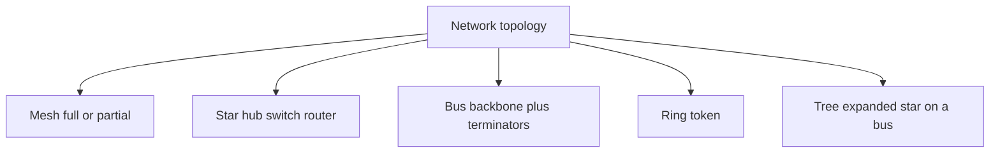

#### Mesh

Every node is interconnected; a node **sends its own signals** and **relays** others. A **true mesh** connects **every node to every other node**. **Very expensive** because of **redundant connections**; **not mostly used** in computer networks; **common in wireless**. **Flooding or routing** is used.

**Fully connected mesh.** Every device has a **dedicated point-to-point** link to every other device (**dedicated** = that link carries traffic **only between those two**). For **n** nodes, each must connect to **n−1** others → **n(n−1)** physical links. If each link is **bidirectional**, divide by two: **n(n−1)/2 duplex-mode links**. Each device needs **n−1 I/O ports**. **Full mesh is used only for backbone networks**.

**Partial mesh.** More practical: some systems are meshed as above; the rest connect to **only one or two** devices — workstations **indirectly** connected. **Less costly**, **less redundancy**.

**Advantages:** data from **different devices simultaneously**; withstands **high traffic**; if one component fails an **alternative** remains so transfer **continues**; **expansion/modification** without disrupting other nodes.

**Disadvantages:** **redundancy** in many connections; **overall cost** much higher than other topologies; **setup, maintenance, and administration** are **difficult**.

#### Star

All components connect to a **central device** called a **hub**, which may be a **hub, router, or switch**. Unlike bus (nodes on a **central cable**), here every workstation has a **point-to-point** link to the center, so every computer is **indirectly** connected to every other via the hub. **All data passes through the center** before the destination. The hub is a **junction**, and it **manages and controls** the whole network. Depending on the device, it can act as a **repeater / signal booster**. The center can also talk to **hubs of other networks**. **UTP Ethernet cable** connects workstations to the central node.

**Hub subtypes:**

| Type | Behavior |
|------|----------|
| **Passive hub** | Simple **signal splitter**; connects the arms while keeping **electrical characteristics**. **Routes all traffic to all nodes** → **heavy load** when many talk; every computer must **read each address** and **discard** frames not for it |
| **Active hub** | Same function **plus electronics that regenerate and retransmit**; can **extend** network size |
| **Intelligent hub** | Passive/active functions plus **informed path selection** and some **network management**. Routes traffic **only to the branch** where the receiver sits; if **redundant paths** exist, can **route around** cable problems. **Routers, bridges, and switches** are examples of hub devices that route **intelligently**. May include **diagnostics** for troubleshooting |

**Advantages vs bus:** **better performance**; signals need not go to **all** workstations; a sent signal reaches the destination after **no more than three or four devices and two or three links**. Performance depends on **central-hub capacity**. **Easy to add/remove** nodes without affecting the rest. **Centralized management** helps monitoring. **Failure of one node or link** does not take down the rest; **easy to detect and troubleshoot**.

**Disadvantages:** **too much dependency** on the center — if it fails, **the whole network goes down**. Hub/router/switch **raises cost**. **Performance and how many nodes can be added** depend on **central capacity**.

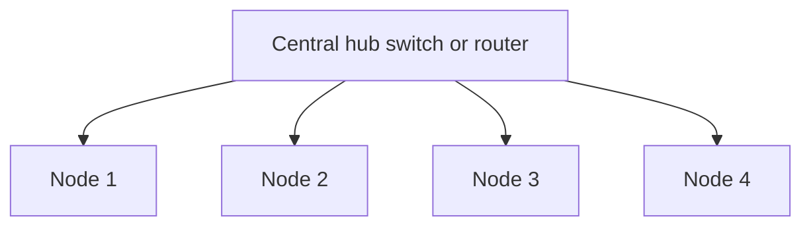

#### Bus (linear bus)

**Simplest** topology. All nodes (**computers and servers**) connect to a **single cable** — the **bus** — with **interface connectors**. That cable is the **backbone**. Every workstation talks through this bus. A signal from the source is **broadcast** and travels to **all** workstations; **only the intended recipient** whose **MAC or IP matches** accepts it; others **discard**. A **terminator** at each end of the central cable **prevents bouncing**. A **barrel connector** can **extend** it.

**Advantages:** easy to **set up and extend**; **least cable** compared with other networks; **costs very little**; mostly used in **small networks / LANs**.

**Disadvantages:** **limit** on central-cable length and node count; **dependency on the main cable** — if it fails, **the whole network breaks**; **proper termination is required** to damp signals; **hard to detect and troubleshoot** a fault at an individual station; **maintenance cost can rise** over time; **efficiency falls** as device count rises; **unsuitable for heavy traffic**; **security is very low** because **all computers receive** the sent signal.

#### Ring

Nodes form a **closed loop**. Each workstation connects to **two neighbors** and communicates with those adjacent nodes. Data travels **in one direction**. Send/receive uses a **token**.

**Token:** a piece of information sent **with data** by the source. The next node checks whether the signal is **for it**. If yes, it **receives** and puts an **empty token** back; otherwise it **passes token plus data** onward until the destination. **Only the node holding the token may send**; others **wait for an empty token**. Found in **offices, schools, and small buildings**.

**Advantages:** **organized**; a node sends when it has an **empty token** → **fewer collisions**; traffic in **one direction at very high speed**; under **increasing load**, **better than bus**; **no network server required** to control workstation connectivity; **additional components do not affect performance**; **equal access** to resources.

**Disadvantages:** each packet must pass **all computers between source and destination** → **slower than star**; if **one workstation or port goes down**, the **entire network** is affected; highly dependent on the **wire** connecting components; **MAUs and network cards** are **expensive** compared with **Ethernet cards and hubs**.

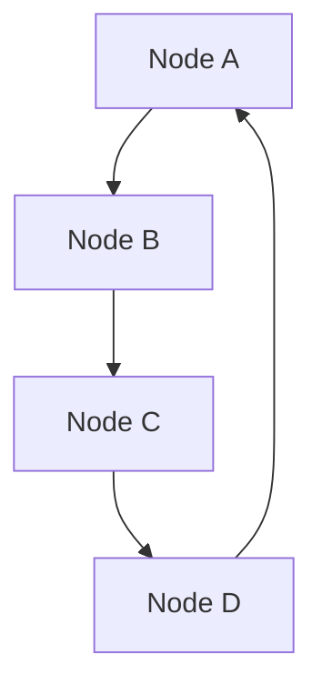

#### Tree (expanded star)

**Integrates star and bus.** Star: computers through a **central hub**. Bus: devices on a **common cable**. In **tree**, **several star networks are connected using a bus**. The main cable is like a **tree stem**, stars like **branches**. Also called **expanded star topology**. **Ethernet** is commonly used. Each segment has **dedicated point-to-point wiring** to a central hub.

**Advantages:** used where **star or bus alone cannot scale**; **expansion is possible and easy**; the network can be **divided into segments** that are **easy to manage**; **error detection and correction is easy**; if **one segment is damaged**, **other segments are not affected**.

**Disadvantages:** **relies heavily on the main bus cable** — if it **breaks**, the **whole network is crippled**; more nodes/segments make **maintenance difficult**; **scalability depends on the type of cable used**.

Next lecture (previewed): **types of transmission media**.

### Key terms

| Term | Meaning in this lecture |
|------|-------------------------|
| Node | Computer, printer, or other send/receive device |
| Distributed processing | Split a task across multiple machines |
| Transit vs response time | Message travel time vs inquiry-to-answer delay |
| Throughput | Successful messages per unit time (file size / time) |
| Four delay components | Processing, queuing, transmission, propagation |
| Point-to-point / multipoint | Dedicated pair vs shared link (spatial or time-shared) |
| Physical vs logical topology | Cable/device layout vs how data actually flows |
| Full mesh | \(n(n-1)/2\) duplex links; backbone use |
| Passive / active / intelligent hub | Splitter vs regenerator vs path-selecting (router/bridge/switch) |
| Terminator / barrel connector | Stop bus reflections; extend the bus |
| Token | Permission to send on a ring |
| Tree / expanded star | Stars joined by a bus backbone |

### Lecture takeaways

- Networks are linked nodes doing distributed work; they are judged on performance (throughput vs delay), consistent response, reliability, recovery from backups, and security (antivirus, firewalls, backups, unplug when idle).
- Links are point-to-point (dedicated, including IR remote or satellite) or multipoint (spatial or turn-taking share).
- Physical layout can differ from logical data flow; the taught shapes are mesh, star, bus, ring, and tree.
- Full mesh is \(n(n-1)/2\) duplex links and is for backbones; partial mesh cuts cost; wireless often meshes with flooding or routing.
- Star is easy to grow and troubleshoot but dies with the hub; bus is cheap for small LANs but broadcasts to everyone and dies with the backbone; ring is ordered and collision-light via tokens but one break stops the ring; tree scales star+bus until the stem cable fails.

---

# M16: Animated Cursor Vulnerability — Proof of Concept I

**Source:** https://www.youtube.com/watch?v=I82Pgkv7Awc
**Instructor / expert:** Dr. Maninder Singh, Professor and Dean of Academic Affairs, Thapar University, Patiala (also course coordinator)

### Learning objectives

- Restate **CVE** (Common Vulnerabilities and Exposures) and why a **2007 Windows animated-cursor** flaw is still taught.
- Distinguish a **client-side attack** from traffic a **perimeter firewall** can filter.
- Define **remote code execution (RCE)** as unauthorized code running on someone else's machine.
- Explain at a concept level that Windows loads variable-size **`.ANI`** cursors via **`user32.dll`**, and that a malformed cursor can cause a **buffer overflow**.
- Name the lecture's defensive close: **patch** legacy systems; study **client-side attacks** and **buffer overflow**.

### Core concepts

The previous lecture introduced **CVE** — **Common Vulnerabilities and Exposures**. This module applies that idea to a real Windows flaw: the **animated cursor vulnerability**.

#### What an animated cursor is

Windows ships many mouse pointers. Examples given:

| Cursor | Character in this lecture |
|--------|---------------------------|
| I-beam (“I”) | Text caret in Notepad; small, not an animation |
| Hourglass | Animated sand falling from one bulb to the other |
| Horse-riding pointer | Larger animated cursor |

Animated pointers **differ in file size**. Loading them was implemented in **`user32.dll`**.

#### Public description of the flaw

A public write-up states that the issue can be triggered from a **malicious web page** and can result in **remote code execution**:

- **Malicious web page** — a site the *user* chooses to visit that hosts hostile content.
- **Remote code execution** — running code on another person's machine **without proper authorization**. The lecture treats RCE as an attacker's “ultimate goal”: steal information or otherwise act as the victim.

#### Client-side attack versus the network firewall

Organizational security is often implemented at the **periphery**. A **network firewall** filters traffic *entering* the organization.

That model fails when someone **inside** browses a hostile site. Most organizations **allow outbound HTTP and HTTPS**. If the destination page hosts a malicious cursor, the visitor can be compromised. That pattern is a **client-side attack**: the client approaches the attacker.

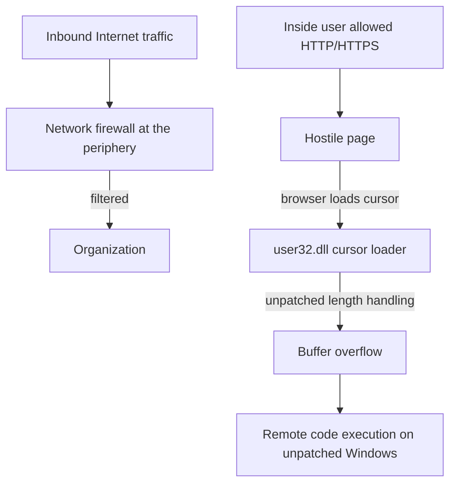

#### Why a 2007 bug is still taught

The vulnerability was **discovered in 2007**. **Legacy systems** still run old, unpatched operating systems. Affected families named: **Windows XP**, **Windows 2000**, and **Windows Vista**.

The demonstration is framed as an **isolated lab** (hypervisor host, a Linux web role, a Windows XP browser role) so students can *see* that a page which merely **assigns a CSS cursor** can make Internet Explorer **load a `.ANI` file**. The file format is **RIFF** (`52 49 46 46`). A **buffer overflow** in the loader can overwrite the **instruction pointer (EIP)** — the diagnostic that attacker-controlled data became the next-instruction address.

The lecture stresses two constraints that matter for *defenders* as well as for understanding the bug class:

- The file must remain a **recognized cursor** (the **RIFF** header must stay intact or the loader rejects it).
- Control of EIP is the classic **buffer-overflow** observation: if the next-instruction address is attacker-controlled, **arbitrary / remote code execution** becomes possible.

#### Closing assignment

Study **client-side attacks** and **buffer overflow**. The avoidance taught here is **patching** the OS so the cursor loader no longer overflows.

### Key terms

| Term | Meaning in this lecture |
|------|-------------------------|
| CVE | Common Vulnerabilities and Exposures — catalog of named flaws |
| Animated cursor / `.ANI` | Variable-size Windows pointer animation, loaded through `user32.dll` |
| RIFF | File header that identifies an animated cursor |
| Network firewall | Perimeter filter for *inbound* traffic; does not stop a user who *goes out* to the web |
| Client-side attack | Compromise that starts because the insider visits a hostile page |
| Remote code execution | Running code on another machine without authorization |
| EIP | Instruction pointer; overflow target in the demonstration |
| Patch | The stated way to avoid the flaw on systems that still run the old loader |

### Lecture takeaways

- Perimeter firewalls do not stop **client-side** browsing of a page that hosts a malicious cursor.
- The 2007 animated-cursor bug is a **buffer overflow in the Windows cursor loader** (`user32.dll`) that can yield **RCE** on **unpatched XP / 2000 / Vista**.
- A page need only **assign a CSS cursor URL** to a crafted **RIFF `.ANI`**.
- Overflow that **overwrites EIP** is the diagnostic that attacker-controlled data became the next-instruction address.
- **Patch** legacy systems; study client-side attacks and buffer overflow.

---

# M17: Animated Cursor Vulnerability — Proof of Concept II

**Source:** https://www.youtube.com/watch?v=DhcLjc4adPk
**Instructor / expert:** Dr. Maninder Singh, Professor and Dean of Academic Affairs, Thapar University, Patiala (also course coordinator)

### Learning objectives

- Continue the animated-cursor demonstration conceptually: after EIP is attacker-controlled, execution can be redirected using instructions **already mapped** in system DLLs.
- Contrast **bind** vs **reverse** remote-shell *models* as firewall-relevant ideas (inbound listen vs victim-initiated outbound).
- Recite the **defensive lessons actually taught**: browse with **least privilege**, treat unexpected email links as client-side lures, **patch / hotfix** from **cve.mitre.org**, and see **malware / ransomware** as the next threat category.

### Core concepts

Lecture I stopped after showing that a malformed `.ANI` can overwrite **EIP**. This session extends the same **Internet Explorer + crafted cursor** demonstration on **Windows XP** to show how **buffer overflow** plus a **malicious web page** can yield **remote access** — and then how to **think about stopping it**.

#### Reusing mapped library code

Memory holds the browser process **and many DLLs** (`user32.dll`, `shell32.dll`, `kernel32.dll`, `ntdll`, …). The lecture's *idea* (not a recipe) is that once EIP is attacker-controlled, it can be pointed at an instruction **already present** in a loaded module so the CPU **enters the overflowed buffer**. Registers are inspected in a debugger because there is **no fixed map** of where a variable-size cursor lives; a large animation may sit on a **heap** reached by a **pointer-to-pointer**. **Byte order** (little-endian / host vs network) is mentioned because multi-byte addresses in a file are stored reversed from how humans write them.

#### Shell models and the firewall you already allow

**Shellcode** is defined as instructions that, if they run, give a **command interpreter** on the remote machine. Two delivery *ideas* are distinguished as **firewall-relevant models**:

| Model | Idea as taught | Why it matters to a defender |
|-------|----------------|------------------------------|
| **Bind** | Victim listens; outsider connects *in* | Needs an inbound path the perimeter often blocks |
| **Reverse** | Victim connects **out** to the other party, carrying the shell | Uses a connection the victim **initiates** — the same class of outbound HTTP/HTTPS organizations already allow |

The demonstration's lesson is that a **user-initiated outbound** session can carry a remote shell, and that **killing the browser does not necessarily drop** that session. **`netstat`** on the victim would show an **ESTABLISHED** outbound TCP connection after the URL was opened.

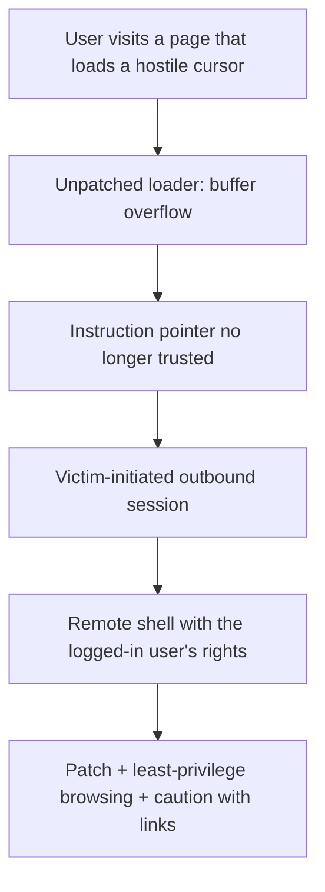

#### Privilege of the logged-in user

If the captured shell is **Administrator**, it is because the user **surfed as Administrator**. Explicit **security rule**: browse the Internet with **minimal privilege**. If a cursor (or any other) bug runs, the attacker inherits **the logged-in user's rights**. Administrative browsing turns one client-side bug into **full machine control**.

#### Email and the firewall you cannot use

A second **attack vector** is **social**: a lottery / prize email whose **link** is a page like the lab's. The user **clicks on purpose**. **No firewall in the world** can treat that as hostile in the same way as unsolicited inbound packets: it is **legitimate outbound HTTP/HTTPS**.

#### Where to look up flaws; what unpatched bugs cost

**cve.mitre.org** lists vulnerabilities for **Windows, Linux, Mac, and custom OS**. If a flaw is **not patched** / no **hotfix** is applied, outcomes named here are:

- Remote code execution (as demonstrated)
- Data theft
- Compromise of **critical infrastructure** if the OS sits on a **SCADA**-class system

The advisory language cited: this **CVE-2007** animated-cursor issue exposes **Windows XP, Windows 2000, and Windows Vista**.

#### Software, hardware, firmware — and malware

Beyond the old triad **software / hardware / firmware**, the lecture adds **malware**: software that **damages** the system. Related coinages: **malvertising** (malware delivered via advertisement). A then-current example: **CryptoWall** — encrypt the victim's data and demand money to unlock it: **ransomware**. Later course topics promised (not taught in this hour): ransomware, CryptoWall, **viruses, worms, Trojans**.

### Key terms

| Term | Meaning in this lecture |
|------|-------------------------|
| Mapped DLL | Code already in the process (`user32` and others) that overflow control can be aimed at |
| Bind vs reverse shell | Inbound listen vs victim-initiated outbound — the latter matches allowed web traffic |
| Least privilege | Do not browse as Administrator; the attacker inherits the logged-in token |
| cve.mitre.org | Public CVE catalog; patch/hotfix against listed issues |
| Malware / ransomware / CryptoWall | Harmful software; CryptoWall encrypts files and extorts payment |
| Malvertising | Advertisement channel used to push malware |

### Lecture takeaways

- After EIP is untrusted, execution can be steered using **code already in system DLLs**; the defender's answer is still **patch the loader**.
- **Reverse** connections piggyback on **user-initiated outbound** paths that firewalls already allow for the web.
- **Administrator browsing** makes a client-side bug a full compromise; **least privilege** is the taught countermeasure on the endpoint.
- **Lottery-style email links** are the same client-side pattern: the user **asks** to fetch the page.
- Track flaws on **cve.mitre.org** and **patch / hotfix**; unpatched loaders on XP/2000/Vista (CVE-2007 animated cursor) were the worked example.
- The course next frames **malware** (including **ransomware / CryptoWall**) as a fourth companion to software, hardware, and firmware.

---

# M18: Electronic Mail

**Source:** https://www.youtube.com/watch?v=DXGMUDoZZaA
**Instructor / expert:** Prof. Yogesh Chaba, Department of Computer Science and Engineering, Guru Jambheshwar University of Science and Technology, Hisar (course coordinator: Dr. Maninder Singh, Thapar University, Patiala)

### Learning objectives

- Define **email** as store-and-forward digital messaging and list its **five basic functions**.
- Split an email system into **user agents (UA)** and **message transfer agents (MTA)** and match them to **RFC 822 / MIME** versus **SMTP**.
- Describe **RFC 5322** headers (To, Cc, Bcc, From, Sender, Received, Return-Path, and UA fields) and **MIME** headers and body hierarchy.
- Trace **SMTP** submission, **MX** lookup, and the **MAIL / RCPT / DATA** transaction.
- Contrast **POP3**, **IMAP**, and **MAPI** as message-*reading* protocols.

### Core concepts

The lecture's outline: introduction → **message format** → **SMTP** → reading protocols **POP3, IMAP, MAPI**.

#### Email as a system

**Email** (electronic mail) is **digital messages** sent and received over the **Internet** (or other networks), from **one sender to one or more recipients**.

Early systems required **author and recipient online at the same time**. Today's systems use **store-and-forward**: servers **accept, forward, deliver, and store** messages. Neither users nor their computers need to be online together.

##### Five basic functions

| Function | Role |
|----------|------|
| **Composition** | Creating messages and replies. Any text editor can write the body; the system helps with **addressing** and **header fields**. |
| **Transfer** | Moving the message from originator to recipient. |
| **Reporting** | Telling the originator what happened: **delivered, rejected, or lost**. |
| **Displaying** | Presenting incoming mail so people can read it. |
| **Disposition** | What the recipient does next: discard unread, discard after reading, **save**, and similar. |

##### Two subsystems

| Subsystem | What it is | Protocols named here |
|-----------|------------|----------------------|
| **User agent (UA)** | Local program to **compose and read**; command-line, menu, or GUI | Formatting: **RFC 822** and **MIME** (first proposed in **RFC 1341**). Reading: **POP3, IMAP, MAPI** |
| **Message transfer agent (MTA)** | Background **daemons** that move mail through the network | **SMTP** (Simple Mail Transfer Protocol) |

#### Message format: RFC 5322 and MIME

Internet mail format is **RFC 5322**, with multimedia attachments in **RFC 2045–2049**, collectively **MIME** (Multipurpose Internet Mail Extensions).

Lineage as taught:

- **RFC 822** was the Internet email standard for nearly 20 years.
- **RFC 2822** (2001) replaced RFC 822.
- **RFC 5322** (2008) replaced RFC 2822.

A message has two major sections, separated by a **blank line**:

- **Header** — structured fields: From, To, Cc, Subject, Date, and other envelope-ish metadata.
- **Body** — unstructured text, sometimes ending in a **signature block**.

RFC 822-era messages sit in a primitive **envelope** (described with **RFC 821**) plus header fields, blank line, then body. Each header field is logically **one line of ASCII**: **field name, colon, value**. RFC 822 **did not cleanly separate envelope fields from header fields**.

##### Transport-related header fields

| Field | Meaning in this lecture |
|-------|-------------------------|
| **To** | DNS address of the **primary** recipient(s); multiple allowed |
| **Cc** | **Secondary** recipients. For **delivery**, primary and secondary are **not distinguished** |
| **Bcc** (blind carbon copy) | Like Cc, but this line is **deleted** from copies sent to primary and secondary recipients |
| **From** | Who **wrote** the message |
| **Sender** | Who **sent** it — need not be the same person as From |
| **Received** | Added by **each MTA**; agent identity, date/time received, extra data for **routing debugging** |
| **Return-Path** | Added by the **final MTA**; how to get back to the sender |

##### User-agent / human header fields

| Field | Meaning |
|-------|---------|
| **Date** | Date and time the message was sent |
| **Reply-To** | Address that replies should use |
| **Message-ID** | Unique id for later reference |
| **In-Reply-To** | Message-ID of the message this replies to |
| **References** | Other relevant Message-IDs |
| **Keywords** | User-chosen keywords |
| **Subject** | One-line summary |

##### Why MIME exists

Early mail was **English ASCII text**. RFC 822 specified **headers** and left **body content** to users. That is not enough when senders attach **audio, image, text, video**. The fix was **RFC 1341**, updated as **RFC 2045–2049** (**MIME**), now widely used.

##### Five MIME header fields

| Header | Role |
|--------|------|
| **MIME-Version** | Tells the receiving UA this is MIME, and **which version** |
| **Content-Description** | ASCII string saying **what is in** the message |
| **Content-ID** | Identifies the content |
| **Content-Transfer-Encoding** | How the body is **wrapped** for networks that object to characters beyond letters, digits, and punctuation |
| **Content-Type** | **Type/subtype** separated by a slash (example: **`video/mpeg`**) |

**Content-Type** types listed: **text, image, audio, video, application, message, multipart**.

##### MIME body as a hierarchy

A MIME body is **parts in a tree**. At the top is the **root** body part (labeled **R** in the slide). Parts that contain other parts are **descendants**.

Example from the figure:

- Direct descendants **A1** and **A2**.
- **A1.1** and **A1.2** contain no further parts → **content body parts** (actual payload: plain text, an attachment, an HTML page, …).
- **A1** and **A2** as containers → **multipart body parts**.

#### SMTP: transferring messages

The message transfer system **relays** from originator to recipient. The simplest picture: a **transport connection** from source machine to destination, then send the message.

**SMTP** is the Internet standard for email transmission:

- First defined by **RFC 821** (1982) (ASR: “RFC a21”).
- Updated in **2008** as **extended SMTP (ESMTP)** in **RFC 5321** — the protocol used worldwide in this lecture.

SMTP is **connection-oriented** and **text-based**: the sender issues **commands** and supplies data over a **reliable, ordered** stream, typically **TCP**.

##### Mail processing model

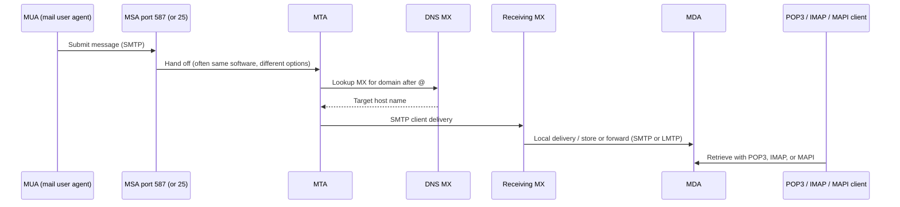

Details as taught:

- The **MUA** submits to an **MSA** (mail submission agent) with SMTP on TCP **port 587**. Many mailbox providers still allow submission on traditional **port 25**.
- The MSA delivers to an **MTA**. MSA and MTA are often **two instances of the same software** with different launch options on one machine.
- The **boundary MTA** finds the target via **DNS MX** (mail exchanger) for the recipient **domain** (right of **`@`**). The MX record names the target host.
- The MTA connects to that MX as an **SMTP client**. The MX hands the message to an **MDA** (mail delivery agent) for **local delivery** into the mailbox format.
- Reception can use **many computers or one**. An MDA may store locally or **forward** with SMTP or **LMTP** (Local Mail Transfer Protocol) — an SMTP **derivative** for this hop.
- End-user **email clients** retrieve with **IMAP, POP3, or MAPI** (next section).

##### SMTP session and transaction

A **session**: commands from the SMTP **client** (sender) and responses from the SMTP **server** (receiver). The session opens, **parameters are exchanged**, and it may contain **zero or more transactions**.

A **transaction** is **three command/reply sequences**:

| Command | Role |
|---------|------|
| **MAIL** | Establish **return address / return path / bounce address / envelope sender** — where **bounce** messages go |
| **RCPT** | One recipient; **may be issued multiple times**; these addresses are also **envelope** data |
| **DATA** | **Header + body** separated by an **empty line** |

#### Protocols for reading mail

Interaction between servers and clients is governed by **email protocols**. The three most common **reading** protocols: **POP3**, **IMAP**, **MAPI**. Most client software uses one of these.

##### POP3 (Post Office Protocol version 3)

Basic procedure: **retrieve all inbound messages to the client, delete them on the server, disconnect**. The user pulls mail from the **ISP's MTA**.

Specifications:

- Described in **RFC 1939** (current); originated in **RFC 1081**.
- Extension mechanism **RFC 2449** (ASR: “RFC 249”).
- Authentication mechanism **RFC 1734**.

POP3 starts when the mail reader opens a **TCP** connection to the MTA on **port 110**. Then **three states in order**:

| State | What happens |
|-------|----------------|
| **Authorization** | User **logs in** |
| **Transaction** | User **collects** messages and **marks** them for deletion |
| **Update** | Marked messages are **actually deleted** |

This can be observed with **Telnet** to `mail.isp.com` **port 110** (DNS name of the ISP mail server). After the TCP accept, the server sends an **ASCII banner**. The client sends **username and password**. After login:

- **LIST** — one line per message with **length**; list ends with a **period**.
- **RETR** (ASR: “RR”) — retrieve a message.
- **DELE** — mark for deletion.
- **QUIT** — leave Transaction, enter **Update**; server deletes, replies, **breaks TCP**.

##### IMAP (Internet Message Access Protocol)

POP3 is **simple and robust** when mail is always read from **one PC**. It fails when the user needs mail from **other computers**. That gap produced **IMAP**.

- Defined in **RFC 2060**.
- Current **IMAP version 4**: **RFC 3501**.

IMAP is newer and **connection-oriented**. The standard procedure is to **leave messages on the server** rather than treating the client copy as primary. Mail is typically available **only when online**. Client copies are allowed, but in an **inversion of POP3** the **server copies are the real ones**. **Security benefit:** you do not **lose mail** if the client disk fails.

An IMAP server listens on well-known **port 143**.

Further IMAP facilities taught:

- Read **messages or parts** of messages (important with large **audio/video** attachments).
- Assumption: messages are **not** transferred to the PC for permanent storage.
- **Create, destroy, and manipulate multiple mailboxes** on the server (e.g. one mailbox per correspondent; move from Inbox after reading).

##### MAPI (Messaging Application Programming Interface)

**MAPI** is a **proprietary Microsoft** protocol used by **Outlook** to talk to **Microsoft Exchange**. It offers **somewhat more functionality than IMAP**, but **only** for Outlook ↔ Exchange.

#### Recap order in the lecture

Introduction of email → message format (RFC 5322 / MIME) → SMTP → POP3, IMAP, MAPI.

### Key terms

| Term | Meaning in this lecture |
|------|-------------------------|
| Store-and-forward | Servers accept, forward, deliver, and store; parties need not be online together |
| User agent (MUA/UA) | Local compose/read program |
| MTA / MSA / MDA | Transfer, submission, and delivery agents in the SMTP path |
| MIME | RFC 2045–2049: types, encodings, multipart body tree |
| RFC 5322 | Current Internet message format (via RFC 822 → 2822 → 5322) |
| SMTP / ESMTP | RFC 821 then RFC 5321 (2008); MAIL, RCPT, DATA on TCP |
| MX record | DNS mail exchanger for the domain after `@` |
| LMTP | Local Mail Transfer Protocol — SMTP derivative for MDA hop |
| POP3 | Port 110; download-and-delete; AUTH / Transaction / Update |
| IMAP4 | Port 143; server-resident mail; multiple mailboxes |
| MAPI | Microsoft Outlook–Exchange proprietary protocol |

### Lecture takeaways

- Modern email is **store-and-forward** with five functions: compose, transfer, report, display, dispose.
- **UAs** format with **RFC 822/5322 + MIME**; **MTAs** move mail with **SMTP**.
- MIME added **typed, hierarchical bodies** so mail is more than ASCII English.
- SMTP submission is **587** (still often **25**); routing uses **DNS MX**; a transaction is **MAIL, RCPT, DATA**.
- **POP3** pulls and typically **deletes** on the server; **IMAP** keeps the **server copy as truth** and supports folders and partial fetch; **MAPI** is Outlook/Exchange only.

---

# M19: Email Security Protocols

**Source:** https://www.youtube.com/watch?v=0PUVjKXOiV8
**Instructor / expert:** Prof. Yogesh Chaba, Department of Computer Engineering and IT, Guru Jambheshwar University of Science and Technology, Hisar (course coordinator: Dr. Maninder Singh, Thapar University, Patiala)

### Learning objectives

- Explain why ordinary email is compared to a **postcard**, not a sealed letter, including **transit and at-rest** inspection and **cross-border** legal complexity.
- Describe **PGP** (and **OpenPGP**) as hybrid encryption plus signatures, compression, and the taught **RSA key-length** choices.
- Outline **PEM** (RFC 1421–1424): canonicalization, hash, DES, one-time keys, **X.509** hierarchy — and **why it was never deployed**.
- State **S/MIME** services and its **multiple trust anchors** versus PEM's single root.
- Compare **S/MIME v3** and **OpenPGP** as the two systems the lecture treats as currently used.

### Core concepts

Outline: email-security introduction → **PGP**, **PEM**, **S/MIME** → comparison.

#### Why email privacy is hard

Since about **1993**, “email” is the common name for exchanging digital messages over the Internet or other networks.

**Email privacy** covers **unauthorized access and inspection**:

- while the message is **in transit**, and
- while it is **stored** on a server or user computer.

Mail crosses **potentially untrusted intermediate servers**. There is **no inherent way to tell** if an unauthorized party read it. Unlike a **sealed letter** (where the envelope might show tampering), email is like a **postcard**: contents are visible to everyone who handles it.

Cryptography can make unauthorized access **difficult if not impossible**, but messages often **cross national borders** with **different rules**, so privacy is **legally as well as technically** complicated. That problem drove **PGP**, **PEM**, and **S/MIME**.

#### PGP — Pretty Good Privacy

**PGP** is a **public-key encryption program** originally written by **Phil Zimmermann** in **1991**. It became a **de facto standard** for encrypting Internet email: a complete package for **privacy, authentication, digital signatures, and compression**, easy to use, with **source code free** on the Internet, on **Unix, Linux, Windows, and Mac**.

##### Confidentiality (hybrid encryption)

The message is encrypted with a **symmetric** algorithm under a **one-time session key**. The session key travels with the message, itself encrypted under the **receiver's public key**. Only the receiver's **private key** unwraps the session key.

##### Authentication and integrity

- **Integrity:** detect whether the message changed after it was finished.
- **Authentication:** determine whether it came from the claimed sender.

Because content is encrypted, **changes cause decryption to fail** with the proper key.

For a **digital signature**, PGP hashes the plaintext (**message digest**) and signs that hash with the **sender's private key**, using **RSA or DSA**.

##### Worked Alice → Bob flow (as taught)

Both have **RSA** private/public keys **d** and **e**; each knows the other's public key. Alice wants to send signed plaintext **P** to Bob securely:

1. Hash **P** with **MD5**; encrypt that hash with Alice's **RSA private key** → signed hash.
2. Concatenate signed hash with **P** → **P1**; **ZIP**-compress → **P1.Z**.
3. On receipt, Bob uses **IDEA** (International Data Encryption Algorithm) to decrypt; decompresses; separates plaintext from encrypted hash; decrypts the hash with **Alice's public key**.
4. If Bob's own **MD5** of the plaintext **matches**, **P** is correct and from Alice.
5. Bob also reverses **Base64** encoding and decrypts the **IDEA** key with **his RSA private key**.

**RSA is used only twice:** to protect the **128-bit MD5 hash** and the **128-bit IDEA key** (256 bits total). RSA is slow, so limiting it to those small blocks is how PGP stays **efficient** while providing **security, compression, and signatures**.

##### RSA key lengths (user's choice)

| Label | Bits | Lecture claim |
|-------|------|----------------|
| Casual | 384 | Can be broken easily today |
| Commercial | 512 | Breakable by a “three-letter organization” |
| Military | 1024 | Not breakable by anyone on Earth |
| Alien | 2048 | Not breakable by anyone on other planets either |

Because RSA only wraps two small values, the instructor says **everyone should use Alien-strength keys all the time**.

##### Classic PGP message layout

Three parts (other formats exist):

| Part | Contents taught |
|------|-----------------|
| **Key** | Key **identifier** and the **IDEA key** itself |
| **Signature** | Signature header, **timestamp**, identifier of the **sender's public key** that decrypts the signed hash, **algorithm type** fields, **encrypted MD5 hash** |
| **Message** | Header, **default filename** if the receiver writes to disk, **creation timestamp**, then the message |

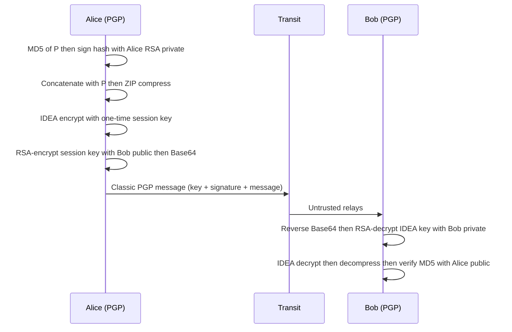

#### OpenPGP

**OpenPGP** is described as the **most widely used email-encryption standard** at the time of the lecture. It is defined by the **IETF OpenPGP Working Group** in **RFC 4880** (ASR: “RFC 480”). The **OpenPGP Alliance** is implementers working on **interoperability and marketing synergy**. RFC 4880 is said to contain what is needed to **read, check, generate, and write** conforming encrypted messages, keys, and signatures.

History taught:

- **July 1997:** PGP Inc. proposed an IETF standard named **OpenPGP**; IETF accepted and started the working group. OpenPGP is on the **Internet standards track**.
- Original PGP spec: **RFC 1991**.
- Current OpenPGP spec: **RFC 4880** (2007 successor of **RFC 2440**, ASR “RFC 24”).
- **RFC 5581** (2009): **Camellia** cipher (ASR: “RFC 581”, “Chamelia”).
- **RFC 6637** (2012): **elliptic-curve cryptography** (ASR: “RFC 637”).

OpenPGP encryption can **secure delivery of files and messages** and **verify who created or sent** them (**digital signing**). **Both sender and recipient must participate**. It can also protect **files at rest** on **mobile devices or in the cloud**.

#### PEM — Privacy-Enhanced Mail

Unlike PGP's “one-man show,” **PEM** is an **official Internet standard**: **RFC 1421 through RFC 1424**. A **1993 IETF** proposal for securing email with **public-key cryptography**. It covers roughly the same ground as PGP — **privacy and authentication for RFC 822 mail** — with different **approach and technology**. It grew from the **Privacy and Security Research Group (PSRG)** of the **IRTF**.

Processing taught:

1. Convert to a **canonical form** (same whitespace conventions: tabs, spaces).
2. Hash with **MD2 or MD5**.
3. Concatenate hash and message; encrypt with **DES**. The lecture flags a **56-bit key** as **suspect** given known weakness.
4. Optionally **Base64**-encode for transmission.
5. Like PGP, each message uses a **one-time key** carried with the message, protected with **RSA** or **Triple DES in EDE** mode.

**Key management** is more structured than PGP: keys certified by **X.509 certificates** from a **CA**, in a **rigid hierarchy** under a **single root**. Advantage: **revocation** via root-issued **CRLs**. 

**Nobody used it** — “gone to that big bit-bin in the sky.” It became a **proposed standard** but was **never widely deployed**. The lecture's reasons:

- **Political:** who operates the **root**, and on what terms? Many candidates; little trust in **any one company** for the whole system.
- **RSA Security, Inc.** wanted to **charge per certificate**. The **US government** may use US patents **free**; companies **outside the US** were used to RSA **for free** (not patented outside the US). Nobody wanted to start paying. **No root could be agreed**, and PEM collapsed.
- Commentators also rejected a **single-rooted hierarchy** as **central authority**. That led Zimmermann to propose the **web of trust** as PGP's **PKI**.
- Deployment was abandoned when the protocol needed **MIME**; that led to **MOSS** (MIME Object Security Services) and **S/MIME**, which **share de facto standard status with PGP**.

PEM's **basic idea** (IETF, long working group): privacy via **hierarchical authentication**. A receiver trusts a sender's message when it carries a certificate from a **trusted authority**. Certificates are distributed via **IPRA** (Internet Policy Registration Authority) and **PCA** (Policy Certification Authority), which **certify senders' public keys**.

#### S/MIME — Secure MIME

IETF's next email-security venture: **S/MIME**, **RFC 2632 through RFC 2643**.

Reminder: messages have **RFC 822** headers (field/value pairs for transmission) and a body that is unstructured unless **MIME**. MIME structures the body for **enhanced text, graphics, audio**, etc. **MIME itself provides no security.** S/MIME **defines those services**.

Like PEM, S/MIME provides **authentication, data integrity, secrecy, and non-repudiation** (ASR: “known reputation”). It is **flexible** across cryptographic algorithms. New **MIME headers** hold, for example, **digital signatures**. S/MIME **adds signatures and encryption** to Internet MIME messages.

Lesson from PEM: S/MIME does **not** use a **rigid single-root** certificate tree. Users may have **multiple trust anchors**; a certificate is valid if it **chains to some anchor the user believes**. It uses **standard algorithms and protocols**.

(Application-layer email security is also mentioned as **PGP** and **S/MIME** in the WWW-security lecture; here they are fully specified.)

#### Comparison (as presented)

PEM **collapsed**. **PGP** and **S/MIME** — adopted as Internet-related standards; the lecture also calls them **NIST-specified** — are the two **official / currently used** secure-mail techniques. There has been **confusion in public and even in the IETF** about the status of S/MIME versus PGP.

The slide compares **S/MIME version 3** and **OpenPGP**: similar **user-facing services**, different **formats** (like **GIF versus JPEG**): users of one **cannot communicate** with users of the other or **share authentication certificates**.

| Topic | S/MIME v3 (lecture table) | OpenPGP (lecture table) |
|-------|---------------------------|-------------------------|
| Message / CMS packaging | Binary; **CMS** MIME encapsulation of signed data | Contrasted packaging (including PKCS #7 / MIME / ASCII-oriented forms as on the slide) |
| Certificates | **Binary X.509v3** | Classic **PGP** certificates |
| Key agreement / signatures | **Diffie–Hellman** with **DSS or RSA** | **ElGamal** with **DSS** |
| Hash | **SHA-1** | **SHA-1** |

### Key terms

| Term | Meaning in this lecture |
|------|-------------------------|
| Postcard model | Email visible to every relay; unlike a sealed envelope |
| PGP | Zimmermann 1991; IDEA + RSA + MD5 + ZIP + signatures; free, multi-OS |
| Session key | One-time symmetric key; RSA wraps it for the recipient |
| Alien-strength RSA | 2048-bit; recommended for all PGP use here |
| OpenPGP | IETF RFC 4880 (from RFC 1991 / 2440); Camellia RFC 5581; ECC RFC 6637 |
| PEM | RFC 1421–1424; DES; X.509 single-root CA; CRLs; unused |
| Web of trust | PGP's PKI answer to PEM's central root |
| IPRA / PCA | Policy authorities in the PEM certificate story |
| MOSS | MIME Object Security Services — post-PEM MIME security effort |
| S/MIME | RFC 2632–2643; MIME + crypto; multiple trust anchors |
| Non-repudiation | S/MIME service listed with authentication, integrity, secrecy |

### Lecture takeaways

- Unprotected email is a **postcard** on untrusted servers; cryptography is necessary but **jurisdiction** makes privacy messy.
- **PGP** hybridizes **IDEA** (bulk) and **RSA** (tiny hash and session-key blobs), with **ZIP**, **MD5** signatures, and a strong push to **2048-bit** RSA.
- **OpenPGP** (RFC 4880) is the interoperable IETF form; both parties must run it; it also protects **stored** files.
- **PEM** matched PGP's goals with a **single X.509 root** and **DES**, and **died** on root politics, patent fees, and MIME.
- **S/MIME** keeps PEM-like services but allows **many trust anchors** and lives **inside MIME**.
- **S/MIME v3** and **OpenPGP** both secure mail; **certificates and encodings differ**, so they do not interoperate.

---

# M20: WWW Security

**Source:** https://www.youtube.com/watch?v=4t3ot0oUah0
**Instructor / expert:** Dr. Gursimran Singh, Doaba College, Jalandhar (course coordinator: Dr. Maninder Singh, Thapar University, Patiala)

### Learning objectives

- Explain why the **WWW** as a **client–server TCP/IP** application creates security problems that traditional publishing did not.
- Group Web threats as **passive vs active** and as **integrity, confidentiality, authentication, and DoS**, with the lecture's consequences and countermeasures.
- Place Web security in the stack: **IPsec** (network), **SSL/TLS** (transport), **SET / PGP / S/MIME** (application), plus **firewalls**.
- Distinguish IPsec **transport vs tunnel** mode and **AH vs ESP**.
- Outline **SSL/TLS**'s four protocols and **SET**'s card-payment properties.
- Classify **packet-filter** (static/stateful) and **proxy / application-gateway** firewalls, including the lecture's filter-table examples.

### Core concepts

**Gursimran Singh** frames **World Wide Web security**. The WWW is called one of the biggest inventions and the world's largest information resource: information **anywhere, anytime, in any format**. It contributes to **globalization of production and capital markets** by cutting information and communication cost, and it is a breeding ground (ASR: “producing ground”) for **e-business** that sells and serves over the Internet.

Technically the Web is a **client–server application** on **Internet / TCP/IP**. Information is stored as **web pages**; a **web browser** retrieves them. **Online banking and transactions** need special attention. The Web poses challenges **not always appreciated** in ordinary computer and network security.

#### Why the Web is a hard target

- The Internet is **two-way**, unlike traditional publishing, teletext, voice response, or fax-back.
- Sites are **vulnerable to attacks on web servers over the Internet**.
- The Web is a **highly visible** outlet for **corporate and product information** and a **platform for business transactions**. **Reputation and money** are at stake if servers are attacked.
- Servers are **easy to use, configure, and manage**, and content is easy to develop, but **underlying software is extraordinarily complex** and can **hide flaws**. History is full of **new or upgraded systems**, “properly” installed, that were still **attackable**.
- A subverted server can be a **launching pad** into the rest of a corporation or agency: the attacker reaches **data and systems not part of the Web itself** but **connected on the local site**.
- **Casual, untrained** users of Web services often **do not know the risks** and lack tools for **countermeasures**.

#### Threat taxonomy

Threats are grouped as **passive** and **active**:

- **Passive:** eavesdropping on browser–server traffic; gaining **restricted** site information.
- **Active:** impersonating another user; **altering messages** in transit; **altering information on a website**.

The “main WWW security threats” are then briefed as **integrity, confidentiality, authentication, and denial of service**.

| Threat | Main examples taught | Consequences | Countermeasures taught |
|--------|----------------------|--------------|------------------------|
| **Integrity** (keep data intact) | Modification of user data; **Trojan-horse browser**; modification of **memory**; modification of **message traffic in transit** | Loss of information; **compromised machine**; exposure to **all other threats** | **Cryptographic checksums / SSL** (ASR: “cryptograph traffic check SS”) |
| **Confidentiality** | Eavesdropping; theft from **server** or **client**; leakage of **network configuration** and of **who talks to whom** | Loss of information; **loss of privacy** | **Encryption** and **web proxies** |
| **Authentication** | Impersonating legal users; **data forgery** | Misrepresentation; users **believe false information is valid** | **Cryptographic techniques** |
| **Denial of service** | Killing user **threads**; flooding with **bogus requests**; filling **disk or memory**; isolating a machine via **DNS attacks** | Disruptive, annoying; users **cannot get work done** | **Very difficult to prevent** |

#### Where to put Web security in the stack

Approaches are **similar in service and somewhat in mechanism**, but they differ in **scope, application, and location in the TCP/IP stack**. The lecture places controls at **network, transport, and application** layers, **and with firewalls**.

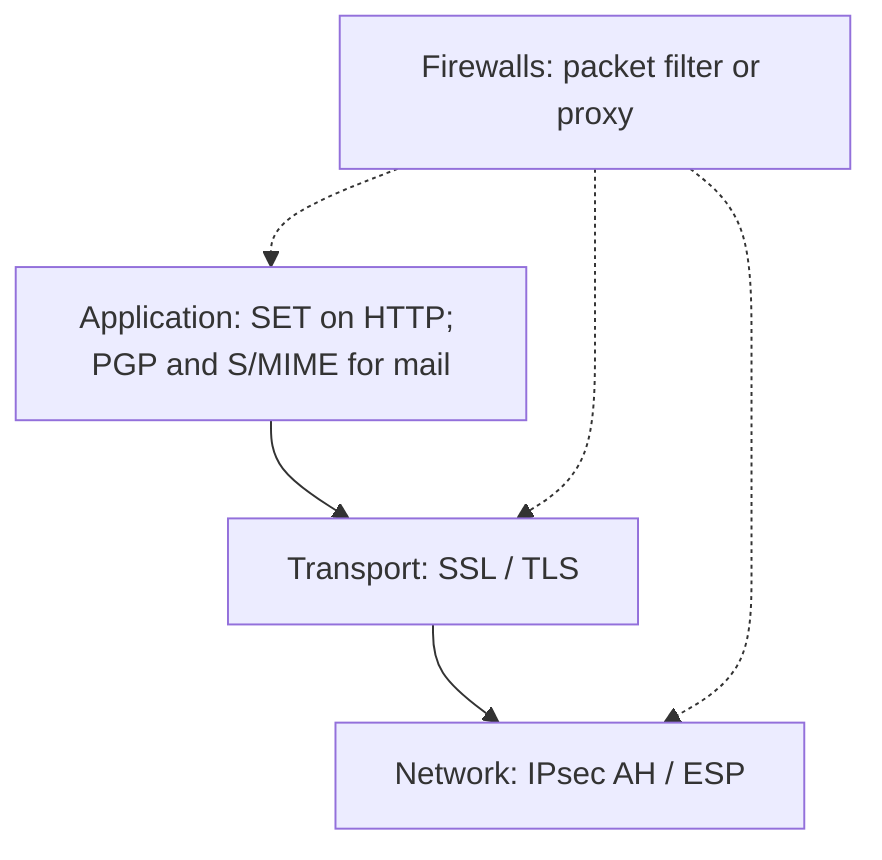

#### Network layer: IPsec

**IPsec** is a **collection of IETF protocols** that secure **packets at the network layer**. Advantages taught:

- **Transparent** to end users and applications — a **general-purpose** solution.
- **Filtering** so **only selected traffic** pays the IPsec processing cost.

IPsec creates **authenticated and confidential** packets for IP. Two modes (the lecture also says “transparent mode” for the first — **transport mode**):

| Mode | What is protected | Header handling | Typical use |
|------|-------------------|-----------------|-------------|
| **Transport** | Payload coming **from the transport layer** into IP — **not** the whole original IP header | IPsec header/trailer wrap that payload; **IP header added later** | **Host-to-host**: sender authenticates/encrypts transport payload; receiver checks/decrypts and passes up to transport |
| **Tunnel** | **Entire** original IP packet (including its header) | Apply IPsec, then add a **new IP header** (different from the original) | **Router–router**, **host–router**, or **router–host** — original packet as if through an **imaginary tunnel** |

Relative placement:

- **Transport:** IPsec sits **between transport and network**.
- **Tunnel:** flow is **network → IPsec → network again**.

Two IPsec protocols:

**AH (Authentication Header)** — authenticate the **source** and ensure **integrity** of the IP payload. Uses a **hash and a symmetric key** to make a **message digest**, carried in the AH, placed according to **transport or tunnel** mode.

**ESP (Encapsulating Security Payload)** — AH does **not** provide **confidentiality**. ESP adds **source authentication, integrity, and confidentiality**. It adds a **header and trailer**; **ESP authentication data sit at the end of the packet**, which the lecture says makes calculation **easier**.

#### Transport layer: SSL and TLS

A relatively general-purpose option is security **just above TCP**: **SSL** (Secure Sockets Layer) and the follow-on IETF standard **TLS** (Transport Layer Security).

Two implementation choices:

1. SSL as part of the **underlying protocol suite** — **transparent to applications**.
2. SSL **embedded in specific packages** — e.g. **Netscape** and **Microsoft Internet Explorer** browsers, and **most servers**.

Goals: **server and client authentication**, **data confidentiality**, **data integrity**.

Application clients such as **HTTP** can encapsulate data in **SSL records** if both sides run SSL/TLS. The client then uses **`https://`** (**HTTP Secure**) instead of **`http://`**, so HTTP is carried in SSL. Example: **credit-card numbers** for online shoppers.

SSL is defined as **four protocols in two layers**:

| Protocol | Role |
|----------|------|
| **Record** | **Carrier**: messages from the other three protocols **and** application data; Record messages are payload to **TCP** |
| **Handshake** | Security parameters for Record: **cipher suite**, **keys**, authenticates **server to client** and **client to server if required** |
| **Change Cipher Spec** | Signals that **cryptographic secrets are ready** |
| **Alert** | Reports **abnormal conditions** |

#### Application layer

Application-specific security is **embedded in particular applications** — services **tailored** to that app.

For the Web, the important example is **SET** (Secure Electronic Transaction), shown **on top of HTTP** (a common implementation; some implementations use **TCP directly**).

Email at the application layer is secured by **PGP** (Phil Zimmermann: privacy, integrity, authentication) and **S/MIME** (enhancement of MIME). Both are only **named** here; Module 19 covers them in depth.

##### SET

SET is an **open encryption and security specification** to **protect credit-card transactions on the Internet**. **SET 1** came from a **Mastercard and Visa** call for standards in **February 1996**. Companies involved in the initial spec included **IBM** (“Big Blue”), **Microsoft**, **Netscape**, **RSA**. Tests of concept from 1996; **first wave of SET-compliant products around 1998**.

SET is **not itself a payment system**. It is **protocols and formats** that let users employ the **existing credit-card infrastructure** on an **open network** securely.

Three services:

1. **Secure communication channel** among all parties.
2. **Trust** via **X.509v3 digital certificates**.
3. **Privacy**: information only to parties **when and where necessary**.

Main features:

| Feature | Mechanism taught |
|---------|------------------|
| **Confidentiality** | Cardholder **account and payment** data protected in transit. **Merchant does not learn the credit-card number** — only the **issuing bank** does. Conventional encryption with **DES**. |
| **Integrity** | Order information, personal data, payment instructions unchanged. **RSA digital signatures** with **SHA-1** hashes; some messages also **HMAC-SHA-1**. |
| **Cardholder account authentication** | Merchant verifies the holder is a **legal user of a valid account**. **X.509v3** with **RSA** signatures. |
| **Merchant authentication** | Cardholder verifies the merchant has a relationship with a **financial institution** that allows it to accept cards. **X.509v3** with **RSA** signatures. |

Unlike IPsec and SSL/TLS, **SET provides only one choice per cryptographic algorithm** — appropriate because SET is **one application with one requirement set**, whereas IPsec and SSL/TLS support a **range of applications**.

#### Firewalls

Previous measures **cannot stop a sender from emitting harmful messages**. To **control access to a system**, use a **firewall**: usually a **router or dedicated machine** between the **internal network** and the **rest of the Internet**, that **forwards some packets and filters others**. It may filter by **host** or **service** (e.g. HTTP), or **deny** a specific internal host or service.

Classification: **packet-filter** vs **proxy-based**.

##### Packet-filter firewalls

Forward or block using **network- and transport-layer headers**: **source/destination IP**, **source/destination ports**, **protocol (TCP or UDP)**. Often a **router** with a **filtering table**.

Example table from the lecture:

| Rule idea | Effect |
|-----------|--------|
| Incoming from network **131.34.0.0** | Block the **entire** 131.34.0.0 network |
| Incoming to internal **Telnet** (port **23**) | Block |
| Incoming to internal host **194.78.20.8** | Block — host **internal use only** |
| Outgoing to **HTTP** port **80** | Block — organization **does not want employees to browse** |

Packet filters split into:

- **Static** — can be **routers**, as above.
- **Stateful** — effectively **standalone firewall devices**.

##### Proxy firewalls / application gateways

Packet filters cannot see **application** content. Example policy: only Internet users who **already have a business relationship** may see the company web page; others blocked. Everything arrives at **port 80**, so the filter cannot distinguish; the check must use **URLs** at the application layer.

Solution: a **proxy computer** (**application gateway**) between internal and external hosts. It is **server to the client and client to the server**.

HTTP application-gateway flow:

1. Client sends a message; the gateway runs a **server** process to receive it.
2. The gateway **opens the packet at the application layer** and tests whether the request is **legal**.
3. If legal, it acts as a **client** toward the **real server**.
4. If not, the message is **dropped** and an **error** is sent to the external user.

External requests are thus filtered on **application content**.

#### Closing

As dependence on the WWW grows and **crucial information** moves over it, **need for security increases**. Controls exist at **network, transport, and application** layers and as **firewalls**, but the user must still be **diligent**. **User awareness** protects against many threats. Close: stay protected and browse happily.

### Key terms

| Term | Meaning in this lecture |
|------|-------------------------|
| Passive vs active Web attack | Eavesdrop / read restricted data vs impersonate, alter transit, deface |
| IPsec transport / tunnel | Protect transport payload vs wrap the entire original IP packet |
| AH vs ESP | Integrity + source auth vs those plus confidentiality |
| SSL / TLS | Security just above TCP; Record, Handshake, Change Cipher Spec, Alert |
| HTTPS | HTTP carried in SSL/TLS |
| SET | Mastercard/Visa card-payment security; DES + RSA + SHA-1; merchant never sees PAN |
| Packet filter | IP/port/protocol table; static router or stateful appliance |
| Application gateway | Proxy that inspects URLs/content, e.g. HTTP |

### Lecture takeaways

- The Web is a **two-way, highly visible, complex** client–server system; a hacked server can **pivot** into the rest of the site.
- Threats are **integrity, confidentiality, authentication, and DoS**; DoS is called out as **hard to stop**.
- Put crypto at **IP (IPsec)**, **above TCP (SSL/TLS / HTTPS)**, or **in the app (SET, PGP, S/MIME)**.
- SET is **not a payment network**; it **hides the card number from the merchant** and **pins algorithms**.
- Firewalls **filter or proxy**; application policy that depends on **who** is on port 80 needs a **proxy**, not just a packet table.
- Technical controls still require **user awareness**.

---

# M21: Mobile Code Security

**Source:** https://www.youtube.com/watch?v=ccqp2LU6E7Q
**Instructor / expert:** Dr. Navdeep Singh, Department of Computer Engineering, Punjabi University, Patiala (course coordinator: Dr. Maninder Singh, Thapar University, Patiala)

### Learning objectives

- Define the **mobile-code** paradigm (applets through agents), its flexibility/bandwidth benefits, and its **two threat directions** (code vs host, host vs code).
- List host-protection requirements: **authenticate origin, verify integrity, access control, semantic checks**.
- Explain host defenses taught: **sandboxing, digital shrink-wrap / Authenticode, proof-carrying code (PCC), code signing, access control / JAAS, program checking**.
- Outline **data and code protection** for agents: signatures, **hash chaining / forward integrity**, **sliding encryption**, replication, **holographic proofs + PIR**, tamper-proof hardware, **function hiding**.
- Repeat the close: host protection is **achievable**; protecting code from a **malicious host** is still **research**; **non-cryptographic** methods are generally **not enough** for the code.

### Core concepts

(The spoken intro mentions a previous lecture on **Information Security Management**; this hour is **mobile-code security** and associated issues.)

#### Mobile-code paradigm

Mobile code is programs that **execute on one or several hosts other than the origin**. Mobility implies a **built-in ability to travel** host to host. At least two parties: **producer** and **consumer** (the host that **runs** the code).

Range: simple **applets** to **intelligent software agents**. Advantages over traditional distributed computing (two named): **flexibility in software design** beyond well-established **OOP**, and **bandwidth optimization**. Cost of flexibility: **increased vulnerability** to Internet-style intrusion.

Vulnerabilities fall in **two categories**:

1. **Classical:** a mobile program attacks the **remote host** (malicious **applets** or **ActiveX**).
2. **Less classical:** the **remote execution environment subverts** the mobile code **and its data**.

#### Threats in both directions

**Malicious code vs host** resembles **Trojan horses**, but mobile code aims at **transparency, automation, and wider-scale execution**. Environment vulnerabilities are **not the only** targets.

**Malicious host vs code:** the host may try to **subvert the mobile program**.

When **protecting a host** from potentially malicious code, mobility imposes:

1. Host and code have **separate identities** → **authenticate the code's origin**.
2. Code is **exposed on the network** → host must **verify integrity** of what it just received.
3. Another party **generated** the code → **limit actions** with **access control** and **semantic verification**.

When **protecting code** from a potentially malicious host, the program runs under the host's **total control**. Threats: **spoofing** (impersonating the code owner), **theft / secrecy violation** (unauthorized disclosure), **integrity violation** (subverting **code semantics**). **Data segments and code semantics** must both be protected.

#### Protecting the host

Early answer: **limit functionality** of the execution environment to shrink the attack surface. Techniques then evolve along two directions:

1. Mobile-code **infrastructure** gradually enhanced with **authentication, integrity, and access control**.
2. **Verification of mobile-code semantics**.

##### 1. Sandboxing

Run the code in a **restricted environment** (the **sandbox**) so otherwise untrusted code can execute “without worrying.” Two mechanisms:

- **Confine** code (via **type checking**, language properties, or **protection domains**) so it cannot subvert trusted code.
- Enforce a **fixed execution policy**.

Illustrated by **early Java JDK 1.0**, enabling **Internet applets** inside a browser. **Major drawback:** applications in such a tight box are **seldom useful**.

##### 2. Digital shrink-wrap

**Authenticate** code **before** execution: the **producer signs**; the **consumer verifies** the signature. One cannot decide from the bits alone whether code is malicious, but one can tell whether it **authentically came from the claimed source**. **Microsoft Authenticode** (ASR: “authentic code”) is the named proposal. **Sandboxing + shrink-wrap** can be combined; **Sun Java 1.2** combines both.

##### 3. Proof-carrying code (PCC)

**Necula and Lee, Carnegie Mellon University** (ASR: “neula and Lee from K melon”): **PCC** lets a host determine **automatically and with certainty** that code from another system is **safe to install and execute**. The **producer** must supply an encoding of a **proof** that the code **adheres to the consumer's security policy**. The proof is **digital**; the consumer **validates** it with a **simple, automatic, reliable proof checker**.

**Five steps of a typical PCC session:**

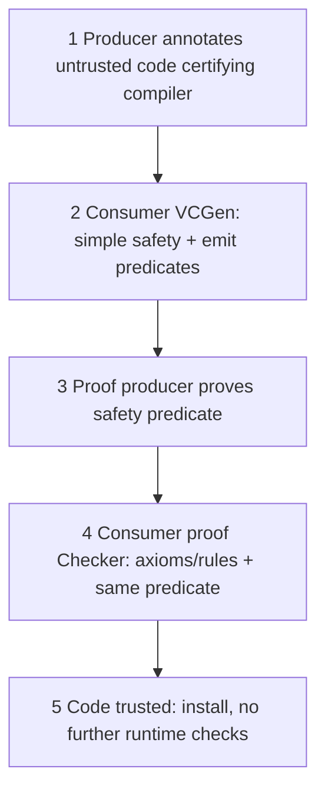

1. Producer **annotates** the code (manually or with a **certifying compiler**). Annotations help the consumer see **safety-relevant** properties. Annotated code is sent to the consumer.
2. Consumer runs **VCGen** (verification-condition generator), part of the **consumer-defined safety policy**. VCGen (a) checks **simple safety** (e.g. immediate jumps stay in the **code segment**); (b) on instructions that **might violate policy**, emits a **predicate** of the conditions under which that instruction is safe. Those conditions plus **control-flow** information form the **safety predicate**, copied to the **proof producer**.
3. Proof producer **proves** the predicate and, on success, returns a **formal proof**. The consumer **need not trust** the proof producer; **any system** can play that role.
4. **Proof Checker** verifies each inference is a valid instance of an **axiom / rule** in the safety policy, and that the proof is of the **same** predicate VCGen emitted.
5. After VCGen **and** proof check, the executable is **trusted** not to violate policy and may be **installed without further runtime checking**.

##### 4. Code signing

The producer **digitally signs** so the consumer gets **strong authentication and integrity**. First in **Microsoft ActiveX**; **Java JDK 1.1** follows for **applets**. With a **valid signature**, the **JVM** runs the applet as **trusted** with **all Java features**. **Unsigned** applets run in a **JDK 1.0-style sandbox**.

Caveats taught:

- A correct Internet signature **does not** mean the signer should be **trusted unrestrictedly**.
- The assumption that **users can decide** from a signature **has questionable validity**.
- Access control is **rudimentary**: signed code gets **full resource access** or is **not run**. That choice is left to the **end user**, who even **without administrator privileges** can put **entire security at risk**.

##### 5. Access control

Limit impact with **finer, application-specific policies** — a **monolithic sandbox** refined. The **signer's identity** (e.g. via **PKI**) further refines policy. **Java JDK 1.2** follows this scheme (**finer-grained** policies suited to untrusted mobile code). Later, Sun's **JAAS** (Java Authentication and Authorization Service; ASR: “Jazz”) integrates the **identity of the user running the code** into access control.

Versus sandboxing and signing: access control has **the best of both** — restrict which **resources** the code may touch, yet still write **useful** software. Cost: enforcement is **dynamic at runtime**.

##### 6. Program checking

Verify **structure or run-time behavior** and change status (e.g. trusted → untrusted) against a **security policy**. Sandboxes already do rudimentary checking: **static** (operand types) or **dynamic** (access to a protected resource).

A newer approach: **statically type-check** the mobile code, then run **without expensive runtime checks** — as in **PCC** and, to some extent, the **JVM** safety checks.

PCC again as **static checking**: policy in a **logic**; host demands a **proof** before running; producer sends program + proof using **shared sound axioms and rewriting rules**; host checks the program **guided by the proof** (a form of **type checking** derived from the program). **Checking a proof is much cheaper than proving the program.** PCC can express **complex safety** (and looks promising for **security**) properties. **Automating proof generation is still hard**; proofs are **generally by hand**.

#### Protecting mobile code from a malicious host

Studied only **recently**; **intrinsically harder** because the environment has **total control** (otherwise **host** protection would be impossible). Classify along:

1. **Data vs code** protection  
2. **Integrity vs confidentiality**

**Data protection** targets **roaming agents** (e.g. e-commerce). An agent may meet a host that tries to **“brainwash”** it. **Code protection** addresses **systematic** malice: the environment **cannot be trusted**.

##### Data protection for agents

Agents act **on behalf of the user** (collect product data, perform a transaction). Example: **comparison shopping** — lowest-priced book among retailers. Need to know:

- whether **collected data** were **changed**;
- whether a **fixed itinerary** was **followed**;
- in an **auction**, that a host cannot **exploit previous bidders' offers**.

**Integrity of collected data:**

- **Digitally sign** each result — but **agent size grows linearly** with results.
- More efficient: **hash chaining** for **forward integrity** (integrity against deletion/modification of parts of collected data **up to the first malicious host**). A **PRAC** (partial result authentication code) — a **small value** — ensures integrity of **all offers**. Extended so a host can **update previous data without growing space**. Add **signatures** if **non-repudiation** is required.

**Confidentiality of carried data:** at each hop, **encrypt on the current host** before the agent moves. **RSA** can be secure but, if data are **tiny**, **padding** is **excessive**. **Sliding encryption** keeps **equivalent security with a large key** while respecting **limited agent storage** — **space over time**, for agents that collect **small amounts on many hosts**.

##### Integrity of computation

- **Fault tolerance:** do the work **several times**. Same agent code on **replica hosts**; **vote** on the result. Or **replicate agents** and **slightly alter behavior** to **spot** a malicious host.
- **Cryptographic integrity proof / hint:** show computation followed the mobile code's instructions. A **trace** of the computation is a proof of how the result was obtained. To check faster, convert to a **holographic proof**: probabilistically validate by examining **only a few bits**, in **polylogarithmic** time. Transforming into a holographic proof is **heavy** — done by the **executing host**, not the verifier.

Problem: holographic-proof validity holds only if the **bits the verifier will look at stay unknown** to the proving host. Sending the whole holographic proof is worse because it is **even bigger than the original proof**. Fix: **cryptographic private information retrieval (PIR)** — the proof **stays on the proving host** and is **queried without that host knowing which bits were queried**. Hidden-query results plus the computation result are **smaller than the original proof**.

##### Privacy of computation

- Rely on **tamper-proof hardware** (e.g. a **smart card**) as a **secure kernel** for **secret functions and secret data** → **integrity and partial confidentiality**.
- **Function hiding:** encrypt function **f** into **E(f)**; run **E(f)(x)** on the untrusted site; decrypt the output to get **f(x)**. **Standalone**, no extra hardware, **confidentiality of the computation**. **Matrix** computations can be hidden, and thus any function representable as a matrix (e.g. **combinatorial Boolean circuits**).

#### Close

Mobile code is advocated for **flexibility and extensibility**, at a **security price**. A **good level of host protection is achievable**. Trend: **finer-grained access control**, so mobile code becomes **more useful**. **Semantic analysis** may secure hosts **without sacrificing performance**. **Protecting code from a malicious host remains an open research topic**. **Non-cryptographic techniques are generally not sufficient** to protect mobile code.

### Key terms

| Term | Meaning in this lecture |
|------|-------------------------|
| Mobile code | Code that runs on hosts other than its origin (applets to agents) |
| Sandbox | Restricted environment; JDK 1.0 applets; often too limited to be useful |
| Authenticode / digital shrink-wrap | Producer signs; consumer verifies origin before run |
| PCC / VCGen | Proof-carrying code; consumer generates safety predicate, checks producer's proof |
| Code signing (JDK 1.1 / ActiveX) | Valid signature → full trust; else sandbox; coarse access control |
| JAAS | Ties **user identity** into Java access control (JDK 1.2+ model) |
| Forward integrity / PRAC | Hash-chain / small authenticator over agent-collected offers |
| Sliding encryption | Compact encryption for small data on many hops |
| Holographic proof + PIR | Probabilistic, tiny checks of a computation proof without revealing query bits |
| Function hiding | Run an encrypted function on a malicious host; decrypt the result |

### Lecture takeaways

- Mobile code buys **flexibility and bandwidth** and opens **two-way** risk: **hostile applets/ActiveX** and **hostile hosts**.
- Hosts must **authenticate origin, check integrity, constrain rights, and check semantics**.
- Practical host tools: **sandbox, signing/Authenticode, PCC, JAAS-style policies**; signing alone is a **poor user decision** and an **all-or-nothing** ACL.
- Agents need **crypto** (hash chains, sliding encryption, holographic proofs, function hiding, smart cards); **replicas/voting** help integrity of results.
- Host protection is **in production reach**; **code vs malicious host** is **still research**; **crypto is required**.

---

# M22: Transmission Media

**Source:** https://www.youtube.com/watch?v=Xw7oyDuqOwU
**Instructor / expert:** Dr. Navdeep Singh, Department of Computer Engineering, Punjabi University, Patiala (course coordinator: Dr. Maninder Singh, Thapar University, Patiala)

### Learning objectives

- Define **transmission media** as the physical-layer path for **electrical or electromagnetic** signals and list design factors: **bandwidth, impairment, interference, number of receivers**.
- Compare **guided** media: **UTP, STP, coaxial (baseband/broadband), fiber** (step/graded multimode, single-mode), with connectors, applications, and trade-offs as taught.
- Describe **unguided** propagation (**ground, sky, line-of-sight**), **antennas**, and **satellite uplink/downlink**.
- Distinguish **radio, microwave, and infrared** bands, properties, and applications (including **IrDA**).

### Core concepts

Transmission media is the **pathway that carries information from sender to receiver** — also called a **communication channel**. Data travel as **electrical signals** (current) or **electromagnetic signals** (pulses at various frequencies) through **copper, optical fiber, atmosphere, water, or vacuum**. Media differ in **bandwidth, delay, cost, and ease of installation/maintenance**. The lecture locates media at the **physical layer**.

#### Design factors for data-transmission systems

A key concern is **data rate and distance** — greater of both is better. Factors that set those limits:

| Factor | Teaching |
|--------|----------|
| **Bandwidth** | All else equal, **greater signal bandwidth → higher data rate** |
| **Transmission impairment** | **Attenuation** limits distance on guided media. **Twisted pair** generally suffers more than **coax**, which suffers more than **optical fiber** |
| **Interference** | Competing signals in **overlapping bands** can distort or wipe out a signal. Especially serious for **unguided** media; also a guided-media problem. **Shielding** of guided media **minimizes** it |
| **Number of receivers** | Guided media may be **point-to-point** or a **shared** link with **multiple attachments**. Each attachment adds **attenuation and distortion**, limiting distance and rate |

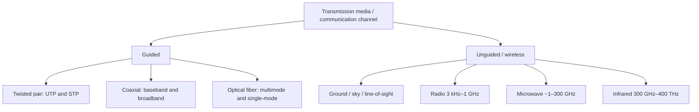

#### Guided media

Capacity (rate or bandwidth) depends **critically on distance** and on **point-to-point vs multipoint**. Three common guided media: **twisted pair, coaxial cable, optical fiber**.

##### Twisted pair

Two **copper** conductors, each with **plastic insulation**. One wire carries the **signal**; the other is a **ground reference**. The receiver uses the **difference** between them (plus the sent signal).

If the two wires were **parallel**, **noise and crosstalk** would **not** hit both equally (different locations relative to the source), leaving a **difference at the receiver**. **Twisting** balances this: in one twist wire A is nearer the noise, in the next wire B is — so both are **equally affected** and the difference **cancels** unwanted signals. **Twists per unit length** affect quality.

Types: **UTP** (unshielded twisted pair) and **STP** (shielded twisted pair).

**UTP** is the most common communications twisted pair. Once thought slower than other copper; the lecture says that is **no longer true** — UTP is the **fastest copper-based medium** in this presentation.

| UTP feature | Value taught |
|-------------|--------------|
| Speed / throughput | **10 to 1000 Mbps** |
| Average cost per node | Very low |
| Media and connector size | Very small |
| Common connector | **RJ-45** (Registered Jack) |

**STP** wraps each pair in **metallic foil**; four pairs then in an overall **braid or foil**. Typically **150 Ω**, specified for some **Ethernet** installs. Combines **shielding, cancellation, and twisting**. Reduces noise **inside the cable and from outside**. Often uses a dedicated **STP data connector**; can also use the same **RJ** connectors as UTP.

STP **prevents interference better than UTP** but is **more expensive and harder to install**. The shield **must be grounded at both ends**; **improper grounding** makes the shield an **antenna**. Because of **cost and termination difficulty**, STP is **rarely used in Ethernet**; it is **primarily used in Europe**.

| STP feature | Value taught |
|-------------|--------------|
| Speed / throughput | **10 to 100 Mbps** |
| Average cost per node | Moderately high |
| Media and connector size | Medium to large |

**Applications of twisted pair:** many **Ethernet** networks; **telephone** systems; the **workhorse** medium **inside buildings**. Residential phones connect to the local exchange (**end office**) by twisted pair — **subscriber loops**.

**Advantages:** easy to install, **flexible, cheap**, high speed capacity. **Disadvantages:** **lower bandwidth than coax**; **less protection from interference**.

##### Coaxial cable

Named because it has **two conductors parallel to each other**. Build-up taught:

- Center **copper** conductor (solid or stranded)
- **PVC** insulation / sheath
- **Outer conductor** of **metal foil** — **shield against noise** and the **return conductor** that completes the circuit
- Outer conductor in an **insulating sheet**
- Outermost **plastic cover**

Common coax standards:

| Impedance / type | Use |
|------------------|-----|
| **50 Ω RG-8 or RG-11** | **Thick Ethernet** |
| **50 Ω RG-58** | **Thin Ethernet** |
| **75 Ω RG-59** | **Cable television** |
| **93 Ω RG-62** | **ARCNET** |

**Connectors:** **BNC** to attach cable end to a device (e.g. TV); **BNC T** in Ethernet to **branch** to a computer; **BNC terminator** at the cable end to **prevent reflection**.

**Performance:** **attenuation is much higher than twisted pair**. Coax has **much higher bandwidth**, but the signal **weakens rapidly** and needs **frequent repeaters**.

**Applications:** analog telephone (one coax network could carry **10,000 voice** signals); digital telephone (up to **600 Mbps**) — in phones, coax is **largely replaced by fiber**; **cable TV**; early **Ethernet LANs** (high bandwidth / data rate).

**Baseband vs broadband:**

| | Baseband | Broadband |
|---|----------|-----------|
| Typical cable | **50 Ω**, digital, mostly **LANs** | Analog on **standard CATV** cabling |
| Signals | **One** signal at a time, very high speed | **Several simultaneous** signals on **different frequencies** |
| Reach | Needs amplification about every **1000 ft** | **Larger area** than baseband |

**Advantages listed:** high bandwidth; long-distance telephone; digital at **10 Mbps**; higher **noise immunity**; transmission **without distortion**; **longer distance at higher speed** than twisted pair because of **better shielding**.

**Disadvantages:** **single cable failure can take down the entire network**; **harder and more expensive** to install than twisted pair; **imperfect shield** can cause a **ground loop**.

##### Optical fiber

Glass or plastic; signals as **light**. Light goes straight in a **uniform** substance; at a density change it **bends**. Relative to the **critical angle** (a **property of the substance**):

- Incidence **less than** critical → ray **refracts** toward the surface (lecture: reflects/moves closer to the surface).
- Incidence **equal** to critical → light **bends along the interface**.
- Incidence **greater** than critical → **total internal reflection**; ray turns back into the **denser** substance.

Fibers **guide light by reflection**. Bandwidth taught: **more than 2 Gbps**.

**Propagation modes:**

| Mode | Structure | Behavior |
|------|-----------|----------|
| **Multimode step-index** | Core **density constant** center to edge | Beam goes **straight** until core/cladding; **abrupt** density drop **bends** the beam. “Step” = suddenness, which **distorts** the signal |
| **Multimode graded-index** | **Index of refraction** (related to density) **highest at center**, decreasing to the edge | **Reduces distortion** versus step-index |
| **Single-mode** | **Step-index** fiber plus a **highly focused** source | Beams limited to a **small range of angles** near the **horizontal** |

**Connectors:**

| Connector | Use / lock |
|-----------|------------|
| **SC** (subscriber channel / subscriber connector) | Cable TV; **push-pull** locking |
| **ST** (straight tip) | Cable to **network devices**; **bayonet** lock; called **more reliable than SC** |
| **MT-RJ** | Same size as **RJ-45** |

**Applications:** **backbone** networks (wide bandwidth is cost-effective); **hybrid fiber-coax** cable-TV (fiber backbone, coax to the premises); LANs such as **100BASE-FX** and **1000BASE-X**.

**Advantages:** high-quality, **very high speed**; **immune to EMI** so noise/distortion is very low; **analog and digital**. **Disadvantages:** **expensive**; **difficult to install**; **expensive/difficult maintenance**; do not allow **complete routing** of light signals.

#### Unguided (wireless) media

Unguided media carry **electromagnetic waves without a physical conductor** — **wireless**. Signals are **broadcast in free space** to anyone with a receiver.

Propagation methods: **ground**, **sky**, and **line-of-sight**.

The radio/microwave part of the spectrum is divided into **eight bands** (very low frequency through extremely high frequency), **regulated by government authorities**.

**Antenna:** electrical conductor(s) that **radiate** or **collect** electromagnetic energy. Transmit: electrical energy → EM → atmosphere/space/water. Receive: impinging EM → electrical energy into the receiver.

**Satellite:** **downlink** = satellite → ground station(s); **uplink** = ground → satellite. Companies sell uplink, downlink, or both to TV stations, corporations, and carriers.

Wireless transmission is grouped into **radio, microwave, and infrared**. **Two frequencies** are used so they **do not interfere** and **full duplex** is possible; also, **transmit power scales with frequency**, so higher frequency means **heavier** equipment.

##### Radio waves

**3 kHz to 1 GHz**, **omnidirectional**: sending and receiving antennas **need not be aligned**; any receiver antenna can pick up the waves. Disadvantage: **interference** from another antenna on the **same frequency/band**.

Sky-mode radio can travel **long distances** — good for **AM** long-distance broadcasting. **Low and medium frequencies penetrate walls**: an **AM radio works indoors** (advantage) but you **cannot isolate** a communication to inside vs outside (disadvantage). The radio band is **relatively narrow** (just under **1 GHz**) versus microwave.

**Applications (multicast, one sender many receivers):** **AM and FM radio, television, maritime radio, cordless phones, paging**.

##### Microwaves

**About 1–300 GHz** (spoken “1 and 3 GHz” then a band “almost 299 GHz” wide). **Unidirectional / narrowly focused**: antennas **must be aligned**. Advantage: one aligned pair **need not interfere** with another.

Characteristics:

1. **Line of sight.** Towers must **see** each other; far-apart towers must be **tall**. Earth's **curvature** and obstacles block short towers. **Repeaters** for long distance.
2. **Very high frequency microwaves cannot penetrate walls** — a problem if receivers are indoors.
3. Band is **wide** (~299 GHz) → **wider subbands** and **high data rate**.
4. **Some portions require permission** from authorities.

**Applications (unicast):** **cellular phones, satellite networks, wireless LANs**.

##### Infrared

**300 GHz to 400 THz**, **short range**. **Cannot penetrate walls** — **prevents interference** between a system in one room and the next (TV remotes do not bother the neighbors) but is **useless for long range**. **Cannot use outdoors** because **sunlight contains infrared** that interferes.

**Applications:** band ~**400 THz** has excellent potential for **very high-rate digital** transmission. **IrDA** (Infrared Data Association) standards for **keyboards, mice, PCs, printers**. Some PCs have an **IrDA port** for a wireless keyboard. Original standard: **75 kbps** up to **8 m**; later **4 Mbps**.

#### Close

The hour covered **media and their features** plus **advantages and disadvantages**. The speaker previews **wireless networking** for the **next** lecture (not part of this module's content).

### Key terms

| Term | Meaning in this lecture |
|------|-------------------------|
| Communication channel | Synonym for transmission media at the physical layer |
| UTP / STP | Unshielded vs foil/braid-shielded twisted pair; RJ-45 vs STP data connector |
| Subscriber loop | Twisted pair from home to telephone end office |
| Baseband / broadband coax | One high-speed digital signal vs many analog FDM signals on CATV plant |
| BNC / T / terminator | Coax connectors; terminator stops reflection |
| Critical angle | Governs refraction vs total internal reflection in fiber |
| Step-index / graded-index / single-mode | Fiber propagation families |
| Uplink / downlink | Ground→satellite / satellite→ground |
| Omnidirectional vs unidirectional | Radio vs microwave antenna behavior |
| IrDA | Infrared device-to-device standards (75 kbps then 4 Mbps) |

### Lecture takeaways

- Rate and reach are set by **bandwidth, impairment, interference, and how many receivers share the guided medium**.
- **Twisting** cancels crosstalk; **UTP** is cheap and, here, the **fastest copper**; **STP** shields better but is **costly, must be grounded, rare in Ethernet**.
- **Coax** outperforms pair on bandwidth/noise but **attenuates fast**, can **fail the whole net**, and lost the telephone backbone to **fiber**.
- Fiber uses **reflection**, **>2 Gbps**, EMI immunity; modes are **multimode step, multimode graded, single-mode**.
- Wireless is **radio (omni, multicast), microwave (LOS unicast), infrared (in-room, IrDA)**; antennas and **licensed bands** matter.

---

# M23: Ethernet and Fast Ethernet

**Source:** https://www.youtube.com/watch?v=AN-s1J2GrPk
**Instructor / expert:** Prof. Yogesh Chaba, Department of Computer Engineering and IT, Guru Jambheshwar University of Science and Technology, Hisar (course coordinator: Dr. Maninder Singh, Thapar University, Patiala)

### Learning objectives

- Place **Ethernet** historically (Xerox, commercial 1980, **IEEE 802.3** in 1983) and name the four **10 Mbps** cabling families.
- Map **LLC vs MAC**, list **IEEE 802.3 frame fields**, and walk **CSMA/CD** including **jam**, **binary exponential backoff**, and **why padding to 64 bytes** exists.
- Explain **Fast Ethernet (802.3u)** as the same rules with **bit time 100 ns → 10 ns**, and why **cable length** shrank instead of **minimum frame size**.
- List Fast Ethernet **PHY** types (T4, TX, FX, SX, BX, LX10) and the **MII / PCS / PMA / PMD** stack.

### Core concepts

Ethernet and Fast Ethernet are for **wired LAN** data at **10 Mbps** and **100 Mbps** respectively. Outline: Ethernet introduction → **protocol architecture and frame format** → **MAC operations** → Fast Ethernet and its architecture.

#### Ethernet history and role

Ethernet is a family of technologies for **LANs and MANs**. It began as an **experimental coaxial** network at **Xerox** in the **1970s**, initially **3 Mbps**, using **CSMA/CD** (Carrier Sense Multiple Access with Collision Detection). **Commercially introduced in 1980**; **standardized in 1983 as IEEE 802.3**. It was refined for **higher bit rates and longer links**. It largely **replaced** competing wired LAN technologies: **Token Ring, Token Bus, FDDI, ARCNET**.

Ethernet is currently the **most common** LAN architecture. Topologies are generally **bus** or **bus-star**. **IEEE 802.3** defines Ethernet for the OSI **MAC sublayer and physical layer**. The name refers to the cable **“ether.”**

#### Four 10 Mbps cabling types

Naming: first number = **speed in Mbps**; **BASE** = **baseband**. So **10BASE5** = **10 Mbps, baseband, 500 m** segments.

| Type | Medium / connector | Segment / nodes | Notes taught |
|------|--------------------|-----------------|--------------|
| **10BASE5** (“thick Ethernet”) | Thick coax; **vampire taps** (pin forced **halfway into the core**) | **500 m** | Historically first |
| **10BASE2** (“thin Ethernet”) | Thin coax; **BNC** T-junctions (not vampire taps) | **185 m**, **30** machines per segment | Cheaper and easier to install |
| **10BASE-T** | Each PC to a **central hub** on **twisted pair** | **100 m**, **1024** nodes | Cheapest; response to **hard-to-find cable breaks** on a **single shared coax** (one fault **takes down the whole net**) |
| **10BASE-F** | **Fiber** | **2000 m**, **1024** nodes | Expensive connectors/terminators; **excellent noise immunity**; choice for **buildings or distant hubs**; **better security** (fiber **harder to tap** than copper) |

#### Layered protocol architecture

Both **data-link** and **physical** layers create and transmit **frames**.

- **Physical layer:** LAN **cabling** and how **bits** are sent/received on the cable.
- **Data-link** split into:
  - **LLC** (Logical Link Control) — identify and pass data to the **network-layer** protocol.
  - **MAC** (Media Access Control) — access to the **shared** medium; **hardware addresses** of source and destination; which devices send/receive; lets **NICs** talk to the physical layer.

#### IEEE 802.3 frame format

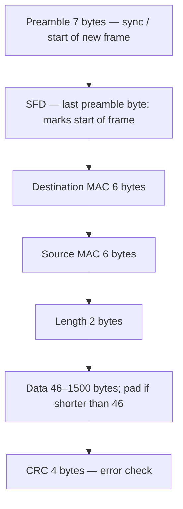

| Field | Size | Role |
|-------|------|------|
| **Preamble** | 7 bytes | Start of a new frame; **synchronization** between devices |
| **SFD** (start-of-frame delimiter) | Last byte of that lead-in | Marks **start of frame** (lecture: repeating **10** pattern) |
| **Destination address** | 6 bytes | Receiver **MAC** |
| **Source address** | 6 bytes | Sender **MAC** |
| **Length** | 2 bytes | Frame length |
| **Data** | **46–1500** bytes | Payload; **pad** if shorter than 46 so the field is 46 bytes |
| **CRC** | 4 bytes | Frame received **error-free** |

#### MAC: CSMA/CD

Protocols in which stations **listen for a carrier and act accordingly** are **carrier-sense** protocols. Ethernet uses **CSMA/CD**.

When a station has data:

1. **Listen.** If the channel is **busy**, wait until **idle**.
2. On idle, **transmit**.
3. If a **collision** occurs, wait a **random** time and **start over**.

Flowchart as taught: ready → sense; if busy, **sense again**; if free, **transmit and watch for collision**; on collision, send a **jam** signal and wait per **backoff**; if no collision, **transmission completes**.

CSMA/CD is in one of three states: **contention, transmission, or idle**. After a station finishes a frame (time **t0**), any station with a frame may try. If **two or more** transmit together, a **collision** occurs. Collisions are detected by comparing **received power or pulse width** with the **transmitted** signal. After detecting a collision the station **aborts**, waits **random**, tries again if no one else has started. Model: alternating **contention** and **transmission**, with **idle** when all are quiet.

##### Binary exponential backoff

| After collision # | Random wait |
|-------------------|-------------|
| 1st | **0 or 1** slot |
| 2nd | **0, 1, 2, or 3** slots |
| 3rd | **0 … 2³−1 = 7** |
| *i*th (general) | Uniform in **0 … 2^i − 1** slots |
| After **10** collisions | Interval **frozen** at max **1023** slots |
| After **16** collisions | Controller **gives up** and **reports failure** to the computer; **higher layers** recover |

If two stations pick the **same** random number after the first collision, they **collide again**.

##### Why padding / 64-byte minimum

A station must not **finish sending a short frame** before the first bit reaches the **far end**, where it might **collide**. Let **T** be propagation time A→B.

- At time 0, **A** sends.
- At **T − ε**, distant **B** starts sending.
- **B** sees **more power than it puts out**, aborts, and sends a **48-bit noise burst (jam)** so the sender **cannot miss** the collision.
- At about **2T**, **A** hears the jam, aborts, waits random, retries.

If the frame were **very short**, A might **think success** before the jam returns. Therefore **all frames must take more than 2T to send** so transmission is **still ongoing** when the jam arrives. Frames under **64 bytes** are **padded to 64 bytes**.

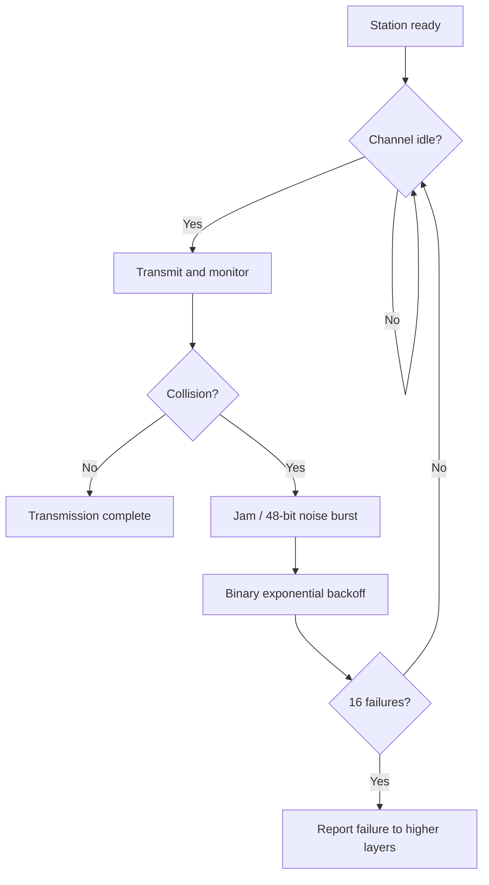

#### Fast Ethernet

**Fast Ethernet** is **traditional CSMA/CD at 100 Mbps over twisted pair** (and fiber PHYs below). Proposed **1992**. Two groups' proposals were both approved under different IEEE committees:

- One passed full review in **June 1995** as **IEEE 802.3u** — **Fast Ethernet**, which **succeeded in enterprise LANs**.
- The other became **100VG-AnyLAN**, later under **IEEE 802.12** (ASR: “802.2”), using **demand priority** instead of CSMA/CD. It **did not catch on**.

Fast Ethernet exists because **10 Mbps Ethernet was slow**. It is a **simple speed-up** with the **same rules**. The **802.3** committee kept a sped-up Ethernet for three reasons:

1. **Backward compatibility** with existing Ethernet LANs.
2. **Fear** that a **new protocol** might have **unforeseen problems**.
3. Desire to **finish before the technology changed**.

They kept **old packet formats, interfaces, and procedures** and only reduced **bit time from 100 ns to 10 ns**, raising bandwidth to **100 Mbps**. Officially **802.3u**, commonly **Fast Ethernet**.

**Challenge:** more bits are on the wire during the same **propagation delay**, so the **collision window** contains more bits. Designers could **raise minimum frame size** or **shorten cable** (cut delay). Changing minimum frame size would **break backward compatibility**, so **maximum network size** was reduced; typical **max cable length 100 m**.

**Fast Ethernet frame format is the same as Ethernet.**

#### Fast Ethernet physical types

Three **basic** PHYs, then additional fiber variants:

| PHY | Medium | Distance / notes |
|-----|--------|------------------|
| **100BASE-T4** | **Category 3**, **four-pair** twisted pair | **100 m**, **RJ-45** |
| **100BASE-TX** | **Cat 5 UTP** or **Type 1 STP**, RJ-45 (Cat 5 dearer than Cat 3) | **Full duplex**: send **and** receive **100 Mbps** at once |
| **100BASE-FX** | Two strands **62.5/125 µm multimode** fiber, one each way | Full duplex 100 Mbps each way; station–hub up to **2000 m**; **SC, MIC, or ST** connectors |
| **100BASE-SX** | Two multimode strands; **short-wavelength** optics | Cheaper than FX's **long-wavelength** optics; up to **550 m** |
| **100BASE-BX** | **One strand single-mode** plus a multiplexer splitting **TX/RX wavelengths** | **1310 nm** and **1550 nm**; **10, 20, or 40 km** |
| **100BASE-LX10** | **Two single-mode** fibers | Nominal **10 km**, **1310 nm** |

#### Fast Ethernet layered PHY

| Piece | Role |
|-------|------|
| **MII** (Medium Independent Interface) | Between **MAC** and PHY; **any** PHY with the MAC. Two media-status signals: **carrier present**, **collision absent** |
| **Reconciliation** sublayer | Maps those signals to **physical signaling primitives** the existing MAC understands |
| **PCS** (Physical Coding Sublayer) | Uniform interface to Reconciliation for all media; generates **carrier sense** and **collision detect**; runs **autonegotiation** of **10 vs 100 Mbps** and **half vs full duplex** |
| **PMA** (Physical Medium Attachment) | Medium-independent serial support for PCS: **serialize** code groups for TX, **deserialize** received bits into code groups |
| **PMD** (Physical Medium Dependent) | Maps medium to PMA; defines **signaling** for each medium |

### Key terms

| Term | Meaning in this lecture |
|------|-------------------------|
| IEEE 802.3 / 802.3u | Ethernet (1983); Fast Ethernet (June 1995) |
| 10BASE5 / 2 / T / F | Thick coax 500 m; thin 185 m; TP hub 100 m; fiber 2 km |
| Vampire tap | 10BASE5 pin into the coax core |
| LLC / MAC | Network-protocol handoff vs shared-media access and MAC addresses |
| CSMA/CD | Sense, send, detect collision, jam, backoff |
| Binary exponential backoff | Wait 0…2^i−1 slots; cap 1023 after 10; fail after 16 |
| Slot time / 2T | Collision window; min frame **64 bytes** so sender still transmitting when jam returns |
| 100VG-AnyLAN | 802.12 demand-priority alternative that did not succeed |
| MII / PCS / PMA / PMD | Fast Ethernet MAC–PHY stack; autonegotiation in PCS |

### Lecture takeaways

- Ethernet grew from Xerox **3 Mbps** coax to **IEEE 802.3** and displaced Token Ring, FDDI, and ARCNET on wired LANs.
- Shared coax (**10BASE5/2**) dies on **one cable fault**; **10BASE-T** hubs and **10BASE-F** fiber (noise, distance, **harder tapping**) were the answers at 10 Mbps.
- MAC is **CSMA/CD** with **jam**, **binary exponential backoff**, and a **64-byte floor** so collisions are **heard in 2T**.
- Fast Ethernet is the **same frames and MAC** with **10 ns** bits and **~100 m** copper reach, standardized as **802.3u**; **100VG-AnyLAN** lost.
- Copper PHYs are **T4 (Cat 3)** and **TX (Cat 5, full duplex)**; fiber PHYs cover **short, long, bidirectional-single-fiber, and 10 km** plants, glued to MAC by **MII + PCS/PMA/PMD**.

---
