# Volume 03 — High-Speed Links, Wireless, and VPN

**Course:** CEC / SWAYAM Information Security · **Coordinator:** Dr. Maninder Singh, Thapar Institute

Modules M24–M35: Ethernet security, Gigabit/10-Gigabit Ethernet, ISDN, SCTP, ATM, wireless LANs, Wi-Fi security, Bluetooth, VPN, and WiMAX.

These notes are grounded in the official YouTube lecture transcripts. They are study material, not an official CEC publication.

---

# M24: Ethernet Security

**Source:** https://www.youtube.com/watch?v=uaDXhq0k5sc
**Instructor / expert:** Prof. Yogesh Chaba, Department of Computer Engineering and IT, Guru Jambheshwar University of Science & Technology, Hisar. Course coordinator: Dr. Maninder Singh, Professor and Dean of Academic Affairs, Thapar University, Patiala.

### Learning objectives

- Trace Ethernet from ALOHAnet and Xerox CSMA/CD through the DIX 1.0 spec to IEEE 802.3, and name the frame as the on-wire unit.
- State why Ethernet was designed without security, and list the five attack classes the lecture uses (access, confidentiality, integrity, DoS, system security).
- Contrast router-based segmentation, access control (including IEEE 802.1Q / 802.1X), higher-layer crypto, and monitoring.
- Describe IEEE 802.1AE MACsec: SecTAG and ICV placement, SA/SAK/PN/SCI, Protect/Validate, and replay protection.

### Core concepts

Ethernet security is the lecture’s topic for **securing wired LANs and MANs**. The expert’s outline is: brief Ethernet background, **Ethernet threats**, **Ethernet security solutions**, then the **MACsec** protocol.

#### Roots, DIX, and IEEE 802.3

Ethernet’s roots are in the 1970s radio experiment **ALOHAnet**, developed under **Norman Abramson** at the **University of Hawaii**. Around the same time **Xerox** created a LAN at **3 Mbps** using **carrier-sense multiple access with collision detection (CSMA/CD)**.

In **1980**, the **10 Mbps Ethernet Version 1.0** specification was jointly released by **Digital Equipment Corporation**, **Intel**, and **Xerox** (the DIX spec). IEEE picked it up as **IEEE 802.3** in **1983**.

A chunk of data Ethernet sends on the wire is a **frame**. Only one node should transmit a frame at a time; simultaneous transmissions cause a **collision**, both signals can fail, and the stations must **retransmit**. Those properties are summarized as **CSMA/CD**.

Ethernet supports **optical fiber** and **copper**. In the lecture figure, yellow is fiber and blue is **twisted pair**; a server farm and PCs attach to a **Fast Ethernet (100 Mbps)** network through **switches**.

IEEE 802.3 comprises several **OSI physical-layer** wiring and signaling variants. Original **10BASE5** used **coaxial cable** as a shared medium; newer variants use **twisted pair** and **fiber** with **hubs or switches**.

| Name the lecture uses | Rate |
|-----------------------|------|
| Ethernet | 10 Mbps |
| Fast Ethernet | 100 Mbps |
| Gigabit Ethernet | 1,000 Mbps |
| 10 Gigabit Ethernet | 10,000 Mbps |
| 100 Gigabit Ethernet | 100,000 Mbps |
| 400 Gigabit Ethernet | expected by early 2017 |

Rates have risen from the original **10 Mbps** to **100 Gbps**, with **400 Gbps** expected by early 2017 in the lecture’s timeline. Ethernet is called the **only survivor of the wired LAN war**: it is hard to find an IP packet that has not crossed an Ethernet segment, largely because of **simplicity and ease of configuration**. It has nonetheless always been known as an **insecure** technology. Successful **malware** and the move toward **cloud computing** in data centers are why security of Ethernet now needs attention.

#### Why Ethernet is easy to attack

Security was **never a major design consideration**. The basis of an attack is **gaining access to the target Ethernet segment**. The attacker may be an **insider with full access rights**, or may have found a jack in a **public space**.

Before listing methods, the lecture lists how an attacker **uses** that access:

- Learn **private network topology** and **traffic** for later attacks
- Gain **control of switches, routers, or servers** in the LAN
- **Eavesdrop**
- **Manipulate** information
- **Disrupt availability**

The **most prominent** attack methods on Ethernet segments are:

1. **Network and system access**
2. **Traffic confidentiality**
3. **Traffic integrity**
4. **Denial of service**
5. **System security** (named as a class; the worked examples sit under the first four)

##### Network and system access

Access is a **prerequisite** for every other attack. It is achieved by **connecting equipment** or by **taking over existing resources**.

| Method | What the lecture describes |
|--------|----------------------------|
| Unauthorized join | Connect to an unused **switch port**: physical access to the switch, a **wall socket**, unplug a PC and plug in another, or insert a **switch between PC and wall jack** |
| Unauthorized expansion | Users install their own **switches** or **wireless access points**, so others can join |
| VLAN join | If a switch **listens for VLAN management protocols on host ports**, a host can **act as a switch** and join **all VLANs**. Some ports can be set **not to transmit** those protocols but **still listen**; an attacker can **probe for hidden features** |
| VLAN tagging and hopping | Craft Ethernet frames with a **VLAN tag** and **inject** into VLANs the attacker should not reach |
| Remote access to the LAN | Compromise a host via a **higher layer**, e.g. **social engineering** so a user opens a **remote administration** service that connects **out to the Internet**, giving the attacker an Ethernet-layer foothold |
| Switch control | Switches often ship with **default or no passwords**; passwords can often be **physically reset**. A controlled switch can **reroute traffic**, take **links down**, **claim the STP root** by raising **bridge priority**, or **DoS selected links** |

##### Traffic confidentiality

Captured traffic is useful in itself and for **finding targets**. The attacker obtains not only payload but **authentication data such as passwords** and **topology** for later use.

##### Traffic integrity

The attacker **modifies** traffic. Example: **imitate a bank web server to the user** and **imitate the user to the bank**, gaining **temporary control of the user’s bank account**.

| Technique | Mechanism |
|-----------|-----------|
| ARP poisoning | Send an **ARP** reply with the **victim’s IP** and the **attacker’s MAC**, so the sender delivers frames to the attacker |
| DHCP poisoning | Hear **broadcast DHCP** requests and **reply first**; on success assign **gateway**, **DNS**, and **IP**, then **control the host’s traffic** |
| Man-in-the-middle | If traffic is **steered through** the attacker and has **no integrity check**, the attacker can **modify** it |
| Session hijacking | Ethernet is **stateless**, but many higher-layer protocols create a **session** that is then **assumed trusted** with **no further verification**. If the attacker **eavesdrops** (or otherwise learns enough), they can **recreate the session** and act as one endpoint |

##### Denial of service

Motivation is **not data access** but **preventing use**: **total loss** or **degradation** of service.

- **Resource-exhaustion:** target a switch’s **control and management planes** with frames that need **extra processing**.
- **Protocol-based DoS:** **Spanning Tree Protocol (STP)** builds a **tree from a mesh** and is **self-configuring**. A node can send **STP messages** and **pretend to be a switch**. The switching network can be **halted** by flooding **STP topology-change notifications (TCNs)** or other STP control messages.

#### Solutions the lecture groups

Ethernet security has been improved by **standards bodies**, **vendors**, and **research**. The traditional answer was to treat **any Ethernet segment as untrusted** and put it **inside a protected domain**: **behind a firewall**, in a **secure building**, with **trusted staff**. Remaining issues were left to **higher-layer cryptography** such as **IPsec** and **TLS**. Cryptography has **its own cost** and is **not a universal solution**.

##### Router-based security

Replace a **central Ethernet switch** with an **IP router**. The router **partitions** Ethernet into **several segments**, each a **separate broadcast domain**. **ARP, STP, VLAN, and MAC-address-table** attacks then **cannot cross segments**. Inside a segment the same attacks remain unless **each switch** is replaced by a **multi-port router**. Cost: an IP router needs **configuration** (address allocation, default route); that can sometimes be **automated** (e.g. **residential broadband** where topology is clear to the access router). Routers also **hinder easy mobility**: on Ethernet a host can **move and keep IP and MAC**; **MAC tables update automatically**. Compared with a switch, a router still gives **considerable protection** against other users on the same box.

##### Access control

If untrusted parties never get on, they cannot attack.

- **Physical protection:** equipment in **locked cabinets and rooms**; wiring **inside walls**.
- **Segmentation and VLANs:** **IEEE 802.1Q** limits **broadcast and other traffic** to specific segments. VLANs are **logically separate** on the same physical plant and define **security domains**. Each host can be put in its **own VLAN**. **IEEE 802.1Q-in-Q (QinQ) double tagging** or vendor **private VLAN (PVLAN)** isolates hosts so traffic only reaches one **promiscuous port** (typically a **router to the Internet**). Each host sees **only itself and the promiscuous-port host**; only a **few VLAN IDs** are needed on trunks for PVLAN traffic.
- **Access control lists:** **not part of Ethernet** itself; **switch vendors** added them. A simple Ethernet-frame ACL can use **sender/receiver MAC** or **EtherType**. Access can be limited by **MAC**, and **service-specific ACLs** are common.
- **Authentication-based access:** **IEEE 802.1X** port authentication supports **username/password** or a **certificate and private key**. The **client** talks to the **authenticator switch**; the switch checks credentials against an **authentication-server database**. 802.1X uses **Extensible Authentication Protocol (EAP)** for many methods. It authenticates a host at **session start** and **binds the MAC address to a switch port**.

##### Secure protocols on the wire

- **Encryption and integrity:** **IEEE 802.1AE MACsec** builds **encrypted connections between hosts and switches**, protecting **confidentiality and integrity of frame contents**. Deployment needs **software** and **authentication configuration** for each participating entity. MACsec stops **intruders** from **reading or modifying** data frames (detail below).
- **Securing ARP:** ARP is a **major Ethernet vulnerability**. **DHCP snooping** can bind **MAC ↔ IP ↔ port** from DHCP messages and **block ARP spoofing**. Limitation: a **single switch cannot see** DHCP allocations whose path to the server **does not pass through that switch**.

##### Security monitoring

The previous techniques are mostly **proactive** and, once set, need little **external or human** involvement. **Active** monitoring adds:

- **Ethernet firewall and deep packet inspection (DPI):** firewalls sit between segments and are **more complex ACLs**, including **stateful** features; current products can operate on **all network layers**.
- **IDS / IPS:** use DPI against a **signature library** of known attacks. The lecture states such systems are **rarely useful for Ethernet-network protection**.
- **Planning, configuration, and administration:** good practice **strongly influences** Ethernet security; many of the technical controls need **configuration and ongoing adjustment** as topology changes.

#### IEEE 802.1AE MACsec

**MAC Security (MACsec)**, **IEEE 802.1AE**, lets **authorized systems** that attach to and interconnect LANs **keep transmitted data confidential** and **resist frames sent or modified by unauthorized devices**.

The lecture’s list of what MACsec facilitates:

- Maintain **correct network connectivity and services**
- **Isolate denial-of-service** attacks
- **Localize** any source of communication to the **LAN of origin**
- Build **public networks** that serve **unrelated or mutually suspicious customers** on **shared LAN infrastructure**
- **Secure communication between organizations** that use a LAN for transit
- **Incremental, non-disruptive** deployment, protecting the **most vulnerable** components first

**On the frame:** destination and source **MAC addresses stay as they are**. A **SecTAG** is inserted **before** the user data; an **integrity check value (ICV)** is inserted **after** the data. MACsec **modifies the MAC service data unit (MSDU)** carried in each frame.

The **MAC security tag (SecTAG)** carries parameters that **identify the protocol**, **identify the key** used to validate the frame, and support **replay protection**:

| SecTAG parameter | Role |
|------------------|------|
| Tag Control Information (TCI) | Tag/control bits |
| Association Number (AN) | Selects the Security Association |
| Packet Number (PN) | Per-SA packet counter (replay) |
| Secure Channel Identifier (SCI) | Identifies the secure channel |

The **secure data** field carries user data, **encrypted if confidentiality is provided**. The **ICV** covers **MAC DA, MAC SA, SecTAG, and user data**.

**Transmit path**

1. The frame is assigned to a **Security Association (SA)** identified locally by its **Association Number (AN)**.
2. The SA identifies the **Security Association Key (SAK)** and the **next Packet Number (PN)**.
3. **AN, SCI, and PN** are encoded in the SecTAG and given to the **Protect** function.
4. Protect emits the **ICV** and **secure user data**.

**Receive path**

1. **AN, SCI, and PN** are extracted from the SecTAG.
2. **AN** and **SCI** assign the frame to an SA and thus to the **SAK**.
3. The current **cipher suite’s validation** function is given **SAK, PN, SCI**, **DA**, **SA**, SecTAG octets, **secure data**, and **ICV**.
4. If integrity holds and user data can be decoded, a **valid** indication and the **user-data octets** are returned.
5. **Replay protection:** the received **PN must not be less than** the **lowest acceptable PN** for that SA.
6. On success, unchanged frame parameters are presented to the MACsec receiver and the **lowest acceptable PN is updated**.

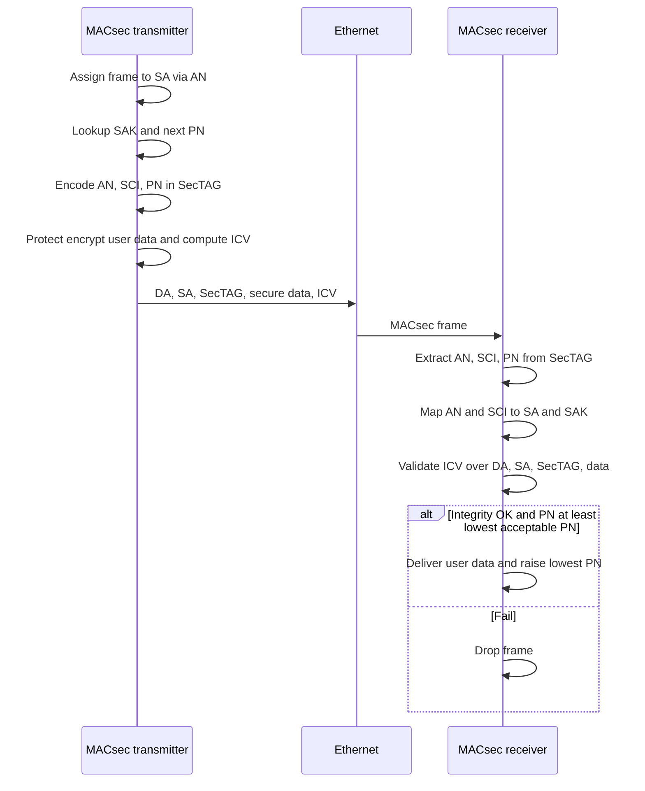

### Key terms

| Term | Meaning in this lecture |
|------|-------------------------|
| Frame | Ethernet’s on-wire data unit; only one node should send one at a time |
| CSMA/CD | Carrier sense, multiple access, collision detection — Ethernet’s classic shared-medium rule |
| IEEE 802.3 | LAN/MAN standard grown from DIX Ethernet 1.0 (1980) and standardized in 1983 |
| VLAN hopping | Injecting VLAN-tagged frames (or abusing VLAN management) to reach VLANs the port should not join |
| STP TCN flood | DoS by flooding Spanning Tree topology-change notifications or other STP control |
| IEEE 802.1Q / QinQ / PVLAN | VLAN tagging, double tagging, and private-VLAN isolation (hosts only talk via a promiscuous router port) |
| IEEE 802.1X / EAP | Port authentication of a host to a switch that checks an authentication server |
| DHCP snooping | Bind MAC–IP–port from DHCP so ARP spoofing can be blocked, limited to what that switch can see |
| MACsec (IEEE 802.1AE) | Hop-by-hop encryption/integrity of Ethernet MSDUs using SecTAG, SAK, PN, SCI, and ICV |
| SecTAG / ICV / SAK / PN | MACsec tag, integrity check, association key, and packet number used for Protect, Validate, and replay checks |

### Lecture takeaways

- Ethernet won wired LANs by simplicity, not by security; design never treated security as a first-class goal.
- Almost every attack starts with **segment access** (physical jack, rogue AP/switch, VLAN tricks, stolen switch, or a remotely owned host).
- Confidentiality, integrity (ARP/DHCP poisoning, MITM, session hijack), and STP/resource DoS are the concrete Ethernet threats taught here.
- Classic mitigation was “treat the LAN as dirty” (building + firewall) plus **IPsec/TLS**; that is costly and incomplete.
- Routers cut broadcast-domain attacks; 802.1Q/PVLAN/ACLs/802.1X limit who is on the wire; DHCP snooping hardens ARP; firewalls/IDS are secondary.
- **IEEE 802.1AE MACsec** is the Ethernet-layer protocol the lecture spends its last section on: encrypt and integrity-protect frames between authorized devices, with replay protection via PN.

---

# M25: Gigabit Ethernet

**Source:** https://www.youtube.com/watch?v=4rAKMS0KbJU
**Instructor / expert:** Dr. Yogesh Chaba, Department of Computer Engineering and IT, Guru Jambheshwar University of Science & Technology, Hisar. Course coordinator: Dr. Maninder Singh, Professor and Dean of Academic Affairs, Thapar University, Patiala.

### Learning objectives

- Explain why Gigabit Ethernet (1 Gbps / 1000 Mbps) was specified as a 10× Fast Ethernet successor that keeps the IEEE 802.3 frame and MAC modes.
- Map the Gigabit stack: GMII, PCS (8B/10B), PMA, PMD/MDI, and auto-negotiation of 10/100/1000 Mbps and half/full duplex.
- List the IEEE 802.3z / 802.3ab / 802.3ah (and related) physical types with media, wavelengths, and distances the lecture gives.
- Recite the basic Gigabit MAC frame fields, CSMA/CD vs full duplex, packet bursting, and **carrier extension**.

### Core concepts

Gigabit Ethernet is presented as **wired-LAN transmission at 1000 Mbps (1 Gbps)** — **ten times Fast Ethernet**. The lecture order is: introduction, **layered protocol architecture**, **physical specifications**, then **frame format**.

#### Why 1 Gbps became necessary

A “basic law of network design” in the lecture: **demand for capacity is always underestimated**. Gigabit speeds once looked excessive; **data-intensive applications**, more users, and new delivery methods keep raising bandwidth need.

When **100 Mbps** technologies such as **FDDI** appeared, most **horizontal** networks still used **10 Mbps Ethernet**; the new protocols were mainly **backbones**. Once **Fast Ethernet** took the horizontal market, a **100 Mbps backbone** was often **too small** for **switch-to-switch** links that aggregate many Fast Ethernet networks. Gigabit Ethernet was developed as the **next generation** at **1 Gbps**.

#### IEEE standards the lecture names

| Standard | Year (lecture) | What it defined |
|----------|----------------|-----------------|
| **IEEE 802.3z** | June 1998 | Initial Gigabit Ethernet; **required optical fiber**. Commonly **1000BASE-X**, where X is **CX, SX, LX**, or non-standard **ZX** |
| **IEEE 802.3ab** | 1999 | Gigabit over **UTP Cat 5 / 5e / 6**, known as **1000BASE-T**. After ratification, Gigabit became a **desktop** technology on **existing copper** |
| **IEEE 802.3ah** | 2004 | Two more fiber PHYs: **1000BASE-LX10** and **1000BASE-BX10**, in the **Ethernet in the First Mile** group |

Like Fast Ethernet, Gigabit uses the **same frame format, frame size, and media-access method** as **10 Mbps Ethernet**. Fast Ethernet overtook FDDI because administrators did not need a **different backbone protocol**; likewise Gigabit avoids forcing **ATM** on backbones.

It is an **extension of base IEEE 802.3**. Task-force **design objectives**:

- Offer **10× the bandwidth of Fast Ethernet**
- Use the **IEEE 802.3 Ethernet frame format**
- Employ the same **half-duplex and full-duplex MAC** schemes as predecessors
- Be **backward compatible** with **10 Mbps and 100 Mbps** Ethernet
- Support **all existing network protocols** used with the Ethernet family

**Features emphasized**

- Same **802.3 frame size and format** → easy integration
- **Upgrade path** that reuses existing technology and operational knowledge
- **Full duplex** for **switch–switch** and **switch–end-station** links; **most products shipped are full duplex**, so **no shared-medium contention**
- **Half duplex** on shared media still uses **CSMA/CD**; a **packet-bursting** feature lets servers, switches, and other devices **send bursts of small packets** to use the bandwidth
- Media: **fiber**, or **Cat 5 / Cat 6**
- **Low cost** of install, maintenance, and management (local administrators can run it)
- **Faster switching** than routing: same frame format allows **seamless LAN / MAN / WAN** integration with **no fragmentation, reassembly, or address translation**, so **routers (slower than switches) are not required** for that stitching

#### Layered protocol architecture

Gigabit Ethernet supports **10, 100, and 1000 Mbps**. It provides separate **8-bit-wide receive and transmit data paths**, so both **full duplex and half duplex** are possible.

The **Gigabit Media Independent Interface (GMII)** sits between **MAC and PHY**. It is an extension of Fast Ethernet’s **Media Independent Interface (MII)** and **reuses MII’s management interface**. With GMII, **shielded/unshielded twisted pair** and **single-mode/multimode fiber** can share the **same MAC controller**. GMII also provides two media-status signals: **carrier present** and **collision absent**.

GMII sits above three sublayers:

| Sublayer | Role in this lecture |
|----------|----------------------|
| **PCS** (Physical Coding Sublayer) | Uniform interface to all media. **8B/10B** coding as in **Fibre Channel**: **10-bit code groups** represent **8-bit** groups. Generates **carrier sense** and **collision detect** for half duplex. Runs **auto-negotiation**: NIC learns **10 / 100 / 1000 Mbps** and **half vs full duplex** |
| **PMA** (Physical Medium Attachment) | Medium-independent serial attachment. Takes **10-bit groups at 125 MHz** from PCS, **serializes** them; on receive, **deserializes** bits back into code groups for PCS |
| **PMD** (Physical Medium Dependent) | Maps the medium; defines **signaling**. Includes the **Medium Dependent Interface (MDI)** — actual **connectors**. PMD is where **802.3z, 802.3ab**, and related PHYs are distinguished |

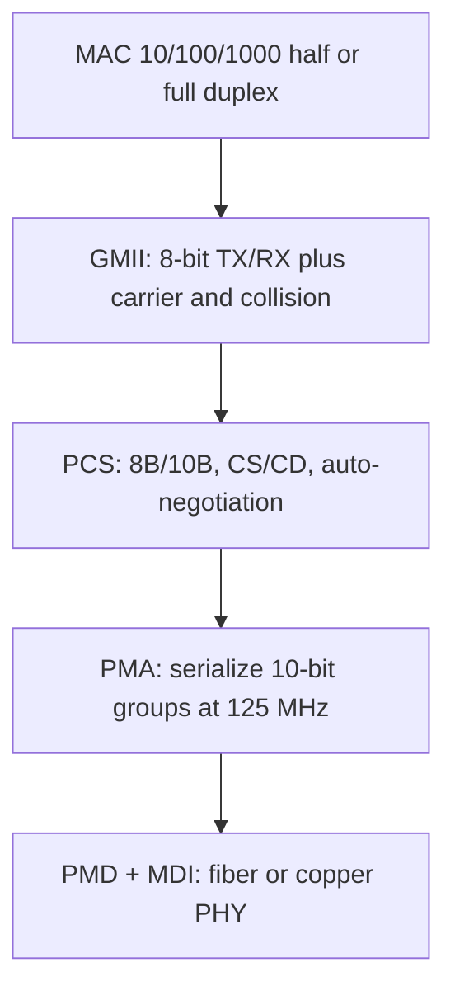

#### Physical specifications

The PHY describes **media**, **electrical/optical properties**, and **signal interpretation**.

##### IEEE 802.3z — collectively 1000BASE-X

**1000BASE-SX** (short wavelength fiber)

- Multimode fiber, **850 nm** near-infrared
- Maximum **220 m** on **62.5/125 μm** fiber with good terminators (the lecture also states it **usually works farther**)
- Modern **50/125 μm** fiber can reliably reach **500 m or more**
- Popular for **intra-building** links in large offices, **colocation** facilities, and **carrier-neutral Internet exchanges**

**1000BASE-LX** (long wavelength)

- Long-wavelength laser, **1270–1355 nm**; typically specified **1300 or 1310 nm**
- Specified to **5 km** over **10 μm single-mode fiber**; often works **much farther**; many vendors guarantee **10 or 20 km** if their equipment is at **both ends**
- For links **greater than 300 m**, a **launch-conditioning patch cord** may be required so the laser is launched at a **precise offset from the core center** and **spreads across the core diameter**

**1000BASE-CX**

- Early copper Gigabit, **maximum 25 m**, **balanced shielded twisted pair**, **pinout different from 1000BASE-T**
- Short reach because of the **very high signal rate**
- Still used in niches such as **blade server to switch-module** Ethernet; **1000BASE-T succeeded it** for general copper wiring

##### IEEE 802.3ab — 1000BASE-T (and the TIA’s 1000BASE-TX)

**1000BASE-T** is Gigabit on UTP. The **Telecommunications Industry Association (TIA)** promoted a simpler variant, **1000BASE-TX**, meant to cut electronics cost by using **only two pairs in each direction**. Many **1000BASE-T** products are **advertised as 1000BASE-TX** from ignorance that **TX is a different standard**.

##### Backplane and Ethernet in the First Mile PHYs

The lecture groups these in a table (it names **IEEE 802.3ap** in one breath with EFM; IEEE names: **802.3ap** is backplane, **802.3ah** is Ethernet in the First Mile):

**1000BASE-KX** — part of **IEEE 802.3ap**, Ethernet over **electrical backplanes**. Defines **one to four lanes** of backplane links: **one RX and one TX differential pair per lane**, at bandwidths from **megabit to 10 gigabit per second**.

**1000BASE-LX10** — standardized **six years after** the first Gigabit fiber PHYs in the **Ethernet in the First Mile** task group. Very similar to **1000BASE-LX** but **up to 10 km** over a **pair of 1310 nm single-mode fibers**, thanks to **higher-quality optics**.

**1000BASE-BX10** — **up to 10 km** on a **single strand of SMF**, **different wavelength each way**. Ends are **not interchangeable**: **downstream** (network center → outside) uses **1490 nm**; **upstream** uses **1310 nm**.

##### Non-standard but industry terms

**1000BASE-EX** — non-standard but accepted term; similar to LX10 with **up to 40 km** over a **pair of SMF**, **1310 nm**, higher-quality optics than LX10.

**1000BASE-ZX** — multi-vendor term: **1550 nm**, **at least 70 km** SMF. Some vendors specify **up to 120 km**, sometimes called **1000BASE-EZX**.

#### Hardware to upgrade 10/100 networks

Four hardware types:

1. Gigabit Ethernet **NICs**
2. **Aggregating switches** that connect many Fast Ethernet segments **into** Gigabit Ethernet
3. **Gigabit Ethernet switches**
4. **Gigabit Ethernet repeaters**

#### CSMA/CD, duplex, and the frame

The Gigabit **MAC** uses the same **CSMA/CD** protocol as Ethernet. **Maximum cable-segment length** is limited by CSMA/CD: if two stations see idle media and transmit, a **collision** occurs.

**IEEE 802.3z** MAC operation is **half or full duplex**.

- **Half duplex:** can send or receive, **not both at once**; uses classic **CSMA/CD**.
- **Full duplex:** send and receive **at the same time**. The Gigabit MAC then uses **IEEE 802.3x** full duplex, including **IEEE 802.3x flow control**. Full duplex raises point-to-point bandwidth from **1 to 2 Gbps**, **increases maximum distance** for a given medium, and **does not use CSMA/CD** because **collisions are eliminated**. Full duplex is **best for backbones** and **high-speed servers**.

An enhancement from **switched 100 Mbps Ethernet** is kept: in half duplex, **CSMA/CD** remains, with **packet bursting** of small frames.

##### Basic data frame (seven fields; optional formats exist)

The lecture’s **required** basic format:

| Field | Size | Meaning |
|-------|------|---------|
| **Preamble (PR)** | 7 bytes | Alternating 1s and 0s: “a frame is coming,” and **PHY receive synchronization** |
| **Start of Frame (SOF / SFD)** | 1 byte | Alternating 1s and 0s **ending in two consecutive 1s**; next bit is the **leftmost bit of the leftmost byte of DA** |
| **Destination Address (DA)** | 6 bytes | Who should receive. **Leftmost bit:** 0 = **individual**, 1 = **group**. **Second bit:** 0 = **globally administered**, 1 = **locally administered**. Remaining **46 bits** uniquely identify a station, a group, or all stations |
| **Source Address (SA)** | 6 bytes | Sender; **always individual**; **leftmost bit always 0** |
| **Length/Type** | 2 bytes | If value **≤ 1500**, it is the **count of LLC bytes** in Data. If **> 1500**, the frame is an **optional type** and the field is a **type ID** |
| **Data** | *n* ≤ 1500 bytes | If shorter than **46 bytes**, **pad** so Data is **46 bytes** |
| **Frame Check Sequence (FCS)** | 4 bytes | **32-bit CRC** computed by the sending MAC over **DA, SA, Length/Type, and Data**; receiver recalculates to detect damage |

##### Carrier extension

Gigabit Ethernet must stay **interoperable with existing 802.3** networks. **Carrier extension** keeps **IEEE 802.3 minimum and maximum frame sizes** while allowing **meaningful cable distances**. For a carrier-extended frame, **extension symbols are included in the collision window** — the **entire extended frame** is considered for collision and dropped if it collides — but **FCS is calculated only on the original frame**. The receiver **strips extension symbols before checking FCS**.

### Key terms

| Term | Meaning in this lecture |
|------|-------------------------|
| Gigabit Ethernet | 1000 Mbps / 1 Gbps IEEE 802.3 family, 10× Fast Ethernet |
| 1000BASE-X | IEEE 802.3z fiber/short-copper group (SX, LX, CX; ZX as vendor term) |
| 1000BASE-T | IEEE 802.3ab Gigabit on Cat 5/5e/6 UTP |
| GMII | Gigabit Media Independent Interface between MAC and PHY |
| 8B/10B | PCS coding: 8 data bits as 10-bit code groups (Fibre Channel style), 125 MHz toward PMA |
| Packet bursting | Half-duplex CSMA/CD enhancement: burst small packets to fill the pipe |
| IEEE 802.3x | Full-duplex operation and flow control used by Gigabit when not sharing the wire |
| Carrier extension | Extra symbols in the collision window so min/max 802.3 sizes still work at 1 Gbps distances; FCS ignores the extension |
| Length/Type | ≤1500 → LLC length; >1500 → optional Ethernet type |

### Lecture takeaways

- Gigabit exists because Fast Ethernet desktops overflowed 100 Mbps backbones; it keeps **802.3 frames** so shops need not move backbones to **ATM** or **FDDI**.
- Architecture is **MAC → GMII → PCS (8B/10B, auto-neg) → PMA (125 MHz serialize) → PMD**.
- Fiber PHYs (SX/LX/LX10/BX10/EX/ZX) and copper (CX then T) are chosen by **reach and cabling already in the wall**.
- **Full duplex** is the shipping default (up to **2 Gbps** both ways, no CSMA/CD); half duplex still exists with **CSMA/CD + burst + carrier extension**.
- Frame layout is classic Ethernet (preamble through 32-bit CRC); **carrier extension is the Gigabit-specific MAC trick** taught at the end.

---

# M26: 10 Gigabit Ethernet

**Source:** https://www.youtube.com/watch?v=yu-UWXqj5wE
**Instructor / expert:** Dr. Yogesh Chaba, Department of Computer Engineering and IT, Guru Jambheshwar University of Science & Technology, Hisar. Course coordinator: Dr. Maninder Singh, Professor and Dean of Academic Affairs, Thapar University, Patiala.

### Learning objectives

- State that 10 Gigabit Ethernet (10 GbE / 10G / 10 GigE) sends Ethernet frames at **10 Gbps**, first in **IEEE 802.3ae-2002**, and that it is **full duplex only** (no hubs, no CSMA/CD).
- Walk the 10G stack: RS, PCS, PMA, PMD, XGMII, MDI, and the **WAN Interface Sublayer (WIS)** for SONET-friendly WAN PHYs.
- Contrast **serial 10 Gbps** vs **parallel n-lane** (including WDM) implementations.
- Recite the unchanged Ethernet MAC frame, why the minimum is **64 octets** without carrier extension, and the LAN-fiber / WAN-fiber / copper / backplane / EPON PHYs with rates, wavelengths, and reaches.

### Core concepts

**10 Gigabit Ethernet** is **wired-LAN (and WAN) transmission at 10 Gbps**. Outline: introduction, **layered architecture**, **PHY and MAC**, then **10G standards**.

#### Demand, HSSG, and what 10G is

As high-speed demand grew, a faster Ethernet was needed. In **March 1999** the **Higher Speed Study Group (HSSG)** formed to develop a **10 Gigabit Ethernet** standard. 10 GbE is described as a **telecommunication technology** offering up to **10 billion bits per second**.

**10 Gigabit Ethernet** (also **10G**, **10GbE**, **10 GigE**) is a group of technologies that transmit **Ethernet frames at 10 Gbps**. It was first defined by **IEEE 802.3ae-2002**.

Unlike earlier Ethernet, **10 GbE defines only full-duplex point-to-point links**, generally via **network switches**. **Shared-medium CSMA/CD was not carried forward**. **Half duplex and hubs do not exist** in 10GbE.

It can use **copper or fiber**, but bandwidth forces **higher-grade copper**: **Category 6, 6A, or 7** for links **up to 100 m**.

#### IEEE 802.3 documents listed in the lecture table

| IEEE document | Year | Lecture’s scope |
|---------------|------|-----------------|
| **802.3ae** | ratified 2002 | 10 Gbps over **fiber** for **LAN and WAN** |
| **802.3ak** | 2004 | 10 Gbps over **twinax** |
| **802.3-2005** | 2005 | Base-standard **revision** incorporating prior amendments |
| **802.3an** | 2006 | 10 Gbps over **copper twisted pair** |
| **802.3ap** | 2007 | **Backplane Ethernet**: **1 and 10 Gbps** over **printed circuit boards** |
| **802.3aq** | 2006 | 10 Gbps over **multimode fiber** with **enhanced equalization** |
| **802.3-2008** | 2008 | Another **base-standard revision** |
| **802.3av** | 2009 | 10 Gbps Ethernet PHY for **EPON** |
| **802.3-2012** | 2012 | Called the **latest version of the base standard** in this lecture |

#### Layered protocol architecture

Ethernet implements the **bottom two OSI layers**: **data link** and **physical**. Mapping in the lecture:

- OSI **physical** → **PMD, PMA, PCS**, and **Reconciliation Sublayer (RS)**
- Toward the **network** side → **MAC** and **LLC**

**Basic media families:**

- **10GBASE-R** — LAN fiber
- **10GBASE-W** — WAN fiber
- **10GBASE-X** — copper (coded family)

**PMD — Physical Medium Dependent.** Signaling on the wire/fiber: **amplify, modulate, wave-shape**. Different PMDs support different media.

**PCS — Physical Coding Sublayer.** Coding plus **serializer / multiplexing**. This structure **distinguishes LAN vs WAN PHYs**:

- **WAN PHY:** PCS operates **serialized**.
- **LAN PHY:** two modes:
  1. **Parallel:** a multiplexer puts data on **four 2.5 Gbps** lines.
  2. **Serial LAN:** serialize/deserialize a **single channel**.

**Serial LAN** uses **64B/66B** coding. For the **serial WAN PHY**, an extra **WAN Interface Sublayer (WIS)** sits between **serial PCS and serial PMA**. WIS **ensures operability with SONET** by including a **simplified SONET frame**.

**PMA — Physical Medium Attachment.** Serializes **code groups** into a bit stream for serial devices (and the reverse). Supports **multiple encodings** for PMDs whose encoding is **medium-specific**.

**Reconciliation Sublayer (RS).** **Command translator**: maps **MAC terminology and commands** into **electrical formats** for PHY entities.

**MAC.** Logical connection between MAC clients and the peer. **Initialize, control, and manage** the peer connection.

**XGMII — 10 Gigabit Media Independent Interface.** Standard **MAC ↔ PHY** interface; **isolates** the MAC so it can run over **various PHYs**.

**MDI — Medium Dependent Interface.** **Connector types** for each medium and PMD.

#### Serial vs parallel PHY implementations

Anyone used to Ethernet notices **two physical-layer options**.

**Serial:** one high-speed **10 Gbps PCS–PMA–PMD** block; **one physical channel at 10 Gbps**.

Transmit: RS passes the MAC data **word by word** to PCS → PCS **encodes** → PMA **serializes** → PMD sends the stream on fiber at **10 Gbps**. Receive is the reverse. **Advantage:** straightforward; **no complicated mux/demux**.

**Parallel:** **n subchannels** (parallel cables or **WDM**). A **distributor** multiplexes MAC data into **n streams in round-robin**; each stream goes to its own PCS → PMA → PMD at **(10 / n) Gbps**. Receive uses a **collector**. **Advantage:** lower PCS/PMA rate, so **cheaper CMOS or bipolar** parts. **Disadvantages:** distributor/collector **sensitive to timing jitter**; **multiple logic sets and lasers**.

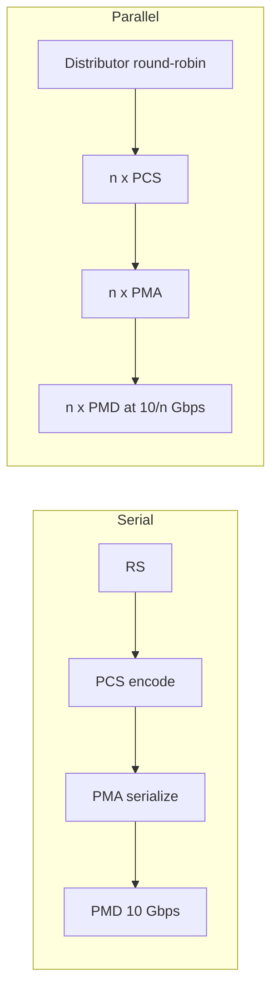

#### MAC layer of 10 GbE

Very similar to earlier Ethernet MACs: **same addresses and frame formats**, but **no half duplex**. It can support **data rates less than 10 Gbps** using a **pacing mechanism** for **rate adaptation and flow control**. **Full duplex only**.

**Why drop half duplex.** Original Ethernet’s half duplex used **CSMA/CD** on a shared medium; simplicity helped Ethernet succeed, so many people **wrongly treat CSMA/CD as “standard Ethernet.”** Half duplex’s problems are **efficiency** and **distance**: link distance is limited by **minimum MAC frame size**, which **hurts high-rate** efficiency. At **10 Gbps**, half duplex is **not attractive**; **no realistic market** exists, because most 10 Gbps links are **point-to-point optical**. Full duplex has **no contention**: the MAC may send whenever the **peer is ready to receive**. So the 10G standard specifies **full duplex only**.

**Frame format.** The point of 10G was to **keep the same MAC frame** as earlier Ethernet for **seamless integration**. With full duplex, **link distance does not affect MAC frame size**. **Minimum MAC frame size is 64 octets**, as in previous standards. **Carrier extension is not required.**

| Field | Size | Meaning (same story as Gigabit Ethernet) |
|-------|------|------------------------------------------|
| Preamble | 7 bytes | Alternating 1/0; announces a frame; PHY receive sync |
| Start of Frame Delimiter (SFD) | 1 byte | Alternating 1/0 ending in **two 1s**; next bit is leftmost bit of DA |
| Destination Address | 6 bytes | Leftmost bit 0 = individual, 1 = group; second bit 0 = global, 1 = local admin; remaining 46 bits identify station/group/all |
| Source Address | 6 bytes | Sender; always individual; leftmost bit always 0 |
| Length/Type | 2 bytes | ≤ 1500 → LLC byte count in Data; optional formats use type ID |
| Data | *n* ≤ 1500 bytes | If < 46 bytes, **pad to 46** |
| FCS | 4 bytes | 32-bit CRC over DA, SA, Length/Type, Data |

(The lecture states Length/Type ≤ 1500 as LLC length; it does not repeat the “> 1500 means type” sentence in this module the way Module 25 did, but the field is still described as length **or** type ID for optional formats.)

#### Physical-layer standards, three categories

1. **LAN fiber:** 10GBASE-SR, 10GBASE-LRM, 10GBASE-LR, 10GBASE-ER, 10GBASE-LX4, 10GBASE-ZR  
2. **WAN fiber:** 10GBASE-SW, 10GBASE-LW, 10GBASE-EW  
3. **LAN copper / backplane:** 10GBASE-CX4, 10GBASE-T, 10GBASE-KX4, 10GBASE-KR  

Plus **10GBASE-PR** for PON, taught last.

##### LAN fiber (“R” PHY)

Most common optical variety: **LAN PHY**, used **directly between routers and switches**, letter **R** in the name. Despite the name **LAN**, fiber can run **up to 80 km**. LAN PHY **line rate 10.3 Gbps** with **66-bit** (64B/66B) encoding.

| PHY | Year | Medium / λ | Line rate | Reach | Standard |
|-----|------|------------|-----------|-------|----------|
| **10GBASE-SR** (short reach) | 2002 | Serial **MMF**, **850 nm** | **10.3125 Gbps** | **300–400 m** | 802.3ae |
| **10GBASE-LR** (long range) | 2002 | **1310 nm SMF**, 64B/66B PCS | **10.3125 Gbps** | **10 km** | 802.3ae |
| **10GBASE-ER** (extended range) | 2002 | **1550 nm SMF** | **10.3125 Gbps** | **40 km**; some vendors later **80 km** pluggables | 802.3ae |
| **10GBASE-LX4** | 2002 | **WDM**, **1310 nm**; **four lasers at 3.125 Gbps** on unique wavelengths | (4 × 3.125) | **300 m** on deployed MMF and **10 km** SMF | 802.3ae; lecture says it is being **replaced by 10GBASE-LRM** |
| **10GBASE-LRM** (long-reach multimode) | 2006 | **1310 nm** on **FDDI-grade 62.5 μm MMF** from early-1990s 100 Mbps plants | **10.3125 Gbps** | **220 m** (IEEE 802.3aq figure; ASR in the transcript says “22 m”) | **802.3aq** |

##### WAN fiber (“W” PHY)

**10GBASE-SW, 10GBASE-LW, 10GBASE-EW** use the **WAN PHY**. At the physical layer they **correspond to SR, LR, and ER** respectively, so they use the **same fiber types and distances**. They fall under **IEEE 802.3ae**.

##### Copper LAN and backplane

**10GBASE-CX4** — designed 2002; working group **IEEE 802.3ak**. **Four lanes each direction** over copper using **InfiniBand 4X twinax (8-pair)**. **15 m** maximum. **Lowest cost per port** among 10G interconnects, **at the expense of range**. Each copper lane carries **3.125 GHz** of signaling bandwidth.

**10GBASE-T** — **IEEE 802.3an**, 2006. 10 Gbps on conventional **UTP or STP Cat 6 / 6A / 7**. **Cat 6: 55 m**; **Cat 6A and 7: 100 m**.

**10GBASE-KX4** and **10GBASE-KR** — **backplane Ethernet**, task force **IEEE 802.3ap**, for **blade servers** and **modular routers/switches** with upgradable line cards. Implementations must work with **up to 1 m of copper PCB and two connectors**. Two 10 Gbps port types: **KX4** (four backplane lanes) and **KR** (single lane). **New backplane designs use KR** rather than KX4.

##### 10GBASE-PR (10G EPON / PON)

Originally **IEEE 802.3av**. 10G Ethernet PHY for **passive optical networks**. **1577 nm** lasers **downstream**, **1270 nm** **upstream** (transcript “157 nm” is the IEEE 802.3av downstream wavelength with a dropped digit). Downstream delivers serialized data at **10.3125 Gbps** in a **point-to-multipoint** configuration. Three **power budgets**: **10GBASE-PR10**, **10GBASE-PR20**, and **10GBASE-PR30** (lecture “PR1 / PR20 / PR30”).

### Key terms

| Term | Meaning in this lecture |
|------|-------------------------|
| 10 GbE / 10G / 10 GigE | Ethernet frames at 10 Gbps; full duplex only |
| IEEE 802.3ae-2002 | First 10G Ethernet standard (LAN/WAN fiber) |
| 10GBASE-R / W / X | LAN fiber, WAN fiber, and copper coding families |
| XGMII | 10 Gigabit Media Independent Interface (MAC–PHY) |
| WIS | WAN Interface Sublayer: simplified SONET framing between serial PCS and PMA |
| 64B/66B | Serial LAN PCS coding; LAN PHY line rate about 10.3 / 10.3125 Gbps |
| HSSG | Higher Speed Study Group (March 1999) that started 10G work |
| 10GBASE-T | IEEE 802.3an twisted-pair 10G (Cat 6 55 m; 6A/7 100 m) |
| 10GBASE-PR | IEEE 802.3av 10G EPON PHY with PR10/PR20/PR30 power budgets |

### Lecture takeaways

- 10 GbE is still Ethernet frames, but **only full-duplex switched point-to-point** — CSMA/CD and hubs are gone because half duplex at 10 Gbps is not a market.
- Stack is classic 802.3 PHY split (**PCS/PMA/PMD**) plus **XGMII** and, for WAN, **WIS/SONET**.
- Implementers choose **one 10G serial pipe** (simple) or **n slower lanes / WDM** (cheaper silicon, more jitter and optics).
- MAC frame is the familiar 64-octet-minimum Ethernet frame; **no carrier extension**.
- PHY letter soup is organized as **LAN-R, WAN-W, copper/backplane, and EPON-PR**, with **10.3125 Gbps** as the repeated serial line rate on optical LAN PHYs.

---

# M27: ISDN

**Source:** https://www.youtube.com/watch?v=xWRKLxEw-v4
**Instructor / expert:** Dr. Lal Chand, Department of Computer Engineering, Punjabi University, Patiala. Course coordinator: Dr. Maninder Singh, Professor and Dean of Academic Affairs, Thapar University, Patiala.

### Learning objectives

- Define ISDN as ITU/CCITT digital circuit- and packet-switched service over ordinary telephone-grade copper (and other media).
- Contrast BRI (2B+D = 144 kbps) with PRI (23B+D / 30B+D) and name B vs D channel rates.
- List bearer, teleservice, and supplementary services, plus TE1/TE2/TA/NT1/NT2 and R–V reference points.
- State ISDN vs ADSL differences, advantages/disadvantages, and the lecture’s security conclusion (logical attacks and HTTPS matter more than the physical medium).

### Core concepts

The lecture is titled **ISDN security**. **ISDN (Integrated Services Digital Network)** is a method to transfer **voice and data** with particular data-accessible services. It is a set of **CCITT / ITU-T** standards for **circuit-switched transmission** of data over various media using **ordinary telephone-grade copper wire**. ISDN provides **worldwide digital communication** in the shift toward electronic documents and business transactions. Its **digital nature facilitates adding security**, but it was **deployed with little thought to security**. It offers **digital circuit-switched voice and data** as well as **packet-switched data**.

#### History: POTS to ISDN

Before ISDN, analog **plain old telephone service (POTS)** was the worldwide default. “POTS” originally expanded as **Post Office Telephone Service**; the name stayed after post offices stopped offering telephony. POTS was mainly **copper from the subscriber to the central office**. Limits: **long-distance calls** had to be **routed through operators and switchboards** (unreliable, slow); **static / line noise** disturbed communication.

In the **1960s** the industry began converting analog systems to **digitized packets** and **digital switching**. The UN **CCITT**, now **ITU-T (International Telecommunication Union — Telecommunication Standardization Sector)**, pushed research toward ISDN and **international digitization**, initiated in **1984**.

Two major US networks, **Northern Telecom** and **AT&T**, took first implementation steps but **did not interoperate** with existing telecom equipment and software — a **worldwide setback by 1990**. Then **National ISDN 1 (NI-1)** was made **compatible with existing proprietary equipment**, so users did not have to switch brands or buy new software. NI-1 set procedures for future digital telephony “for everyone.”

ISDN improved **voice quality** and **Internet access** via its **packet-switched** connection. Voice and data ride a **Bearer (B) channel** at **64 kbps** (sometimes **56 kbps**), versus a telephone line the lecture quotes at **52 kbps**. A **Data (D) channel** is used for **controlling network services and signaling** to set up/tear down connections and to carry signaling related to the B channels, at **16 kbps or 64 kbps**.

**Future:** **Broadband ISDN (B-ISDN)** — voice, data, and video together on **fiber** at **155 Mbps to 622 Mbps and beyond**; called a major R&D topic.

#### Types: BRI and PRI

Two ISDN access types: **Basic Rate ISDN / Basic Rate Interface (BRI)** and **Primary Rate ISDN / Primary Rate Interface (PRI)**.

| Interface | Structure (lecture) | Total |
|-----------|---------------------|-------|
| **BRI** | **2 × 64 kbps B** + **1 × 16 kbps D** | **144 kbps** — enough for **individual users** |
| **PRI** (typical North American) | **23 × 64 kbps B** + **1 × 64 kbps D** | **1.536 Mbps** |
| **PRI** (alternate quoted) | **30 B + 1 D** | **1.984 Mbps** |

BRI is **2B+1D**. The D (Delta) channel is for **link management and signaling**.

PRI **depends on the country**. A typical PRI is **23 B channels at 64 kbps** plus **one 64 kbps D**. One PRI format was **24 DS0s**, looking like a **channelized T1**. Internationally the historical transport rate is **2.048 Mbps** (**E1**; transcript “2.48 Mbps”). On E1, **one of 32 DS0s** was already used for control, leaving **31 DS0s** for ISDN, hence **30B+D**.

A “garden variety” **T1** vs PRI: PRI normally uses **23 channels** as **Bearer (B)** for digital voice or data and the **24th** as **Data (D)** for control — **23B+D**. **One D channel can control more than 23 B channels**, so a **24B** ISDN circuit is possible if **control comes from another PRI**.

#### Features

The major feature vs classic telephony: **speech and information on the same line**. ISDN can deliver **voice, data, video, fax** over a **single line**, with **at least two simultaneous connections**. It gives **access to packet-switched networks**. As a **circuit-switched telephone network** it provides **better voice/data quality than analog**. Users can **attach several devices** instead of buying many analog lines. The **B channel** supplies the **greater data rate**.

#### Three service classes

**Bearer services**, **teleservices**, and **supplementary services**. Teleservices and supplementary services are **visible to end users**; bearer services are **hidden network parts**.

**Bearer services** — real-time **digital information** between users; **OSI layers 1–3**. Example: **64 kbps, 8 kHz-structured** speech: 64 kbps plus **8 kHz timing** that structures data into **octet intervals** for **PCM speech**. Because the network **knows the signal is speech**, it may apply **transforms that do not preserve bit integrity** but still yield **good audio**.

**Teleservices** — higher-level functions on top of bearer service; **OSI layers 4–7**. Examples:

- **Telephony:** speech on a **B channel**, control on **D**
- **Facsimile:** bitmap images on **B**, control on **D**
- **Teletex:** textual/formatted documents on **B**, control on **D**

**Supplementary services** enhance bearer and teleservices independently:

- **Centrex** — emulates a **private network** with specialized features for a subscriber set
- **Call transfer** — move an active call to a third party
- **Call waiting** — notify a busy user of another incoming call
- **Calling line ID** — calling-party address to the called party

These look like circuit-switched phone features but are **equally applicable to packet-switched data calls**.

#### How ISDN works on the pair

Analog/POTS offers **one transmission channel**, so only **one service at a time** (voice **or** data **or** video). ISDN **logically divides the same pair** into multiple channels:

- **B channel:** **64 kbps**. BRI typically has **two B channels** — one often for **voice**, one for **data** — on **one copper pair**.
- **D / Delta channel:** line and call **setup**, **16 kbps** on BRI.

#### Components, protocols, reference points

| Component | Role |
|-----------|------|
| **TE1** (Terminal Equipment type 1) | Native ISDN: ISDN phone, computer, ISDN fax on the ISDN line |
| **TE2** (Terminal Equipment type 2) | Legacy analog phone, old fax, modem, or other gear that needs a TA |
| **TA** (Terminal Adapter) | Lets TE2 (and e.g. **Ethernet** interfaces) talk to the ISDN network |
| **NT1** (Network Termination type 1) | End of the **telco local loop**; start of the **customer premises** network |
| **NT2** (Network Termination type 2) | Usually **absent in homes**; in a large company, the **PBX / private telephone system** |
| **LT** (Line Termination) | Telco **physical** connection |
| **ET** (Exchange Termination) | Telco **logical** connection from the phones into the phone network |

**Reference points** (letters everyone uses to talk about the parts):

- **R** — between old-style telephone and **TA**
- **S** and **T** — in most homes with **no NT2**, they coincide as **S/T bus**
- **U**, **V** — with **LT** and **ET**, on the **phone-company** side

Different segments have different **wiring, speeds, and encoding**. ISDN provides **digital transmission over ordinary telephone copper and other media**. It uses **circuit switching** to establish a **physical point-to-point** path from source to destination (the lecture says “permanent” in the sense of an established circuit). ISDN standards from the **ITU** cover **OSI physical, data-link, and network** layers (bottom three).

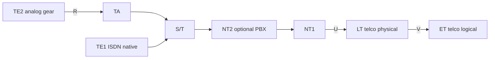

#### ISDN vs ADSL

| | ISDN | ADSL (as taught) |
|--|------|------------------|
| Service | Two **voice** channels **or** one **128 kbps** data channel | **Data-only** line |
| Power | Needs **local power**; **dies if local power fails** | Telco copper **stays up** even when **local power fails** |

#### Advantages

- **Multiple digital channels concurrently** on **one copper pair**
- High data rate from the digital scheme: lecture cites **56 kbps**; **BRI** with **channel aggregation** (**BONDING** or **Multilink PPP**) supports **uncompressed 128 kbps** plus overhead/signaling; **PRI** up to **1920 kbps**
- **Many devices share one line** (faxes, computers, cash registers, credit-card readers); information is **routed to the proper destination**
- **Call setup ~2 seconds** vs **30–60 seconds** for analog modems
- Ringing is not an **in-band ring-voltage** on the B channel: the network sends a **digital packet on a separate channel** (**out-of-band**). That **does not disturb** established connections, **takes no B-channel bandwidth**, and makes setup **fast**

#### Disadvantages

- **More costly** than ordinary telephony / landlines
- Providers and users need **special dedicated Digital Services** (extra cost)

#### Security issues (ISDN vs cable / DSL / T1)

On the **physical medium**, **eavesdropping a POTS landline with dial-up modems is physically easier** than spying on newer media: **lower data rate** suits **homemade electronics**, and some newer protocols include **encryption** that **hinders line tapping**.

The lecture’s view: **most attacks now are logical**, not crouching under service boxes at night. Attackers **hack ISP systems or customer machines** (cable/DSL modem or an **unpatched desktop**) by sending **IP packets from far away**. Those attacks are **mostly orthogonal to the medium**. Logical attacks let the attacker try **millions of targets from a basement**, instead of weather, cats, and the chance a neighbor calls the police.

**Physical spying still exists** but is for **specific targets** — the attacker is **after you personally**. Hardening a home network against a **dedicated** attacker is **hard**: think **TEMPEST**, or watching display/keyboard **through a window** with a **telescope** and **high-FPS camera** to record a typed password from about **200 m**.

**Advice for DSL, T1, cable, ISDN:** **choose the ISP** with a **good security reputation**, especially for the **modem they provide** — that matters **more than the physical medium**. **Never do sensitive work over the Internet** without **logical protection such as HTTPS**.

### Key terms

| Term | Meaning in this lecture |
|------|-------------------------|
| ISDN | ITU/CCITT integrated digital voice/data network on phone copper (and other media) |
| B channel | Bearer channel, typically 64 kbps (sometimes 56), carries user voice/data |
| D channel | Delta/data channel for signaling and control (16 kbps BRI, 64 kbps PRI) |
| BRI / 2B+D | Basic Rate Interface, 144 kbps, individual users |
| PRI / 23B+D / 30B+D | Primary Rate, T1-like 1.536 Mbps or E1-like 1.984 Mbps |
| B-ISDN | Broadband ISDN on fiber, 155–622 Mbps and beyond |
| Bearer / teleservice / supplementary | OSI 1–3 network functions; OSI 4–7 user services; add-ons such as Centrex and CLIP |
| TE1, TE2, TA, NT1, NT2 | Native ISDN terminal, legacy terminal, adapter, customer NT, optional PBX |
| Out-of-band signaling | Setup packets on D, not ring voltage on the user channel |
| HTTPS | Example of the logical protection the lecture says to use on any medium |

### Lecture takeaways

- ISDN digitized the local loop: **B channels for payload, D for signaling**, BRI for homes, PRI for sites that need T1/E1-scale bundles.
- Digital operation **could** have made security easier, but ISDN was **rolled out with little security design**.
- Operational wins: shared pair, ~2 s setup, out-of-band signaling, device sharing; costs and special telco service are the downsides.
- Versus ADSL: ISDN can carry voice; ADSL is data-only and often **survives local power loss**.
- Security punchline: **don’t fetishize the medium**. Pick a **reputable ISP/modem**, assume **logical IP attacks**, and protect sensitive use with **HTTPS** (and similar).

---

# M28: Stream Control Transmission Protocol (SCTP)

**Source:** https://www.youtube.com/watch?v=a277VGgcYi0
**Instructor / expert:** Dr. Sunil Kumar, Department of Electrical and Computer Engineering, Punjab Agricultural University, Ludhiana. Course coordinator: Dr. Maninder Singh, Professor and Dean of Academic Affairs, Thapar University, Patiala.

### Learning objectives

- Place SCTP as a **reliable, message-oriented** transport between UDP and TCP, aimed at telephony signaling over IP.
- Explain **multistreaming** (association vs TCP’s one stream) and **multihoming** (multiple IP addresses, failover not load-share in current implementations).
- Number data with **TSN**, **SI**, and **SSN**; contrast SCTP **packets/chunks** with TCP **segments**.
- Sketch the **12-byte general header**, chunk layout, and the **four-way handshake** (INIT, INIT ACK, COOKIE ECHO, COOKIE ACK).

### Core concepts

**Stream Control Transmission Protocol (SCTP)** is a **new reliable, message-oriented transport-layer protocol**. In the Internet suite it sits **between application and network**, like TCP and UDP.

It was designed for **recent Internet applications** that need **more sophisticated service than TCP**:

| Application (lecture) | Role |
|------------------------|------|
| **IUA** | ISDN over IP |
| **M2UA**, **M3UA** | Telephony signaling |
| **H.248** | Media Gateway Control |
| **H.323** | IP telephony |
| **SIP** | IP telephony |

SCTP is said to provide the **enhanced performance and reliability** those apps need.

#### UDP vs TCP vs SCTP

**UDP** is **message-oriented**: a process hands UDP a message, which is encapsulated in a **user datagram**. **Message boundaries are conserved**; messages are independent — desirable for **IP telephony** and **real-time data**. UDP is **unreliable**: the sender cannot know fate of messages; they can be **lost, duplicated, or reordered**. UDP also **lacks congestion control and flow control**.

**TCP** is **byte-oriented**: messages become a **byte stream** sent in **segments**; **no message boundaries**. TCP is **reliable**: duplicates detected, lost segments **resent**, bytes delivered **in order**, with **congestion and flow control**.

**SCTP combines the best of both:** **reliable and message-oriented**. It **preserves message boundaries** and still detects **lost, duplicate, and out-of-order** data, with **congestion and flow control**, plus **innovative features** neither UDP nor TCP has.

#### Services offered to applications

**Process-to-process communication.** SCTP uses **well-known ports in the TCP port space**. Extra ports listed:

| Protocol | Port(s) in the lecture |
|----------|-------------------------|
| IUA | **9901** (transcript “90”; IETF IUA well-known port) |
| M2UA | **2904** |
| M3UA | **2905** |
| H.248 | **2949** |
| H.323 | **1718, 1719, 1720** (transcript also garbles “11720”) |
| SIP | **5060** |

**Multiple streams.** A TCP connection is **one stream**; a **loss anywhere blocks the rest** — acceptable for text, bad for **real-time audio/video**. SCTP allows **multistream service** in each connection, called an **association**. If one stream blocks, **others still deliver**. Analogy: **highway lanes** (regular traffic vs carpool).

**Multihoming.** TCP uses **one source IP and one destination IP** even if a host is multihomed. An SCTP association lets each end **define multiple IP addresses**. If **one path fails**, another interface continues — **fault tolerance** for **real-time playback** such as Internet telephony. Example: client on two LANs, server on two networks → **four IP pairs**, but **current implementations** use **only one pair for normal communication**; the alternative is **failover only**. **SCTP does not currently allow load sharing** across paths. An association **allows multiple IPs per end**.

**Full-duplex communication.** Like TCP: data both ways at once; each end has **send and receive buffers**.

**Connection-oriented service.** Like TCP, but the connection is an **association**. Site A and site B: **establish association**, **exchange data both ways**, **terminate**.

**Reliable service.** Like TCP, **acknowledgements** check safe arrival (error control is pointed to, not fully worked in this lecture).

#### Features: TSN, SI, SSN, packets vs segments

**Transmission Sequence Number (TSN).** TCP’s data unit is a **byte**, numbered with a **sequence number**. SCTP’s data unit is a **data chunk**, which **may or may not** be 1:1 with an application message because of **fragmentation**. Transfer is controlled by numbering **chunks**. **TSN** plays TCP’s sequence-number role: **32 bits**, **randomly initialized in 0 … 2³²−1**. Every data chunk **must carry its TSN** in its header.

**Stream Identifier (SI).** TCP: one stream per connection. SCTP: **several streams per association**. Each stream needs a **16-bit SI starting from 0**. Every data chunk **carries SI** so it can be placed in the right stream.

**Stream Sequence Number (SSN).** Delivery is **to the proper stream, in order**. Besides SI, each data chunk in a stream has an **SSN** to order chunks **inside that stream**.

**Packets.** TCP **segments** mix data bytes with **six header flags**. SCTP is different: **data chunks** and **control chunks**; **several of each can share one packet**. An SCTP **packet plays the role of a TCP segment**.

Differences the lecture lists:

| TCP segment | SCTP packet |
|-------------|-------------|
| Control is **in the header** | Control is **control chunks** of several types |
| Data is **one entity** | Several **data chunks**, possibly **different streams** |
| Optional **options** field | **No options field**; new features = **new chunk types** |
| Mandatory header **20 bytes** | General header **12 bytes** |
| Sequence number in header | **TSN lives in each data-chunk header** |
| ACK and window in header | ACK and window in **control chunks** |
| Header length (HL) needed because options vary | **Fixed 12-byte** header, no HL |
| Urgent pointer | **None** in SCTP |
| Checksum **16 bits** | Checksum **32 bits** |
| Connection ID = **IP + ports** | **Multihoming** ⇒ **verification tag** identifies the association |
| One sequence number = first data byte | Several chunks ⇒ **TSN / SI / SSN** per data chunk |
| Some **control segments consume a sequence number** | **Control chunks never use TSN, SI, or SSN** — those three belong **only to data chunks**, not the whole packet |

Control and data travel in **separate chunks**. An association sends **many packets**; a packet may hold **several chunks**; chunks may belong to **different streams**.

**Worked packing example.** Process A sends **11 messages** to B on **three streams**: first **four** in stream 0, next **three** in stream 1, last **four** in stream 2. Assume each message fits **one data chunk** (no fragmentation) and the process delivers **stream 0, then 1, then 2**. Network allows **only three data chunks per packet** → **four packets**:

- Stream 0 chunks: packet 1 and part of packet 2
- Stream 1: rest of packet 2 and packet 3
- Stream 2: rest of packet 3 and packet 4

Each data chunk needs **three identifiers**: **TSN** (cumulative, for **flow and error control**), **SI** (which stream), **SSN** (order **in that stream**, starting at **0 per stream**).

**Acknowledgements.** TCP ACKs are **byte-oriented** (sequence numbers). SCTP ACKs are **chunk-oriented** (they refer to **TSN**). TCP control-only segments still use seq/ACK (e.g. **SYN** needs **ACK**). SCTP **control chunks have no TSN**; they are **acked by another control chunk of the right type** — **INIT** by **INIT ACK**. **No sequence/ACK number is needed** for that. **SCTP acknowledgement numbers ack only data chunks**; control chunks ack **other control chunks** if needed.

#### Packet format

Mandatory **12-byte general header** plus a **variable-length set of chunks**. **Control chunks** maintain the association; **data chunks** carry user data. In a packet, **control chunks come before data chunks**.

**General header** — four fields; defines endpoints, binds the packet to an association, and protects integrity **including the header**:

| Field | Size | Role |
|-------|------|------|
| Source port | 16 bits | Sending process |
| Destination port | 16 bits | Receiving process |
| Verification tag | (association ID) | Matches packet to **this** association; stops a packet from a **previous** association being accepted; **repeated in every packet**; **separate tag each direction** |
| Checksum | 32 bits | **CRC-32** (increased from TCP’s 16 bits to allow CRC-32) |

**Chunks** share a layout: first **three fields common**, then type-specific information. Information must be a **multiple of 4 bytes**; else **padding**. Chunks end on a **32-bit boundary**.

| Common field | Size | Role |
|--------------|------|------|
| Type | 8 bits | Up to **256** chunk types; few defined, rest reserved |
| Flags | 8 bits | Meaning **depends on type** |
| Length | 16 bits | **Total chunk size in bytes**, including type, flags, and length |

#### Association: four-way handshake

SCTP is connection-oriented; the connection is an **association** to emphasize **multihoming**. Establishment is a **four-way handshake**. Normally a **client** initiates toward a **server** that is **prepared to receive** associations (like TCP listen).

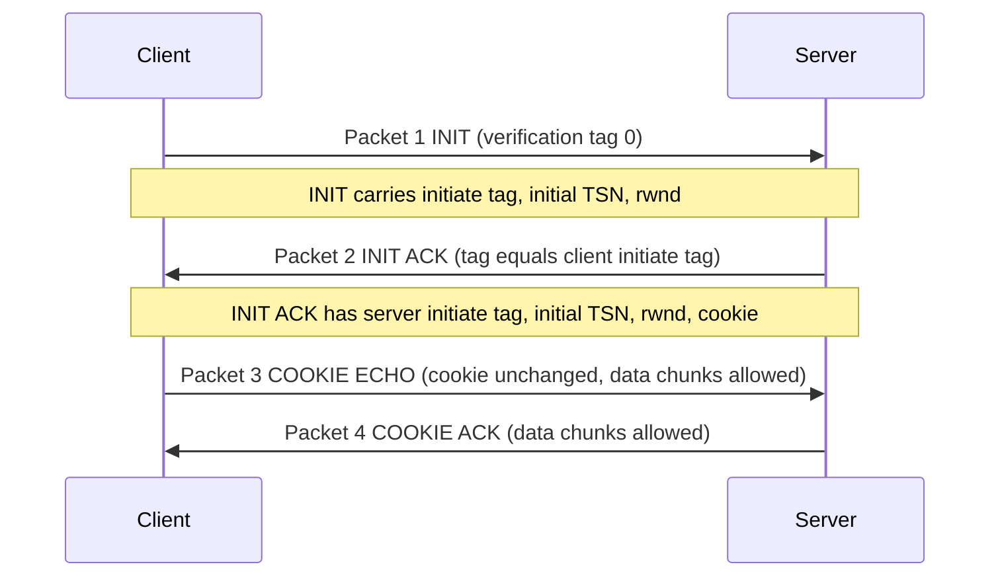

**Normal steps**

1. **Client → server: INIT chunk.** General-header **verification tag is 0** (none defined yet client→server). INIT includes an **initiate tag** for packets **server→client**, the **initial TSN** this direction, and advertises **rwnd** (receive window). rwnd is normally in a **SACK** chunk; it is sent here because SCTP allows **data chunks in packets 3 and 4**, so the server must know **client buffer size**. **No other chunks** with the first packet.
2. **Server → client: INIT ACK.** Verification tag = **initiate tag from INIT**. Chunk sets the tag for the **other direction**, **initial TSN** server→client, and **server rwnd** so the client may send a **data chunk in packet 3**. INIT ACK also carries a **cookie** defining the **server’s state at that moment**.
3. **Client → server: COOKIE ECHO.** Simple chunk that **echoes the cookie unchanged**. **Data chunks are allowed** in this packet.
4. **Server → client: COOKIE ACK**, acknowledging COOKIE ECHO. **Data chunks allowed** here too.

(The lecture says cookie use would be discussed “shortly” and then ends after describing the echo; the taught fact is that the cookie **captures server state** and is **returned unmodified**.)

### Key terms

| Term | Meaning in this lecture |
|------|-------------------------|
| SCTP | Reliable, message-oriented transport combining UDP’s boundaries with TCP’s reliability, plus streams and multihoming |
| Association | SCTP’s name for a connection (multihoming-aware) |
| TSN | 32-bit transmission sequence number on **data chunks** |
| SI / SSN | Stream identifier and per-stream sequence number on data chunks |
| Chunk | Control or data block; several per packet; control before data |
| Verification tag | Per-direction association identifier (needed because of multihoming) |
| CRC-32 | 32-bit packet checksum in the 12-byte general header |
| INIT / INIT ACK / COOKIE ECHO / COOKIE ACK | Four-way handshake chunks |
| rwnd | Advertised receive window (in INIT/INIT ACK so data can ride packets 3–4) |

### Lecture takeaways

- SCTP exists because **SS7-style signaling and IP telephony** need **message boundaries and reliability together**, which neither UDP nor TCP fully gives.
- An **association** can carry **many streams** (head-of-line blocking on one stream does not freeze the others) and **many IPs** (failover; **not** load-sharing in “current” implementations).
- Numbering is **chunk-based**: **TSN** globally, **SI+SSN** per stream; **control never consumes TSN**.
- The on-wire unit is a **packet**: 12-byte header (ports, verification tag, CRC-32) plus padded chunks.
- Setup is **four-way** with a **cookie**, and **user data may already appear** in the third and fourth packets.

---

# M29: ATM Network Security Protocol

**Source:** https://www.youtube.com/watch?v=JdRurgWuHvQ
**Instructor / expert:** Dr. Lal Chand, Department of Computer Engineering, Punjabi University, Patiala. Course coordinator: Dr. Maninder Singh, Professor and Dean of Academic Affairs, Thapar University, Patiala.

### Learning objectives

- Define ATM as **asynchronous time-division multiplexing** of **fixed 53-byte cells** (5-byte header + 48-byte payload) on a **SONET/ISDN-style** backbone, with a VC set up **before** data.
- Decode **UNI vs NNI** headers (GFC, VPI, VCI, PT/EFCI/AUU, CLP, HEC) and name ABR/CBR/UBR/VBR.
- List ATM Forum–style security goals (confidentiality, AAL integrity, signaling signatures, availability functions) and ATM-specific threats (**VC stealing**, traffic analysis).
- Recite QoS/traffic parameters (PCR, SCR, CLR, CTD, CDV, BT/MBS, MCR), CAC, and the lecture’s ATM **disadvantages**.

### Core concepts

**Asynchronous Transfer Mode (ATM)** is a **switching technique** for telecommunication networks that uses **asynchronous time-division multiplexing** to encode data into **small fixed-size cells**. That differs from **Ethernet or the Internet**, which use **variable-size packets/frames**. ATM is called the **core protocol over the SONET backbone of ISDN**.

#### Why cells, not variable packets

ATM was designed with **cells** because **voice** is packetized and must **share a network with bursty data**. However small the voice packets, they would otherwise meet **full-size data packets** and suffer **maximum queueing delay**. So **all data units should be the same size**.

Fixed cells can be **switched in hardware** without delays of **routed frames and software switching** — why some people thought ATM was the key to the **Internet bandwidth problem**.

ATM **creates fixed routes between two points before transfer**, unlike **TCP/IP**, where packets may take **different routes**. That makes **usage accounting** easier, but an ATM network is **less adaptable to a sudden traffic surge**.

ATM provides **data-link services** on **OSI layer-1 physical links**. It behaves like a mix of **small packet switching and circuit switching**, suited to **real-time low-latency** traffic (**VoIP and video**) and **high-throughput** transfers (files). A **virtual circuit (connection)** must exist before endpoints exchange data.

#### Bit-rate service classes

| Class | Lecture meaning |
|-------|-----------------|
| **Available bit rate (ABR)** | **Guaranteed minimum** capacity; may **burst higher** when the network is idle |
| **Constant bit rate (CBR)** | **Fixed** rate, **steady stream** — analogous to a **leased line** |
| **Unspecified bit rate (UBR)** | **No throughput guarantee**; for **delay-tolerant** apps such as file transfer |
| **Variable bit rate (VBR)** | **Specified throughput** but **not sent evenly** — popular for **voice and video conferencing** |

(The transcript’s first class is unnamed “bit rate provides a guaranteed minimum”; that is the **ABR** definition in this list.)

#### ATM cell structure

An ATM cell is a **5-byte header** plus a **48-byte payload**. Two formats: **UNI (User–Network Interface)** and **NNI (Network–Network Interface)**. **Most links use UNI**.

| Field | Size | Notes |
|-------|------|--------|
| **GFC** (Generic Flow Control) | 4 bits (UNI) | Default **0**. Intended for **local flow control / sub-multiplexing** so several terminals can share one network connection, like **two ISDN phones on one BRI**. **All four GFC bits must be zero by default** |
| **VPI** (Virtual Path Identifier) | **8 bits UNI** / **12 bits NNI** | Path identifier |
| **VCI** (Virtual Channel Identifier) | **16 bits** | Channel identifier |
| **PT** (Payload Type) | **3 bits** | Special cell kinds |
| **CLP** (Cell Loss Priority) | **1 bit** | Which cells to drop first in congestion |
| **HEC** (Header Error Control) | **8 bits** | CRC polynomial **x⁸ + x² + 1** |

**PT field (user vs management)**

- **PT bit 3 (MSB):** **1** = **network management** cell; **0** = **user data** cell, then:
  - **PT bit 2:** **Explicit Forward Congestion Indication (EFCI)** — **1** = congestion experienced
  - **PT bit 1:** **AUU** (ATM user-to-user) bit, used by **AAL5** to mark **packet boundaries**
- If MSB of PT is **1** (management), the other two bits distinguish: **network-management segment**, **network-management end-to-end**, **resource management**, and **reserved**.

ATM uses PT for **OAM** (Operations, Administration, and Management) cells and to **delineate packets** in some **ATM Adaptation Layers (AAL)**.

Several link protocols use **HEC** to drive a **CRC-based framing** algorithm that **finds cell boundaries with no extra overhead** beyond header protection. The 8-bit CRC **corrects single-bit header errors** and **detects multi-bit header errors**. On multi-bit errors, the **current and subsequent cells are dropped** until a cell with a **good header** is found.

**NNI** matches UNI except **GFC is reallocated to VPI**, extending VPI to **12 bits**. The lecture then claims a single NNI interconnection can address almost **2¹⁶ VPs** of almost **2¹⁶ VCs** each (field sizes taught are **12-bit VPI** and **16-bit VCI**); **some VP/VC numbers are reserved**.

#### ATM network interfaces

- **User-to-network interface** — public and private
- **Network-to-network / network-to-node interface** — **private NNI**, **public NNI**
- **Data Exchange Interface (DXI)** between **packet routers** and **ATM DSUs** (Digital Service Units)

**ATM Adaptation Layer (AAL):** how to **break application messages into cells**.

**ATM layer:** transmission, switching, reception, **congestion control**, **buffer management**, **cell-header generation/removal** at source/destination, **reset connection identifiers for the next hop** at a switch, **cell address translation**, **sequential delivery**.

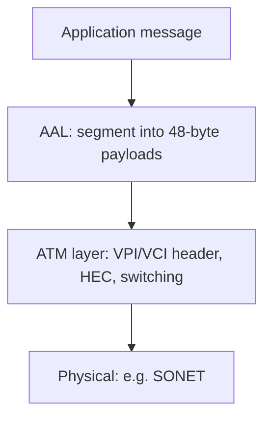

#### ATM Forum security services

**Data confidentiality** — protect business data from unauthorized persons; data available **only to intended, authorized** parties.

**Data integrity and authentication** — accuracy and consistency; data **not changed by unauthorized persons**. **AAL frames** are protected by appending a **cryptographic checksum**. **Reordering protection** is possible by putting a **sequence number into AAL frames before** that checksum.

**Signaling protection** — signaling may be **authenticated and integrity-protected** by a **digital signature** in an **information element (IE)**, especially if an **SME (security message exchange)** protocol is used. **SETUP and CONNECT** are protected by signing **IE fields specified by SME**. Protection is still offered for other messages (**RELEASE, STATUS, RESTART**) and for SETUP/CONNECT **if SME is not used**, by signing **part of the IE**.

**Availability** — the lecture restates integrity language here, then lists what an **ATM security system should provide**:

| Function | Meaning |
|----------|---------|
| Verification of identities | Establish and verify claimed identity of any **actor** |
| Controlled access and authorization | No access to information/resources if **not authorized** |
| Protection of confidentiality | Stored and communicated data stay confidential |
| Protection of data integrity | Integrity of stored and communicated data |
| Strong accountability | An entity **cannot deny** its actions and their effects |
| Activities logging | Retrieve security-activity info in network elements, **traceable to individuals/entities** |
| Alarm reporting | Alarms for **adjustable, selective** security-related events |
| Audit | After violations, analyze **security-relevant logs** |
| Security recovery | Recover from **successful or attempted** breaches |
| Security management | Manage the services derived from the above; **foundations of the security system**. If the system **cannot recover** and **stops providing** security services, it is **no longer secure**. Security services and security information must themselves be **managed securely** |

#### Threats to ATM

Typical threats: **eavesdropping, spoofing, service denial, VC stealing, traffic analysis**. **VC stealing and traffic analysis happen only in ATM networks** (as taught).

**Eavesdropping** — tap the media and read data. Common. Because many ATM nets use **fiber**, people may **wrongly think** tapping is hard.

**Spoofing** — impersonate a user to a third party to use or destroy the victim’s resources. May need **PDU-manipulation tools** and sometimes **special access** (e.g. **superuser on Unix**). Because networks interconnect via the **Internet**, it is **impossible to prevent** a hacker getting that access or even **tracing** who has it. ATM in the **public domain** is subject to this.

**Service denial** — ATM is **connection-oriented**; a **VC** is managed by **signals**. Setup uses **SETUP**; teardown uses **RELEASE** or **DROP PARTY**. If an attacker sends **RELEASE or DROP PARTY** to **any intermediate switch** on the VC, the VC **disconnects**. Doing that **frequently** disturbs communication and **disables QoS**. Combined with eavesdropping, the attacker can **block one user from another entirely**.

**Stealing of VCs** — if **two switches compromise**, they can steal a VC. Example: **VC1** (user U1) and **VC2** (user U2) both traverse switches **A** and **B**. **A** switches U1’s cells A→B onto **VC2**; **B** switches them back to **VC1**. Switches forward on **VCI/VPI**; A and B **alter those fields back and forth**. Intermediate switches **will not notice** and treat cells as authentic VC2. In a public packet network U1 might gain little; in ATM with **guaranteed QoS**, U1 can steal a **higher-quality channel** they are **not entitled to**, and can gain more if **users pay for communication**. **U2 is hurt**. Switch compromise looks unlikely if **one organization** owns the net; in **ATM internetworking**, cells traverse **different ATM networks**, so two switches **compromising is much easier**.

**Traffic analysis** — infer information from **volume, timing, and parties** of a VC. Volume and timing remain even if **data is encrypted**; **source and destination** often come from the **cell header in the clear** plus **routing-table knowledge**. Related: **covert channels** — encode information in **timing, volume, VCI, or even session keys** to leak data without being monitored. These two “won’t normally happen,” but may in **stringent-security** environments.

#### Traffic management and QoS parameters

To deliver **guaranteed QoS on demand** while **maximizing utilization**, ATM needs **traffic management** almost everywhere: **signaling, routing, resource allocation, policing**.

Users can specify, at connection setup:

| Parameter | Meaning |
|-----------|---------|
| **PCR** (Peak Cell Rate) | Maximum instantaneous rate; inverse of **minimum inter-cell interval** (bursty traffic varies) |
| **SCR** (Sustained Cell Rate) | Average rate over a **long interval** |
| **CLR** (Cell Loss Ratio) | Percent of cells **lost to error or congestion** and not delivered. **CLP=1** cells are discarded first in congestion; loss of **CLP=0** is more harmful. CLR can be specified **separately** for CLP=1 and CLP=0 |
| **CTD** (Cell Transfer Delay) | Delay from network **entry to exit**: propagation, queueing at switches, service times |
| **CDV** (Cell Delay Variation) | Variance of CTD; high variation ⇒ **larger buffers** for delay-sensitive **voice/video** |
| **BT** (Burst Tolerance) | Maximum burst that can be sent at **peak rate**; **bucket size** of the **leaky-bucket** algorithm that **controls traffic entering the network**. Arriving cells go in a bucket **drained at SCR**; **MBS (Maximum Burst Size)** is the max **back-to-back cells at PCR** |
| **MCR** (Minimum Cell Rate) | Minimum rate **desired by a user** |

The **first six** were originally in **UNI version 3**.

**Traffic contract.** For guaranteed QoS, a contract at setup contains a **connection traffic descriptor** and a **conformance definition**. **Not every VC needs specified QoS**: if only specified-QoS connections were supported, a **large fraction of resources would be wasted** when connections **do not use their full contract**. **Unspecified QoS** can be supported **best-effort**, which is **enough for most existing data applications**.

**Congestion control.** Congestion is when **ingress to a link exceeds egress capacity**. Goal: **good throughput and delay** with **fair allocation**. One avoidance method: accept a new connection at setup **only if resources suffice** for acceptable QoS — **Connection Admission Control (CAC)**, required where QoS **must be guaranteed**.

#### Disadvantages of ATM (as taught)

ATM was **not widely accepted**, though **some phone companies still use it in backbone networks**. **Expense, complexity, and lack of interoperability** blocked prevalence.

| Drawback | Lecture detail |
|----------|----------------|
| **Expense** | Even a **moderate ATM switch** costs far more than **inexpensive LAN hardware**; ATM **NICs** cost much more than Ethernet NICs |
| **Connection-setup latency** | Connection-oriented paradigm: **setup and teardown** of a distant VC can take **longer than using it** |
| **Cell tax** | Headers impose a **10% tax** on all data; Ethernet’s comparable tax is **1%** |
| **No efficient broadcast** | Connection-oriented nets are sometimes **NBMA (Non-Broadcast Multiple Access)**; hardware **lacks broadcast/multicast**. Broadcast is **simulated** by an application **copying data to each computer** — **inefficient** |
| **Complexity of QoS** | Spec is **cumbersome**; many implementations **do not support the full standard** |
| **Assumption of homogeneity** | Designed as a **single universal** system; **minimal provision** to interoperate with other technologies |

### Key terms

| Term | Meaning in this lecture |
|------|-------------------------|
| ATM cell | 5-byte header + 48-byte payload, hardware-switched |
| UNI / NNI | User–network vs network–network cell formats (GFC vs extra VPI bits) |
| VPI / VCI | Virtual path and channel IDs used for forwarding (and for VC-stealing attacks) |
| HEC | 8-bit header CRC; framing plus single-bit correct / multi-bit drop |
| AAL / AAL5 | Adaptation layer; AAL5 uses the AUU PT bit for packet boundaries |
| ABR / CBR / UBR / VBR | ATM bit-rate service classes |
| VC stealing | Compromised switches swap VPI/VCI to ride another user’s QoS |
| CAC | Connection admission control at setup for guaranteed QoS |
| Cell tax | 10% header overhead vs ~1% on Ethernet |
| NBMA | Non-broadcast multiple access — ATM has no native broadcast |

### Lecture takeaways

- ATM’s security and performance story starts from **fixed cells and pre-established VCs** on a **SONET-class** fabric — good for **voice/video latency**, awkward for **surges** and **broadcast**.
- Header fields (**VPI/VCI, PT, CLP, HEC**) are both the switching mechanism and the **attack surface** (clear-text parties, CLP drops, false RELEASE).
- Forum-style security is **confidentiality, AAL checksums/sequence numbers, signed signaling, and a full management lifecycle** (log, alarm, audit, recover).
- Unique ATM threats taught here: **VC stealing** between colluding switches and **traffic/covert-channel analysis** despite encryption.
- QoS is a **traffic contract** (PCR/SCR/CLR/CTD/CDV/BT/MCR) plus **CAC**; unspecified QoS exists so the network is not wasted.
- The closer is practical: ATM **lost the LAN** to cheaper, simpler, more interoperable Ethernet despite remaining in some **telco backbones**.

---

# M30: Wireless Networks

**Source:** https://www.youtube.com/watch?v=MdLxztyDzck
**Instructor / expert:** Dr. Navdeep Singh, Department of Computer Engineering, Punjabi University, Patiala. Course coordinator: Dr. Maninder Singh, Professor and Dean of Academic Affairs, Thapar University, Patiala.

### Learning objectives

- Define a wireless network as radio (OSI physical layer) used to avoid cabling, and classify **WPAN, WLAN, WMAN, WWAN**.
- Describe Bluetooth **IEEE 802.15**: piconet/scatternet, 2.4 GHz ISM FHSS/GFSK, baseband/LMP/L2CAP, and the 72/54-bit frame.
- Explain IEEE 802.11 BSS/ESS, station mobility, **DCF (CSMA/CA)** vs **PCF**, why CSMA/CD fails, 802.11 MAC frame/types, and **hidden vs exposed station** (RTS/CTS).
- Outline WiMAX (IEEE 802.16), WWAN microwave/cellular (cells, BSC/MSC), and satellite networks as taught.

### Core concepts

The stated aims are to **identify basic topologies and their variations** and to **choose an appropriate topology** for a network plan. A **wireless network** is any computer network that uses **wireless data connections** between nodes. Homes, telecom networks, and enterprises use it to **avoid the cost of cabling** a building or linking equipment rooms. Wireless telecom is generally **radio**, implemented at the **OSI physical layer**.

Four categories: **Wireless PAN, Wireless LAN, Wireless MAN, Wireless WAN**.

#### Wireless PAN (Personal Area Network)

WPANs interconnect devices in a **relatively small area**, generally **within a person’s reach**. Examples: **Bluetooth radio** and **infrared light** linking a **headset to a laptop**.

##### Bluetooth

Bluetooth transfers data between electronic devices over a **short distance** compared with other wireless modes. It **removes cords, cables, and adapters**. A Bluetooth LAN is an **ad hoc** network formed **spontaneously**: gadgets find each other and form a **piconet**. It can connect to the **Internet** if one gadget has that capability.

The name comes from **Harald Bluetooth (Harald Blåtand)**, king of Denmark who united **Denmark and Norway**; *Blåtand* translates as Bluetooth. Today Bluetooth implements **IEEE 802.15**. Protocols let devices **find and connect (pairing)** and **securely transfer data**.

**Two network types: piconet and scatternet.**

A **piconet** is a small net of **up to eight stations**: **one primary (master)** and the rest **secondaries (slaves)**. All secondaries **synchronize clocks and hopping sequence** with the primary. **Only one primary**. Communication is **one-to-one or one-to-many**. A piconet can have a **maximum of seven active secondaries**; **additional secondaries** (the lecture says **eight**) can be in the **parked state**: **synchronized with the primary but not communicating** until moved out of park. Because only **eight stations can be active**, activating a parked station means an **active station must park**.

A **scatternet** combines piconets: a **secondary in one piconet can be primary in another**, receiving from the first primary and forwarding to secondaries in the second piconet. A station can be a **member of two piconets**.

**Radio:** **2.4 GHz ISM** band, **79 channels of 1 MHz**. Physical layer: **frequency-hopping spread spectrum (FHSS)** to avoid interference. Bluetooth **hops 1600 times per second** (modulation frequency changes 1600/s). Bits map with **GFSK** (FSK with **Gaussian bandwidth filtering**): bit **1** = deviation **above** the carrier, bit **0** = deviation **below**. Carrier frequencies: **Fc = 2402 + n MHz** for **n = 0 … 78**. Channel 0 uses **2402 MHz**, channel 1 **2403 MHz** (transcript “242/243 MHz” drops a zero).

**Stack (as taught)**

- **Link control / baseband** — analogous to a MAC sublayer but with physical-layer elements: how the **master controls time slots** and how slots **group into frames**.
- **Link Manager (LMP)** — logical channels, **power management, pairing, encryption, QoS**; sits **below the Host Controller Interface (HCI)**. Typically protocols **below HCI run on the Bluetooth chip**, **above HCI on the host device**.
- **L2CAP** (Logical Link Control and Adaptation Protocol) — **variable-length messages** and **reliability if needed**. Users include **SDP (Service Discovery Protocol)** to locate services, and **RFCOMM** which **emulates a PC serial port** (keyboard, mouse, modem).
- **Applications / profiles** — vertical slices of the stack for a purpose (e.g. **headset profile**). Profiles may include L2CAP if they send packets, or **skip L2CAP** for a **steady flow of audio samples**.

**Bluetooth frame**

| Field | Size | Content |
|-------|------|---------|
| **Access code** | 72 bits | Sync bits and **primary identifier**, to distinguish one piconet’s frames from another |
| **Header** | 54 bits | A repeated pattern; **six subfields** (see below). Implemented as **three identical 18-bit sections** |
| **Payload** | 0–2740 bits | Upper-layer data or control |

Header subfields:

| Subfield | Bits | Role |
|----------|------|------|
| Address | 3 | Up to **7 secondaries**; **0 = broadcast** from primary to all secondaries |
| Type | 4 | Type of upper-layer data |
| F (flow) | 1 | Set ⇒ device **cannot receive more** (buffer full) |
| A (ACK) | 1 | **Stop-and-wait ARQ**; one bit suffices |
| S (seq) | 1 | Stop-and-wait **sequence**; one bit suffices |
| HEC | 8 | Checksum over each **18-bit header section** |

The header’s **three identical 18-bit copies** are compared **bit by bit**; if bits differ, **majority vote**. That is **forward error correction**. **Double error control** is needed because radio is **very noisy**. **No retransmission in this sublayer**.

**Applications listed:** wireless **phone headset** (phone in a bag; reduces **radiation to the head**); **PDA/PC/laptop sync**; send email from a laptop **via the phone after a flight**; **wireless mouse and keyboard**; phone **alert when the laptop gets mail**; **find a printer** from a laptop.

**Key Bluetooth features:** less complication, **less power**, **cheaper**, **robustness**.

#### Wireless LAN

WLANs are the **most important access-network technologies** on the Internet. The most popular is **IEEE 802.11**, also known as **Wi-Fi**.

IEEE 802.11 defines two service sets:

**Basic Service Set (BSS)** — building block: stationary or mobile wireless stations plus an **optional central base station**, the **access point (AP)**.

- BSS **without AP**: **standalone**, cannot send data to another BSS — **ad hoc**. Stations **locate one another** and agree to form a BSS.
- BSS **with AP**: **infrastructure** network.

When **multiple BSSs** connect: stations in range can talk **without an AP**, but communication **between stations in different BSSs usually goes via two APs** — like **cellular**, if each BSS is a **cell** and each AP a **base station**. A mobile station can **belong to more than one BSS at once**.

**Extended Service Set (ESS)** — interconnection of BSSs (implied by the three mobility types).

**Station types by mobility (IEEE 802.11)**

| Type | Movement |
|------|----------|
| **No-transition** | Stationary, or moving **only inside one BSS** |
| **BSS-transition** | From one BSS to another, still **inside one ESS** |
| **ESS-transition** | From one ESS to another; **IEEE 802.11 does not guarantee continuous communication** during the move |

**MAC: DCF and PCF**

IEEE 802.11 defines two MAC sublayers: **Distributed Coordination Function (DCF)** and **Point Coordination Function (PCF)**.

**DCF** uses **CSMA/CA** (carrier-sense multiple access with **collision avoidance**). WLANs **cannot implement CSMA/CD** for three reasons:

1. Collision detection would require **sending and receiving collision signals at once** → **costly stations** and **more bandwidth**.
2. Collisions may be **missed** because of the **hidden-station problem**.
3. **Distance and fading** can hide a collision at the far end.

**PCF** is **optional**, **infrastructure only** (not ad hoc), implemented **on top of DCF**, mostly for **time-sensitive** traffic. It is **centralized, contention-free polling**: the **AP polls** capable stations one after another; they send data **to the AP**. To **prefer PCF over DCF**, extra interframe spaces **PIFS** and **SIFS** are defined. **SIFS** is the same as in DCF; **PIFS is shorter than DIFS**, so if a DCF station and an AP both want the medium, the **AP wins**.

**IEEE 802.11 MAC frame (nine field groups as taught)**

| Field | Size | Role |
|-------|------|------|
| Frame Control (FC) | 2 bytes | Frame type and control |
| Duration / ID | (in FC discussion) | In almost all types: **duration of transmission** used to set **NAV**; in one control frame: **frame ID** |
| Address (×4) | 6 bytes each | Meaning depends on **To DS** and **From DS** bits |
| Sequence control | | Sequence number for **flow control** |
| Frame body | 0–2312 bytes | Depends on FC type/subtype |
| FCS | 4 bytes | **CRC-32** |

**Three frame categories:** **management** (initial communication between stations and APs), **control** (channel access and acknowledgements), **data** (data and control information).

##### Hidden station problem

Station **B**’s range is one oval, **C**’s another. **C is outside B’s range and vice versa**. **A** hears **both**. If **B is sending to A**, **C** cannot hear B, thinks the medium **idle**, sends to A → **collision at A**. B and C are **hidden from each other with respect to A**. Hidden stations **reduce capacity**.

**Solution: handshake frames (RTS/CTS).** **RTS** from B reaches A **not C**. **CTS** from A (with **duration** of B→A data) reaches **both B and C** because both are in **A’s range**. **C** then **refrains** until that duration ends.

##### Exposed station problem

Inverse: **A transmits to B**. **C** has data for **D** that would **not interfere**, but **C hears A** and **refrains** — **too conservative**, wasting capacity. **RTS/CTS does not fully fix this.** C hears **RTS from A** but **not CTS from B**. C can wait for B’s CTS to reach A, then send **RTS to D**. A (sending, not receiving) may ignore it; **B might CTS**. If **A has already started data**, **C cannot hear D’s CTS** because of collision, so **C stays exposed until A finishes**.

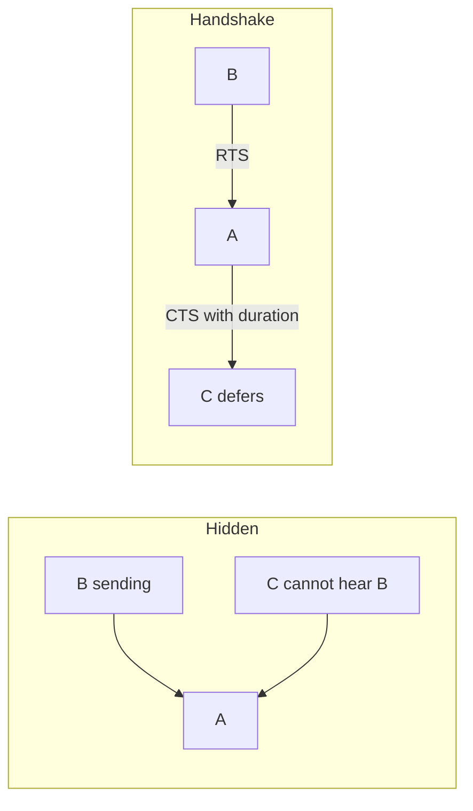

#### Wireless MAN

A **WMAN** connects several WLANs. **WiMAX** is a WMAN described by **IEEE 802.16**. It enables **wireless transmission of packets at broadband rates**, giving computers/mobiles **mobility and high-speed Internet** without cable or a **Wi-Fi hotspot**.

Implementation needs **telecom-scale infrastructure** like **GSM/CDMA**: **base stations, sectorized antennas, control centers**, and other critical parts.

Media claims of **over 30 miles** from **one base station** hold only in **ideal conditions**. Practically, **satisfactory broadband** is about **4–5 miles**; with **line of sight** up to **10 miles**. Coverage and QoS otherwise depend on **terrain and population**.

#### Wireless WAN

WWANs cover **large areas** (neighboring towns/cities): **branch offices** or **public Internet access**. Links between access points are usually **point-to-point microwave** using **parabolic dishes** on the **2.4 GHz** band, not only the directional antennas of smaller nets. A typical system has **base-station gateways, access points, and wireless bridging relays**. Other configurations are **meshes** where each AP **relays**.

Wireless is also used in **cellular telephony and satellite networks**.

**Cellular:** communication between **two mobile stations** or between a mobile and a **stationary land unit**. The provider must **locate and track** a caller, **assign a channel**, and **hand the channel from base station to base station** as the caller leaves range. Each service area is split into **cells**. Each cell has an **antenna** and a **solar- or AC-powered base station**. Base stations are controlled by a **Mobile Switching Center (MSC)** that coordinates them with the **telephone central office**: **connects calls, records call information, bills**.

**Cell size is not fixed**: high-density areas need **more, geographically smaller cells**. Once set, size is optimized to **limit adjacent-cell interference**. **Transmit power is kept low** so a cell does not interfere with others.

**Satellite network:** nodes including **satellites** providing Earth-to-Earth communication. A node may be a **satellite, earth station, or end-user terminal/telephone**. A **natural satellite (the Moon)** could relay, but **artificial satellites** are preferred so we can install electronics that **regenerate** a weakened signal. Natural satellites are also **too far**, causing **long delay**. Like cellular, satellite nets **divide the planet into cells**. They can reach **any location**, however remote — **high-quality communication for undeveloped regions without huge ground infrastructure**.

The lecture closes: topologies and variations, wireless standards and features, and advantages; **security management is deferred to the next lecture**.

### Key terms

| Term | Meaning in this lecture |
|------|-------------------------|
| WPAN / WLAN / WMAN / WWAN | Personal, local, metro, and wide-area wireless scopes |
| Piconet / scatternet | Bluetooth 1-master small net vs overlapping piconets |
| Parked state | Bluetooth secondary synced but not in the active seven |
| GFSK / FHSS 1600 hop/s | Bluetooth 2.4 GHz ISM modulation and hopping |
| BSS / ESS / AP | 802.11 building block, extended set, optional access point |
| DCF / PCF | CSMA/CA distributed access vs AP polling (PIFS < DIFS) |
| Hidden / exposed station | Collision because sender cannot hear a peer vs false deferral |
| RTS/CTS | Handshake that advertises duration so hidden nodes defer |
| WiMAX / IEEE 802.16 | Broadband WMAN |
| MSC | Mobile Switching Center in cellular |

### Lecture takeaways

- Wireless is classified by **reach**: PAN (Bluetooth 802.15), LAN (Wi-Fi 802.11), MAN (WiMAX 802.16), WAN (microwave, cellular, satellite).
- Bluetooth is a **master-driven hopped piconet** (79×1 MHz, 1600 hop/s, GFSK) with a noisy-radio frame that **votes on a triple header** instead of retransmitting at baseband.
- 802.11 infrastructure is **BSS+AP**; ad hoc is BSS without AP. MAC is **CSMA/CA**, not CD, because of cost, **hidden nodes**, and fading.
- **RTS/CTS** mitigates hidden stations; the **exposed-station** problem is left as a capacity waste the handshake does not fully solve.
- Cellular **low-power cells + MSC** and satellites **cell-ize the planet** so coverage does not require cabling every site.

---

# M31: Wi-Fi Security Protocol

**Source:** https://www.youtube.com/watch?v=Ml3_13Hn9-I
**Instructor / expert:** Prof. Yogesh Chaba, Department of Computer Engineering and IT, Guru Jambheshwar University of Science & Technology, Hisar. Course coordinator: Dr. Maninder Singh, Professor and Dean of Academic Affairs, Thapar University, Patiala.

### Learning objectives

- Distinguish **IEEE 802.11** (PHY/MAC specs) from the **Wi-Fi Alliance** brand, interoperability testing, and required **WPA/WPA2** plus **EAP**.
- Describe **FHSS vs DSSS** (chips), the 802.11 split into **PLCP/PMD**, MAC management, and **DCF (CSMA/CA)** vs **PCF**.
- Tabulate 802.11 / a / b / g / n / ac (and d, e, f, h, i, j, ad, af) with bands, modulation, rates, and ranges the lecture gives.
- Decode the 802.11 **MAC frame** and **Frame Control** bits, including the **WEP** body-encryption flag.

### Core concepts

Despite the playlist title **Wi-Fi Security Protocol**, this lecture is an introduction to **Wi-Fi technology**: architecture, **IEEE 802.11 standards**, and **frame format**. Security appears as **Alliance certification (WPA/WPA2, EAP)**, **802.11i**, and the **WEP bit** in Frame Control. Outline: Wi-Fi intro, **layered protocol architecture**, **standards**, **frame format**.

#### WLAN vs Wi-Fi vs IEEE vs Alliance

A **wireless LAN (WLAN)** is a data communication system used as an **extension or alternative to a wired LAN**. **Wi-Fi** is WLAN technology based on the **IEEE 802.11** series, issued by the **Institute of Electrical and Electronics Engineers (IEEE)**.

**IEEE does not test equipment for compliance.** The nonprofit **Wi-Fi Alliance** formed in **1999** to **establish and enforce interoperability and backward compatibility** and to **promote WLAN technology**. It restricts the **Wi-Fi brand** to 802.11-based technologies. Member manufacturers whose products follow 802.11 may mark them with the **Wi-Fi logo**.

Certification requires compliance with:

- **IEEE 802.11 radio** standards
- **WPA and WPA2** security standards
- **EAP** authentication standards

Any manufacturer building to the standard may put a **Wi-Fi logo** on the product (as stated).

#### Spread spectrum on WLANs

Most WLANs use **spread spectrum**: a **wideband RF** technique that **spreads the signal over the available bandwidth**. Two types:

**Frequency-hopping spread spectrum (FHSS)** — a **narrowband carrier** that **changes frequency in a pattern known only to transmitter and receiver**.

**Direct-sequence spread spectrum (DSSS)** — generates a **redundant bit pattern for each bit**, needing **more bandwidth**. That pattern is a **chip / chipping code**. The receiver recovers the original even if **one or more chip bits are damaged**; **statistical techniques in the radio** recover data **without retransmission**.

#### Layered protocol architecture of IEEE 802.11

IEEE 802.11 covers only the **physical layer** and **medium-access layer** of OSI.

**PHY split**

- **PLCP (Physical Layer Convergence Protocol)** — provides **Clear Channel Assessment (CCA)** (carrier sense) and a **common PHY SAP independent of transmission technology**.
- **PMD (Physical Medium Dependent)** — **modulation and encoding/decoding**.

**MAC management** supports **medium access control**, **association and reassociation** of a station to an AP, **roaming** between APs, **authentication**, **encryption**, **synchronization** with an AP, and **power management** to save battery.

**PHY modulations named**

| Technique | Lecture facts |
|-----------|----------------|
| **FHSS** | **79 channels of 1 MHz**; a **PRNG** produces the hop sequence; a **fair way to allocate the unregulated ISM band** |
| **DSSS** | **1 or 2 Mbps**; technique similar to **CDMA** |
| **OFDM** | **54 Mbps and above** in the wider **5 GHz ISM** band |
| **HR-DSSS** (high-rate DSSS) | **11 and 22 Mbps** in **2.4 GHz** |

**MAC modes**

**DCF (Distributed Coordination Function)** — **no central control**. Protocol: **CSMA/CA**. Both **physical** and **virtual** channel sensing.

- **Physical sensing:** station wants to send → senses. If **idle**, it **transmits** (does **not** sense while sending) and sends the **full frame**, which may be **destroyed at the receiver by interference**. On collision, wait a **random time** using Ethernet **binary exponential backoff**, then retry.
- **Virtual sensing:** **MACA** (Multiple Access with Collision Avoidance).

**PCF (Point Coordination Function)** — a **base station controls all activity in its cell**.

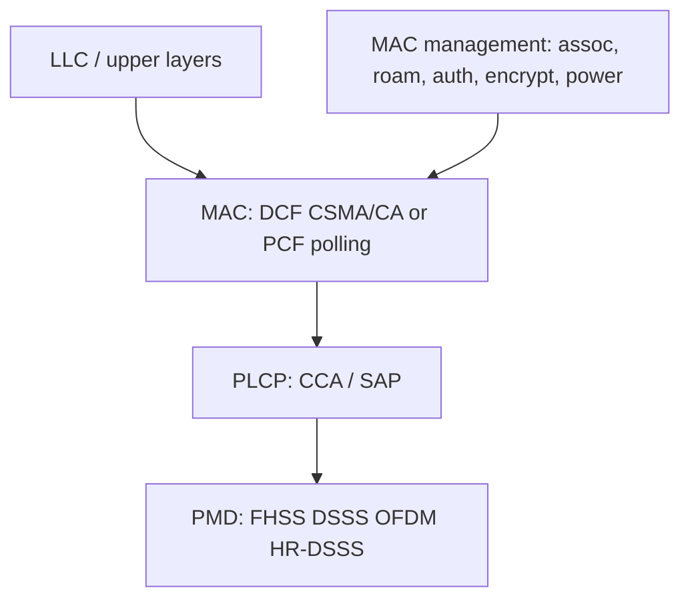

#### IEEE 802.11 standards

IEEE 802.11 is a set of **MAC and PHY** specifications for WLANs in the **2.4 GHz and 5 GHz** bands (transcript “2.5 4 and 5”). Created and maintained by the **IEEE LAN standards committee**. **Base version 1997**, then many amendments. They are the basis for products using the **Wi-Fi brand**. Each standard suits a particular environment.

| Standard | Released | Rate | Indoor / outdoor range | Spread / modulation | Band |
|----------|----------|------|------------------------|---------------------|------|
| **802.11** (legacy) | 1997 | **1–2 Mbps** | **20 m / 100 m** | FHSS and DSSS | **2.4 GHz ISM** |
| **802.11a** | 1999 | **54 Mbps** (transcript “54 and 8”) | **35 m / 120 m** | **OFDM** | **5 GHz ISM** |
| **802.11b** | 1999 | **11 and 22 Mbps** | **35 m / 120 m** | **HR-DSSS** | **2.4 GHz ISM** |
| **802.11g** | 2003 | **54 Mbps** | **38 m / 140 m** | **OFDM** and DSSS | **2.4 GHz ISM** |
| **802.11n** | 2009 | **54–600 Mbps** | **70 m / 250 m** | **OFDM**; adds **MIMO** antennas | **2.4 GHz and 5 GHz** (5 GHz **optional**) |
| **802.11ac** | 2013 | about **1300 Mbps** | (not separately ranged) | built on **n** | **5 GHz ISM** |

**802.11a note:** 2.4 GHz is **heavily used**, so the **relatively unused 5 GHz** band is a **theoretical advantage**. **802.11a signals are absorbed more by walls** (smaller wavelength) and **penetrate poorly**.

**Other 802.11 amendments**

| Amendment | Focus in this lecture |
|-----------|------------------------|
| **802.11d** | Spread of the technology to **countries not addressed** by the base IEEE rules |
| **802.11e** | **QoS** for wireless **multimedia** |
| **802.11f** | **Roaming between APs** and **interoperability between vendor groups** |
| **802.11h** | **Frequency selection and power** on **5 GHz in European countries** |
| **802.11i** | Enhancing WLAN **security and authentication**, including **RADIUS**, **Kerberos**, and **IEEE 802.1X** |
| **802.11j** | **Japanese equivalent of 802.11h** |
| **802.11ad** | New PHY in the **60 GHz** spectrum; products under the **WiGig** brand. Certification later moved to the **Wi-Fi Alliance** (from the WiGig Alliance). Peak rate **7 Gbps** |
| **802.11af** | Also **White-Fi** or **Super Wi-Fi**; approved **February 2014**. WLAN in **TV white space**, **VHF/UHF 54–790 MHz**, using **cognitive radio** on **unused TV channels** |

#### Radio carriers, bands, and 2.4 GHz channels

WLANs use **electromagnetic waves** without wires. Radio waves are **radio carriers**: they **deliver energy to a remote receiver**. Data are **superimposed** on the carrier so they can be extracted — **carrier modulation**.

Band use recap: **802.11b and 802.11g → 2.4 GHz**; **802.11a → more heavily regulated 5 GHz**; **802.11n → both**.

Each spectrum is subdivided into **channels** with a **center frequency and bandwidth**, like radio/TV. The **2.4 GHz band has 14 channels spaced 5 MHz apart**. **Channel 1** is centered on **2412 MHz** (transcript “2412 GHz”). Some channels have **extra restrictions or are unavailable** in some regulatory domains. The lecture shows a figure of all **14 channel frequencies**.

#### IEEE 802.11 frame format

Nine fields from **Frame Control** through **checksum**. **Frame Control is 2 bytes** with **11 subfields** (detailed after the main fields).

| Field | Role |
|-------|------|
| **Frame Control** | 2 bytes, control (11 subfields) |
| **Duration** | How long **this frame and its acknowledgement** will **occupy the channel** |
| **Four addresses** | **Source and destination** plus **source and destination base stations** for **intercell traffic** |
| **Sequence** | Fragment numbering: of **16 bits**, **12 identify the frame**, **4 identify the fragment** |
| **Data (payload)** | Up to **2312 bytes** |
| **Checksum / FCS** | **4 bytes**, usual CRC |

**Frame Control subfields**

| Subfield | Meaning |
|----------|---------|
| **Protocol version** | Two protocol versions can run **in the same cell** |
| **Type** | **Data, control, or management** |
| **Subtype** | Further type detail |
| **To DS / From DS** | Frame going to or coming from the **intercell distribution system** (e.g. **Ethernet**) |
| **MF** | **More fragments** follow |
| **Retry** | Retransmission of a frame sent earlier |
| **Pwr (power management)** | Used by the **base station** to put the receiver **to sleep or wake it** |
| **More** | Sender has **additional frames** for the receiver |
| **W (WEP)** | Frame body **encrypted with WEP (Wired Equivalent Privacy)** |
| **O (order)** | Receiver must process a sequence of frames with this bit set **strictly in order** |

### Key terms

| Term | Meaning in this lecture |
|------|-------------------------|
| Wi-Fi Alliance | 1999 nonprofit that certifies 802.11 interoperability; requires WPA/WPA2 and EAP |
| FHSS / DSSS / OFDM / HR-DSSS | 802.11 PHY families (hops, chips, 54 Mbps+ OFDM, 11/22 Mbps HR-DSSS) |
| PLCP / PMD | PHY convergence (CCA) vs medium-dependent modulation |
| CSMA/CA | DCF access: sense idle, send full frame, binary exponential backoff on collision; virtual sensing via MACA |
| MIMO | Multiple antennas added in 802.11n (54–600 Mbps) |
| IEEE 802.11i | Security/authentication amendment: RADIUS, Kerberos, 802.1X |
| WEP | Wired Equivalent Privacy; Frame Control W bit means the body is WEP-encrypted |
| 802.11ad / WiGig | 60 GHz PHY, peak 7 Gbps |
| 802.11af / White-Fi | TV white-space WLAN, 54–790 MHz cognitive radio |

### Lecture takeaways

- **IEEE writes 802.11; the Wi-Fi Alliance owns the logo** and, for certification, insists on **WPA/WPA2 and EAP** — that is this lecture’s primary “security protocol” statement.
- 802.11 is **PHY + MAC only**: PLCP/PMD below, DCF/PCF above, with MAC management for **associate, roam, authenticate, encrypt, sleep**.
- Rate/range progression taught: **1–2 Mbps (1997) → a/b (1999) → g (2003) → n MIMO (2009) → ac ~1.3 Gbps (2013)**, plus **ad (60 GHz)** and **af (TV white space)**.
- **802.11i** is the amendment that names **RADIUS, Kerberos, and 802.1X**.
- The MAC header’s four addresses and Duration field support **distribution-system forwarding and channel reservation**; the **W bit** flags **WEP** on the body.

---

# M32: Wi-Fi Security Protocol

**Source:** https://www.youtube.com/watch?v=vCdk5ufJpPo
**Instructor / expert:** Dr. Yogesh Chaba, Department of Computer Engineering and IT, Guru Jambheshwar University of Science & Technology, Hisar

### Learning objectives

- State why IEEE 802.11 needed a confidentiality protocol and why WEP failed that role.
- Describe WEP’s two authentication methods and the RC4/CRC/IV encryption pipeline.
- List the design flaws, IV weakness, and the mitigations that still left WEP crackable in minutes.
- Explain WPA as draft IEEE 802.11i (TKIP + Michael) and WPA2 as the full 2004 standard (AES).
- Compare WPA and WPA2 on 802.1X/EAP, PSK, mix-mode, cryptography, and processing cost.

### Core concepts

Wireless networking is popular for home and business use, so many products and protocols exist. Radio is available to authorized users **and** to unauthorized users (hackers). IEEE **802.11** therefore offered a protection mechanism: **Wired Equivalent Privacy (WEP)** — a set of instructions and rules so that wireless data can travel over the air with some security.

#### Three protocols in this lecture

The instructor covers three basic Wi-Fi security protocols, then compares the last two:

| Protocol | Role in the lecture |
|----------|---------------------|
| **WEP** | Original 802.11 confidentiality algorithm (1997); soon replaced |
| **WPA** | Wi-Fi Protected Access — interim fix for known WEP issues |
| **WPA2** | Full IEEE 802.11i (2004); AES instead of TKIP |

WEP was meant to provide **confidentiality** by encrypting traffic on the wireless network. It was **replaced by WPA** because of a flaw: WEP can be **cracked in a few minutes** with automated tools. WPA and WPA2 were designed to **address and fix** those known WEP issues.

#### WEP as originally specified (1997)

WEP is a security algorithm for IEEE 802.11 WLANs, introduced with the original **802.11 standard ratified in 1997**. The intention was data confidentiality **comparable to a traditional wired network** — hence the name.

IEEE 802.11 design objectives for WEP:

| Objective | Meaning as taught |
|-----------|-------------------|
| **Reasonably strong** | Security should rest on the difficulty of discovering the secret key by brute force; that difficulty depends on **key length** and **how often keys change** |
| **Self-synchronizing** | WEP should resynchronize **per message**. That is critical for a **data-link** encryption algorithm that assumes **best-effort delivery** |
| **Efficient** | Implementable in **hardware or software** |
| **Exportable** | Designed to maximize chances of **U.S. government export approval** |
| **Optional** | Implementation and use in 802.11 should be **optional** |

Those objectives show WEP was **not military-grade**. The intention was to make break-in **hard, not impossible**.

#### WEP authentication

WEP security has two parts: **authentication** and **encryption**.

Authentication happens when a device **first joins the LAN**. The goal is to stop stations joining unless they know the **WEP key**. Two methods:

**Open System Authentication**

- The WLAN client **need not provide credentials** to the access point during authentication.
- Any client can authenticate with the AP and then attempt to associate.
- **In fact no authentication occurs.**
- Afterward, WEP keys **can** be used to encrypt data frames; the client must then have the **correct keys**.

**Shared Key Authentication** — a four-step challenge–response handshake:

1. The wireless device sends an **authentication request** to the AP.
2. The AP sends a **128-bit random authentication challenge in cleartext**.
3. The device uses the **shared secret key** to sign the challenge and returns an **authentication response**.
4. The AP decrypts the signed message with the same shared key and **verifies the challenge**. If it matches, authentication succeeds and the AP sends an **authentication success** message; otherwise it fails.

**After authentication, no new secret key is exchanged.** The **same shared key** is used for both authentication and encryption. There is therefore **no way to tell** whether a later message comes from the trusted device or from an **imposter**. This authentication is **prone to man-in-the-middle attack**.

#### WEP encryption (RC4 + CRC + IV)

WEP uses the **RC4 stream cipher** between AP and device. As taught: WEP uses **8-bit RC4** and operates on 8-bit values by creating an array of **256 eight-bit values** as a lookup table (RC4’s S-box).

Pipeline:

1. WEP uses **CRC** for integrity: a CRC is computed on the **plaintext** and **concatenated** to that plaintext.
2. The **secret key is concatenated with the initialization vector (IV)** and fed into RC4.
3. RC4 emits a **keystream** from that key and IV.
4. Keystream is **XORed** with (plaintext + CRC) to produce **ciphertext**.
5. The **same IV is prepended in cleartext** to the ciphertext.
6. **IV + ciphertext**, plus frame headers, go over the air.

Attack implications taught here:

- **Part of the secret is used with different exposed values.** An attacker can recover the secret by analyzing a portion of bits in the **first few bytes of the keystream**, with relatively little work.
- Concatenating the shared key with a **visible IV** is the **IV weakness**.

#### Why WEP was believed strong, then collapsed

Early on, WEP was believed to offer **impenetrable resistance** to eavesdroppers and hackers. As WLANs grew, cryptanalysts found **flaws in the original design**. Many believe there was **little peer review**; those flaws would have been caught in design if specifications had been reviewed thoroughly.

For most users — especially **home users** — WEP was the **only choice** until new 802.11 mechanisms arrived. The instructor’s line: **something is better than nothing**. Even with known weakness, WEP was more effective than **no security**, at least against unauthorized use and **eating up the bandwidth**.

#### Suggested improvements that were still not enough

Proposed ways to paper over WEP:

- Choose a **bigger IV**.
- Prepend or append a **hash of the IV** to the ciphertext **instead of the IV in the clear**.
- Replace CRC with a stronger integrity check — **hash functions**.
- **Change the secret key regularly and dynamically** using secure symmetric-key distribution.
- **Better key management** using security handshake protocols.
- **New authentication** using **Extensible Authentication Protocol (EAP)**.

Even with those improvements, WEP still **cracked in a few minutes** with automated tools. Additional measures beyond WEP alone are required.

#### From WEP to WPA to WPA2 (IEEE 802.11i)

| Year | Event |
|------|--------|
| **2003** | Wi-Fi Alliance announced WEP **superseded by WPA** |
| **2004** | Full **IEEE 802.11i** ratified as **WPA2**; IEEE declared WEP **obsolete** |

The Alliance implemented 802.11i in **two steps**: **WPA**, then **WPA2**.

- **WPA** was an **intermediate** measure pending full 802.11i. It could be added by **firmware upgrades** on NICs designed for WEP — hardware that **could not support WPA2**. The interim software path **delayed buying new hardware**. Some old APs still needed **replacement or firmware upgrade**.
- WPA is sometimes called **draft IEEE 802.11i** (available **2003**).
- WPA2 became available in **2004**, commonly known as **full IEEE 802.11i** or **IEEE 802.11i-2004**.

#### WPA: TKIP and Michael

WPA is designed to fix known WEP issues and give higher assurance that data stay protected, using **Temporal Key Integrity Protocol (TKIP)** for encryption.

| | WEP | WPA (TKIP) |
|--|-----|------------|
| Key | **40-bit or 104-bit** key, **manually entered** on APs and devices, **does not change** | **Per-packet key**: dynamically generates a new **128-bit** key **for each packet** |
| Integrity | **CRC** | **Message integrity check** — algorithm **Michael** |

Per-packet keys are meant to stop the attacks that compromised WEP. The MIC is meant to stop an attacker **altering and resending** packets. CRC’s main WEP flaw was that it did **not** provide a sufficiently strong integrity guarantee. Stronger **message authentication codes** existed but **required too much computation for old network cards**.

**Michael is much stronger than CRC**, but researchers still found a WPA flaw from Michael’s limitations: retrieving the **keystream from short packets** for **reinjection and spoofing**.

#### WPA2: AES and 802.11i features

To solve those WPA problems and **fully implement IEEE 802.11i**, **WPA2** is used. Only authorized users should access the wireless device. Features taught: **stronger cryptography**, **stronger authentication**, **control**, **key management**, **replay-attack protection**, and **data integrity**.

Encryption is **AES**, not TKIP. As taught:

- Fixed **block size 128 bits**.
- Three key sizes, described as three iterations of the algorithm:
  - **128-bit** key → **9 rounds**
  - **192-bit** key → **11 rounds**
  - **256-bit** key → **13 rounds** (caption “133” is this figure)
- AES is a **substitution cipher**: within each round, bits are **substituted and rearranged**, then a **special multiplication** is performed on the new arrangement.
- Effectiveness: time to break AES-128 by brute force is given as around **2,200 years**.

#### WPA versus WPA2

**Similarities**

- Both use **802.1X**, i.e. the **EAP framework**, for **central mutual authentication** and **dynamic key management**.
- Both offer a **pre-shared key (PSK)** for **home and small-office** environments.
- Both are designed to secure all versions of 802.11 devices taught here: **802.11b, 802.11a, and 802.11g**.

**Differences**

- **WPA2 mix-mode** supports **both WPA- and WPA2-enabled devices on the same WLAN**; WPA supports **only one**.
- Most significant: **WPA2 uses AES instead of TKIP**.
- **WPA2 is theoretically not hackable; WPA is.**
- **WPA2 requires more processing power than WPA.**

### Diagrams

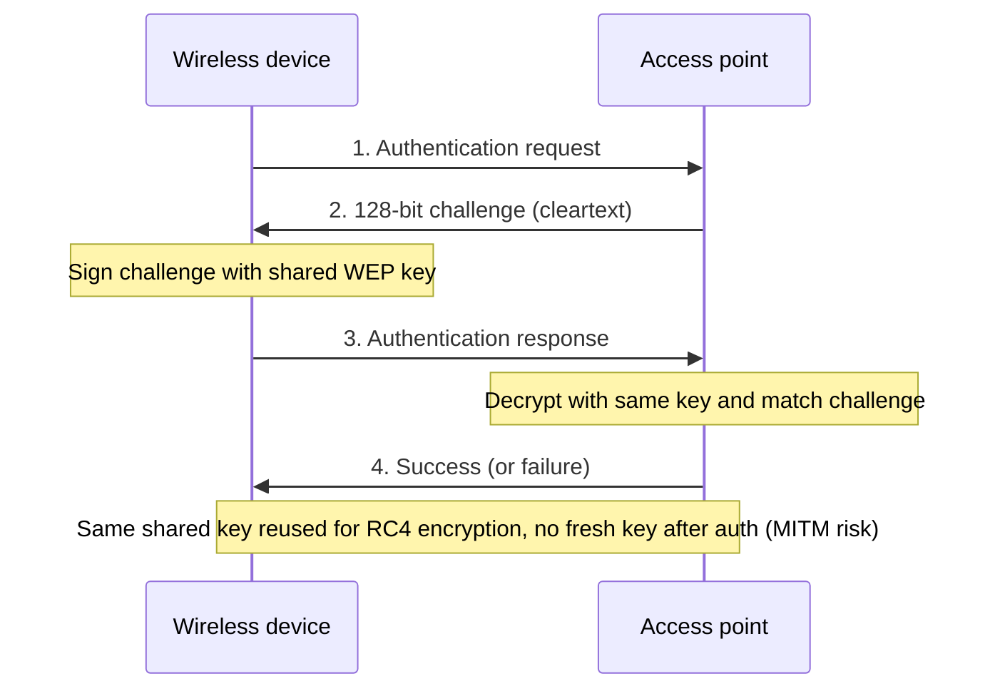

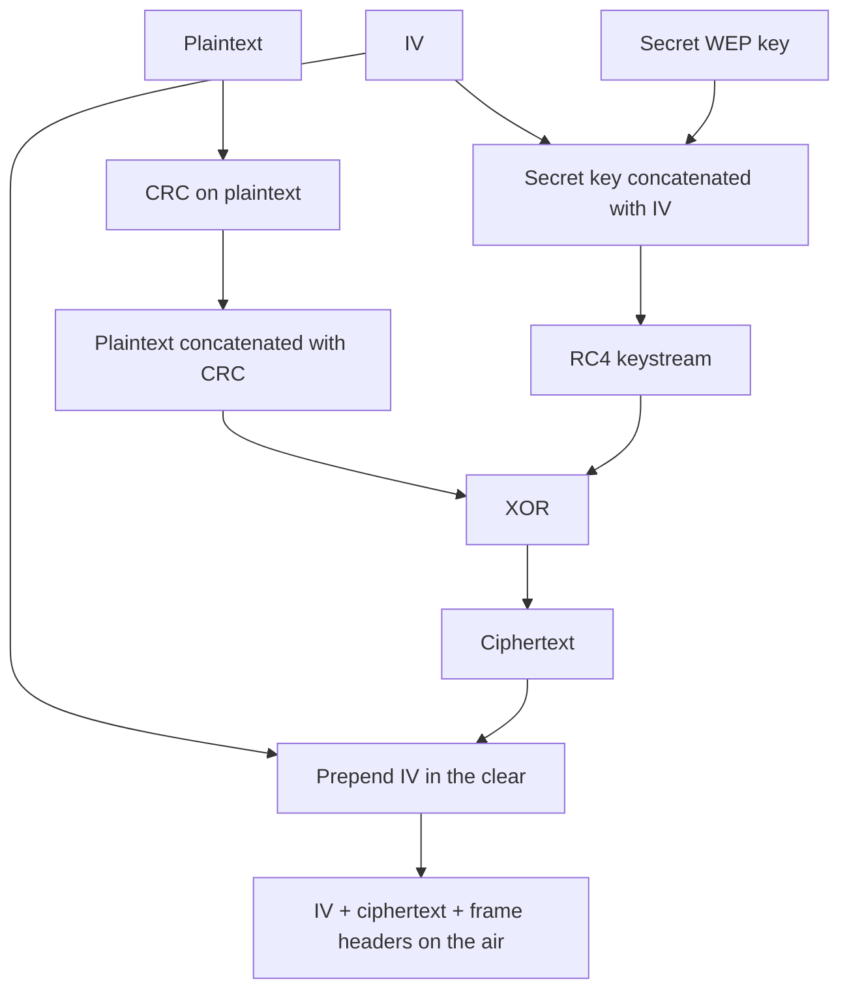

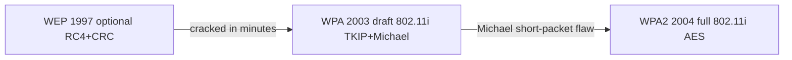

### Key terms

| Term | Meaning in this lecture |
|------|-------------------------|
| WEP | Wired Equivalent Privacy — original 802.11 confidentiality algorithm (1997) |
| WPA | Wi-Fi Protected Access — 2003 interim / draft 802.11i using TKIP |
| WPA2 | Full IEEE 802.11i-2004 using AES |
| IEEE 802.11i | WLAN security standard implemented in two steps as WPA then WPA2 |
| Open System Authentication | Join path that does not actually authenticate; encryption keys applied later |
| Shared Key Authentication | Four-step WEP challenge–response using the same key later used to encrypt |
| RC4 | Stream cipher WEP uses with a 256-entry 8-bit lookup table |
| IV | Initialization vector concatenated with the WEP key; sent in the clear — the IV weakness |
| CRC | WEP integrity check on plaintext; too weak to stop alteration |
| TKIP | Temporal Key Integrity Protocol — per-packet 128-bit keys in WPA |
| Michael | WPA message integrity check; stronger than CRC, still flawed on short packets |
| AES | WPA2 block cipher: 128-bit blocks; 128/192/256-bit keys; 9/11/13 rounds as taught |
| 802.1X / EAP | Framework both WPA and WPA2 use for mutual authentication and dynamic keys |
| PSK | Pre-shared key mode for home / small office |
| Mix-mode | WPA2 ability to host WPA and WPA2 stations on one network |

### Lecture takeaways

- Air is shared with hackers; 802.11’s first answer was WEP, designed to be **hard** to break and **optional**, not military-grade.
- WEP’s shared-key handshake reuses one key for auth and encryption and is **MITM-prone**; RC4 with a **clear IV** and **CRC** leaked keystream.
- Firmware-friendly **WPA/TKIP/Michael** was only a bridge to **802.11i**; Michael still allowed short-packet reinjection.
- **WPA2/AES** is the full 2004 standard: stronger crypto, authentication, key management, replay protection, and integrity — at higher CPU cost.
- Prefer WPA2; WPA is described as hackable, WPA2 as theoretically not. Both still share 802.1X/EAP, PSK, and 802.11a/b/g coverage.

---

# M33: Bluetooth Networks and Security Protocols

**Source:** https://www.youtube.com/watch?v=wzD1F-Knr_E
**Instructor / expert:** Prof. Yogesh Chaba, Department of Computer Engineering and IT, Guru Jambheshwar University of Science & Technology, Hisar

### Learning objectives

- Place Bluetooth as a short-range UHF ISM WPAN technology and recount SIG / IEEE 802.15 origins.
- Draw a piconet and scatternet and state the master/slave communication rule.
- Walk the Bluetooth protocol stack, ACL vs SCO links, L2CAP roles, and the 54-bit header frame.
- Recite SIG versions from 1.0 through 4.2 and the IEEE 802.15.x WPAN family.
- Name Bluetooth’s three native security services and the four BR/EDR/HS security modes, including NIST’s warning on mode 1.

### Core concepts

Bluetooth is a wireless standard for exchanging data over **short distances** using **short-wavelength UHF** radio. It operates in the **ISM band from 2.4 to 2.485 GHz**, for mobile devices and **personal area networks (PANs / WPANs)**.

#### Origins and naming

In **1994**, **Ericsson** wanted to connect mobile devices to other devices **without cables**. With **IBM, Intel, Nokia, and Toshiba** it formed a **Special Interest Group (SIG)**. They developed a short-range, **low-power, inexpensive** radio standard for computing and communication devices and accessories.

The name **Bluetooth** is after the 10th-century king **Harald Bluetooth**, who united distant Danish tribes into one kingdom. The name was proposed in **1997** by **Jim Kardach**, who had developed a system allowing mobile phones to talk to computers.

The Bluetooth SIG defines manufacturing standards. In **July 1999** it issued a **1,500-page specification of version 1.0**. Shortly after, the IEEE WPAN working group **802.15** adopted that document as a basis.

- **Bluetooth SIG specification:** a **complete system**, physical layer through application layer.
- **IEEE 802.15:** only **physical and data-link** layers.

#### Piconet and scatternet

The basic unit is a **piconet**: a **master** node and up to **seven active slave** nodes within about **10 m**. Multiple piconets can exist in the same large room and can be connected via a **bridge** node. An interconnected collection of piconets is a **scatternet**.

**All communication is master–slave.** Direct **slave-to-slave communication is not possible**.

#### Layered protocol architecture

Protocols are grouped loosely into layers.

| Layer / protocol | Role as taught |
|------------------|----------------|
| **Radio (physical)** | Matches OSI / 802 physical layer: radio transmission and modulation in ISM **2.4–2.485 GHz** |
| **Baseband** | Analogous to the **MAC sublayer**, with some physical-layer elements. Master controls **time slots** and grouping into **frames**. Turns the raw bit stream into frames and defines key formats |
| **Link Manager** | Establishes logical channels: **power management, authentication, QoS** |
| **L2CAP** | Logical Link Control and Adaptation Protocol — shields upper layers from transmission details |
| **Audio and control** | Applications may reach them **directly**, without L2CAP |
| **RFCOMM** | Emulates a PC **serial port** (keyboard, mouse, modem, …) |
| **Telephony protocol** | Real-time protocol for the **three speech-oriented protocols**; manages **call setup and termination** |
| **Service Discovery Protocol (SDP)** | Locate services in the network |
| **Applications and profiles** | Top layer; use lower protocols |

**TDD slots.** In the simplest form the master defines **625 µs** slots. Master transmissions start in **even** slots, slave transmissions in **odd** slots — classical **TDM**, with the master getting **half** the slots and slaves sharing the other half.

Each frame rides a logical **link** between master and slave. Two link types:

| Link | Name | Use |
|------|------|-----|
| **ACL** | Asynchronous Connection-Less | Packet-switched data at **irregular** intervals |
| **SCO** | Synchronous Connection-Oriented | Real-time data (e.g. telephone). **Fixed slot in each direction**. Frames are **never retransmitted**; **forward error correction (FEC)** provides reliability |

**L2CAP’s three functions**

1. Accept packets of up to **64 KB** from upper layers, **fragment** to frames, **reassemble** at the far end.
2. **Multiplex / demultiplex** multiple packet sources.
3. Handle **QoS** requirements.

#### Frame format

A Bluetooth frame begins with an **access code** that usually **identifies the master**, so slaves in radio range of **two masters** can tell which traffic is theirs. Next is a **54-bit header** (typical MAC-sublayer fields), then a data field of up to **2,744 bits** for a **five-slot** transmission. For a **single time slot** the layout is the same except the data field is **240 bits**.

Header fields:

| Field | Role |
|-------|------|
| **Address** | Which of the **eight active devices** the frame is for |
| **Type** | Frame type: **ACL, SCO, POLL, or NULL**; also **error-correction type** in the data field and **how many slots** the frame occupies |
| **Flow** | Slave asserts when its **buffer is full** |
| **Acknowledgement** | Piggybacks an **ACK** |
| **Sequence** | Numbers frames to detect retransmissions. Protocol is **stop-and-wait**, so **one bit** is enough |
| **Header checksum** | **8-bit** check |

The entire 8-bit header is **repeated three times** to make the 54-bit header. The receiver examines all three copies of each bit: if they agree, accept it; if not, **majority vote** wins.

#### SIG versions (all downward compatible)

The SIG was formally announced on **20 May 1998**. Membership is given as **over 20,000 companies**. Founders: Ericsson, IBM, Intel, Toshiba, Nokia; many others joined later. **All versions support backward compatibility.**

| Version | What the lecture stated |
|---------|-------------------------|
| **v1.0 and v1.0b** | Basic Bluetooth; **many problems**; manufacturers struggled to make products **interoperable** |
| **v1.1** | Ratified as **IEEE 802.15.1-2002**. Fixed many 1.0b errors. Added **non-encrypted channels** and **RSSI** |
| **v1.2** | Faster **connection and discovery**. **Adaptive Frequency Hopping (AFH)** spread spectrum — skip crowded hop frequencies to resist RF interference. Practical speed up to **721 kbps** (higher than v1.1). Ratified as **IEEE 802.15.1-2005** |
| **v2.0 + EDR** | Core spec **2004**. **Enhanced Data Rate**: nominal about **3 Mbps**, practical **2.1 Mbps**. Modulation: **GFSK combined with PSK** |
| **v2.1 + EDR** | Adopted **26 July 2007**. Headline feature: **Secure Simple Pairing (SSP)** — better pairing experience and stronger security |
| **v3.0 + HS** | Adopted **21 April 2009**. Theoretical transfer up to **24 Mbps**, **not over the Bluetooth link itself**: Bluetooth is used for **negotiation and establishment**; high-rate traffic rides an **802.11** link |
| **v4.0** | “**Bluetooth Smart**,” adopted **30 June 2010**. Includes **Classic**, **Bluetooth High Speed**, and **Bluetooth Low Energy (LE)**. LE, previously **Wibree**, is a subset of v4.0 with an **entirely new protocol stack** for rapid simple links |
| **v4.1** | Adopted **4 December 2013**. **Software** (not hardware) update to v4.0. **Increased coexistence with LTE**, bulk data-transfer rates, and devices in **multiple roles simultaneously** |
| **v4.2** | Released **2 December 2014**. **Data length extension** needs a **hardware** update; some older hardware can get features such as **privacy updates via firmware** |

#### IEEE 802.15 WPAN standards

IEEE **802.15** is the working group that specifies WPAN standards.

| Standard | Topic as taught |
|----------|-----------------|
| **802.15.1** | WPAN Bluetooth — PHY and MAC for wireless connectivity with fixed, portable, and moving devices in **personal operating space**. Issued **2002** and **2005** |
| **802.15.2** | **Coexistence** of WPANs with other unlicensed devices (e.g. WLANs). **802.15.2-2003** published **2003**; Task Group 2 then went into **hibernation** |
| **802.15.3** | **High-rate WPAN**, MAC and PHY, **11–55 Mbps** (2003). Amendments: **802.15.3a**, **802.15.3b-2006**, **802.15.3c-2009** |
| **802.15.4** | **Low-rate WPAN** (2003): low data rate, **very long battery life**, **very low complexity**. Defines OSI **physical and data-link** layers. Alternative PHY **802.15.4a-2007**; revision **802.15.4-2006** (4b) |
| **802.15.5** | **Mesh networking** framework — interoperable, stable, scalable. Two parts: **low-rate** mesh on **802.15.4-2006 MAC**; **high-rate** mesh on **802.15.3b MAC** |
| **802.15.6** | **Body Area Network (BAN)**. December **2011** draft. Devices **in or around the human body**: medical, consumer electronics, personal entertainment |
| **802.15.7** | **Visible light communication** |
| **P802.15.8** | **Peer-aware communications** |
| **P802.15.9** | **Key management protocol** |
| **P802.15.10** | **Layer-2 routing** |

#### Security architecture

Three **basic security services** in the Bluetooth standard:

| Service | Meaning |
|---------|---------|
| **Authentication** | Verify identity of communicating devices from the **Bluetooth device address**. Bluetooth does **not** provide **native user authentication** |
| **Confidentiality** | Stop eavesdropping: only authorized devices access/view transmitted data |
| **Authorization** | A device must be authorized to use a **service** before it may do so |

Bluetooth does **not** address **audit, integrity, or non-repudiation**. If needed, those come from **additional means**.

The **BR (Basic Rate) / EDR / HS** family defines **four security modes**. Each device must operate in one of them.

**Security mode 1 — non-secure**

- Authentication and encryption are **never initiated**.
- Devices are **indiscriminate**; nothing stops other Bluetooth devices from connecting.
- If a **remote** device **initiates** pairing, authentication, or encryption, a mode-1 device **will participate**.
- All **v2.0 and earlier** devices can support mode 1; **v2.1 and later** may use it only for **backward compatibility**.
- **NIST recommends never using security mode 1.**

**Security mode 2 — service-level (after link, before logical channel)**

- Security may start **after link establishment** but **before logical-channel establishment**.
- A local **security manager** (Bluetooth architecture) controls access to specific services.
- Centralized security manager holds **access-control policies** and interfaces to other protocols and users.

**Security mode 3 — link-level enforced**

- Security starts **before the physical link is fully established**.
- **Authentication and encryption are mandatory** for all connections to and from the device.
- All **v2.0 and earlier** can support mode 3; **v2.1 and later** only for **backward compatibility**.

**Security mode 4 — service-level with SSP (v2.1 + EDR)**

- Similar timing to mode 2: after **physical and logical link** setup.
- Uses **Secure Simple Pairing (SSP)**.
- **Elliptic-curve Diffie–Hellman (ECDH)** replaces **legacy key agreement** for **link-key generation**.
- Device **authentication and encryption algorithms remain those of v2.0 + EDR and earlier**.

### Diagrams

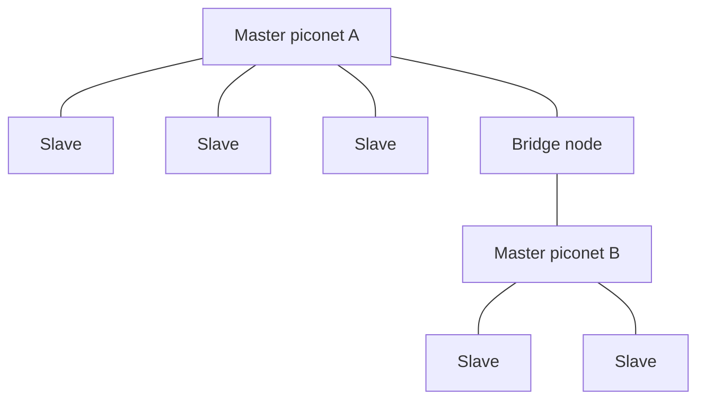

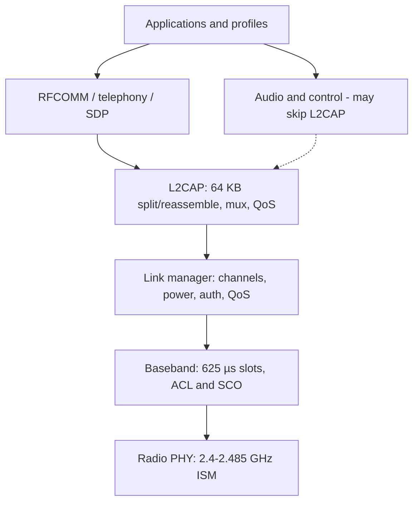

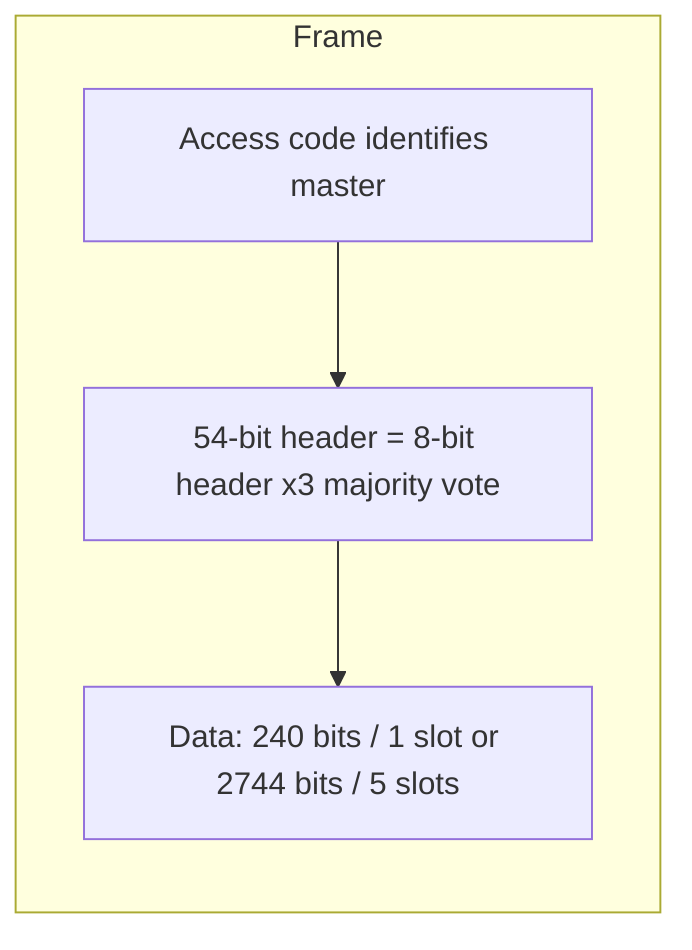

### Key terms

| Term | Meaning in this lecture |
|------|-------------------------|
| WPAN | Wireless personal area network; Bluetooth’s setting |
| SIG | Bluetooth Special Interest Group (1998; 1,500-page v1.0 in 1999) |
| Piconet | Master + up to 7 active slaves within ~10 m |
| Scatternet | Piconets joined by a bridge node |
| ACL / SCO | Async connectionless data vs synchronous connection-oriented real-time (no retransmission, FEC) |
| L2CAP | Segmentation, multiplexing, QoS |
| RFCOMM | Serial-port emulation |
| Access code | Identifies the master so overlapping piconets can be distinguished |
| EDR | Enhanced Data Rate (v2.x): ~3 Mbps nominal, 2.1 Mbps practical, GFSK+PSK |
| HS | High Speed (v3.0): 24 Mbps over 802.11 after Bluetooth setup |
| LE / Wibree | Bluetooth Low Energy new stack inside v4.0 “Bluetooth Smart” |
| SSP | Secure Simple Pairing (v2.1); ECDH link keys in security mode 4 |
| 802.15.1–.10 | IEEE WPAN family: Bluetooth, coexistence, high/low rate, mesh, BAN, VLC, PAC, KMP, L2 routing |
| Security modes 1–4 | Non-secure; service-level; link-level mandatory crypto; SSP service-level |

### Lecture takeaways

- Bluetooth is a complete SIG stack on cheap short-range ISM radios; IEEE 802.15 only standardizes PHY/MAC.
- A piconet is strictly **star-shaped**: no slave-to-slave path except through the master (or a scatternet bridge).
- Baseband TDD (625 µs), ACL vs SCO, and L2CAP fragmentation/mux/QoS are the operational core; audio/control can bypass L2CAP.
- Versions add hopping hygiene, EDR, SSP, 802.11 offload, LE, LTE coexistence, and longer PDUs — always backward compatible.
- Native security is **device** auth, confidentiality, and service authorization only. **Never use mode 1** (NIST). Mode 4 modernizes **key agreement** (ECDH) without changing the old auth/encryption algorithms.

---

# M34: Virtual Private Network

**Source:** https://www.youtube.com/watch?v=14DVrUgf2k8
**Instructor / expert:** Prof. Yogesh Chaba, Department of Computer Engineering and IT, Guru Jambheshwar University of Science & Technology, Hisar

### Learning objectives

- Contrast a leased-line private network with a VPN overlay on a public network.
- Name Access, Intranet, and Extranet VPNs and the four architectural components (client, NAS, VPN server, protocol).
- Reconstruct Layer-2 tunnel setup (PPP, LCP, PAP/CHAP, NCP) and the PPTP, L2F, and L2TP packet stories.
- Distinguish IPsec AH vs ESP and Layer-2 vs Layer-3 tunneling.
- State OpenVPN’s SSL/TLS properties and the lecture’s protocol preference; explain why firewalls and VPNs are used together.

### Core concepts

Almost all companies have offices and plants scattered over cities — sometimes countries. In the olden days it was common to **lease telephone lines** between locations. Some still do. A network built from **company computers and leased telephone lines** is a **private network**.

Private networks **work and are very secure**: traffic does not leak from company locations, and intruders must **physically wiretap** the lines. The problem is **cost**. When public data networks and then the **Internet** appeared, companies wanted to move data and voice onto the public network **without giving up private-network security**. That demand produced the **VPN**: an **overlay** on public networks with **most properties of private networks**.

A VPN provides a **secure connection** between sender and receiver over a **public, non-secure** network such as the Internet. They are **virtual** in the same sense as virtual circuits and virtual memory: an **illusion**, not a physical private plant.

A VPN is created by a **virtual point-to-point** path using **dedicated connections, virtual tunnels, and traffic encryption**. A VPN across the Internet is similar to a **WAN link** between sites. From the user’s view, extended resources are used **the same way** as resources inside the private network.

Uses taught:

- Employees **securely access the company intranet** while traveling.
- Geographically separated offices join into **one cohesive network**.
- Individuals secure **wireless transactions**, **circumvent geo-restrictions and censorship**, and connect to **proxy servers** to protect **personal identity and location**.

#### Three types of VPN

All three use the Internet as a private enterprise backbone, but they serve different groups:

| Type | Who it serves |
|------|----------------|
| **Access VPN** | Remote / mobile users, telecommuters, or a branch office needing **reliable access** to the corporate network |
| **Intranet VPN** | Branch offices **linked to corporate headquarters** securely |
| **Extranet VPN** | Customers, suppliers, and partners accessing the **corporate intranet** securely |

#### Architecture (four components)

1. **VPN client**
2. **Network Access Server (NAS)**
3. **Tunnel-terminating device — VPN server**
4. **VPN protocol**

In a typical **Access VPN**:

- The client connects to the NAS over the **PSTN**.
- The remote user initiates a **PPP** connection with the ISP’s NAS via PSTN.
- The NAS is owned by the ISP and usually sits in the ISP’s **point of presence (PoP)**.
- After authentication, the NAS directs the packet into the **IP tunnel** between NAS and VPN server.
- The VPN server may sit in the **ISP PoP** or at the **corporate site**, depending on the model.
- The VPN server **recovers** the packet from the tunnel, **unwraps** it, and delivers it to the corporate network.

#### Two categories of tunneling protocols

| Category | Protocols |
|----------|-----------|
| **Layer 2** | **PPTP**, **L2F**, **L2TP** |
| **Layer 3** | **IPsec** |

When **PPTP and L2F** were both submitted to the **IETF**, the features were **combined** into **L2TP**.

#### How Layer-2 tunneling works

Layer-2 protocols operate at the **data-link layer**. They use security from **PPP**:

- Authentication: existing PPP methods **PAP** (Password Authentication Protocol) and **CHAP** (Challenge Handshake Authentication Protocol).
- **No specific provision for data encryption**; the user may encrypt **before** requesting VPN service.

General tunnel-creation process:

1. Client **dials** the NAS (typically in the ISP PoP) and starts PPP.
2. The NAS answers and performs **LCP** negotiation to establish an authenticated PPP connection.
3. Once PPP is up, the NAS uses **PAP or CHAP**: **PPP authentication request** → client **PPP authentication reply**.
4. If that succeeds, the NAS attempts to **open a PPP connection to the VPN server** (lecture: “open VPN request”).
5. The VPN server authenticates the NAS with **PAP or CHAP** (“open VPN reply”).
6. Client and VPN server then use **NCP** to negotiate the **network-layer** protocol.
7. Tunneling is complete: a VPN exists between client and corporate server.

#### PPTP (Point-to-Point Tunneling Protocol)

Developed by **Microsoft** and equipment vendors including **Ascend Communications** and **3Com**, as an **extension of PPP**.

- Handles **only point-to-point** connections; **not** point-to-multipoint.
- NAS that lets the remote user start a VPN call is the **PPTP Access Concentrator (PAC)**.
- VPN server is the **PPTP Network Server (PNS)**.
- **No packet-by-packet encryption**; relies on **PPP’s native encryption** (taught in connection with PAP/CHAP).

**PPTP packet (as drawn):** PPP payload = data plus original **IP and TCP** headers. A PPTP packet (PPP payload + PPP header) is encapsulated in **GRE**, then an **IP header** is placed on top of GRE.

#### L2F (Layer 2 Forwarding)

**Proprietary Cisco** protocol.

- **Protocol-independent**; can run over **X.25, Frame Relay, and ATM**.
- Supports **private IP, IPX, and AppleTalk**; uses **UDP** for Internet tunneling.
- **Many connections inside one tunnel**.
- VPN server is called the **Home Gateway**; other pieces match the general Layer-2 picture.
- Uses **PPP for dial-up user authentication**.
- Unlike PPTP, L2F defines **its own encapsulation header**, **not dependent on IP and GRE**, so it can work on different network types.
- Packet: **SLIP or PPP payload** in an L2F packet with **L2F header** and optional **L2F checksum trailer**.

#### L2TP (Layer 2 Tunneling Protocol)

Combines PPTP and L2F.

- Runs over **UDP**, **not GRE** — many **firewalls do not support GRE**, so L2TP is **more firewall-friendly** than PPTP.
- NAS = **L2TP Access Concentrator (LAC)**; VPN server = **L2TP Network Server (LNS)**.
- Uses PPP dial-up and **PAP and CHAP**; also allows **RADIUS**.
- Permits **multiple tunnels** between the **same pair of endpoints**, each with a different **QoS**.
- Packet (as taught): **PPP header**, then **UDP**, then **IP**.
- Supported by many vendors; expected to be the **predominant** protocol once standardized.
- Relies on **IPsec** for data encryption. If the remote end **does not support IPsec**, it falls back to **less secure PPP encryption**.

#### Layer 3: IPsec

IPsec was designed to **add security to TCP/IP**. It provides **packet-level authentication, integrity, and confidentiality** via two headers:

| Header | Provides | Notes |
|--------|----------|--------|
| **AH** (Authentication Header) | Header **integrity and authentication**, **without confidentiality** | No data encryption. Useful when **only authentication** is required. Authentication is **not export-regulated**, so AH is the **preferred VPN method** in those environments. **Lower processing overhead** than ESP |
| **ESP** (Encapsulating Security Payload) | **Integrity, authentication, and confidentiality** of the payload | **Packet-by-packet encryption** and a **standards-based key-management** protocol. Used **when data encryption is desired** |

An IPsec VPN can be created with **AH, ESP, or both**.

#### Layer 2 versus Layer 3

| | Layer 2 (PPTP, L2F, L2TP) | Layer 3 (IPsec) |
|--|---------------------------|-----------------|
| Traffic | Can carry **non-IP** (IPX, AppleTalk) | **IP only** |
| Dial-up | **Individual dial-up access** via **PPP user authentication** — seamless through ISPs | Designed for security **between routers and firewalls**; **does not provide user authentication** |

#### OpenVPN (neither IPsec nor L2TP)

A relatively new **open-source** product using the **OpenSSL** library and **SSL v3 or TLS v1**, plus an amalgam of other technologies.

- Supports **neither** Layer-2 nor Layer-3 tunneling protocols in the IPsec/L2TP/PPTP sense.
- **Not compatible** with IPsec, L2TP, or PPTP.
- **Highly configurable**. Runs best on **UDP**, but can use **any port**, including **TCP 443**.
- OpenSSL ciphers taught: **AES, Blowfish, 3DES, CAST-128, Camellia**, and more.

Capabilities listed:

- Tunnel any **IP subnet** or **virtual Ethernet adapter** over a **single UDP or TCP port**.
- Configure a **scalable, load-balanced** VPN server on one or more machines for **thousands of dynamic** client connections.
- Use all OpenSSL **encryption, authentication, and certification** features to protect private traffic on the Internet.
- Any cipher, key size, or **HMAC digest** OpenSSL supports for datagram integrity.
- **Static-key** conventional encryption **or certificate-based public-key** encryption.
- Static **pre-shared keys** or **TLS-based dynamic key exchange**.
- **Real-time adaptive link compression** and **traffic shaping**.
- Tunnel networks whose public endpoints are **dynamic** (DHCP or dial-in clients).
- Tunnel through **connection-oriented stateful firewalls** without explicit extra rules; tunnel over **NAT**.
- **Secure Ethernet bridges** using virtual **TAP** devices.
- Control via a **GUI on Windows or Mac**.

Compared with PPTP and L2TP/IPsec, generic OpenVPN can be **fiddly to set up**: install the client **and** extra configuration files. Many VPN providers ship **customized clients** to avoid that.

#### Which protocol to choose (instructor’s ranking)

| Protocol | Verdict in this lecture |
|----------|-------------------------|
| **PPTP** | **Very insecure — avoid**, despite easy setup and cross-platform reach |
| **L2TP/IPsec** | Same convenience, **much more secure**. Good for **non-critical** use and a **quick setup without extra software**, especially **mobile devices** where OpenVPN support is “somewhat patchy” |
| **OpenVPN** | **Best all-round**: reliable, fast, and **most importantly secure**, despite third-party software and more settings |

**Wherever possible, always choose OpenVPN.** For a quick shield (phone vs casual criminals, public Wi-Fi), L2TP/IPsec will “probably do,” but given OpenVPN apps — **especially Android** — still **prefer OpenVPN**.

#### Firewalls and VPNs together

Firewalls and VPNs **go hand in hand**.

- VPNs open **secure tunnels**.
- Firewalls sit at **strategic locations** and **block certain traffic**. Many firewall products provide **encrypted firewall-to-firewall tunnels**.
- Firewalls **control access** to corporate resources and **establish trust** between user and network.

Two sites each with a firewall still send data **vulnerable on the Internet**. A VPN supplies **privacy** between sites when there is **usually no trust** between the two sides. **Firewall + VPN** establishes **trust and privacy** and is **more secure than either alone**.

Older firewalls offered only firewall service; **many new firewall products support VPN functionality**. Both are needed for **effective security control**.

### Diagrams

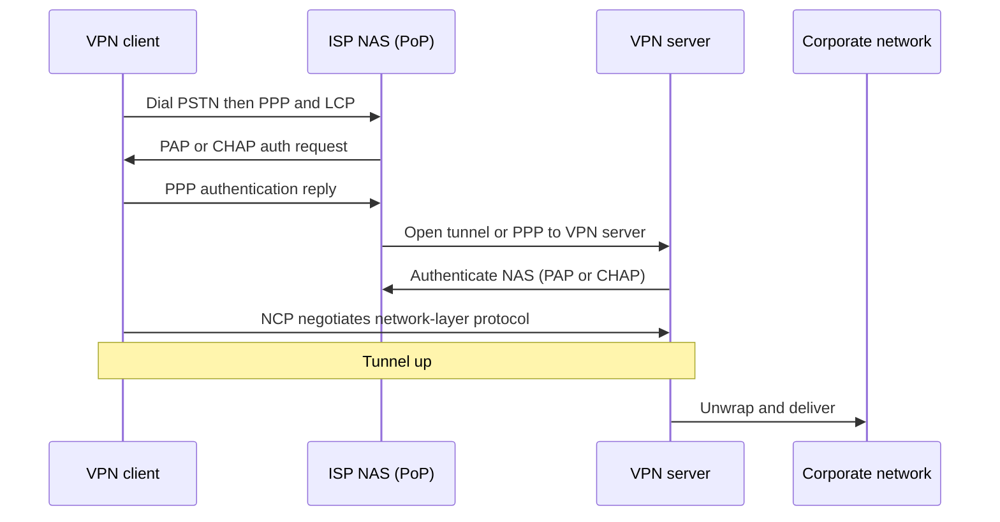

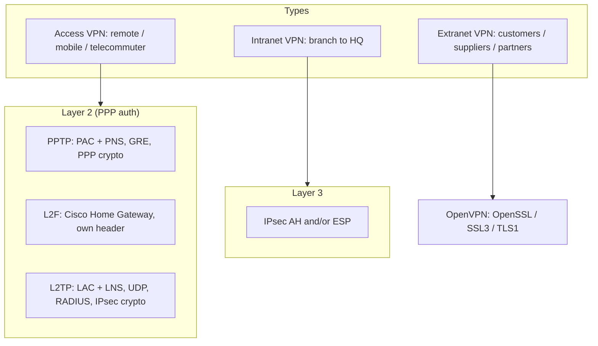

### Key terms

| Term | Meaning in this lecture |
|------|-------------------------|
| Private network | Company hosts plus leased telephone lines |
| VPN | Overlay tunnels + encryption on a public non-secure network |
| NAS | Network Access Server at the ISP PoP |
| PAC / PNS | PPTP Access Concentrator / PPTP Network Server |
| LAC / LNS | L2TP Access Concentrator / L2TP Network Server |
| Home Gateway | L2F name for the VPN server |
| PAP / CHAP | PPP authentication used by Layer-2 VPNs |
| LCP / NCP | PPP link control / network control (IPCP etc.) |
| GRE | PPTP encapsulation; many firewalls lack it |
| AH / ESP | IPsec authentication-only vs encrypting payload |
| OpenVPN | SSL/TLS VPN via OpenSSL; not interoperable with IPsec/L2TP/PPTP |
| TAP | Virtual Ethernet device for OpenVPN bridging |

### Lecture takeaways

- VPNs buy private-network **properties** without leased-line **cost**, via tunnels and encryption on the Internet.
- Layer 2 (PPTP/L2F/L2TP) is the dial-up/PPP world and can carry non-IP; IPsec is IP-only, router/firewall oriented, and has **no user authentication**.
- IETF folded PPTP+L2F into **L2TP**; encrypt L2TP with **IPsec** when possible.
- **Avoid PPTP.** Prefer **OpenVPN**; use **L2TP/IPsec** only for quick, non-critical, especially mobile, setups.
- A firewall pair without a tunnel still leaks on the Internet; **firewall + VPN** is stronger than either mechanism alone.

---

# M35: WiMAX Technology and its Security

**Source:** https://www.youtube.com/watch?v=K8I_4d-oGhA
**Instructor / expert:** Prof. Yogesh Chaba, Department of Computer Engineering and IT, Guru Jambheshwar University of Science & Technology, Hisar

Playlist metadata names this module **WiMAX Technology and its Security**. The auto-generated captions attached to the video (and thus this transcript) are a near-duplicate of **Module 33**: they open with Bluetooth WPAN and never mention WiMAX or IEEE 802.16. Notes below follow **the spoken captions**, with the same ASR corrections as M33. They do not invent WiMAX material.

### Learning objectives

- Place Bluetooth as a short-range UHF ISM WPAN technology and recount SIG / IEEE 802.15 origins.
- Draw a piconet and scatternet and state the master/slave communication rule.
- Walk the Bluetooth protocol stack, ACL vs SCO links, L2CAP roles, and the 54-bit header frame.
- Recite SIG versions from 1.0 through 4.2 and the IEEE 802.15.x WPAN family.
- Name Bluetooth’s three native security services and the four BR/EDR/HS security modes, including the recommendation never to use mode 1.

### Core concepts

Bluetooth is a wireless standard for exchanging data over **short distances** using **short-wavelength UHF** radio. It operates in the **ISM band from 2.4 to 2.485 GHz**, for mobile devices and **personal area networks (PANs / WPANs)**.

#### Origins and naming

In **1994**, **Ericsson** wanted to connect mobile devices to other devices **without cables**. With **IBM, Intel, Nokia, and Toshiba** it formed a **Special Interest Group (SIG)**. They developed a short-range, **low-power, inexpensive** radio standard for computing and communication devices and accessories.

The name **Bluetooth** is after the 10th-century king **Harald Bluetooth**, who united distant Danish tribes into one kingdom. The name was proposed in **1997** by **Jim Kardach**, who had developed a system allowing mobile phones to talk to computers.

The Bluetooth SIG defines manufacturing standards. In **July 1999** it issued a **1,500-page specification of version 1.0**. Shortly after, the IEEE WPAN working group **802.15** adopted that document as a basis.

- **Bluetooth SIG specification:** a **complete system**, physical layer through application layer.
- **IEEE 802.15:** only **physical and data-link** layers.

#### Piconet and scatternet

The basic unit is a **piconet**: a **master** node and up to **seven active slave** nodes within about **10 m**. Multiple piconets can exist in the same large room and can be connected via a **bridge** node. An interconnected collection of piconets is a **scatternet**.

**All communication is master–slave.** Direct **slave-to-slave communication is not possible**.

#### Layered protocol architecture

Protocols are grouped loosely into layers.

| Layer / protocol | Role as taught |
|------------------|----------------|
| **Radio (physical)** | Matches OSI / 802 physical layer: radio transmission and modulation in ISM **2.4–2.485 GHz** |
| **Baseband** | Analogous to the **MAC sublayer**, with some physical-layer elements. Master controls **time slots** and grouping into **frames**. Turns the raw bit stream into frames and defines key formats |
| **Link Manager** | Establishes logical channels: **power management, authentication, QoS** |
| **L2CAP** | Logical Link Control and Adaptation Protocol — shields upper layers from transmission details |
| **Audio and control** | Applications may reach them **directly**, without L2CAP |
| **RFCOMM** | Emulates a PC **serial port** (keyboard, mouse, modem, …) |
| **Telephony protocol** | Real-time protocol for the **three speech-oriented protocols**; manages **call setup and termination** |
| **Service Discovery Protocol (SDP)** | Locate services in the network |
| **Applications and profiles** | Top layer; use lower protocols |

**TDD slots.** In the simplest form the master defines **625 µs** slots. Master transmissions start in **even** slots, slave transmissions in **odd** slots — classical **TDM**, with the master getting **half** the slots and slaves sharing the other half.

Each frame rides a logical **link** between master and slave. Two link types:

| Link | Name | Use |
|------|------|-----|
| **ACL** | Asynchronous Connection-Less | Packet-switched data at **irregular** intervals |
| **SCO** | Synchronous Connection-Oriented | Real-time data (e.g. telephone). **Fixed slot in each direction**. Frames are **never retransmitted**; **forward error correction (FEC)** provides reliability |

**L2CAP’s three functions**

1. Accept packets of up to **64 KB** from upper layers, **fragment** to frames, **reassemble** at the far end.
2. **Multiplex / demultiplex** multiple packet sources.
3. Handle **QoS** requirements.

#### Frame format

A Bluetooth frame begins with an **access code** that usually **identifies the master**, so slaves in radio range of **two masters** can tell which traffic is theirs. Next is a **54-bit header** (typical MAC-sublayer fields), then a data field of up to **2,744 bits** for a **five-slot** transmission. For a **single time slot** the layout is the same except the data field is **240 bits**.

Header fields:

| Field | Role |
|-------|------|
| **Address** | Which of the **eight active devices** the frame is for |
| **Type** | Frame type: **ACL, SCO, POLL, or NULL**; also **error-correction type** in the data field and **how many slots** the frame occupies |
| **Flow** | Slave asserts when its **buffer is full** |
| **Acknowledgement** | Piggybacks an **ACK** |
| **Sequence** | Numbers frames to detect retransmissions. Protocol is **stop-and-wait**, so **one bit** is enough |
| **Header checksum** | **8-bit** check |

The entire 8-bit header is **repeated three times** to make the 54-bit header. The receiver examines all three copies of each bit: if they agree, accept it; if not, **majority vote** wins.

#### SIG versions (all downward compatible)

The SIG was formally announced on **20 May 1998**. Membership is given as **over 20,000 companies**. Founders: Ericsson, IBM, Intel, Toshiba, Nokia; many others joined later. **All versions support backward compatibility.**

| Version | What the lecture stated |
|---------|-------------------------|
| **v1.0 and v1.0b** | Basic Bluetooth; **many problems**; manufacturers struggled to make products **interoperable** |
| **v1.1** | Ratified as **IEEE 802.15.1-2002**. Fixed many 1.0b errors. Added **non-encrypted channels** and **RSSI** |
| **v1.2** | Faster **connection and discovery**. **Adaptive Frequency Hopping (AFH)** spread spectrum — skip crowded hop frequencies to resist RF interference. Practical speed up to **721 kbps** (higher than v1.1). Ratified as **IEEE 802.15.1-2005** |
| **v2.0 + EDR** | Core spec **2004**. **Enhanced Data Rate**: nominal about **3 Mbps**, practical **2.1 Mbps**. Modulation: **GFSK combined with PSK** |
| **v2.1 + EDR** | Adopted **26 July 2007** (one caption pass says 2017). Headline feature: **Secure Simple Pairing (SSP)** — better pairing experience and stronger security |
| **v3.0 + HS** | Adopted **21 April 2009**. Theoretical transfer up to **24 Mbps**, **not over the Bluetooth link itself**: Bluetooth is used for **negotiation and establishment**; high-rate traffic rides an **802.11** link |
| **v4.0** | “**Bluetooth Smart**,” adopted **30 June 2010**. Includes **Classic**, **Bluetooth High Speed**, and **Bluetooth Low Energy (LE)**. LE, previously **Wibree**, is a subset of v4.0 with an **entirely new protocol stack** for rapid simple links |
| **v4.1** | Adopted **4 December 2013**. **Software** (not hardware) update to v4.0. **Increased coexistence with LTE**, bulk data-transfer rates, and devices in **multiple roles simultaneously** |
| **v4.2** | Released **2 December 2014**. **Data length extension** needs a **hardware** update; some older hardware can get features such as **privacy updates via firmware** |

#### IEEE 802.15 WPAN standards

IEEE **802.15** is the working group that specifies WPAN standards.

| Standard | Topic as taught |
|----------|-----------------|
| **802.15.1** | WPAN Bluetooth — PHY and MAC for wireless connectivity with fixed, portable, and moving devices in **personal operating space**. Issued **2002** and **2005** |
| **802.15.2** | **Coexistence** of WPANs with other unlicensed devices (e.g. WLANs). **802.15.2-2003** published **2003**; Task Group 2 then went into **hibernation** |
| **802.15.3** | **High-rate WPAN**, MAC and PHY, **11–55 Mbps** (2003). Amendments: **802.15.3a**, **802.15.3b-2006**, **802.15.3c-2009** |
| **802.15.4** | **Low-rate WPAN** (2003): low data rate, **very long battery life**, **very low complexity**. Defines OSI **physical and data-link** layers. Alternative PHY **802.15.4a-2007**; revision **802.15.4-2006** (4b) |
| **802.15.5** | **Mesh networking** framework — interoperable, stable, scalable. Two parts: **low-rate** mesh on **802.15.4-2006 MAC**; **high-rate** mesh on **802.15.3b MAC** |
| **802.15.6** | **Body Area Network (BAN)**. December **2011** draft (captions once say “802.15.4 task group”). Devices **in or around the human body**: medical, consumer electronics, personal entertainment |
| **802.15.7** | **Visible light communication** |
| **P802.15.8** | **Peer-aware communications** |
| **P802.15.9** | **Key management protocol** |
| **P802.15.10** | **Layer-2 routing** |

#### Security architecture

Three **basic security services** in the Bluetooth standard:

| Service | Meaning |
|---------|---------|
| **Authentication** | Verify identity of communicating devices from the **Bluetooth device address**. Bluetooth does **not** provide **native user authentication** |
| **Confidentiality** | Stop eavesdropping: only authorized devices access/view transmitted data |
| **Authorization** | A device must be authorized to use a **service** before it may do so |

Bluetooth does **not** address **audit, integrity, or non-repudiation**. If needed, those come from **additional means**.

The **BR (Basic Rate) / EDR / HS** family defines **four security modes**. Each device must operate in one of them.

**Security mode 1 — non-secure**

- Authentication and encryption are **never initiated**.
- Devices are **indiscriminate**; nothing stops other Bluetooth devices from connecting.
- If a **remote** device **initiates** pairing, authentication, or encryption, a mode-1 device **will participate**.
- All **v2.0 and earlier** devices can support mode 1; **v2.1 and later** may use it only for **backward compatibility**.
- The lecture’s recommendation (NIST in the cleaner caption pass): **never use security mode 1.**

**Security mode 2 — service-level (after link, before logical channel)**

- Security may start **after link establishment** but **before logical-channel establishment**.
- A local **security manager** (Bluetooth architecture) controls access to specific services.
- Centralized security manager holds **access-control policies** and interfaces to other protocols and users.

**Security mode 3 — link-level enforced**

- Security starts **before the physical link is fully established**.
- **Authentication and encryption are mandatory** for all connections to and from the device.
- All **v2.0 and earlier** can support mode 3; **v2.1 and later** only for **backward compatibility**.

**Security mode 4 — service-level with SSP (v2.1 + EDR)**

- Similar timing to mode 2: after **physical and logical link** setup.
- Uses **Secure Simple Pairing (SSP)**.
- **Elliptic-curve Diffie–Hellman (ECDH)** replaces **legacy key agreement** for **link-key generation**.
- Device **authentication and encryption algorithms remain those of v2.0 + EDR and earlier**.

### Diagrams

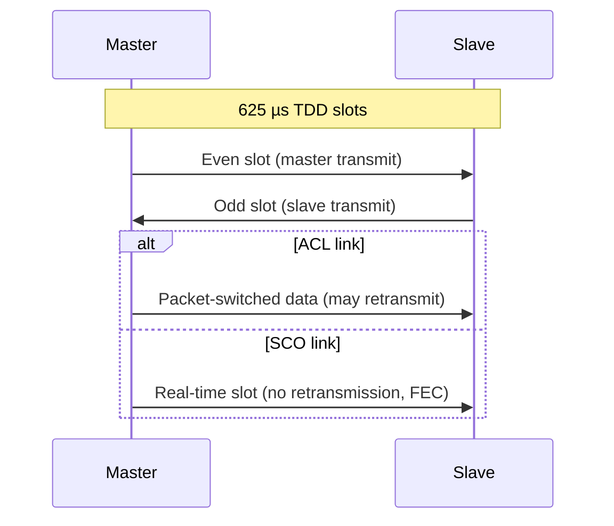

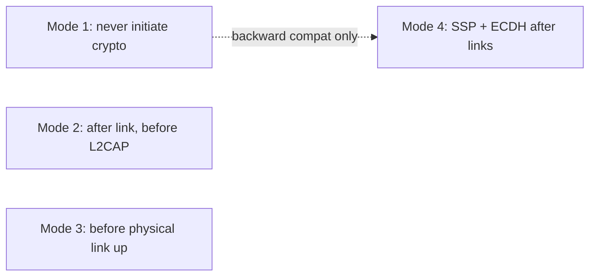

### Key terms

| Term | Meaning in this lecture |
|------|-------------------------|
| WPAN | Wireless personal area network; Bluetooth’s setting |
| SIG | Bluetooth Special Interest Group (1998; 1,500-page v1.0 in 1999) |
| Piconet | Master + up to 7 active slaves within ~10 m |
| Scatternet | Piconets joined by a bridge node |
| ACL / SCO | Async connectionless data vs synchronous connection-oriented real-time (no retransmission, FEC) |
| L2CAP | Segmentation, multiplexing, QoS |
| RFCOMM | Serial-port emulation |
| Access code | Identifies the master so overlapping piconets can be distinguished |
| EDR | Enhanced Data Rate (v2.x): ~3 Mbps nominal, 2.1 Mbps practical, GFSK+PSK |
| HS | High Speed (v3.0): 24 Mbps over 802.11 after Bluetooth setup |
| LE / Wibree | Bluetooth Low Energy new stack inside v4.0 “Bluetooth Smart” |
| SSP | Secure Simple Pairing (v2.1); ECDH link keys in security mode 4 |
| 802.15.1–.10 | IEEE WPAN family: Bluetooth, coexistence, high/low rate, mesh, BAN, VLC, PAC, KMP, L2 routing |
| Security modes 1–4 | Non-secure; service-level; link-level mandatory crypto; SSP service-level |

### Lecture takeaways

- Captions for this playlist slot teach **Bluetooth**, not WiMAX: complete SIG stack on cheap short-range ISM radios; IEEE 802.15 only standardizes PHY/MAC.
- A piconet is strictly **star-shaped**: no slave-to-slave path except through the master (or a scatternet bridge).
- Baseband TDD (625 µs), ACL vs SCO, and L2CAP fragmentation/mux/QoS are the operational core; audio/control can bypass L2CAP.
- Versions add hopping hygiene, EDR, SSP, 802.11 offload, LE, LTE coexistence, and longer PDUs — always backward compatible.
- Native security is **device** auth, confidentiality, and service authorization only. **Never use mode 1**. Mode 4 modernizes **key agreement** (ECDH) without changing the old auth/encryption algorithms.

---
