# Volume 04 — Mobility, Cloud, Cellular, VoIP, and DDoS

**Course:** CEC / SWAYAM Information Security · **Coordinator:** Dr. Maninder Singh, Thapar Institute

Modules M36–M47: Mobile IP, cloud architecture and security, GSM, MANET, 3G/4G/5G, VoIP, and DDoS attacks and defenses.

These notes are grounded in the official YouTube lecture transcripts. They are study material, not an official CEC publication.

---

# M36: Introduction to Mobile IP and Addressing

**Source:** https://www.youtube.com/watch?v=I2IzxqoP7M8
**Instructor / expert:** Dr. Sunil Kumar, Department of Electrical and Computer Engineering, Punjab Agricultural University, Ludhiana

### Learning objectives

- Explain why classic IP prefixes break when a host moves, and why DHCP-only renumbering is not enough.
- Define home address vs care-of address and the roles of home agent, foreign agent, and collocated care-of address.
- Describe agent discovery (advertisement vs solicitation) and the agent-advertisement extension fields.
- Walk registration request/reply and the four-path data-transfer process (proxy ARP + tunneling).
- Distinguish double crossing (2X) from triangle (dog-leg) routing and the binding-cache fix plus its stale-cache problem.

### Core concepts

Mobile communication drew a lot of attention in the last decade. Using mobiles on the Internet means the **IP protocol**, originally designed for **stationary** devices, must be enhanced for computers that **move from network to network**. The main problem is **addressing**.

#### Stationary hosts and why prefixes matter

Original IP addressing assumed a host is **stationary**, attached to **one specific network**. A router uses an IP address to **route** a datagram. An IP address has two parts: a **prefix** and a **suffix**. The prefix **associates the host with a network**.

Example as taught: address **10.3.4.24/8** is a host on network **10.0.0.0/8**. A host therefore does **not** have an address it can **carry from place to place**. The address is valid **only while attached to that network**. If the network changes, the address is **no longer valid**.

Routers use the prefix to deliver the packet to the network the host is attached to. That scheme **works perfectly for stationary hosts**, because part of the address **defines the attached network**.

#### Changing the address (DHCP) — and why it fails

When a host moves, the addressing structure must change. One simple proposal: let the mobile host **change its address** on the new network, using **DHCP** to obtain a new address associated with that network.

Drawbacks taught:

1. **Configuration files** would need to change.
2. Each move would require a **reboot**.
3. **DNS tables** would need revision so every other Internet host learns the change.
4. If the host **roams during a transmission**, the exchange is **interrupted**, because **ports and IP addresses of client and server must remain constant** for the duration of the connection.

#### Two addresses: home and care-of

The feasible approach is **two addresses**:

| Address | Properties |
|---------|------------|
| **Home address** | **Permanent**. Associates the host with its **home network** (permanent home) |
| **Care-of address** | **Temporary**. Changes as the host moves; associated with the **foreign network** |

Mobile IP therefore gives a mobile host **one home address and one care-of address**. The home address stays; the care-of address changes from network to network.

#### Agents

Making the address change **transparent to the rest of the Internet** requires a **home agent** and a **foreign agent**. In figures they look like **routers**, but the **agent functions are performed in the application layer** — they are **both routers and hosts**.

**Home agent**

- Usually a **router attached to the home network**.
- **Acts on behalf of the mobile host**.
- When a remote host sends a packet to the mobile host, the home agent **receives it and sends it to the foreign agent**.

**Foreign agent**

- Usually a **router attached to the foreign network**.
- **Receives and delivers** packets sent by the home agent to the mobile host.

**Mobile host as its own foreign agent**

The mobile host **can act as a foreign agent** (same node). To do that it must:

- Obtain a care-of address **by itself**, e.g. via **DHCP**.
- Run software to talk to the home agent and to hold **two addresses** (home and care-of) in a way that is **transparent to application programs**.

When the mobile host **is** the foreign agent, the care-of address is a **collocated care-of address**. Advantage: the host can move to **any network without needing a foreign agent to be present**.

#### Three phases of mobile communication

To talk to a remote host, a mobile host goes through:

1. **Agent discovery** — mobile host, foreign agent, and home agent.
2. **Registration** — mobile host and the two agents.
3. **Data transfer** — the **remote host** is involved as well.

#### Phase 1: Agent discovery

Two services:

- Discover a **home agent before leaving** the home network.
- Discover a **foreign agent after moving**, including learning the **care-of address** and the **foreign-agent address**.

Two message types: **advertisement** and **solicitation**.

**Agent advertisement**

When a router advertises presence with an **ICMP router advertisement**, it can **append an agent advertisement** if it acts as an agent (piggybacked on the ICMP packet).

Fields taught:

| Field | Meaning |
|-------|---------|
| **Type** | 8 bits, set to **16** |
| **Length** | 8 bits: total length of the **extension**, not of the ICMP advertisement |
| **Sequence number** | 16 bits; recipient can detect **loss** |
| **Lifetime** | Seconds the agent will accept requests. **All ones** = **infinite** |
| **Code** | 8-bit flags (each bit set or unset) |
| **Care-of addresses** | List of addresses usable as care-of addresses; the mobile host **chooses one** and announces it in the **registration request**. Used **only by a foreign agent** |

**Agent solicitation**

If the mobile host has moved and **has not received advertisements**, it can send an **ICMP solicitation** to tell an agent it needs assistance.

#### Phase 2: Registration

After moving and discovering the foreign agent, the host must register. Four aspects:

1. Register with the **foreign agent**.
2. Register with the **home agent** — normally done **by the foreign agent on behalf of** the mobile host.
3. **Renew** registration if it has **expired**.
4. **Cancel** registration when **returning home**.

**Registration request** goes mobile host → foreign agent (to register care-of address and announce home address and home-agent address). The foreign agent **relays** it to the home agent. The home agent now knows the foreign agent’s address because the **relaying IP packet’s source** is the foreign agent.

Request fields:

| Field | Meaning |
|-------|---------|
| **Type** | 8 bits; **1** for a request |
| **Flag** | 8 bits of **forwarding** information |
| **Lifetime** | Seconds the registration is valid. **All zeros** = **deregistration**. **All ones** = **infinite** |
| **Home address** | Permanent address of the mobile host |
| **Home agent address** | Address of the home agent |
| **Care-of address** | Temporary address of the mobile host |
| **Identification** | **64-bit** number inserted by the mobile host and **repeated in the reply** to match request with reply |
| **Extensions** | Variable; used for **authentication** so the home agent can authenticate the mobile host |

**Registration reply** goes home agent → foreign agent → mobile host, and **confirms or denies** the request.

#### Phase 3: Data transfer (four paths)

**Path 1 — remote host → home agent**

The remote host uses **its own address as source** and the mobile host’s **home address as destination**, as if the mobile host were at home. The home agent **intercepts** the packet and **pretends it is the mobile host**, using **proxy ARP**.

**Path 2 — home agent → foreign agent**

The home agent **tunnels**: it **encapsulates the whole IP packet** inside another IP packet, with **home-agent address as source** and **foreign-agent address as destination**.

**Path 3 — foreign agent → mobile host**

The foreign agent **removes** the outer packet. The inner destination is still the **home address**, so it **consults a registry table** for the **care-of address** (otherwise the packet would be sent **back to the home network**). Then it sends the packet to the care-of address.

**Path 4 — mobile host → remote host**

The mobile host sends **normally**: **home address as source**, remote host as destination. Even though the packet **leaves the foreign network**, it still carries the **home address** as source.

**Transparency:** the remote host is **unaware of movement**. It always sends to the home address and always receives packets sourced from the home address. **The rest of the Internet is not aware of mobility.**

#### Inefficiency: double crossing and triangle routing

Communication involving Mobile IP can be inefficient — **severe or moderate**.

| Case | Name | When | What goes wrong |
|------|------|------|-----------------|
| Severe | **Double crossing (2X)** | Remote host and mobile host are on the **same network** | Mobile→remote is **local** (fine). Remote→mobile **crosses the Internet twice**. Because hosts usually talk to **local** computers, 2X waste is **significant** |
| Moderate | **Triangle routing** (also **dog-leg routing**) | Remote host is **not** at the same site as the mobile host | Mobile→remote is efficient. Remote→mobile goes **remote → home agent → mobile**: **two sides of a triangle** instead of one |

**One solution:** the remote host **binds** the care-of address to the home address. When the home agent forwards the **first** packet, it can also send an **update binding** packet to the remote host so later packets go **directly to the care-of address**. The remote host keeps this in a **cache**.

**Problem:** the cache entry **goes stale** when the mobile host moves again. The home agent must then send a **warning packet** to the remote host.

### Diagrams

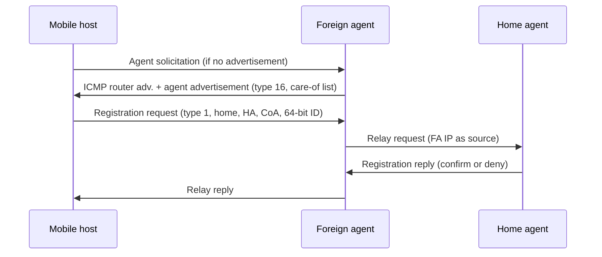

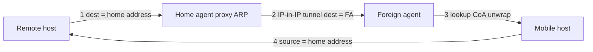

### Key terms

| Term | Meaning in this lecture |
|------|-------------------------|
| Home address | Permanent address tying the host to its home network |
| Care-of address | Temporary address on the foreign network |
| Collocated care-of address | Care-of address when the mobile host is its own foreign agent (often via DHCP) |
| Home agent | Application-layer agent, usually a home-network router, that intercepts and tunnels |
| Foreign agent | Application-layer agent on the visited network that delivers tunneled packets |
| Agent advertisement | ICMP router advertisement plus type-16 extension (care-of list on FA) |
| Agent solicitation | ICMP request for an agent when advertisements are missing |
| Proxy ARP | How the home agent impersonates the mobile host on the home LAN |
| Tunneling | Home agent encapsulates the original IP packet to the foreign agent |
| Double crossing (2X) | Remote and mobile on the same net; reply path still detours via home |
| Triangle / dog-leg routing | Remote → home agent → mobile instead of a direct path |
| Binding / warning | Cache CoA at the correspondent; invalidate it after a move |

### Lecture takeaways

- IP prefixes assume a **fixed** attachment point; DHCP renumbering breaks configs, DNS, and **in-flight connections**.
- Mobile IP keeps a **permanent home address** plus a **changing care-of address**, with HA/FA (or a collocated CoA) hiding the move.
- Discovery (ICMP advertisement type **16** / solicitation) then registration (type **1**, lifetime zeros = deregister) then four-path transfer with **proxy ARP** and **IP-in-IP**.
- Transparency is complete for the correspondent — and that is why **2X** and **triangle routing** waste path length.
- Binding caches can shortcut the triangle until the host moves; then the home agent must **warn**.

---

# M37: Cloud Computing Architecture

**Source:** https://www.youtube.com/watch?v=-Ig-ll_3kAk
**Instructor / expert:** Dr. Sunil Kumar, Department of Electrical and Computer Engineering, Punjab Agricultural University, Ludhiana

### Learning objectives

- Define cloud computing versus local storage and versus a “simple remote machine.”
- Recite the essential characteristics without which, the lecture says, a service is not a cloud.
- Contrast private, public, community, and hybrid deployment, including cloud bursting.
- Distinguish SaaS, PaaS, and IaaS (SPI) with the examples given (CRM, App Engine, Azure, AWS).
- Draw the four-layer architecture and state which layers fall under SLAs.

### Core concepts

In simple terms, cloud computing means **storing and accessing data and programs over the Internet from a remote location or computer**, instead of the local hard drive. That remote location has properties such as **scalability and elasticity** that make it **significantly different from a simple remote machine**. The **cloud is a metaphor for the Internet**.

Storing or running a program on the **local hard drive** is **local storage and computing**. To count as cloud computing, data or programs must be accessed **over the Internet**. The end result can look the same, but with an online connection it can be done **anywhere, anytime, and by any device**.

IT and business resources — **servers, storage, network, applications, and processes** — can be **dynamically provisioned** to user needs and workload. A cloud can provision and support a **grid**, and also **non-grid** environments such as a **three-tier web architecture** running traditional or **Web 2.0** applications.

Cloud computing is a mechanism of **hiring computing power or infrastructure** at organizational or individual level **to the extent required**, **paying only for consumed services**. Security can be added while accessing those remote resources. Figures show several applications: the cloud is **Internet-based computing resources**, reached through **secure connectivity**.

It is growing especially among **individuals and SMEs**. It comes into focus when one asks what computing resources and IT solutions are required: a way to **increase capacity or add capabilities on the fly** without investing in new infrastructure, training new personnel, or licensing new software.

#### Essential characteristics

The instructor stresses the word **essential**: if **any** of these is missing, **it is not cloud computing**. The spoken list overlaps NIST-style wording; all of the named properties are below.

**On-demand self-service.** Flexibility to **self-provision** resources according to customer demand **without being aided by any human**.

**Network / broad network access.** Heterogeneous network access for **mobile clients** and other computer models. Resources are reachable **from anywhere**: a **browser**, a **desktop application** designed for them, or a **mobile device**. A popular application model cited: **iPhone apps** that communicate with a cloud-based backend.

**Resource pooling (elastic / location-independent).** Provider resources are **pooled** to serve multiple consumers in a **multi-tenant** model. Physical and virtual resources are **dynamically assigned and reassigned** by demand. The customer generally has **no control or knowledge of the exact location**, but may specify location at a **higher abstraction** (countries, regions). Examples of pooled resources: **storage, processing, memory, network bandwidth**. To the consumer, capacity often appears **unlimited** and purchasable in **any quantity at any time**. Resources are aggregated irrespective of consumer geolocation.

**Rapid elasticity.** Manage pools **on demand**: take what is needed and **free resources** when the situation changes.

**Measured service.** Metering **controls, monitors, and reports** resource use. Audited reports for provider and consumer show **how much disk was used**, which services were accessed, and **for how many hours**. Companies **pay only for what they use** — cost-efficient. Use can be monitored, controlled, and reported with **transparency** for both sides.

#### Deployment models

Deployment models describe **how** cloud services are made available, depending on organizational structure and **where** data and services are provisioned. Four forms:

| Model | Also called / shape | As taught |
|-------|---------------------|-----------|
| **Private** | Internal cloud | Platform on a **cloud-based secure environment** behind a **firewall**, under the **corporate IT department**. Only **authorized users**; the organization has **direct control over data**. Physical computers may be hosted **internally or externally**, but resources come from a **distinct pool**. Suited to **dynamic, mission-critical** needs, security, management, and **uptime**. Can **evade some public-cloud security obstacles**, but remains prone to **natural disaster** and **internal data theft**. What “counts” as private is **hard to define** because service mixes vary |
| **Public** | “True” cloud hosting | Services over a network **open for public usage**. Customers have **no distinguished control** over infrastructure location. Technically, structure may differ **little** from private cloud except **security level**. Suited to **load management**, **SaaS-style** hosted apps, and apps **many users consume**. Lower capital and operating cost; dealer may be **free** or **pay-per-user license**; cost **shared**, **economies of scale**. Example of a free public cloud: **Google** |
| **Community** | Shared by a community | Mutually shared among organizations in a particular community — example: **banks and trading firms**. Members share similar **privacy, performance, and security** concerns and business objectives. Managed **internally or by a third party**; hosted **externally or internally**. Cost shared inside the community → **cost saving** |
| **Hybrid** | Bound combination | Arrangement of **two or more** clouds (private, public, or community) **bound together** but remaining **individual entities**. Crosses isolation/boundaries so it cannot be simply labeled public, private, or community. Lets users increase capacity by **aggregation, assimilation, or customization** with another package. Resources in-house **or** external. Workload **exchanges** between private and public as needed |

**Hybrid examples and features**

- **Non-critical** work (development and test) in a **third-party public** cloud; **critical/sensitive** work **internal**.
- **E-commerce site** on a **private** cloud for **security and scalability**; a **brochure site** (security not prime) on a cheaper **public** cloud.
- Demand spikes: extra resources from the public cloud = **cloud bursting**.
- **Big data** retained/processed with sales and business data on private cloud; **analytical queries** on the public cloud because public cloud handles spikes well.
- Hybrid hosting: **scalability, flexibility, and security**, if one overlooks challenges such as **API incompatibility**, **network connectivity issues**, and **capital expenditures**.

Selecting the right hosting type after analyzing business demand lets an organization channel effort into strategy. Cloud hosting has “a lot of potential,” but **selection matters**.

#### Three service-offering models (SPI)

Cloud resources reach customers as:

| Model | Lecture gloss |
|-------|----------------|
| **SaaS** | Software as a Service — applications hosted by a vendor/provider and offered over a network |
| **PaaS** | Platform as a Service — OS and associated services (e.g. **CASE** tools, **IDEs**) for developing solutions **over the Internet without download or install** |
| **IaaS** | Infrastructure as a Service — outsourcing equipment that supports operations: **storage, hardware, servers, networking** |

Also called the **SPI** (Software / Platform / Infrastructure) model.

**Cloud SaaS.** Consumer uses the provider’s applications running on cloud infrastructure (network, servers, OS, storage, even individual application capabilities), with possible **limited user-specific configuration**. Access from various clients via a **thin-client interface** (web browser) or a program interface. Consumer **does not manage or control** the underlying infrastructure. Typical apps: **CRM**, **business intelligence / analytics**, **online accounting**.

**Cloud PaaS.** Consumer **deploys** consumer-created or acquired applications built with languages, libraries, services, and tools the **provider supports**. No control of underlying infrastructure; control of **deployed applications** and possibly **hosting-environment configuration**. A **packaged, ready-to-run** development or operating framework. The PaaS side provides networks, servers, storage, and manages **scalability and maintenance**; client typically **pays for services used**. Examples: **Google App Engine** and **Microsoft Azure**.

**Cloud IaaS.** Consumer **provisions processing, storage, networks, and other fundamental resources** on a **pay-per-use** basis and deploys software including **OS and applications**. No control of the underlying cloud; control of **OS, storage, deployed apps**, and possibly **limited networking components**. Provider **owns** the equipment and handles **housing, cooling, operation, and maintenance**. Example: **Amazon Web Services (AWS)**.

**PaaS vs IaaS:** the difference is **how much control users have**. PaaS lets **vendors manage everything**; IaaS **requires more management from the customer**. If an organization **already has a software package** and wants to **install and run it on the cloud**, it should choose **IaaS instead of PaaS**.

#### Four-layer cloud architecture

The cloud has a **hierarchical** architecture of dependencies and components. It is **completely dependent on the Internet**. Four layers based on **how the user accesses** the cloud:

**Layer 1 — user / client (lowest).** Where the client **initiates connections**. Device may be a **thin client**, **thick client**, **mobile**, or handheld that can access a web application.

- **Thin client:** completely dependent on another system; **very low processing**.
- **Thick client:** ordinary computer with **adequate independent processing**.

A cloud application is often accessed like a web application, but **internal properties differ**. This layer is the **client devices**.

**Layer 2 — network.** Lets users connect; the whole infrastructure **depends on this connection**. For a **public** cloud this is primarily the **Internet**. The public cloud exists in a specific location the user **does not know** (abstract) and can be worldwide. For a **private** cloud, connectivity may be a **LAN**, but the cloud still **depends on that network**. Users typically need a **minimum bandwidth**, sometimes defined by the provider.

This layer does **not** come under **SLA** purview. SLAs **do not** take the Internet connection between user and cloud into account for **QoS**.

**Layer 3 — cloud management.** Software that manages the cloud: a **cloud OS** as interface between **data center and user**, and management software for resources — **scheduling, provisioning, optimization, server consolidation, storage, workload consolidation, internal cloud governance**.

This layer **does** fall under SLAs: delays or discrepancies in provisioning can **violate the SLA** and trigger a **penalty** from the provider. SLAs apply to **private and public** clouds. Popular providers: **AWS** and **Microsoft Azure** (public); **OpenStack** for **private** cloud creation, deployment, and management.

**Layer 4 — hardware resource.** Actual hardware. Public cloud: a **data center** in the back end. Private: a data center (huge interconnected hardware in a location) or a **high-configuration system**. This layer is under SLAs and is the **most important layer governing SLAs**. When a user accesses the cloud it should be available **as quickly as possible** within SLA time; discrepancy means **penalty**. Data centers therefore need **high-speed network connections** and **highly efficient algorithms** to move data from the data center to the manager. A cloud may have **many data centers**; **several clouds can share a data center**.

There can be **loose isolation between layers 3 and 4** depending on how the cloud is deployed.

### Diagrams

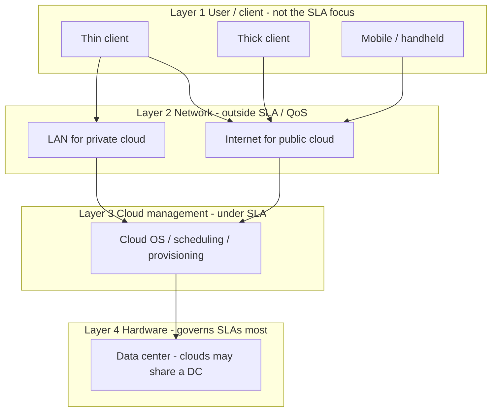

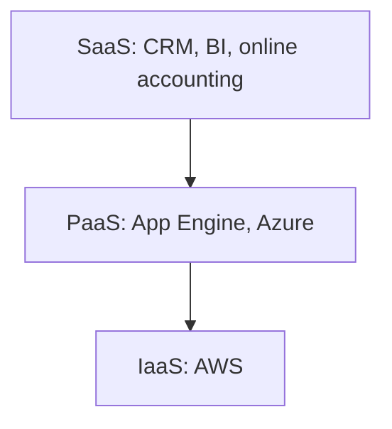

### Key terms

| Term | Meaning in this lecture |
|------|-------------------------|
| Cloud | Metaphor for Internet-based, elastic, metered remote compute — not a simple remote PC |
| On-demand self-service | Customer provisions without a human intermediary |
| Broad network access | Browser, desktop app, or mobile (e.g. iPhone apps) from anywhere |
| Resource pooling | Multi-tenant dynamic assignment; location opaque except region/country |
| Rapid elasticity | Expand and release pools as demand changes |
| Measured service | Metering and audited pay-per-use reports |
| Private / public / community / hybrid | Four deployment models |
| Cloud bursting | Hybrid spike handling by drawing public-cloud capacity |
| SaaS / PaaS / IaaS (SPI) | App / platform / infrastructure service models |
| Thin vs thick client | Dependent low-power vs adequate local processing |
| SLA | Contract whose QoS penalties apply to management and hardware layers, not the user’s Internet path |
| OpenStack | Example stack for private-cloud create/deploy/manage |

### Lecture takeaways

- Cloud is Internet access to pooled, elastic, metered resources — **hire and pay for consumption**, not a new local box.
- **All** listed essential characteristics are required, or it is **not** cloud computing.
- Choose deployment by control and community: private for mission-critical (still disaster/insider-prone), public for scale/cost (Google example), community for shared concerns (banks/traders), hybrid for bursting and mixed sensitivity.
- **SPI:** SaaS uses apps; PaaS deploys onto a vendor-managed stack (App Engine, Azure); IaaS rents raw resources (AWS). Bring-your-own package → **IaaS not PaaS**.
- Four layers from client device to data center; **network is outside SLAs**, **management and hardware are inside**, with hardware affecting penalties most.

---

# M38: Security in Cloud Computing

**Source:** https://www.youtube.com/watch?v=5-6WRtoGJcQ
**Instructor / expert:** Dr. Sunil Kumar, Department of Electrical and Computer Engineering, Punjab Agricultural University, Ludhiana

### Learning objectives

- Define cloud computing security as procedures, processes, and standards spanning physical and logical issues in SaaS/PaaS/IaaS and public/private/hybrid delivery.
- List data-security and virtual-data-center challenges (multi-tenancy, EU privacy, disk wipe standards, loss of visibility, provider insiders, hypervisor I/O).
- Enumerate cloud **network** challenges from guaranteed bandwidth through location-dependent VLANs.
- Explain how security responsibility shifts as capabilities (and risks) are inherited up the SPI stack.
- Detail SaaS, PaaS, and IaaS (especially private-cloud) security issues named in the lecture.

### Core concepts

Security is an important aspect of the cloud environment. **Cloud computing security** is the **set of procedures, processes, and standards** designed to provide **information-security assurance** in a cloud.

It addresses both **physical and logical** security across **software, platform, and infrastructure** service models, and how those services are delivered — **public, private, or hybrid**.

Cloud security is a broad set of constraints from **end-user and provider** perspectives. The end user is primarily concerned with the **provider’s security policy**: **how and when data are stored** and **who has access**. Subsequent sections cover **data security**, **virtualization security**, and issues in **SaaS, IaaS, and PaaS**.

#### Security aspects and research context

Cloud computing places business data in the hands of an **outside provider** and makes **regulatory compliance inherently riskier and more complex** than in-house systems. **Loss of direct oversight** means the client must **verify** that the provider is working to keep data security and integrity **ensured**.

Current security-related research areas taught:

- **Reliable distributed Internet applications** (e.g. **e-commerce**) that rely heavily on a **trust path** among parties.
- Skyrocketing demand for cloud consumer and business apps driving **next-generation data centers** that must be **massively scalable, efficient, agile, reliable, and secure**, so cloud services can scale to **millions of developers** and **billions of end users**.
- Future network-based providers will **leverage virtualization** to allocate the **right levels** of virtualized **compute, network, and storage** to each application from **real-time business demand**, with full SLA assurance of **availability, performance, and security** at reasonable cost — an evolution likened to **scalable telecommunication networks**.

#### Data security

Because of **huge infrastructure cost**, organizations are switching to cloud. Data sit in the **provider’s infrastructure**, **not in the organization’s territory**, which raises complex challenges:

- **Service models with multiple tenants sharing the same infrastructure.**
- **Data mobility** and legal issues relative to rules such as the **European Union data privacy directive**.
- **Lack of standards** on how providers **securely recycle disk space and erase existing data**.
- **Loss of visibility** into key security and operational intelligence that no longer feeds **enterprise IT security intelligence and risk management**.
- A **new type of insider** who **does not even work for your company** but may have **control and visibility into your data**.

#### Data-center / virtualization security

Data are stored **outside the user’s territory** in a **data center whose location is unknown** — a **virtual data center**. Its backbone is **virtual infrastructure / VMs**. Virtual platforms still depend on **often forgotten** physical and virtual data-center components.

There are typically **seven areas of concern** with any major virtual-platform implementation or migration. Issues often **do not appear in staging/testing** and show up only when VMs take on the **same load as physical machines**. Two **cornerstones** of the data center are **network and storage**. Named problems:

**Lack of performance and availability.** Virtualization moves many **I/O tasks tuned for hardware** into software via the **hypervisor**. The virtualization translation layer translates optimized code for the software view to the **physical CPU**.

**Lack of application awareness.** A limitation of **hypervisor- and kernel-based** virtualization: they only virtualize the **OS**. Virtualization is **not aware of applications** on that OS; even the applications **do not realize** they are on virtual hardware above a hypervisor.

**Overflowing storage.** Converting physical machines to VMs helps dynamic data centers, but hard drives become **extremely large flat-file virtual disk images**, and file storage becomes **unmanageable**.

**Congested storage network.** Because OS virtualization is **portable**, data traversing the storage network can **increase dramatically**. Once images are portable it is **trivial** to move VM images across the network from host to host or array to array — the same reason disk files can **overrun physical storage**.

#### Network security in the cloud

The cloud is a network of many things; the network is the **backbone**, and it has challenges:

**Application performance.** A tenant should specify **bandwidth** so hosted apps perform like **on-premises** deployments. Many **tiered** applications need **guaranteed bandwidth** between server instances to finish user transactions in acceptable time and meet **SLAs**. Insufficient bandwidth imposes **significant latency**.

**Flexible deployment of appliances.** Enterprises deploy security appliances — **deep packet inspection**, **intrusion detection systems**, **firewalls** — plus **load balancing, caching, and application acceleration**. In the cloud, the application should still **flexibly exploit** those appliances.

**Policy-enforcement complexity.** **Traffic isolation** and **access control** to end users are among forwarding policies that must be enforced; they **directly impact configuration of each router and switch**.

**Changing requirements.** Different protocols — **OSPF**, **LAG** (link aggregation), **VRRP**, and flavors of **L2 spanning-tree**, plus **vendor-specific** protocols — make it extremely hard to **build, operate, and interconnect** a cloud network **at scale**.

**Application rewriting.** Apps should run **out of the box** as much as possible. For **IP addresses** and **network-dependent failover**, they may need **rewrite or reconfiguration**. Two key issues: (1) **lack of a broadcast-domain abstraction** in the cloud network; (2) **cloud-assigned IP addresses** for virtual servers.

**Location dependency.** Appliances and servers are typically tied to a **statically configured physical network**. A server’s IP is typically determined by the **VLAN or subnet** it belongs to; VLANs/subnets rest on **physical switch-port configuration**. A VM therefore **cannot be easily and smoothly migrated**. Constrained migration **decreases utilization and flexibility**. Mapping VLAN/subnet space to physical ports also **fragments the IP address pool**.

#### Platform-related security and inherited risk

Providers offer **SaaS, PaaS, and IaaS** with varied services and challenges: **secured network**, **locality of resources**, **accessing secure data**, **data privacy**, and **backup policy**.

Cloud computing uses three delivery models to provide **infrastructure resources, application platform, and software**. They play **different levels of security requirements**.

**IaaS is the basis of all cloud services**, with **PaaS built upon it** and **SaaS built upon PaaS**. **Capabilities are inherited — so are information-security issues and risks.** There are trade-offs in **integrated features, complexity versus extensibility, and security**. If the provider secures only the **lower part** of the architecture, **consumers become more responsible** for implementing and managing their own security.

**SaaS** (again): software deployed remotely by the application/service provider, available **on demand over the Internet**. Benefits: **improved operational efficiency** and **reduced costs**. Rapidly emerging as the **dominant delivery model** for enterprise IT services.

**PaaS** sits **one layer above IaaS** and **abstracts everything up to OS, middleware, etc.** It offers developers a **complete SDLC**: planning, design, building, deployment, testing, maintenance — everything else abstracted from the developer’s view.

#### SaaS security issues

In traditional **on-premises** deployment, sensitive data stay **inside the enterprise boundary**, under its **physical, logical, and personnel** security and access-control policies.

SaaS apps are accessed through the **web**, so **web-browser security is very important**. Information-security officers must consider methods of securing SaaS: **web-services security**, **XML encryption**, **SSL**, and other options for **data protection in transit**. That means **strong encryption** and **fine-grained authorization**.

SaaS pain points:

| Issue | Teaching |
|-------|----------|
| **Network security** | Sensitive data in flight must be secured against leakage via strong traffic encryption: **SSL and TLS** |
| **Resource locality** | Users consume services **without knowing exactly where resources are**. **Compliance and data-privacy rules in various countries** make **locality of data** utmost importance in much enterprise architecture |
| **Cloud standards** | Needed across organizations for **interoperability, stability, and security**. Example: one provider’s **storage services may be incompatible** with another’s. Providers may introduce **sticky services** that make **migration** difficult |
| **Data access** | Driven by the **organization’s security policies** (which employees may see which data). The cloud must **adhere** to those policies to avoid unauthorized intrusion. SaaS must be **flexible** enough to incorporate org-specific policies and provide an **organizational boundary** inside a cloud that **hosts many organizations’ processes** |
| **Data breaches** | Data from many users and businesses **lie together**; a breach **attacks all of them**. The cloud is a **high-value target** |
| **Backup** | Vendor must **regularly back up** sensitive enterprise data for **quick disaster recovery**, with **strong encryption** of backups. On **Amazon S3**, **data at rest are not encrypted by default**; users must **separately encrypt** data and backups so unauthorized parties cannot access or tamper with them |

#### PaaS security issues

PaaS is a **ready-to-use platform including OS** on **vendor-provided infrastructure**. Challenges come mainly from **spread of user objects over cloud hosts**. **Stringently allowing object access to resources** and **defending objects against malicious or corrupt providers** reasonably reduce risk.

**Network access and service measurement** raise **secure communications** and **access control**. Well-known practices: **object-scale enforcement of authorization** and **undeniable traceability**.

Additionally: **user privacy** must be protected in a **public shared cloud**, so proposed solutions must be **privacy-aware**. **Service continuity** concerns enterprises considering cloud adoption, so **fault-tolerant, reliable** systems are required.

#### IaaS security issues (especially private cloud)

Cloud promises **flexibility, agility, potential cost savings**, and a competitive edge so developers can **stand up infrastructure quickly**. Private cloud solves **many** problems but is **not that good at solving security problems**. Traditional problems that remain in a **private cloud**:

**Hypervisor security.** Most or all services run virtualized; the hypervisor’s security model **cannot be taken for granted**. **Evaluate security models and hypervisor development**.

**Multi-tenancy.** Even if all tenants are from the **same company**, not all may be **comfortable sharing infrastructure** with other internal users.

**Identity management and access control.** Traditional data centers were comfortable with a small set of authentication repositories (**Active Directory** being one of the most popular). Private cloud must handle **authentication and authorization** for the cloud infrastructure, **tenants**, and **delegation of administration** of the cloud fabric.

**Network security.** Many service components communicate only over **virtual network channels**. Accessing that traffic, employing **powerful access controls** (as for physical networks), and controlling **QoS** — a key **availability** issue in the **CIA** model — are major concerns.

#### Combined picture

Combining the **three clouds** (public, private, hybrid) with the **three service-delivery models** gives a complete environment, **interlinked by connectivity devices** and **information-security components**. **Virtualized physical resources, virtualized infrastructure, virtualized middleware platforms, and business applications** are provided as computing services.

**Providers and consumers must maintain and establish computing security at all levels of interfaces** in the cloud architecture.

### Diagrams

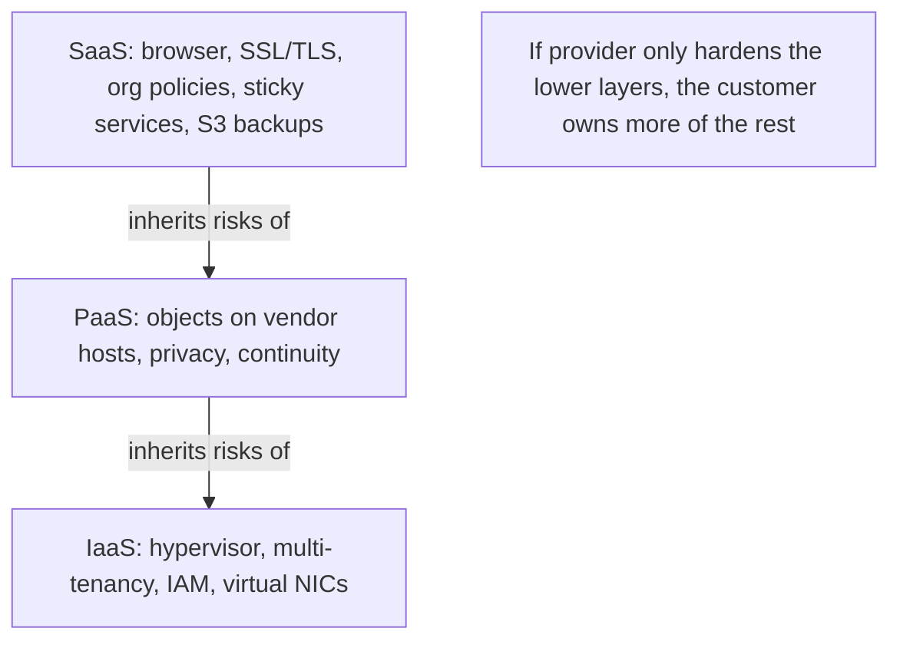

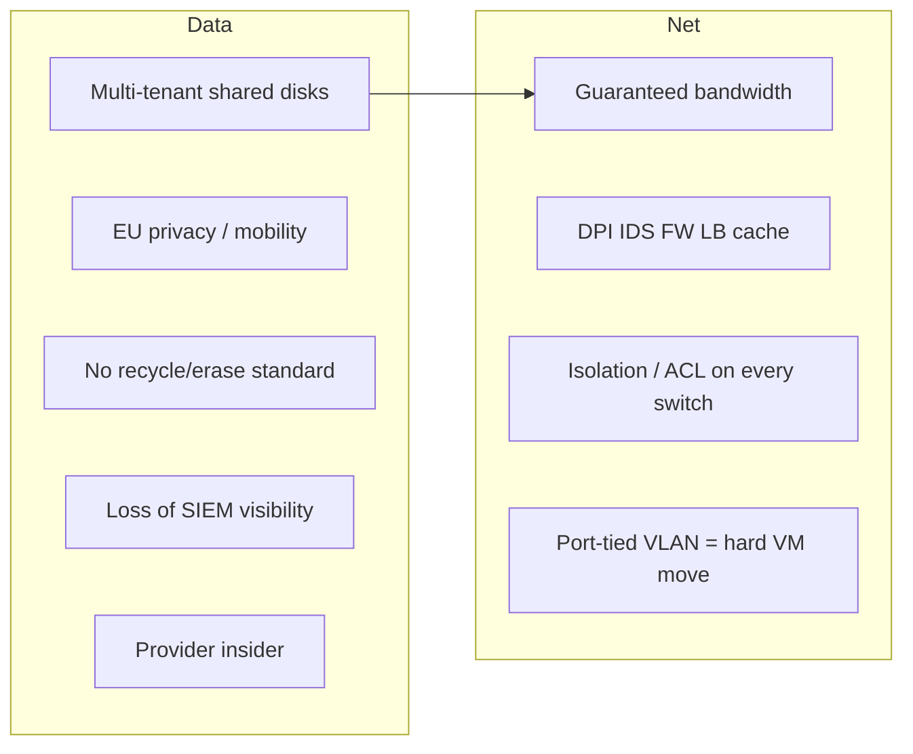

### Key terms

| Term | Meaning in this lecture |
|------|-------------------------|
| Cloud computing security | Procedures, processes, and standards for assurance in cloud environments |
| Trust path | Dependency among parties in Internet applications such as e-commerce |
| New insider | Provider staff who can see/control customer data without being company employees |
| Sticky services | Provider lock-in that makes leaving (e.g. incompatible storage APIs) hard |
| Hypervisor | Translation layer whose I/O and security model must not be assumed safe |
| Broadcast-domain abstraction | Missing cloud-network feature that forces application rewrites |
| XML encryption / WS-Security / SSL / TLS | In-transit protections listed for SaaS |
| Amazon S3 | Example where **data at rest are unencrypted by default** |
| CIA | Confidentiality, integrity, availability — QoS on virtual networks hits **availability** |
| Active Directory | Example traditional authentication repository that private cloud outgrows |

### Lecture takeaways

- Cloud security is **physical and logical**, across **SPI** and **public/private/hybrid**, and must answer **where data live and who can see them**.
- Putting data off-premises raises **multi-tenancy, EU privacy, wipe standards, lost SIEM feeds, and provider insiders**.
- Virtual data centers hide load-time failures: hypervisor I/O, **app-unaware** VMs, huge disk images, and **portable images flooding storage networks**.
- Cloud networks struggle with **SLA bandwidth**, **appliance insertion**, **per-switch policy**, **protocol zoo**, **no broadcast domain**, **cloud IPs**, and **VLAN/port location binding**.
- **Risks inherit up the stack**; the lower the provider’s security cutoff, the more the customer must implement. SaaS adds browser/transit/locality/sticky/backup issues (encrypt S3 yourself); PaaS adds object isolation and privacy; IaaS/private cloud still has **hypervisor, awkward internal multi-tenancy, IAM, and virtual-network CIA**.
- Security is required at **every interface** among virtualized hardware, infrastructure, platforms, and business apps.

---

# M39: GSM Architecture

**Source:** https://www.youtube.com/watch?v=OdtB17eovb4
**Instructor / expert:** Dr. Sunil Kumar, Department of Electrical and Computer Engineering, Punjab Agricultural University, Ludhiana

### Learning objectives

- Place GSM as the dominant 2G digital cellular standard (CEPT GSM → ETSI → 3GPP) and list GSM900 / DCS1800 / PCS1900 bands.
- Partition the network into RSS, NSS, and OSS and name the A, Abis, Um, and O interfaces.
- Identify MS hardware vs SIM identifiers (IMEI, IMSI, PIN/PUK, Ki, Kc, TMSI, LAI).
- Explain MSC, HLR, VLR, EIR, AuC, GMSC, and SMS gateways, including HLR/VLR hierarchy.
- Classify GSM teleservices, bearer services (9.6 kbps, HSCSD, GPRS), and supplementary services (CLIP/CLIR, AoC, CUG, …).

### Core concepts

**GSM (Global System for Mobile Communications)** is a globally accepted standard for **digital cellular** communication. Digital cellular networks are a growing market for mobile and wireless devices. They are **wireless extensions of traditional PSTN or ISDN** and allow **seamless roaming** with the same mobile phone nationally or worldwide. Today they are used mainly for **voice**, but **data traffic is continuously growing**, with several technologies for wireless data on cellular systems.

GSM is the most popular digital system, with about **70% market share**, used by **over 800 million people in more than 190 countries**.

#### History and bands

In the early **1980s** Europe had many **coexisting analog** mobile systems, often similar standards on **slightly different carrier frequencies**. To avoid that for a **fully digital second generation**, **Groupe Spécial Mobile (GSM)** was founded in **1982**. The system was soon named **Global System for Mobile Communications**, with specification in the hands of **ETSI** (European Telecommunications Standards Institute).

In the context of **UMTS** and **3GPP** (Third Generation Partnership Project), GSM development was **transferred to 3GPP** and combined with 3G development. 3GPP **assigned new numbers** to all GSM standards.

Primary goal: a mobile phone system allowing users to **roam throughout Europe**, with **voice services compatible with ISDN and other PSTN systems**. GSM is a typical **2G** system: it **replaced 1G analog** but does **not** offer the high worldwide data rates of **3G (e.g. UMTS)**.

| Name | Band as taught |
|------|----------------|
| **GSM900** | Initially Europe: **890–915 MHz uplink**, **935–960 MHz downlink** |
| **DCS 1800** | GSM at **1800 MHz** — Digital Cellular System 1800 |
| **PCS 1900** | GSM mainly used in the **US at 1900 MHz** — Personal Communications Service 1900 |

#### Three subsystems

GSM has a **hierarchical, complex** architecture of many entities and interfaces. Three subsystems:

| Subsystem | Full name | What the subscriber notices |
|-----------|-----------|-----------------------------|
| **RSS** | Radio Subsystem | **Mobile stations (MS)** and some **BTS antennas** |
| **NSS** | Network and Switching Subsystem | (internal) |
| **OSS** | Operation Subsystem | (internal) |

**Interfaces (as drawn):** RSS connects to NSS via the **A interface** (solid lines) and to OSS via the **O interface** (dashed lines).

- **A interface:** typically **circuit-switched PCM-30**, carrying up to **30 × 64 kbps** connections.
- **O interface:** **Signalling System No. 7 (SS7)** based on **X.25**, carrying **management data** to and from the radio subsystem.

#### Radio subsystem (RSS)

RSS comprises all **radio-specific** entities: **mobile stations** and the **base station subsystem (BSS)**.

A GSM network comprises **many BSS**, each controlled by a **Base Station Controller (BSC)**. The BSS maintains **radio connections to an MS**, **coding/decoding of voice**, and **rate adaptation** to and from the wireless part. A BSS contains several **Base Transceiver Stations (BTS)**.

**BTS.** All radio equipment: **antennas, signal processing, amplifiers**. A BTS can form a **radio cell**, or with **sectorized antennas**, several cells. Connected to the MS via the **Um** interface and to the BSC via the **Abis** interface.

**Um** contains the wireless mechanisms: **TDMA, FDMA, etc.** A GSM cell can measure between some **100 m and 35 km**, depending on the environment.

**BSC.** Manages the BTS: **reserves radio frequencies**, handles **handover from one BTS to another within the BSS**, **pages** the MS, and **multiplexes radio channels onto the fixed network** at the **A interface**.

**Mobile station (MS).** The cell/mobile phone the user sees. Size has fallen while functionality has risen; time between charges has increased. Two main elements: **main hardware** and the **SIM**.

Hardware includes display, case, battery, and electronics for generating/processing the received and transmitted signal. It also contains the **International Mobile Equipment Identity (IMEI)**, installed at **manufacture** and **cannot be changed**. The network accesses it during **registration** to check whether the equipment was **reported stolen**.

The **SIM (Subscriber Identity Module)** identifies the **user** to the network. It holds identifiers and tables: **card type, serial number, list of subscribed services, PIN, PIN Unblocking Key (PUK), authentication key Ki**, and **IMSI (International Mobile Subscriber Identity)**.

- **PIN** unlocks the MS. **Wrong PIN three times locks the SIM**; then **PUK** is needed.
- While logged on, the MS stores **dynamic** information: cipher key **Kc**, and location information — **TMSI** (Temporary Mobile Subscriber Identity) and **LAI** (Location Area Identification).

Typical transmit power: up to **2 W** for **GSM900**; **1 W** is enough for **GSM1800** because of **smaller cell size**.

Besides the telephone interface, an MS can offer display, loudspeaker, microphone, programmable soft keys, computer/modems, or **Bluetooth**. Vendor-specific extras: cameras, fingerprint sensors, calendars, address books, games, Internet browsers. **PDAs** with mobile-phone functions exist. An MS can also be **integrated into a car** or used for **location tracking of a container**.

#### Network and Switching Subsystem (NSS)

The **heart** of GSM. NSS **connects the wireless network with standard public networks**, performs **handovers between different BSS**, **worldwide localization**, and supports **charging, accounting, and roaming** between providers in different countries. It consists of switches and databases:

**MSC (Mobile Switching Center).** Main element of the core network. Acts like a normal **PSTN/ISDN switching node** plus mobility functions. Sets up connections to other MSCs and to BSCs via the **A interface**; forms the **fixed backbone**. An MSC manages **several BSCs** in a geographical region: **registration, authentication, call location, inter-MSC handovers, call routing** to a mobile subscriber. Interface to **PSTN** (landline), to other MSCs (other networks), and to **public data networks (PDN)** such as **X.25**. Handles signaling for **connection setup, release, and handover to other MSCs**.

**HLR (Home Location Register).** **Most important database.** Stores all user-relevant information:

- **Static:** **MSISDN** (Mobile Subscriber ISDN number), subscribed services (e.g. **call forwarding, roaming restrictions, GPRS**), **IMSI**.
- **Dynamic:** current **location area** of the MS, **MSRN** (Mobile Station Roaming Number), current **VLR and MSC**.

When the MS **leaves its current LA**, HLR is **updated**. At switch-on the phone **registers**, so the network knows which **BTS** it uses and can **route incoming calls**. Even when not in a call but **switched on**, it **re-registers periodically** so the HLR has the latest position — necessary to **localize a user anywhere** in GSM. Each user’s data exist **once**, in a **single HLR**, which also supports **charging and accounting**. HLRs can manage **several million** customers and are **highly specialized real-time databases**. **One HLR per network**, though it may be **distributed across subcenters**.

**VLR (Visitor Location Register).** Associated with each MSC; a **dynamic** database of users currently in that MSC’s location area (e.g. **IMSI, MSISDN, HLR address**). When a new MS enters an LA, the VLR **copies relevant information from the HLR**. This **HLR/VLR hierarchy avoids frequent HLR updates and long-distance signaling**. The VLR can be separate but is **commonly integral to the MSC** for faster access.

**EIR (Equipment Identity Register).** Decides whether given **mobile equipment** may enter the network, using **IMEI**, checked at registration. (Also described under OSS.)

**AuC (Authentication Center).** **Protected database** containing the **secret key also in the user’s SIM**; used for **authentication and ciphering on the radio channel**. (Also under OSS.)

**GMSC (Gateway MSC).** Point to which a **mobile-terminating call is initially routed without knowledge of MS location**. Obtains the **MSRN from the HLR** based on **MSISDN** (directory number) and routes the call to the **correct visited MSC**. The “MSC” in GMSC is **misleading**: gateway operation does **not** require linking to an MSC.

**SMS gateway (SMSG).** Collective name for two short-message gateways:

| Gateway | Direction |
|---------|-----------|
| **SMS-GMSC** | Short messages **to** a mobile (role similar to GMSC) |
| **SMS-IWMSC** (interworking MSC) | Short messages **originated by** a mobile on that network; fixed access point to the **SMS Center** |

#### Operation Subsystem (OSS)

Necessary functions for **network operation and maintenance**. OSS has its own entities and accesses others via **SS7**. Connected to components of **NSS and the BSC**. Used to **control and monitor** the overall GSM network and the **traffic load of the BSS**. As BTS count scales with subscribers, some maintenance tasks move to the **BTS** to save cost of ownership.

**OMC (Operation and Maintenance Center).** Monitors and controls all other entities via the **O interface**. Typical functions: **traffic monitoring, status reports, subscriber and security management, accounting and billing**. Uses the **Telecommunications Management Network (TMN)** concept standardized by the **ITU**.

**AuC (again, OSS view).** Because the radio interface and MSs are particularly vulnerable, a separate AuC protects **user identity and data transmission**. It contains **authentication algorithms** and **encryption keys**, and **generates values needed for user authentication in the HLR**. It may sit in a **special protected part of the HLR**.

**EIR (again, OSS view).** Database of all **IMEIs** registered for the network. Mobiles can be **easily stolen**; with a **valid SIM**, anyone could use a stolen MS. EIR has a **blacklist** of stolen or locked devices. **Blacklists of different providers are not usually synchronized**, so **illegal use in another operator’s network is possible**. EIR also has a **whitelist** of valid IMEIs and a **grey list** of **malfunctioning** devices.

#### GSM services

GSM offers more than voice telephony; ask the local operator which services are available. Three basic types:

**Teleservices (T services).** Use bearer-service abilities to transport data.

- **Voice calls:** most basic T service — **telephony**, including **full-rate speech at 13 kbps** and **emergency calls** (nearest emergency provider via **three digits**).
- **Videotex and facsimile:** videotext access, **teletex**, fax, alternate speech and automatic faxing.
- **Short text messages (SMS):** send/receive text on the GSM phone; also news, sports, financial, language, and **location-based** data.

**Bearer services (data services).** Used through a GSM phone to send/receive data — the building block toward **mobile Internet** and mobile data transfer. GSM currently **9.6 kbps**. Newer developments: **HSCSD** (High-Speed Circuit-Switched Data) and **GPRS** (General Packet Radio Service), now available.

**Supplementary services.** Additional to T and bearer services: **caller identification, call forwarding, call waiting, multi-party conversations, barring of international outgoing calls**, among others.

| Supplementary service | Meaning as taught |
|----------------------|-------------------|
| **Conferencing** | Multi-party conversation (**three or more**); only for normal telephony |
| **Call waiting** | Notify of an incoming call during a conversation; answer, reject, or ignore |
| **Call hold** | Put an incoming call on hold and resume; normal telephony |
| **Call forwarding** | Divert from original recipient to another number; usually set by the subscriber, e.g. when not available |
| **Call barring** | Restrict certain **outgoing** calls (e.g. ISD) or stop incoming from undesired numbers; flexible **conditional** barring |
| **CLIP** | Calling Line Identification Presentation — show caller’s number |
| **CLIR** | Calling Line Identification Restriction — caller hides number |
| **COLP** | Connected Line Identification Presentation — calling party sees the **number actually connected** (useful when **forwarded**) |
| **COLR** | Connected Line Identification Restriction — called party hides number; **normally overrides** presentation |
| **Malicious call identification** | Combat obscene or annoying calls; subscriber causes unknown malicious calls to be **identified in the GSM network** with a simple command |
| **AoC (Advice of Charge)** | Indicate cost of services used; rental/providers without the user’s own SIM can use a slightly different form; **AoC for data calls is time-based** |
| **CUG (Closed User Group)** | Groups who wish to **call only each other and no one else** |

### Diagrams

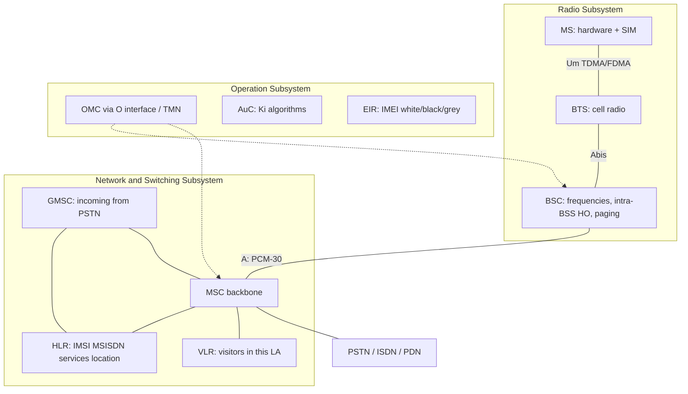

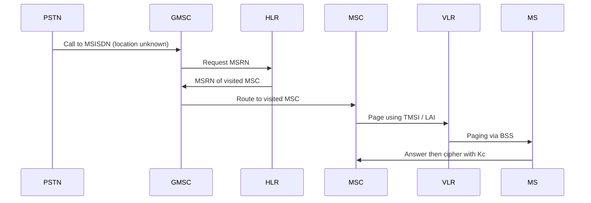

### Key terms

| Term | Meaning in this lecture |
|------|-------------------------|
| GSM | 2G digital cellular; ~70% share; 800+ million users in 190+ countries |
| RSS / NSS / OSS | Radio, switching, and operation subsystems |
| Um / Abis / A / O | MS–BTS radio; BTS–BSC; BSS–MSC (PCM-30); management (SS7/X.25) |
| IMEI / IMSI | Equipment identity (in hardware) vs subscriber identity (on SIM) |
| PIN / PUK / Ki / Kc | Unlock SIM; unblock after 3 PIN fails; auth key; cipher key |
| TMSI / LAI | Temporary subscriber ID and location-area ID stored while camped |
| HLR / VLR | Permanent user DB vs per-MSC visitor copy (cuts long-distance signaling) |
| AuC / EIR | Auth/cipher secrets; IMEI white/black/grey lists (blacklists not shared across operators) |
| GMSC / SMS-GMSC / SMS-IWMSC | Incoming voice routing; SMS toward MS; SMS from MS |
| Teleservice / bearer / supplementary | Speech/SMS/fax; 9.6 kbps data path (HSCSD, GPRS); extras like CLIP and CUG |
| MSISDN / MSRN | Directory number vs routing number obtained from HLR |

### Lecture takeaways

- GSM is Europe’s answer to fragmented analog 1G: **one digital 2G** under ETSI then **3GPP**, built to **roam** with **ISDN-like voice**, later band-extended as GSM900 / DCS1800 / PCS1900.
- Users only see **MS + BTS antennas**; the real machine is **RSS (Um/Abis) + NSS (A, HLR/VLR/MSC) + OSS (O, TMN)**.
- Identity splits: **IMEI** (stolen phone) vs **IMSI/SIM** (stolen credentials); **VLR copies HLR** so the home database is not hit on every local event.
- Incoming calls go **GMSC → HLR (MSRN) → visited MSC**; SMS has analogous **GMSC/IWMSC** pair.
- Services stack as **teleservices (13 kbps speech, SMS, fax)**, **bearers (9.6 kbps, then HSCSD/GPRS)**, and a long list of **supplementary** controls (CLIP/CLIR, barring, CUGs, AoC).
- EIR blacklists **do not sync between operators**, so a stolen handset may still work on another network.

---

# M40: MANET - I

**Source:** https://www.youtube.com/watch?v=7CR1_FBxJ6o
**Instructor / expert:** Dr Sunil Kumar, Department of Electrical and Computer Engineering, Punjab Agricultural University, Ludhiana
**Course coordinator:** Dr Maninder Singh, Professor and Dean of Academic Affairs, Thapar University, Patiala

### Learning objectives

- Contrast wired networks with wireless networks and name the three wireless types the lecture uses: fixed wireless, wireless with fixed access points, and MANET.
- Define a mobile ad hoc network as an infrastructure-less, IP-based radio network in which nodes act as both hosts and routers.
- List MANET characteristics (autonomous terminals, distributed operation, multi-hop routing, dynamic topology, limited resources and security, scalability, low bandwidth).
- State the open challenges the instructor listed: scalability, routing, QoS, the client–server model shift, security, energy conservation, node cooperation, and interoperation.
- Recall the application families taught: military, home/office/education, VANET, wireless sensor networks, wireless mesh networks, disaster relief, and personal area networks.

### Core concepts

Like traditional **wired** networks, wireless networks are formed by **routers** and **hosts**. Routers forward packets; hosts are sources or **sinks** of data flows. The fundamental difference is how components communicate. A wired network relies on physical cables. In a wireless network, communication between components can be either wired or wireless. Because wireless communication is not constrained by cables, hosts and routers have **freedom to move** — one of the advantages of wireless networking.

#### Three types of wireless network

According to the mobility of hosts and routers, the lecture distinguishes three types:

| Type | How it is formed | Example given |
|------|------------------|---------------|
| **Fixed wireless network** | Fixed hosts and routers use wireless channels to communicate | Fixed devices using **directed antennas**; two computers exchanging data via antenna signals |
| **Wireless network with fixed access points** | Mobile hosts use wireless channels to talk to **fixed access points**, which may act as routers | Laptop users in a building accessing fixed APs |
| **Mobile ad hoc network (MANET)** | Formed by **mobile hosts**, some of which forward packets for neighbours | **Vehicle-to-vehicle** and **ship-to-ship** networks using peer-to-peer routing |

In the ship example, all ships create a network **without any centralized administration**; a node can establish a link with any other node in range.

#### What a MANET is

A MANET is an **infrastructure-less, IP-based** network of mobile wireless machines connected by **radio**. Nodes have **no centralized administration**. It is a **routable** network: **each node acts as a router** and forwards traffic toward a specific destination. Mobiles and laptops can form such a network among themselves.

In the simplest case, nodes communicate **directly** when they are within wireless transmission range. Ad hoc networks must also support communication between nodes that are only **indirectly** connected by a series of wireless **hops** through other nodes. In the lecture’s figure, nodes **A** and **C** are not in each other’s radio circles, so the network must enlist **node B** to relay packets. The circles are the **nominal range of each node’s radio transceiver**.

#### Characteristics of MANETs

Compared with wired or infrastructure-based wireless networks, MANETs have the following characteristics (preview list plus the expanded treatment):

**Autonomous terminal.** Each mobile terminal is an autonomous node that may function as a **host or a router**. Besides host processing, nodes perform switching. Endpoints and switches are usually **indistinguishable**.

**Distributed operation.** There is no background network for central control. Control and management are **distributed among the terminals**. Nodes must **collaborate**; each acts as a **relay** as needed to implement functions such as **security and routing**.

**Multi-hop routing.** Ad hoc routing can be **single-hop or multi-hop**, based on link-layer attributes and routing protocols. Single-hop MANETs are simpler in structure and implementation. When the destination is **outside direct wireless range**, intermediate nodes must forward packets.

**Lightweight terminals.** Nodes are typically mobile devices with **less CPU**, **small memory**, and **low power storage**. They need **optimized algorithms** for computing and communicating.

**Dynamic topology.** All nodes are free to move, so topology changes **rapidly at unpredictable times**. Links break **much more frequently** than in wired or infrastructure wireless networks.

**Self-organization.** With no infrastructure or central administration, nodes must **form themselves into a network**.

**Multi-hopping.** The wireless channel and limited neighbourhood mean **intermediate nodes relay** packets.

**Resource conservation.** Nodes are limited in **energy supply and processing power**. Power conservation is a major design factor; operations should be optimized to **minimize energy consumption**.

**Limited capacity / limited security.** Mobile ad hoc networks are **more prone to security threats** than wired or infrastructure wireless networks. Each node can function as a router or packet forwarder. **Both legitimate users and malicious attackers** can access the wireless channel, and there is **no well-placed location at which access-control mechanisms can be deployed**.

**Scalability.** Some applications may grow to **several thousand nodes**. MANETs suffer scalability problems in **channel capacity**: capacities are limited, and the maximum is reached faster because of **multi-hopping**. Scalability is **related to the routing protocols** employed.

**Low bandwidth.** These networks have **lower capacity and shorter transmission range** than fixed-infrastructure networks. Wireless throughput is less than wired throughput because of **multipath fading, noise, and interference**.

#### Challenges of MANETs

The instructor listed topics that still need to be resolved: **scalability, routing, quality of service, client–server model shift, security, energy conservation, node cooperation, and interoperation**. The lecture then developed several of these.

**Scalability.** Visionaries often take large-scale “universal computing” as granted, but it is **unclear how such large networks can actually grow**. Ad hoc networks suffer **by nature** from capacity scalability problems.

**Routing.** Routing is non-trivial because of a **highly dynamic** environment. An ad hoc network is a collection of wireless mobile nodes **dynamically forming a temporary network** without pre-existing infrastructure or centralized administration. Nodes come together for a period to exchange information **while continuing to move**, so the network must **continually adapt** and **establish routes among themselves without outside support**.

**Quality of service (QoS).** Heterogeneous Internet applications challenged designers who built networks for **best-effort** service only. **Voice, live video, and file transfer** have vast and diverse requirements. **QoS-aware** solutions are being developed. QoS means the network **guarantees certain performance** for a flow or collection of flows in parameters such as **delay, jitter, bandwidth, and packet-loss probability**. Despite research, QoS in ad hoc networks is still described as an **unexplored area**.

**Client–server model shift.** On the Internet a client is typically configured to use a **server** (found automatically or by static configuration). In ad hoc networks the structure **cannot be defined by collecting IP addresses into subnets**. There may be **no servers**, yet demand remains for basic services: **address allocation, name resolution, authentication, and service location**. Their location is **unknown and changes dynamically**. A **different addressing approach** may be required, and it is still not clear **who manages** various network services. Shifting away from the traditional client–server model **remains to be appropriately addressed**.

**Security.** Applications such as **military** and **confidential meetings** need a high degree of security against enemies and **active and passive attackers**. Ad hoc networks are **particularly prone to malicious behaviour**. Lack of centralized network management or a **certification authority** in these dynamically changing wireless structures is framed as a **major roadblock to commercial application**.

**Interoperation.** When two autonomous ad hoc networks move into the **same area**, interference is unavoidable and the networks would need to **recognize the situation and merge**. Joining two networks is **not trivial**: they may use different **synchronization**, or even different **MAC or routing protocols**. Security is a major concern. Example: a **military unit** moving into an area covered by a **sensor network** — the unit might use a routing protocol with **location information**, while the sensor network uses a **simple static routing protocol**.

**Energy conservation** and **node cooperation** were named on the challenge list alongside the topics above.

#### Applications

MANETs are best where infrastructure is **unavailable** or **not cost-effective**.

**Military.** Satisfies needs such as **battlefield survivability**. Setting up infrastructure among soldiers may be impossible. Wireless devices carried by **soldiers, tanks, helicopters, and other vehicles** form a MANET for message passing.

**Home, office, and education.** The simplest application is networking **laptops, PDAs, and other WLAN-enabled devices** in the **absence of a wireless base station**. A **personal area network (PAN)** class example is **wire replacement**: in **Bluetooth**, peripheral devices connect to a computer over wireless Bluetooth links. Ad hoc networks can **stream video and audio** among wireless nodes without a base station — e.g. students obtaining class material from a professor’s laptop as class progresses. Other educational uses: **universities and campus settings, virtual classrooms, ad hoc communications during meetings or lectures**.

**Vehicular ad hoc networks (VANETs).** Responsible for communication between moving vehicles. A vehicle may talk to another vehicle directly (**vehicle-to-vehicle, V2V**) or to infrastructure such as a **roadside unit (RSU)** (**vehicle-to-infrastructure, V2I**).

**Wireless sensor networks (WSNs).** Treated as a **special case of MANET with reduced or no mobility**. Initially motivated by **military** applications; civilian domains include **environmental and space monitoring, disaster management, smart home, production, and healthcare**. WSNs may consist of **heterogeneous and mobile** sensor nodes. Topology may be as simple as a **star**. Scale and density vary by application. Figured applications: disaster management, network management, home networks, healthcare informatics, and military.

A sensor network is many **tiny, disposable, low-power devices (nodes)** spatially distributed to perform an **application-oriented global task**. Nodes communicate directly or through other nodes. One or more nodes serve as a **sink**, able to communicate with the user directly or through existing **wired** networks. The primary component is the **sensor**, monitoring real-world conditions such as **sound, temperature, humidity, vibration, pressure, motion, pollutants**, and so on at different locations. Nodes **sense, process, and communicate** in a **self-organizing**, battery-powered network.

**Wireless mesh networks (WMNs).** Can connect entire cities using inexpensive existing technology. Traditional networks rely on a small number of **wired access points or wireless hotspots**. In a mesh, the connection is spread among **dozens or hundreds of mesh nodes** that talk to each other to share connectivity across a large area. Mesh nodes are small radio transmitters that function like **wireless routers**. They use common **Wi-Fi** standards **IEEE 802.11a, 802.11b, and 802.11g**, on **2.4 GHz and 5 GHz** depending on the physical layer. If **IEEE 802.11a** is used, speed can be up to **54 Mbps**. Nodes are programmed with software that tells them how to interact with the large network. Information hops from node to node; nodes automatically choose the **quickest and safest path** using **dynamic routing**. The lecture figure: an **Internet cloud** as backbone of mesh routers, connected with access points, base stations, and other devices that provide Internet access to users.

**Disaster relief.** Earthquakes and floods destroy lives; loss of Internet connectivity is an increasingly noticeable effect. It is important to **keep networks operating when infrastructure elements are disabled**.

**Personal area networks (PANs).** A computer network for data among **computers, telephones, and PDAs**, consisting of nodes associated with a **single person** (clothes, belt, handbags). Flexibility examples: send a document to a printer upstairs while sitting on a couch with a laptop; upload a photo from a cell phone to a desktop.

The instructor closed by pointing to the **next lecture on MANET routing protocols**.

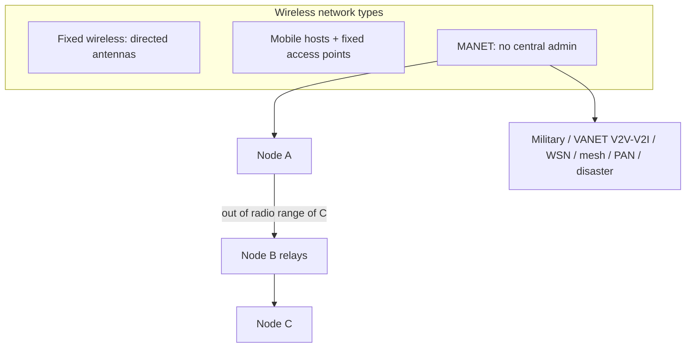

### Key terms

| Term | Meaning in this lecture |
|------|-------------------------|
| MANET | Infrastructure-less, IP-based radio network of mobile nodes that route for one another |
| Access point | Fixed infrastructure node that mobile hosts associate with in the non-ad-hoc wireless type |
| Multi-hop | Relaying through intermediate nodes when source and destination are not in direct range |
| Dynamic topology | Unpredictable, rapid link change because nodes move freely |
| QoS | Guaranteed performance for a flow: delay, jitter, bandwidth, packet-loss probability |
| VANET | Vehicular ad hoc network; V2V between vehicles, V2I via roadside units |
| WSN | Sensor-node network treated as a low-mobility special case of MANET, with sink nodes |
| Wireless mesh | Many 802.11a/b/g mesh routers sharing an Internet connection by dynamic hop-by-hop routing |
| PAN | Person-centred short-range network, including Bluetooth wire-replacement |

### Lecture takeaways

- Wireless freedom of movement yields three classes; MANET is the infrastructure-less extreme.
- Every MANET node is potentially a host **and** a router; A–C communication may require B.
- Design is dominated by dynamics, scarce energy/CPU/bandwidth, and the absence of a place to hang access control.
- Routing, QoS, naming/addressing without servers, security without a CA, and merging dissimilar networks are still open.
- The same idea covers battlefields, classrooms, vehicles, sensors, city-scale meshes, disasters, and PANs.

---

# M41: MANET – Routing Protocols

**Source:** https://www.youtube.com/watch?v=9eNSUh66Zag
**Instructor / expert:** Dr Sunil Kumar, School of Electrical Engineering and Information Technology, Punjab Agricultural University, Ludhiana
**Course coordinator:** Dr Maninder Singh, Professor and Dean of Academic Affairs, Thapar University, Patiala

### Learning objectives

- Define what a routing protocol does in a MANET and why metrics and information exchange matter under changing conditions.
- Distinguish **reactive (on-demand)**, **proactive (table-driven)**, and **hybrid** routing, including the bandwidth and latency trade-offs the lecture stated.
- Explain **AODV** (RFC 3561): RREQ / RREP / RERR, expanding-ring TTL, sequence numbers, precursor lists, and the three RERR circumstances.
- Explain **OLSR** as a proactive protocol that uses **multipoint relays (MPRs)**, Hello-based neighbour sensing, MPR flooding, topology-control (TC) messages, and Dijkstra shortest paths.
- Explain **TORA** as a hybrid protocol that builds a **DAG** of **heights** using QUERY, UPDATE, and CLEAR, with route creation, five maintenance cases, and route deletion.

### Core concepts

A **routing protocol** is the relationship or formula routers use to find a suitable path for forwarding data. It also supports **exchange of information between routers** and helps the network **adjust to variable conditions**. In other words, it is the **implementation of a routing algorithm in software or hardware**. Protocols use **different metrics** to choose the path that transfers a packet across the network.

#### Three types of MANET routing protocol

**Reactive routing protocols** are **on-demand**. They are invoked when needed, and routes are built then. Routes can be acquired by sending a **route request** through the network. The stated disadvantage is **high latency** in searching the network.

**Proactive routing protocols** **build and maintain routing information about all nodes**, **independent of whether a route is currently needed**. **Control messages are transmitted periodically** even if there is **no data flow**, so they are **not bandwidth-efficient**. Advantage: nodes can **easily get routing information and start a session**. Disadvantages: nodes keep **too much data for route maintenance**, and **recovery after a particular link failure is too slow**.

**Hybrid routing protocols** combine benefits of both. Routing **initiates using proactive pre-planned routes**; extra demand is then handled by **reactive flooding**. This methodology is suitable only in situations where **traffic demand and the number of nodes can be determined beforehand**.

The lecture then developed three named protocols: **AODV** (reactive), **OLSR** (proactive), and **TORA** (hybrid).

#### AODV — Ad hoc On-Demand Distance Vector

AODV is a **reactive** protocol that **sets up routes on demand**. If a node wants to communicate with a node for which it has **no route**, the protocol tries to establish one. It is described in **RFC 3561**.

As with all reactive protocols, **topology information is transmitted by nodes only on demand**. When a node wishes to send traffic to a host with no route, it generates a **route request (RREQ)** that is **flooded in a limited way**. Control-traffic overhead is therefore **dynamic**, and there is an **initial delay** when starting communication.

A route is considered **found** when the RREQ reaches **either the destination itself** or an **intermediate node with a valid route entry** for the destination. For as long as a route exists between two endpoints it is used; if the node remains passive when the route becomes **invalid or lost**, AODV **issues a request again**.

AODV defines **three control messages** for route maintenance:

**RREQ (route request).** Transmitted by a node that needs a route. As an optimization, AODV uses an **expanding-ring** technique when flooding. Every RREQ carries a **time-to-live (TTL)** stating **how many hops** the message should be forwarded. TTL starts at a **predefined value** on first transmission and is **increased on retransmissions**. Retransmissions occur if **no replies** are received.

RREQ frame fields taught: **source address, source sequence, broadcast ID, destination address, destination sequence, hop count**.

**RREP (route reply).** **Unicast** back to the originator of the RREQ if the receiver **is the requested address** or **has a valid route** to it. Unicast is possible because **every node forwarding an RREQ caches a route back to the originator**.

RREP fields taught: **source address, destination address, destination sequence, hop count, lifetime** (how long a path can be used).

**RERR (route error).** Nodes monitor the **link status of next hops in active routes**. When **link breakage** on an active route is detected, a RERR notifies other nodes of the loss. To enable this, each node keeps a **precursor list**: IP addresses of neighbours **likely to use it as next hop** toward each destination.

**Worked example (four nodes).** Circles are communication range; each node can talk only to neighbours. Node **1** wishes to send to node **3**. Neighbours of 1 are **2 and 4**. Node 1 **cannot** reach 3 directly, so it sends an RREQ, heard by 4 and 2. A node that receives RREQ either (a) **knows a route to the destination or is the destination** and sends an RREP, or (b) **rebroadcasts** RREQ to its neighbours. Rebroadcast continues until the **lifespan** is up. If node 1 gets **no reply in a set time**, it rebroadcasts with a **longer lifespan** and a **new ID**. **Sequence numbers** in the RREQ ensure nodes **do not rebroadcast the same request**. In the example, **node 2 has a route to 3 and replies**; **node 4 does not**, so it rebroadcasts. When a node sees an RREP whose route has a **better sequence number** than its routing list, it **replaces** its current route with the one in the RREP.

**When RERR is broadcast (three circumstances):**

1. The node receives a **data packet it is supposed to forward** but has **no route** to the destination — the real problem is that **some other node thinks the correct route is through this node**.
2. The node receives a RERR that **invalidates at least one of its routes**; it then sends a RERR naming the **newly unreachable** destinations.
3. The node **detects it cannot communicate with a neighbour**; it marks routing-table entries that use that neighbour as next hop **invalid**, then sends a RERR with the neighbour and the invalid routes.

Whenever a node receives a RERR it **looks at the routing table and removes all routes that contain the bad nodes**.

#### OLSR — Optimized Link State Routing

OLSR is a **proactive**, **table-driven** protocol: it **permanently stores and updates** its routing table so a route can be provided if needed. It can be implemented in **any ad hoc network**. Nodes collaborate by **periodically exchanging topology information**.

OLSR uses **multipoint relays (MPRs)** to **avoid unnecessary broadcast retransmissions**. A node periodically broadcasts a message to neighbours to **compute the MPR set** and exchange neighbourhood information. From neighbourhood information it calculates the **minimum set of one-hop relays needed to reach all two-hop neighbours** — that set is the **MPR set**.

OLSR differs from classical **link-state** protocols in two dissemination factors:

1. **Only the MPR nodes of a node A** need to forward link-state updates issued by A.
2. The **size of A’s link-state update is reduced** because it consists only of neighbours that **selected A as their MPR**.

Thus OLSR **reduces** link-state protocol overhead. It is used where nodes are **densely deployed**. It calculates the **shortest path** to an arbitrary destination.

**Functions of OLSR:**

**Neighbour sensing.** Each node must certify the **nature of its link** with neighbours because of radio transmission. OLSR specifies two link types: **symmetric** and **asymmetric**. Each node sends **Hello** messages at a Hello interval to one-hop neighbours for neighbour sensing; Hellos **are not forwarded**. A Hello contains the **neighbour list and link status**, which allows reduction of the **two-hop neighbour** set and their status. **MPR selection** is then made and the list is added into Hello messages. Using this MPR list, an **MPR selector list** is constructed: neighbours that **selected this node as MPR**. Messages received from **MPR selectors will be forwarded**.

**MPR flooding.** The aim is to **control traffic flooding**. MPRs are selected so that a flooding message transmitted by the MPR set **reaches all two-hop neighbours**. The MPR set of node *n* is the **smaller subset of symmetric one-hop neighbours of *n*** that have **symmetric links with *n*’s two-hop neighbours**. MPR flooding **eliminates transmission duplication** and **minimizes reception duplication**.

**Topology diffusion.** The objective is to **create routing tables** using periodic **topology control (TC) messages**. TC messages are circulated by each node with a **non-empty MPR selector set** to all network nodes, advertising at least the **links between itself and nodes in its MPR selector set**. TC messages contain enough information for nodes to **construct a topology table** and then **derive a routing table**. Routes use a **shortest-path algorithm such as Dijkstra**, providing the **best possible hop count**. Routing tables must be **recalculated** whenever neighbour-link or topology information changes.

#### TORA — Temporally-Ordered Routing Algorithm

TORA is a **hybrid** routing protocol, presented as effective against MANET limitations caused by **high node mobility**. **Congestion** is a major MANET problem. Traditional **shortest-path**, **adaptive shortest-path**, and **link-state** routing **cannot work properly** with mobile stations; it is difficult to update every dynamic node’s routing tables.

Each node **broadcasts a query packet**; recipients broadcast an **update** packet. TORA supports **loop-free multiple routes** using a **flat, non-hierarchical** algorithm and provides **better scalability**. To discover a route it uses a **DAG (directed acyclic graph)** and a set of **totally ordered heights**. Information may flow in **only one direction** (unidirectional), so there is **no chance of an infinite loop**.

Three basic operations: **route creation, route maintenance, route deletion**. Three control packets: **QUERY, UPDATE, and CLEAR**.

**Route creation.** QUERY and UPDATE create a new route. A QUERY carries a **destination ID**. An UPDATE holds **destination ID and height** of the node. Each node maintains a **route-required flag** (initially unset) and the **time of broadcast of the last UPDATE**.

When a node has **no directed link** and an **unset** route-required flag, it **broadcasts QUERY** to neighbours and **sets** the flag. On receiving QUERY:

- If there is **no downstream link** and the flag is **unset**: **rebroadcast QUERY** and set the flag.
- If there is **no downstream link** and the flag is **already set**: **discard** the QUERY.
- If there is at least one downstream link with **null height**: **set its height** and **broadcast UPDATE**.
- If there is at least one downstream link with **non-null height**: compare the time of last UPDATE broadcast with the time the link over which QUERY arrived became active; when the link becomes active, **broadcast UPDATE** and **discard QUERY**. If the route-required flag is set, **broadcast QUERY**.

When a node receives UPDATE it updates height-array entries:

- If the route-required flag is **set**: set height, update all link-state-array entries, **unset** the flag, **broadcast UPDATE** with the new height.
- If the flag is **not set**: just update the link-state array and apply **route-maintenance** techniques.

**Route maintenance.** TORA maintains routes after **topological change** and **re-establishes routes within a finite time**. Maintenance is needed when a node’s height is **non-null**. A neighbour with **null** height is **not considered**. Five cases:

| Case | Name | Taught meaning |
|------|------|----------------|
| 1 | Generate new reference level | Link failure: node lost its **last downstream** link. If it has an **upstream** neighbour it **updates its reference value**; otherwise it **sets height to null**. |
| 2 | Propagate the highest neighbour’s reference level | If the node has **no downstream link**, it **propagates the reference level to upstream neighbours**. |
| 3 | Reflect back a higher sub-level | After **link reversal**, if downstream links fail, the node **reflects back the reference height** with the **reflection bit** set. |
| 4 | Partition detection | If the set reference value **equals** neighbours’ reference height, the node has **detected a partition**, **raises the route**, and **sets height to null**. |
| 5 | Generate new reference level | New reference value when the node experienced a **link failure between propagation of a reference level and reflection of a sub-level**. |

**Route deletion.** In case 4 of maintenance, a node sets height from the **direction of edges toward the destination**, updates the link-state array, and **broadcasts a control packet** (CLEAR). On receiving it:

- If the **reference level matches**, the node sets its height and **sets height for each neighbour to null**, updates link-state arrays, and **broadcasts** the control packet.
- If the reference level **does not match**, it sets height for each neighbour and updates corresponding link-state entries.

At the end, height of each node in the **partitioned** portion is set to **null** and **invalid routes are erased**.

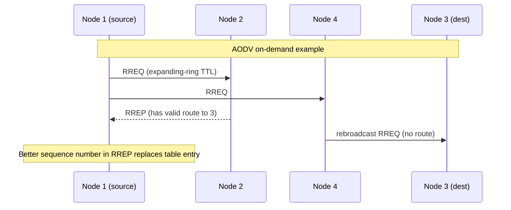

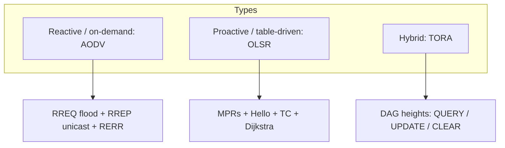

### Key terms

| Term | Meaning in this lecture |
|------|-------------------------|
| Reactive / on-demand | Build a route only when needed; higher search latency |
| Proactive / table-driven | Continuously maintain routes to all nodes via periodic control traffic |
| Hybrid | Proactive backbone plus reactive flooding for extra demand |
| AODV | Ad hoc On-Demand Distance Vector (RFC 3561); RREQ, RREP, RERR |
| Expanding ring | Increase RREQ TTL on retransmission if no reply |
| Precursor list | Neighbours that likely use this node as next hop; used to send RERR |
| OLSR | Optimized Link State Routing; proactive, MPR-optimized link state |
| MPR | Multipoint relay: selected one-hop neighbour that forwards floods to two-hop neighbours |
| TC message | Topology-control advertisement from nodes with a non-empty MPR selector set |
| TORA | Temporally-Ordered Routing Algorithm; DAG of ordered heights, loop-free multiple paths |
| QUERY / UPDATE / CLEAR | TORA control packets for create, maintain, and delete routes |

### Lecture takeaways

- MANET routing is the algorithm-as-protocol that tracks a moving graph with chosen metrics.
- Reactive protocols save bandwidth but pay **initial delay**; proactive protocols start sessions quickly but **waste bandwidth** and recover slowly from failures; hybrid needs **foreknowledge** of size and demand.
- AODV finds a path when RREQ hits the destination or a node with a valid cache, replies along reverse routes, and uses RERR plus precursor lists when links die.
- OLSR shrinks classical link state by letting only MPRs rebroadcast and by advertising only MPR-selector links; Dijkstra then yields hop-shortest routes.
- TORA orients a DAG with heights so traffic is loop-free; QUERY/UPDATE build routes, five cases repair them, and CLEAR erases a partition.

---

# M42: 3G Network and Security

**Source:** https://www.youtube.com/watch?v=wdT6MOpPhcs
**Instructor / expert:** Dr Lal Chand, Department of Computer Engineering, Punjabi University, Patiala
**Course coordinator:** Dr Maninder Singh, Professor and Dean of Academic Affairs, Thapar University, Patiala

### Learning objectives

- Place 3G in the ITU **IMT-2000** story (spectrum, pre-commercial and commercial launches, India’s MTNL/BSNL path, and the GPRS → EDGE transition).
- State what 3G is: third-generation mobile telecommunications meeting **IMT-2000**, with at least **200 kbps** and later 3.5G / 3.75G broadband rates.
- List 3G capabilities, applications, and services (mobile Internet, HTML vs plain-text email, SMS/MMS/IM plus presence).
- Sketch 3G architecture: **RAN** (Node B, RNC) and **core** (packet domain SGSN/GGSN, circuit domain MSC, CGF) over **ATM** **Iu/Iub/Iur** with AAL2 voice and AAL5 data.
- Recall 3G security: CIA, KASUMI vs A5/1, IMSI/TMSI and false-base-station issues, and the **ETSI TS 121 133** threat classes.

### Core concepts

#### History of 3G

3G is the result of ITU research and development from the **early 1980s**. Specifications and standards were developed over **15 years** and published as **IMT-2000**. Spectrum between **400 MHz and 3 GHz** was allocated for 3G.

Launches taught:

| Event | Who / where | Notes |
|-------|-------------|--------|
| First pre-commercial 3G | **NTT DoCoMo**, Japan, **1998** | Branded **FOMA** |
| First European pre-commercial UMTS | **Manx Telecom**, **Isle of Man** | UMTS |
| First commercial network “live” | **SK Telecom**, South Korea | **CDMA2000 1x EV-DO** |
| First commercial United States 3G | **Monet Mobile Networks** | CDMA2000 1x EV-DO |
| First southern-hemisphere pre-commercial demo | **m.Net Corporation**, **Adelaide**, South Australia, February 2002 | UMTS on **2100 MHz** |
| First 3G in Africa | **MTN**, 11 December 2008 | As named in the lecture |
| India | Government-owned **MTNL** in **Delhi**, later **Mumbai** | First 3G mobile provider in India |
| India (state operator) | **BSNL**, **22 February 2009**, **Chennai**, later nationwide | After MTNL |

Before 3G, a transition was made from **GPRS** to **EDGE / EGPRS (enhanced GPRS)** — described as GPRS “on steroids.” **MMS boomed** and mobile Internet took off. 3G is technically a **direct upgrade to EDGE** but runs on a **wholly different set of frequencies**; **entirely new infrastructure** must be deployed.

#### What 3G is

3G is the **third generation** of wireless mobile telecommunications technology: a set of standards for mobile devices, user services, and networks that comply with **International Mobile Telecommunications-2000 (IMT-2000)** from the **ITU**.

In user terms it means **faster Internet from a mobile device**: video calls while travelling, sending images, videos, and email as fast as from a desktop. Third-generation devices and services transform wireless communications into **online, real-time connectivity** and **immediate access to location-specified, on-demand information**. Mobile phones were becoming the preferred personal-communication device, creating the world’s largest consumer-electronics industry.

**Applications named:** wireless voice telephony, mobile Internet access, **fixed wireless** Internet access, **video calls**, and **mobile TV**.

3G is framed as an evolution of **GSM** standards. 3G networks support an information transfer rate of **at least 200 kbps**. Later releases, often denoted **3.5G** and **3.75G**, provide mobile broadband of **several Mbit/s** to smartphones and laptop modems.

Beyond 3G, the lecture predicted a landscape of technologies offering **seamless mobility** with cellular networks. **4G** would enable broadband wireless at home, office, and on the move, making web, Internet, multimedia, and entertainment services available to mobile users.

#### Capabilities, applications, and services

**Capabilities:** high-speed data; **symmetrical and asymmetrical** data; improved voice quality; greater capacity; **multiple simultaneous services**; **global roaming**; improved security; service flexibility.

**Applications listed:** wireless Internet; **audio on demand**; electronic postcards; video conferencing; **secure mobile-commerce** transactions; traffic and travelling information; **location-specified 3G services**.

**Services in general:** wide-bandwidth services such as enhanced communication (messaging, email, video, web browsing) and **location-specific information** (stores, restaurants, gas stations, free parking nearby). Business users get **direct access to company networks** while travelling. From a marketing view, **identifying, designing, and pricing** these services is the core 3G marketing task.

**Mobile Internet.** The aim is to **merge cellular networks and the Internet** so handhelds (phones, PDAs) reach all Internet services. 2G was mainly **voice-centric with low data capacity**; **2.5G and 3G** raise speeds. In 3G, data speed **depends on how many users access the network at the same time**.

**Email.** Rated the **number-one preferred mobile service in Sweden in 2001**, followed by banking and encyclopedia use. Categories: **web-style HTML email** (more flexibility of format and appearance) vs **plain-text** letter-style messages. Email is cheap, easy, and asynchronous, but **spam / unsolicited messages** may slow mobile adoption. The lecture also cited **BBC News 2003** on the **first mobile virus**, as a reason users might avoid mobile email.

**Messaging.** **SMS** and **MMS** were expected to be the most utilized future mobile service, with users stepping from simple text to pictures and video. 3G makes bandwidth-hungry video possible, but **cultural differences** matter: Europe had not adopted MMS widely (pricing, complexity); **Asians** had, on average **20–30 MMS/month** vs **1–2** for a typical European user. **Instant messaging (IM)** is popular especially among youngsters: near-real-time text, HTML, pictures, songs, video, or other files, **combined with a presence service** so users see who is available and reachable.

#### 3G architecture

A 3G wireless network consists of a **radio access network (RAN)** and a **core network**.

**Core network:**

- **Packet-switched domain:** **3G SGSN** and **GGSN**, providing the **same functionality as in GPRS**.
- **Circuit-switched domain:** **3G MSC** for switching voice calls.
- **Charging** for services and access through the **Charging Gateway Function (CGF)**, also part of the core.

RAN functionality is **independent** of the core. The access network gives **core-technology-independent** access for mobile terminals to different core networks and services. **Either** core domain can access any appropriate RAN service — e.g. a **speech radio access bearer from the packet-switched domain**.

**RAN elements:**

- **Node B** — comparable to the **base transceiver station (BTS)** in 2G.
- **Radio Network Controller (RNC)** — replaces the **base station controller (BSC)**; provides **radio resource management**, **handover control**, and support for connections to **both CS and PS domains**.

Interconnection inside the RAN and between RAN and core uses **Iu, Iub, and Iur** interfaces based on **ATM** as layer-2 switching. Data services run from the terminal **over IP**, which uses ATM as a reliable transport with **QoS**. **Voice is embedded into ATM** from the edge (**Node B**) and transported over ATM out of the RNC.

The **Iu** interface is split into **circuit-switched and packet-switched** parts. Iu is ATM-based: voice on virtual circuits using **AAL2**; IP over ATM for data using **AAL5**. These traffic types are switched independently to **3G SGSN** (data) or **3G MSC** (voice).

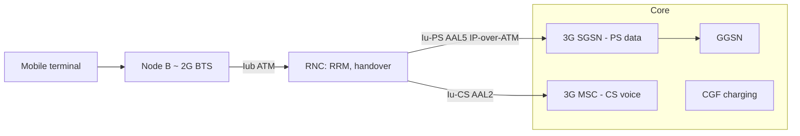

#### Effect of 4G on 3G (India-focused)

In the Indian market, 4G (especially the launch of **Reliance Jio**, called the largest investment in Indian history) was the hot topic. Operators had invested significantly in **3G network and spectrum from 2010–2015**. **Slow 3G uptake** meant much of that investment was **not yet recovered**. Some operators consider **shutting 3G** to simplify architecture — happening in countries where 3G had run for **almost 15 years**. Developing countries such as **Indonesia and Thailand** still focused on 3G even after launching 4G, looking at **slow migration**. India was in a similar stage until 2015: **five years after launch, 3G penetration was less than 10%**. A key reason: **smartphones and 3G data pricing were both expensive**. Figures given: **300 million** Internet users, **180 million** with smartphones, but only **90 million** bought 3G plans.

#### Network security (general, then 3G)

Network security is the **policies and practices** to prevent and monitor **unauthorized access, misuse, modification, or denial** of a computer network and network-accessible resources. Access is authorized and controlled by a **network administrator**. Users choose or are assigned an **ID and password** (or other authenticators) within their authority. It covers public and private networks used by business, government, and individuals. The most common simple protection is a **unique name and corresponding password**.

**Three elements (CIA):**

| Element | Meaning taught |
|---------|----------------|
| **Confidentiality** | Prevent unauthorized **disclosure** of information (including information about resources) to third parties |
| **Integrity** | Prevent unauthorized **modification** of resources and maintain the status quo (system resources, information, personnel); alteration may be for personal gain or revenge |
| **Availability** | Prevent unauthorized **withholding** of resources from those who need them when they need them |

Communication infrastructure is vital and can be targeted to steal sensitive information. The lecture listed contemporary exposures: vulnerabilities exploited in **government surveillance of mobile devices**, **flaws in authentication protocols** that make it easy to pierce **Wi-Fi** networks, and **malware** used to control VIP communications from a PC.

**3G-specific security claims.** 3G offers **greater security**, allowing **mutual authentication between terminals and networks**. As 3G grows, the mobile plays a role similar to a computer: attackers can penetrate mobiles as they do PCs, and can **spy on movements, listen to calls, read messages, and access private data**. The generation is described as bringing a **vast number of vulnerabilities** — a “heaven for hackers and crackers.” Few consumers were aware of 3G threats. Each operator would need to spend **5 to 10% of its gain** securing 3G. New security solutions are needed at **service-provider and handset-manufacturer** levels. 3G makes the mobile network and bandwidth **equivalent to a computer network**, opening chances for attacks through mobile networks.

**Cryptography taught:** 3G uses the **KASUMI block cipher** instead of the older **A5/1 stream cipher**, but **several serious weaknesses** have also been identified in KASUMI. Increasing connectivity **grows security exposure** that is harder to manage.

**Main 3G problems listed:**

- **IMSI is sent in clear text** when allocating **TMSI**.
- Transmission of IMSI is **not protected**; **IMSI is not a security feature**.
- A user can be **enticed to camp on a false base station (BS)**; once on the false BS radio channels, the user is **out of reach of the paging signals of the serving network (SN)**.
- **Hijacking outgoing/incoming calls** is possible in networks with **encryption disabled**: the intruder poses as a **man-in-the-middle** and **drops the user once the call is set up**.

#### ETSI TS 121 133 threat classification

**Unauthorized access to sensitive data (violation of confidentiality):**

- **Eavesdropping** — intercept messages without detection.
- **Masquerading** — fool an authorized user into believing the intruder is the legitimate system (to obtain confidential information), or fool a legitimate system into believing the intruder is an authorized user (to obtain service or confidential information).
- **Traffic analysis** — observe **time, rate, length, source, and destination** of messages to determine a user’s **location** or whether an important **business transaction** is taking place.
- **Browsing** — search data storage for sensitive information.
- **Leakage** — obtain sensitive information by exploiting processes that have **legitimate access** to the data.
- **Inference** — observe a system’s **reaction** to a query or signal; e.g. actively start sessions and then learn from observation of associated radio-interface messages.

**Unauthorized manipulation of sensitive data (violation of integrity):**

- **Manipulation of messages** — messages may be deliberately **modified, inserted, replayed, or deleted**.

**Disturbing or misusing network services (denial of service or reduced availability):**

- **Intervention** — prevent an authorized user from using a service by **jamming** the user’s traffic, signalling, or control data.
- **Resource exhaustion** — prevent use by **overloading** the service.
- **Misuse of privileges** — a user or serving network exploits privileges to obtain unauthorized services or information.
- **Abuse of services** — abuse a special service or facility to gain advantage or **disrupt** the network.

**Repudiation** — a user or network **denies actions** that have taken place.

**Unauthorized access to services** — intruders access services by **masquerading** as users or network entities; users or network entities get unauthorized access by **misusing their access rights**.

### Key terms

| Term | Meaning in this lecture |
|------|-------------------------|
| IMT-2000 | ITU name for 3G technical specifications |
| EDGE / EGPRS | Enhanced GPRS step before 3G; new 3G frequencies still need new infrastructure |
| RAN / Node B / RNC | Radio access network; Node B ≈ 2G BTS; RNC ≈ BSC (RRM, handover) |
| SGSN / GGSN / MSC / CGF | Packet core (as in GPRS), circuit MSC for voice, charging gateway |
| Iu / Iub / Iur | ATM RAN interfaces; Iu split CS (AAL2 voice) and PS (AAL5 data) |
| KASUMI | 3G block cipher replacing A5/1; still taught as having serious weaknesses |
| IMSI / TMSI | Subscriber identity; IMSI sent in clear when assigning TMSI |
| False BS | Rogue base station that camps the user away from legitimate paging |
| ETSI TS 121 133 | Specification used to classify 3G confidentiality, integrity, DoS, repudiation, and service-access threats |

### Lecture takeaways

- 3G is IMT-2000: ≥200 kbps (later several Mbit/s), new spectrum and infrastructure, not just a software bump from EDGE.
- The architecture splits RAN (Node B + RNC) from a dual CS/PS core, with ATM AAL2/AAL5 on Iu.
- User-facing 3G is mobile Internet, email (spam/virus fears), SMS/MMS/IM+presence, and location services — with sharp regional MMS uptake differences.
- Mutual authentication is an improvement over earlier generations, but IMSI exposure, false base stations, optional encryption, and KASUMI weaknesses remain.
- ETSI TS 121 133 organises 3G threats around CIA plus repudiation and unauthorized service access.

---

# M43: 4G LTE

**Source:** https://www.youtube.com/watch?v=UGQrMVqHCMQ
**Instructor / expert:** Dr Lal Chand, Department of Computer Engineering, Punjabi University, Patiala
**Course coordinator:** Dr Maninder Singh, Professor and Dean of Academic Affairs, Thapar University, Patiala

### Learning objectives

- Define **LTE (Long Term Evolution)** as the 3GPP 4G standard on the GSM → UMTS path, aimed at ~10× 3G speeds via new DSP and modulation, and an **IP-based** architecture with lower latency.
- Place LTE among competing 4G candidates (**UMB**, **IEEE 802.16 / WiMAX**, **802.16m / WiMAX Advanced**) and **LTE Advanced (Release 10)**.
- Separate marketing “4G” (**HSPA**) from **4G LTE**, and state OFDM, peak-rate, and VoLTE/RCS benefits as taught.
- List LTE technical objectives (throughput, latency, simplified **E-UTRAN**, mobility) and the two resources required: a capable **network** and a capable **device**.
- Recall the lecture’s LTE security framing: confidentiality and integrity, plus research goals for comparing LTE cryptographic algorithms.

### Core concepts

**LTE** stands for **Long Term Evolution**. It applies to **improving wireless broadband speeds** to meet increasing demand. LTE is a **4G wireless communications standard** developed by the **3rd Generation Partnership Project (3GPP)**. Engineers named it Long Term Evolution because it is the next step from **GSM (2G)** to **UMTS (Universal Mobile Telecommunications Service)** — the **3G technologies based on GSM**.

The goal of LTE was to **increase capacity and speed** of wireless data networks using new **DSP (digital signal processing)** techniques and **modulations**. It is designed to provide up to **10× the speeds of 3G** for smartphones, tablets, notebooks, and wireless hotspots.

A further goal was **redesign and simplification of the network architecture** to an **IP-based system** with **significantly reduced transfer latency** compared with 3G.

#### Evolution toward 4G LTE

| Year / step | What the lecture placed there |
|-------------|-------------------------------|
| 1973 | First call by engineer **Martin Cooper** from a Motorola mobile phone |
| 1987 | Cultural image: Michael Douglas in *Wall Street* on a mobile from the beach |
| 1992 | First smartphone **Simon** — functions beyond voice, ahead of the network’s ability to handle it |
| 1G | **AMPS — Advanced Mobile Phone System** |
| 2G | **GSM** and **CDMA** |
| 3G | **UMTS** and **EV-DO** |
| 4G | **LTE** from 3GPP, and **IEEE 802.16m** |

**IEEE 802.16m** is the 4G candidate also known as **WirelessMAN-Advanced** or **WiMAX 2**.

LTE progresses through **releases**. The latest release that **qualifies as 4G** in the lecture is **Release 10**, often called **LTE Advanced**.

4G LTE is said to enable advanced technologies in **transportation, healthcare, small business, enterprise, and education**. Example: **Intuit GoPayment** — street vendors, farmer markets, and food trucks attach a **small card reader** to a smartphone or tablet so payments are quick. With large-scale **VoLTE** and **LTE Advanced** on the horizon, the instructor asked what the next forty years might hold.

#### LTE technical objectives

Taught targets:

- **User throughput** (downlink and uplink, in MHz as labelled on the slide)
- **Downlink capacity** and **uplink capacity**
- **Latency:** user-plane transition time **less than 5 ms** in ideal conditions; **100 ms** control-plane; **fast connection setup**
- **Simplified architecture:** simpler **E-UTRAN**; **no RNC**; **no CS (circuit-switched) domain**; **no DCH**
- **Mobility:** optimized for **low speed** but supporting **120 km/h**

#### 4G vs LTE vs “4G without LTE”

4G has **several competing standards**, including **Ultra Mobile Broadband (UMB)** and **WiMAX (IEEE 802.16)**. 4G technologies are designed to provide **IP-based voice, data, and multimedia streaming** at speeds of **at least megabits per second** and up to **1 Gbit/s**.

US operators named: **Verizon** and **AT&T** launching **4G LTE**; **Sprint** utilizing a **4G WiMAX** network. Most newer **Android** smartphones were 4G LTE capable; **iPhone 5** and **iPad 3** were expected to have built-in 4G LTE in the **second half of 2012**.

**Speed:** the difference versus “slow 3G” is **faster**. Most 4G and “true 4G” networks have **upload and download speeds that are almost identical**; **LTE is described as the fastest connection available** for wireless networks.

**Two resources required for 4G LTE:**

1. A **network** that can support the necessary speeds.
2. A **device** able to connect to that network and download at high enough speed.

A phone with 4G LTE inside does **not** guarantee those speeds — compared to buying a car that can do 200 mph but driving on a **55 mph** freeway.

**Is LTE the same as 4G?** **No.** There is 4G, and there is **4G LTE**. 4G is the fourth generation after 3G — faster, greater capacity. **4G LTE** is called the **purest form of 4G**. If a cellular provider describes a “4G” network **without mentioning LTE**, they are probably talking about a **High Speed Packet Access (HSPA)** network: a **faster version of 3G GSM**, still faster than 3G but **not as fast as LTE**.

#### Advantages of LTE; devices; generations

**Advantages:** low latency; high network throughput; increased data-transfer speed; more **cost-effectiveness**; improvements over 3G.

**Devices covered:** mobile phones, laptops, cameras, camcorders. LTE is said to assure **interoperability with older wireless technologies**: **GSM, WCDMA, HSPA, CDMA, TD-SCDMA**. LTE is expected to **ensure the success of mobile Internet**.

**Why 4G is faster than 3G:** **orthogonal frequency-division multiplexing (OFDM)** — a technique for **squeezing more data onto the same amount of radio frequency**, also **reducing latency and interference**. 4G uses **different frequencies** than 3G, so the handset needs a **modem that supports those frequencies**. 4G is described as **10 times faster than then-current 3G**, so many tasks could be done through smartphones without separate broadband.

**LTE peak rates taught:** potential for **100 Mbit/s downstream** and **30 Mbit/s upstream**, plus reduced latency, **scalable bandwidth capacity**, and **backwards compatibility with existing GSM and UMTS**.

**VoLTE (Voice over LTE):** enables wireless carriers to use **IP-based 4G LTE data networks for voice calls** — WhatsApp-like call, video call, conferencing, etc.

**5G (brief forward look in this lecture):** fifth generation, aimed at requirements **beyond 2020**; much faster than 4G, **20 GB per second** in the wording used, fast enough to download HD movies in seconds; expected to drive **Internet of Things**, **smart cities**, **Digital India**, and a 2020 vision associated with **A.P.J. Abdul Kalam**.

#### Disadvantages of 4G LTE

- Advanced data rates require customers to **purchase new equipment**.
- 4G was **only presently accessible in certain cities**.
- Needs **complex hardware**.

#### High-definition voice, RCS, and VoLTE consumer benefits

The most noticeable VoLTE benefit is **improved voice quality**. Traditional voice networks transmit calls using an **8 kbps codec**. **Verizon** is described as using a **13 kbps codec** with more modern compression.

**Rich Communication Services (RCS),** enabled by VoLTE, is a **standards-based** set: **video calling, file transfer, real-time language translation, video voicemail, and instant messaging**. Many of these already exist as **over-the-top (OTT)** apps (**FaceTime**, **Skype**, **Google Translate**). VoLTE’s benefit is launching them **from the phone’s native dialer**.

**Faster call setup** than older **circuit-switched 2G**.

**Improved battery life versus other VoIP apps.** A **Signals Research Group** report is cited: VoLTE offers much improved battery life compared with OTT VoIP such as Skype; **consistently higher call quality** than circuit-switched voice and OTT apps; and **far lower network consumption than a Skype voice call**, hence longer smartphone battery life.

**Integration of VoLTE with Voice over Wi-Fi.** Better integration between cellular voice and Wi-Fi calling matters as operators use Wi-Fi for some voice and data. Improving the transition between a cellular call on **licensed** spectrum and a Wi-Fi call on **unlicensed** spectrum helps **indoor coverage** where licensed spectrum is limited. Call setup for Voice over Wi-Fi is the **same as for VoLTE**, so once VoLTE is fully deployed it is easier to offer VoWiFi where licensed spectrum is **weak or unavailable**.

**True device interoperability.** Once VoLTE is interoperable among carrier networks, the **CDMA/GSM divide** among the four major US operators would **no longer be an issue**. A consumer might buy **one device** that operates on any wireless network if it supports **enough LTE bands** — voice and data all on the same 4G LTE technology.

#### Security of 4G LTE

“LTE security” is presented as a **defence mechanism versus Internet threats** from multiple attack types.

- **Confidentiality:** the **right people** can get the **right data**.
- **Integrity:** the message from party A to party B **did not change**.

These are the essential points for Next-Generation mobile security. More powerful security is to be achieved by:

- Discovering the **main factors used to compare LTE cryptographic algorithms**
- Finding **trends and weaknesses of each** LTE cryptographic algorithm
- **Evaluating which algorithm provides higher security**
- **Proposing an algorithm from the existing LTE set** that may enhance security of existing LTE cryptography

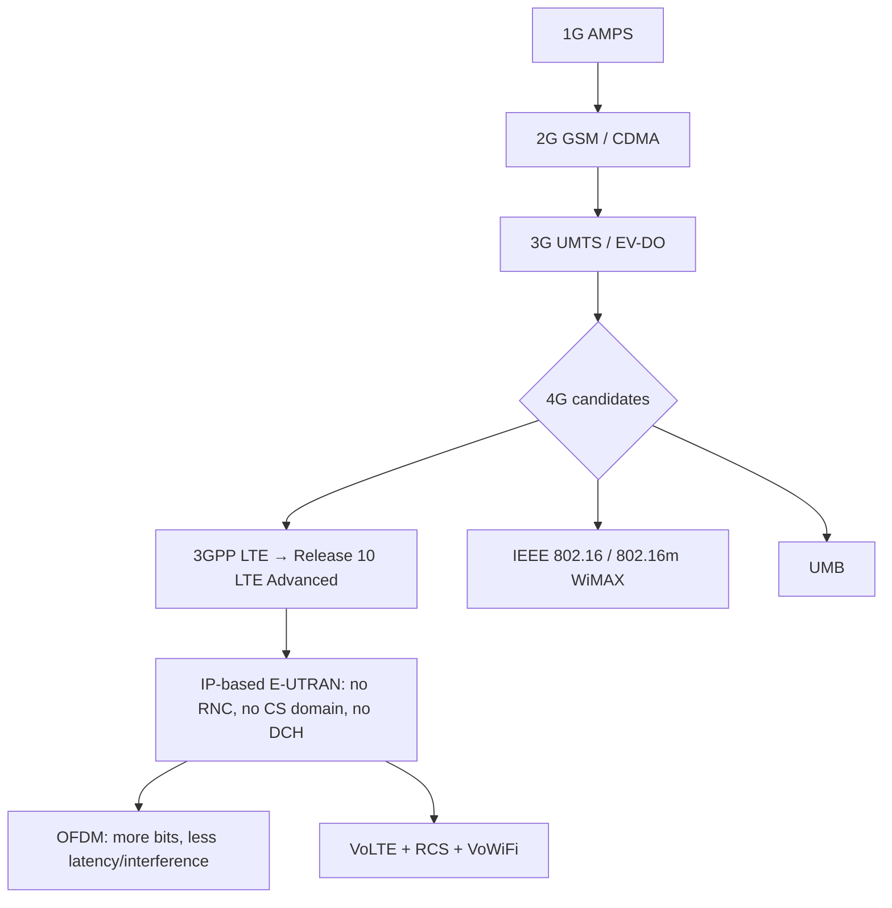

### Key terms

| Term | Meaning in this lecture |
|------|-------------------------|
| LTE | Long Term Evolution; 3GPP 4G on the GSM/UMTS path |
| LTE Advanced | 3GPP **Release 10**, the release taught as qualifying as 4G |
| E-UTRAN | Simplified LTE radio architecture: no RNC, no CS domain, no DCH |
| HSPA | High Speed Packet Access — “4G” branding without LTE; faster 3G GSM, slower than LTE |
| OFDM | Orthogonal frequency-division multiplexing; why 4G is faster |
| VoLTE | Voice over LTE: IP voice on the LTE data network |
| RCS | Rich Communication Services launched from the native dialer |
| WiMAX / 802.16m | Competing 4G path (WirelessMAN-Advanced / WiMAX 2) |
| UMB | Ultra Mobile Broadband, another competing 4G standard |

### Lecture takeaways

- LTE is 3GPP’s IP redesign of the GSM/UMTS family: DSP/OFDM speed, simpler E-UTRAN, sub-5 ms user-plane latency in the ideal case.
- Marketing “4G” may be HSPA; **4G LTE** is taught as the pure 4G form, still needing both network and device — and the right spectrum.
- VoLTE is not only HD codecs (8 vs 13 kbps) but RCS, faster setup, better battery than Skype-class OTT, and a path to VoWiFi and cross-carrier handset interoperability.
- Security is framed as CIA plus a research programme over LTE cryptographic algorithms, not a finished protocol walkthrough in this lecture.

---

# M44: 5G

**Source:** https://www.youtube.com/watch?v=vtgDWzFM8Uo
**Instructor / expert:** Dr Lal Chand, Department of Computer Engineering, Punjabi University, Patiala
**Course coordinator:** Dr Maninder Singh, Professor and Dean of Academic Affairs, Thapar University, Patiala

### Learning objectives

- Define **5G** as fifth-generation mobile/wireless broadband as the lecture presented it, including the **IEEE 802.11ac** claim and the generation path from 1G through 4G LTE.
- State **NGMN Alliance** rate, connection-count, spectral-efficiency, coverage, signalling, and **~1 ms latency** requirements.
- Describe the taught **all-IP 5G architecture**: user terminal plus multiple simultaneous **radio access technologies (RATs)**, software-defined radios, and terminal-side choice via middleware.
- Contrast 5G with 4G on speed, capacity (~1000×), latency, millimetre-wave vs existing bands, MIMO, and small cells.
- List benefits, device/network requirements, applications (IPv6, global coverage), disadvantages, and the “nanocore / 6G” closing remarks — all as taught.

### Core concepts

**5G** is **fifth-generation mobile networks** or **fifth-generation wireless systems**. The lecture describes it as upcoming fifth-generation mobile-network technology and as coming **wireless broadband based on the IEEE 802.11ac standard**. It is called a new mobile revolution: worldwide cellular phones, PDA-like devices, “the whole office on your fingertips.” 5G is credited with **extraordinary data capabilities**, tying together **unrestricted call volumes** and **infinite data broadcast** within the latest mobile operating systems. A dashboard-style figure compared **3G, 4G, and 5G** speeds.

#### Generations as told in this lecture

The **G** stands for **Generation**.

- **1G** — early **1990s**, voice.
- **2G** — people could **send text messages** between cellular devices (industry-driven).
- **3G** — calls, texts, and **Internet browsing**.
- **4G** — enhanced 3G capabilities: browse, text, call, and **download/upload large video files**.
- After 4G, companies added **LTE (Long Term Evolution)**. With 4G connectivity, **LTE became the fastest and most consistent variety of 4G** compared with competing technologies like **WiMAX**. WiMAX and LTE achieved **similar outcomes**, but a **single standard** was important; **LTE makes 4G faster**.

**5G vs 4G (speed/coverage).** 5G will provide **better speeds and coverage** than 4G. The lecture states 5G **works with a 5 GHz signal** and is set to offer speeds of up to **1 Gbit/s for tens of connections**, or **tens of Mbit/s for tens of thousands of connections**. 5G **builds on 4G LTE**: still texts, calls, and web, but with speed that makes **Ultra HD and 3D video** download/upload easy.

#### NGMN Alliance requirements

The **Next Generation Mobile Networks Alliance** defines requirements a 5G standard should fulfil:

- Data rates of **tens of Mbit/s for tens of thousands of users**
- **100 Mbit/s** for **metropolitan areas**
- **1 Gbit/s simultaneously** to many workers on the **same office floor**
- **Several hundreds of thousands of simultaneous connections** for a **massive wireless sensor network**
- **Spectral efficiency** significantly enhanced compared with 4G
- **Coverage** improved
- **Signalling efficiency** enhanced
- **1 millisecond latency** (or less — “virtually zero latency”); **smart communication**; latency reduced significantly compared with LTE

#### Design of 5G mobile network architecture

The proposed model is an **all-IP** architecture for **wireless and mobile-network interoperability**.

The system consists of:

- A **user terminal** with a **crucial role**
- A number of **independent, autonomous radio access technologies (RATs)**

Within each terminal, **each RAT is seen as an IP link** to the outside Internet. There must be a **different radio interface for each RAT**. Example: access to **four different RATs** requires **four different access-specific interfaces**, **all active at the same time**, for the architecture to be functional.

#### Is 5G really faster than 4G?

Yes, “much faster.” **4G LTE transfer speeds top out at about 1 Gbit/s** — about an **hour** to download a short HD movie in **perfect conditions**. People rarely see 4G’s maximum because the signal is disrupted by **buildings, microwaves, other Wi-Fi signals**, and more.

**5G** is said to increase download speeds up to **10 Gbit/s** — a **full HD movie in seconds** — and to **reduce latency significantly**. It is described as a path to **thousands of connected devices** in homes and offices.

#### Concepts for 5G mobile networks

- 5G terminals will have **software-defined radios** and **modulation schemes**, plus **new error-control schemes that can be downloaded from the Internet**.
- Development is seen as **toward the user terminal** as the focus of 5G.
- Terminals access **different wireless technologies at the same time** and should **combine different flows from different technologies**.
- **Vertical handovers should be avoided** — not feasible when there are many technologies, operators, and service providers.
- **Each network is responsible for handling user mobility**; the **terminal makes the final choice** among wireless/mobile access-network providers for a given service, based on **open intelligent middleware** in the mobile phone.
- Again: main user terminal plus independent autonomous RATs, each an **IP link** to the Internet.

#### How cellular radio works (baseline) and 5G spectrum

A large group of global telecoms is working on **worldwide 5G standards**. Experts expect **compatibility with 3G and 4G**, but **most standards are not yet solidified**.

In the most basic form, cell phones are **two-way radios**. On a call, the phone converts voice to an **electrical signal** and transmits it to the nearest **cell site** using **radio waves**. The cell site bounces the wave through a **network of cells** to the friend’s phone. The same happens for photos and video.

When a new mobile technology comes along, it is assigned a **higher radio frequency**. **4G occupied frequency bands up to 20 MHz**; **5G will likely use the frequency band up to 6 GHz**. New technologies occupy higher frequencies because those bands typically **are not in use** and **move information faster**. The problem: **higher-frequency signals do not travel as far**. **MIMO (multiple-input multiple-output)** will probably be used to **boost signals** wherever 5G is offered.

#### Industry / investment framing

5G is an opportunity for a **more sustainable operator investment model**. Each generation unlocks value in unanticipated ways: **SMS** was expected to have negligible impact and became huge; **video calling** was expected to be the next big thing and was **slow to gain traction**. 5G is a **paradigm shift** for all mobile-ecosystem stakeholders. **Regulators** can create healthier environments that stimulate investment. Some **3G/4G business cases may not be the right ones for 5G**.

#### 5G vs 4G (timeline and speed claims)

4G is widely deployed and still evolving; focus switches to 5G, still **several years from deployment** at lecture time, but the “buzz word.” 5G follows global adoption of **4G LTE**. Since **2012**, a new telecommunication standard is introduced **approximately every 10 years**:

| Generation | Year given |
|------------|------------|
| 2G | 1991 |
| 3G | 2001 |
| 4G | 2012 |
| 5G | expected **2020 or 2022** |

5G **does not have a defined, universally agreed-upon standard**, though likely technologies are emerging. **4G connections** offer average speeds of **25–40 Mbps at home**; **5G** is likely **in excess of 500 Mbps**. Many entities believe 5G will offer **1 Gbit/s mobile to 10 simultaneous connections**. Chinese vendor **Huawei** expects 5G to be at least **100 times faster** than the fastest 4G LTE then available (a 4G+ speed test vs 5G “up to 100 times faster”).

#### 5G technologies and frequencies

**4G in the UK** currently uses the LTE standard on **800 MHz, 1800 MHz, and 2.6 GHz**. The **1800 MHz** band was **repurposed by EE and Three** for LTE; other frequencies were made available to all networks in the **2012 4G spectrum auction**.

**Huawei** is said to believe 5G will combine **new radio access technologies (RAT)** with **existing** wireless technologies: **LTE, HSPA, GSM, and Wi-Fi**.

**Samsung** and researchers at **New York University** discussed **millimetre-wave** frequencies. Millimetre-wave frequencies are taught as lying between **3 and 300 GHz** (ASR “MHz” corrected: the lecture says they are **much higher** than existing network standards). Benefit: they are **scarcely used** by other broadcast technologies such as **AM/FM radio and TV**, so they have potential for **greater speeds and more data**. Downside: millimetre waves **do not pass through solid objects well** and are **difficult to sustain over long distances**. An mmWave approach would use **lots of smaller base stations**, whereas current networks combine **large base stations** and smaller antennas in dense areas. **All 5G standards** are expected to use this small-cell approach for **maximum capacity and minimal latency**.

There is **no universal 5G standard**; launch might see a **variety of standards under the 5G banner**, similar to how both **LTE** and **WiMAX** (and an “American LTE” used by **CDMA** networks) operated under **4G**.

#### Benefits of 5G

For **businesses**: additional **capacity and speed** for greater mobile working; employees can **video-conference from any location**.

For **consumers**: e.g. **download a film to a smartphone in under a second**.

**Capacity:** current 4G contracts promise speeds up to **150 Mbit/s** on the go but often leave users with **inclusive data allowances of less than 5 GB** (higher allowances cost extra because of limited capacity). 5G is expected to offer **upwards of 1,000 times the capacity of 4G**, so networks could offer **greater data allowances**.

**Latency:** defined as time for data transfer (buffering a video, loading a page). As 4G user counts rose, so did latency (example **4G speed test: 49 ms**). **Huawei** is targeting latency of **less than 1 ms**, versus **in excess of 50 ms on 4G** — video starts when you hit play. Reduced latency also benefits **video games, automated equipment, IoT, and augmented reality** (Oculus Rift, Gear VR, Microsoft HoloLens) by removing delays.

**Coverage:** depending on the standard, 5G may expand into **hard-to-reach areas**. 4G rollout in the UK still left weak spots. 5G networks could reach further by deploying **multiple smaller antennas** that emit in **multiple directions** and even **bounce off solid surfaces**.

#### Requirements of 5G (as listed)

- Better **coverage area** and **high data rate at the cell edge**
- **Low battery consumption** / longer battery life
- Availability of **multiple data-transfer paths**
- Around **1 Gbit/s** data rate easily possible
- **Security is more**
- Good **energy efficiency** and **spectral efficiency**
- **Worldwide coverage**
- About **90% reduction in network energy usage**

Because of these advantages, fifth-generation wireless is called **very much essential**.

#### Applications

- Network availability **everywhere**; use computers and mobiles **anywhere, anytime**
- Makes the world a **real Wi-Fi zone**
- **Mobile IP address** assigned depending on the **connected network and geographical position**, using **IPv6**
- **Unified global standards**
- Receive **radio signals even at higher altitude**

#### Disadvantages (as taught)

- Research is **still going on** / under process
- **Speed claims seem difficult to achieve** because of other devices and “incompetent technology” in other parts of the world
- **Many old devices must be replaced** (not 5G-capable), increasing cost
- **Developing infrastructure** also increases cost
- **Security and privacy issues yet to be solved**

#### Future span

Future enhancement of **“nanocore”** will be incredible as it combines with **artificial intelligence**: control an intelligent robot from a mobile; a mobile that **automatically types what the brain thinks**. **Google Hot Trends** rated the term **6G** as the **17th most searched** word. The lecture also mentioned an **“iPod 6G”** in seven colours with an aluminium body (as spoken). Close: “that’s all for 5G technology.”

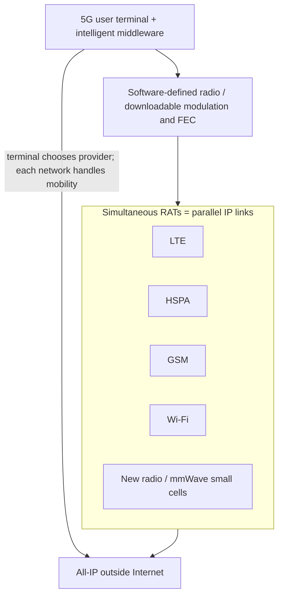

### Key terms

| Term | Meaning in this lecture |
|------|-------------------------|
| 5G | Fifth-generation mobile/wireless; lecture also ties it to IEEE 802.11ac and a 5 GHz signal |
| NGMN Alliance | Source of 5G rate, massive-IoT connection, spectral, coverage, and ~1 ms latency requirements |
| RAT | Radio access technology; each appears as an IP link; multiple active interfaces at once |
| MIMO | Multiple-input multiple-output, to boost shorter-range higher-frequency 5G signals |
| Millimetre wave | Very high frequencies (taught as 3–300 GHz): fast, little broadcast coexistence, poor through walls — hence small cells |
| LTE vs WiMAX | Competing 4G; LTE became the consistent standard 5G builds on |
| IPv6 | Addressing for mobile IP tied to network and geography in the 5G application vision |
| Nanocore | Speculative future 5G enhancement combined with AI |

### Lecture takeaways

- 5G is taught as all-IP, multi-RAT, terminal-centric: the phone keeps several radios up and chooses a provider; networks handle mobility; vertical handovers are to be avoided.
- NGMN targets tens of thousands of users, massive sensor connections, better spectral/signalling efficiency, and about **1 ms** latency.
- Speed/capacity claims in the lecture range from 500+ Mbps typical, 1–10 Gbit/s peaks, ~1000× 4G capacity, and Huawei’s “100× fastest LTE” / sub-1 ms latency — with the caveat that **no universal standard existed yet**.
- Higher bands (up to 6 GHz and mmWave) buy rate but lose range, so MIMO and dense small cells (including bounce-off-surfaces coverage) are part of the story.
- Benefits (IoT, AR, film-in-a-second, bigger data plans) sit beside unsolved security/privacy, device replacement cost, and unfinished research.

---

# M45: VoIP Protocols

**Source:** https://www.youtube.com/watch?v=-ArpkvGMndk
**Instructor / expert:** Dr Lal Chand, Department of Computer Engineering, Punjabi University, Patiala
**Course coordinator:** Dr Maninder Singh, Professor and Dean of Academic Affairs, Thapar University, Patiala

### Learning objectives

- Define **VoIP** as packetized digital voice/multimedia over IP instead of circuit-switched TDM, and explain why IP alone is a poor realtime transport.
- Place VoIP against the **OSI** layered model and name the three signalling/control protocols taught: **ITU-T H.323**, **IETF SIP**, and **MGCP**.
- Trace sender-to-receiver processing: codecs **G.711, G.729, G.723**, RTP/UDP/IP headers, playout buffer, and SIP/H.323 for call setup/teardown.
- List **QoS** factors: delay (source, receiver, network), jitter, packet loss, echo, and throughput.
- Recall VoIP **threat classes** (DoS, sniffing, eavesdropping, spoofing, toll fraud, SPIT) and the **defences and deployment options** the instructor listed — not attack recipes.

### Core concepts

**VoIP (Voice over Internet Protocol)** takes **analog audio** (as on a telephone) and turns it into **digital data** transmitted over the Internet. It is the methodology and group of technologies for **voice communications and multimedia sessions over IP networks**. Voice travels in **packets** using the Internet as the medium; **IP is used rather than traditional circuit transmission**.

Voice can be digitized; digitized voice can be sent in packets. In the past, communication through a **fixed circuit-switched network** dominated; recent years emphasize **data networks**, especially VoIP. The lecture says VoIP is defined in **ITU-T H.32x** recommendations and (as spoken) **RFC 2543** (ASR “2443”; original SIP). SIP is later given as **RFC 3261**.

#### Why VoIP, despite IP’s weaknesses

IP delivers packets carrying digitized voice, but **IP was not designed for realtime traffic** such as voice and video. IP is **connectionless**: no virtual connection is established before transmission. IP makes **no guarantees** of **reliability, flow control, error detection, or error correction**. Potential errors include **out-of-sequence packets** or **loss**. Voice needs a **guaranteed connection** and **reasonable delay**.

VoIP still succeeds **partly due to the high cost of traditional circuit-switched TDM**. VoIP uses a **packet-switched** network and makes the network **transparent to upper layers** involved in voice. Existing IP networks also allow **integration of voice and data**. To leverage connectionless IP, vendors developed **higher-layer protocols** to address guaranteed connection and transmission.

#### VoIP and the OSI model

VoIP follows a **layered model comparable to OSI**. Layering provides a framework and standard, making the system **manageable and flexible**. Each layer is relatively independent; changes in one layer should have **no or minimal impact** on others.

#### Signalling protocols

The two most generally used VoIP protocols are **ITU-T H.323** and **IETF SIP**. Both are **signalling protocols** that **discover, maintain, and terminate** a VoIP call. Additionally, **MGCP (Media Gateway Control Protocol)** provides signalling and management between **VoIP gateways** and traditional **PSTN (Public Switched Telephone Network)** gateways.

##### ITU-T H.323

A **comprehensive** ITU-T specification for **voice, video, and data** across a network. Sub-protocols taught:

| Sub-protocol | Role in this lecture |
|--------------|----------------------|
| **H.225** | Call control — **call setup and teardown** |
| **H.235** | **Protection framework** for H.323 and call setup; security measures: **authentication, integrity, privacy, some non-repudiation**; designed to work with H.245 and H.225 |
| **H.245** | **Media methods and parameter negotiation** (terminal capabilities) |
| **H.450** | **Supplementary services** (e.g. call hold, telephony features) |

Call setup is secured through **TLS**. Once established, call management starts so **encryption and media-channel data** can be negotiated.

H.323 uses **RTP (Real-time Transport Protocol)** or **RTCP (RTP Control Protocol)** as transport, riding on **UDP**. Encryption is performed **within the RTP packet** by third-party hardware or at the **network layer**.

Authentication under H.323 can be **symmetric encryption-based** or **subscription-based**. For symmetric encryption-based authentication, **previous contact is not required** because the protocol uses **Diffie–Hellman** to get a shared secret. Per **H.235**, subscription-based authentication **requires a previous shared secret**, in three variations:

1. **Password-based with symmetric encryption**
2. **Password-based with hashing**
3. **Certificate-based with signatures**

##### SIP — Session Initiation Protocol

A **text-based application-layer** protocol for **signalling and session management** in the packet telephone network. Defined in **RFC 3261**. SIP uses a **request–response** model. **Authentication and authorization** are handled either by a **lower-layer scheme** or **on a request-by-request basis** with a **challenge–response** mechanism.

SIP is **lightweight**; its **own security capabilities are very limited**. Requests and responses **cannot be end-to-end encrypted** because fields such as **request and routing** must be **visible to proxy servers** present in many architectures, so requests are **routed properly**. **Voice data is transmitted in clear text over UDP** (and related IP). Although SIP supports **S/MIME-based encryption** using digital certificates, **certain header fields** in requests and responses **cannot be encrypted**. SIP therefore **depends on transport-layer security mechanisms such as TLS or IPsec** for security of the **entire message**.

##### MGCP — Media Gateway Control Protocol

Published as **RFC 3435**. It expects MGCP messages to be carried over **secure IP connections** as in the **IPsec architecture (RFC 2401)**, using either the **IPsec Authentication Header (RFC 2402)** or **IPsec Encapsulating Security Payload (RFC 2406)**. This allows **connectionless integrity, origin authentication, and optional anti-replay protection** of messages between:

- the **media gateway** that converts **circuit-switched traffic to packet-based traffic**, and
- the **media gateway controller (MGC)** that **dictates service logic**.

#### Processing in a VoIP system

**Sender side**

1. Analog voice is converted to digital, **compressed**, and formatted using a voice **codec** such as **G.711, G.729, G.723**, etc.
2. Encoded voice is split into **equal-sized packets**.
3. Headers from different layers are attached: **RTP, UDP, and IP**, plus a **link-layer** header.
4. Packets are sent over the IP network to the destination.

**Receiver side:** depacketization and decoding. Throughout transmission, **time variation of packet delivery** (jitter) may occur. A **playout buffer** smooths playout; it introduces delay. Packets are queued for a stipulated time; packets that arrive **later than the playout deadline are discarded**.

**Signalling** uses **SIP** and **H.323** to set up new IP calls and to **close media streams** between clients.

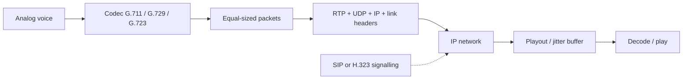

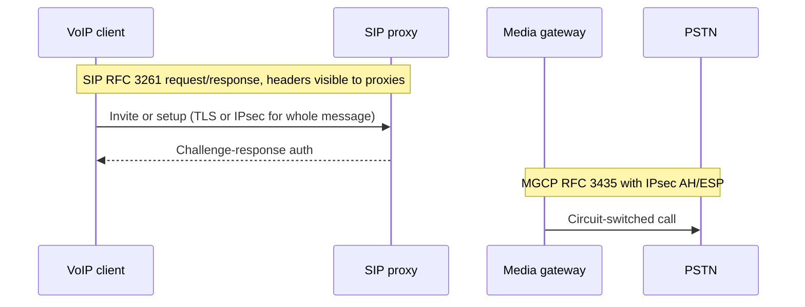

#### Quality of service (QoS)

QoS measures the **degree of user satisfaction** — the network’s ability to provide services that satisfy customers. Higher satisfaction means higher QoS.

| Factor | Meaning taught |
|--------|----------------|
| **Delay** | Time from when one person speaks until the other hears the words. Three categories: **delay at the source**, **at the receiver**, and **network delay** |
| **Jitter** | **Variation in transmission delay**. IP does not guarantee delivery time; jitter harms voice quality |
| **Packet loss** | Packets lost, corrupted, or late. Late packets are discarded at the **jitter/playout buffer** or on **overflow** of playout or router buffers. Loss includes congestion loss plus late arrival. Retransmitting lost packets causes **more delay** and hurts QoS |
| **Echo** | Caller hears a **reflection of their own voice**. The far end may not notice. **Electrical echo** exists in **PSTN**; **acoustic echo** is the difficulty in **VoIP** |
| **Throughput** | Maximum number of bits received out of bits sent during an interval |

#### VoIP security — attack classes (as classified, not as recipes)

VoIP, like other applications, has weaknesses that protocol designers should address before universal deployment.

**Denial of service (DoS).** Flooding that reduces available IP addresses, DHCP, and other **router functions**, or **blocks a server**. A VoIP-based DoS **overloads a call-processing application with so many simultaneous requests that it cannot process them**, slowing the application and **denying service to authorized users**. DoS can be directed at **any network component**.

**Network sniffing.** Observing network **traffic patterns**. On a **shared medium**, a user or attacker can look at others’ traffic.

**Eavesdropping.** Collecting sensitive information to prepare a cyber attack or gain intelligence. In VoIP, monitoring **signalling or media contents** exchanged between users, or listening in order to plan further attacks. A vendor call-manager issue was cited (Internet Security Systems): ability to **listen in or forward calls** and gain unauthorized network access.

**Spoofing / caller-ID spoofing.** The offender **masquerades as a licensed VoIP user** and places a call; the display looks authentic. The user may be tricked into giving sensitive information — the **VoIP version of traditional phishing**.

**Toll fraud.** **Unauthorized access to VoIP services**, typically for **financial gain**; among the most critical attacks for providers. Recognized via **manipulated signalling messages** or **misconfiguration of VoIP parts including charging systems**. Simple **dial-plan / open test and remote-access lines** can be abused; after compromise, services can be **resold** with little cost to the attacker. Large-organization theft of service may go unnoticed while bills accumulate.

**SPIT — Spam over Internet Telephony.** Lower communication cost makes VoIP attractive to spammers versus PSTN. VoIP spam is **recorded, self-dialed** calls over IP. SPIT is **more severe than email spam** because of its **assaultive nature**, which requires a **real-time defence**. An offender may **inject a fake ID** into a call so the receiver trusts a known source and reveals **account numbers, SSN, or security-question answers**.

#### Security measures taught (defensive)

**Against DoS**

- **Monitoring and filtering** — maintain a list of **suspicious users** and deny them connections/sessions
- **Authentication** — attest user identity before forwarding messages
- **Stateless proxy** — lower risk of **memory-exhaustion DoS**; can also do authentication, third-party registration, and **filtering spam sources**
- **Server design** — hardware, memory, and network affiliation as the **first line of defence**

**Against eavesdropping**

- Use **proper hardware**; only **authorized** access to **wiring closets** / vulnerable network points
- **Port-based MAC-address security** (e.g. on a reception/courtesy phone)
- Regularly **scan** for devices running in **unauthorized mode**
- **Encryption** of VoIP traffic

**Against spoofing / masquerading**

- An **effective authentication module combined with encryption**

**Against toll fraud**

- Providers configure **powerful firewalls** and **protect ports**

**Against SPIT**

- **Blacklisting** of known source IP addresses
- Vendor tools to **flag suspicious callers**
- Receivers should **not disclose important information** to unknown callers

#### Configuration / deployment options

**USB VoIP phone adapters.** Use any **standard analog telephone** to place VoIP calls. They typically look like USB adapters with a **standard telephone port**. Once attached, the phone operates as if on the public utility.

**Softphones.** Software-controlled VoIP from a **PC with Internet**, using a **headset and sound card**. Providers often offer softphones **free** in exchange for using their service; users can reach dedicated VoIP phones at no extra cost.

**Dedicated VoIP phones.** Look like a regular telephone but connect to an **electronic network** instead of a telephone line. May be a phone plus a **base station** on the Internet, possibly on a **local wireless network**. Need a **provider and service setup**.

**Dedicated routers.** Connect **standard phones** to the Internet (router on **ADSL/cable modem**) and still act as an **IP router** for a PC. Providers configure them for a charge; they can work **independent of any PC or software**.

**Wireless compatibility.** Mobiles and smartphones can use VoIP if a wireless LAN is installed; **applicable security such as a firewall or encryption** is needed.

**Issues of wireless VoIP** (mainly corporate LANs, not homes): **scalability** problems for enterprises; **QoS poorer** than wired networks; **higher setup and maintenance cost** because of many access points in a limited area; **higher security threat**.

#### Limitations of VoIP

Popularity depends on key issues — some because **IP was designed for data packets**, some because vendors do not meet standards:

**Quality of service.** IP design does not guarantee **realtime** voice. IP was designed for data that gets **error-free, ordered delivery**. Acceptability depends on delay **not exceeding a threshold**. **Prioritizing voice packets** can guarantee good voice quality.

**Interoperability.** PSTN signalling must be **interchanged** with VoIP signalling for VoIP to be common. Acceptable mechanisms named: **H.323, SIP, and MGCP**, each integrating **data, voice, and video over the same wire**.

**Security.** The backbone is the **Internet**, not a very secure medium: **interception of calls**, DoS, fraud. Security can use **tunnelling protocols such as Layer 2 Tunneling Protocol (L2TP)** and **encryption in SSL**, but **encryption is not widely available for VoIP**.

**Integration with PSTN.** VoIP works **in union with PSTN** so they appear as **one network**. A VoIP telephone number has an **IP address**; when a VoIP phone engages in a call, the **IP address is translated into the telephone number** and handed to the PSTN. Both are needed because **not everyone has switched to VoIP**.

**Scalability.** Lower cost and improving quality drive a high rate of VoIP users; the main obstacle is **scalability**.

The instructor noted that VoIP protocols would be discussed **in more detail in forthcoming lectures**.

### Key terms

| Term | Meaning in this lecture |
|------|-------------------------|
| VoIP | Packet voice/multimedia over IP instead of circuit TDM |
| H.323 | ITU-T umbrella (H.225, H.235, H.245, H.450) with RTP/RTCP over UDP and TLS setup |
| SIP | IETF RFC 3261 text request/response signalling; needs TLS/IPsec because proxies must see headers |
| MGCP | RFC 3435 gateway control; IPsec AH/ESP between media gateway and MGC |
| G.711 / G.729 / G.723 | Example voice codecs on the send path |
| Playout buffer | Receiver jitter buffer; late packets discarded |
| SPIT | Spam over Internet Telephony — real-time voice spam |
| Toll fraud | Unauthorized use of paid voice service, often via signalling or configuration abuse |
| PSTN | Public Switched Telephone Network; still required for number translation and non-VoIP users |

### Lecture takeaways

- VoIP wins on TDM cost and voice–data integration, but IP is connectionless and offers no realtime guarantees — hence codecs, RTP, jitter buffers, and signalling (H.323, SIP, MGCP).
- H.323 is a full ITU stack with H.235 authentication variants and Diffie–Hellman; SIP is lightweight and **cannot hide routing headers from proxies**, so TLS/IPsec carry the security burden; MGCP assumes IPsec to the PSTN gateway.
- QoS is delay, jitter, loss, echo (electrical vs acoustic), and throughput — not a single number.
- Threats taught are DoS, sniffing, eavesdropping, caller-ID spoofing/phishing, toll fraud, and SPIT; responses are authentication, encryption, filtering/blacklists, firewalls, physical/port security, and user caution — not protocol exploits.
- Deployment spans USB adapters, softphones, dedicated phones/routers, and wireless LAN, with scalability, PSTN interworking, and incomplete encryption as the practical limits.

---

# M46: Introduction to DDoS

**Source:** https://www.youtube.com/watch?v=jEYv9HSp8lU
**Instructor / expert:** Dr Abhinav Bhandari, Department of Computer Engineering, Punjabi University, Patiala
**Course coordinator:** Dr Maninder Singh, Professor and Dean of Academic Affairs, Thapar University, Patiala

### Learning objectives

- Distinguish **DoS** from **DDoS** and place both as attacks on **availability** in the CIA triad.
- Explain why Internet growth and a security-light original design made flooding and related availability attacks severe.
- State attacker **motives** and organisational **consequences** as listed in the lecture.
- Name the **protocol/architecture weaknesses** the instructor blamed (stateless forwarding, lack of authentication / IP spoofing, predictable TCP handshake, mimicry of legitimate users).
- Classify DDoS **as taught**: physical (layer 1), volumetric (layers 2–4), and application-layer (layers 5–7) — class names only, not operational recipes.

### Core concepts

Internet usage grew tremendously in the last decade; lives became dependent on it for information, business, commerce, communication, education, entertainment, and research. The Internet’s original goal was **unobstructed flow of data and scalability**, **without keeping security in mind** — now a precarious situation. A simple architectural design eased usage but **fascinated attackers** who exploit vulnerabilities for many reasons.

Those threats can target the **CIA model**: **confidentiality**, **integrity**, and **availability**. **Availability** is primarily targeted by **denial-of-service (DoS)** attacks: an **explicit attempt to prevent legitimate users from using a service**.

DoS has overtaken other concerns as arguably the **most severe form of attack in the last decade**. The major goal is to **disrupt or deny services**. Example: a reputed online shopping site suddenly unavailable because a **flood of packets** is surging in — one of hundreds or thousands of victims of a **pervasive, growing** Internet threat.

Traditionally the security community focused on **unauthorized disclosure or modification of information** and perhaps **theft of services**. DoS was largely **ignored as unlikely** because “the characters would not gain anything.” That is **not the case today**. DoS can put merchants out of business, cause **major visible disruption**, be used against companies from **grudge or paid attack**, or be used by **terrorists** against critical infrastructure.

A DoS aims to **deny legitimate users access to shared services or resources**. It may include attempts to **flood a network**, **disrupt connections between two machines**, or **disrupt service to a specific system or person**, preventing legitimate traffic from reaching a server, service, or website. Such an attack can be configured in many ways, targeting **operating systems** or **network services**.

The lecture contrasted **two high-level forms** (classification, not a playbook):

1. **Vulnerability / crafted-packet DoS** — crash a system by exploiting **software vulnerabilities** on the target (example class named: **Ping of Death**, using oversized **ICMP** ping traffic that some operating systems mishandled via **buffer overflow**, leading to crash, freeze, or reboot). The instructor said this form can be **prevented by patching**.
2. **Flooding DoS** — **massive volumes of useless traffic** occupy resources that would have served legitimate traffic. This form **cannot be easily prevented**; targets can be attacked **simply because they are connected to the public Internet**.

#### DoS versus DDoS

When attack traffic comes from **multiple sources**, it is a **distributed denial-of-service (DDoS)** attack. Multiple sources **amplify** power and make **defence much more complicated**.

Both are huge threats; DDoS is **more complex and harder to solve** because:

- It can use a **very large number of machines** — a powerful weapon; **any target, however well provisioned, can be taken offline**. Gathering a large “army” of machines has become simple because **automated tools** exist that **do not require sophistication**. Even if attacking machines could be identified, **action against a network of (e.g.) 1,000 hosts** is hard.
- Some DDoS uses **seemingly legitimate traffic**: resources are consumed by a large number of **legitimate-looking messages** with **no distinguishing feature**. Because the attack **misuses a legitimate activity**, response **without also disturbing legitimate activity** is extremely hard.

#### Botnet roles (architecture as taught)

Operating systems and network protocols were developed **without security engineering**, leaving many **insecure, unpatched machines**. Attackers implant programs on those machines. Depending on sophistication, compromised machines are called **masters, handlers, or zombies**, collectively **bots**; the attack network is a **botnet**.

Control instructions go to **masters**, which communicate them to **zombies**. Zombie machines then send attack packets that **converge at the victim or its network** to exhaust **communication or computational** resources.

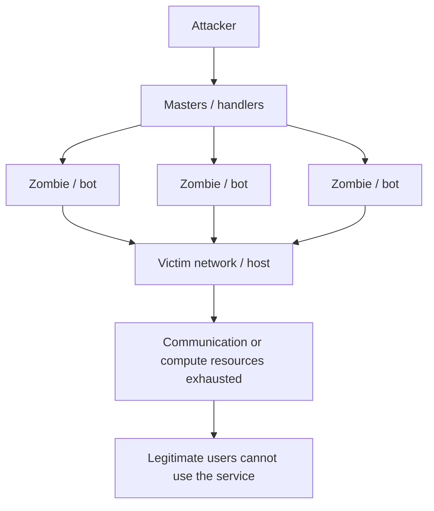

Incidents are common against clients, businesses, ISPs, and well-known companies such as **Yahoo, Twitter, Facebook, eBay, Google**. A table of incidents from **2000 to 2014** was shown. Security reports after **2014** showed further strengthening versus pre-2005. **Attack size** taught: **less than 10 Gbps** before 2005; about **100 Gbps** in 2010; up to **400 Gbps** in 2014.

#### Motives

| Motive | As taught |
|--------|-----------|
| **Recognition** | Early DDoS as proofs of concept or pranks; taking a popular site offline brings underground recognition |
| **Ideological activism** | Political disagreement with an organisation, media site, corporation, or government |
| **Financial gain** | Monetary motive; after an attack they may **demand ransom** to prevent further attacks; these attackers are described as **most experienced** |
| **Vandalism** | Destroy available resources; “don’t believe in anything”; reports of increase |
| **Revenge / competitive spirit** | Business revenge; possibly dishonoured employees |

There is a **major lack of data** on perpetrators and motives; the **vast majority of attacks are not reported**.

#### Consequences

Severity depends on **kind of attack, organisation, and target**. **Long-duration** attacks are more rigorous and must be **mitigated quickly after detection**. Listed consequences:

- Huge **revenue losses**
- **Reputation** damage
- Loss of **shareholder confidence**
- **Customer dissatisfaction**
- Loss of important data due to **system crashes**
- Extra **operational cost**

These can imply **social, financial, and legal** effects.

#### Vulnerabilities in basic protocols and architecture

1. **Stateless nature of the Internet** — intermediate routers **do not maintain state** about forwarded packets, so **accountability / forensics** are difficult and theft can go unidentified.
2. **Lack of authenticity** — without authentication, users can **claim others’ identities**. The common example class is **IP spoofing** (forged source addresses).
3. **Deterministic / predictable Internet protocols** — not always a “design flaw”; often needed for proper operation. Example: **TCP connection establishment and control**. The **three-way handshake** is **predictable** and can be abused for flooding classed as **SYN flooding**.
4. **Mimicking legitimate user behaviour** — leads to **application-layer DoS**, which is hard to separate from real users.

#### Classification of DDoS (by OSI region)

DDoS may occur at **every OSI layer**. The lecture’s figure grouped three classes: **physical-layer**, **volumetric**, and **application-layer**.

##### Physical-layer (layer 1)

Concerned with **physical security**: destruction, obstruction, malfunction, or manipulation of **physical assets**. Communication relies on nodes, hosts, switches, hubs, routers, servers, and wired or wireless media. If devices that grant service go down, service is disrupted. Attackers may deny service by **compromising physical security** so signals never arrive.

Named subclasses:

- **Destruction of assets** — damage physical assets or cut **LAN backbone** wiring so assets become unresponsive. Prevention taught: **physical security of assets**.
- **Jamming** — primarily in **wireless sensor networks**: noise close to the network so **throughput falls**; packets corrupted by **interference**. (Class of radio disruption, not a construction guide.)
- **Tampering** — interfere with node function by erasing programs or modifying code; **cryptographic keys and other sensitive information** may be extracted from captured nodes. Prevention taught: keep packages **tamper-proof**.

##### Volumetric (layers 2–4)

**Congestion** by consuming **bandwidth** through flooding classes such as **MAC flooding, ICMP flooding, UDP flooding, SYN flooding**. High traffic; many DDoS variants sit here. The protocol idea of the class is to **congest the network or target with large amounts of packets** so resources are consumed, the machine may become **unresponsive** or **crash**. Traffic is described as coming through **distributed bots** remotely controlled by **bot masters**. A **key feature**: most IP packets used have **spoofed source addresses**, which **hinders traceback**.

Named volumetric classes (what they abuse, not how to run them):

| Class | Lecture’s characterisation |
|-------|----------------------------|
| **MAC flooding** | Forged / cloned MAC addresses and large frame volume toward **switches**; non-existent MACs used to **disturb ARP caches**. Switch memory is exhausted allocating resources for forged MACs, **denying legitimate requests**. May also disturb **router tables** so routing becomes unavailable |
| **ICMP flooding** | ICMP is the **error-control / diagnostic** protocol at the network layer. Query traffic encapsulated in IP is sent in volume with **spoofed sources**; the server’s replies **consume bandwidth**. **Fragmented ICMP** at high rate can overload reassembly. Named related examples: **Smurf** and **Ping of Death** (ICMP-based classes) |
| **TCP / SYN flooding** | Abuses the **TCP three-way handshake**. Incomplete connection requests leave the server holding **half-open** state until **timeout**, so a large number of such requests make the target unavailable. Related names: **SYN flooding**, **fragmented acknowledgement** packets as TCP-flood examples |
| **UDP flooding** | UDP is **connectionless**. Volume from distributed bots exhausts bandwidth. **Echo** and **chargen** services are named as commonly abused. Other UDP-related classes named: **DNS flood**, **UDP fragmentation**, **VoIP flood** |

##### Application-layer (layers 5–7)

In contrast to volumetric attacks, these generate **low traffic at the network** but **large request load on the web server**, which can **overwhelm server resources**. Named examples: **HTTP GET and POST request flooding**. Application protocols exploited: **HTTP, HTTPS, DNS**, and others.

#### Closing

DoS/DDoS is a **devastating** class of cyber attack. Many **commercial solutions** exist, but an **ideal solution is still elusive**. The next lecture covers **approaches to tackle the DDoS problem**.

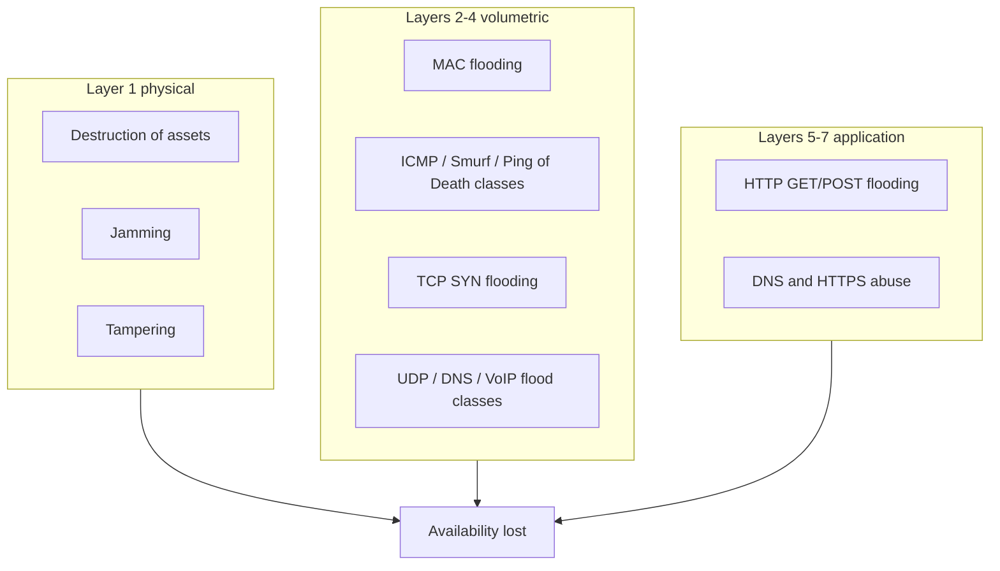

### Key terms

| Term | Meaning in this lecture |
|------|-------------------------|
| DoS | Denial of service: prevent legitimate users from using a service (availability) |
| DDoS | DoS whose traffic comes from **many sources**, amplifying impact and complicating defence |
| Bot / botnet | Compromised machines (masters, handlers, zombies) used as a distributed attack network |
| IP spoofing | Forged source addresses; hides origin and defeats simple identity-by-IP defences |
| SYN flooding | Volumetric class that leaves TCP connections **half-open** until timeout |
| Volumetric attack | Layers 2–4 congestion/bandwidth exhaustion |
| Application-layer DDoS | Layers 5–7: low network volume, high application/request load |
| Ping of Death | Named vulnerability class: oversized ICMP mishandled by some OSes; patchable |
| CIA | Confidentiality, integrity, availability — DDoS targets availability |

### Lecture takeaways

- Availability was historically under-weighted; flooding proved it can bankrupt, embarrass, or politically coerce a victim.
- DDoS is harder than DoS because of **scale**, **legitimate-looking traffic**, and **spoofed identity**.
- The Internet’s **stateless forwarding**, **weak authentication**, **predictable TCP handshake**, and **easy mimicry of users** are the taught root causes — not a single bug.
- Classification is **physical vs volumetric vs application-layer**; named floods (MAC, ICMP, SYN, UDP, HTTP GET/POST) are **types**, not procedures.
- Patching stops some vulnerability DoS; **public-Internet flooding has no easy preventative**, and commercial tools have not closed the problem.

---

# M47: Defence to DDoS Attacks

**Source:** https://www.youtube.com/watch?v=w_XZu6Rc0jM
**Instructor / expert:** Dr Abhinav Bhandari, Department of Computer Engineering, Punjabi University, Patiala
**Course coordinator:** Dr Maninder Singh, Professor and Dean of Academic Affairs, Thapar University, Patiala

### Learning objectives

- Explain why **DDoS flooding** is hard to defend: easy launch, traffic similarity, IP spoofing, huge volume, many zombies, and Internet **hub-and-spoke** chokepoints.
- Separate **technical** vs **social** defence challenges (distributed response, missing incident data, no benchmarks, large-scale testing; deployment economics).
- List **goals of an ideal defence**: effectiveness, completeness, minimum collateral damage, low false positives, low cost.
- Name the four **defence modules**: prevention, detection, source identification, and reaction — as strategies, not attack methods.
- Recall the instructor’s **hardening tips** (filters, patches, unused services, quotas, baselines, physical security, integrity tools, redundancy, backups, passwords).

### Core concepts

The previous lecture covered DDoS basics, motives, and classification. This lecture covers **why defending is difficult**, **challenges and goals for an ideal defence**, and **tips to reduce exposure**.

#### Why the DDoS problem is hard to solve

Flooding-type DoS/DDoS is **very effective for attackers** and **extremely challenging for defence** because of these characteristics:

**Simplified procedures for launching.** Many DDoS tools can be obtained and set in motion. They make **agent recruitment and activation automatic** and can be used by **inexperienced users**. Some tools have existed for years and still generate effective attacks with little tweaking. (The lecture names the existence of tools as a defence challenge — it does not teach their use.)

**Traffic variation / similarity to legitimate traffic.** Unlike threats that need specially crafted packets (the lecture’s examples of other threats: **intrusions, worms, viruses**), flooding needs **high volume** and can **vary packet contents and header values**. Separation and filtering are therefore **extremely hard**.

**IP spoofing.** Attack traffic can **appear to come from numerous legitimate clients**. That **defeats resource-sharing approaches that identify a client by IP address**. If spoofing were eliminated, aggressive senders might be distinguished and filtered. With spoofing, the victim sees many **service-initiation requests from seemingly legitimate users**. Ongoing sessions with known users might be told apart, but the victim **cannot distinguish new legitimate requests from attack ones**, so **no new users can be served** during the attack. Long attacks obviously damage the victim’s business.

**Huge volume of traffic.** High volume **overwhelms the targeted resource** and makes **traffic profiling hard**. At high packet rates a defence can do only **simple per-packet processing**. The main challenge is to **discern legitimate from attack traffic at high packet speeds**.

**Many zombie machines.** Strength lies in **numerous agent machines distributed over the Internet**. The attacker can overwhelm even large networks, **vary** the attack by using **subsets of agents** or **few packets from each**, and thereby **defeat many traceback defences**. Even without variation, **knowing 10,000 attacking identities barely helps stop the attack**. The situation would be simpler if so many agents could not be recruited. Growth of Internet hosts and **novice users** suggests the **pool of potential agents will only increase**. **Distributed Internet management** makes wide deployment of any security mechanism unlikely; even a permanent host-hardening method would take **many years** to dent the DDoS threat.

**Weak spots in Internet topology.** Today’s **hub-and-spoke** Internet has a handful of **highly connected, well-provisioned hubs** that relay traffic for the rest. They are built for heavy traffic, but if those few spots were **taken down or heavily congested**, the Internet would **grind to a halt**. Heavy traffic through those hotspots would have a **devastating global effect**.

**In a nutshell:** flooding DDoS is framed as a **“perfect crime”** on the Internet: tools and agents are abundant; sufficient volume brings the strongest victim down; the right mixture plus spoofing **defeats filtering**; businesses that rely on online access suffer considerable damage; spoofing, numerous agents, and **lack of automated tracing** grant **little risk of the perpetrator being caught**.

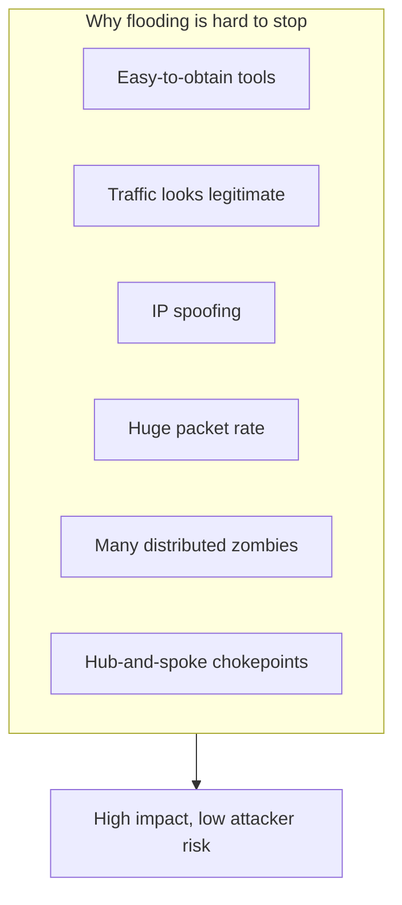

#### Challenges of DDoS defence

Challenges fall into **technical** and **social** categories. Technical issues involve **current Internet protocols** and **threat characteristics**. Social issues concern how a technical solution is **introduced, accepted, and widely deployed**.

The main problem in **both** is that large-scale DDoS is a **distributed threat** needing a **merit of overlapping solutions** spread across the Internet, because attacking machines may be anywhere. Attack streams can be controlled only if there is a **point of defence between agents and victims**.

Two deployment sketches:

- **One defence close to the victim** monitoring all incoming traffic — deficient mainly because it must **efficiently handle huge volume**.
- **Distributed defence** dividing workload — must be **widespread** to cover any agent–victim pair. Because widespread deployment **cannot be granted**, the technical challenge is defences that still work if **sparsely deployed**. The social challenge is an **economic model that motivates large-scale deployment**.

##### Technical challenges (summarised list)

**Need for distributed response at many Internet points.** Very few DDoS types can be handled **only by the victim**. Response should be **distributed, possibly coordinated**, and deployed at **many points** to cover diverse agents and victims. The Internet is **administered in a distributed manner**, so wide (or even cooperative) deployment **cannot be enforced**. That **discourages researchers** from considering distributed solutions.

**Lack of detailed attack information.** Reporting attacks is believed to **damage the victim’s business reputation**, so limited information exists; incidents often go only to **government organisations under secrecy**. It is hard to design imaginative solutions without familiarity. **Attack information must not be confused with attack-tool information** (publicly available). Useful incident data would include **type, time and duration, number of agents (if known), attempted response and its effectiveness, and damage suffered**.

**Lack of defence-system benchmarks.** Vendors make bold claims of completely handling DDoS. There is **no standardized testing approach** for comparison. Two harmful effects: designers present only **advantageous tests**, and researchers **cannot compare actual performance** — only comment on design.

**Difficulty of large-scale testing.** Defences need a **realistic environment**. That is currently impossible due to lack of **large-scale testbeds**, **safe live distributed Internet experiments**, or **simulation tools supporting several thousand nodes**. Performance claims based on **small-scale** tests are **not credible**. Some testbeds in use: **PlanetLab** and **Emulab** (ASR “IMU lab”).

##### Social challenges (deployment patterns)

Many defences need specific patterns to work:

- **Complete deployment** — at each host, router, or network
- **Continuous / neighbour deployment** — at hosts or routers that are **directly connected**
- **Large-scale widespread deployment** — majority of Internet hosts
- **Complete deployment at specified points** — a carefully selected set; **all** must deploy to achieve the desired security
- **Modification of widely deployed Internet protocols** such as **TCP/IP or HTTP**

#### Goals of a strong DDoS defence

**Effectiveness.** A good defence should **actually defend**: either **effective prevention** that makes attacks impossible, or **effective reaction** so the DoS effect **goes away**. For reactive mechanisms, response should be **sufficiently quick and automated** that the target does not suffer seriously.

**Completeness.** Handle **all possible attacks**, or at least a **large number**. A mechanism that handles **TCP SYN flooding** but cannot help on a **ping flood** is less valuable than one that handles **both**. Example: **TCP SYN cookies** help but are **not sufficient unless coupled with other mechanisms**. Completeness is also required in **detection and reaction**: if detection misses a pattern, **no response is invoked** and the attack succeeds. Completeness is **extremely hard** because attackers develop **new types designed to bypass existing defence**. **Flash events** need **clear-cut distinction** from DoS.

**Minimum collateral damage.** The core goal is **not merely to stop attack packets** but to ensure **legitimate users can continue normal activity despite the attack**. Legitimate traffic may share **sources** with attack traffic, share the **victim’s network as destination**, share **some Internet path** with attack traffic, or share **application protocol or destination port**. **None of these legitimate categories should be disrupted**. In practice, defences cannot characterise attack traffic perfectly and **drop some legitimate traffic** — that dropping is **collateral damage**. Because attackers **conceal traffic in the legitimate stream**, resemblance is common; the problem is **real and serious**, especially with **flash events**. Protecting legitimate traffic is very important.

**Low false-positive rates.** Preventive mechanisms should not **hurt other forms of traffic**. Reactive mechanisms should activate **only when an attack is actually underway**. Detecting an attack when **none is happening** is a **false positive**; it causes collateral damage by triggering filtering and incurs **CPU, memory, and delay** cost on all packets.

**Low deployment and operational cost.** Cost must be **commensurate with benefits**. Commercial solutions have **hardware/software purchase** cost and **system-administration** cost. Some mechanisms need **ongoing administration** (e.g. **signature** systems needing updates as new attacks are characterised). Other overheads: **stateful inspection** may delay each packet; **throttling** suspicious sources may slow **legitimate** interactions with those sources. Unless costs are **extremely low or rare**, they must be balanced against the degree of protection.

#### Four defence modules

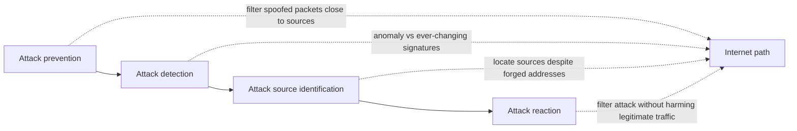

**1. Attack prevention** — stop attacks **before they reach the target**. For DDoS that uses **spoofed traffic**, a highlighted approach is **filtering spoofed packets close to or at the attack sources** — taught as one of the **most effective** approaches for that subclass.

**2. Attack detection** — detect DDoS **when it occurs**; an important procedure to **direct further action**, based on **traffic-feature distribution**. **Signature-based detection is not applied** for DDoS defence because signatures **change constantly**. **Anomaly-based detection** is suitable.

**3. Attack source identification** — locate sources **regardless of whether the packet source-address field contains erroneous information**. Crucial to **minimize damage** and **deter potential attackers**.

**4. Attack reaction** — **eliminate or curtail** attack effects. The **final step**, determining overall defence performance. The challenge is to **filter attack traffic without disturbing legitimate traffic**.

#### Practical tips to reduce exposure

Taught as administrative/hardening guidance:

1. **Implement router filters** — lessen exposure to certain DoS attacks and help prevent users **on your network** from effectively launching certain DoS attacks.
2. **Install patches** (when available) to guard against **TCP SYN flooding** — substantially reduces exposure but **may not eliminate risk entirely**.
3. **Disable unused or unneeded network services** — limits an intruder’s ability to use those services for DoS.
4. **Enable quota systems** if the OS supports them (e.g. **disk quotas** for all accounts, especially those running network services). If the OS supports **partitions/volumes**, **partition the file system** to separate critical functions from other activity.
5. **Observe system performance and establish baselines** for ordinary activity; use baselines to notice unusual **disk, CPU, or network** levels.
6. **Routinely examine physical security** relative to current needs: servers, routers, unattended terminals, network access points, wiring closets, environmental systems (air and power), and other components.
7. Use **Tripwire or a similar tool** to detect changes in **configuration or other files**.
8. Invest in **redundant and fault-tolerant** network configurations.
9. Establish and maintain **regular backup** schedules and policies, particularly for **important configuration information**.
10. Establish and maintain appropriate **password policies**, especially for highly privileged accounts (**Unix root** or **Microsoft Windows administrator**).

#### Closing

DDoS remains a **devastating** attack class; **defence is still elusive** despite many **academic and commercial** solutions. This lecture covered **why the problem is hard**, **challenges and goals** for an ideal defence, and **system-management tips**.

### Key terms

| Term | Meaning in this lecture |
|------|-------------------------|
| IP spoofing (defence view) | Makes new legitimate clients indistinguishable from attack initiators |
| Collateral damage | Legitimate traffic dropped or delayed by a defence |
| False positive | Defence treats a non-attack (e.g. flash crowd) as DDoS |
| Flash event | Sudden legitimate load that must be distinguished from DoS |
| SYN cookies | Example partial preventive for SYN floods; not complete by itself |
| Anomaly-based detection | Preferred DDoS detector; signatures change too often |
| Source identification | Finding origins even when addresses are forged |
| PlanetLab / Emulab | Named research testbeds; small-scale tests are not credible |
| Tripwire | Example integrity tool for detecting configuration-file changes |

### Lecture takeaways

- Flooding looks like a “perfect crime”: cheap volume, spoofed identity, too many bots to punish, and hubs that can congest the whole Internet.
- A box next to the victim cannot keep up; real defence must be **distributed**, but **economics and reputation-secrecy** block the data, benchmarks, and deployment that research needs.
- Ideal properties are **actually stopping attacks**, covering **many attack styles**, **not punishing legitimate users** (including flash crowds), **few false alarms**, and **cost in line with benefit**.
- The operational pipeline is **prevent (especially anti-spoof near sources) → anomaly-detect → identify sources → react without collateral damage**.
- Everyday hygiene — filters, SYN-flood patches, turning off spare services, quotas, baselines, physical security, Tripwire, redundancy, backups, strong admin passwords — **reduces exposure**; it is **not** a complete DDoS solution, which the instructor says the market has not yet delivered.

---
