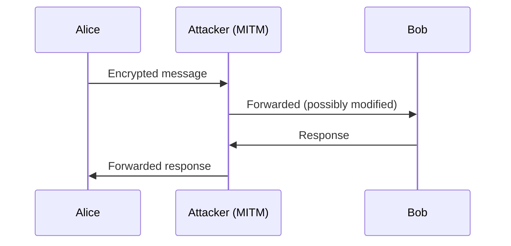

# Volume 02 — System Threats and Classical Cryptography

**Lectures L10–L18** · Weeks 4–6

---

## L10: Trojan Horse and Trap Door

### Learning objectives

- Describe trojan horse and trap door attacks.
- Implement detection and prevention strategies.

### Trojan horse

A **trojan horse** is malicious software disguised as legitimate software. Unlike viruses, trojans do not self-replicate—they rely on social engineering for distribution.

**Examples:**
- Fake antivirus software
- Game cracks with embedded malware
- Email attachments disguised as documents

### Trap door (backdoor)

A **trap door** (backdoor) is a hidden mechanism that bypasses normal authentication or security controls:

- Hardcoded credentials in software
- Undocumented API endpoints
- Modified firmware with secret access

### Detection

| Method | Description |
|--------|-------------|
| Integrity checking | Compare file hashes against known-good values |
| Behavioral analysis | Monitor unexpected network/process activity |
| Code review | Audit source for hidden access paths |

### Prevention

- Download software only from trusted sources
- Verify digital signatures
- Principle of least privilege limits trojan impact
- Regular integrity audits (Tripwire—covered in L35)

---

## L11: Stack and Buffer Overflow

### Learning objectives

- Explain buffer overflow vulnerabilities.
- Describe stack-based exploitation techniques.

### Buffer overflow

A **buffer overflow** occurs when a program writes data beyond the bounds of a fixed-size buffer:

```c
char buffer[64];
gets(buffer);  // No bounds checking — vulnerable
```

### Stack layout

```
High address
┌─────────────┐
│  Arguments  │
├─────────────┤
│ Return addr │  ← Target of overflow
├─────────────┤
│ Saved EBP   │
├─────────────┤
│ Local vars  │
│  (buffer)   │  ← Overflow starts here
└─────────────┘
Low address
```

### Exploitation

By overflowing the buffer, an attacker overwrites the **return address** on the stack, redirecting execution to injected shellcode.

### Defenses

| Defense | Mechanism |
|---------|-----------|
| Stack canaries | Random value before return address; checked on function exit |
| ASLR | Randomize memory layout |
| DEP/NX bit | Mark stack/heap as non-executable |
| Safe functions | Use `strncpy`, `snprintf` instead of unsafe variants |
| Compiler flags | `-fstack-protector`, `-D_FORTIFY_SOURCE` |

### Heap overflow

Similar attacks target heap-allocated buffers, corrupting heap metadata to achieve arbitrary write primitives.

---

## L12: System Threats

### Learning objectives

- Identify operating system-level threats.
- Describe privilege escalation attacks.

### OS-level threats

**1. Privilege escalation**
- Vertical: user → root/administrator
- Horizontal: access another user's resources

**2. Covert channels**
- Storage channel: signal via file existence/size
- Timing channel: signal via response time variations

**3. Race conditions (TOCTOU)**
```
Thread 1: if (access(file))     // Check
Thread 2:   symlink(file, /etc/shadow)  // Modify between check and use
Thread 1:   open(file)           // Use — now opens /etc/shadow
```

**4. Rootkits**
- Kernel-level: modify system call table
- Bootkit: infect boot loader
- Firmware rootkit: persist in BIOS/UEFI

### System hardening

1. Disable unnecessary services
2. Apply security patches promptly
3. Configure mandatory access control (SELinux, AppArmor)
4. Enable audit logging
5. Regular vulnerability scanning

---

## L13: Communication Threats

### Learning objectives

- Classify network and communication threats.
- Understand man-in-the-middle and replay attacks.

### Network threat taxonomy

| Threat | Description | Example |
|--------|-------------|---------|
| Eavesdropping | Passive interception | Packet sniffing |
| Man-in-the-middle (MITM) | Active interception and modification | ARP spoofing, SSL stripping |
| Replay attack | Resend captured valid messages | Session token replay |
| Denial of service | Disrupt availability | SYN flood, amplification |
| Traffic analysis | Infer information from patterns | Timing, volume analysis |

### Man-in-the-middle attack



Attacker positions between communicating parties, intercepting and potentially modifying traffic.

### Defenses

- **Encryption** (TLS/SSL) — protects confidentiality and integrity
- **Certificate pinning** — prevent fraudulent certificates
- **Mutual authentication** — both parties verify identity
- **Sequence numbers / timestamps** — prevent replay

---

## L14: Introduction to Cryptography

### Learning objectives

- Define cryptography and its goals.
- Distinguish symmetric and asymmetric cryptography.

### Cryptography goals

| Goal | Cryptographic service |
|------|----------------------|
| Confidentiality | Encryption |
| Integrity | Hash functions, MACs |
| Authentication | MACs, digital signatures |
| Non-repudiation | Digital signatures |
| Key exchange | DH, ECDH |

### Kerckhoffs' principle (1883)

A cryptosystem should be secure even if everything about the system, except the key, is public knowledge.

\[
\text{Security} = f(\text{key secrecy}), \quad \text{not } f(\text{algorithm secrecy})
\]

### Cryptosystem model

```
Plaintext P ──→ [Encryption E_K] ──→ Ciphertext C ──→ [Decryption D_K] ──→ Plaintext P
                      ↑                                      ↑
                    Key K                                  Key K
```

### Symmetric vs. asymmetric

| Property | Symmetric | Asymmetric |
|----------|-----------|------------|
| Keys | Single shared key \(K\) | Key pair \((K_{pub}, K_{priv})\) |
| Speed | Fast | Slow (100–1000× slower) |
| Key distribution | Difficult | Easier (public keys) |
| Examples | AES, DES, 3DES | RSA, ECC, DH |
| Use | Bulk encryption | Key exchange, signatures |

### Cryptanalysis

| Attack type | Knowledge available |
|-------------|---------------------|
| Ciphertext-only | Ciphertext only |
| Known-plaintext | Ciphertext + corresponding plaintext |
| Chosen-plaintext | Ability to encrypt chosen messages |
| Chosen-ciphertext | Ability to decrypt chosen ciphertexts |

---

## L15: Substitution Techniques-I

### Learning objectives

- Implement Caesar and monoalphabetic substitution ciphers.
- Perform frequency analysis attacks.

### Caesar cipher

Each letter is shifted by a fixed amount \(k\):

\[
E_k(x) = (x + k) \mod 26, \quad D_k(y) = (y - k) \mod 26
\]

**Example:** \(k = 3\): A → D, B → E, HELLO → KHOOR

Only 25 possible keys — trivially broken by brute force.

### Monoalphabetic substitution

Each letter maps to a unique substitute (a permutation of the alphabet):

\[
E: \{A, \ldots, Z\} \to \{A, \ldots, Z\} \quad \text{(bijection)}
\]

\(26! \approx 4 \times 10^{26}\) possible keys — too many to brute force, but vulnerable to **frequency analysis**.

### English letter frequencies

| Letter | Frequency | Letter | Frequency |
|--------|-----------|--------|-----------|
| E | 12.7% | T | 9.1% |
| A | 8.2% | O | 7.5% |
| I | 7.0% | N | 6.7% |

Match ciphertext letter frequencies to English frequencies to recover the substitution.

### Playfair cipher

Encrypts **digraphs** (letter pairs) using a 5×5 key matrix. More resistant to simple frequency analysis but still breakable.

---

## L16: Substitution Techniques-II

### Learning objectives

- Describe polyalphabetic ciphers.
- Explain the Vigenère cipher and Kasiski examination.

### Polyalphabetic substitution

Uses multiple substitution alphabets, cycling through them:

\[
E_{k_i}(x_i) = (x_i + k_i) \mod 26
\]

where \(k_i\) is the \(i\)-th key letter.

### Vigenère cipher

Key: `CRYPTO`
Plaintext: `ATTACKATDAWN`

```
Position:  0  1  2  3  4  5  6  7  8  9 10 11
Plain:     A  T  T  A  C  K  A  T  D  A  W  N
Key:       C  R  Y  P  T  O  C  R  Y  P  T  O
Cipher:    C  J  M  P  V  Y  C  N  B  P  P  B
```

### Kasiski examination

Find repeated plaintext sequences in ciphertext. The distance between repetitions is a multiple of the key length. Factor the distances to estimate key length, then apply frequency analysis per key position.

### One-Time Pad (OTP)

If the key is:
1. Truly random
2. As long as the message
3. Used only once

then the cipher is **information-theoretically secure** (Shannon, 1949):

\[
H(P \mid C) = H(P)
\]

Practical limitations: key distribution and key length equal to message length.

### Hill cipher

Uses matrix multiplication over \(GF(26)\):

\[
\mathbf{C} = K \mathbf{P} \mod 26
\]

where \(K\) is an invertible \(n \times n\) key matrix. Broken by known-plaintext attack with \(n\) plaintext-ciphertext pairs.

---

## L17: Transposition Ciphers

### Learning objectives

- Implement rail fence and columnar transposition ciphers.
- Combine substitution and transposition.

### Transposition principle

**Transposition** rearranges the positions of characters without changing them:

\[
E: \text{reorder characters of plaintext}
\]

### Rail fence cipher

Write plaintext in a zigzag pattern across \(r\) rows, read off row by row:

```
Plaintext: WEAREDISCOVERED
r = 3:

W . . E . . C . . R . . D
. E . A . D . S . O . E . E
. . R . . I . . V . . E . .

Ciphertext: WECRDEAOSRDIVEE
```

### Columnar transposition

1. Write plaintext in rows under a keyword.
2. Read columns in alphabetical order of keyword letters.

```
Key: ZEBRA
P l a i n t e x t m e s s a g e h e r e
     ↓ columns sorted by ZEBRA
Ciphertext: read columns in order B, A, E, R, Z
```

### Product ciphers

Modern block ciphers combine **substitution** (S-boxes) and **transposition** (P-boxes) in multiple rounds:

\[
C = E_{K_n} \circ \cdots \circ E_{K_2} \circ E_{K_1}(P)
\]

This is the foundation of DES and AES (Volume 03).

---

## L18: Overview of Symmetric Key Algorithms

### Learning objectives

- Survey symmetric key algorithm families.
- Compare block and stream ciphers.

### Block vs. stream ciphers

| Type | Unit | Examples | Mode |
|------|------|----------|------|
| Block cipher | Fixed block (64/128 bits) | DES, AES | ECB, CBC, CTR, GCM |
| Stream cipher | Continuous stream | RC4, ChaCha20 | XOR keystream with plaintext |

### Block cipher modes

**ECB (Electronic Codebook):**
\[
C_i = E_K(P_i)
\]
Identical plaintext blocks → identical ciphertext. **Insecure** for most uses.

**CBC (Cipher Block Chaining):**
\[
C_i = E_K(P_i \oplus C_{i-1}), \quad C_0 = IV
\]

**CTR (Counter):**
\[
C_i = P_i \oplus E_K(\text{Counter}_i)
\]
Parallelizable; converts block cipher to stream cipher.

**GCM (Galois/Counter Mode):**
CTR encryption + authentication tag. Provides authenticated encryption.

### Symmetric algorithm timeline

| Algorithm | Key size | Block size | Status |
|-----------|----------|------------|--------|
| DES | 56 bits | 64 bits | Deprecated |
| 3DES | 168 bits | 64 bits | Legacy |
| AES | 128/192/256 bits | 128 bits | Current standard |
| Blowfish | 32–448 bits | 64 bits | Legacy |
| ChaCha20 | 256 bits | Stream | Modern (TLS 1.3) |

### Key management challenge

Symmetric cryptography requires secure key distribution. For \(n\) parties needing pairwise secure communication, \(\binom{n}{2} = n(n-1)/2\) keys are needed. This motivates public-key cryptography (Volume 03).

---

## Volume 02 summary

| Lecture | Core concept |
|---------|-------------|
| L10 | Trojans, trap doors |
| L11 | Buffer overflows |
| L12 | OS-level threats |
| L13 | Communication threats, MITM |
| L14 | Cryptography introduction |
| L15 | Caesar, monoalphabetic substitution |
| L16 | Vigenère, one-time pad |
| L17 | Transposition ciphers |
| L18 | Symmetric key overview |

**Previous:** [Volume 01](vol-01.md) · **Next:** [Volume 03 — DES, AES, RSA](vol-03.md)
