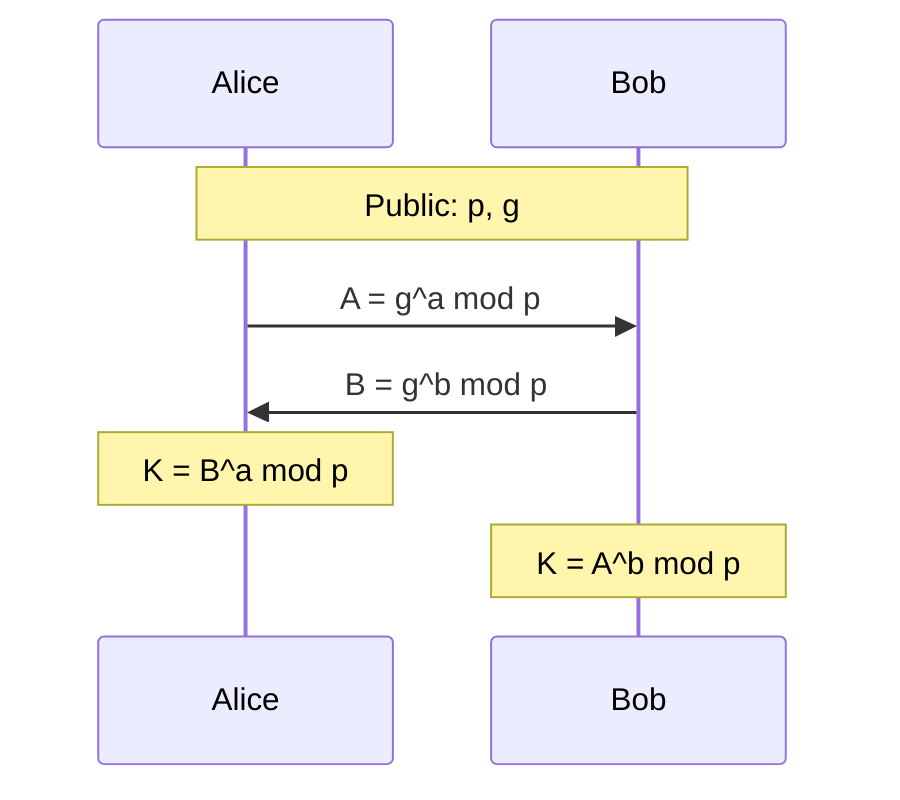

# Volume 03 — Symmetric and Asymmetric Cryptography

**Lectures L19–L27** · Weeks 7–9

---

## L19: Data Encryption Standard

### Learning objectives

- Describe the DES algorithm structure.
- Analyze DES security and its limitations.

### DES overview

The **Data Encryption Standard** (FIPS 46, 1977) is a 64-bit block cipher with a 56-bit effective key (64 bits with 8 parity bits).

### Feistel structure

DES uses a **Feistel network**—the plaintext block is split into left (\(L\)) and right (\(R\)) halves:

\[
\begin{aligned}
L_i &= R_{i-1} \\
R_i &= L_{i-1} \oplus f(R_{i-1}, K_i)
\end{aligned}
\]

16 rounds with round keys \(K_1, \ldots, K_{16}\) derived from the 56-bit key via a key schedule.

### Round function \(f\)

1. **Expansion** — 32 bits → 48 bits
2. **Key mixing** — XOR with round key \(K_i\)
3. **S-box substitution** — 8 S-boxes, 6 bits in → 4 bits out
4. **P-box permutation** — 32-bit permutation

### DES decryption

Feistel structure allows decryption using the same function with reversed round keys:

\[
K_{16}, K_{15}, \ldots, K_1
\]

### Security analysis

| Attack | Complexity | Status |
|--------|------------|--------|
| Brute force | \(2^{56}\) | Feasible since 1998 (EFF Deep Crack) |
| Differential cryptanalysis | \(2^{47}\) chosen plaintexts | Known since design |
| Linear cryptanalysis | \(2^{43}\) known plaintexts | Matsui, 1993 |

**Conclusion:** DES is deprecated. Use AES.

### Triple DES (3DES)

Apply DES three times: \(C = E_{K_3}(D_{K_2}(E_{K_1}(P))\).

Effective key length: 112 or 168 bits. Still used in legacy systems but being phased out.

---

## L20: Advanced Encryption Standards

### Learning objectives

- Explain the AES selection process.
- Describe the AES algorithm structure at a high level.

### AES background

In 1997, NIST called for a successor to DES. After evaluation of 15 candidates, **Rijndael** (Joan Daemen and Vincent Rijmen) was selected as AES in 2001 (FIPS 197).

### AES parameters

| Parameter | Value |
|-----------|-------|
| Block size | 128 bits |
| Key size | 128, 192, or 256 bits |
| Rounds | 10 (128-bit key), 12 (192-bit), 14 (256-bit) |

### AES is not a Feistel cipher

AES uses a **Substitution-Permutation Network (SPN)**—each round transforms the entire 128-bit state (organized as a 4×4 byte matrix).

### AES round structure

Each round (except the last) consists of four operations:

1. **SubBytes** — S-box substitution (nonlinear)
2. **ShiftRows** — cyclic row shifts
3. **MixColumns** — linear mixing of columns (GF(2⁸) matrix multiply)
4. **AddRoundKey** — XOR with round key

Final round omits MixColumns.

### Key expansion

The cipher key is expanded into \(N_r + 1\) round keys (128 bits each) using a key schedule with RotWord, SubWord, and Rcon operations.

### Security

No practical attacks on full AES. Best known attack on AES-128: biclique attack with complexity \(2^{126.1}\)—still infeasible.

---

## L21: The AES Cipher

### Learning objectives

- Walk through AES encryption step by step.
- Implement SubBytes, ShiftRows, and MixColumns.

### State representation

The 128-bit block is arranged as a 4×4 matrix of bytes (column-major order):

\[
\text{State} = \begin{pmatrix}
s_{0,0} & s_{0,1} & s_{0,2} & s_{0,3} \\
s_{1,0} & s_{1,1} & s_{1,2} & s_{1,3} \\
s_{2,0} & s_{2,1} & s_{2,2} & s_{2,3} \\
s_{3,0} & s_{3,1} & s_{3,2} & s_{3,3}
\end{pmatrix}
\]

### SubBytes

Each byte is replaced via the AES S-box—a lookup table providing nonlinearity:

\[
s'_{i,j} = \text{SBox}(s_{i,j})
\]

The S-box is constructed from multiplicative inverse in \(GF(2^8)\) followed by an affine transformation.

### ShiftRows

Row \(r\) is cyclically shifted left by \(r\) positions:

```
Row 0: no shift
Row 1: shift left by 1
Row 2: shift left by 2
Row 3: shift left by 3
```

### MixColumns

Each column is multiplied by a fixed \(4 \times 4\) matrix over \(GF(2^8)\):

\[
\begin{pmatrix} s'_{0,c} \\ s'_{1,c} \\ s'_{2,c} \\ s'_{3,c} \end{pmatrix}
=
\begin{pmatrix}
02 & 03 & 01 & 01 \\
01 & 02 & 03 & 01 \\
01 & 01 & 02 & 03 \\
03 & 01 & 01 & 02
\end{pmatrix}
\begin{pmatrix} s_{0,c} \\ s_{1,c} \\ s_{2,c} \\ s_{3,c} \end{pmatrix}
\]

### AddRoundKey

\[
\text{State} = \text{State} \oplus \text{RoundKey}
\]

### Full encryption (AES-128)

```
Round 0:    AddRoundKey(State, K₀)
Rounds 1–9: SubBytes → ShiftRows → MixColumns → AddRoundKey
Round 10:   SubBytes → ShiftRows → AddRoundKey(K₁₀)
```

### Galois field arithmetic

AES operations use \(GF(2^8)\) with irreducible polynomial \(m(x) = x^8 + x^4 + x^3 + x + 1\).

Multiplication by 02 (hex): left shift; if overflow, XOR with 0x1B.

---

## L22: Public Key Encryption

### Learning objectives

- Explain the concept of public-key cryptography.
- Compare public-key and symmetric-key systems.

### The key distribution problem

Symmetric cryptography requires both parties to share a secret key. For \(n\) users, \(n(n-1)/2\) keys are needed. Secure key distribution over insecure channels is the fundamental challenge.

### Public-key cryptography (Diffie-Hellman concept, 1976)

Each user has a **key pair**:
- **Public key** \(K_{pub}\) — published openly
- **Private key** \(K_{priv}\) — kept secret

\[
D_{K_{priv}}(E_{K_{pub}}(M)) = M
\]

### One-way functions

Public-key cryptography relies on **one-way functions**—easy to compute, hard to invert:

| Function | Easy direction | Hard direction |
|----------|---------------|----------------|
| Integer multiplication | \(p \times q\) | Factor \(n = pq\) |
| Modular exponentiation | \(g^x \mod p\) | Discrete logarithm |
| Elliptic curve scalar mult | \(kP\) | Elliptic curve discrete log |

### Hybrid cryptosystems

In practice, public-key crypto is used for **key exchange** and **signatures**; symmetric crypto handles bulk data:

1. Generate random session key \(K_s\)
2. Encrypt message: \(C = E_{K_s}(M)\) (AES)
3. Encrypt session key: \(C_k = E_{K_{pub}}(K_s)\) (RSA)
4. Send \((C, C_k)\)

### Requirements for public-key algorithms

1. Computationally easy to generate key pairs
2. Easy to encrypt/decrypt with correct key
3. Infeasible to derive private key from public key
4. Infeasible to recover plaintext without private key

---

## L23: RSA Algorithm

### Learning objectives

- Describe RSA key generation, encryption, and decryption.
- Work through a numerical example.

### RSA (Rivest, Shamir, Adleman, 1978)

Based on the difficulty of factoring large integers.

### Key generation

1. Choose two large primes \(p\) and \(q\)
2. Compute \(n = p \times q\) and \(\phi(n) = (p-1)(q-1)\)
3. Choose \(e\) such that \(1 < e < \phi(n)\) and \(\gcd(e, \phi(n)) = 1\)
4. Compute \(d \equiv e^{-1} \pmod{\phi(n)}\)
5. **Public key:** \((n, e)\); **Private key:** \((n, d)\)

### Encryption

\[
C = M^e \mod n
\]

### Decryption

\[
M = C^d \mod n
\]

### Correctness proof

By Euler's theorem, since \(\gcd(M, n) = 1\):

\[
C^d = (M^e)^d = M^{ed} = M^{1 + k\phi(n)} = M \cdot (M^{\phi(n)})^k \equiv M \pmod{n}
\]

### Numerical example

Let \(p = 3\), \(q = 11\), so \(n = 33\), \(\phi(n) = 20\).

Choose \(e = 3\) (since \(\gcd(3, 20) = 1\)).

\(d = 7\) (since \(3 \times 7 = 21 \equiv 1 \pmod{20}\)).

Encrypt \(M = 5\): \(C = 5^3 \mod 33 = 125 \mod 33 = 26\).

Decrypt: \(M = 26^7 \mod 33 = 5\). ✓

### Practical considerations

- Key sizes: minimum 2048 bits (3072+ recommended for long-term security)
- Use **OAEP padding** for encryption (prevent chosen-ciphertext attacks)
- Use **CRT** (Chinese Remainder Theorem) for efficient decryption
- Never use textbook RSA without padding in practice

---

## L24: The Security of RSA

### Learning objectives

- Analyze attacks on RSA.
- Apply proper padding and key size guidelines.

### Factoring attack

If an attacker factors \(n = pq\), they compute \(\phi(n)\) and derive \(d\). Security depends on factoring difficulty.

| Key size | Estimated security level |
|----------|-------------------------|
| 1024 bits | Deprecated |
| 2048 bits | ~112-bit security |
| 3072 bits | ~128-bit security |
| 4096 bits | ~152-bit security |

### Mathematical attacks

| Attack | Condition | Mitigation |
|--------|-----------|------------|
| Small \(e\) | \(e = 3\), small \(M\) | OAEP padding |
| Common modulus | Same \(n\), different users | Unique \(n\) per user |
| Low \(d\) | \(d < n^{1/4}\) | Wiener's attack; use large \(d\) |
| Partial key exposure | Bits of \(d\) known | Generate keys properly |

### Side-channel attacks

- **Timing attacks** — measure decryption time
- **Power analysis** — monitor power consumption during operations
- **Fault injection** — induce errors to leak key bits

**Mitigation:** constant-time implementations, blinding.

### Padding schemes

**PKCS #1 v1.5 / OAEP** for encryption:

\[
C = (M \| \text{padding})^{e} \mod n
\]

**PSS** for signatures. Never use RSA without proper padding.

### Post-quantum threat

Shor's algorithm factors integers in polynomial time on a quantum computer. NIST is standardizing post-quantum replacements (CRYSTALS-Kyber for encryption, CRYSTALS-Dilithium for signatures).

---

## L25: Diffie-Hellman Key Exchange

### Learning objectives

- Explain the Diffie-Hellman protocol.
- Analyze security based on the discrete logarithm problem.

### The problem

Alice and Bob want to agree on a shared secret key over an insecure channel without prior shared secret.

### Diffie-Hellman protocol (1976)

**Public parameters:** large prime \(p\) and generator \(g\) of \(\mathbb{Z}_p^*\).

1. Alice chooses private \(a\); sends \(A = g^a \mod p\)
2. Bob chooses private \(b\); sends \(B = g^b \mod p\)
3. Alice computes: \(K = B^a = g^{ab} \mod p\)
4. Bob computes: \(K = A^b = g^{ab} \mod p\)



### Security

Based on the **Discrete Logarithm Problem (DLP):** given \(g\), \(p\), and \(g^x \mod p\), find \(x\).

Best classical algorithm: Number Field Sieve, sub-exponential.

### Man-in-the-middle attack

DH alone provides no authentication. Attacker intercepts and replaces \(A\) and \(B\) with their own values.

**Mitigation:** authenticate DH messages with digital signatures or use **authenticated DH** within TLS.

### Ephemeral DH (DHE / ECDHE)

Use fresh DH parameters for each session (forward secrecy). Standard in TLS 1.2 and 1.3.

### Parameter requirements

- Prime \(p\) should be ≥ 2048 bits
- Use safe primes: \(p = 2q + 1\) where \(q\) is also prime
- Avoid small subgroups

---

## L26: ECC Cryptography

### Learning objectives

- Describe elliptic curve cryptography fundamentals.
- Compare ECC with RSA for equivalent security.

### Elliptic curves

An elliptic curve over a finite field is defined by:

\[
E: y^2 = x^3 + ax + b \pmod{p}
\]

Points on the curve form an abelian group under a geometric addition operation.

### Point addition

For points \(P\) and \(Q\) on the curve:

- **Addition** \(P + Q\): draw line through \(P\) and \(Q\); find third intersection; reflect over x-axis.
- **Doubling** \(2P\): tangent line at \(P\); reflect intersection.
- **Scalar multiplication** \(kP = P + P + \cdots + P\) (\(k\) times).

### ECDLP

**Elliptic Curve Discrete Logarithm Problem:** given points \(P\) and \(Q = kP\), find scalar \(k\).

No known sub-exponential algorithm—ECC achieves equivalent security with much smaller keys.

### Key size comparison

| Security level | RSA key | ECC key |
|----------------|---------|---------|
| 80-bit | 1024 bits | 160 bits |
| 112-bit | 2048 bits | 224 bits |
| 128-bit | 3072 bits | 256 bits |
| 256-bit | 15360 bits | 512 bits |

### ECDH key exchange

Same protocol as DH, but in the elliptic curve group:

1. Alice: private \(a\), public \(A = aG\)
2. Bob: private \(b\), public \(B = bG\)
3. Shared secret: \(K = aB = bA = abG\)

where \(G\) is the base point (generator).

### ECDSA

Elliptic Curve Digital Signature Algorithm—analog of DSA using elliptic curves. Used in Bitcoin, TLS, and many modern protocols.

### Curve selection

Use standardized curves (NIST P-256, Curve25519) with verified parameters. Avoid generating custom curves.

---

## L27: Message Authentication

### Learning objectives

- Distinguish encryption from authentication.
- Implement Message Authentication Codes (MACs).

### Why encryption ≠ authentication

Encryption provides confidentiality but not integrity. An attacker can modify ciphertext, causing predictable changes in plaintext (bit-flipping attack in CBC mode).

### Message Authentication Code (MAC)

A MAC provides **integrity and authenticity** using a shared secret key:

\[
\text{MAC} = f(K, M)
\]

Receiver verifies: \(\text{MAC}' = f(K, M')\) matches received MAC.

### MAC properties

1. **Unforgeability** — without key \(K\), cannot produce valid MAC for new message
2. **Deterministic** — same key and message always produce same MAC
3. **Key-dependent** — different keys produce different MACs

### HMAC (Hash-based MAC)

\[
\text{HMAC}(K, M) = H\!\left((K \oplus \text{opad}) \| H\!\left((K \oplus \text{ipad}) \| M\right)\right)
\]

where \(H\) is a cryptographic hash (SHA-256), and opad/ipad are fixed padding constants.

HMAC is secure if the underlying hash is collision-resistant.

### MAC vs. digital signature

| Property | MAC | Digital signature |
|----------|-----|-------------------|
| Key type | Symmetric (shared) | Asymmetric (public/private) |
| Speed | Fast | Slower |
| Non-repudiation | No (both parties have key) | Yes (only signer has private key) |
| Use | TLS record layer, API auth | Contracts, certificates |

### Authenticated encryption

Modern practice combines encryption and authentication:

- **AES-GCM** — Galois/Counter Mode
- **ChaCha20-Poly1305** — used in TLS 1.3

\[
C, T = \text{Encrypt}(K_e, M), \quad T = \text{MAC}(K_m, C)
\]

Never encrypt without authenticating.

---

## Volume 03 summary

| Lecture | Core concept |
|---------|-------------|
| L19 | DES structure, Feistel network |
| L20 | AES selection, SPN structure |
| L21 | AES round operations |
| L22 | Public-key cryptography |
| L23 | RSA algorithm |
| L24 | RSA security |
| L25 | Diffie-Hellman key exchange |
| L26 | Elliptic curve cryptography |
| L27 | Message authentication, HMAC |

**Previous:** [Volume 02](vol-02.md) · **Next:** [Volume 04 — Hash, Signatures, PKI](vol-04.md)
