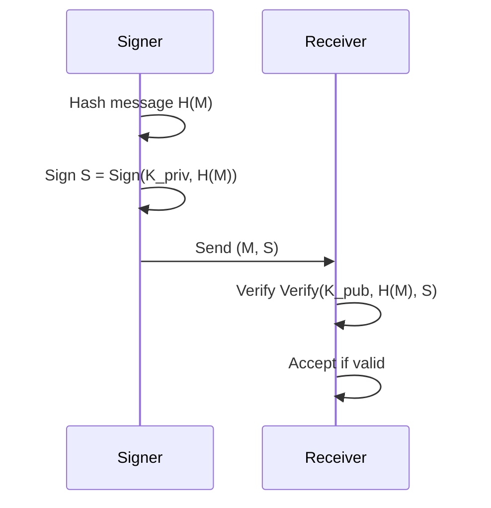
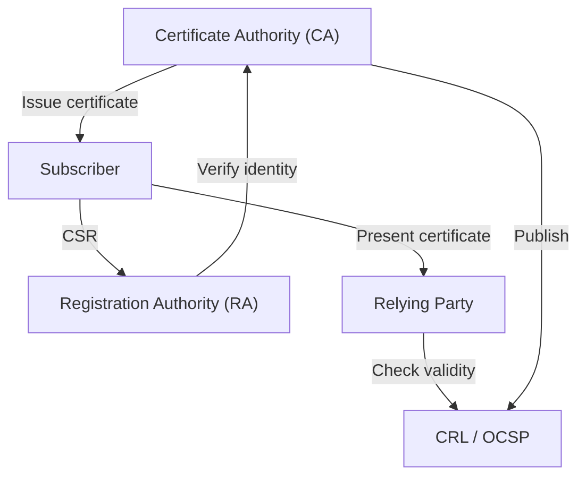
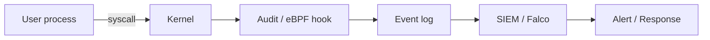

# Volume 04 — Hash Functions, Digital Signatures, PKI, and Auditing

**Lectures L28–L36** · Weeks 10–12

---

## L28: Cryptographic Hash Functions

### Learning objectives

- Define cryptographic hash function properties.
- Compare SHA family algorithms.

### Hash function definition

A **hash function** \(H\) maps arbitrary-length input to a fixed-length output (digest):

\[
H: \{0,1\}^* \to \{0,1\}^n
\]

### Required properties

| Property | Definition |
|----------|------------|
| **Preimage resistance** | Given \(h\), hard to find \(m\) such that \(H(m) = h\) |
| **Second preimage resistance** | Given \(m_1\), hard to find \(m_2 \neq m_1\) with \(H(m_1) = H(m_2)\) |
| **Collision resistance** | Hard to find any \(m_1 \neq m_2\) with \(H(m_1) = H(m_2)\) |

### Birthday attack

For an \(n\)-bit hash, collision finding requires approximately \(2^{n/2}\) operations (birthday paradox). Therefore:

| Hash | Output size | Collision resistance |
|------|-------------|---------------------|
| MD5 | 128 bits | Broken (2004) |
| SHA-1 | 160 bits | Broken (2017, SHAttered) |
| SHA-256 | 256 bits | Secure (~128-bit collision resistance) |
| SHA-3 | 256 bits | Secure (different construction) |

### Merkle-Damgård construction

Most hash functions (SHA-256) use the Merkle-Damgård construction:

1. Pad message to multiple of block size
2. Process each block sequentially: \(h_i = f(h_{i-1}, M_i)\)
3. Final \(h_n\) is the digest

**Weakness:** length extension attack—given \(H(M)\), can compute \(H(M \| M')\) without knowing \(M\). Mitigated by HMAC.

### SHA-256

Part of the SHA-2 family. Processes 512-bit blocks, produces 256-bit digest. Used in Bitcoin, TLS, and most modern applications.

### Applications

- Password storage (with salt)
- Digital signatures
- Message authentication (HMAC)
- Integrity verification
- Blockchain (proof of work)
- Merkle trees for efficient verification

---

## L29: Digital Signature

### Learning objectives

- Explain digital signature schemes.
- Describe the signing and verification process.

### Digital signature properties

A digital signature provides:

1. **Authentication** — verifies signer identity
2. **Integrity** — detects message modification
3. **Non-repudiation** — signer cannot deny signing

### RSA signature scheme

**Key generation:** same as RSA encryption.

**Signing** (with private key \((n, d)\)):

\[
S = H(M)^d \mod n
\]

**Verification** (with public key \((n, e)\)):

\[
H(M) \stackrel{?}{=} S^e \mod n
\]

### Signature process



### RSA-PSS and ECDSA

In practice, use standardized signature schemes:

- **RSA-PSS** (Probabilistic Signature Scheme) — randomized padding
- **ECDSA** — elliptic curve signatures; smaller keys, faster

### Properties of secure signatures

| Attack | Description | Defense |
|--------|-------------|---------|
| Existential forgery | Create valid \((M, S)\) for some \(M\) | Strong hash function |
| Universal forgery | Forge for any message | Proper key generation |
| Replay | Resend old valid signature | Timestamps, nonces |

### Legal status

Digital signatures are legally recognized in many jurisdictions (IT Act 2000 in India, eIDAS in EU, ESIGN Act in US).

---

## L30: Symmetric Key and Public Key Signature

### Learning objectives

- Compare symmetric and asymmetric signature schemes.
- Select appropriate signature algorithm for applications.

### Symmetric signatures (MAC-based)

Using HMAC or CMAC with a shared secret key:

\[
T = \text{HMAC}(K, M)
\]

| Advantage | Disadvantage |
|-----------|-------------|
| Very fast | Requires shared secret |
| Simple implementation | No non-repudiation |
| Low overhead | Key distribution problem |

**Use cases:** TLS record authentication, API request signing, internal system integrity.

### Public key signatures

Using RSA, ECDSA, or EdDSA with a private/public key pair:

| Advantage | Disadvantage |
|-----------|-------------|
| Non-repudiation | Slower than MAC |
| No shared secret needed | Larger signature size |
| Verifiable by anyone with public key | Key management (PKI) |

**Use cases:** Software distribution, email (S/MIME), certificates, blockchain transactions.

### Comparison table

| Criterion | HMAC (symmetric) | RSA/ECDSA (asymmetric) |
|-----------|------------------|------------------------|
| Key type | Shared secret | Public/private pair |
| Speed | ~GB/s | ~MB/s |
| Signature size | 32 bytes (SHA-256) | 256–512 bytes |
| Non-repudiation | No | Yes |
| Third-party verification | Requires shared key | Public key sufficient |

### Hybrid approach

Many protocols use both:

1. **TLS handshake:** asymmetric signatures for authentication
2. **TLS data transfer:** symmetric MAC (AEAD) for record integrity
3. **Code signing:** asymmetric signature on hash of binary
4. **API authentication:** HMAC for speed, with key derived from asymmetric exchange

---

## L31: Message Digests

### Learning objectives

- Apply message digests for integrity verification.
- Construct and use Merkle trees.

### Message digest

A **message digest** is the output of a hash function applied to a message. It serves as a compact, fixed-size "fingerprint" of arbitrary-length data.

### Integrity verification

```
Sender:                          Receiver:
digest = H(file)                 received_digest = H(received_file)
send(file, digest)       →       if digest == received_digest:
                                     file integrity confirmed
```

If a single bit changes, the digest changes (avalanche effect).

### Avalanche effect

A good hash function exhibits the **avalanche effect**: changing one input bit changes approximately half the output bits on average.

### Merkle tree

A **Merkle tree** enables efficient verification of large datasets:

```
         H(H01 || H23)
        /              \
    H(H0||H1)        H(H2||H3)
    /      \          /      \
   H0      H1       H2      H3
   |       |        |       |
  D0      D1       D2      D3
```

To verify \(D_2\): need \(H_3\), \(H_{01}\), and root hash—only \(\log_2(n)\) hashes instead of \(n\).

### Applications

| Application | Digest usage |
|-------------|-------------|
| Git | SHA-1 of file contents (transitioning to SHA-256) |
| Bitcoin | SHA-256 double-hash of transactions |
| Software distribution | SHA-256 of installer for verification |
| Certificate transparency | Merkle tree of certificates |

### File integrity tools

- `sha256sum` / `md5sum` — command-line digest computation
- Tripwire (L35) — automated integrity monitoring
- `rpm -V` / `dpkg --verify` — package integrity checking

---

## L32: Public Key Infrastructure

### Learning objectives

- Describe PKI components and certificate lifecycle.
- Explain the chain of trust.

### PKI components



| Component | Role |
|-----------|------|
| **CA** | Issues and signs digital certificates |
| **RA** | Verifies subscriber identity before CA issues certificate |
| **Repository** | Stores certificates and CRLs |
| **Subscriber** | Entity requesting a certificate |
| **Relying party** | Entity verifying a certificate |

### X.509 certificate structure

```
Certificate:
  Version
  Serial Number
  Signature Algorithm
  Issuer (CA name)
  Validity (not before, not after)
  Subject (entity name)
  Subject Public Key Info
  Extensions (key usage, SAN, etc.)
  Signature (CA's signature over above fields)
```

### Chain of trust

```
Root CA (self-signed)
  └── Intermediate CA
        └── End-entity certificate (e.g., www.example.com)
```

The relying party verifies each certificate in the chain up to a trusted root CA in their trust store.

### Certificate lifecycle

1. **Key generation** — subscriber generates key pair
2. **CSR** — Certificate Signing Request sent to CA
3. **Verification** — RA verifies identity
4. **Issuance** — CA signs and issues certificate
5. **Use** — subscriber presents certificate
6. **Revocation** — CA adds to CRL or OCSP if compromised
7. **Expiration** — certificate expires; must renew

### Revocation

| Method | Description |
|--------|-------------|
| CRL (Certificate Revocation List) | Periodically published list of revoked serial numbers |
| OCSP (Online Certificate Status Protocol) | Real-time revocation check |
| OCSP Stapling | Server includes OCSP response in TLS handshake |

---

## L33: Security Mechanisms — An Overview

### Learning objectives

- Survey security mechanisms across the OSI/TCP-IP stack.
- Integrate cryptographic services into system design.

### Security mechanisms taxonomy

| Mechanism | Layer | Purpose |
|-----------|-------|---------|
| Encryption | Application, Transport | Confidentiality |
| Digital signatures | Application | Authentication, non-repudiation |
| Access control | Application, OS | Authorization |
| Firewalls | Network | Packet filtering |
| IDS/IPS | Network | Intrusion detection/prevention |
| VPN (IPsec) | Network | Encrypted tunnels |
| MAC filtering | Data link | Physical access control |
| Biometrics | Physical | Authentication |

### Defense in depth architecture

```
┌─────────────────────────────────────────────┐
│  Application: Input validation, WAF, auth   │
├─────────────────────────────────────────────┤
│  Transport: TLS 1.3, certificate pinning    │
├─────────────────────────────────────────────┤
│  Network: Firewall, IDS, segmentation       │
├─────────────────────────────────────────────┤
│  Host: Antivirus, patching, hardening       │
├─────────────────────────────────────────────┤
│  Data: Encryption at rest, backup, DLP      │
├─────────────────────────────────────────────┤
│  Physical: Locks, badges, surveillance        │
└─────────────────────────────────────────────┘
```

### IPsec

Provides network-layer security:

- **AH (Authentication Header)** — integrity and authentication
- **ESP (Encapsulating Security Payload)** — encryption + authentication
- **Modes:** Transport (host-to-host) or Tunnel (gateway-to-gateway)

### TLS/SSL

Secures transport-layer communication:

1. Handshake: negotiate cipher suite, authenticate (certificates), establish session keys
2. Record protocol: encrypt and authenticate application data

TLS 1.3 improvements: faster handshake, removed weak ciphers, mandatory forward secrecy.

### Security policy framework

1. **Identify** assets and threats
2. **Protect** with appropriate mechanisms
3. **Detect** via monitoring and auditing
4. **Respond** to incidents
5. **Recover** and improve

---

## L34: Auditing and Logging

### Learning objectives

- Design an effective audit logging strategy.
- Analyze logs for security events.

### Purpose of auditing

**Auditing** records security-relevant events to:

- Detect unauthorized access and policy violations
- Support forensic investigation after incidents
- Demonstrate compliance (SOX, HIPAA, PCI-DSS)
- Provide accountability (who did what, when)

### What to log

| Category | Events |
|----------|--------|
| Authentication | Login success/failure, logout, MFA events |
| Authorization | Access granted/denied, privilege changes |
| System | Service start/stop, configuration changes |
| Application | Input validation failures, errors |
| Network | Firewall blocks, connection attempts |

### Log properties

1. **Completeness** — capture all security-relevant events
2. **Integrity** — protect logs from tampering
3. **Confidentiality** — restrict access to logs
4. **Availability** — ensure logs are accessible when needed
5. **Timeliness** — near-real-time for detection

### Log management

```
Sources → Collector → Centralized store → Analysis → Alert/Report
(syslog,   (Splunk,    (SIEM,            (correlation,  (SOC,
 auditd)    ELK)        WORM storage)      ML)           dashboard)
```

### SIEM (Security Information and Event Management)

Correlates events across sources to detect patterns:

- Multiple failed logins → brute force attack
- Login from unusual location → account compromise
- Privilege escalation after login → insider threat

### Compliance requirements

| Standard | Logging requirement |
|----------|---------------------|
| PCI-DSS | Log all access to cardholder data |
| HIPAA | Audit access to PHI |
| ISO 27001 | Event logging and monitoring (A.12.4) |
| IT Act 2000 | Interception and monitoring provisions |

### Best practices

- Synchronize clocks (NTP) across all systems
- Ship logs to centralized, tamper-resistant storage
- Retain logs per compliance requirements (typically 1–7 years)
- Protect log integrity with digital signatures or write-once media
- Regularly review and test alerting rules

---

## L35: Trip Wire

### Learning objectives

- Explain file integrity monitoring with Tripwire.
- Deploy and configure integrity checking tools.

### Tripwire concept

**Tripwire** is a file integrity monitoring (FIM) tool that detects unauthorized changes to critical system files by comparing current file attributes against a known-good baseline.

### How Tripwire works

1. **Initialize database** — compute hashes and metadata of monitored files
2. **Store baseline** — save database securely (ideally offline or tamper-protected)
3. **Periodic check** — recompute hashes and compare against baseline
4. **Report changes** — alert on any modification, addition, or deletion

### Monitored attributes

| Attribute | Detects |
|-----------|---------|
| File hash (SHA-256) | Content modification |
| File size | Truncation or append |
| Permissions (mode) | Permission changes |
| Owner/group | Ownership changes |
| Modification time | When file was changed |
| Inode | File replacement (same name, different file) |

### Tripwire policy file

```
/etc/passwd -> $(ReadOnly) ;
/etc/shadow -> $(ReadOnly) ;
/usr/bin -> $(ReadOnly) ;
/boot -> $(ReadOnly) ;
/var/log -> $(Growing) ;    # Expected to grow
/tmp -> $(Dynamic) ;        # Expected to change
```

### Response to violations

| Severity | Response |
|----------|----------|
| Critical file modified | Immediate investigation; isolate system |
| New file in system directory | Analyze; possible rootkit |
| Permission change | Verify authorized change |
| Expected change (patch) | Update baseline after verification |

### Modern alternatives

| Tool | Platform | Features |
|------|----------|----------|
| Tripwire | Linux, Unix | Classic FIM |
| AIDE | Linux | Open-source alternative |
| OSSEC | Cross-platform | HIDS with FIM module |
| Wazuh | Cross-platform | Open-source SIEM + FIM |
| Microsoft Defender | Windows | Controlled folder access |

### Integration with incident response

FIM alerts should feed into the SIEM and trigger incident response procedures:

1. Alert received → triage severity
2. Isolate affected system if critical
3. Forensic analysis of changed files
4. Determine root cause (patch, attack, misconfiguration)
5. Remediate and update baseline

---

## L36: System Call Monitoring

### Learning objectives

- Monitor system calls for intrusion detection.
- Use audit frameworks for kernel-level security monitoring.

### System calls

**System calls** are the interface between user-space programs and the OS kernel. Every privileged operation (file I/O, network, process creation) goes through system calls.

### Why monitor system calls?

Malware and attackers interact with the OS through system calls. Monitoring reveals:

- Unauthorized file access
- Process injection
- Network connections from unexpected processes
- Privilege escalation attempts
- Configuration tampering

### Linux audit framework (auditd)

The Linux **audit subsystem** logs system calls and file access:

```bash
# Monitor all execve system calls
auditctl -a always,exit -F arch=b64 -S execve -k process_monitor

# Watch a specific file
auditctl -w /etc/passwd -p wa -k passwd_changes

# Monitor privilege escalation
auditctl -a always,exit -F euid=0 -S execve -k root_commands
```

### Key system calls to monitor

| Syscall | Purpose | Security relevance |
|---------|---------|-------------------|
| `execve` | Execute program | Detect malware execution |
| `open`/`openat` | Open file | Unauthorized file access |
| `connect` | Network connection | C2 communication |
| `ptrace` | Debug process | Process injection |
| `setuid`/`setgid` | Change privileges | Privilege escalation |
| `chmod`/`chown` | Change permissions | Tampering |
| `unlink`/`rename` | Delete/rename file | Evidence destruction |

### eBPF-based monitoring

Modern tools use **eBPF** (extended Berkeley Packet Filter) for efficient kernel-level monitoring:

| Tool | Capability |
|------|------------|
| Falco | Runtime threat detection for containers |
| bpftrace | Dynamic tracing and monitoring |
| Sysdig | System call capture and analysis |

### Syscall monitoring architecture



### Detection rules (examples)

```
# Detect reverse shell
- Process: /bin/bash with network connection
- Syscall: dup2 + connect from shell process

# Detect credential dumping
- File access: /etc/shadow by non-root process
- Syscall: openat on sensitive files

# Detect container escape
- Syscall: mount from within container
- Process: unexpected access to /proc/1
```

### Course conclusion

This course covered the full spectrum of information security—from fundamental principles and threat analysis through classical and modern cryptography, public key infrastructure, and security monitoring. The concepts developed here provide a foundation for securing systems, networks, and data in professional practice.

**Key themes:**
1. Security is layered—no single mechanism suffices
2. Cryptography provides the mathematical tools for confidentiality, integrity, and authentication
3. Monitoring and auditing enable detection and accountability
4. Security is an ongoing process, not a one-time implementation

---

## Volume 04 summary

| Lecture | Core concept |
|---------|-------------|
| L28 | Cryptographic hash functions |
| L29 | Digital signatures |
| L30 | Symmetric vs. public key signatures |
| L31 | Message digests, Merkle trees |
| L32 | Public key infrastructure |
| L33 | Security mechanisms overview |
| L34 | Auditing and logging |
| L35 | Tripwire (file integrity monitoring) |
| L36 | System call monitoring |

**Previous:** [Volume 03](vol-03.md)
